## 剑指offer


## 2.3数据结构

### 2.3.1 数组

- 面试题4：二维数组中的查找。

  

  - 题解：

    

  - 测试用例：

    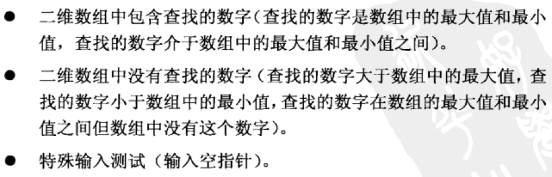
  
  - Python3解答：
  
    ```python
    class Solution:
        def searchMatrix(self, matrix, target):
            """
            :type matrix: List[List[int]]
            :type target: int
            :rtype: bool
            """
            if len(matrix) == 0 or len(matrix[0]) == 0:
                return False
    
            row = 0
            col = len(matrix[0]) - 1
            rownum = len(matrix) - 1
            
            while row <= rownum and col >= 0:
                if matrix[row][col] == target:
                    return True
                elif matrix[row][col] < target:
                    row += 1
                else:
                    col -= 1
          return False
    ```
  
  - 二分查找的方法：
  
    ```python
    class Solution:
        def binary_search(self, matrix, target, start, vertical):
            lo = start
            hi = len(matrix[0])-1 if vertical else len(matrix)-1
    
            while hi >= lo:
                mid = (lo + hi)//2
                if vertical: # searching a column
                    if matrix[start][mid] < target:
                        lo = mid + 1
                    elif matrix[start][mid] > target:
                        hi = mid - 1
                    else:
                        return True
                else: # searching a row
                    if matrix[mid][start] < target:
                        lo = mid + 1
                    elif matrix[mid][start] > target:
                        hi = mid - 1
                    else:
                        return True
            
            return False
    
        def searchMatrix(self, matrix, target):
            # an empty matrix obviously does not contain `target`
            if not matrix:
                return False
    
            # iterate over matrix diagonals starting in bottom left.
            for i in range(min(len(matrix), len(matrix[0]))):
                vertical_found = self.binary_search(matrix, target, i, True)
                horizontal_found = self.binary_search(matrix, target, i, False)
                if vertical_found or horizontal_found:
                  return True
            
            return False
    ```
  
    

### 2.3.2 字符串

- 面试题5：替换空格。

  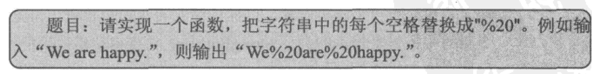

  - 题解：

    

  - 测试用例：

    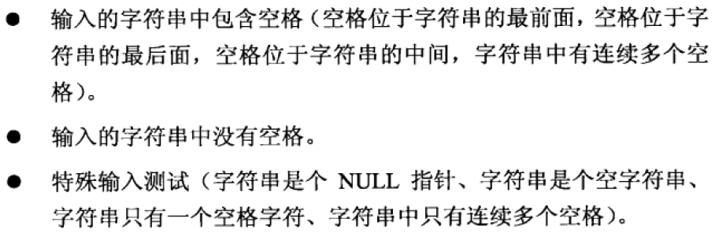

  - Python3解答：

    > 在 Python 和 Java 等语言中，字符串都被设计成不可变的类型，即无法直接修改字符串的某一位字符，需要新建一个字符串实现。所以这道题对Python和Java描述的意义不大。

    ```python
    class Solution:
        def replaceSpace(self, s: str) -> str:
            res = []
            for c in s:
                if c == ' ': res.append("%20")
                else: res.append(c)
            return "".join(res)
    ```

  

  

### 2.3.3 链表

  - 面试题6：从头到尾打印链表。

    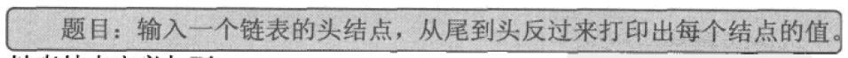

    - 题解：

      

      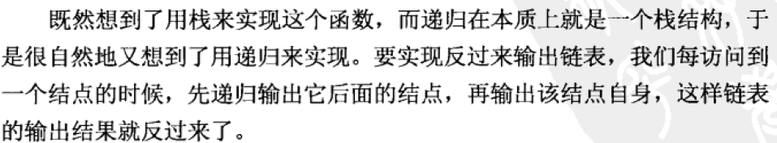

    - 测试用例：

      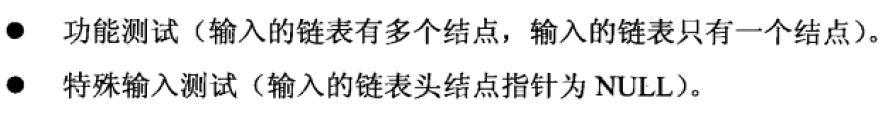

    - Python3解答：

      ```python
      class Solution:
          def reversePrint(self, head: ListNode) -> List[int]:
              stack = []
              while head != None:
                  stack.append(head.val)
                  head = head.next
              return stack[::-1]
      ```


### 2.3.4 树

- 面试题7：重建二叉树。

  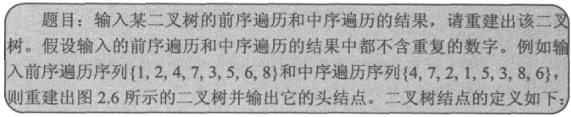

  - 题解：

    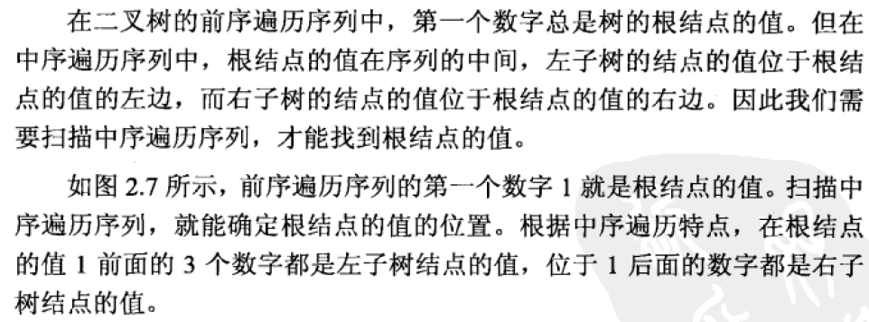

  - Python3题解：

    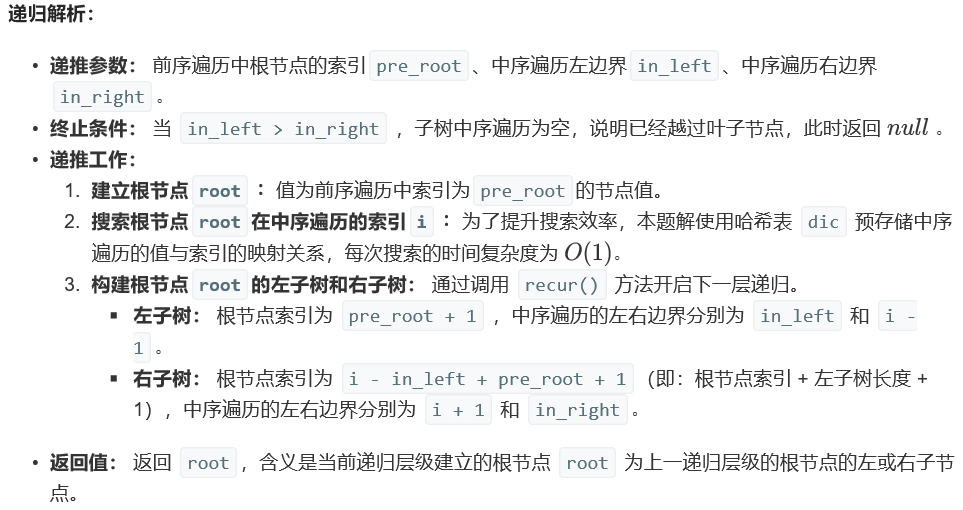

    ```python
    class Solution:
        def buildTree(self, preorder: List[int], inorder: List[int]) -> TreeNode:
            self.dic, self.po = {}, preorder
            for i in range(len(inorder)):
                self.dic[inorder[i]] = i
            return self.recur(0, 0, len(inorder) - 1)
    
        def recur(self, pre_root, in_left, in_right):
            if in_left > in_right: return # 终止条件：中序遍历为空
            root = TreeNode(self.po[pre_root]) # 建立当前子树的根节点
            i = self.dic[self.po[pre_root]]    # 搜索根节点在中序遍历中的索引，从而可对根节点、左子树、右子树完成划分。
            root.left = self.recur(pre_root + 1, in_left, i - 1) # 开启左子树的下层递归
            root.right = self.recur(i - in_left + pre_root + 1, i + 1, in_right) # 开启右子树的下层递归
            return root # 返回根节点，作为上层递归的左（右）子节点
    ```

### 2.3.5 栈和队列

- 面试题9：用两个栈实现队列。

  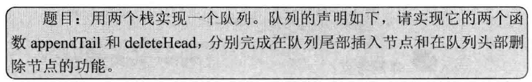

  - 题解：

    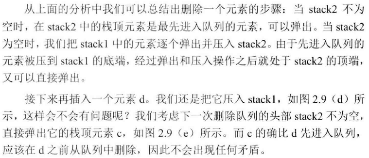

  - 测试用例：

    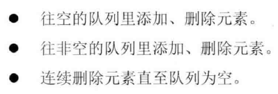

  - Python3题解：

    ```python
    class CQueue:
    
        def __init__(self):
            self.A, self.B = [], []
    
        def appendTail(self, value: int) -> None:
            self.A.append(value)
    
        def deleteHead(self) -> int:
            if self.B: return self.B.pop()
            if not self.A: return -1
            while self.A != []:
                self.B.append(self.A.pop())
            return self.B.pop()
    ```

    - 品味一下问什么不需要把B中的元素再倒回A中。


### 2.4.1 递归和循环

