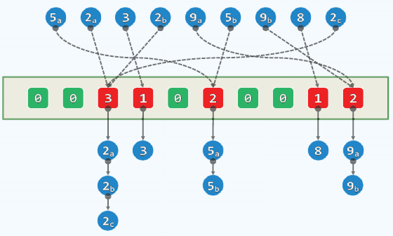
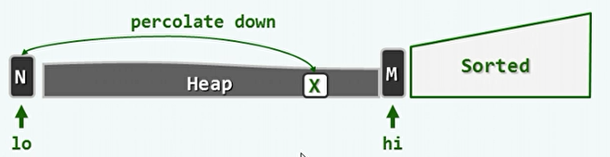
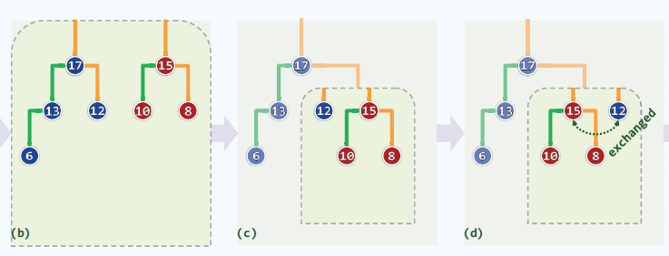

## 1、散列

- 循值访问：直接根据数据的值进行访问。
- 散列表（哈希表）：
  - 桶bucket：直接存放或间接指向一个词条。
  - 桶数组bucket array，容量为M，至少应大于所要容纳的数据大小。
  - 散列：根据词条的key（散列码），直接确定散列表中这个词条的入口位置（通过散列/哈希函数）。
  - 装填因子：散列表中实际存储的词条数 / 散列表长度。
  - 散列冲突：两个不同的key，但是被映射到了同一个桶单元。
- 两项基本任务：
  - 精心设计散列表和散列函数，以尽可能降低冲突的概率。
  - 制定可行的预案，在冲突发生时排解冲突。
- 散列函数：
  - 散列冲突是无法杜绝的，只能通过设计散列函数降低冲突发生的概率。
  - 该函数功能是，从词条空间（可能的词条）映射到地址空间（散列表），因为前者远大于后者，该函数不可能是单射。
  - 可以得到近似的单射：如将彩色图转换为灰度图。

- 散列函数的设计原则：
  - 确定：同一关键码总是被映射到同一地址。
  - 快速：映射的计算快速。
  - 满射：尽可能充分覆盖整个散列空间。
  - 均匀：各个关键码被映射到散列表各个位置的概率接近。
- 散列函数选取：
  - 除余法：
    - 将词条的key除以表长M。
    - 表长取为素数时，发生冲突的概率较小。
    - 缺陷：0点是不动点；相邻关键码的散列地址也相邻（零阶均匀）。
  - MAD法：在除余法的基础上加入a和b两个参数，`hash(key)=(a*key+b)%M`。
  - 数字分析：抽取key中的某几位，构成地址。
  - 平方取中：取key^2的中间几位，构成地址。
  - 折叠法：将key分割为等宽的若干段，取其总和作为地址。
  - 位异或法：将key分割成等宽的二进制段，经异或得到地址。
  - 伪随机数法：伪随机数发生器实际上是根据不同的种子获得的确定序列。但是不同平台上实现可能不同，移植性差。
- 字符串转换为散列值（关键码转为散列码）：
  - 多项式法：
    - 将字符串中每个字符分别转换为整数，然后将这些整数作为一个n次多项式的系数，计算总和。
  - 近似多项式法：使用位运算模拟多项式运算。
  - 如果简单使用将字符串中每个字符分别转换为整数然后相加的方法，字符串的冲突概率很高。


- 冲突排解：
  - 多槽位：
    - 将桶单元细分成若干个槽位，存放与同一单元冲突的词条。
    - 难以预测每个桶需要多少个槽位，难以平衡空间和时间效率。
  - 独立链：
    - 桶单元中存放一个指针，冲突的词条组织成一个列表。
    - 无需为每个桶预留空间，任意多次的冲突都可以解决。
    - 但是，指针需要额外空间，节点需要动态申请。
    - 空间未必连续分布，系统缓存几乎失效。
- 开放定址：
  - 与独立链的封闭定址相对应。
  - 为每个同都事先约定若干个备用桶，他们构成一个查找链。
  - 当一个词条要存储时，不同的桶对其有不同的优先级。查找链就是从优先级最高的桶开始，往优先级低的方向。
  - 闭散列：散列表是一块连续的空间，所有的散列和冲突排解都在这块封闭的空间内完成。
  - 查找过程：沿查找链逐个转向下一个桶单元。直到命中（成功），或抵达一个空桶（失败）。
- 查找链的组织：
  - 线性试探：
    - 一旦冲突，则试探后一个紧邻的桶单元。
    - 无需额外空间。具有局部性，可充分利用系统缓存。
    - 但是为了消除以往的冲突，可能会导致后续的冲突。
  - 懒惰删除：
    - 如果直接删除，会导致查找链被切断，后续词条将丢失。
    - 懒惰删除：仅做删除标记而不清空，查找链仍然连续。
  - 平方试探：
    - 线性试探的问题：试探的间距太小。
    - 以平方数为距离，确定下一试探桶单元。
    - 数据聚集现象有所缓解。
    - 若涉及外存操作，IO访问将激增。但仍是可接受的。
    - 在平方试探的情况下，有可能出现有空桶但试探不到的情况：
      - 如果表长M为合数，则能试探的的桶必然少于[M/2]个。
      - 如果表长M为素数，则能试探的的桶恰好为[M/2]个。
    - 也就是说，在装填因子小于0.5，表长M为素数时，可保证起始于任何位置的查找都找得到（查找的前[M/2]项是互异的）。
  - 双向平方试探：
    - 自冲突位置起，交替的向前和向后试探。
    - 但是正向查找链和逆向查找链可能存在重复的部分，甚至是完全相同的。这主要取决于表长M的不同。
    - 素数的分类（除2以外）：除以4后余数为1或3。
    - 表长取素数`M=4*k+3`时，必然可以保证查找链的前M项互异。


- 桶排序：
  - 设所需要排序的整数数量为n，整数的取值为[0,M)。
  - 使用最简单的散列函数，hash(key)=key。将这些整数插入散列表中。如果有重复的，就用独立链法解决。
  - 最后顺序遍历散列表，即可得到排序结果。
  
  
- 基数排序：
  - 针对于关键码由多个字段组成的情况下。
  - 根据字段的优先级由低到高按关键码排序，即可得到最终的多字段排序结果。


## 2、优先级队列

- 循优先级访问：按照队列中数据项的优先级，最高优先级的数据被优先访问。

- 栈和队列也可看作是优先级队列的特例。

- 优先级队列接口：

  ```c++
  template <typename T> struct PQ { //优先级队列PQ模板类
     virtual void insert ( T ) = 0; //按照比较器确定的优先级次序插入词条
     virtual T getMax() = 0; //取出优先级最高的词条
     virtual T delMax() = 0; //删除优先级最高的词条
  };
  ```

- 向量、有序向量、列表和有序列表都无法有效的实现优先级队列（至少一个操作达到O(n)）。

- AVL树、伸展树和红黑树对于三个操作都可达到O(log n)。

- 实际上，如果只需查找极值元素，则不必维护所有元素之间的全序关系，只需要偏序关系。


- 完全二叉堆：

  - 在逻辑上等同于完全二叉树；在物理上借助于向量实现。
  - 向量中的元素位置与完全二叉树的层次遍历相对应。
  - 结构性：对于向量H中的秩i（也是完全二叉树中的关键码），其父亲的秩为`(i-1)>>1`，其左孩子的秩为`1+(i<<1)`，其右孩子的秩为`(1+i)<<1`。
  - 堆序性：任何一个节点对应的数值都不会超过其父亲。因此，最大元素必定为根节点，向量中的H[0]。

- 插入与上滤：

  - 插入词条e，首先将e作为末元素接入向量。结构性得到自然保持。

  - 如果违反了堆序性，只可能是e的值大于其父节点，只需将e与其父亲互换位置。

  - 如果仍然违反，只需继续进行该操作，直至到根节点。这就是上滤。

  - 如果将这里的值定义为优先级，则可作为优先级队列的实现。

  - 实现：

    ```c++
    template <typename T> void PQ_ComplHeap<T>::insert ( T e ) { //将词条插入完全二叉堆中
       Vector<T>::insert ( e ); //首先将新词条接至向量末尾
       percolateUp ( _elem, _size - 1 ); //再对该词条实施上滤调整
    }
    
    //对向量中的第i个词条实施上滤操作，i < _size
    template <typename T> Rank percolateUp ( T* A, Rank i ) {
       while ( 0 < i ) { //在抵达堆顶之前，反复地
          Rank j = Parent ( i ); //考查[i]之父亲[j]
          if ( lt ( A[i], A[j] ) ) break; //一旦父子顺序，上滤旋即完成；否则
          swap ( A[i], A[j] ); i = j; //父子换位，并继续考查上一层
       } //while
       return i; //返回上滤最终抵达的位置
    }
    ```

    

- 删除与下滤：

  - 删除向量首元素，代之以末元素e。结构性得到保持，但堆序性可能违背。

  - 如果违背堆序性，需要将e与其孩子中的大者交换。如果交换后仍然违背，只需要再次进行交换，直到到达底部。这就是下滤。

  - 实现：

    ```c++
    template <typename T> T PQ_ComplHeap<T>::delMax() { //删除非空完全二叉堆中优先级最高的词条
       T maxElem = _elem[0]; _elem[0] = _elem[ --_size ]; //摘除堆顶（首词条），代之以末词条
       percolateDown ( _elem, _size, 0 ); //对新堆顶实施下滤
       return maxElem; //返回此前备份的最大词条
    }
    
    //对向量前n个词条中的第i个实施下滤，i < n
    template <typename T> Rank percolateDown ( T* A, Rank n, Rank i ) {
       Rank j; //i及其（至多两个）孩子中，堪为父者
       while ( i != ( j = ProperParent ( A, n, i ) ) ) //只要i非j，则
          { swap ( A[i], A[j] ); i = j; } //二者换位，并继续考查下降后的i
       return i; //返回下滤抵达的位置（亦i亦j）
    }
    
    #define  Bigger(PQ, i, j)  ( lt( PQ[i], PQ[j] ) ? j : i ) //取大者（等时前者优先）
    #define  ProperParent(PQ, n, i) /*父子（至多）三者中的大者*/ \
                ( RChildValid(n, i) ? Bigger( PQ, Bigger( PQ, i, LChild(i) ), RChild(i) ) : \
                ( LChildValid(n, i) ? Bigger( PQ, i, LChild(i) ) : i \
                ) \
                ) //相等时父节点优先，如此可避免不必要的交换
    ```

  - 上滤与下滤的区别主要在于，在进行比较时，上滤只需与其父亲比较，而下滤需要与其两个孩子比较。


- 批量建堆：

  - 根据一个输入向量快速建立完全二叉堆。

  - 暴力算法：经过上滤插入各个节点。即自上而下的上滤。时间复杂度O(nlog n)。

  - 改进算法：自下而上的下滤。

    - 如果需要将两个高度相同的堆用一个根节点合并为一个堆。
    - 只需要对两个堆中，对除叶节点外的内部节点，从下而上进行下滤。最后对根节点进行下滤。
    - 将刚开始的每个叶子节点都看做是一个堆，逐层向上完成堆的合并，即可完成建堆。

  - 实现：

    ```c++
    template <typename T> void heapify ( T* A, const Rank n ) { //Floyd建堆算法，O(n)时间
       for ( int i = n/2 - 1; 0 <= i; i-- ) //自底而上，依次
          percolateDown ( A, n, i ); //下滤各内部节点
    ```
    
- 时间复杂度O(n)。造成差异的在于，改进算法所需时间正比于节点的高度，而暴力算法所需时间正比于节点的深度。


- 堆排序：

  - 与选择排序类似，选取未排序元素中的最大者。只不过是用二叉堆来实现。

  - 建堆操作需要O(n)，而每次删除最大元素需要O(log n)。则删除堆中的所有元素，时间复杂度O(nlog n)。

  - 对于空间复杂度，堆排序可以实现就地排序。排序好的向量与实现堆结构的向量在一块连续的空间中。

  - 实现：

    ```c++
    template <typename T>
    void Vector<T>::heapSort(Rank lo,Rank hi){
    	PO_ComplHeap<T> H(_elem+lo,hi-lo);//建堆
        while(!H.empty())	//反复摘除最大元并归入已排序的后缀
            _elem[--hi]=H.delMax();	//堆顶与末元素对换后下滤
    }
    ```

    


- 左式堆：

  - 动机：为了有效的完成堆合并。
  - 单侧倾斜：
    - 在保持堆序性的情况下，附加新条件。使得在堆合并过程中，只需调整很小的节点。
    - 新条件：节点分布偏向于左侧，合并操作只涉及右侧。
    - 在这种情况下，拓扑结构不再是完全二叉树。
  - 引入外部节点，让所有的内部节点的度数都为2，成为真二叉树。
  - 空节点路径长度NPL：
    - 外部节点的NPL为0。
    - 内部节点的NPL=1+min(NPL(左孩子)，NPL(右孩子))。
    - x的NPL值是x到外部节点的最近距离；也是以x为根的最大满子树的高度（包括外部节点）。
  - 左倾：
    - 对于任何内节点x，都有左孩子的NPL值大于等于右孩子。
    - 推理：该点的NPL值等于1+右孩子的NPL值。
    - 左倾性与堆序性是相容的。
    - 左式堆的子堆，必是左式堆。
    - 但是，左子堆的规模和高度未必大于右子堆。
  - 右侧链：
    - 从根节点出发，一直沿右分支前进所遍历的分支。
    - 右侧链的终点，必为全堆中最浅的外部节点。也即存在一棵以r为根，高度为d的满子树。
    - 右侧链长为d的左式堆，至少包含2^d-1个内部节点。
    - 对于包含n个节点的左式堆，右侧链的长度不超过O(log n)。

- 左式堆的合并：

  - 两个堆合并，将根节点较大的称为a，将根节点较小的称为b。

  - 将a的右子堆与b进行合并，结果作为a的右子堆，并递归的进行之前的步骤。

  - 当达到根节点时，比较左右子堆的NPL值，保证左子堆大于等于右子堆，否则交换左右。

  - 实现：

    ```c++
    template <typename T> //根据相对优先级确定适宜的方式，合并以a和b为根节点的两个左式堆
    static BinNodePosi(T) merge ( BinNodePosi(T) a, BinNodePosi(T) b ) {
       if ( ! a ) return b; //退化情况
       if ( ! b ) return a; //退化情况
       if ( lt ( a->data, b->data ) ) swap ( a, b ); //一般情况：首先确保b不大
       ( a->rc = merge ( a->rc, b ) )->parent = a; //将a的右子堆，与b合并
       if ( !a->lc || a->lc->npl < a->rc->npl ) //若有必要
          swap ( a->lc, a->rc ); //交换a的左、右子堆，以确保右子堆的npl不大
       a->npl = a->rc ? a->rc->npl + 1 : 1; //更新a的npl
       return a; //返回合并后的堆顶
    }
    ```

  

- 插入与删除：

  - 插入操作就是将原堆与所要插入的节点合并即可。

    ```c++
    template <typename T> void PQ_LeftHeap<T>::insert ( T e ) {
       _root = merge( _root, new BinNode<T>( e, NULL ) ); //将e封装为左式堆，与当前左式堆合并
       _size++; //更新规模
    }
    ```

  - 删除操作就是将原堆的左子堆和右子堆合并。

    ```c++
    template <typename T> T PQ_LeftHeap<T>::delMax() {
       BinNodePosi(T) lHeap = _root->lc; if (lHeap) lHeap->parent = NULL; //左子堆
       BinNodePosi(T) rHeap = _root->rc; if (rHeap) rHeap->parent = NULL; //右子堆
       T e = _root->data; delete _root; _size--; //删除根节点
       _root = merge ( lHeap, rHeap ); //合并原左、右子堆
       return e; //返回原根节点的数据项
    }
    ```

    


