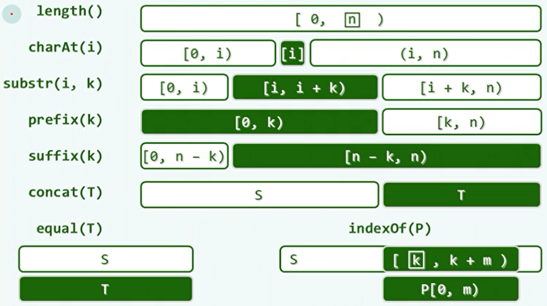
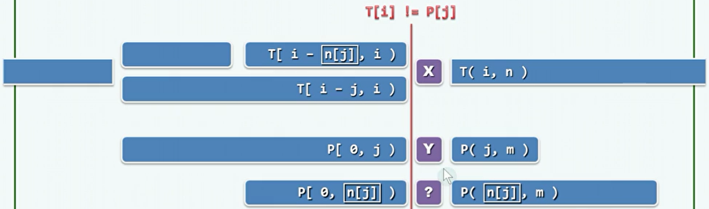
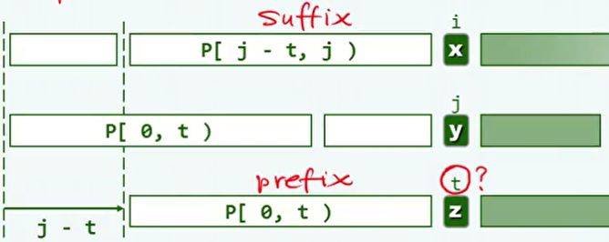
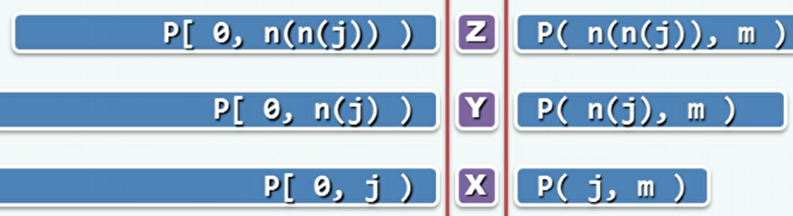
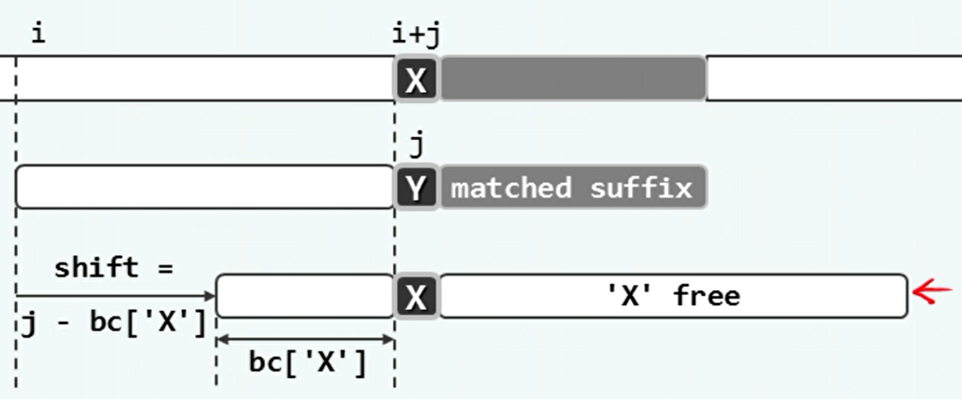
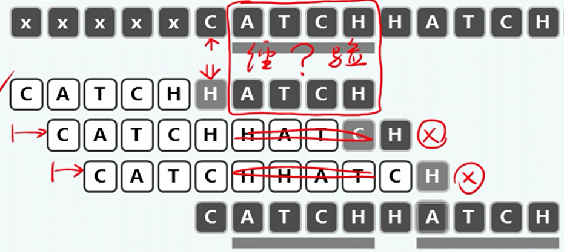
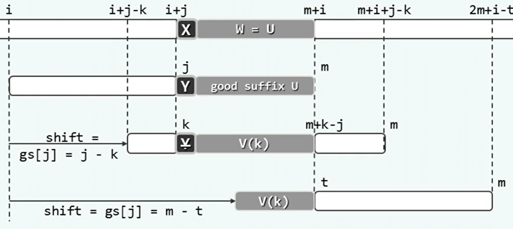
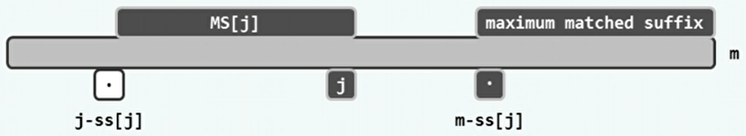
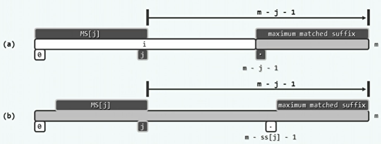

## 1、串

- 串（字符串）：来自字母表的字符所构成的有限序列。

- 一般来说，串长n远大于字母表中的字符数量。

- 串相等：串长度相等，且对应位置上的字符相同。

- 子串：substr(i,k)，从s[i]开始的连续k个字符。

- 前缀：prefix(k)=substr(0,k)，即最靠前的k个字符。

- 后缀：suffix(k)=substr(n-k,k)，即最靠后的k个字符。

- 空串长度为0，是任何串的子串、前缀、后缀。

- 串的功能接口：

  


## 2、串匹配

- 一般将所要搜索的串称为模式P，搜索的对象称为文本T。
- 模式匹配：
  - 从文字中匹配模式串。
  - 是否出现？
  - 首次在哪里出现？（主要问题）
  - 共有几次出现？
  - 各出现在哪里？
- 如何评测串匹配算法的性能？
  - 成功：在T中，随机取出长度为m的子串作为P；分析平均复杂度。
  - 失败：采用随机的P；统计平均复杂度。


- 蛮力匹配：

  - 自左向右，以字符为单位，依次移动模式串。直到在某个位置，发现匹配。

  - 版本1：

    ```c++
    int match ( char* P, char* T ) { //串匹配算法（Brute-force-1）
       size_t n = strlen ( T ), i = 0; //文本串长度、当前接受比对字符的位置
       size_t m = strlen ( P ), j = 0; //模式串长度、当前接受比对字符的位置
       while ( j < m && i < n ) //自左向右逐个比对字符
          {
          if ( T[i] == P[j] ) //若匹配
             { i ++;  j ++; } //则转到下一对字符
          else //否则
             { i -= j - 1; j = 0; } //文本串回退、模式串复位
          }
       return i - j; 
    }
    ```
  
- 版本2：
  
  ```c++
    int match ( char* P, char* T ) { //串匹配算法（Brute-force-2）
       size_t n = strlen ( T ), i = 0; //文本串长度、与模式串首字符的对齐位置
       size_t m = strlen ( P ), j; //模式串长度、当前接受比对字符的位置
       for ( i = 0; i < n - m + 1; i++ ) { //文本串从第i个字符起，与
          for ( j = 0; j < m; j++ ) //模式串中对应的字符逐个比对
             {
             if ( T[i + j] != P[j] ) break; //若失配，模式串整体右移一个字符，再做一轮比对
             }
          if ( j >= m ) break; //找到匹配子串
       }
       return i; 
    }
  ```
  
- 唯一的区别就是版本1中i指向文本T中进行比较的位置，版本2中i指向模式T开始比较的位置。
  
- 最坏情况下可达到O(m*n)。
  
- 低效的原因在于，之前比对过的字符，将在模式T失陪进位后再次比较。


- KMP算法：

  - 所要处理的，就是这种一部分前缀匹配，但是在某个位置不匹配。对于下图有`T[i]!=P[j]`，而其前缀是匹配的。

    

  - 因为已经匹配的部分`T[i-j,i)`和`P[0,j)`是完全相同的。所以，当X！=Y导致失配时，需要将P移动一段距离L，使得`T[i-j+L,i)`与`P[0,j-L)`匹配。这种情况只与模式P有关，而且对于P中每个字符都只有一种移动的情况。

  - 构造查询表`next[0,m)`，在任一位置P[j]失败后，将j替换为next[j]。即相当于P移动了`j-next[j]`。
  
  - 实现：
  
    ```c++
    int match ( char* P, char* T ) {  //KMP算法
       int* next = buildNext ( P ); //构造next表
       int n = ( int ) strlen ( T ), i = 0; //文本串指针
       int m = ( int ) strlen ( P ), j = 0; //模式串指针
       while ( j < m  && i < n ) //自左向右逐个比对字符
          {
          if ( 0 > j || T[i] == P[j] ) //若匹配，或P已移出最左侧（两个判断的次序不可交换）
             { i ++;  j ++; } //则转到下一字符
          else //否则
             j = next[j]; //模式串右移（注意：文本串不用回退）
          }
       delete [] next; //释放next表
       return i - j;
    }
    ```
  
  - next表的作用是，借助必要条件（自匹配），排除不必要的对齐位置比较，实现快速右移。
  
  - 自匹配：当模式P与文本T，在P[j]处失配时，令t=next[j]，进行快速右移。这样做的条件是，在P[j]的前缀P[0,j)中，t是其真前缀和真后缀匹配的最大长度，即存在最大的t使得`P[0,t)=P[j-t,j)`。
  
    
  
  - next[0]=-1，是为了在首字符比对失败的情况下后移一位，对应于后移条件中的 0>j。-1的位置相当于是一个通配哨兵，可以与任何字符匹配。
  
  - 构造next表：
  
    - 递归的，对于next表中的第j+1项，如果`P[j]`与`P[next[j]]`匹配（因为next[j]已计算出来，所以前缀部分必然匹配），则next[j+1]=1+next[j]。
    - 如果`P[j]`与`P[next[j]]`不匹配，则需要尝试`P[j]`与`P[next[next[j]]]`是否匹配，并可能继续递归。
  
    
  
  - 实现：
  
    ```c++
    int* buildNext ( char* P ) { //构造模式串P的next表
       size_t m = strlen ( P ), j = 0; //“主”串指针
       int* N = new int[m]; //next表
       int t = N[0] = -1; //模式串指针
       while ( j < m - 1 )
          if ( 0 > t || P[j] == P[t] ) { //匹配
             j ++; t ++;
             N[j] = t; 
          } else //失配
             t = N[t];
       return N;
    }
    ```
  
  - 时间复杂度O(n)，n为T的规模。
  
  - 再改进：
  
    - 对于已经失败的比对，用同样的字符再次进行相同的必定失败的比对，损失了效率。
  
    - 同样的字符比对必然失败，因此可以直接指向next[t]。
  
    - 实现：
  
      ```c++
      int* buildNext ( char* P ) { //构造模式串P的next表
         size_t m = strlen ( P ), j = 0; //“主”串指针
         int* N = new int[m]; //next表
         int t = N[0] = -1; //模式串指针
         while ( j < m - 1 )
            if ( 0 > t || P[j] == P[t] ) { //匹配
               j ++; t ++;
               N[j] = P[j]!=P[t]? t:N[t]; 
            } else //失配
               t = N[t];
         return N;
      }
      ```
  
      

- BM算法：

  - 不对称性：判断串相等和不等的代价是不同的。即使是对单个字符而言，匹配失败的概率也远高于成功的概率。
  - 在串匹配中，先对靠后的字符匹配可以获得更多的教训。这是因为如果靠后的字符匹配失败，可以排除较多的对齐位置。
  - 因此，在匹配时，应从模式P从后往前匹配。

- 坏字符（bc）：

  - 模式P从后往前比对时，第一个失配的字符。模式P中为Y，而文本T中为X。X就是坏字符。
  - 这意味着模式P需要右移直到其中的X与文本T中的X对齐。然后再从最右端开始比较。位移量取决于失配位置和X在P中的秩，可制表bc待查。
  - 如果模式P中的X在匹配位置的右侧，则模式P只向右移动一个位置。
  - 如果模式P中不包含X，则直接完全越过这个对齐位置。
  - 如果模式P中存在多个X，则先选择前缀中秩最大的。

  

  - 构造bc表：记录所有字符最后一次出现的位置。

  - 实现：

    ```c++
    int* buildBC ( char* P ) { //构造Bad Charactor Shift表：O(m + 256)
       int* bc = new int[256]; //BC表，与字符表等长
       for ( size_t j = 0; j < 256; j ++ ) bc[j] = -1; //初始化：首先假设所有字符均未在P中出现
       for ( size_t m = strlen ( P ), j = 0; j < m; j ++ ) //自左向右扫描模式串P
          bc[ P[j] ] = j; //将字符P[j]的BC项更新为j（单调递增）——画家算法
       return bc;
    }
    ```

  - 时间复杂度最好O(n/m)，最坏O(n*m)。

- 好后缀（gs）：

  - 在模式P的后缀G完成与文本T中的子串S的匹配时，可以将完成匹配的部分看作经验。G就是好后缀。
  - 如果模式P还有一部分需要与子串S匹配，则P中与之匹配的部分必然与G完全相同。
  - 可以通过制表gs，当好后缀继续匹配失败时，移动模式P使得相同的字符与子串S对其。
- 位移量根据bc表和gs表选择较大者。
  

  

  
  - 构造gs表：
    
    - MS[]子串：P[0,j]的所有后缀中，MS[j]是与P的某一后缀匹配的最长者。
    
      
    
    - ss[]表：ss[j]是MS[j]的长度。其中包含了gs表的所有信息。
    
    - 从ss[]表到gs[]表：
    
      - 如果s[j]=j+1，则对任一字符P[i]（i<m-j-1），m-j-1必是gs[i]的一个候选。
      - 如果s[j]<=j，则对字符P[m-ss[j]-1]，m-j-1必是gs[m-ss[j]-1]的一个候选。
      - 注意这里第一种情况是对在好后缀之前的任意的失配字符，而第二种情况只是对好后缀之前的哪一个失配字符。
    
      
    
  - 时间复杂度最好O(n/m)，最坏O(n+m)。


- KR算法：
  - 将字符串转化为整数，这样一次比较只需要O(1)的实现。
  - 对于一个字母表规模为d的字符串，都可以对应于一个d进制的自然数。
  - 但是这样所需的存储空间太大，可以通过散列的方法压缩。
  - 先比较散列码，散列冲突时，再进行串中字符的逐一匹配。
  - 子串的散列过程，可以根据相邻子串间的相似性，通过移位快速得到。


