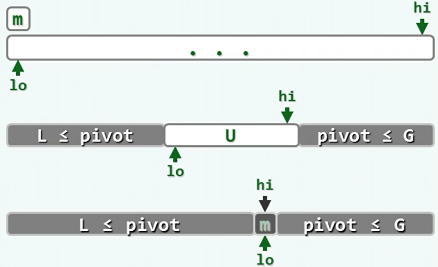
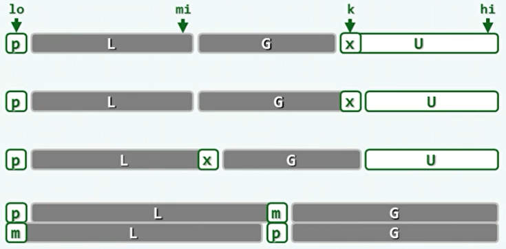
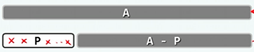
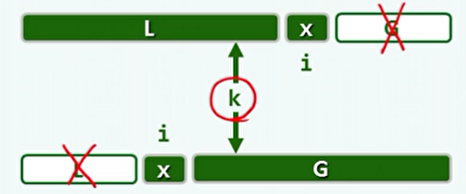
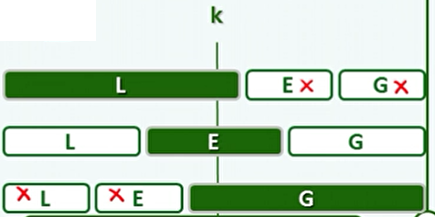
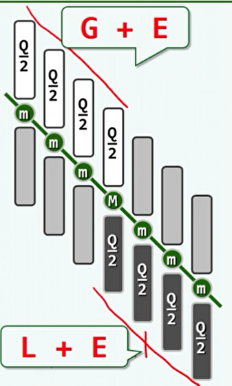

## 1、快排

- 快速排序：

  - 将子序列划分为两个部分S1、S2，并且满足S1中最大值小于S2中最小值。

  - 这样，在子序列分别递归的排序之后，原序列自然有序。

  - 轴点：左 / 右侧的元素，均不比它更大 / 小。

  - 轴点自然的将序列分为了符合之前条件的两个部分，剩下的部分只需递归完成即可。

    ```c++
    template <typename T> 
    void Vector<T>::quickSort ( Rank lo, Rank hi ) { 
       if ( hi - lo < 2 ) return; //单元素区间自然有序，否则...
       Rank mi = partition ( lo, hi ); //在[lo, hi)内构造轴点
       quickSort ( lo, mi ); //对前缀递归排序
       quickSort ( mi + 1, hi ); //对后缀递归排序
    }
    
    
    ```

  - 但是，轴点在原始序列中未必存在。轴点存在的必要条件是，轴点在序列中所在的位置必定是其排序后所在的位置（就位）。

  - 在有序序列中，所有元素都是轴点。因此快排就是将所有元素逐个转换为轴点的过程。通过适当的交换，可使任一元素转换为轴点。

  - 轴点的构造：

    - 以首元素m为轴点为例，使用lo和hi两个指针，将序列分为三部分。L是从前往后的小于等于m的部分，G是从后往前的大于等于m的部分，U是未扫描的部分。lo和hi指向U的边界。

    - lo和hi向中间扫描，最终重合的位置就是m作为轴点所在的位置。

      

    - 具体的，在算法进行的开始，先去除m并备份。这样原来m的位置就空闲了，并由lo指向。

    - 然后hi开始扫描，遇到大于等于m的就越过，遇到小于m的就将其移至lo指向的空闲位置。然后改为lo扫描，hi空闲。

    - 最后扫描完成后，将备份的m移入空闲位置。

  - 时间复杂度最好O(nlog n)，最坏O(n^2)，平均O(nlog n)。

- 快速排序的变种：

  - 同样的将整个序列分为四部分，只不过待处理部分U在最后端，而P也不需要取出备份。
  - k指针从头后移，遇到大于等于轴点的元素就只后移，相当于将该元素归入G。遇到小于轴点的元素，则与G中的首元素交换位置，相当于将该元素归入L，然后再后移。
  - 最后U的规模为0时，将位于序列首端的轴点P与L中的最后一个元素交换位置。

  

  - 实现：

    ```c++
    template <typename T> //轴点构造算法：通过调整元素位置构造区间[lo, hi)的轴点，并返回其秩
    Rank Vector<T>::partition ( Rank lo, Rank hi ) { //版本C
       swap ( _elem[lo], _elem[ lo + rand() % ( hi - lo ) ] ); //任选一个元素与首元素交换
       T pivot = _elem[lo]; //以首元素为候选轴点——经以上交换，等效于随机选取
       int mi = lo;
       for ( int k = lo + 1; k < hi; k++ ) //自左向右扫描
          if ( _elem[k] < pivot ) //若当前元素_elem[k]小于pivot，则
             swap ( _elem[++mi], _elem[k] ); //将_elem[k]交换至原mi之后，使L子序列向右扩展
       swap ( _elem[lo], _elem[mi] ); //候选轴点归位
       return mi; //返回轴点的秩
    }
    ```


## 2、选取

- 众数：这里指的是出现次数超过序列长度一半以上的元素。

- 这种定义下，如果存在众数，则其必然也是中位数。

- 减而治之：

  - 若在向量A的前缀P（P长度为偶数）中，元素x出现的次数恰占半数，则A有众数仅当，对应的后缀A –Р有众数m，且m就是A的众数。
  - 若x= m，则在排除前缀P之后，m与其它元素在数量上的差距保持不变。
  - 若x ≠ m，则在排除前缀Р之后，m与其它元素在数量上的差距不致缩小。

  

- 实现：

  - 用一个计数器记录众数的候选者与其他元素的数量差。

  ```c++
  template <typename T> T majEleCandidate ( Vector<T> A ) { //选出具备必要条件的众数候选者
     T maj; //众数候选者
  // 线性扫描：借助计数器c，记录maj与其它元素的数量差额
     for ( int c = 0, i = 0; i < A.size(); i++ )
        if ( 0 == c ) { //每当c归零，都意味着此时的前缀P可以剪除
           maj = A[i]; c = 1; //众数候选者改为新的当前元素
        } else //否则
           maj == A[i] ? c++ : c--; //相应地更新差额计数器
     return maj; //至此，原向量的众数若存在，则只能是maj —— 尽管反之不然
  }
  ```

  

- 选取的通用算法：

  - 选取的目标是，取出序列中经排序后秩为k的元素。

  - quickSelect()：

    - 借鉴快排的思想，如果轴点的秩恰好为k，则直接返回。
    - 如果轴点的秩不是k，但可通过与轴点的秩比较，得出k是在L中还是在G中。

    

  - linearSelect()：

    - 设定一个常量Q，当序列A短于Q时，则为递归基，使用平凡的选取算法（比如排序）。
    - 否则，将序列分为n/Q个长为Q的序列。
    - 对于每个序列进行排序，并选出各自的中位数。递归的选取出这些中位数的中位数，记为M。
    - 将整个序列分为，L：小于M的；E：等于M的；G：大于M的。
    - 如果目标的秩k落在L或G，则递归，若落在E则返回M。

    

    - 对于M，至少各有n/4个元素，不小于 / 不大于M。即白色部分占n/4，且必然大于等于M，黑色部分占n/4，且必然小于等于M。

    

    - 时间复杂度与Q的取值有关，至少应大于4。时间复杂度O(n)。


## 3、希尔排序

- 希尔排序：
  - 将整个序列视为一个矩阵，逐列各自排序。矩阵的宽度逐渐缩减，最后变成一列。对于分为h列的排序，称为h-sorted。
  - 需要一个步长序列，存储了矩阵的宽度变化。
  - 对于每一列的排序算法，需要使用输入敏感的算法，以保证在有序性持续改善的情况下，计算成本较低。
  - 有序性可以通过逆序对的数量表征。
  - shell序列：
    - 从1开始，以2为比的等比数列。
    - 因为除了第一项都是偶数，因此两次分列时没有进行元素的交换。
    - 应该尽量使得相邻的列数互质。
  - 如果一个序列中有，s[i]<=s[i+g]，则称为这个序列为g-ordered。
  - 已经证明，对于一个g-ordered序列，经过h-sorted后，依然是g-ordered的。
  - 这就说明了希尔排序在不同宽度的列进行排序后，会成为所有矩阵宽度的h-ordered。
  - 而且所有h-ordered的序列，都是可以线性组合的。
  - 又因为，对于互质的数g和h，其无法完成线性组合的最大值为gh-g-h。
  - 因此对于一个h-ordered和g-ordered序列，s[i]的逆序对只可能存在于其后的(g-1)(h-1)个位置内。这个范围会在排序过程中逐渐缩减。最终用于插入排序的序列逆序对很少。


## 4、十大排序算法

- 学习自：[十大经典排序算法](https://www.cnblogs.com/onepixel/articles/7674659.html)。

- 排序算法分类：

  - **比较类排序**：通过比较来决定元素间的相对次序，由于其时间复杂度不能突破O(nlog n)，因此也称为非线性时间比较类排序。
  - **非比较类排序**：不通过比较来决定元素间的相对次序，它可以突破基于比较排序的时间下界，以线性时间运行，因此也称为线性时间非比较类排序。

  

- **稳定**：如果a原本在b前面，而a=b，排序之后a仍然在b的前面。
- **不稳定**：如果a原本在b的前面，而a=b，排序之后a可能会出现在b的后面。
- **时间复杂度**：对排序数据的总的操作次数。反映当n变化时，操作次数呈现什么规律。
- **空间复杂度：**是指算法在计算机内执行时所需存储空间的度量，它也是数据规模n的函数。 


### 冒泡排序Bubble

- 描述：

  - 比较相邻的两个元素，如果后边的元素较大则交换位置。
  - 从前往后扫描，n次扫描后这样最大的n个元素必然位于最后。
  - 设置一个标志位，如果这次扫描没有发生交换则说明排序完成。
  - 用一个递增变量i来记录扫描次数，不扫描最后的有序部分。

- 实现：

  ```java
  int temp;
  for (int i = 0; i < arr.length; i++) {
      for (int j = 0; j < arr.length-1-i; j++) {
          if (arr[j] > arr[j+1]) {
              temp = arr[j];
              arr[j] = arr[j + 1];
              arr[j + 1] = temp;
          }
      }
  }
  
  //-----------------------------------
  
  boolean flag = true;   //用于在没有发生交换时提前退出
  int j=arr.length;       //用于每次扫描不遍历有序部分
  int temp;
  while (flag) {
      flag = false;
      for (int i = 0; i < j-1; i++) {
          if (arr[i] > arr[i+1]) {
              temp = arr[i];
              arr[i] = arr[i+1];
              arr[i+1] = temp;
              flag = true;
          }
      }
      j--;
    }
  ```
  
  

### 选择排序Selection

- 描述：

  - 以有序序列在尾部为例（这样每次扫描从头开始），每次选择无序部分最大的元素，存放在有序部分的最后。
  - 用一个指针记录有序序列下一个插入位置，另一个指针进行扫描。

- 实现：

  ```java
  int max;        //记录最大值及其位置
  int index;
  for (int i = arr.length-1; i >=0; i--) {     //从后往前，插入位置
      max = arr[i]; index = i;
      for (int j = 0; j <= i; j++) {       //从前往后扫描
          if (max < arr[j]){
              max = arr[j];
              index = j;
          }
      }
      arr[index] = arr[i];
      arr[i] = max;
  }
  ```
  


### 插入排序Insertion

- 描述：

  - 以有序序列在前为例，从前往后扫描，将元素插入到有序序列中的合适位置。
  - 该元素从后往前与有序序列中的元素比较，如该元素较小则有序序列中的元素后移一位。

- 实现：

  ```java
  int j;
  int temp;
  for (int i = 1; i < arr.length; i++) {      //从前往后扫描
      temp = arr[i];
      j = i;
      while (j>0 && temp < arr[j-1]) {      //从有序序列最后i-1开始，j是插入位置
          arr[j] = arr[j-1];
          j--;
      }
      arr[j]=temp;
  }
```
  
  

### 希尔排序Shell

- 描述：
  - 相当于对不同的间隔的元素序列进行排序，具体进行排序的算法可以为插入排序。
  - 每一个间隔从gap开始，相当于插入排序从1开始。遍历一遍是对不同分组交替插入。

- 实现：

  ```java
  int temp;
  int j;
  //gap是间隔（矩阵宽度），也可以作为输入的其他值。
  for (int gap = (int) Math.floor(arr.length/2); gap > 0; gap= (int) Math.floor(gap/2)) {
      //从gap开始（矩阵中这一列的第二个）开始向后扫描。
      // 对间隔为gap的序列进行插入排序。事实上每次+1前后进行的是不同分组的排序。
      for (int i = gap; i < arr.length; i++) {
          j = i;              //j是插入位置
          temp=arr[i];
          while (j-gap>=0 && temp < arr[j-gap]){
              arr[j] = arr[j-gap];
              j-=gap;
          }
          arr[j] = temp;
      }
  }
  ```

  

### 归并排序Merge

- 描述：

  - 单个元素自然有序，将两个有序序列合并为一个有序序列。
  - 进行归并时，可以只复制前半部分的数组，后半部分使用原来的数组空间。

- 实现：

  ```java
  static void mergeSort(int[] arr, int lo, int hi) {
      if (hi - lo == 0) {
          return;
      }
      int mid = (lo + hi) / 2;
      mergeSort(arr, lo, mid);
      mergeSort(arr, mid+1, hi);
      merge(arr, lo, mid, hi);
  }
  
  static void merge(int[] arr,int lo, int mid, int hi) {
      int[] temp = new int[mid-lo+1];     //只复制数组的前半部分
      for (int i=lo; i<=mid; i++) {
          temp[i-lo] = arr[i];
      }
      int i=0; int j=mid+1; int k=lo;
      while (i<=mid-lo && j<=hi) {
          if (temp[i]<arr[j]){
              arr[k++]=temp[i++];
          } else {
              arr[k++]=arr[j++];
          }
      }
      if (j>hi) {                     //如果是前半部分先排列完毕，则后半部分自然有序
          while (i<=mid-lo) {
              arr[k++]=temp[i++];
          }
      }
  }
  ```

  


### 快速排序Quick

- 描述：
  - 用一个轴点将序列分为两部分，左侧的都比轴点小，右侧的都比轴点大。
  - mid指向小于轴点分区中的最后一个元素，所以插入前需要+1。k指向当前扫描元素。
  - 在不同的算法中，hi可能有不同的含义（末元素或尾哨兵），看边界是否-1，在这里是尾哨兵。

- 实现：

  ```java
  static void quickSort(int[] arr, int lo, int hi) {
      if (hi - lo <= 1) {         //这里的hi是末元素的下一个，也就是结尾哨兵
          return;
      }
      int mid = partition(arr, lo, hi);
      quickSort(arr, lo, mid);
      quickSort(arr, mid+1, hi);
  }
  
  static int partition(int[] arr,int lo, int hi) {
      int mid = new Random().nextInt(hi-lo) + lo;     //随机选取轴点
      swap(arr, lo, mid);
      mid = lo;
      for (int k = lo+1; k <hi ; k++) {
          if (arr[k] < arr[lo]) {
              swap(arr, ++mid, k);
          }
      }
      swap(arr, lo, mid);
      return mid;
  }
  
  static void swap(int[] arr, int a, int b) {
      int temp = arr[a];
      arr[a] = arr[b];
      arr[b] = temp;
  }
  ```

  

### 堆排序Heap

- 描述：
  - 使用对叶子节点自下而上的下滤快速建堆。
  - 对于向量组织的堆，父节点秩为i，则子节点秩为2i+1和2i+2。
  - 每次取出栈顶元素后，将其放在有序序列的最前。同时维护堆序性。

- 实现：

  ```java
  static void heapSort(int[] arr, int lo, int hi) {
      buildHeap(arr, lo, hi);
      for (int i = hi -1; i>lo; i--) {
          swap(arr, lo, i);
          percolateDown(arr, lo, lo, i);      //取出堆顶元素
      }
  }
  
  static void buildHeap(int[] arr, int lo, int hi) {      //快速建堆
      for (int i = (int) Math.floor((hi-lo)/2); i >=0; i--) {     //从非叶子节点开始自下而上的下滤
          percolateDown(arr, i, lo, hi);
      }
  }
  
  static void percolateDown(int[] arr, int parent, int lo, int hi) {  //下滤
      int left = lo + (parent-lo) * 2 + 1;
      int right = lo + (parent-lo+1) * 2;
      int choice = parent;
      if (left < hi && arr[left] > arr[choice]) {
          choice = left;
      }
      if (right < hi && arr[right] > arr[choice]) {
          choice = right;
      }
      if (choice != parent) {
          swap(arr, choice, parent);
          percolateDown(arr, choice, lo, hi);     //如果更新了，继续考察下滤后的节点
      }
  }
  
  static void swap(int[] arr, int a, int b) {
      int temp = arr[a];
      arr[a] = arr[b];
      arr[b] = temp;
  }
  ```

  

### 计数排序Counting

- 描述：

  - 将输入的数值存储在新的数组空间中。索引为数值的大小，值为该数值出现的次数。
  - 在排序前需要知道数组中数值的大小范围。
  - 映射完成后，再反向填充原数组。

- 实现：

  ```java
  int[] count = new int[maxNum-minNum+1];     //需要知道数组的数值范围
  for (int i = 0; i < arr.length; i++) {
      count[arr[i]-minNum]++;     //计数
  }
  int j = 0;
  for (int i = minNum; i <= maxNum; i++) {
      while (count[i-minNum]-- > 0)
          arr[j++] = i;           //反向填充
  }
  ```

  

### 桶排序Bucket

- 描述：

  - 桶排序是计数排序的升级版。不简单使用数值而是使用一个映射函数生成索引。
  - 在每个索引的空间称为一个桶，在一个桶中再进行排序。
  - 最后把不是空的桶中的数据拼接起来。

- 实现：

  ```java
  int bucketSize = 5;         //每个桶中存储的范围
  int bucketCount = (int) Math.floor((maxNum-minNum)/bucketSize)+1;   //桶的个数，也可以用其他映射函数，保证大小次序不变即可
  LinkedList<Integer>[] bucket = new LinkedList[bucketCount];
  
  int index;
  for (int i = 0; i < arr.length; i++) {
      index = (int) Math.floor((arr[i]-minNum)/bucketSize);       //装入桶中
      if (bucket[index]==null) {
          bucket[index] = new LinkedList<>();
      }
      bucket[index].add(arr[i]);
  }
  int j = 0;
  for (int i = 0; i < bucketCount; i++) {
      if (bucket[i]!=null){
          insertSort(bucket[i]);              //桶中元素排序
          for (Integer ele : bucket[i]) {     //输出有序序列
              arr[j++] = ele;
          }
      }
  }
  ```
  
  

### 基数排序Radix

- 描述：
  
  - 先按低优先级排序，再按高优先级排序。最后的次序就是高优先级高的在前，高优先级相同的低优先级高的在前。
  - 对整数排序可按从低往高位上的数字大小作为优先级。可以取除以其他数，能覆盖元素范围即可。
  - 对于每个桶，添加元素与取出元素的位置应该相反。如从尾部添加，就从头部取出，不然会破坏顺序。
  
- 实现：

  ```java
  int dev = 1; int mul = 10;          //所要除的是哪一位；进制数。这里取某一位上的大小为优先级
  int maxpriority = 2;        //这里取十进制的个位和十位，选取时能覆盖数组中的元素即可
  int bucketCount = mul;      //桶的个数
  LinkedList<Integer>[] bucket = new LinkedList[bucketCount];
  int index;
  for (int i=0; i<maxpriority; dev*=mul,i++){         //每个优先级遍历一遍
      for (int j = 0; j < arr.length; j++) {
          index = (arr[j] % (dev*mul))/dev;       //取余得到优先级
          if (bucket[index]==null){
              bucket[index] = new LinkedList<>();
          }
          bucket[index].add(arr[j]);
      }
      int k=0;
      for (int j = 0; j < bucket.length; j++) {      //计数排序
          if (bucket[j]!=null) {
              while (!bucket[j].isEmpty()) {
                  arr[k++] = bucket[j].pop();     //注意这里与上边添加元素的位置相反
              }
          }
      }
  }
  ```

  
