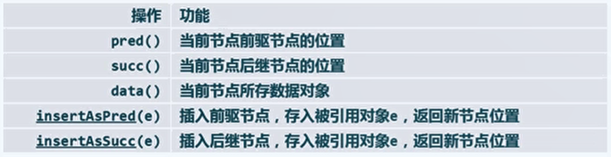
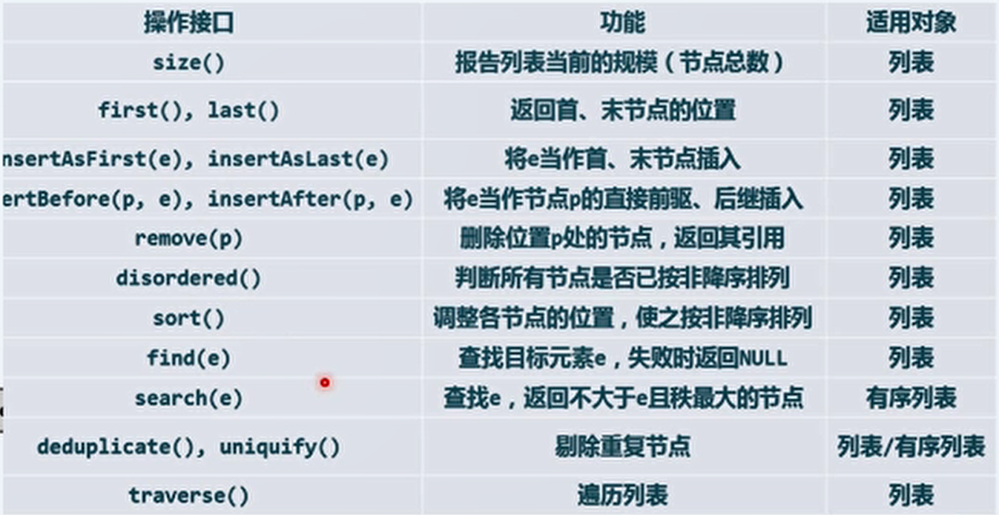

# 3、列表

## 1、列表的定义

- 静态与动态：

  - 操作的静态与动态：
    - 静态：仅读取，数据结构的内容与组成一般不变。
    - 动态：需写入，数据结构的局部或整体将改变。
  - 数据元素存储与组织方式的静态与动态：
    - 静态：数据空间整体创建或销毁，数据元素的物理存储词语与其逻辑次序一致。 静态操作高效，动态操作相对低效。如相邻。
    - 动态：为各数据元素哦的那个太多分配和回收物理空间。逻辑上相邻的元素记录彼此的物理地址，在逻辑上形成一个整体。动态操作高效，静态操作相对低效。如列表。

- 列表：采用动态存储的典型结构。

  - 每个元素称为节点（ node ）。
  - 各个节点通过指针或引用彼此联接，在逻辑上构成一个线性序列。
  - 相邻节点彼此互称前驱和后继。如果存在前驱和后继，那么必然是唯一的。
  - 没有前驱的节点成为首，没有后继的节点称为末。此外，可以认为头存在一个哨兵前驱称为头，末存在一个哨兵后继称为尾。
  - 可以认为 头、首、末、尾 节点的秩分别为 -1、0、n-1、n。
  - 在访问时尽量不使用循秩访问，而使用循位置访问。即利用节点制件的相互引用，找到特定的节点。

- 列表元素的ADT接口：

  

- 列表节点：ListNode 模板类。

  ```c++
  #define Posi(T) ListNode<T>*	//定义指向列表节点的数据类型(节点位置)
  template <typename T>
  struct ListNode{
      T data;			//数值内容
      Posi(T) pred;	//前驱
      Post(T) succ;	//后继
      ListNode() {}	//针对头尾哨兵的无参构造
      ListNode(T e, Posi(T) p=null, Posi(T) s=null)
          : data(e), pred(p), succ(s) {}	//默认构造器
      Posi(T) insertAsPred(T const& e);	//前插入
      Posi(T) insertAsSucc(T const& e);	//后插入	
  }
  ```

- 列表的ADT接口：

  

- 列表：List 模板类：

  ```c++
  #include "ListNode.h"	//引入列表节点类
  template <typename T>
  class List {
  private:	int _size;
      		Posi(T) header; Posi(T) trailer;	//头尾哨兵
  protected:	/*内部函数*/
  public:		/*构造函数、析构函数、对外的接口函数等*/
  }
  ```

- 列表的初始化函数：

  ```c++
  template <typename T>
  void List<T>::init() {
      header = new ListNode<T>;	//创建头尾哨兵节点
      trailer = new ListNode<T>;
      header -> succ = trailer;	//互联元素
      header -> pred = null;
      trailer -> pred = header;
      trailer -> succ = null;
      _size = 0;		//记录规模
  }
  ```

## 2、无序列表的操作

- 循秩访问：

  - 列表也可以模仿向量的循秩访问（通过重载下标运算符）。

  - 但是效率比较低，时间复杂度为 O(n) 。

  - 实现：

    ```c++
    template <typename T>
    T List<T>::operator[](Rank r) const {
        Posi(T) p = first();	//从首节点出发
        while(0 < r++) p = p->succ;		//顺数第r个节点
        return p ->data;
    }
    ```

- 查找操作：

  - 定义：在指定节点 p （可能为尾哨兵）的 n 个真前驱中找到等于 e 的最后者。

  - 实现：

    ```c++
    template <typename T>
    Posi(T) List<T>::find(T const& e, int n, Posi(T) p) const {
        while(0 < n--)	//从右到左逐个比较，直到命中或越界
            if(e == (p = p->pred)->data) return p;
        return null;
    }
    ```

- 插入操作（以前插入为例）：

  - 创建一个新节点 e ，并将其作为 p 的前驱插入。

  -  创建新节点e，前驱是 p 的原前驱，后继是 e。设 p 的原前驱的后继是 e，p 的新前驱是 e。

  - 实现：

    ```c++
    template <typename T>
    Posi(T) List<T>::insertBefore(Posi(T) p, T const& e){
        _size++;
        return p->insertAsPred(e);	//把e当作p的前驱插入
    }
    
    template <typename T>
    Posi(T) ListNode<T>::insertAsPred(T const& e){
        Posi(T) x = new ListNode(e, pred, this);	//创建新节点e，前驱是p的原前驱，后继是e
        pred->succ = x;		//p的原前驱的后继是e
        pred = x;		    //p的新前驱是e
        return x;	//返回新节点的位置
    }
    ```

- 基于复制的构造：

  - 创建一个空 列表，然后将传入的自 p 节点开始的 n 项依此作为末节点插入。

  - 实现：

    ```c++
    template <typename T>
    void List<T>::copyNodes(Post(T) p, int n){
        init();		//初始化空列表
        while(n--){
            //insertAsLast(p->data)实际上就是insertBefore(trailer, p->data)
            insertAsLast(p->data);
            p = p->succ;
        }
    }
    ```

- 删除操作：

  - 传入所要删除的 p 处的节点。

  - 将 p 的前驱的新后继赋值为 p 的原后继，将 p 的后继的新前驱赋值为 p 的原前驱。

  - 实现：

    ```c++
    template <typename T>
    T List<T>::remove(Posi(T) p){
        T e = p->data;
        p->pred->succ = p->succ;	//将p的前驱的新后继赋值为p的原后继
        p->succ->pred = p->pred;	//将p的后继的新前驱赋值为p的原前驱。
        delete p;
        _size--;
        return e;	//返回被删除的值
    }
    ```

- 析构操作：

  - 首先删除所有可见节点，然后删除头尾哨兵。

  - 删除可见节点通过反复删除首节点直到规模为 0 实现。

  - 实现：

    ```c++
    template <typename T>
    List<T>::~List()	//列表析构
    {
        clear();
        delete header;
        delete trailer;
    }
    
    template <typename T>
    int List<T>::clear(){
        int oldSize = _size;
        while(0 < _size){
            remove(header->succ);
        }
        return oldSize;
    }
    ```

- 列表的唯一化：

  -  删除无序列表中的重复节点。

  - 从首节点开始，依此寻找其前驱中是否有重复节点。使得向后扩展时，搜索节点的前驱总是无重复的，这样就只需比对该搜索节点在前驱中是否有雷同项。

  - 实现：

    ```c++
    template <typename T>
    int List<T>::dedupicate(){
        if(_size < 2) return 0;
        int oldSize = _size;
        Posi(T) o = first();	//从首节点开始
        Rank r = 1;
        while(trailer != (p = p->succ)){
            Posi(T) q = find(p->data, r, p);	//在p的r个真前驱中，有没有雷同的
            q ? remove(q) : r++;	//如果有雷同的就移除前驱中雷同的项，否则将不雷同的前驱向后扩展一项
        }
        return oldSize - _size;		//返回被删除的元素数
    }
    ```


- 有序列表的唯一化：

  - 删除有序列表中的重复节点。

  - 由于有序，如有雷同则必定是紧邻在一个区段中的。

  - p 指向每个区段的第一个节点，删除与之相同的后继。如果出现不相同的后继，则 p 指向这个后继。

  - 实现：

    ```c++
    template <typename T>
    int List<T>::uniquify(){
        if(_size < 2) return 0;
        int oldSize = _size;
        ListNodePosi(T) p = first();	//p初始化为首节点，p为每个区段的首节点
        ListNodePosi(T) q = p->succ;	//q为各个区段中p的后继
        while(trailer != (q->succ)){	//考察紧邻的节点对
            if(p->data != q->data){
                p = q;
            } else {
                remove(q);
            }
            q = p->succ;
        }
        return oldSize - _size;
    }
    ```
  -   时间复杂度为 O(n)。
  
- 有序列表查找操作：

  - 与无序向量的查找算法完全相同，在效率上并没有提高，这是由列表的循位置访问的特点决定的。

## 3、选择排序与插入排序

- 选择排序：

  - 选取所有元素中最大的放在列表末，然后再选择剩下的元素中最大的放在末的前驱位置，反复执行。也就是说，每次选择出剩余集合中的最大值。

  - 冒泡排序就是一种选择排序，但是由于每次只进行相邻元素的位置交换，导致效率很低。

  - 改进思路：将序列分为前缀无序子序列 U 和后缀有序子序列 L ，其中 L 中的元素大于等于 U 中的元素。在每次迭代中，选取 U 中最大的元素，并将其移动至 L 的最前端。

  - 实现：

    ```c++
    template <typename T>
    void List<T>::selectionSort(Posi(T) p, int n){
        Posi(T) head = p->pred;
        Posi(T) tail = p;
        for(int i=0; i<n; i++)	
            tail = tail->succ;	//待排序区间为(head,tail)
        //从待排序区间内找出最大者，将其从原位置删除并插入tail的位置，然后将tail前移，，待排序区间宽度-1
        while(1 < n){
            //insertBefore()和remove()虽然可以认为时O(1)时间，但由于使用了动态内存分配，会使效率大大降低。实际上更倾向于进行节点数据域的交换
            insertBefore(tail, remove(selectMax(head->succ, n)));
            tail = tail->pred;
            n--;
        }
    }
    
    template <typename T>	//获取起始于p的n个元素的最大值，画家算法
    Posi(T) List<T>::selectMax(Posi(T) p, int n){
        Posi(T) max = p;	//初始化p为最大
        for(Posi(T) cur=p; 1<n; n--){
            //后续节点与max逐一比较，!lt(a，b)比较器表示a不小于（not less than，即>=）b时
            if(!lt((cur=cur->succ)->data, max->data){
                max = cur;
            }
        }
        return max;
    }
    ```

  - 时间复杂度总是 Θ(n^2)，没有最好和最坏情况。但是与冒泡排序相比元素移动操作大大减少。

- 插入排序：

  - 将整个序列分为前缀有序序列 [ 0, r ) 和后缀无序序列 [ r, n)，然后将第 r 个元素插入到前缀有序序列中的合适位置，使得前缀有序序列仍然有序并且规模加一。

  - 与选择排序的区别：选择排序中无序部分中元素总小于有序部分，而插入排序无此限制；而且因此选择排序的操作对象为无序部分中的最大值，而插入排序的操作对象为无序部分与有序部分交界的元素。

  - 实现：

    ```c++
    template <typename T>
    void List<T>::insertionSort(Posi(T) p, int n){
        for(int r=0; r<n; r++){		//r实际上就是有序前缀序列的长度
            //每次在search()返回的位置插入，然后删除原位置上的节点
            insertAfter(search(p->data, r, p), p->data);
            p = p->succ;
            remove(p->pred);
        }
    }
    ```

  - 时间复杂度：最好 O(n)，最差 O(n^2)，平均复杂度为 O(n^2)。

  - 逆序对：两个元素前大后小。

    - 如果 a、b 是一个逆序对( a>b )，我们将 b 所对应的逆序对数加一。也就是某个元素对应逆序对数，记为其作为逆序对中较右、较小的角色的逆序对数量。
    - 对于插入排序，列表的逆序对数就表征了所要进行的比较次数。最好情况下，列表为顺序的，逆序对数为 0 。最差情况下，列表为逆序的，逆序对数为 n^2。时间复杂度为插入时间加比较时间，比较时间最好为 0，最差为 O(n^2)；插入时间为 O(n)。则总得复杂度为最好 O(n)，最差 O(n^2)。
    - 插入排序的时间复杂对依赖于输入序列的逆序对数，是输入敏感的。


