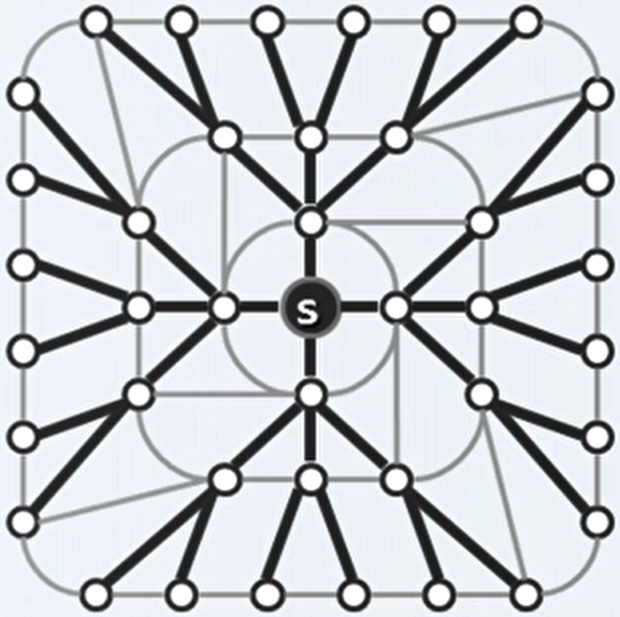

# 6、图

## 1、图的基本术语

- 图 G = （ V ；E ）。V 是顶点集，E 是连边集。用 n 来表示顶点的数量，用 e 来表示连边的数量。
- 在图中，两个顶点之间具有对应关系则称为邻接，用两个顶点间的连边表示。而两个顶点与这条连边具有的关系成为关联。
- 一般而言，不讨论自己与自己邻接的自环。
- 如果邻接顶点 u 和 v 的次序无所谓则（ u，v ）为无向边。
- 如果邻接顶点 u 和 v 的方向被规定了，则（ u，v ）为有向边。
- 所有边均无方向的图，成为无向图。所有边均有方向的图，成为有向图。有向边与无向边混合的成为混合图。有向图可以表示无向图和混合图。
- 路径是，一系列的顶点按照邻接关系构成的序列。如果一条路径中不含重复的节点，则称为简单路径。如果路径的起始节点都是一个节点，则称为环路。
- 如果一个有向图中不包含任何环路，则称为有向无环图。
- 欧拉环路：经过所有的有向边恰好一次的环路。哈密尔顿环路：经过所有的顶点恰好一次的环路。

## 2、图的实现

- 邻接矩阵：描述两个顶点之间的邻接关系。如果图中有 n 个顶点，对于有向图是 n 行 n 列的方阵，第 i 行第 j 列的元素，表征了第 i 个顶点与第 j 个顶点是否邻接。如果是带权图，只需将元素的值改为权值。

- 关联矩阵：描述顶点与边之间的关联关系。如果图中有 n 个顶点、e 条边，则为 n 行 e 列的矩阵，第 i 行第 j 列的元素，表征了第 i 个顶点是否与第 j 条边关联。每一列中只有两个元素不为0。

- 邻接表：描述每个顶点的邻接关系。如果图中有 n 个顶点，则为规模为 n 的向量。向量中的元素为列表，内容为该顶点所指向的邻接顶点。

- 顶点对象的实现：

  ```c++
  typedef enum {UNDISCOVERED, DISCOVERED, VISITED} VStatus;	//顶点三种状态的枚举
  template <typename Tv>
  struct Vertex{			//顶点对象
      Tv data;			//数据
      int inDegree, outDegree;	//出入度（指出和指入的边数）
      VStatus status;				//状态
      int dTime, fTime;			//时间标签（被发现和访问完毕的时刻）
      int parent;					//父节点
      int priority;				//优先级
      Vertex(Tv const &d)：		//构造新节点
          data(d), inDegree(0), outDegree(0), status(UNDISCOVERED),
      	dTime(-1), fTime(-1), parent(-1),
      	priority(INT_MAX) {}
  }
  ```

- 边对象的实现：

  ```c++
  typedef enum {UNDETERMINED, TREE, CROSS, FORWARD, BACKWARD} EStatus;
  template <typename Te>		//边对象
  struct Edge{
      Te data;				//数据
      int weight;				//权值
      EStatus status;			//类型
      Edge(Te const &d, int w):		//构造新边
      	data(d), weight(w), status(UNDETERMINED) {}
  }
  ```

- 邻接矩阵的实现：

  ```c++
  template <typename Tv, typename Te>
  class GraphMaxtrix : public Graph<Tv, Te>{
  private:
      Vector< Vertex<Tv> > V;			//顶点集
      Vector< Vector< Edge<Te>* > > E;	//边集，实际上就是邻接矩阵
  public:
      /* 相关操作接口 */
      GraphMaxtrix() { n = e = 0 ;}		//构造
      ~GraphMaxtrix(){				//析构
          for(int j=0; j<n; j++)
              for(int k=0; k<n; k++)
                  delete E[j][k];		//清除内存
      }
  }
  ```

- 顶点的静态操作：

  ```c++
  //对于顶点的属性的查找，可以直接return其属性值
  //枚举顶点的所有邻接顶点
  int nextNbr(int i, int j){		//若已经枚举到邻居 j，则逆向查找下一个邻接
      while((-1<j) && !exists(i, --j));	//逆向查找O(n)
      return j;
  }		//使用邻接图可到O(1+outDegree(i))
  int firstNbr(int i){		//查找第一个邻接
      return nextNbr(i, n);
  }
  ```

- 边的操作：

  ```c++
  bool exists(int i, int j){			//判断边(i, j)是否存在
      return (0<=i)&&(i<n)&&(0<=j)&&(j<n)&&E[i][j]!=null;
  }	//如果边存在，则对于边的属性的查找，可以直接return其属性值
  //插入边
  void insert(Te const & edge, int w, int i, int j){
      if(exists(i, j)) return;		//判断是否以及存在
      E[i][j] = new Edge<Te>(edge, w);		//创建新边
      e++;							//更新边的数量
      V[i].outDegree++;				//分别更新边两个顶点的入度和出度
      V[j].inDegree++;
  }
  //删除边，前提以及确认边存在
  Te remove(int i, int j){
      Te eBak = edge(i, j);		//备份
      delete E[i][j];				//删除边
      E[i][j] = null;
      e--;
      V[i].outDegree--;				//分别更新边两个顶点的入度和出度
      V[j].inDegree--;
      return eBak;			//返回被删除的边的信息
  }
  ```

- 顶点的动态操作：

  ```c++
  //顶点的插入，邻接表的规模发生变化
  int insert(Tv const & vertex){
      for(int j=0; j<n; j++) E[j].insert(null); n++;	//扩充邻接表中每个元素的规模
      E.insert(Vector< Edge<Te>* >(n, n, null));	//扩充邻接表的规模
      return V.insert(Vector<Tv>(vertex));	//扩充顶点列表的规模
  }
  //顶点的删除
  Tv remove(int i){
      for(int j=0; j<n; j++){
          if(exists(i, j)){
              delete E[i][j];
              V[j].inDegree--;		//删除出边
          }
      }
      E.remove(i); n--;			//删除第 i 行
      for(int j=0; j<n; j++){
          if(exists(j, i)){
              delete E[j].remove(i);		//删除第 i 列
               V[i].outDegree--;			//删除所有入边
          }		
      }
      Tv vBak = vertex(i);
      V.remove(i);				//删除顶点
      return vBak;
  }		//删除行和列的操作的区别？
  ```

- 邻接矩阵表示法：

  - 判断两点之间是否存在联边、获取顶点的出入度数、添加删除边后更新度数都是 O(1) 的时间复杂度。
  - 空间复杂度总是 O(n^2) ，只与顶点数有关，与边数无关。对于平面图（不相邻的边不相交）的空间利用率很低。

## 3、广度和深度优先搜索

- 数据结构的简化分析：图 遍历 得到 树，树 遍历 得到 向量。

- 广度优先搜索：对于访问始自顶点为 s 的图。

  1. 访问顶点 s 。

  2. 依次访问 s 所有尚未访问的邻接顶点。

  3. 依次访问上述顶点尚未访问的邻接顶点。

  4. 如此反复直至没有尚未访问的邻接顶点。

     

- 广度优先搜索：得到了原图的一个极大无环图，即原图的支撑树（遍历了原图的所有顶点）。

- 树的层次遍历是广度优先搜索的特例。

- 实现：

  ```c++
  template <typename Tv, typename Te>		//顶点类型、边类型
  void Graph<Tv, Te>::BFS(int v, int &clock){		//v是初始顶点
      Queue<int> Q;					//队列
      status(v) = DISCOVERED;			//顶点置为已发现并入队
      Q.enqueue(v);
      while(!Q.empty()){
          int v = Q.dequeue();		//取出队首顶点
          dTime = ++clock;			//打上时间标签
          for(int u=fisrtNbr(v); -1<u; u=nextNbr(v, u)){
              if(UNDISCOVERED == status(u)){		//如果u尚未被发现
                  status = DISCOVERED;	//将u置为已发现并入队
                  Q.enqueue(u);
                  status(v, u) = TREE;	//将边(v,u)置为树边，即支撑树中的边
                  parent(u) = v;
              } else {
                  status(v, u) = CROSS;	//如果u已被发现或访问，则将边(v,u)置为跨边，不引入到支撑树中
              }
          }
          status(v) = VISITED;			//当前节点的邻接节点访问完毕
      }
  }
  ```

- 上述的广度优先算法，实际上是遍历了初始顶点所在的连通域，但一个图中可能有多个连通域。这时需要有多个初始顶点：

  ```c++
  template <typename Tv, typename Te>	
  void Graph<Tv, Te>::bfs(int s){		//s是初始顶点
      reset();					//初始化
      int clock = 0;
      int v = s;
      do{							//逐一检查所有顶点
          if(UNDISCOVERED == status(v)){		//如果遇到尚未发现的顶点，则启动一次BFS
              BFS(v, clock);
          }
      } while(s!=(v=(++v%n)))		//从s开始遍历所有顶点
  }
  ```

- 时间复杂度：理论上是 O(n^2) ，但是由于邻接矩阵中一个顶点的邻居在逻辑和物理上的连续性，实际效率可能达到 O( n+e ) 。如果使用邻接表可直接达到 O( n+e ) 。

- 最短路径：在图中，定义两个点之间的距离为其之间最短路径的距离。广度优先算法中，每个顶点到初始顶点的路径，都是其所有路径中到初始顶点的最短路径。

- 深度优先搜索：对于访问始自顶点为 s 的图。

  1. 访问顶点 s 。
  2. 若 s 有尚未被访问的邻接，则任选其一 u ，递归执行深度优先搜索。
  3. 否则，返回上一顶点。

- 实现：

  ```c++
  template <typename Tv, typename Te>	
  void Graph<Tv, Te>::DFS(int v, int &clock){
      dTime(v) = ++clock;				//打上发现时间标签
      status(v) = DISCOVERED;			//发现当前顶点v
      for(int u=firstNbr(v); -1<u; u=nextNbr(v, u)){	//枚举v的每一个邻居
          switch(status(u)){
              case UNDISCOVERED:		//u未被发现
                  status(v, u) = TREE;	//置为树边
                  parent(u) = v;
                  DFS(u, clock);			//递归
                  break;
              case DISCOVERED:		//如果已被发现，在此处是后代指向祖先，标记为回边
                  status(v, u) = BACKWARD;
                  break;
              default:		//u已访问完毕(仅对于有向图有这种情况)，视时间标签规定的承袭关系分为前向边或跨边
                  status(v, u) = dTime(v)<dTime(u) ? FOREARD : CROSS;
                  break;
          }
      }	
      status = VISITED;			//v访问完毕
      fTime(v) = ++clock;			//打上完成时间标签
  }
  ```

- 深度优先搜索的实例：无向图 视频的 P204，有向图 视频的P205。

- 可达域：对于有向图，可能由于指向的原因，在一个连通域内也无法从一个顶点遍历整个连通域，即具有多个可达域。这时可以借鉴BFS中遍历整个顶点向量的方式。

- 嵌套引理：对于给定的有向图和其任一DFS森林。

  - 定义顶点的活动期：`active[u]=(dTime[u], fTime[u])`。

  - 如果 u 是 v 的后代，当且仅当 `acive[u] ⊆ acitve[v]`。
  - 如果 u 是 v 的祖先，当且仅当 `acive[v] ⊆ acitve[u]`。
  - 如果 u 与 v 无关，当且仅当 `active[u] ∩ acive[v] = Ø`。


