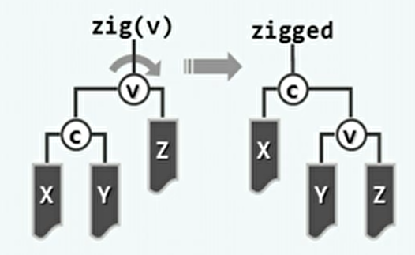
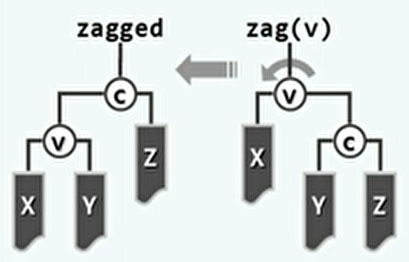
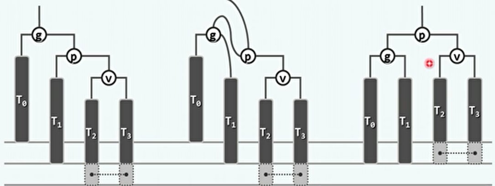
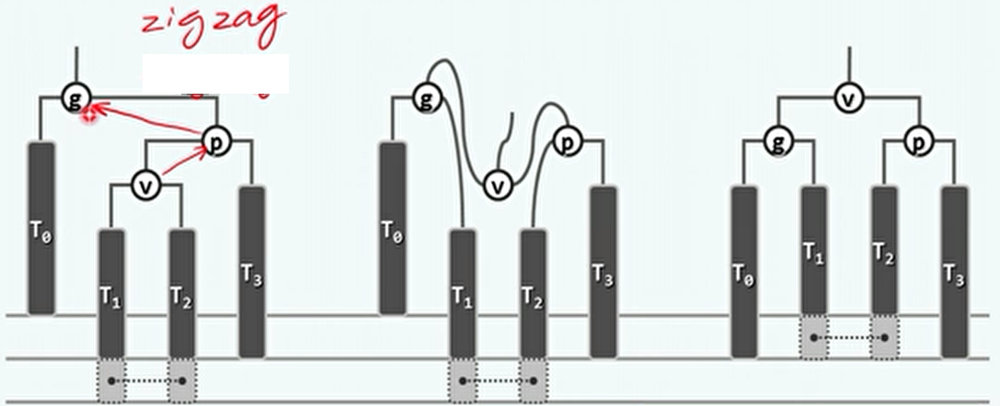
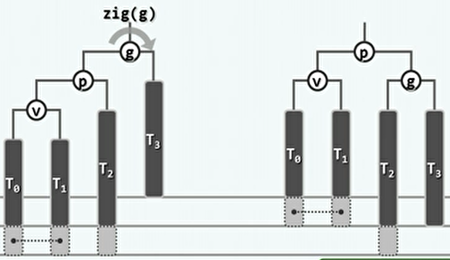
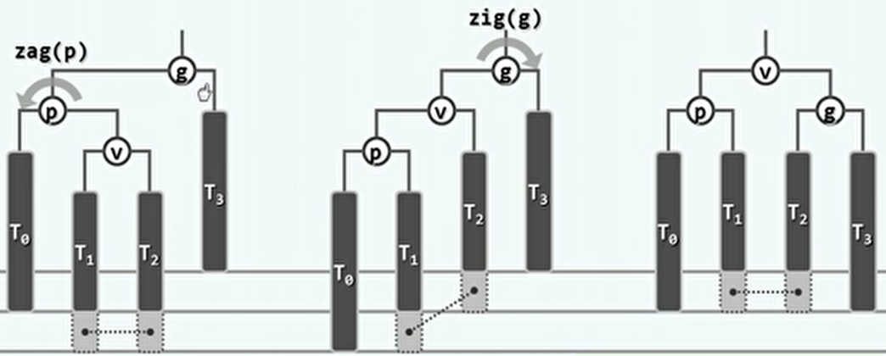
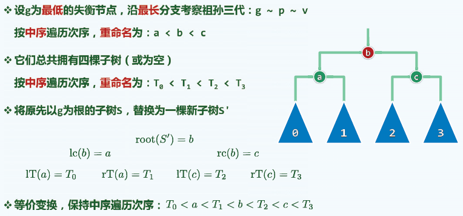
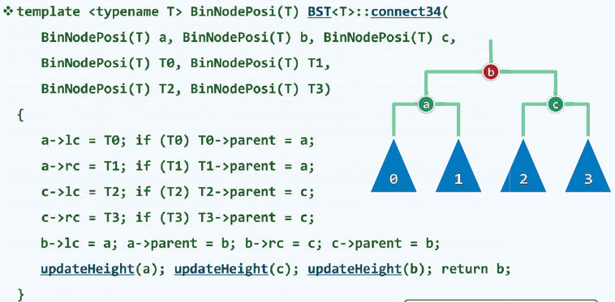
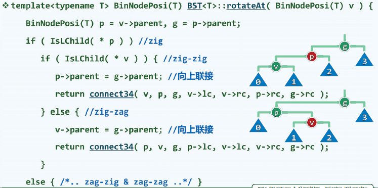

## 1、二叉搜索树

- 二叉搜索树BST，在外形上借鉴了列表，可以看作是二维的列表。同时也借鉴了有序向量的特点。

- 循关键码访问：

  - 数据项之间，依照各自的关键码彼此区分，类似车与车牌之间的关系。
  - 关键码之间需要支持大小比较和相等比对。可以统一的表示和实现为词条形式。

- 词条：

  - 包括关键码和数据，提供了比较器和判等器。
  - 不同的词条之间可以进行比较和判等。

- 二叉搜索树：

  - 节点、词条、关键码之间可以认为是等价的。
  - 顺序性：任意节点均不小于 / 不大于其 左 / 右后代。
  - 顺序性虽然只是局部特征，但是可以导出全局特征：单调性。BST的中序遍历序列，必然是单调非降的。（BST的充要条件）

- BST接口：

  - 派生自二叉树。
  - 对于不同的BST实现，有不同的查找、插入和删除操作，在最坏情况下时间复杂度都是O(h)，即树的高度。
  - 可以认为BST中没有重复节点。

- 查找：

  - 从根节点开始，比较关键码的大小。根据结果，转入左子树或右子树。

  -  其实就是对二叉搜索树的中序遍历序列的结果，对该有序向量进行的二分查找。（减而治之）

  - 实现：

    ```c++
    template <typename T> BinNodePosi(T) & BST<T>::search ( const T & e ) { //在BST中查找关键码e
       if ( !_root || e == _root->data ) { _hot = NULL; return _root; } //在树根v处命中
       for ( _hot = _root; ; ) { //自顶而下
          BinNodePosi(T) & c = ( e < _hot->data ) ? _hot->lc : _hot->rc; //确定方向
          if ( !c || e == c->data ) return c; _hot = c; //命中返回，或者深入一层
       } //无论命中或失败，hot均指向v之父亲（或为NULL）
    } //返回目标节点位置的引用，以便后续插入、删除操作
    ```

  - 接口语义：

    - 返回值：成功时指向一个存在的关键码为目标值e的节点；失败时指向一个不存在的空节点，这个位置是指如果该树中存在目标值e则应在的位置。
    - 返回值总是指向命中节点，_hot指向的是指向命中节点的父亲。

- 插入：

  - 先借助search确定插入位置及方向，再将新节点作为叶子插入。（默认插入值e尚不存在，查找返回的是对新孩子的引用）

  - 插入后更新全树规模和插入点及其祖先的高度。

  - 实现：

    ```c++
    template <typename T> BinNodePosi(T) BST<T>::insert ( const T& e ) { //将关键码e插入BST树中
       BinNodePosi(T) & x = search ( e ); if ( x ) return x; //确认目标不存在（留意对_hot的设置）
       x = new BinNode<T> ( e, _hot ); //创建新节点x：以e为关键码，以_hot为父
       _size++; //更新全树规模
       updateHeightAbove ( x ); //更新x及其历代祖先的高度
       return x; //新插入的节点，必为叶子
    } //无论e是否存在于原树中，返回时总有x->data == e
    ```

- 删除：

  - 先借助search找到所要删除的节点e，然后进行具体的删除操作。

  - 情况1：如果节点e有一颗子树为空，可将其替换为其另一颗一棵子树。

  - 情况2：左右子树都不为空。

    - 首先，找出所要删除节点e的直接后继s。（即中序遍历下的后继，在右子树中不大于节点e的最小值）
    - 然后，将s与e的数据互换。因为s至多只有右子树，左子树必为空，所以在交换位置后再删除e就回到了第一种情况。

  - 新接替的节点需要记录其新的父亲，即原来被删除节点e的父亲。

  - 删除后更新全树规模和原删除点直接后继的父亲及其祖先的高度。

  - 实现：

    ```c++
    template <typename T> bool BST<T>::remove ( const T& e ) { //从BST树中删除关键码e
       BinNodePosi(T) & x = search ( e ); if ( !x ) return false; //确认目标存在（留意_hot的设置）
       removeAt ( x, _hot ); _size--; //实施删除
       updateHeightAbove ( _hot ); //更新_hot及其历代祖先的高度
       return true;
    } //删除成功与否，由返回值指示
    
    template <typename T>
    static BinNodePosi(T) removeAt ( BinNodePosi(T) & x, BinNodePosi(T) & hot ) {
       BinNodePosi(T) w = x; //实际被摘除的节点，初值同x
       BinNodePosi(T) succ = NULL; //实际被删除节点的接替者
       if ( !HasLChild ( *x ) ) //若*x的左子树为空，则可
          succ = x = x->rc; //直接将*x替换为其右子树
       else if ( !HasRChild ( *x ) ) //若右子树为空，则可
          succ = x = x->lc; //对称地处理——注意：此时succ != NULL
       else { //若左右子树均存在，则选择x的直接后继作为实际被摘除节点，为此需要
          w = w->succ(); //（在右子树中）找到*x的直接后继*w
          swap ( x->data, w->data ); //交换*x和*w的数据元素
          BinNodePosi(T) u = w->parent;
          ( ( u == x ) ? u->rc : u->lc ) = succ = w->rc; //隔离节点*w
       }
       hot = w->parent; //记录实际被删除节点的父亲
       if ( succ ) succ->parent = hot; //并将被删除节点的接替者与hot相联
       release ( w->data ); release ( w ); return succ; //释放被摘除节点，返回接替者
    } //release()负责释放复杂结构
    ```


## 2、平衡二叉搜索树

- 因为之前二叉搜索树的操作的时间复杂度都与树高成正比，所以希望评估树高：

  - 随机生成：一个长为n的关键码序列，随机顺序插入一棵二叉搜索树的平均高度是log n。
  - 随机组成：一棵有n个关键码的节点的二叉搜索树，进行随机组合，生成的平均高度是n^0.5。
  - 一般认为随机组成的结果更为可信。

- 理想平衡：

  - 理想平衡：节点数目固定时，兄弟子树高度越接近（平衡），全树也倾向于更低。
  - 由n个节点组成的二叉树，高度不低于 log2 n。当达到这个值时成为理想平衡。
  - 但是理想平衡出现概率极低、维护成本过高,。

- 适度平衡：

  - 高度渐进的不超过log n，即可称为适度平衡。
  - 适度平衡的BST，称为平衡二叉搜索树BBST。
  - 在操作过程中从BBST变为不平衡时，需要将其变换回BBST。

- 等价二叉搜索树：

  - 结构不相同的BST，它们的中序遍历序列也可能是相同的。
  - 如果中序遍历序列相同但拓扑结构不同的，称为等价二叉搜索树。
  - 等价BST：上下可变（父子关系可能颠倒），但左右不乱。

- 等价变换，旋转跳转：

  - zig：右旋。新的根节点是原来根节点的左子树，原来的根节点变成新的根节点的右子树，新的根节点原来的右子树变为的原来的根节点的左子树。

    

  - zag：左旋。

    

  - 等价变换的计算时间在O(1)内。且各节点的高度变化不超过1。

  - 将失衡的BBST恢复平衡的操作次数不应该超过O(log n)。


## 3、AVL树

- AVL树：一种适度平衡的二叉搜索树。

- 平衡因子：

  - 用于评价AVL意义下的适度平衡。
  - 定义为该节点左子树高度减去右子树高度。（空树的高度为-1，只有根节点的为0）
  - AVL要求各个节点的平衡因子在-1到1之间。

- AVL树是适度平衡的：

  - 高度为h的AVL树，至少包含`S(h)=fib(h+3)-1`个节点。（可由S(h)=1+S(h-1)+S(h-2)递推求得）

- 失衡与重平衡：

  - 插入节点可能会使得多个节点失衡。这是因为插入操作只会使其祖先节点的高度变化。
  - 删除节点最多只会让该节点的父亲失衡。这是因为删除操作如果导致失衡，那么这个节点的祖先节点的高度都不会变化。

- 插入操作：

  - 如果插入节点使得多个祖先节点失衡，将对发生失衡的最低的祖先记为g，至少为插入节点的祖父。

  - 单旋（插入T2/T3）：如果插入位置在g的单调位置（左子树的左子树、右子树的右子树），则只需单旋（zag-zag）。

    

  - 双旋（插入T1/T2）：如果插入位置在g的非单调位置（左子树的右子树、右子树的左子树），则需要双旋（zig-zag）。

    

  - 如果插入节点使得多个祖先节点失衡，对其最低的失衡祖先e进行旋转复衡即可。

  - e经过旋转调整后复衡，e为根的子树高度复原，使得更高的祖先也必平衡，全树复衡。

  - 实现：

    ```c++
    template <typename T> BinNodePosi(T) AVL<T>::insert ( const T& e ) { //将关键码e插入AVL树中
       BinNodePosi(T) & x = search ( e ); if ( x ) return x; //确认目标节点不存在
       BinNodePosi(T) xx = x = new BinNode<T> ( e, _hot ); _size++; //创建新节点x
    // 此时，x的父亲_hot若增高，则其祖父有可能失衡
       for ( BinNodePosi(T) g = _hot; g; g = g->parent ) { //从x之父出发向上，逐层检查各代祖先g
          if ( !AvlBalanced ( *g ) ) { //一旦发现g失衡，则（采用“3 + 4”算法）使之复衡，并将子树
             FromParentTo ( *g ) = rotateAt ( tallerChild ( tallerChild ( g ) ) ); //重新接入原树
             break; //g复衡后，局部子树高度必然复原；其祖先亦必如此，故调整随即结束
          } else //否则（g依然平衡），只需简单地
             updateHeight ( g ); //更新其高度（注意：即便g未失衡，高度亦可能增加）
       } //至多只需一次调整；若果真做过调整，则全树高度必然复原
       return xx; //返回新节点位置
    } //无论e是否存在于原树中，总有AVL::insert(e)->data == e
    ```

- 删除操作：

  - 如果删除节点使得多个祖先节点失衡，将对发生失衡的最低的祖先记为g，可能是删除节点从父亲开始的所有祖先。

  - 插入会导致该子树高度增加而失衡，删除会导致该子树高度降低而失衡。将失衡的节点中高度较高的子树位置称为失衡位置v。

  - 单旋（删除T3）：如果失衡位置在g的单调位置（左子树的左子树、右子树的右子树），则单旋（zig-zig）后使得局部复衡。

    

  - 双旋（删除T3）：如果失衡位置在g的非单调位置（左子树的右子树、右子树的左子树），则双旋（zag-zig）后使得局部复衡。

    

  - 因为复衡后，子树的高度未必复原（如果单旋中T2的最后一个节点不存在；而双旋中高度必减一），所以更高层的祖先仍然可能失衡。

  - 因为有失衡传播现象，可能需要做O(log n)次调整。

  - 实现：

    ```c++
    template <typename T> bool AVL<T>::remove ( const T& e ) { //从AVL树中删除关键码e
       BinNodePosi(T) & x = search ( e ); if ( !x ) return false; //确认目标存在（留意_hot的设置）
       removeAt ( x, _hot ); _size--; //先按BST规则删除之（此后，原节点之父_hot及其祖先均可能失衡）
       for ( BinNodePosi(T) g = _hot; g; g = g->parent ) { //从_hot出发向上，逐层检查各代祖先g
          if ( !AvlBalanced ( *g ) ) //一旦发现g失衡，则（采用“3 + 4”算法）使之复衡，并将该子树联至
             g = FromParentTo ( *g ) = rotateAt ( tallerChild ( tallerChild ( g ) ) ); //原父亲
          updateHeight ( g ); //并更新其高度（注意：即便g未失衡，高度亦可能降低）
       } //可能需做Omega(logn)次调整——无论是否做过调整，全树高度均可能降低
       return true; //删除成功
    } //若目标节点存在且被删除，返回true；否则返回false
    ```

    

- 3+4重构：

  - 在实际的算法实现中，不必要使用多次左旋和右旋，而是使用3+4重构。

  - 算法思路：按其中序遍历次序重构。

    

  - 实现：

    

  - 根据何种规则重命名：

    - 具体来说应该是先找到发生失衡的最低的祖先g，再依此寻找较高的子树部分的p和v。
    - 传入v的理由是可以直接唯一的找出p和g。

    


- AVL树：
  - 优点：无论查找、插入或删除，最坏情况下复杂度均为O(log n)。存储空间仍为O(n)。
  - 缺点：
    - 人为引入了平衡因子，需要改造元素结构。
    - 实测复杂度与理论值尚有差距。
    - 单次动态调整中，全局拓扑结构的变化量可能高达Ω(log n)。（对于插入是O(1)，对于删除是O(log n)）。


