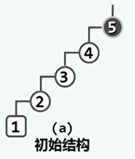
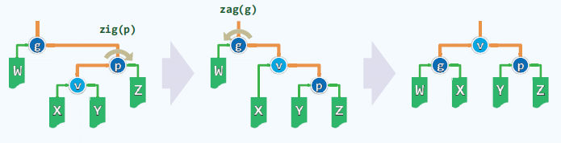
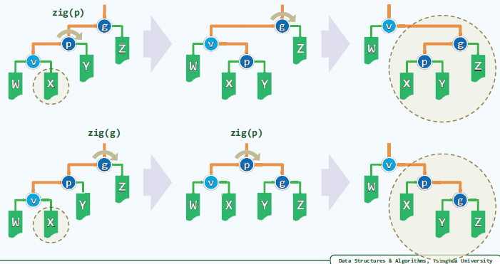
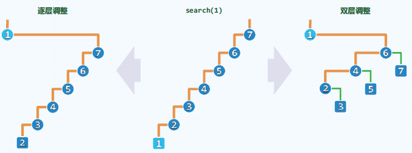
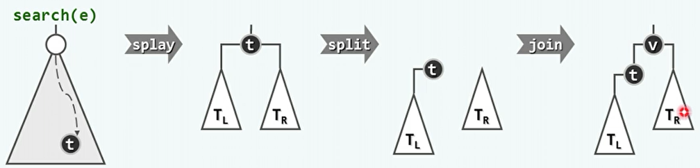
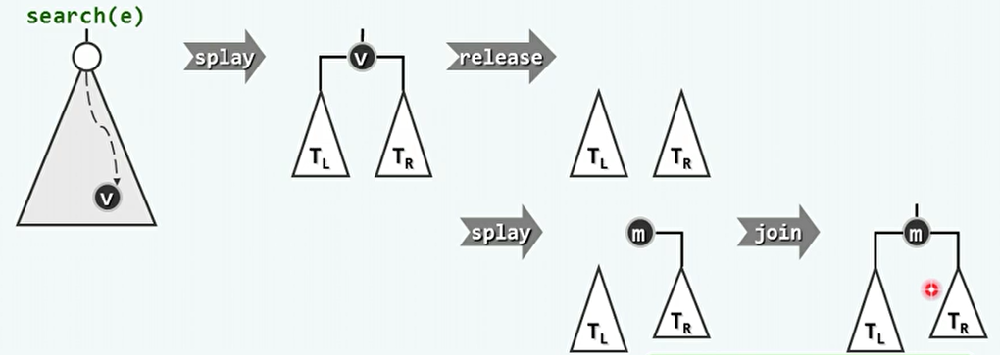
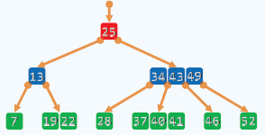
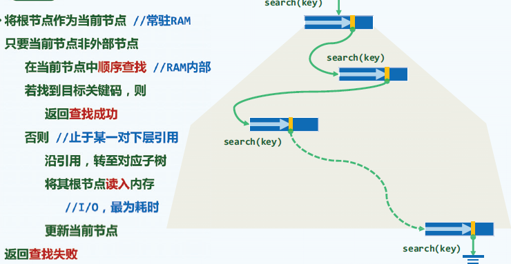

## 1、伸展树

- 局部性：刚被访问过的数据，极有可能会很快的在此被访问。

- 对于BST而言，刚刚访问的节点，极有可能很快被再次访问。而下一将要访问的节点，极有可能就在刚被访问过节点的附近。

- 局部性对于查找算法的意义：将刚刚被访问的节点移送到深度较浅的位置（树根）。如果找不到目标，则操作最后一个访问到的节点。

- 局部性对于插入算法的意义：首先插入首先需要先进行一次查找，将最后一个访问到的节点伸展到树根，再在树根位置插入目标。

- 局部性对于删除操作的意义：删除后，将一个与删除节点临近的节点作为根节点。

- 逐层伸展：

  - 节点v一旦被访问，随即转移至树根。

  - 可以通过多次的zig/zag操作，降低节点的深度，最终到达树根的位置。

  - 最坏情况：逐层伸展将最终回到原状。分摊Ω(n)。

    

- 双层伸展：

  - 每次向上追溯两层，而不是一层。即从节点v，开启，其父亲p和祖父g，经过双层伸展后都会成为v的后代。节点v变换后达到了原来祖父g的深度。

  - 具体的操作：

    - 对于子孙异侧的情况，通过zig-zag或zag-zig变换。实际上与两次逐层伸展没有区别。

      

    - 对于子孙同侧的情况，通过zig-zig或zag-zag变换。上边是先旋转p，再旋转g，相当于两次逐层伸展。下边是先旋转g，再旋转p，是双层伸展。可以看出其局部结果不同，

      

  - 这样的效果是，对于子孙同侧的情况下，每次伸展都会使得树高降低。也就是具有折叠效果，一旦访问坏节点（较深的），对应路径的长度将随即减半。分摊O(log n)。

    

  - 如果v的深度为技术，即可能出现v只有父亲没有祖父。这种情况只需要在最后执行单次旋转即可。


- 算法实现：

  - 伸展算法：

    ```c++
    template <typename NodePosi> inline //在节点*p与*lc（可能为空）之间建立父（左）子关系
    void attachAsLChild ( NodePosi p, NodePosi lc ) { p->lc = lc; if ( lc ) lc->parent = p; }
    
    template <typename NodePosi> inline //在节点*p与*rc（可能为空）之间建立父（右）子关系
    void attachAsRChild ( NodePosi p, NodePosi rc ) { p->rc = rc; if ( rc ) rc->parent = p; }
    
    template <typename T> //Splay树伸展算法：从节点v出发逐层伸展
    BinNodePosi(T) Splay<T>::splay ( BinNodePosi(T) v ) { //v为因最近访问而需伸展的节点位置
       if ( !v ) return NULL; BinNodePosi(T) p; BinNodePosi(T) g; //*v的父亲与祖父
       while ( ( p = v->parent ) && ( g = p->parent ) ) { //自下而上，反复对*v做双层伸展
          BinNodePosi(T) gg = g->parent; //每轮之后*v都以原曾祖父（great-grand parent）为父
          if ( IsLChild ( *v ) )
             if ( IsLChild ( *p ) ) { //zig-zig
                /*DSA*/printf ( "\tzIg-zIg :" ); print ( g ); print ( p ); print ( v ); printf ( "\n" );
                attachAsLChild ( g, p->rc ); attachAsLChild ( p, v->rc );
                attachAsRChild ( p, g ); attachAsRChild ( v, p );
             } else { //zig-zag
                /*DSA*/printf ( "\tzIg-zAg :" ); print ( g ); print ( p ); print ( v ); printf ( "\n" );
                attachAsLChild ( p, v->rc ); attachAsRChild ( g, v->lc );
                attachAsLChild ( v, g ); attachAsRChild ( v, p );
             }
          else if ( IsRChild ( *p ) ) { //zag-zag
             /*DSA*/printf ( "\tzAg-zAg :" ); print ( g ); print ( p ); print ( v ); printf ( "\n" );
             attachAsRChild ( g, p->lc ); attachAsRChild ( p, v->lc );
             attachAsLChild ( p, g ); attachAsLChild ( v, p );
          } else { //zag-zig
             /*DSA*/printf ( "\tzAg-zIg :" ); print ( g ); print ( p ); print ( v ); printf ( "\n" );
             attachAsRChild ( p, v->lc ); attachAsLChild ( g, v->rc );
             attachAsRChild ( v, g ); attachAsLChild ( v, p );
          }
          if ( !gg ) v->parent = NULL; //若*v原先的曾祖父*gg不存在，则*v现在应为树根
          else //否则，*gg此后应该以*v作为左或右孩子
             ( g == gg->lc ) ? attachAsLChild ( gg, v ) : attachAsRChild ( gg, v );
          updateHeight ( g ); updateHeight ( p ); updateHeight ( v );
       } //双层伸展结束时，必有g == NULL，但p可能非空
       if ( p = v->parent ) { //若p果真非空，则额外再做一次单旋
          /*DSA*/if ( IsLChild ( *v ) ) { printf ( "\tzIg :" ); print ( p ); print ( v ); printf ( "\n" ); }
          /*DSA*/else              { printf ( "\tzAg :" ); print ( p ); print ( v ); printf ( "\n" ); }
          if ( IsLChild ( *v ) ) { attachAsLChild ( p, v->rc ); attachAsRChild ( v, p ); }
          else                   { attachAsRChild ( p, v->lc ); attachAsLChild ( v, p ); }
          updateHeight ( p ); updateHeight ( v );
       }
       v->parent = NULL; return v;
    } //调整之后新树根应为被伸展的节点，故返回该节点的位置以便上层函数更新树根
    ```

  - 查找算法：

    ```c++
    template <typename T> BinNodePosi(T) & Splay<T>::search ( const T & e ) { //在伸展树中查找e
       BinNodePosi(T) p = BST<T>::search ( e );
       _root = splay ( p ? p : _hot ); //将最后一个被访问的节点伸展至根
       return _root;
    } //与其它BST不同，无论查找成功与否，_root都指向最后被访问的节点
    ```

  - 插入算法：

    - 插入的语义，先执行一次搜索，将返回的终点节点伸展为树根，再将所要插入的数据插入在树根。
    - 终点节点伸展为树根，是为了快速的确定插入节点的位置。

    

    ```c++
    template <typename T> BinNodePosi(T) Splay<T>::insert ( const T& e ) { //将关键码e插入伸展树中
       if ( !_root ) { _size++; return _root = new BinNode<T> ( e ); } //处理原树为空的退化情况
       if ( e == search ( e )->data ) return _root; //确认目标节点不存在
       _size++; BinNodePosi(T) t = _root; //创建新节点。以下调整<=7个指针以完成局部重构
       if ( _root->data < e ) { //插入新根，以t和t->rc为左、右孩子
          t->parent = _root = new BinNode<T> ( e, NULL, t, t->rc ); //2 + 3个
          if ( HasRChild ( *t ) ) { t->rc->parent = _root; t->rc = NULL; } //<= 2个
       } else { //插入新根，以t->lc和t为左、右孩子
          t->parent = _root = new BinNode<T> ( e, NULL, t->lc, t ); //2 + 3个
          if ( HasLChild ( *t ) ) { t->lc->parent = _root; t->lc = NULL; } //<= 2个
       }
       updateHeightAbove ( t ); //更新t及其祖先（实际上只有_root一个）的高度
       return _root; //新节点必然置于树根，返回之
    } //无论e是否存在于原树中，返回时总有_root->data == e
    ```

  - 删除算法：

    - 先查找，将目标节点伸展至树根。
    - 在树根处删除，然后选择左子树中的最大值或右子树中的最小值作为树根。

    

    ```c++
    template <typename T> bool Splay<T>::remove ( const T& e ) { //从伸展树中删除关键码e
       if ( !_root || ( e != search ( e )->data ) ) return false; //若树空或目标不存在，则无法删除
       BinNodePosi(T) w = _root; //assert: 经search()后节点e已被伸展至树根
       if ( !HasLChild ( *_root ) ) { //若无左子树，则直接删除
          _root = _root->rc; if ( _root ) _root->parent = NULL;
       } else if ( !HasRChild ( *_root ) ) { //若无右子树，也直接删除
          _root = _root->lc; if ( _root ) _root->parent = NULL;
       } else { //若左右子树同时存在，则
          BinNodePosi(T) lTree = _root->lc;
          lTree->parent = NULL; _root->lc = NULL; //暂时将左子树切除
          _root = _root->rc; _root->parent = NULL; //只保留右子树
          search ( w->data ); //以原树根为目标，做一次（必定失败的）查找
    ///// assert: 至此，右子树中最小节点必伸展至根，且（因无雷同节点）其左子树必空，于是
          _root->lc = lTree; lTree->parent = _root; //只需将原左子树接回原位即可
       }
       release ( w->data ); release ( w ); _size--; //释放节点，更新规模
       if ( _root ) updateHeight ( _root ); //此后，若树非空，则树根的高度需要更新
       return true; //返回成功标志
    } //若目标节点存在且被删除，返回true；否则返回false
    ```

    

- 伸展树：
  - 无需记录节点高度或平衡银子，分摊复杂度O(log n)。
  - 局部性强、缓存命中率高时，效率会更高。
  - 伸展树的目标其实是，最终构建一个最常访问的规模为k的BBST。这一部分在整个伸展树的最上层，其下的不常访问的数据就像不存在一样。
  - 仍不能保证单次最坏情况的出现，不适用于对单次操作效率敏感的场合。


## 2、B树

- 动机：弥合不同存储级别上在访问速度上的差异，实现高效IO。

  - 事实1：容量的存储器，访问速度差异悬殊。磁盘与内存的访问速度相差在5个数量级左右。
  - 使用缓存和多级存储系统，最常用的数据尽可能放在更高层、更小的存储器中。实在找不到，才向更低层、更大的存储器索取。不同级别之间的数据访问就是IO。
  - 事实2：从磁盘中读写1B，与读写1KB几乎一样快。即批量式读取可以提高效率。

- B树的结构：

  - 每个节点可以具有多个分叉。所有叶子节点的深度都是相同的。
  - 是一种平衡的多路搜索树。B树中的非叶子节点称作超级节点，可以由多代的二叉搜索树合并得来。
  - 意义：在多级存储系统汇总使用B树，可针对外部查找，可以大大减少IO操作。
  - 对于树型结构而言，每进入下一层就要进行一次IO操作，对二叉树来说次数太多。而B树可以充分利用外存对批量访问的高效支持，每下降一次就读入一个超级节点中的一组关键码。

  

- B树的严格定义：

  - m阶B树，即m路平衡搜索树。（m>2）
  - 外部节点的深度统一相等，叶节点的深度统一相等。外部节点就是叶节点所指向的为空的子节点，也可能是指向更低层次存储级别的B树。
  - 树高等于外部节点的深度。

- 对于阶次m（记内部节点中关键码个数为n）：

  - 上界：
    - 关键码个数n<=m-1。
    - 分支数n+1<=m。
  - 下界：
    - 树根的分支数为n+1>=2。
    - 其他节点的分支数n+1>=[m/2]。
  - 也可将某种树记为([m/2],m)树。

- B树的实现：

  - B树节点：用两个向量保存关键码和指向孩子的引用。

    ```c++
    template <typename T> struct BTNode { //B-树节点模板类
    // 成员（为简化描述起见统一开放，读者可根据需要进一步封装）
       BTNodePosi(T) parent; //父节点
       Vector<T> key; //关键码向量
       Vector<BTNodePosi(T)> child; //孩子向量（其长度总比key多一）
    // 构造函数（注意：BTNode只能作为根节点创建，而且初始时有0个关键码和1个空孩子指针）
       BTNode() { parent = NULL; child.insert ( 0, NULL ); }
       BTNode ( T e, BTNodePosi(T) lc = NULL, BTNodePosi(T) rc = NULL ) {
          parent = NULL; //作为根节点，而且初始时
          key.insert ( 0, e ); //只有一个关键码，以及
          child.insert ( 0, lc ); child.insert ( 1, rc ); //两个孩子
          if ( lc ) lc->parent = this; if ( rc ) rc->parent = this;
       }
    };
    ```

  - B树：核心是由于插入上溢和由于删除下溢后的操作。

    ```c++
    template <typename T> class BTree { //B-树模板类
    protected:
       int _size; //存放的关键码总数
       int _order; //B-树的阶次，至少为3——创建时指定，一般不能修改
       BTNodePosi(T) _root; //根节点
       BTNodePosi(T) _hot; //BTree::search()最后访问的非空（除非树空）的节点位置
       void solveOverflow ( BTNodePosi(T) ); //因插入而上溢之后的分裂处理
       void solveUnderflow ( BTNodePosi(T) ); //因删除而下溢之后的合并处理
    public:
       BTree ( int order = 3 ) : _order ( order ), _size ( 0 ) //构造函数：默认为最低的3阶
       { _root = new BTNode<T>(); }
       ~BTree() { if ( _root ) release ( _root ); } //析构函数：释放所有节点
       int const order() { return _order; } //阶次
       int const size() { return _size; } //规模
       BTNodePosi(T) & root() { return _root; } //树根
       bool empty() const { return !_root; } //判空
       BTNodePosi(T) search ( const T& e ); //查找
       bool insert ( const T& e ); //插入
       bool remove ( const T& e ); //删除
    }; //BTree
    ```

- B树的操作：

  - 查找算法：

    - 只将必需的节点载入内存，减少IO操作。
    - 如果查找失败，则必然失败于指向外部节点。

    

    ```c++
    template <typename T> BTNodePosi(T) BTree<T>::search ( const T& e ) { //在B-树中查找关键码e
       BTNodePosi(T) v = _root; _hot = NULL; //从根节点出发
       while ( v ) { //逐层查找
          Rank r = v->key.search ( e ); //在当前节点中，找到不大于e的最大关键码
          if ( ( 0 <= r ) && ( e == v->key[r] ) ) return v; //成功：在当前节点中命中目标关键码
          _hot = v; v = v->child[r + 1]; //否则，转入对应子树（_hot指向其父）——需做I/O，最费时间
       } //这里在向量内是二分查找，但对通常的_order可直接顺序查找
       return NULL; //失败：最终抵达外部节点
    }
    ```

  - 时间复杂度：

    - 影响查找的最主要因素是树的高度。
    - 时间的主要成本，是每次深入下一层时的IO操作。
    - 时间的次要成本，是每次在超级节点内部的向量进行查找。

  - 树高：含N个关键码的m阶B树。

    - 最大树高：内部节点的分支数达到下界。
      - h<=1+log[m/2] [(N+1)/2]。
      - 对于含N个关键码的B树，则这颗B树有N+1个外部节点。
      - 相对于BBST，树高降低至原来的1/(log2 m -1)。m=256时，约是1/7。
    - 最小树高：内部节点的分支数达到上界。
      -  h>=logm(N+1)。
      - 相对于BBST，树高降低至原来的logm 2 - logN 2。m=256时，约是1/8。


