## 1、B树（续）

-  插入算法：

  - 首先调用查找算法确认元素不存在，返回所要插入的叶子节点。

  - 在该叶子节点中的关键码向量中进行查找，并且在合适的位置插入，同时插入新的空分支（外部节点）。

  - 更新树的规模，如果发生上溢，需要做分裂。

  - 上溢：因为新关键码的插入，导致节点分支大于B树规定的分支上界。

  - 分裂：

    - 对于m阶B树，如果插入后发生上溢，则说明原来该结点有m-1个关键码、m个分支（可称为临界状态）。

    - 取该节点中关键码的中位数，上升一层。将原来左侧的节点向量和右侧的节点向量分别作为上升后节点的左右孩子。

      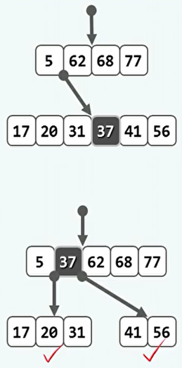

    - 但是没这样的操作，也有可能导致上升后的父节点上溢。并且可能逐层向上传播，最终到达根节点。

    - 在根节点的操作也是类似，但是根节点的上层本不存在。因此上升后，B树的高度增加一，这也是B树高度增加的唯一方式。

      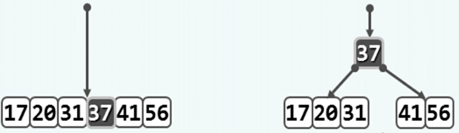

    - 分裂操作是时间复杂度O(h)。

  - 实现：

    ```c++
    template <typename T> bool BTree<T>::insert ( const T& e ) { //将关键码e插入B树中
       BTNodePosi(T) v = search ( e ); if ( v ) return false; //确认目标节点不存在
       Rank r = _hot->key.search ( e ); //在节点_hot的有序关键码向量中查找合适的插入位置
       _hot->key.insert ( r + 1, e ); //将新关键码插至对应的位置
       _hot->child.insert ( r + 2, NULL ); //创建一个空子树指针
       _size++; //更新全树规模
       solveOverflow ( _hot ); //如有必要，需做分裂
       return true; //插入成功
    }
    
    template <typename T> //关键码插入后若节点上溢，则做节点分裂处理
    void BTree<T>::solveOverflow ( BTNodePosi(T) v ) {
       if ( _order >= v->child.size() ) return; //递归基：当前节点并未上溢
       Rank s = _order / 2; //轴点（此时应有_order = key.size() = child.size() - 1）
       BTNodePosi(T) u = new BTNode<T>(); //注意：新节点已有一个空孩子
       for ( Rank j = 0; j < _order - s - 1; j++ ) { //v右侧_order-s-1个孩子及关键码分裂为右侧节点u
          u->child.insert ( j, v->child.remove ( s + 1 ) ); //逐个移动效率低
          u->key.insert ( j, v->key.remove ( s + 1 ) ); //此策略可改进
       }
       u->child[_order - s - 1] = v->child.remove ( s + 1 ); //移动v最靠右的孩子
       if ( u->child[0] ) //若u的孩子们非空，则
          for ( Rank j = 0; j < _order - s; j++ ) //令它们的父节点统一
             u->child[j]->parent = u; //指向u
       BTNodePosi(T) p = v->parent; //v当前的父节点p
       if ( !p ) { _root = p = new BTNode<T>(); p->child[0] = v; v->parent = p; } //若p空则创建之
       Rank r = 1 + p->key.search ( v->key[0] ); //p中指向u的指针的秩
       p->key.insert ( r, v->key.remove ( s ) ); //轴点关键码上升
       p->child.insert ( r + 1, u );  u->parent = p; //新节点u与父节点p互联
       solveOverflow ( p ); //上升一层，如有必要则继续分裂——至多递归O(logn)层
    }
    ```

    

- 删除算法：

  - 首先查找确认该元素存在，并且返回其所在的节点。

  - 如果是在叶子节点，可以直接删除。

  - 如果不是叶子节点，则找到该节点的直接后继。该节点与其直接后继交换位置后成为叶节点（或继续向下交换），可以直接删除。

  - 下溢：因为关键码的删除，导致节点分支小于B树规定的分支下界。

  - 旋转：

    - 对于m阶B树，如果删除后发生下溢，则说明原来该结点有[m/2]-1个关键码、[m/2]个分支（可称为临界状态）。

    - 发生下溢的节点，会查看其左右兄弟，看其是否有足够的节点借给自己。

    - 借出的流程是，下溢的节点借入与所要借出的兄弟共同的父节点，然后该兄弟再借出最大/最小的关键码替换原有的父节点。其实就是一次旋转。

      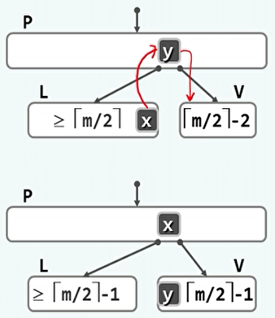

  - 极端情况下是，下溢的节点没有左右兄弟，或者不足以借出关键码。

    - 这种情况下，如果还是存在左兄弟或右兄弟，尽管其无法借出节点。可以进行合并，将其与该兄弟和父节点合并。

      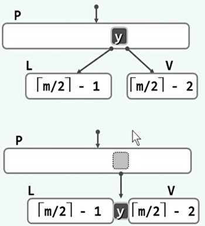

    - 这种操作，相当于从父节点中删除了一个关键码。可能会导致下溢逐层向上。

    - 如果下溢到达根节点，合并可能会导致树的高度减一。这也是B树高度下降的唯一方式。

    - 合并与分裂综合的时间复杂度O(h)。

  - 实现：

    ```c++
    template <typename T> bool BTree<T>::remove ( const T& e ) { //从BTree树中删除关键码e
       BTNodePosi(T) v = search ( e ); if ( !v ) return false; //确认目标关键码存在
       Rank r = v->key.search ( e ); //确定目标关键码在节点v中的秩（由上，肯定合法）
       if ( v->child[0] ) { //若v非叶子，则e的后继必属于某叶节点
          BTNodePosi(T) u = v->child[r+1]; //在右子树中一直向左，即可
          while ( u->child[0] ) u = u->child[0]; //找出e的后继
          v->key[r] = u->key[0]; v = u; r = 0; //并与之交换位置
       } //至此，v必然位于最底层，且其中第r个关键码就是待删除者
       v->key.remove ( r ); v->child.remove ( r + 1 ); _size--; //删除e，以及其下两个外部节点之一
       solveUnderflow ( v ); //如有必要，需做旋转或合并
       return true;
    }
    
    template <typename T> //关键码删除后若节点下溢，则做节点旋转或合并处理
    void BTree<T>::solveUnderflow ( BTNodePosi(T) v ) {
       if ( ( _order + 1 ) / 2 <= v->child.size() ) return; //递归基：当前节点并未下溢
       BTNodePosi(T) p = v->parent;
       if ( !p ) { //递归基：已到根节点，没有孩子的下限
          if ( !v->key.size() && v->child[0] ) {
             //但倘若作为树根的v已不含关键码，却有（唯一的）非空孩子，则
             /*DSA*/printf ( "collapse\n" );
             _root = v->child[0]; _root->parent = NULL; //这个节点可被跳过
             v->child[0] = NULL; release ( v ); //并因不再有用而被销毁
          } //整树高度降低一层
          return;
       }
       Rank r = 0; while ( p->child[r] != v ) r++;
       //确定v是p的第r个孩子——此时v可能不含关键码，故不能通过关键码查找
       //另外，在实现了孩子指针的判等器之后，也可直接调用Vector::find()定位
       /*DSA*/printf ( "\nrank = %d", r );
    // 情况1：向左兄弟借关键码
       if ( 0 < r ) { //若v不是p的第一个孩子，则
          BTNodePosi(T) ls = p->child[r - 1]; //左兄弟必存在
          if ( ( _order + 1 ) / 2 < ls->child.size() ) { //若该兄弟足够“胖”，则
             /*DSA*/printf ( " ... case 1\n" );
             v->key.insert ( 0, p->key[r - 1] ); //p借出一个关键码给v（作为最小关键码）
             p->key[r - 1] = ls->key.remove ( ls->key.size() - 1 ); //ls的最大关键码转入p
             v->child.insert ( 0, ls->child.remove ( ls->child.size() - 1 ) );
             //同时ls的最右侧孩子过继给v
             if ( v->child[0] ) v->child[0]->parent = v; //作为v的最左侧孩子
             return; //至此，通过右旋已完成当前层（以及所有层）的下溢处理
          }
       } //至此，左兄弟要么为空，要么太“瘦”
    // 情况2：向右兄弟借关键码
       if ( p->child.size() - 1 > r ) { //若v不是p的最后一个孩子，则
           
             return; //至此，通过左旋已完成当前层（以及所有层）的下溢处理
          }
       } //至此，右兄弟要么为空，要么太“瘦”
    // 情况3：左、右兄弟要么为空（但不可能同时），要么都太“瘦”——合并
       if ( 0 < r ) { //与左兄弟合并
          /*DSA*/printf ( " ... case 3L\n" );
          BTNodePosi(T) ls = p->child[r - 1]; //左兄弟必存在
          ls->key.insert ( ls->key.size(), p->key.remove ( r - 1 ) ); p->child.remove ( r );
          //p的第r - 1个关键码转入ls，v不再是p的第r个孩子
          ls->child.insert ( ls->child.size(), v->child.remove ( 0 ) );
          if ( ls->child[ls->child.size() - 1] ) //v的最左侧孩子过继给ls做最右侧孩子
             ls->child[ls->child.size() - 1]->parent = ls;
          while ( !v->key.empty() ) { //v剩余的关键码和孩子，依次转入ls
             ls->key.insert ( ls->key.size(), v->key.remove ( 0 ) );
             ls->child.insert ( ls->child.size(), v->child.remove ( 0 ) );
             if ( ls->child[ls->child.size() - 1] ) ls->child[ls->child.size() - 1]->parent = ls;
          }
          release ( v ); //释放v
       } else { //与右兄弟合并
           
          }
          release ( v ); //释放v
       }
       solveUnderflow ( p ); //上升一层，如有必要则继续分裂——至多递归O(logn)层
       return;
    }
    ```

    

- 对于逐层传播分裂和合并操作，虽然不难构造，但是在实际应用中很少出现。

- B树每个节点中有许多关键码的原因是，使得将节点载入内存和在内存中对节点中的关键码进行搜索二者花费的时间相当。


## 2、红黑树

- 一致性结构：支持对历史版本的访问的数据结构。而之前的数据结构的状态都是瞬态的，进行动态操作后就会变化，无法获知之前的状态。

- 关联性：不同版本之间大量共享，少量更新。

  - 这样每个版本的新增复杂度为O(log n)。但是我们希望能达到O(1)，这就要求相邻两个版本之间的差异（旋转操作）不能超过O(1)。
  - 以AVL树为例，其插入操作可达到，而删除操作达不到。红黑树就是能满足该要求（任何一次动态操作引发的结构变化量不至超过O(1)）的BBST。

- 红黑树的定义：

  - 由红黑两类节点组成（统一给每个内部节点增设外部节点null，使之成为真二叉树）。
  - 树根必为黑色。
  - 外部节点也都是黑色。
  - 其余节点若为红，则只能有黑色的孩子。（红之子、之父必为黑）
  - 外部节点到根，途中黑节点的数目相等（黑深度）。

- 提升变换：将每个红色节点都提升为与其父亲平齐（等高）。这样可以看出，红黑树其实就是一棵（2,4）B树。

  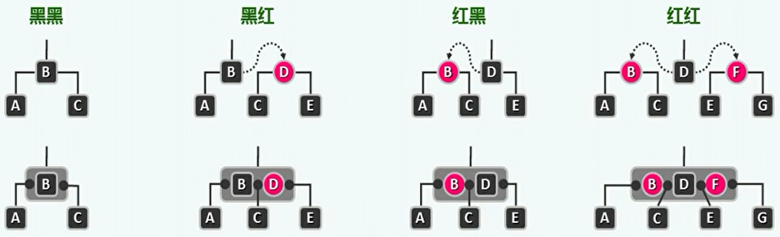

- 红黑树接口定义：

  - 包括双红修正、双黑修正和更新黑高度等。

  ```c++
  template <typename T> class RedBlack : public BST<T> { //RedBlack树模板类
  protected:
     void solveDoubleRed ( BinNodePosi(T) x ); //双红修正
     void solveDoubleBlack ( BinNodePosi(T) x ); //双黑修正
     int updateHeight ( BinNodePosi(T) x ); //更新节点x的高度
  public:
     BinNodePosi(T) insert ( const T& e ); //插入（重写）
     bool remove ( const T& e ); //删除（重写）
  // BST::search()等其余接口可直接沿用
  };
  ```

- 插入算法：

  - 双红缺陷：

    - 插入关键码e后，成为节点x，将其染红。因为这样其不是根节点或外部节点，而且对路径上的黑高度没有影响。
    - 此时如果x的父亲也是红色，就违反了红黑树规则，称为双红缺陷。

    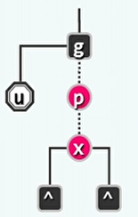

    - 此时需要考察x的祖父g（必为黑），父亲p（红），叔父u（颜色未知）。根据u的不同颜色，需要进行不同的处理。

  - 叔父为黑：

    - 将不同拓扑结构的红黑树提升变换为B树，可以看出违规的主要原因的在B树节点中出现了红色关键码相邻。

    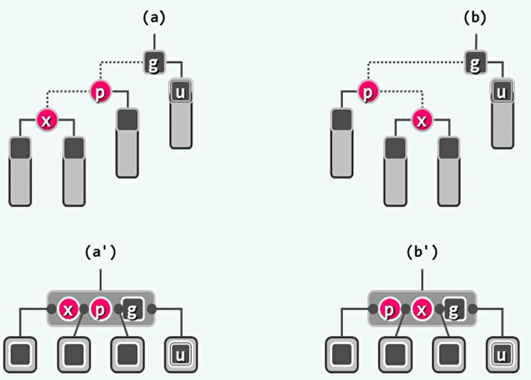

    - 处理方法是只需将中间的红色节点染黑，将黑色节点染红即可。
    - 在红黑树的定义下，执行标准BST的3+4重构加交换染色即可。

    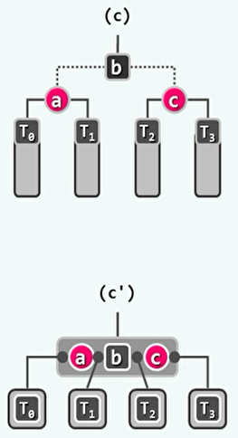

    - 需要进行1~2次旋转操作，2次染色操作。而且调整后立即符合规则。

  - 叔父为红：

    - 这种情况下提升变换得到的4阶B树发生了上溢。

    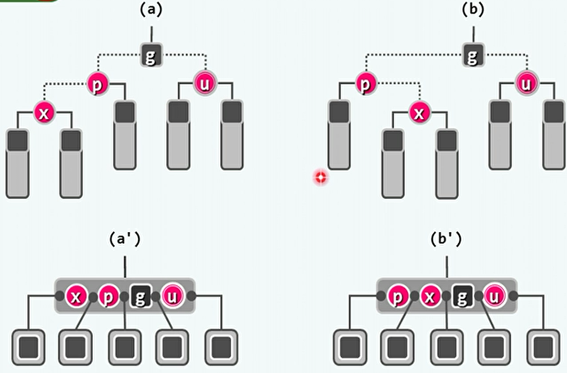

    - 处理方法就是处理B树的上溢。将节点g染红，将节点p染黑。而处理上溢有可能导致上层发生新的双红缺陷。

    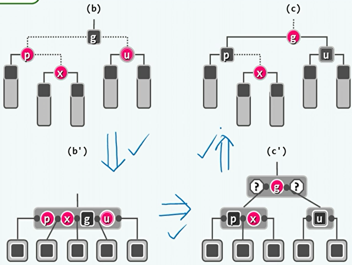

    - 尽管在B树意义下进行了拓扑结构变化，但在红黑树意义下只进行了颜色变化，拓扑连接关系不变。
    - 不需要进行旋转，需要进行3次染色。但有可能让上层再次双红。

  - 插入操作至多需要O(log n)次节点染色和一次3+4重构。AVL树也可达到此水平。

  - 实现：

    ```c++
    template <typename T> BinNodePosi(T) RedBlack<T>::insert ( const T& e ) { //将e插入红黑树
       BinNodePosi(T) & x = search ( e ); if ( x ) return x; //确认目标不存在（留意对_hot的设置）
       x = new BinNode<T> ( e, _hot, NULL, NULL, -1 ); _size++; //创建红节点x：以_hot为父，黑高度-1
       BinNodePosi(T) xOld = x; solveDoubleRed ( x ); return xOld; //经双红修正后，即可返回
    } //无论e是否存在于原树中，返回时总有x->data == e
    
    template <typename T> void RedBlack<T>::solveDoubleRed ( BinNodePosi(T) x ) { //x当前必为红
       if ( IsRoot ( *x ) ) //若已（递归）转至树根，则将其转黑，整树黑高度也随之递增
          {  _root->color = RB_BLACK; _root->height++; return;  } //否则，x的父亲p必存在
       BinNodePosi(T) p = x->parent; if ( IsBlack ( p ) ) return; //若p为黑，则可终止调整。否则
       BinNodePosi(T) g = p->parent; //既然p为红，则x的祖父必存在，且必为黑色
       BinNodePosi(T) u = uncle ( x ); //以下，视x叔父u的颜色分别处理
       if ( IsBlack ( u ) ) { //u为黑色（含NULL）时 //*DSA*/printf("  case RR-1:\n");
          if ( IsLChild ( *x ) == IsLChild ( *p ) ) //若x与p同侧（即zIg-zIg或zAg-zAg），则
             p->color = RB_BLACK; //p由红转黑，x保持红
          else //若x与p异侧（即zIg-zAg或zAg-zIg），则
             x->color = RB_BLACK; //x由红转黑，p保持红
          g->color = RB_RED; //g必定由黑转红
    ///// 以上虽保证总共两次染色，但因增加了判断而得不偿失
    ///// 在旋转后将根置黑、孩子置红，虽需三次染色但效率更高
          BinNodePosi(T) gg = g->parent; //曾祖父（great-grand parent）
          BinNodePosi(T) r = FromParentTo ( *g ) = rotateAt ( x ); //调整后的子树根节点
          r->parent = gg; //与原曾祖父联接
       } else { //若u为红色 //*DSA*/printf("  case RR-2:\n");
          p->color = RB_BLACK; p->height++; //p由红转黑
          u->color = RB_BLACK; u->height++; //u由红转黑
          if ( !IsRoot ( *g ) ) g->color = RB_RED; //g若非根，则转红
          solveDoubleRed ( g ); //继续调整g（类似于尾递归，可优化为迭代形式）
       }
    }
    ```

    

- 删除操作：

  - 双黑缺陷：

    - 将节点x删除后，x原来的位置由孩子r接替。有可能出现双红或者黑高度变化的情况。
    - 如果此前x和r中有一个为红，则直接删除后，只需将r染黑，即可满足红黑树规则。
    - 但是如果x和r都是黑的，则删除后路径中的黑高度必然减一，即双黑缺陷。
    - 在B树意义下，双黑缺陷是由于删除x后发生下溢。

    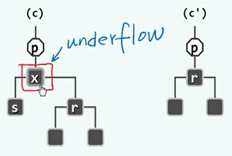

    - 此时需要考察父亲p（颜色未知），被删除的x（黑），所要替换x的孩子r（黑）和另一个孩子s。

  - s为黑，且至少有一个红孩子t。
  
    - 3+4重构，t和p染黑，s继承原来p的颜色。
    - 在B树角度上，相当于节点发生下溢时，其兄弟节点通过旋转借给了该节点一个关键码。
    - 由于新的父节点继承了原来的颜色，因此不会在上层再次发生缺陷。
  
    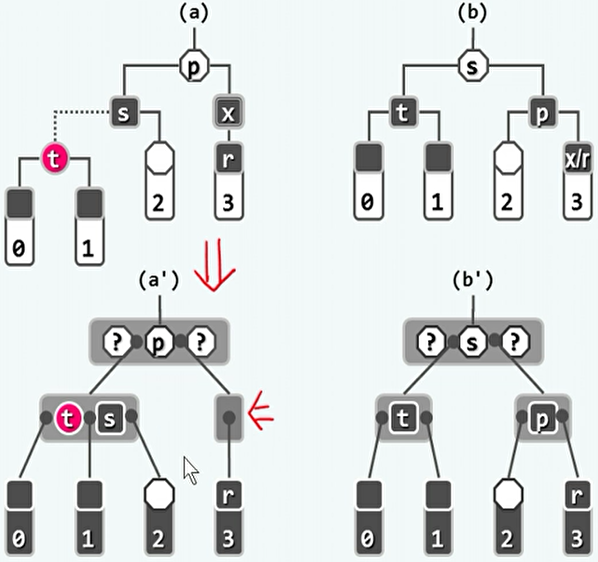
  
  - s为黑，且两个孩子均为黑。
  
    - 如果p为红：
  
      - r保持黑，s染红，p染黑。
      - 等效于下溢节点与兄弟合并。
  
      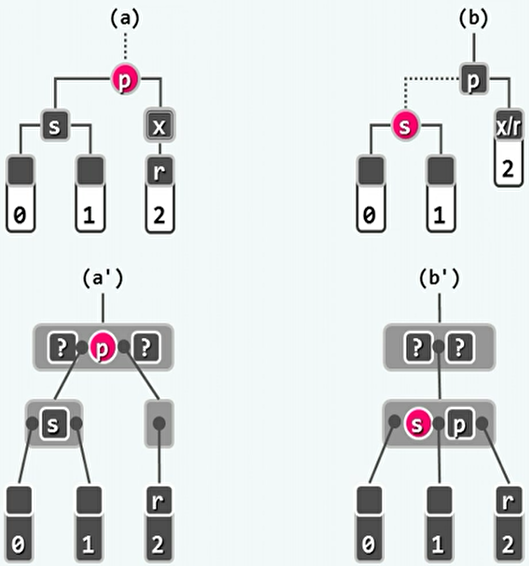
  
    - 如果p为黑：
  
      - p向下合并会导致上层节点下溢，双黑缺陷向上传播一层。
  
      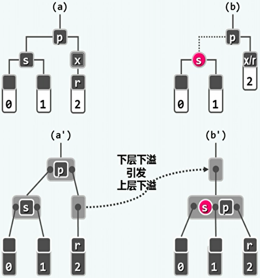
  
  - s为红，且两个孩子均为黑。
  
    - 对p进行一次旋转，然后将p染红，s染黑。这样就可能转化为之前的情况。而且不会转化为下溢向上传播的情况。
  
    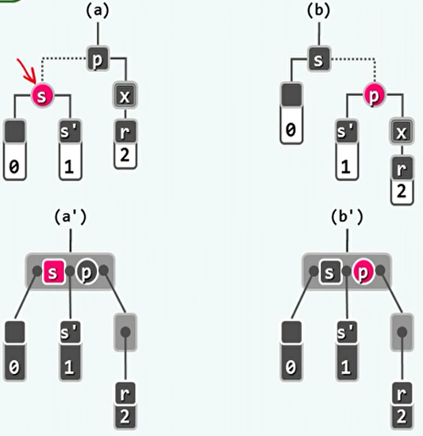
  
  - 复杂度总结：
  
    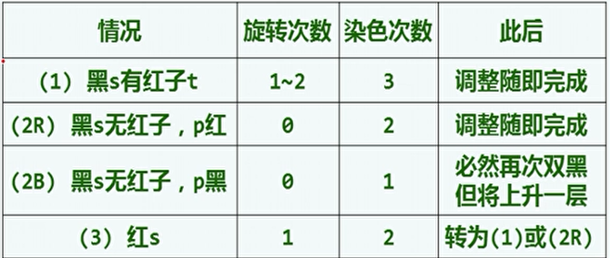
  
  - 实现：
  
    ```c++
    template <typename T> bool RedBlack<T>::remove ( const T& e ) { //从红黑树中删除关键码e
       BinNodePosi(T) & x = search ( e ); if ( !x ) return false; //确认目标存在（留意_hot的设置）
       BinNodePosi(T) r = removeAt ( x, _hot ); if ( ! ( --_size ) ) return true; //实施删除
    // assert: _hot某一孩子刚被删除，且被r所指节点（可能是NULL）接替。以下检查是否失衡，并做必要调整
       if ( ! _hot ) //若刚被删除的是根节点，则将其置黑，并更新黑高度
          { _root->color = RB_BLACK; updateHeight ( _root ); return true; }
    // assert: 以下，原x（现r）必非根，_hot必非空
       if ( BlackHeightUpdated ( *_hot ) ) return true; //若所有祖先的黑深度依然平衡，则无需调整
       if ( IsRed ( r ) ) //否则，若r为红，则只需令其转黑
          { r->color = RB_BLACK; r->height++; return true; }
    // assert: 以下，原x（现r）均为黑色
       //*DSA*/printBinTree(_hot, 0, 0);
       solveDoubleBlack ( r ); return true; //经双黑调整后返回
    } //若目标节点存在且被删除，返回true；否则返回false
    
    template <typename T> void RedBlack<T>::solveDoubleBlack ( BinNodePosi(T) r ) {
       BinNodePosi(T) p = r ? r->parent : _hot; if ( !p ) return; //r的父亲
       BinNodePosi(T) s = ( r == p->lc ) ? p->rc : p->lc; //r的兄弟
       if ( IsBlack ( s ) ) { //兄弟s为黑
          BinNodePosi(T) t = NULL; //s的红孩子（若左、右孩子皆红，左者优先；皆黑时为NULL）
          if ( IsRed ( s->rc ) ) t = s->rc; //右子
          if ( IsRed ( s->lc ) ) t = s->lc; //左子
          if ( t ) { //黑s有红孩子：BB-1
             //*DSA*/printf("  case BB-1: Child ("); print(s->lc); printf(") of BLACK sibling ("); print(s); printf(") is RED\n");
             RBColor oldColor = p->color; //备份原子树根节点p颜色，并对t及其父亲、祖父
          // 以下，通过旋转重平衡，并将新子树的左、右孩子染黑
             BinNodePosi(T) b = FromParentTo ( *p ) = rotateAt ( t ); //旋转
             if ( HasLChild ( *b ) ) { b->lc->color = RB_BLACK; updateHeight ( b->lc ); } //左子
             if ( HasRChild ( *b ) ) { b->rc->color = RB_BLACK; updateHeight ( b->rc ); } //右子
             b->color = oldColor; updateHeight ( b ); //新子树根节点继承原根节点的颜色
             //*DSA*/printBinTree(b, 0, 0);
          } else { //黑s无红孩子
             s->color = RB_RED; s->height--; //s转红
             if ( IsRed ( p ) ) { //BB-2R
                //*DSA*/printf("  case BB-2R: Both children ("); print(s->lc); printf(") and ("); print(s->rc); printf(") of BLACK sibling ("); print(s); printf(") are BLACK, and parent ("); print(p); printf(") is RED\n"); //s孩子均黑，p红
                p->color = RB_BLACK; //p转黑，但黑高度不变
                //*DSA*/printBinTree(p, 0, 0);
             } else { //BB-2B
                //*DSA*/printf("  case BB-2R: Both children ("); print(s->lc); printf(") and ("); print(s->rc); printf(") of BLACK sibling ("); print(s); printf(") are BLACK, and parent ("); print(p); printf(") is BLACK\n"); //s孩子均黑，p黑
                p->height--; //p保持黑，但黑高度下降
                //*DSA*/printBinTree(p, 0, 0);
                solveDoubleBlack ( p ); //递归上溯
             }
          }
       } else { //兄弟s为红：BB-3
          //*DSA*/printf("  case BB-3: sibling ("); print(s); printf(" is RED\n"); //s红（双子俱黑）
          s->color = RB_BLACK; p->color = RB_RED; //s转黑，p转红
          BinNodePosi(T) t = IsLChild ( *s ) ? s->lc : s->rc; //取t与其父s同侧
          _hot = p; FromParentTo ( *p ) = rotateAt ( t ); //对t及其父亲、祖父做平衡调整
          //*DSA*/printBinTree<T>(s, 0, 0);
          solveDoubleBlack ( r ); //继续修正r处双黑——此时的p已转红，故后续只能是BB-1或BB-2R
       }
    }
    ```
  
    


