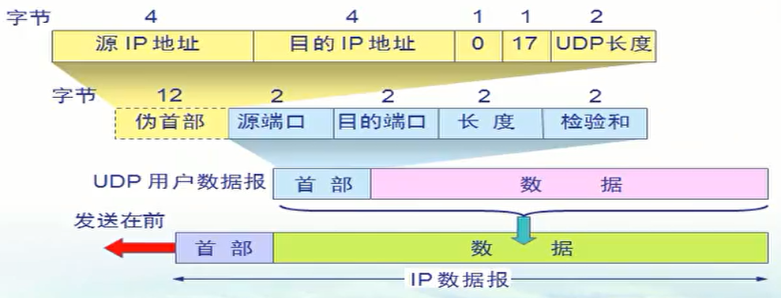
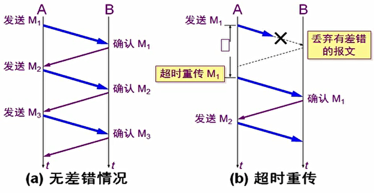
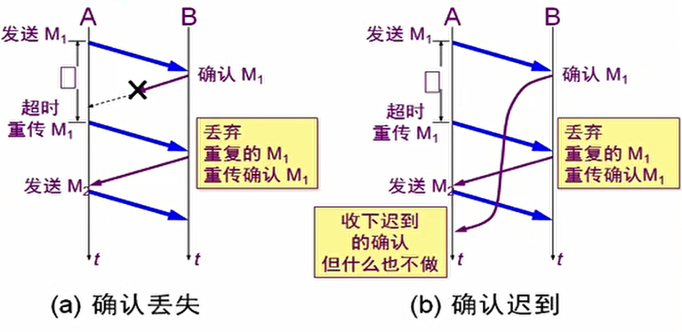
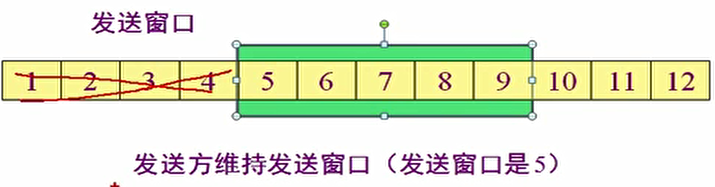
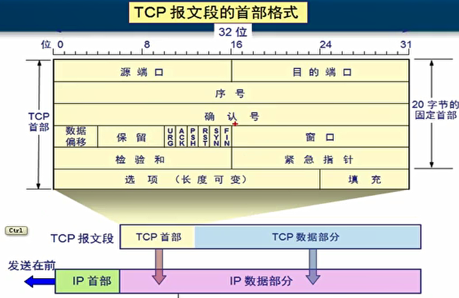
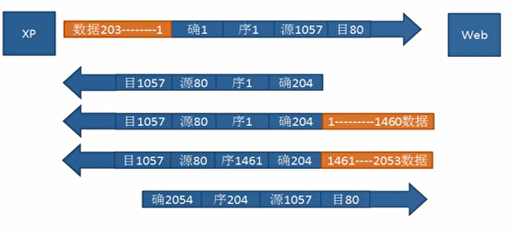
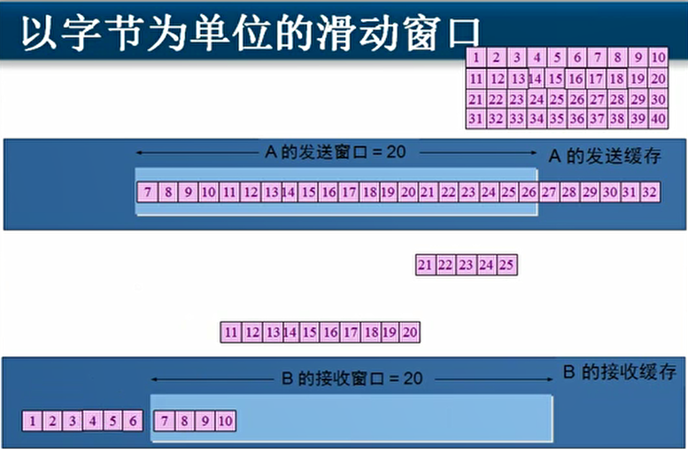
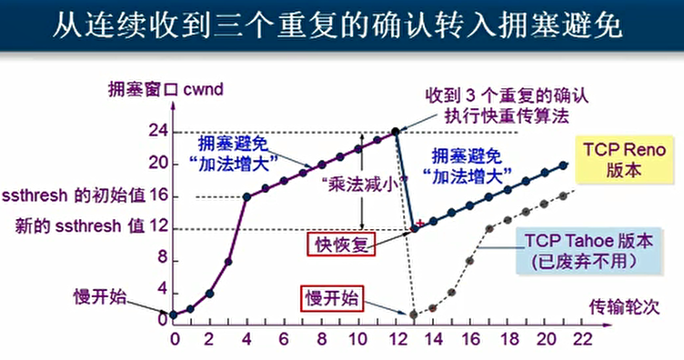
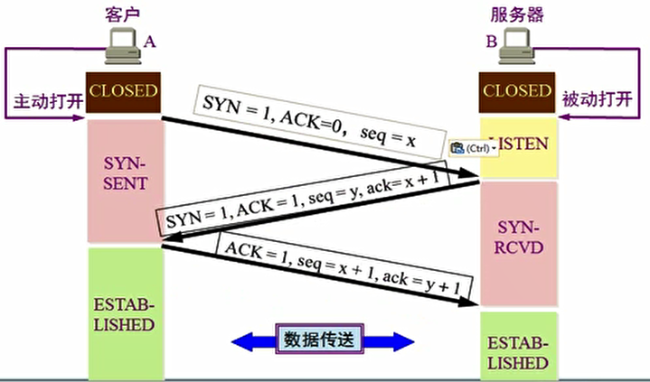
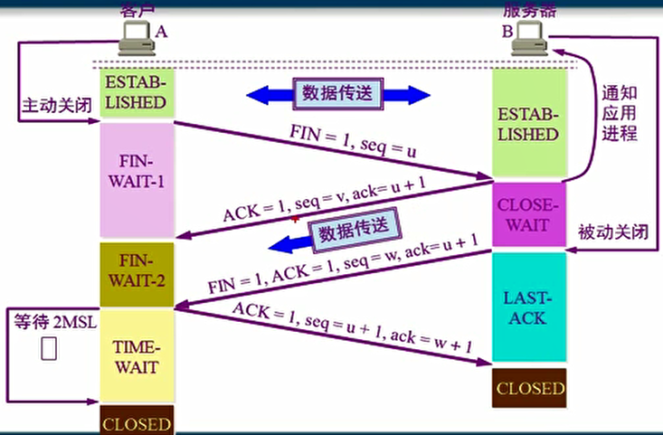

## 1、传输层

- 传输层为互相通信的应用进程提供了逻辑通信。
- TCP协议的应用场景：
  - 进行可靠传输，丢包需要重传，可以保证数据的完整性。
  - 需要分段、编号为多个数据包，有流量控制功能。
  - 需要建立会话。
- UDP协议的应用场景：
  - 不需要编号，一个数据包就能完成数据通信。
  - 不需要建立会话。
  - 用于广播（多播）。
-  传输层协议与应用层协议的关系：
  - 端口代表的是某个服务。
  - http协议默认使用的是TCP协议的80端口。
  - https协议默认使用的是TCP协议的443端口。
  - DNS协议默认使用的是UDP的53端口。
- 应用层协议和服务的关系：
  - 服务运行后，在TCP或UDP的某个端口侦听客户端的请求。
  - 服务的默认端口是可以更改的。

- Windows防火墙的作用：
  - 对外部网络对本机某些端口的请求进行过滤。
  - 本机对外访问网络时，对端口号进行动态开关。
  - 不拦截外出流量，拦截请求进入的流量。
  - 可以通过TCP/IP筛选端口实现服务器安全。
  - 不能防控木马程序，因为木马是本机服务访问外部网络。
  - 使用IPSec可以控制访问外部网络的服务的端口号，进而防控木马。

## 2、TCP协议

- UDP协议：

  - 两个对等传输实体在通信时传送的数据单位叫运输协议数据单元。
  - UDP传送的协议数据单元是UDP报文或用户数据报。TCP传送的协议数据单元是TCP报文段。
  - UDP报文格式：UDP用户数据报包括首部和数据。
  - 首部包括源端口、目的端口、长度和校验和。
  - 支持一对一、一对多、多对一和多对多的交互通信。

  

- TCP协议概述：

  - TCP是面向连接的传输控制协议。
  - 每一条TCP连接只能有两个端点，每一条TCP连接只能是点对点的。
  - TCP连接的端点不是主机，不是主机的IP地址，不是应用程序，也不是传输层的协议端口。而是IP地址 + 端口号，被称为套接字（socket）。
  - TCP提供可靠交付的服务和全双工通信。
  - TCP协议提供流量控制，避免网络阻塞（拥塞）。
  - TCP协议是面向字节流的。

- TCP面向字节流传输：

  - 发送方先将字节流存入发送方缓存，然后将缓存中的字节构造为数据包进行发送。
  - 接收方接收到数据包，去掉首部存入接收端缓存，并按顺序组装。
  - 接收端应用程序从缓存中读入字节流。

- TCP协议如何实现可靠传输：

  - 可靠窗户的工作原理：停止等待协议。
  - 无差错情况下，发送方发送一个数据包，接收方接收到该数据包后发送给发送方一个确认数据包，如此三次。
  - 超时重传：如果发送方发送数据包后，在一定时间内没接收到确认数据包，则认为超时，重传数据包。

  

  - 确认丢失：第一次确认的数据包在返回过程中丢失。
  - 确认迟到：第一次确认的数据包在返回过程中迟到。

  

  - 总的来说就是，只要发送端没有接收到确认数据包，则重传。这种可靠传输协议称为自动重传请求ARQ。
  - 重传的请求是自动进行的。优点是简单，缺点是信道利用率（发送数据包的时间/总时间（发送和接收时间+数据往返时间））太低。
  - 发送方可连续发送多个分组，可以获得高的信道利用率。
  - 需要使用连续ARQ协议，发送方需要维持一个发送窗口。

  

  - 为了进一步提高效率，还可以进行累计确认。

- TCP报文首部格式：

  

  - 需要写上源端口和目标端口。

  - 序号是分块发送数据包的顺序，含义是该数据段的第一个字节是整个数据的第几个字节。

  - 确认号是接收端返回给发送端时，发送确认，表示下一个要发送的是整个数据的第几个字节。

  - 数据偏移用来指定TCP数据部分的位置。

  - TCP连接示例：

    

- TCP首部标记位：

  - URG：为1时表示优先传输，不排队。为1时，紧急指针才起作用。
  - ACK：如果为0，确认号无效（发送通信请求时），为1时确认号有效。
  - SYN：如果为1，表示建立会话请求的数据包。
  - PSH：如果为1，表示这些数据在接收端会组合成一个较大的片段，并直接提交给应用程序。
  - RST：如果为1，说明TCP会话出现严重问题，需要释放连接重新建立连接。
  - FIN：在数据通信结束后释放连接时为1。

- TCP窗口：

  - 接收窗口：接收端计算机告诉发送端，接收缓存的大小。
  - 发送窗口：发送端接收到接收端发送的接收窗口后，设置的发送缓存的大小。两个窗口大小应相等。

- 紧急指针：需要紧急传输的数据截止到第几个字节。

- TCP滑动窗口实现可靠传输：

  - 以字节为单位的滑动窗口技术：

    - 在发送窗口中的数据，按顺序全部发送。
    - 在发送端收到接收端发送的确认消息之前，不能发送发送窗口以外的数据。
    - 在发送端收到接收端发送的确认消息之后，将发送窗口滑动到确认消息中确认号的位置。
    - 同时，接收窗口也滑动到发送过确认号的位置，并且可以将窗口外已经确认的数据提交给应用读取。
    - 新进入发送窗口中的数据可以继续发送。

    

  - 如果在数据传输过程中数据丢失：

    - 接收端发送的确认消息的确认号，是丢失的数据的序号。
    - 是选择性确认。丢失数据后接收到的数据不会再重发。
    - 接收到连续的确认后，恢复正常传输。

  - 超时重传的时间：

    - 新的RTTs=（1-a）×旧的RTTs + a×新的RTT。
    - RTTs是加权平均往返时间。a一般取1/8。
    - 超时重传时间应略大于RTTs。

- TCP的流量控制：

  - 让发送方发送慢一点，让接收方来得及接收。
  - TCP通过滑动窗口机制（改变窗口大小）实现流量控制。

- TCP的拥塞控制：

  - 发现丢包现象，就主动将发送数据包的速率降低。
  - 出现拥塞：对资源需求的总和大于可用资源。
  - 拥塞控制是一个全局性的过程，涉及到所有的主机好路由器。
  - 如果没有拥塞控制，可能会出现死锁现象。
  - 发送方维持一个拥塞窗口，只要网络没有出现拥塞，窗口就增大一些，发送速率加快。出现拥塞后，窗口减小，发送速率降低。
  - 慢开始：拥塞窗口开始根据传输轮次指数增长，在达到慢开始门限后，加法增加（每次增加1）避免拥塞。
  - 网络阻塞后，拥塞窗口乘法减小。
  - 新的慢开始门限被设置为出现拥塞时窗口大小的一半。
  - 快重传：要求接收方每收到一个失序的报文段后就立即发出三次重复确认。
  - 快恢复：受到快重传的三次重复确认，拥塞窗口直接设置为慢开始门限。
  - 发送窗口的大小，是接收窗口和拥塞窗口中较小的那个。

  

  

- TCP连接管理：

  - 传输连接有三个阶段：连接建立、 数据传送和连接释放。
  - 主动发起连接的是客户，被动等待连接建立的是服务器。

- 三次握手建立TCP连接：

  - 客户端主动打开，第一次握手：SYN=1，ACK=0，seq=x。
    - 客户端发送后，状态变为SYN-SENT。
    - 服务器接收到后，状态由LISTEN变为SYN-RCVD。
  - 服务器被动打开，第二次握手：SYN=1，ACK=1，seq=y，ack=x+1。
    - 客户端接收到后，状态变为ESTABLISHED。
  - 客户端收到，第三次握手：ACK=1，seq=x+1，ack=y+1。
    - 服务器接收到后，状态变为ESTABLISHED。
  - SYN同步标志位，ACK确认号使能端，seq序号，ack确认号。
  - 为什么有第三次握手：
    - 前两次握手已经证明了网络畅通并且协商好了通信的数据设置。
    - 为了避免客户端由于网络传输时间的问题多次发送请求，服务器也多次响应确认后，客户端不响应第二次确认，导致服务器资源浪费的情况。

- 四次挥手释放TCP连接：
  - 数据传输结束后，双方都可以释放连接。以客户端主动关闭服务器被动关闭为例。
  - 客户端主动关闭，第一次挥手：FIN=1，seq=u。
    - 客户端发送后，状态由ESTABLISHED变为FIN-WAIT-1。
    - 服务器接收到后，状态由ESTABLISHED变为CLOSE-WAIT。
  - 服务器发出确认，第二次挥手：ACK=1，seq=v，ack=u+1。
    - 这是从客户端到服务器的连接时释放了。
    - TCP处于半关闭状态，服务器发送数据，客户端仍要接收。
    - 客户端接收到后，状态由FIN-WAIT-1变为FIN-WAIT-2。
  - 服务器被动关闭，第三次挥手：FIN=1，ACK=1,seq=w，ack=u+1。
    - 服务器已没有要向客户端发送数据。
    - 服务器发送后，状态由CLOSE-WAIT变为LAST-ACK。
    - 客户端接收到后，状态由FIN-WAIT-2变为TIME-WAIT。
    - TIME-WAIT状态持续2MSL（两个最长报文寿命，一般为4分钟）后，状态变为CLOSED。
  - 客户端发出确认，第四次挥手：ACK=1，seq=u+1，ack=w+1。
    - 服务器接收到后，状态由LAST-ACK变为CLOSED。
  - 为什么要有2MSL的TIME-WAIT状态：
    - 为了避免第四次挥手丢包，客户端需要保持可以响应服务器重发第三次挥手的状态。

