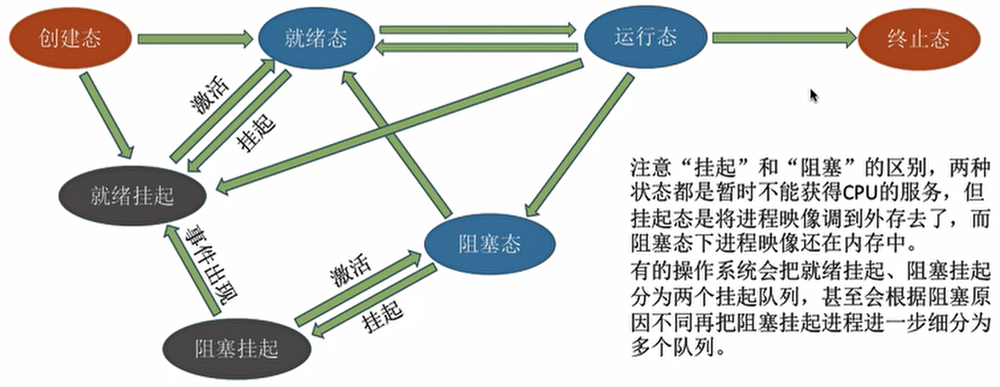

## 1、进程调度

- 调度：当有一堆任务要处理，但由于资源有限，无法同时处理，需要确定某种规则来决定处理这些任务的顺序。

- 处理机调度：

  - 在多道程序系统中，进程的数量往往是多于处理机的个数的，不可能并行的处理各个进程。
  - 处理机调度就是从就绪队列中按照一定的算法选择一个进程并将处理机分配给它运行，以实现进程的并发执行。

- 调度的三个层次：

  - 高级调度（作业调度）：

    - 概念：按一定的原则从外存上处于后备队列中的作业中挑选一个或多个作业，分配内存等必要资源，并建立相应的进程（PCB），以使他们获得竞争处理机的权利。
    - 高级调度是外存与内存之间的调度。
    - 每个作业只调入一次，调出一次。调入时建立PCB，调出时撤销PCB。
    - 高级调度主要是指调入的问题，因为调入的时机由操作系统确定，调出的时机是作业运行结束。

  - 中级调度（内存调度）：

    - 挂起状态：将暂时不能运行的进程调至外存等待，等到其具备运行条件且内存有空闲时在调入内存。暂时调到外存等待的进程状态称为挂起状态。
    - PCB还会被保存在内存，被挂起的进程PCB会被放到挂起队列中。
    - 概念：从挂起队列中选择将哪个处于挂起状态的进程重新调入内存。
    - 一个进程可能会被调出、调入多次，因此中级调度发生的频率要比高级调度高。

  - 低级调度（进程调度）：

    - 概念：按照某种方法和策略从就绪队列中选取一个进程，将处理机分配给它。
    - 进程调度是操作系统中最基本的调度。进程调度的频率很高。

  - 三种调度的对比：

    

- 进程的挂起态与七状态模型：

  - 暂时调到外存等待的进程状态为挂起状态。

  - 挂起态还分为就绪挂起和阻塞挂起。

  - 七状态模型：

    

- 进程调度：
  - 进程调度的时机：
    - 当前运行的进程主动放弃处理器：
      - 正常终止。
      - 异常终止。
      - 主动请求阻塞。
    - 当前运行的进程被动放弃处理机：
      - 分给进程的时间片用完。
      - 有更紧急的事需要处理。
      - 有更高优先级的进程进入就绪队列。
  - 不能进行进程调度的情况：
    - 处理中断的过程中。
    - 进程在操作系统内核程序临界区（比如进程的就绪队列）。
    - 原子操作的过程中（原语）。
  - 进程调度的方式：
    - 非剥夺调度方式（非抢占方式）：只允许进程主动放弃处理机。
    - 剥夺调度方式（抢占方式）：有可能会要求进程被动放弃处理机，把处理机交给更紧迫的进程。
- 进程的切换与过程：
  - 狭义的进程调度：从就绪队列中选中一个要运行的进程。（这个进程可以是刚刚被暂停执行的进程，也可以是另一个进程，如果是另一个进程就需要进程切换）
  - 进程切换：让一个进程让出处理机，由另一个进程占用处理机。
  - 广义的进程调度：包括了选择一个进程和进程切换两个步骤。
  - 进程切换的过程：
    - 对原来运行进程何种数据的保存。
    - 对新进程各种数据的恢复。
    - 也就是从将信息保存到PCB，和从PCB中读取信息。
  - 进程切换是有代价的，过于频繁的进程调度与切换会使得效率降低。
- 调度算法的评价指标：
  - CPU利用率：CPU处于忙碌的时间占总时间的比例。
  - 系统吞吐量：单位时间内完成作业的数量。
  - 周转时间：从作业提交给系统开始，到作业完成为止的时间间隔。
  - 等待时间：进程/作业处于等待处理机状态时间之和。
  - 响应时间：从用户提交请求到首次产生响应所用的时间。
- 调度算法：
  - 先来先服务（FCFS）：
    - 算法思想：从公平的角度。
    - 算法规则：按照作业/进程到达的先后顺序。
    - 用于作业/进程调度：用于作业调度看谁先进入后备队列；用于进程调度看谁先进入就绪队列。
    - 是否抢占：一般为非抢占。
    - 优点：公平、算法简单。
    - 缺点：对长作业有利，对短作业不利。
    - 是否饥饿：不会导致饥饿。
  - 短作业优先（SJF）：
    - 算法思想：追求最少的平均等待时间/平均周转时间/平均带权周转时间。
    - 算法规则：最短的作业/进程优先得到服务。
    - 用于作业/进程调度：可用于作业调度；用于进程调度称为短进程优先。
    - 是否抢占：一般为非抢占式，但也有抢占式的最短剩余时间优先算法，抢占式的指标会更好 。
    - 优点：“最短的”平均等待时间、平均周转时间。
    - 缺点：对短作业有利，对长作业不利。而且不一定真实，不一定能真的做到短作业优先。
    - 是否饥饿：可能会导致饥饿。
  - 高响应比优先（HRRN）：
    - 算法思想：兼顾作业/进程等待时间和运行时间。
    - 算法规则：每次调度时，计算响应比，选择响应比最高的作业/进程服务。响应比：(等待时间+要求服务时间)/要求服务时间。
    - 用于作业/进程调度：可用于作业调度和进程调度。
    - 是否抢占：非抢占式，只有进程主动放弃CPU才计算响应比 。
    - 优点：综合考虑了等待时间和要求服务时间。
    - 缺点：只考虑了系统总体性能，没有考虑用户响应时间
    - 是否饥饿：不会导致饥饿。
  - 时间片轮转调度算法（RR）：
    - 算法思想：公平、轮流的为各个进程服务。
    - 算法规则：按照各个进程到达就绪队列的顺序，轮流让各个进程执行一个时间片。若进程未执行完，则剥夺处理机，重新放到就绪队列。
    - 用于作业/进程调度：用于进程调度。
    - 是否抢占：抢占式 。
    - 优点：公平、响应快，适合分时操作系统。
    - 缺点：进程切换消耗资源，不区分任务的紧急程度。
    - 是否饥饿：不会导致饥饿。
    - 时间片太大，每个进程都能在一个时间片内完成，时间片轮转调度算法就会退化为先来先服务。时间片太小，过多的资源用于进程切换。
  - 优先级调度算法：
    - 算法思想：需要根据任务的紧急程度为各个进程服务。
    - 算法规则：调度时选择优先级最高的作业/进程。
    - 用于作业/进程调度：可用于作业调度和进程调度。
    - 是否抢占：抢占式和非抢占式都有 。
    - 优点：用优先级区分紧急程度，适合实时操作系统。
    - 缺点：可能会导致饥饿。
    - 是否饥饿：会导致饥饿。
    - 根据优先级是否可以改变，分为静态优先级和动态优先级。
    - 优先级设置：系统高于用户，前台高于后台，I/O型高于计算型。
  - 多级反馈队列调度算法：
    - 算法思想：对其他调度算法的折中权衡。
    - 算法规则：
      - 设置多级就绪队列，各级队列优先级从高到低，时间片从小到大。
      - 新进程到达时先进入优先级最高的队列，按FCFS原则分配时间片。若用完时间片进程还未结束，则进程进入低一级优先级的队尾。
      - 如果有新进程进入，低优先级的进程会被剥夺处理机，放回原队列队尾。
    - 用于作业/进程调度：可用于进程调度。
    - 是否抢占：一般为抢占式，但也有可能有非抢占实现 。
    - 优点：相对公平，新到达的进程很快得到响应，短进程只用较少的时间完成，适合交互式操作系统。
    - 缺点：可能会导致饥饿。
    - 是否饥饿：会导致饥饿。

## 2、进程互斥的实现

- 进程同步：同步也称直接制约关系，指为例完成某种任务而建立的两个或多个进程，这些进程需要在某些位置上协调工作次序而产生的制约关系。进程间的直接制约关系就是源于相互合作。
- 进程互斥：
  - 对临界资源的访问需要互斥的进行，互斥也称进程间接的制约关系。
  - 临界资源：一个时间段内只允许一个进程使用的资源。
  - 临界资源的互斥访问的逻辑组成：进入区 -> 临界区 -> 退出区 -> 剩余区。
  - 临界资源的互斥访问的原则：
    - 空闲让进。
    - 忙则等待。
    - 有限等待。
    - 让权等待。

- 进程互斥的软件实现：
  - 单标志法：
    - 算法思想：两个进程在访问完临界区后会把使用临界区的权限转交给另一个进程。也就是说每个进程要进入临界区的权限只能被另一个进程赋予。
    - 主要问题：违背了空闲让进原则。如果第一个进程一直不进入临界区，虽然临界区空闲，第二个进程也无法进入临界区。
  - 双标志先检查法：
    - 算法思想：用一个布尔数组标记各进程向进入临界区的意愿。每个进程在进入临界区之前先检查当前有没有别的进程想进入临界区，如果没有则访问临界区。
    - 主要问题：违背了忙则等待原则。由于对上锁和解锁的操作不是原子操作，两个进程可能会同时访问临界区。
  - 双标志后检查法：
    - 算法思想：通过先上锁后检查的方法。
    - 主要问题：违背了空闲让进和有限等待原则。可能出现循环检查，两个进程都无法进入临界区，而且产生饥饿现象。
  - Peterson算法：
    - 算法思想：在双标志后检查法中，再加入一个单标志。如果双方都争着进入临界区，可以尝试让对方先进入临界区。
    - 主要问题：未遵循让权等待原则。
- 进程互斥的硬件实现方法：
  - 中断屏蔽方法：
    - 利用开/关中断实现，进程在访问临界区期间不允许被中断，也就不能发生进程切换。
    - 缺点：不适用于多处理机；只适应于内核进程，不适用于用户进程。
  - TestAndSet指令（TS指令）：
    - 用硬件实现，执行过程不允许被中断，只能一气呵成。
    - 用old记录当前临界区是否上锁，无论是否上锁，都设置为上锁，并返回old，在old为上锁时进行循环检查。
    - 缺点：不满足让权等待。
  - Swap指令：
    - 用硬件实现，执行过程不允许被中断，只能一气呵成。
    - 交换两个变量的值，用来检测之前临界区是否上锁。临界区上锁时进行循环检查。
    - 与TS指令在逻辑层面上相似。
    - 缺点：不满足让权等待。

