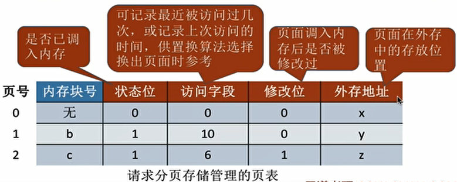

## 1、内存管理

- 内存的基础知识：
  - 内存：用于存放数据的硬件。程序执行前需要先放到内存中才能被CPU处理。
  - 存储单元：内存的最小单元。
  - 内存地址：存储单元的地址，每个地址对应一个存储单元。
  - 逻辑地址与物理地址：相对地址与绝对地址。
  - 编译：由编译程序将用户源代码编译成若干个目标模块（编译就是把高级语言翻译为机器语言）。
  - 链接：由链接程序将编译后形成的一组目标模块，以及所需库函数链接在一起，形成一个完整的装入模块。
    - 静态链接：在程序运行之前，先将各目标模块及它们所需的库函数连接成一个完整的可执行文件（装入模块），之后不再拆开。
    - 装入时动态链接：将各目标模块装入内存时，边装入边链接的链接方式。
    - 运行时动态链接：在程序执行中需要该目标模块时，才对它进行链接。其优点是便于修改和更新，便于实现对目标模块的共享。
  - 装入（装载）：由装入程序将装入模块装入内存运行。
    - 绝对装入：在编译时，如果知道程序将放到内存中的哪个位置，编译程序将产生绝对地址的目标代码。装入程序按照装入模块中的地址，将程序和数据装入内存。
    - 静态重定位：又称可重定位装入。根据内存的当前情况，将装入模块装入到内存的适当位置。装入时对地址进行“重定位”，将逻辑地址变换为物理地址（地址变换是在装入时一次完成的）。
    - 动态重定位：又称动态运行时装入。装入程序把装入模块装入内存后，并不会立即把逻辑地址转换为物理地址，而是把地址转换推迟到程序真正要执行时才进行。因此装入内存后所有的地址依然是逻辑地址。这种方式需要一个重定位寄存器的支持。
- 内存管理：
  - 作用：
    - 负责内存空间的分配与回收。
    - 虚拟技术从逻辑上对内存空间进行扩充。
    - 需要提供地址转换功能，负责逻辑地址与物理地址的转换（三种装入方式）。
    - 内存保护，各个进程在各自内存区域中运行，互不干扰（设置上下限寄存器/利用重定位、界地址寄存器）。
- 内存空间的扩充：
  - 覆盖技术：
    - 用来解决程序大小超过物理内存总和的问题。
    - 思想：将程序分为多个段（多个模块）。常用的段常驻内存，不常用的段在需要时调入内存。让那些不可能同时被访问的程序段共享一个覆盖区。
    - 内存中分为一个“固定区”和若干个“覆盖区”。需要常驻内存的段放在“固定区”中，调入后就不再调出（除非运行结束）；不常用的段放在“覆盖区”，需要用到时调入内存，用不到时调出内存。
    - 缺点：必须由程序员声明覆盖结构，操作系统完成自动覆盖。对用户不透明，增加了用户编程负担
  - 交换技术：
    - 思想：内存空间紧张时，系统将内存中某些进程暂时换出外存，把外存中某些已具备运行条件的进程换入内存（进程在内存与磁盘间动态调度，中级调度）。
    - 磁盘分为文件区和对换区，换出的进程放在对换区。
  - 覆盖是在同一个程序或进程中的，交换是在不同进程（或作业）之间的。
- 内存空间的分配与回收：
  - 连续分配管理方式：
    - 概念：系统为用户进程分配的必须是连续的内存空间。
    - 单一连续分配：
      - 在单一连续分配方式中，内存被分为系统区和用户区。
      - 系统区通常位于内存的低地址部分，用于存放操作系统相关数据；用户区用于存放用户进程相关数据。
      - 内存中只能有一道用户程序，用户程序独占整个用户区空间。
      - 优点：实现简单；无外部碎片；可以采用覆盖技术扩充内存；不一定需要采取内存保护。
        缺点：只能用于单用户、单任务的操作系统中；有内部碎片；存储器利用率极低。
    - 固定分区分配：
      - 将整个用户空间划分为若干个固定大小的分区，在每个分区中只装入一道作业。
      - 分为分区大小相等和分区大小不等。
      - 操作系统需要建立分区说明表，来实现各个分区的分配与回收。每个表项对应一个分区，通常按分区大小排列。每个表项包括对应分区的大小、起始地址、状态（是否已分配）。
      - 优点：实现简单，无外部碎片。
      - 缺点：a.当用户程序太大时，可能所有的分区都不能满足需求，此时不得不采用覆盖技术来解决，但这又会降低性能；b.会产生内部碎片，内存利用率低。
    - 动态分区分配：
      - 不会预先划分内存分区，而是在进程装入内存时，根据进程的大小动态地建立分区，并使分区的大小正好适合进程的需要。
      - 如何记录内存的使用情况：
        - 空闲分区表。
        - 空闲分区链。
      - 多个空闲分区都满足需求时如何分配：动态分区分配算法。
      - 如何进行分区的分配与回收：空闲分区表表项的创建、删除、合并和修改。
      - 动态分区分配没有内部碎片，但是有外部碎片。
        - 内部碎片，分配给某进程的内存区域中，如果有些部分没有用上。
        - 外部碎片，是指内存中的某些空闲分区由于太小而难以利用。
      - 通过紧凑/拼凑技术，移动进程占用的内存区域，合并外部碎片。
  - 动态分区分配算法：
    - 在动态分区分配方式中，当很多个空闲分区都能满足需求时，应该选择哪个分区进行分配。
    - 首次适应算法：
      - 算法思想：每次都从低地址开始查找，找到第一个能满足大小的空闲分区。
      - 实现：空闲分区以起始地址递增的次序排列。每次分配内存时顺序查找空闲分区链（或空闲分区表），找到大小能满足要求的第一个空困分区。
    - 最佳适应算法：
      - 算法思想：为了保证当“大进程”到来时能有连续的大片空间，可以尽可能多地留下大片的空闲区，即，优先使用更小的空闲区。
      - 实现：空闲分区按容量递增次摩链接。每次分配内存时顺序查找空闲分区链（或空闲分区表），找到大小能满足要求的第一个空闲分区。
      - 缺点：每次都选最小的分区进行分配，会留下越来越多的、很小的、难以利用的内存块。因此这种方法会产生很多的外部碎片。
    - 最坏适应算法：
      - 算法思想：为了解决最佳适应算法的问题--即留下太多难以利用的小碎片，可以在每次分配时优先使用最大的连续空闲区，这样分配后剩余的空闲区就不会太小，更方便使用。
      - 实现：空闲分区按容量递减次序链接。每次分配内存时顺序查找空闲分区链（或空闲分区表），找到大小能满足要求的第一个空闲分区。
      - 缺点：导致较大的连续空闲区被迅速用完。如果之后有“大进程”到达，就没有内存分区可用了。
    - 邻近适应算法：
      - 算法思想：首次适应算法每次都从链头开始查找的。这可能会导致低地址部分出现很多小的空闲分区，而每次分配查找时，都要经过这些分区，因此也增加了查找的开销。如果每次都从上次查找结束的位置开始检索，就能解决上述问题。
      - 实现：空闲分区以地址递增的顺序排列（可排成一个循环链表）。每次分配内存时从上次查找结束的位置开始查找空闲分区链（或空闲分区表），找到大小能满足要求的第一个空闲分区。
      - 缺点：导致了高地址部分的大分区更可能被使用，划分为小分区，最后导致无大分区可用。
  - 非连续分配管理方式：
    - 如果允许将一个进程分散地装入到许多不相邻的分区中，便可充分地利用内存。
    - 基本分页存储管理：
      - 把内存分为一个个相等的小分区，再按照分区大小把进程拆分成一个个小部分。
      - 如何实现地址转换：
        - 要算出逻辑地址对应的页号；
        - 要知道该页号对应页面在内存中的起始地址；
        - 要算出逻辑地址在页面内的“偏移量”；
        - 页号=逻辑地址/页面长度（取除法的整数部分）。
        - 页内偏移量=逻辑地址%页面长度（取除法的余数部分）。
        - 物理地址=页面始址+页内偏移量。
        - 或根据逻辑地址结构计算（二进制），逻辑地址=【页号P，页内偏移量w】。
        - 为了能知道进程的每个页面在内存中存放的位置，操作系统要为每个进程建立一张页表。
          - 一个进程对应一张页表；
          - 进程的每一页对应一个页表项；
          - 每个页表项由“页号”和“块号”组成；
          - 页表记录进程页面和实际存放的内存块之间的对应关系。
          - 每个页表项的长度是相同的，页号是"隐含"的。
      - 基本地址变换机构：
        - 借助进程的页表将逻辑地址转换为物理地址。
        - 通常会在系统中设置一个页表寄存器（PTR），存放页表在内存中的起始地址F和页表长度M。
        - 进程未执行时，页表的始址和页表长度放在进程控制块（PCB）中，当进程被调度时，操作系统内核会把它们放到页表寄存器中。
        - 地址变换过程：
          - 根据逻辑地址算出页号、页内偏移量；
          - 页号的合法性检查（与页表长度对比）；
          - 若页号合法，再根据页表起始地址、页号找到对应页表项；
          - 根据页表项中记录的内存块号、页内偏移量得到最终的物理地址；
          - 访问物理内存对应的内存单元。
      - 具有快表的地址变换机构：
        - 局部性原理：
          - 时间局部性：如果执行了程序中的某条指令，那么不久后这条指令很有可能再次执行；如果某个数据被访问过，不久之后该数据很可能再次被访问。（因为程序中存在大量的循环）
          - 空间局部性：一旦程序访问了某个存储单元，在不久之后，其附近的存储单元也很有可能被访问。（因为很多数据在内存中都是连续存放的）
        - 快表，又称联想寄存器（TLB），是一种访问速度比内存快很多的高速缓冲存储器，用来存放当前访问的若干页表项，以加速地址变换的过程。
          - 查询快表是在用页号查询内存块号，在查询页表之前。
          - 与快表对应，内存中的页表常称为慢表。如果查询快表命中，就不需要访问内存中的慢表了。
          - 如果在慢表中找到页表项，应同时将其存入快表。
      
- 两级页表：
        - 单级页表的问题：
          - 问题1：页表必须连续存放，因此当页表很大时，需要占用很多个连续的页框。
          - 问题2：没有必要让整个页表常驻内存，因为进程在一段时间内可能只需要访问某几个特定的页面。
        - 解决问题1：可将长长的页表进行分组，使每个内存块刚好可以放入一个分组。要为离散分配的页表再建立一张页表，称为页目录表，或称外层页表，或称顶层页表。
        - 两级页表的地址结构：【一级页号P1，二级页号P2，页内偏移量w】。
        - 地址变换过程：
          - 按照地址结构将逻辑地址拆分成三部；
          - 从PCB中读出页目录表始址，再根据一级页号查页目录表，找到下一级页表在内存中的存放位置；
          - 根据二级页号查表，找到最终想访问的内存块号；
          - 结合页内偏移量得到物理地址。
        - 解决问题2：可以在需要访问页面时才把页面调入内存（虚拟存储技术）。
        - 可以在页表项中增加一个标志位，用于表示该页面是否已经调入内存。
        - 若想访问的页面不在内存中，则产生缺页中断（内中断），然后将目标页面从外存调入内存。
        - 多级页表中，各级页表的大小不能超过一个页面。若两级页表不够，可以分更多级多级。
        - 页表的访存次数（假设没有快表机构）。N级页表访问一个逻辑地址需要N+1次访存。
    - 基本分段存储管理：
      - 分段：
        - 进程的地址空间：按照程序自身的逻辑关系划分为若干个段，每个段都有一个段名，每段从0开始编址。
        - 内存分配规则：以段为单位进行分配，每个段在内存中占据连续空间，但各段之间可以不相邻。
      - 分段系统的地址结构：【段号，段内地址】。
      - 段号的位数决定了每个进程最多可以分几个段。段内地址位数决定了每个段的最大长度是多少。
      - 段表：为每个进程建立一张段映射表，从物理内存中找到各个逻辑段的存放位置，简称“段表”。
      - 分段和分页的区别：分段中每个段段长不同，需要检查段内地址是否越界。
    - 分段、分页管理的对比：
      - 页是信息的物理单位。分页的主要目的是为了实现离散分配，提高内存利用率。分页仅仅是系统管理上的需要，完全是系统行为，对用户是不可见的。
      - 段是信息的逻辑单位。分段的主要目的是更好地满足用户需求。一个段通常包含着一组属于一个逻辑模块的信息。分段对用户是可见的，用户编程时需要显式地给出段名。
      - 页的大小固定且由系统决定。段的长度却不固定，决定于用户编写的程序。
      - 分页的用户进程地址空间是一维的，程序员只需给出一个记忆符即可表示一个地址。
      - 分段的用户进程地址空间是二维的，程序员在标识一个地址时，既要给出段名，也要给出段内地址。
      - 分段比分页更容易实现信息的共享和保护。
    - 段页式管理方式：
      - 分段、分页管理的缺点：
        - 分页管理：不方便按照逻辑模块实现信息的共享和保护。
        - 分段管理：如果段长过大，为其分配很大的连续空间会很不方便。另外，段式管理会产生外部碎片。
      - 段页式管理：将进程按逻辑模块分段，再将各段分页。
      - 段页式管理的地址结构：【段号，页号，页内偏移量】。
      - 段号的位数决定了每个进程最多可以分几个段，页号位数决定了每个段最A有多少页，页内偏移量决定了页面大小、内存块大小是多少。
      - 也可引入快表机构，用段号和页号作为查询快表的关键字。若快表命中则仅需一次访存。
      - 地址变换过程：
        - 由逻辑地址得到段号、页号、页内偏移量；
        - 段号与段表寄存器中的段长度比较，检查是否越界；
        - 由段表始址、段号找到对应段表项；
        - 根据段表中记录的页表长度，检查页号是否越界；
        - 由段表中的页表地址、页号得到查询页表，找到相应页表项；
        - 由页面存放的内存块号、页内偏移量得到最终的物理地址；
        - 访问目标单元。

## 2、虚拟内存

- 传统内存管理的缺点：

  - 一次性：作业必须一次性全部装入内存后才能开始运行。这会造成两个问题：作业很大时，不能全部装入内存，导致大作业无法运行；当大量作业要求运行时，由于内存无法容纳所有作业，因此只有少量作业能运行，导致多道程序并发度下降。
  - 驻留性：一旦作业被装入内存，就会一直驻留在内存中，直至作业运行结束。事实上，在一个时间段内，只需要访问作业的一小部分数据即可正常运行，这就导致了内存中会驻留大量的、暂时用不到的数据，浪费了宝贵的内存资源。

- 虚拟内存：

  - 基于局部性原理和高速缓存技术。
  - 定义：
    - 很快会用到的部分装入内存，暂时用不到的部分留在外存。
    - 所访问的信息不在内存时，由操作系统负责将所需信息从外存调入内存。
    - 操作系统负责将内存中暂时用不到的信息换出到外存。
    - 在操作系统的管理下，在用户看来似乎有一个比实际内存大得多的内存，这就是虚拟内存。
  - 特征：
    - 多次性：无需在作业运行时一次性全部装入内存，而是允许被分成多次调入内存。
    - 对换性：在作业运行时无需一直常驻内存，而是允许在作业运行过程中，将作业换入、换出。
    - 虚拟性：从逻辑上扩充了内存的容量，使用户看到的内存容量，远大于实际的容量。
  - 实现：
    - 需要建立在离散分配的内存管理方式的基础上。
    - 以传统的非连续分配存储管理为基础，增加请求调页（请求调段）和页面置换（段置换功能）。
    - 分为请求分页存储管理、请求分段存储管理和请求段页式存储管理。

- 请求分页管理：

  - 页表机制：

    - 为了实现“请求调页”，操作系统需要知道每个页面是否已经调入内存：如果还没调入，那么也需要知道该页面在外存中存放的位置。

    - 要实现“页面置换”，操作系统需要通过某些指标来决定到底换出哪个页面：有的页面没有被修改过，就不用再浪费时间写回外存。有的页面修改过，就需要将外存中的旧数据覆盖，因此，操作系统也需要记录各个页面是否被修改的信息。

    - 请求分页的页表：

      

  - 缺页中断机构：

    - 在请求分页系统中，每当要访问的页面不在内存时，便产生一个缺页中断，然后由操作系统的缺页中断处理程序处理中断。（缺页中断属于内中断中的故障）
    - 此时缺页的进程阻塞，放入阻塞队列，调页完成后再将其唤醒，放回就绪队列。
    - 如果内存中有空闲块，则为进程分配一个空闲块，将所缺页面装入该块，并修改页表中相应的页表项。
    - 如果内存中没有空闲块，则由页面置换算法选择一个页面淘汰，若该页面在内存期间被修改过，则要将其写回外存。未修改过的页面不用写回外存。

  - 地址变换过程的新增步骤：

    - 找到页表项是需要检查页面是否在内存中；
    - 若页面不在内存中，需要请求调页；
    - 若内存空间不够，还需换出页面；
    - 页面调入内存后，需要修改相应页表项。

  - 细节：

    - 只有“写指令”才需要修改“修改位”。并且，一般来说只需修改快表中的数据，只有要将快表项删除时才需要写回内存中的慢表。这样可以减少访存次数。
    - 换入/换出页面都需要启动慢速的I/O操作，可见，如果换入/换出太频繁，会有很大的开销。
    - 页面调入内存后，需要修改慢表，同时也需要将表项复制到快表中。

- 页面置换算法：

  - 当内存空间不够时，决定应该将那个页面换出外存。
  - 最佳置换算法OPT：
    - 算法思想：每次选择淘汰的页面将是以后永不使用，或者在最长时间内不再被访问的页面，这样可以保证最低的缺页率。
    - 缺点：算法性能最好，但前提是必须知道进程的页面访问序列，是不可实现的。
  - 先进先出置换算法FIFO：
    - 算法思想：每次选择淘汰的页面是最早进入内存的页面。
    - 实现方法：把调入内存的页面根据调入的先后顺序排成一个队列，需要换出页面时选择队头页面即可。队列的最大长度取决于系统为进程分配了多少个内存块。
    - 缺点：Belady异常，当为进程分配的物理块数增大时，缺页次数不减反增的异常现象。算法性能很差。
  - 最近最久未使用置换算法LRU：
    - 算法思想：每次淘汰的页面是最近最久未使用的页面。
    - 实现方法：赋予每个页面对应的页表项中，用访问字段记录该页面自上次被访问以来所经历的时间t。
      当需要淘汰一个页面时，选择现有页面中t值最大的，即最近最久未使用的页面。
    - 缺点：实现需要专门的硬件支持，虽然算法性能好但是实现困难，开销大。最接近最佳置换算法。
  - 时钟置换算法CLOCK：
    - 也称为最近未用算法NRU。
    - 简单CLOCK算法：
      - 为每个页面设置一个访问位（访问位为1表示最近被访问过），再将内存中的页面都通过链接指针链接成一个循环队列。
      - 当某页被访问时，其访问位置为1。当需要淘汰一个页面时，只需检查页的访问位。如果是0，就选择该页换出；如果是1，则将它置为0，暂不换出，继续检查下一个页面。
      - 若第一轮扫描中所有页面都是1，则将这些页面的访问位依次置为0后，再进行第二轮扫描（第二轮扫描中一定会有访问位为0的页面，因此选择一个淘汰页面最多会经过两轮扫描）。
    - 改进CLOCK算法：
      - 只有被淘汰的页面被修改过时，才需要写回外存。在其他条件相同时，应优先淘汰没有被修改过的页面。
      - 为每个页面设置一个修改位（修改位为1表示最近被修改过）。用（访问位，修改位）的形式表示各页面状态。
      - 第一轮：从当前位置开始扫描到第一个（0，0）的帧用于替换。本轮扫描不修改任何标志位。
      - 第二轮：若第一轮扫描失败，则重新扫描，查找第一个（0，1）的帧用于替换。本轮将所有扫描过的帧访问位设为0。
      - 第三轮：若第二轮扫描失败，则重新扫描，查找第一个（0，0）的帧用于替换。本轮扫描不修改任何标志位。
      - 第四轮：若第三轮扫描失败，则重新扫描，查找第一个（0，1）的帧用于替换。
      - 由于第二轮已将所有帧的访问位设为0，因此经过第三轮、第四轮扫描一定会有一个帧被选中，因此改进型CLOCK置换算法选择一个淘汰页面最多会进行四轮扫描。

- 页面分配策略：

  - 驻留集：指请求分页存储管理中给进程分配的物理块的集合。
    - 若驻留集太小，会导致缺页频繁，系统要花大量的时间来处理缺页，实际用于进程推进的时间很少；
    - 驻留集太大，又会导致多道程序并发度下降，资源利用率降低。所以应该选择一个合适的驻留集大小。
    - 固定分配：操作系统为每个进程分配一组固定数目的物理块，在进程运行期间不再改变。即，驻留集大小不变。
    - 可变分配：先为每个进程分配一定数目的物理块，在进程运行期间，可根据情况做适当的增加或减少。即，驻留集大小可变。
    - 局部置换：发生缺页时只能选进程自己的物理块进行置换。
    - 全局置换：可以将操作系统保留的空闲物理块分配给缺页进程，也可以将别的进程持有的物理块置换到外存，再分配给缺页进程。
  - 固定分配局部置换：
    - 系统为每个进程分配一定数量的物理块，在整个运行期间都不改变。
    - 若进程在运行中发生缺页，则只能从该进程在内存中的页面中选出一页换出，然后再调入需要的页面。
    - 这种策略的缺点是：很难在刚开始就确定应为每个进程分配少个物理块才算合理。
  - 可变分配全局置换：
    - 刚开始会为每个进程分配一定数量的物理块。操作系统会保持一个空闲物理块队列。当某进程发生缺页时，从空闲物理块中取出一块分配给该进程；若已无空闲物理块，则可选择一个未锁定的页面换出外存，再将该物理块分配给缺页的进程。
    - 采用这种策略时，只要某进程发生缺页都将获得新的物理块，仅当空闲物理块用完时，系统才选择一个未锁定的页面调出。被选择调出的页可能是系统中任何一个进程中的页，因此这个被选中的进程拥有的物理块会减少，缺页率会增加。
  - 可变分配局部置换：
    - 刚开始会为每个进程分配一定数量的物理块。当某进程发生缺页时，只允许从该进程自己的物理块中选出一个进行换出外存。
    - 如果进程在运行中频繁地缺页，系统会为该进程多分配几个物理块，直至该进程缺页率趋势适当程度；反之，如果进程在运行中缺页率特别低，则可适当减少分配给该进程的物理块。

- 何时调入页面：

  - 预调页策略：根据局部性原理，一次调入若干个相邻的页面可能比一次调入一个页面更高效。但如果提前调入的页面中大多数都没被访问过，则又是低效的。因此可以预测不久之后可能访问到的页面，将它们预先调入内存，但目前预测成功率只有50%左右。故这种策略主要用于进程的首次调入。
  - 请求调页策略：进程在运行期间发现缺页时才将所缺页面调入内存。由这种策略调入的页面一定会被访问到，但由于每次只能调入一页，而每次调页都要磁盘1/0操作，因此I/O开销较大。

- 从何处调入页面：

  - 系统拥有足够的对换区空间：页面的调入、调出都是在内存与对换区之间进行，这样可以保证页面的调入、调出速度很快。在进程运行前，需将进程相关的数据从文件区复制到对换区。
  - 系统缺少足够的对换区空间：凡是不会被修改的数据都直接从文件区调入，由于这些页面不会被修改，因此换出时不必写回磁盘，下次需要时再从文件区调入即可。对于可能被修改的部分，换出时需写回磁盘对换区，下次需要时再从对换区调入。
  - UNIX方式：运行之前进程有关的数据全部放在文件区，故未使用过的页面，都可从文件区调入。若被使用过的页面需要换出，则写回对换区，下次需要时从对换区调入。

- 抖动（颠簸）现象：

  - 刚刚换出的页面马上又要换入内存，刚刚换入的页面马上又要换出外存，这种频繁的页面调度行为称为抖动，或颠簸。
  - 产生抖动的主要原因是进程频繁访问的页面数目高于可用的物理块数（分配给进程的物理块不够）。
  - 工作集：指在某段时间间隔里，进程实际访问页面的集合。
  - 驻留集大小不能小于工作集大小，否则进程运行过程中将频繁缺页。

