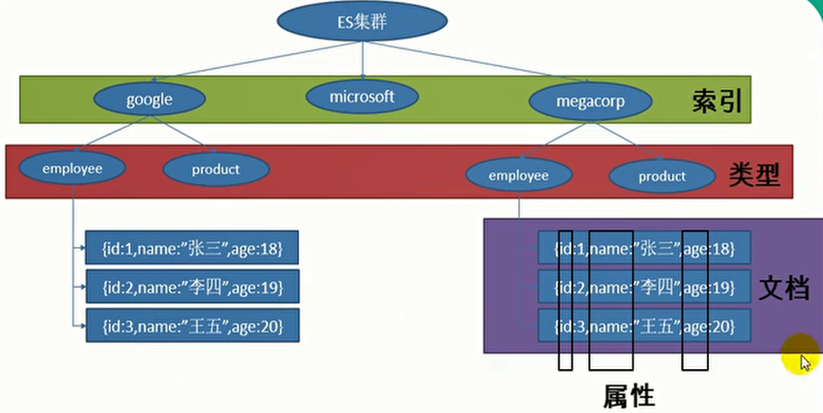
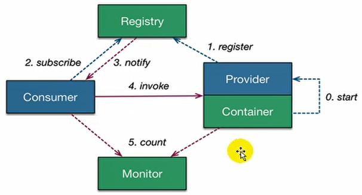
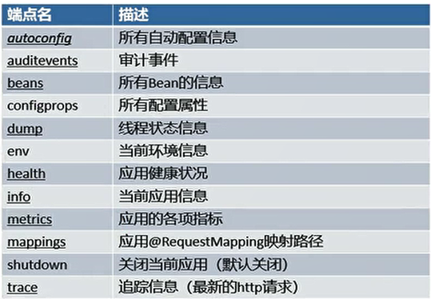
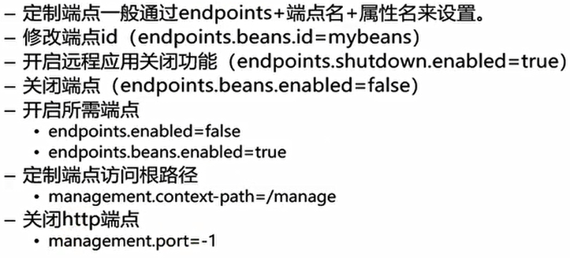

## 1、检索

- ElasticSearch：开源的全文搜索引擎，是一个分布式搜索服务，提供Restful API。

- 搭建环境：

  - 下载镜像：

    ```shell
    docker pull hub-mirror.c.163.com/library/elasticsearch
    ```

  - 运行镜像（默认web通信9200端口，分布式各个节点使用9300端口通信）：

    ```shell
    docker run -e ES_JAVA_OPTS="-Xms256m -Xmx256m" -d -p 9200:9200 -p 9300:9300 --name ES01 5acf0e8da90b
    ```

  - 访问9200端口，显示响应的JSON数据。

- ElasticSearch快速入门：

  - ElasticSearch是面向文档的，存储整个对象或文档。JSON作为文档的序列化格式。

  - 索引：存储数据到ES中的行为叫做索引。但在索引一个文档之前，需要确定将文档存储在哪里。

  - 一个ES集群可以包含多个索引，每个索引可以包含多个类型，不停类型下存储这多个文档，每个文档又有多个属性。（其实就对应MySQL中的MySQL、数据库、表、行、列）

    

  - 向ES中保存文档，以保存一个员工为例：

    - 以PUT请求发送uri：/megacorp/employee/1。请求体的内容是员工对象的JSON数据。（完整url为：ip地址:9200/megacorp/employee/1）

      ```json
      {
          "first_name" : "John",
          "last_name" :  "Smith",
          "age" :        25,
          "about" :      "I love to go rock climbing",
          "interests": [ "sports", "music" ]
      }
      ```

    - megacorp表示索引名称，employee表示类型名称，1表示员工的id。

    - 响应JSON数据：

      ```json
      {
          "_index": "megacorp",
          "_type": "employee",
          "_id": "1",
          "_version": 1,
          "result": "created",
          "_shards": {
              "total": 2,
              "successful": 1,
              "failed": 0
          },
          "created": true
      }
      ```

    - 更新员工只需要再次发送PUT请求。
    
  - 从ES中检索员工：
  
    - 以GET请求发送uri：/megacorp/employee/3。
  
    - 响应JSON数据：
  
      ```json
      {
          "_index": "megacorp",
          "_type": "employee",
          "_id": "3",
          "_version": 1,
          "found": true,
          "_source": {
              "first_name": "Douglas",
              "last_name": "Fir",
              "age": 35,
              "about": "I like to build cabinets",
              "interests": [
                  "forestry"
              ]
          }
      }
      ```
  
  - 从ES中删除员工：
  
    - 以DELETE请求发送uri：/megacorp/employee/3。
  
    - 响应JSON：
  
      ```json
      {
          "found": true,
          "_index": "megacorp",
          "_type": "employee",
          "_id": "3",
          "_version": 2,
          "result": "deleted",
          "_shards": {
              "total": 2,
              "successful": 1,
              "failed": 0
          }
      }
      ```
  
  - 从ES中检查员工是否存在：
  
    - 以HEAD请求发送uri：/megacorp/employee/3。
    - 若存在则返回状态码为200，不存在返回404。
  
  - 从ES中搜索所有员工：
  
    - 以GET请求发送uri：/megacorp/employee/_search。
  
    - 响应JSON：
  
      ```json
      {
          "took": 43,
          "timed_out": false,
          "_shards": {
              "total": 5,
              "successful": 5,
              "skipped": 0,
              "failed": 0
          },
          "hits": {
              "total": 2,
              "max_score": 1,
              "hits": [
                  {
                      "_index": "megacorp",
                      "_type": "employee",
                      "_id": "2",
                      "_score": 1,
                      "_source": {
                          "first_name": "Jane",
                          "last_name": "Smith",
                          "age": 32,
                          "about": "I like to collect rock albums",
                          "interests": [
                              "music"
                          ]
                      }
                  },
                  {
                      "_index": "megacorp",
                      "_type": "employee",
                      "_id": "1",
                      "_score": 1,
                      "_source": {
                          "first_name": "John",
                          "last_name": "Smith",
                          "age": 25,
                          "about": "I love to go rock climbing",
                          "interests": [
                              "sports",
                              "music"
                          ]
                      }
                  }
              ]
          }
      }
      ```
  
  - 搜索一个last_name为Smith的员工，使用查询字符串q：
  
    - 以GET请求发送uri：/megacorp/employee/_search?q=last_name:Smith。
  
  - 使用查询表达式：
  
    - 以POST请求发送uri：/megacorp/employee/_search。
  
    - 在请求体中，使用一个JSON请求，匹配last_name为Smith的员工：
  
      ```json
      {
          "query" : {
              "match" : {
                  "last_name" : "Smith"
              }
          }
      }
      ```
  
    - 更复杂的表达式，过滤出年龄大于30的：
  
      ```json
      {
          "query" : {
              "bool": {
                  "must": {
                      "match" : {
                          "last_name" : "smith" 
                      }
                  },
                  "filter": {
                      "range" : {
                          "age" : { "gt" : 30 } 
                      }
                  }
              }
          }
      }
      ```
  
    - 全文搜索，两个单词中有任意一个都会被检索到，但是会评判相关性：
  
      ```json
      {
          "query" : {
              "match" : {
                  "about" : "rock climbing"
              }
          }
      }
      ```
  
    - 短语搜索，两个单词当作一个短语，搜索出的结果必须完整的匹配：
  
      ```json
      {
          "query" : {
              "match_phrase" : {
                  "about" : "rock climbing"
              }
          }
      }
      ```
  
    - 高亮搜索，指定高亮的字段，返回值会被`<em>`标签封装：
  
      ```json
      {
          "query" : {
              "match_phrase" : {
                  "about" : "rock climbing"
              }
          },
          "highlight": {
              "fields" : {
                  "about" : {}
              }
          }
      }
      ```
  
- springboot整合ES：

  - 默认使用springData操作ES。

  - 自动配置：

    - 默认支持两种技术与ES交互：Jest和SpringData ElasticSearch。

    - Jest默认不生效，需要导入工具包。

      ```xml
      <dependency>
          <groupId>io.searchbox</groupId>
          <artifactId>jest</artifactId>
      </dependency>
      ```

    - SpringData ElasticSearch：

      - 自动配置了客户端，需要配置节点信息。
      - ElasticsearchTemplate操作es。
      - 编写 ElasticsearchRepository的子接口操作ES。

  - Jest操作ES：

    - 配置文件：

      ```properties
      spring.elasticsearch.jest.uris=http://ip地址:9200
      ```

    - 创建实体类，id需要加上`@JestId`注解：

      ```java
      public class Article {
          @JestId
          private Integer id;
          private String author;
          private String title;
          private String content;
          /* getter & setter */
      }
      ```

    - 添加文档到ES，创建一个Index：

      ```java
      @Autowired
      JestClient jestClient;
      @Test
      public void contextLoads() {
          Article article = new Article();
          article.setId(1);
          article.setAuthor("liu");
          //保存一个文档，指定索引和类型
          Index index = new Index.Builder(article).index("atguigui").type("news").build();
          try {
              jestClient.execute(index);
          } catch (IOException e) {
              e.printStackTrace();
          }
      }
      ```

    - 访问url：ip地址：9200/atguigui/news/1即可查询到添加的文档。

    - 在ES中搜索文档：

      ```java
      @Test
      public void search() {
          String json = "{\n" +
              "    \"query\" : {\n" +
              "        \"match\" : {\n" +
              "            \"author\" : \"liu\"\n" +
              "        }\n" +
              "    }\n" +
              "}";
          //传入搜索的表达式，指定索引和类型
          Search search = new Search.Builder(json).addIndex("atguigui").addType("news").build();
          try {
              SearchResult result = jestClient.execute(search);
              System.out.println(result.getJsonString());
          } catch (IOException e) {
              e.printStackTrace();
          }
      }
      ```

  - SpringData ElasticSearch操作ES：

    - 配置文件：

      ```properties
      spring.data.elasticsearch.cluster-name=elasticsearch
      spring.data.elasticsearch.cluster-nodes=ip地址:9301
      ```

    - 在实体类上用注解指定索引和类型：

      ```java
      @Document(indexName = "atguigu",type = "article")
      public class Article {
          private Integer id;
          private String author;
          private String title;
          private String content;
          /* getter & setter */
      }
      ```

    - 创建接口，泛型为bean的数据类型和主键类型：

      ```java
      public interface ArticleRepository extends ElasticsearchRepository<Article, Integer> {
      }
      ```

      - 也可以像JPA一样，按照命名规则写方法名，自动实现。比如`findByAuthorLike()`。

    - 此处需要Springboot的SpringData ElasticSearch与ES版本一致：

      ```shell
      docker pull hub-mirror.c.163.com/library/elasticsearch:2.4.6
      docker run -e ES_JAVA_OPTS="-Xms256m -Xmx256m" -d -p 9201:9200 -p 9301:9300 --name ES02 5e9d896dc62c
      ```

    - 访问url：ip地址：9201/atguigu/article/3即可查询到添加的文档。


## 2、任务

- 异步任务：

  - 同步任务的情况，必须按照顺序一个一个执行。

  - service：

    ```java
    @Service
    public class AsyncService {
    
        public void hello() {
            try {
                Thread.sleep(3000);
            } catch (InterruptedException e) {
                e.printStackTrace();
            }
            System.out.println("处理数据中...");
        }
    }
    ```

  - controller：

    ```java
    @RestController
    public class AsyncController {
        @Autowired
        AsyncService asyncService;
        @GetMapping("/hello")
        public String hello() {
            asyncService.hello();
            return "success";
        }
    }
    ```

  - 这样的话，每次访问/hello，都要等待三秒才会显示success。

  - 在service的hello方法上添加一个`@Async`注解，就告诉Springboot这是一个异步方法。就会自动开启一个线程池进行调用。这样就不需要等待3秒了。

  - 需要先在主方法上开启异步注解功能：`@EnableAsync`。


- 定时任务：

  - 在主方法上开启定时任务注解功能：`@EnableScheduling`。
  - 在service的方法上使用`@Scheduled`注解的cron属性指定定时执行的时间。
    - 表达式由分隔开的字符组成，按顺序分别为秒、分钟、小数、一月中的第几天、月、一周中的第几天。
    - 如`0 * * ? * MON-FRI`表示在周一到周五每分钟的0秒启动一次。
    - 表达式中`,`表示枚举，`0,1,2`表示0、1、2秒。
    - 表达式中`-`表示区间，`0-8`表示0~8秒。
    - 表达式中`/`表示步长，`0/4`表示每4秒。
    - `L`表示最后一个，`W`表示工作日，`?`表示周的天与月的天的冲突匹配。

- 邮件任务：

  - 引入依赖：spring-boot-starter-mail。

  - 配置文件：

    ```properties
    spring.mail.username=邮箱1
    spring.mail.password=授权码
    spring.mail.host=smtp.qq.com
    spring.mail.properties.mail.smtp.ssl.enable=true
    ```

  - 测试发送：

    ```java
    @Autowired
    JavaMailSenderImpl mailSenderl;
    @Test
    public void contextLoads() {
        SimpleMailMessage message = new SimpleMailMessage();
        message.setSubject("通知");
        message.setText("12点");
        message.setTo("邮箱2");
        message.setFrom("邮箱1");
        mailSenderl.send(message);
    }
    ```

  - 带附件的复杂邮件：

    ```java
    @Test
        public void contextLoads2() throws MessagingException {
            MimeMessage mimeMessage = mailSenderl.createMimeMessage();
            MimeMessageHelper helper = new MimeMessageHelper(mimeMessage,true);
            helper.setSubject("通知");
            helper.setText("12点");
            helper.setTo("邮箱2");
            helper.setFrom("邮箱1");
            //上传文件
            helper.addAttachment("1.jpg",new File("C:\\Users\\iwehdio\\Pictures\\001.png"));
            mailSenderl.send(mimeMessage);
        }
    ```


## 3、安全

- SpringSecurity的两个主要区域是认证和授权：

  - 认证：根据用户名和密码认证用户。
  - 授权：确定一个主体是否有执行某个动作的权限。

- 引入SpringSecurity：

  - 导入依赖：spring-boot-starter-security。

  - 编写SpringSecurity配置类：

    ```java
    @EnableWebSecurity
    public class MySecurityConfig extends WebSecurityConfigurerAdapter {
        //定义授权规则
        @Override
        protected void configure(HttpSecurity http) throws Exception {
            //定制请求的授权规则
            http.authorizeRequests().antMatchers("/").permitAll()   //首页允许所有人访问
                    .antMatchers("/level1/**").hasRole("VIP1")      //不同level下的需要不同权限
                    .antMatchers("/level2/**").hasRole("VIP2")
                    .antMatchers("/level3/**").hasRole("VIP3");
            //开启登录功能。/login来到登录页，重定向到/login？error表示登录失败。
            //如果没有登录，没有权限就会来到登录页面。默认post方式的
            http.formLogin();    //设置来到自定义的登录页面
            //开启自动配置的注销功能，/logout表示用户注销，清空session，注销成功到/login?logout。
            http.logout().logoutSuccessUrl("/");    //注销成功来到首页，否则默认到登录页
            //开启记住我功能,关闭浏览器后再打开仍然保持登录，通过Cookie实现
            http.rememberMe();
        }
        //定义认证规则
        @Override
        protected void configure(AuthenticationManagerBuilder auth) throws Exception {
            //分配用户名密码和角色
            auth.inMemoryAuthentication()
                    .withUser("zhangsan").password("123").roles("VIP1","VIP2")
                    .and()
                    .withUser("lisi").password("456").roles("VIP2","VIP3");
    
        }
    }
    ```

  - 前端页面根据权限进行显示：

    -  `sec:authorize`属性中判断是否已认证、有何种权限。

    - `sec:authentication`属性中获取认证信息。

      ```html
      <div sec:authorize="!isAuthenticated()">
         <h2 align="center">游客您好，如果想查看武林秘籍 <a th:href="@{/login}">请登录</a></h2>
      </div>
      <div sec:authorize="isAuthenticated()">
         <h2><span sec:authentication="name"></span>，您好。您的角色有
            <span sec:authentication="principal.authorities"></span></h2>
         <form th:action="@{/logout}" method="post">
            <input type="submit" value="注销" />
         </form>
      </div>
      
      <div sec:authorize="hasRole('VIP1')">
      <h3>普通武功秘籍</h3>
      <ul>
      	<li><a th:href="@{/level1/1}">罗汉拳</a></li>
      	<li><a th:href="@{/level1/2}">武当长拳</a></li>
      	<li><a th:href="@{/level1/3}">全真剑法</a></li>
      </ul>
      </div>
      ```

    

  - 定制自己的登录页面：

    - 前端：

      ```html
      <div align="center">
          <form th:action="@{/userlogin}" method="post">
              用户名:<input name="user"/><br>
              密码:<input name="pwd"><br/>
              <input type="checkbox" name="remember"> 记住我 <br/>
              <input type="submit" value="登陆">
          </form>
      </div>
      ```

    - 后端处理：

      ```java
      //设置前端表单提交的name值与用户名密码的对应
      //设置定制登录页面的地址（get方式）
      //设置登录表单提交的地址（post方式）
      http.formLogin().usernameParameter("user").passwordParameter("pwd").loginPage("/userlogin").loginProcessingUrl("/userlogin");
      //设置前端表单提交的name值与记住我的对应
      http.rememberMe().rememberMeParameter("remember");
      ```

      


## 4、分布式

- ZooKeeper：注册中心，开源的分布式应用程序协调服务。是一个为分布式应用提供一致性服务的软件，提供包括配置维护、域名服务、分布式同步和组服务等。

- Dubbo：开源的分布式服务框架，按照分层的方式架构，使各个层之间解耦合。从服务模型的角度看，可以抽象为提供方提供服务和消费方消费服务。

  

- docker安装ZooKeeper：

  ```shell
  docker pull zookeeper
  ```

  - 运行镜像：

    ```shell
    docker run --name zk03 -p 2181:2181 --restart always -d 6ad6cb039dfa
    ```

  - 2181端口与客户端交互，2888端口集群，3888端口选举。

- SpringBoot整合Dubbo：

  - 创建服务提供者模块：

    ```java
    public interface TicketService {
        public String getTicket();
    }
    
    @Component
    @Service
    public class TicketServiceImpl implements TicketService {
        @Override
        public String getTicket() {
            return "《1234》";
        }
    }
    ```

  - 创建服务消费者模块。同时需要将服务提供者的接口放入相同结构的包下。一定要注意，服务提供者和服务消费者模块中的TicketService的全类名一定要完全相同，不然会报错：

    ```java
    @Service	//Spring的注解
    public class UserService {
        @Reference
        TicketService ticketService;
    
        public void hello(){
            String ticket = ticketService.getTicket();
            System.out.println("买到票了"+ticket);
        }
    }
    ```

  - 导入Dubbo和ZooKeeper的客户端工具的starter（两个模块都要导入）：

    ```xml
    <dependency>
        <groupId>com.alibaba.boot</groupId>
        <artifactId>dubbo-spring-boot-starter</artifactId>
        <version>0.1.0</version>
    </dependency>
    <dependency>
        <groupId>com.github.sgroschupf</groupId>
        <artifactId>zkclient</artifactId>
        <version>0.1</version>
    </dependency>
    ```

  - 相关配置：

    - 配置文件：配置当前应用的名称、注册中心的地址、将那个包发布出去。

      ```properties
      #服务提供者配置
      dubbo.application.name=provider
      dubbo.registry.address=zookeeper://ip地址:2181
      dubbo.scan.base-packages=cn.iwehdio.ticket.service
      
      #服务消费者配置
      dubbo.application.name=consumer
      dubbo.registry.address=zookeeper://ip地址:2181
      ```

    - 将服务发布出去：在服务提供者的TicketServiceImpl上加Dubbo的`@Service`注解。

  - 使用流程：

    - 使用Dubbo将服务提供者注册到注册中心ZooKeeper中。
      - 配置Dubbo扫描包和注册中心地址。
      - 使用`@Service`注解发布服务。
    - 消费者要消费服务，从注册中心中订阅服务。使用Dubbo，消费者调用提供者的服务。
      - 使用`@Reference`注解获取订阅的服务。


- SpringCloud：是一个分布式的整体解决方案。

  - 五大常用组件：服务发现、客服端负载均衡、断路器、服务网关和分布式配置。

- SpringBoot整合SpringCloud：

  - 创建模块Eureka service注册中心：

    - 配置文件：

      ```yaml
      server:
        port: 8761
      eureka:
        instance:
          hostname: eureka-server   #eureka实例的主机名
        client:
          register-with-eureka: false   #不注册本身
          fetch-registry: false         #不从eureka上获取服务的注册信息
          service-url:
            defaultZone: http://localhost:8761/eureka/
      ```

    - 在主程序上配置注解：`@EnableEurekaServer`启用注册中心。

    - 访问localhost:8761可以访问注册中心。

  - 创建模块Eureka discovery服务发现的提供者：

    - SpringCloud整合微服务是通过HTTP通信的，创建服务和控制器：

      ```java
      @Service
      public class TicketService {
      
          public String getTicket() {
              return "《1234》";
          }
      }
      
      @RestController
      public class TicketController {
          @Autowired
          TicketService ticketService;
          @GetMapping("/ticket")
          public String getTicket() {
              return ticketService.getTicket();
          }
      }
      ```

    - 配置文件将服务注册到注册中心中：

      ```yaml
      server:
        port: 8001
      
      spring:
        application:
          name: provider
      
      eureka:
        instance:
          prefer-ip-address: true  #使用IP地址进行注册
        client:
          service-url:
            defaultZone: http://localhost:8761/eureka/
      ```

    - 访问localhost:8001/ticket可以访问请求，并获取到响应。

  - 创建模块Eureka discovery服务发现的消费者：

    - 配置文件：

      ```yaml
      spring:
        application:
          name: consumer
      
      server:
        port: 8200
      
      eureka:
        instance:
          prefer-ip-address: true  #使用IP地址进行注册
        client:
          service-url:
            defaultZone: http://localhost:8761/eureka/
      ```

    - 在主程序中开启服务发现，并且创建发送HTTP请求的RestTemplate：

      ```java
      @SpringBootApplication
      @EnableDiscoveryClient
      public class ConsumerApplication {
      
          public static void main(String[] args) {
              SpringApplication.run(ConsumerApplication.class, args);
          }
      
          @LoadBalanced
          @Bean
          public RestTemplate restTemplate() {
              return new RestTemplate();
          }
      }
      ```

    - 控制器处理相应的请求，并且用RestTemplate发送HTTP请求给服务提供者：

      ```java
      @RestController
      public class UserController {
      
          @Autowired
          RestTemplate restTemplate;
          @GetMapping("/buy")
          public String buyTicket() {
              String s = restTemplate.getForObject("http://provider/ticket",String.class);
              return "买了" + s;
          }
      }
      ```

    - 访问localhost:8200/buy可以访问请求，并获取到响应。

    - 此时可以在注册中心中看到注册的提供者和消费者。

    


## 5、热部署/监控管理

- 在修改Java文件后，不重启应用的情况下，程序可以自动部署（热部署）。
- 可以使用SpringBoot Devtools，依赖为spring-boot-devtools。
- 如果有修改Java代码，热部署之前需要Ctrl+F9重新Build。


- 通过引入spring-boot-starter-actuator，提供准生产环境下的应用监控和管理功能。

- 直接在浏览器查询，需要配置文件：

  ```properties
  management.security.enabled=false
  ```

- 监控和管理端点：

  

- 定制端点：

  

  