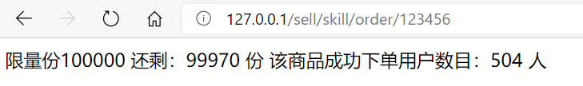

## 1、补充

- 我们希望输出到前端的JSON数据都是code/msg/data，格式的，但是如果是抛出异常就会返回Java默认的格式，处理这个问题可以由全局异常处理：

  ```java
  @ExceptionHandler(SellException.class)
  @ResponseBody
  public ProductResultVO handlerSell(SellException e) {
      return ProductResultVOUtil.error(e.getCode(), e.getMessage());
  }
  ```

- 如果希望返回的HttpResponse是可以设置的状态码，可以用注解如`@ResponseStatus(HttpStatus.ACCEPTED)`。

- Mybatis和JPA的选择：

  - 建表用SQL，不要用JPA。
  - 表之间的关系在程序中控制，而不是使用`@OneToMany`等注解进行级联操作。


## 2、锁和缓存

- 压测模拟Apache ab：

  - 模拟高并发下的情景。

  - 输入参数：

    ```shell
    abs -n 请求数 -t 时间 -c 并发数 测试的url
    ```

- 秒杀相关代码：

  - 业务层：

    ```java
    @Service
    public class SecKillServiceImpl implements SecKillService {
    
        private static final int TIMEOUT = 10 * 1000; //超时时间 10s
    
        @Autowired
        private RedisLock redisLock;
    
        /**
         * 限量100000份
         */
        static Map<String,Integer> products;
        static Map<String,Integer> stock;
        static Map<String,String> orders;
        static
        {
            /**
             * 模拟多个表，商品信息表，库存表，秒杀成功订单表
             */
            products = new HashMap<>();
            stock = new HashMap<>();
            orders = new HashMap<>();
            products.put("123456", 100000);
            stock.put("123456", 100000);
        }
    
        private String queryMap(String productId)
        {
            return "限量份"
                    + products.get(productId)
                    +" 还剩：" + stock.get(productId)+" 份"
                    +" 该商品成功下单用户数目："
                    +  orders.size() +" 人" ;
        }
    
        @Override
        public String querySecKillProductInfo(String productId)
        {
            return this.queryMap(productId);
        }
    
        @Override
        public void orderProductMockDiffUser(String productId)
        {
            //加锁
    
            //1.查询该商品库存，为0则活动结束。
            int stockNum = stock.get(productId);
            if(stockNum == 0) {
                throw new SellException(ResultEnum.ACTIVITY_END);
            }else {
                //2.下单(模拟不同用户openid不同)
                orders.put(KeyUtil.genUniqueKey(),productId);
                //3.减库存
                stockNum =stockNum-1;
                try {
                    Thread.sleep(100);
                } catch (InterruptedException e) {
                    e.printStackTrace();
                }
                stock.put(productId,stockNum);
            }
    
            //解锁
    
        }
    }
    ```

  - 控制器：

    ```java
    @RestController
    @RequestMapping("/skill")
    public class SecKillController {
    
        @Autowired
        private SecKillService secKillService;
    
        @GetMapping("/query/{productId}")
        public String query(@PathVariable String productId)throws Exception
        {
            return secKillService.querySecKillProductInfo(productId);
        }
    
        @GetMapping("/order/{productId}")
        public String skill(@PathVariable String productId)throws Exception
        {
            secKillService.orderProductMockDiffUser(productId);
            return secKillService.querySecKillProductInfo(productId);
        }
    }
    ```

    

- 压力测试：

  ```shell
  abs -n 500 -c 20 127.0.0.1/sell/skill/order/123456
  ```

  - 结果：

    

  - 可以看出，已经出现了并发环境下的数据问题，需要加锁。

- 在售卖方法上使用synchronized：

  - 可以解决不一致的问题，但是太重量级。
  - 无法做到细粒度控制，而且只适合单机的情况。

- Redis分布式锁：

  - 可以作为分布式锁的原因之一是其单线程的特性。

  - `setnx`命令，即set if not exist。

    - 在所要设置的key不存在时，等同于set命令；如果key存在则什么也不做。
    - 返回的是是否set，可以用`!SETNX`来加锁。

  - `getset`命令。

    - 格式：`getset key值 新value值`。
    - 即按照key值返回value值，然后将该key对应的值设置为新value值。

  - 加锁：

    - 在redis中存储的key是商品id，value是当前时间+超时时间，即该锁的过期时间。
    - 加锁方法返回的是是否加锁成功，加锁成功则进行业务操作，否则不能进行业务操作。

    ```java
    @Component
    public class RedisLock {
        @Autowired
        private StringRedisTemplate redisTemplate;
    
        public boolean lock(String key,String value){
            //查看这个商品id是否存在，也就是说这个商品是否被加锁了，如果没有被加锁则加锁并返回true
            if (redisTemplate.opsForValue().setIfAbsent(key, value)){
                return true;
            }
            //获取此时该商品锁的过期时间，如果小于当前系统时间则说明已经过期，其他线程可以重新加锁
            String currentValue = redisTemplate.opsForValue().get(key);
            if (!StringUtils.isEmpty(currentValue) && Long.parseLong(currentValue) < System.currentTimeMillis()) {
                //这里的检查是为了避免多个线程同时修改redis中的value后都认为自己获得了锁，实际上value会被多次修改，但是只有一个线程返回获得了锁
                String oldValue = redisTemplate.opsForValue().getAndSet(key, value);
                if (!StringUtils.isEmpty(oldValue) && oldValue.equals(currentValue)) {
                    return true;
                }
            }
            return false;
        }
    }
    ```

  - 解锁：

    ```java
    public void unLock(String key,String value) {
        String currentValue = redisTemplate.opsForValue().get(key);
        if (!StringUtils.isEmpty(currentValue) && currentValue.equals(value)) {
            redisTemplate.opsForValue().getOperations().delete(key);
        }
    }
    ```

  - 使用：

    ```java
    @Override
    public void orderProductMockDiffUser(String productId)
    {
        //加锁
        long time = System.currentTimeMillis() + TIMEOUT;
        if (!redisLock.lock(productId,String.valueOf(time))){
            throw new SellException(ResultEnum.CANNT_GET_LOCK);
        }
        //1.查询该商品库存，为0则活动结束。
        int stockNum = stock.get(productId);
        if(stockNum == 0) {
            throw new SellException(ResultEnum.ACTIVITY_END);
        }else {
            //2.下单(模拟不同用户openid不同)
            orders.put(KeyUtil.genUniqueKey(),productId);
            //3.减库存
            stockNum =stockNum-1;
            try {
                Thread.sleep(100);
            } catch (InterruptedException e) {
                e.printStackTrace();
            }
            stock.put(productId,stockNum);
        }
    
        //解锁
        redisLock.unLock(productId,String.valueOf(time));
    }
    ```


- 缓存：

  - 缓存的命中、失效和更新。

  - 当项目整合了redis时，SpringBoot不会使用默认的Spring Cache而是使用redis。

  - 在启动类上加注解`@EnableCaching`。

  - 被缓存的实体类需要实现序列化接口，并且定义序列化id，可以用GenerateSerialVersionUID插件生成。

  - 对于返回需要缓存的数据的方法上，加`@Cacheable`注解：

    - cacheNames指定不同方法生成的缓存，或者说是不同类型的缓存的键。
    - key指定相同类型的缓存，但是由于传入的参数不同导致缓存不同一般根据方法入参动态指定。不指定时默认为方法入参。
    - 还可以用condition根据方法入参指定使用缓存的情况，为true时才缓存。
    - unless根据返回结果指定不使用缓存的情况，为true时不缓存。

    ```java
    @GetMapping("/list")
    @Cacheable(cacheNames = "product", key = "123")
    public ProductResultVO<ProductCategoryVO> list() {
    }
    ```

  - `@CachePut`更新缓存，`@CacheEvict`删除缓存。


## 3、部署

- 使用maven的package功能将项目打成jar包，[报错解决](https://www.cnblogs.com/lxcy/p/8279899.html)。

  ```shell
  mvn clean package -Dmaven.test.skip=true
  ```

- 参考：[把jar项目部署到阿里云](https://blog.csdn.net/qq_41762594/article/details/107748973)。

- 运行命令：

  ```shell
  nohup java -jar sell-1.0.jar > /dev/null 2>&1 &
  ```

- 部署前端：

  - 安装Nginx：[参考](https://www.jianshu.com/p/6660589df806)。

    ```shell
    wget http://nginx.org/download/nginx-1.12.2.tar.gz
    tar -zxvf nginx-1.12.2.tar.gz -C /usr/local/
    # 进入目录
    ./configure --prefix=/usr/local/nginx
    make && make install
    ```
  
- 然后使用WinSCP把编译好的前端项目上传，部署方法与部署在本机上类似。注意编译前需要将前端配置文件中的配置改为服务器的地址。


## 4、总结

### 传统数据操作

- 数据库实体类：

  - ProductInfo：商品的具体信息。
  - ProductCategory：商品的类目信息。
  - OrderDetail：某个产品订单的具体信息。
  - OrderMaster：总订单，包括多个产品订单，存有支付者的相关信息。

- 数据传输实体类（Data Transfer，用于业务体系中的数据传输）：

  - OrderDTO：总订单的所有信息，OrderMaster与数据库交互，只有产品订单的索引。DTO对象中组合了产品订单的列表。
  - CartDTO：商品的id和数量信息，一个该类型的列表可以看作是购物车。

- 视图实体类（View，用于返回给前端JSON）：

  - ProductResultVO：返回给前端的JSON格式对应的实体类。
  - ProductCategoryVO：返回给前端的某一类目下的所有商品，其中包含的是ProdutInfoVO对象。

- 表单实体类（Form，接收前端提交的表单，可能会用到校验）：

  - OrderForm、ProductForm、CategoryForm。

- Dao层：

  - 因为使用的是JPA，所以默认实现了`findOne`、`findAll`、`save`方法等。
  - ProductInfoDao操作商品信息，添加了`findByProductStatus`方法，查找上架或下架状态的所有商品。
  - ProductCategoryDao操作商品类目信息。
  - OrderDetailDao操作产品订单信息，添加了`findByOrderId`方法，根据订单号获取具体订单的列表。
  - OrderMasterDao操作总订单，添加了`findByBuyerOpenid`方法，根据买家的openid获取该用户所有的主订单的列表。
  - SellerInfoDao操作能登录卖家端的信息表，原项目中是用微信登录的openid查询。

- Service层：

  - 最基本的要实现增删改查操作，包括根据主键查询`findOne`、查询所有`findAll`、保存`save`（即增和改）。

  - ProductInfoService实现商品信息相关功能，除了增删改查外，还有对该产品加减库存的操作（需要事务支持、商品上架和下架操作。
  - ProductCategoryService实现商品类目信息相关功能。
  - OrderMasterService实现订单的相关功能。
    - 根据订单号查询，根据买家openid查询，查询所有订单。
    - 创建订单：
      1. 根据传入的订单DTO对象，生成订单号，初始化总价0，初始化空购物车列表。
      2. 遍历订单DTO对象中的商品订单列表，计算总价，填充购物车，将每个商品订单对象写入数据库。
      3. 将总订单信息写入数据库。扣除相关商品的库存。向卖家端推送消息。
    - 取消订单：
      1. 根据传入的订单DTO对象，查询订单是否是可以取消的状态。
      2. 修改订单状态，返还库存。如果支付了需要退款。
    - 完结订单：判断订单状态是否可以完结，修改订单状态。
    - 创建、取消订单尤其需要保证数据一致性，用事务控制。
  - BuyerService实现买家的功能，查询订单、取消订单（好像和OrderMasterService有点重复？）。
  - SellerInforService实现卖家登录权限查询，根据登录用户名查询。

- Controller层：

  - 对于微信vue前端使用JSON传输数据，对应freemaker后端使用ModelAndView中携带map传输数据。
  - BuyerProductController实现买家商品操作。
    - 查看所有商品：查询所有上架的商品，将其拼装为`ProductResultVO<ProductCategoryVO>`。
  - BuyerOrderController实现买家订单操作：
    - 根据前端传入的OrderForm创建订单、根据传入的openid和orderid查看订单详情或取消订单。
    - 根据openid和分页参数查看订单列表（这个方法貌似没用到）。
  - SellerProductController实现卖家商品操作：
    - 根据分页参数查看商品列表。
    - 商品上架和下架、修改和新增。
    - 订单和类名操作类似。
  - SellerOrderController实现卖家订单操作。
  - SellerCategoryController实现卖家类目操作。
  - SellerLogController实现卖家端登录操作。
    - 登录密码校验成功，生成UUID，作为值存入Cookie，作为键存入Redis实现的分布式Session。
    - 登出，移除Cookie和Session。
  - SellerAuthAspect：拦截访问Controller的部分方法，AOP实现卖家端权限控制。


### 微信和支付

- 微信获取openid：
  - 官方文档：[微信接入](https://developers.weixin.qq.com/doc/offiaccount/Basic_Information/Access_Overview.html)。
  - WeiXinController实现微信授权接入的相关功能。
  - WechatController实现获取微信openid。
    - 首先设置授权回调域名，即获取用户openid的url需要在此域名下。
    - authorize方法，请求用户同意获取code，code是获取access_token的票据，而access_token中包含了openid。
    - userInfo方法，获取code后，用户会重定向到一个自行设置的redirect_url，在这个url下请求access_token，获取openid。
    - 最后携带openid跳转到其他页面。url是http://前端地址/#/openid={openid}。

- PayController和PayService实现了支付宝支付：
  - 官方文档：[手机网页支付接入](https://opendocs.alipay.com/open/203/105285)。
  - 创建订单：
    - 根据支付宝网关、AppId和私钥等创建DefaultAlipayClient。
    - 创建手机网站支付请求AlipayTradeWapPayRequest，设置同步回调和异步回调地址、商品信息等。
    - 因为支付宝老SDK貌似没有提供单独提取url的方法，需要自己去form中截取。
  - 异步回调：
    - 将异步回调中收到的参数都存到一个map中。
    - 调用SDK验证签名。
    - 查询确认本地数据库中已经完成支付状态修改。
    - 返回给支付宝一个成功信息，告诉其停止发送异步回调消息。
  - 退款：
    - 与创建订单类似，不过创建的请求是退款请求AlipayTradeRefundRequest。
    - 本地商户的订单号或支付宝交易号必须填一个，此外还需要填本次退款金额。

- 微信拉起支付宝：
  - 参考：[微信公众号接入支付宝支付开发](https://blog.csdn.net/achenyuan/article/details/77196838)。而且前面支付宝开发文档中也有微信公众平台无法使用支付宝收付款的解决方案。
  - 使用支付宝给出的demo并进行简单的修改。修改的部分一是需要在网页中使用支付宝支付后返回微信；二是微信需要判断支付宝支付完成。
  - 在网页中使用支付宝支付后返回微信，是使用支付宝的同步回调，在后端使用一个模板文件打开微信。
  - 微信需要判断支付宝支付完成：
    - 支付时map中还存入一个checkUrl，用于检查这个orderId的订单有没有被支付。
    - 这个checkUrl从确认支付页面被携带入了跳转页面。
    - 点击支付完成，如果确实支付完成就会进入订单详情页。url是http://前端地址/#/order/{orderId}。

### 其他部分

- 全局异常：
  - 出现不同的问题抛出不同类型的异常。
  - 全局异常控制器根据异常的类型，选择返回不同的报错JSON数据或跳转页面。

- Redis：
  - 分布式Session：
    - 用户访问时检测其是否带有一个键为token的Cookie。如果没有，则需要登录。
    - 登录后，生成一个UUID。返回客户端一个键为token，值为UUID的Cookie；返回Redis一个键为UUID，值为用户名的Session。
    - 各个分布式服务器在查找Session时都是从Redis中查询的。
  - 分布式锁：
    - 锁就是，将商品id作为键，过期时间作为值。
    - 当一个线程想要要加锁时，先检查是否有锁。如果没有锁则加锁；如果有锁，则再检查锁是否过期。
    - 如果锁没有过期则获取不到锁；如果过期了，则获取到锁，更新过期时间。同时需要考虑多个线程进入修改更新时间的情况。
    - 解锁时，将同样的过期时间传入，相同的解锁。
    - 这里老师讲的貌似有关小bug？即多个线程进入修改更新时间，还用原来的过期时间解锁是解不开的。
- 消息推送：微信模板和WebSocket。

- 项目文件结构：

  ```html
  ├─java
  │  └─cn
  │      └─iwehdio
  │          └─sell
  │              │  SellApplication.java
  │              │  
  │              ├─aspect
  │              │      SellerAuthAspect.java
  │              │      
  │              ├─config
  │              │      AlipayConfig.java
  │              │      WebSocketConfig.java
  │              │      WechatAccountConfig.java
  │              │      WechatMpConfig.java
  │              │      
  │              ├─controller
  │              │      BuyerOrderController.java
  │              │      BuyerProductController.java
  │              │      PayController.java
  │              │      SecKillController.java
  │              │      SellerCategoryController.java
  │              │      SellerLogController.java
  │              │      SellerOrderController.java
  │              │      SellerProductController.java
  │              │      WechatController.java
  │              │      WeiXinController.java
  │              │      
  │              ├─converter
  │              │      OrderForm2OrderDTOConverter.java
  │              │      OrderMaster2OrderDTOConverter.java
  │              │      
  │              ├─dao
  │              │      OrderDetailDao.java
  │              │      OrderMasterDao.java
  │              │      ProductCategoryDao.java
  │              │      ProductInfoDao.java
  │              │      SellerInfoDao.java
  │              │      
  │              ├─dataObject
  │              │      OrderDetail.java
  │              │      OrderMaster.java
  │              │      ProductCategory.java
  │              │      ProductInfo.java
  │              │      SellerInfo.java
  │              │      
  │              ├─dto
  │              │      CartDTO.java
  │              │      OrderDTO.java
  │              │      
  │              ├─enums
  │              │      CodeEnum.java
  │              │      OrderStatusEnum.java
  │              │      PayStatusEnum.java
  │              │      ProductStatusEnum.java
  │              │      ResultEnum.java
  │              │      
  │              ├─exception
  │              │      SellerAuthException.java
  │              │      SellException.java
  │              │      
  │              ├─form
  │              │      CategoryForm.java
  │              │      OrderForm.java
  │              │      ProductForm.java
  │              │      
  │              ├─handler
  │              │      SellerAuthExceptionHandler.java
  │              │      
  │              ├─service
  │              │  │  BuyerService.java
  │              │  │  OrderMasterService.java
  │              │  │  PayService.java
  │              │  │  ProductCategoryService.java
  │              │  │  ProductInfoService.java
  │              │  │  PushMessageService.java
  │              │  │  RedisLock.java
  │              │  │  SecKillService.java
  │              │  │  SellerInfoService.java
  │              │  │  WebSocket.java
  │              │  │  
  │              │  └─impl
  │              │          BuyerServiceImpl.java
  │              │          OrderMasterServiceImpl.java
  │              │          PayServiceImpl.java
  │              │          ProductCategoryServiceImpl.java
  │              │          ProductInfoServiceImpl.java
  │              │          PushMessageServiceImpl.java
  │              │          SecKillServiceImpl.java
  │              │          SellerInforServiceImpl.java
  │              │          
  │              ├─utils
  │              │      CookieUtil.java
  │              │      Date2LongSerializer.java
  │              │      EnumUtil.java
  │              │      KeyUtil.java
  │              │      ProductResultVOUtil.java
  │              │      
  │              └─viewObject
  │                      ProductCategoryVO.java
  │                      ProductResultVO.java
  │                      ProdutInfoVO.java
  │                      
  └─resources
      │  application.properties
      │  application.yml
      │  logback-spring.xml
      │  
      ├─static
      │  ├─api
      │  │      ratings.json
      │  │      seller.json
      │  │      
      │  ├─css
      │  │      style.css
      │  │      
      │  ├─js
      │  │      ap.js
      │  │      
      │  └─pay
      │          demo_get.htm
      │          demo_post.htm
      │          pay.htm
      │          
      └─templates
          │  confirm_order.ftl
          │  jumpback.ftl
          │  payfail.ftl
          │  paysuccess.ftl
          │  
          ├─buyer
          ├─common
          │      error.ftl
          │      nav.ftl
          │      success.ftl
          │      
          ├─login
          │      login.ftl
          │      
          ├─sellerCategory
          │      index.ftl
          │      list.ftl
          │      
          ├─sellerOrder
          │      detail.ftl
          │      list.ftl
          │      
          └─sellerProduct
                  index.ftl
                  list.ftl
  ```

- 还存在的问题：
  1. 微信前端还有许多问题，以及可以增加的功能。但是前端学的太差了还不会vue，暂时搁置。前端代码来自[sell_fe_buyer](https://github.com/Wangyanjunai/sell_fe_buyer)。
  2. 权限控制可以用Shiro或者Spring Security。
  3. 可复用代码的抽取，使用设计模式解耦，业务层与控制器层角色分明等。
  4. Entity、DTO、VO、Form实体类的角色明确。


