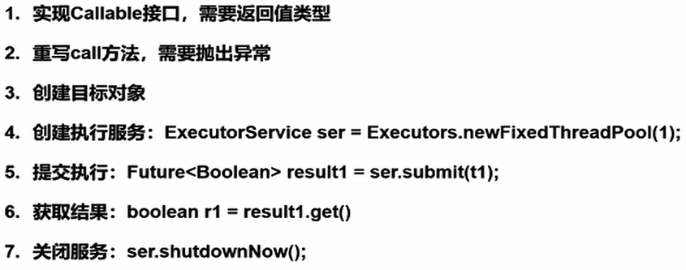
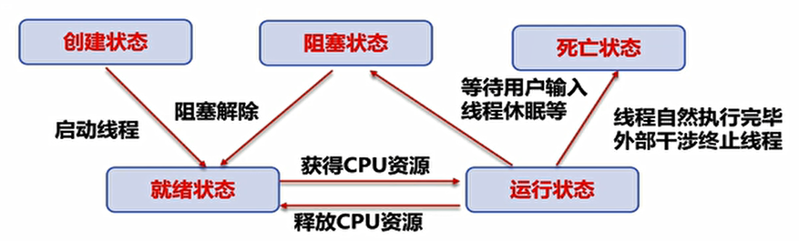
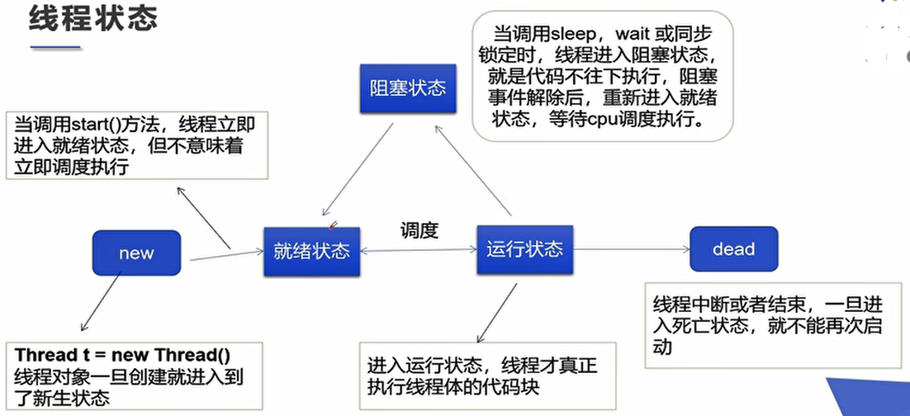

## 1、多线程概述

- 多线程：多条执行路径，主线程和子线程并行交替执行。
- 进程：是执行程序的一次执行过程，是系统资源分配的单位。在操作系统中运行的程序就是进程。
- 线程：是独立的执行路径，是CPU调度和执行的单位。一个进程可以有多个线程。
- 在一个进程中，如果开辟了多个线程，线程的运行由调度器安排调度。
- 对于同一份资源操作，会存在资源抢夺的问题，需要加入并发控制。


- 线程创建：

  - 三种方法：继承Thread类、实现Runnable接口或实现Callable接口。

  - 继承Thread类：

    - Thread类实现了Runnable接口。

    - 自定义线程类继承Thread类，重写run()方法，编写线程 执行体。创建线程对象，调用start()方法启动线程。

      ```java
      public class TestThread01 extends Thread {
      
          @Override
          public void run() {
              //线程体
              for (int i = 0; i < 200; i++) {
                  System.out.println("子线程--" + i);
              }
          }
      
          public static void main(String[] args) {
              TestThread01 thread01 = new TestThread01();
              thread01.start();
              for (int i = 0; i < 1000; i++) {
                  System.out.println("主线程--" + i);
              }
          }
      }
      ```

    - 线程开启不一定立即执行，由CPU调度执行。主线程和子线程是交替执行的。

  - 实现Runnable接口：

    - 实现run()方法，编写线程执行体。创建线程对象（传入实现类），调用start()方法启动线程。

      ```java
      public class TestThread02 implements Runnable {
      
          @Override
          public void run() {
              for (int i = 0; i < 200; i++) {
                  System.out.println("子线程--" + i);
              }
          }
      
          public static void main(String[] args) {
              TestThread02 thread02 = new TestThread02();
              //传入实现类
              new Thread(thread02).start();
              for (int i = 0; i < 1000; i++) {
                  System.out.println("主线程--" + i);
              }
          }
      }
      ```

    - Java是单继承多实现，推荐使用实现Runnable接口的方法，方便一个对象被多个线程调用。

  - 实现Callable接口：

    


- 初识并发问题：

  - 多个线程操作同一个资源的情况下，线程不安全，数据紊乱。

    ```java
    public class TestThread03 implements Runnable {
    
        private int ticketNum = 10;
        @Override
        public void run() {
            while (true) {
                if(ticketNum<=0) {
                    break;
                }
                //延时
                try {
                    Thread.sleep(200);
                } catch (InterruptedException e) {
                    e.printStackTrace();
                }
     			//获取当前运行的线程名称          
                System.out.println(Thread.currentThread().getName()+"拿到了第"+ticketNum--+"张票");
            }
        }
    
        public static void main(String[] args) {
            TestThread03 testThread03 = new TestThread03();
    		//同一个对象传入多个线程，设置线程名字
            new Thread(testThread03,"线程A").start();
            new Thread(testThread03,"线程B").start();
            new Thread(testThread03,"线程C").start();
        }
    }
    ```

    

## 2、先备知识

- 静态代理：

  - 代理对象和真实对象都要实现同一个接口。代理对象要代理真实对象。

  - 代理对象做真实对象做不了的事情，真实对象专注做自己的事情。

  - Thread对象和传入的线程对象都实现了Runnable接口，Thread对象时传入的线程对象的静态代理。

    ```java
    public class TestThread04 {
        public static void main(String[] args) {
            //类比 new Thread(testThread).start();
            new WeddingCompany(new You()).HappyMarry();
        }
    }
    
    
    interface Marry {
        public void HappyMarry();
    }
    
    class You implements Marry{
    
        @Override
        public void HappyMarry() {
            System.out.println("Marry");
        }
    }
    
    class WeddingCompany implements Marry{
        private Marry target;
    
        public WeddingCompany(Marry target) {
            this.target=target;
        }
    
        @Override
        public void HappyMarry() {
            before();
            this.target.HappyMarry();
            after();
        }
    
        private void after() {
            System.out.println("after");
        }
    
        private void before() {
            System.out.println("before");
        }
    }
    ```

- Lamda表达式：

  - 避免匿名内部类定义过多，属于函数式编程的概念。

  - 函数式接口：只包含一个抽象方法的接口。

  - Lamda表达式的简化过程：

    - 外部实现类 -> 静态内部类 -> 局部内部类 -> 匿名内部类 -> Lamda表达式。

    ```java
    public class LamdaFunction {
        //3、静态内部类
        static class ILike2 implements Like {
            @Override
            public void lamda(int p) {
                System.out.println("静态内部类"+ p);
            }
        }
        public static void main(String[] args) {
            Like like1 = new ILike1();
            like1.lamda(1);
            Like like2 = new ILike2();
            like2.lamda(2);
            //4、局部内部类
            class ILike3 implements Like {
                @Override
                public void lamda(int p) {
                    System.out.println("局部内部类"+ p);
                }
            }
            Like like3 = new ILike3();
            like2.lamda(3);
            //5、匿名内部类
            Like like4 = new Like() {
                @Override
                public void lamda(int p) {
                    System.out.println("匿名内部类"+ p);
                }
            };
            like4.lamda(4);
            //6、Lamda表达式
            Like like5 = (int p) -> {
                System.out.println("Lamda表达式"+ p);
            };
            like5.lamda(5);
            //7、简化的Lamda表达式
            Like like6 = p -> System.out.println("简化的Lamda表达式"+ p);
            like6.lamda(6);
        }
    }
    //1、函数式接口
    interface Like {
        public void lamda(int p);
    }
    //2、外部实现类
    class ILike1 implements Like {
        @Override
        public void lamda(int p) {
            System.out.println("外部实现类"+ p);
        }
    }
    ```


## 3、线程状态

- 线程状态：

  

  


- 线程停止：

  - 不推荐使用JDK提供的已经过时的线程停止方法。
  - 建议线程正常停止。可以使用标志位，对外提供方法改变表示，使线程停止下来。

  ```java
  public class TestStop implements Runnable {
      private boolean flag = true;
      @Override
      public void run() {
          int i = 0;
          while (flag){
              System.out.println("thread run..." + i++);
          }
      }
  
      public void stop(){
          this.flag=false;
      }
  
      public static void main(String[] args) {
          TestStop testStop = new TestStop();
          new Thread(testStop).start();
          for (int i = 0; i < 100; i++) {
              System.out.println("main线程" + i);
              if(i==90){
                  testStop.stop();
                  System.out.println("线程停止");
              }
          }
      }
  }
  ```

  


- 线程休眠：
  - `Thread.sleep()`指定当前线程阻塞的毫秒数。存在异常InterruptedException。
  - 时间达到后线程进入就绪状态。
  - sleep不会释放锁。


- 线程礼让：
  - `Thread.yield()`礼让线程，让正在执行的线程暂停，但不阻塞。
  - 将线程从运行状态转为就绪状态。
  - CPU重新调度，礼让不一定成功。


- 线程强制执行：

  - `thread.join()`合并线程，待此线程执行完成之后，再执行其他线程，其他线程阻塞。可以理解为插队。

    ```java
    public class TestJoin implements Runnable {
        @Override
        public void run() {
            for (int i = 0; i < 100; i++) {
                System.out.println("子线程join" + i);
            }
        }
    
        public static void main(String[] args) throws InterruptedException {
            TestJoin testJoin = new TestJoin();
            Thread thread = new Thread(testJoin);
            thread.start();
            for (int i = 0; i < 200; i++) {
                if(i==100) {
                    thread.join();
                }
                System.out.println("main线程" + i);
            }
        }
    }
    ```

  - 线程在main线程执行到100之前都是CPU调度的，执行到100之后先执行子线程，main线程阻塞。


- 观测线程状态：

  - `thread.getState()`方法观测线程状态。

  - `Thread.State`常量定义线程状态：新生/运行/阻塞/等待/超时等待/终止。

    - NEW：新生，尚未启动的线程。
    - RUNNABLE：Java虚拟机中执行的线程。
    - BLOCKED：被阻塞等待监视器锁定的线程。
    - WAITING：正在等待另一个线程执行特定动作的线程。
    - TIMED_WAITING：正在等待另一个线程执行动作达到指定等待实现的线程。
    - TERMINATED：已经退出的线程。

    ```java
    public class TestState implements Runnable {
        @Override
        public void run() {
            for (int i = 0; i < 5; i++) {
                try {
                    Thread.sleep(1000);
                } catch (InterruptedException e) {
                    e.printStackTrace();
                }
    
            }
        }
    
        public static void main(String[] args) throws InterruptedException {
            TestState testState = new TestState();
            Thread thread = new Thread(testState);
    
            Thread.State state = thread.getState();
            System.out.println(state);
    
            thread.start();
            state = thread.getState();
            System.out.println(state);
    
            while (thread.getState()!=Thread.State.TERMINATED) {
                Thread.sleep(100);
                state = thread.getState();
                System.out.println(state);
            }
            state = thread.getState();
            System.out.println(state);
        }
    }
    ```

    

- 线程优先级：
  - Java提供一个线程调度器来监控程序中启动后进入就绪状态的所有线程。线程调度器安装优先级判断应该调度那个线程来执行。
  - 线程优先级高只是意味着获得调度的概率低，更可能优先执行，不是一定优先执行。
  - 线程的优先级用数字表示，范围从1到10。常量包括：
    - `Thread.MIN_PRIORITY=1`；
    - `Thread.MAX_PRIORITY=10`；
    - `Thread.NORM_PRIORITY=5`.
  - 使用方法`getPriority()`来获取优先级。
  - 使用方法`setPriority(int xxx)`来设置优先级。


- 守护线程：
  - 线程分为用户线程和守护（daemon）线程。
  - 虚拟机必须确保用户线程执行完毕，不用等待守护线程执行完毕。
  - 设置线程为守护线程`thread.setDaemon(true)`。