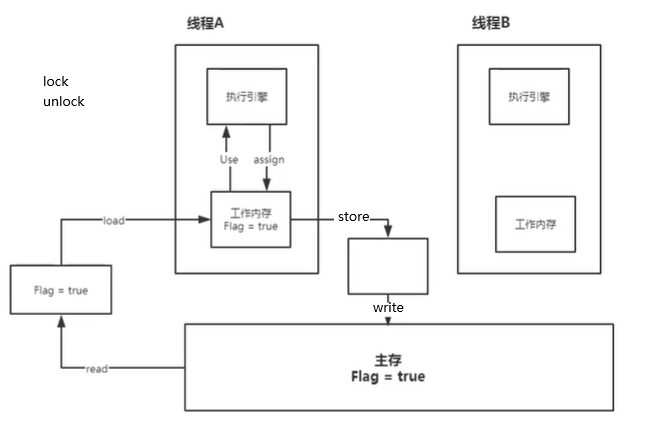

## 1、线程池

- 池化技术：

  - 程序运行的本质就是占用系统的资源。优化资源的使用的一种技术就是池化技术。
  - 创建和销毁十分浪费资源。
  - 事先准备好一些资源，有人要用就从池中拿，用完之后还到池中。

- 线程池的好处：

  - 降低资源的消耗。
  - 提高响应的速度。
  - 方便管理。
  - 线程可复用、可以控制最大并发数、管理线程。

- Executors工具类（JUC包下）：

  - 三大方法，返回一个`ExecutorService`对象：

    - `Executors.newSingleThreadExecutor()`：单个线程。
    - `Executors.newFixedThreadPool(int size)`：固定大小的线程池。
    - `Executors.newCachedThreadPool()`：可改变大小的线程池。

  - 线程池执行线程的方法：`executorService.execute(Runnable command)`，传入一个Runnable接口的实现。execute没有返回值，有返回值的可以使用submit。

  - 关闭线程池的方法：`executorService.shutdown()`。

  - 三大方法的底层都是new了一个`ThreadPoolExecutor`，这个对象的构造方法有七个参数。

  - 线程池一般不使用Executors去创建，而是使用ThreadPoolExecutor。因为Executors创建的线程池最大线程池太大，容易会OOM。

  - 七大参数：

    - `corePoolSize`：核心线程池大小。
    - `maximumPoolSize`：最大核心线程池大小，触发线程池扩容的条件是核心线程池和阻塞队列都满了。
    - `keepAliveTime`：超时时间，超时了没有被调用就会释放，线程池从最大大小变为核心大小。
    - `unit`：超时单位。
    - `workQueue`：阻塞队列，正在等待的线程排队。
    - `threadFactory`：线程工厂，用于创建线程。
    - `handler`：拒绝策略。

  - 手动创建线程池：

    ```java
    new ThreadPoolExecutor(2,5,3L, TimeUnit.SECONDS,
                    new ArrayBlockingQueue<>(3),
                    Executors.defaultThreadFactory(),
                    new ThreadPoolExecutor.AbortPolicy());
    ```

  - 四种拒绝策略：

    - `ThreadPoolExecutor.AbortPolicy()`：最大线程池中线程用完了，阻塞队列也满了（也就是达到了最大承载，最大承载等于最大线程池大小加阻塞队列大小），就不会再处理这个请求，并且抛出异常。
    - `ThreadPoolExecutor.CallerRunsPolicy()`：哪来的去哪里，线程A要线程池处理线程B，但是线程满了，只能由线程A来处理线程B。
    - `ThreadPoolExecutor.DiscardOldestPolicy()`：达到最大承载，会丢掉这个请求，不会抛出异常。
    - `ThreadPoolExecutor.DiscardPolicy()`：达到最大承载，就尝试去和最早的线程池调用的线程竞争，不会抛出异常。
    - 一般来说，达到最大承载是在，阻塞队列满了，且此时达到最大线程池大小。

  - 最大线程池应该如何定义：

    - CPU密集型：几核的CPU就定义多大的线程池，可以保证效率最高。
    - IO密集型：程序中有多少个耗费资源的大型任务（比如IO操作），线程池大小应该大于这个任务数，一般是两倍。


## 2、四大函数式接口/Stream流式计算

- `Function<T,R>`函数型接口：

  - 方法`R apply(T t)`。
  - 传入一个参数类型T，返回一个类型R。

  ```java
  Function<String,Integer> function = (str)->{return Integer.parseInt(str);};
  System.out.println(function.apply("123"));
  ```

- `Predicate<T>`断定型接口：

  - 方法`boolean test(T t)`。
  - 传入一个参数类型T，返回一个布尔类型。

  ```java
  Predicate<String> predicate = (str)->{return str.isEmpty();};
  System.out.println(predicate.test(""));
  ```

- `Consumer<T>`消费型接口：

  -  方法`void accpet(T t)`。
  - 传入一个参数类型T，没有返回值。

  ```java
  Consumer<String> consumer = (str)->{
      System.out.println(str);
  };
  consumer.accept("abc");
  ```

- `Supplier<T>`供给型接口：

  - 方法`T get()`。
  - 没有参数，返回一个类型T。

  ```java
  Supplier<Integer> supplier = ()->{return 1024;};
  System.out.println(supplier.get());
  ```


- Stream流式计算的例子：

  ```java
  public static void main(String[] args) {
          User u1 = new User(1,"a",20);
          User u2 = new User(2,"b",21);
          User u3 = new User(3,"c",26);
          User u4 = new User(4,"d",24);
          User u5 = new User(6,"e",26);
          List<User> users = Arrays.asList(u1, u2, u3, u4, u5);
          users.stream()
                  .filter((u)->{return u.getId()%2==0;})
                  .filter((u)->{return u.getAge()>23;})
                  .map((u)->{return u.getName().toUpperCase();})
                  .sorted((a,b)->{return b.compareTo(a);})
                  .limit(1)
                  .forEach(System.out::println);
  
      }
  }
  class User{
      private int id;
      private String name;
      private int age;
      /* getter & setter*/
  }
  ```

  

## 3、ForkJoin/Future

- ForkJoin：

  - 在JDK1.7出现，用于并发执行任务，在大数据量下提高效率。
  - 把大任务拆分为小任务，把一个线程分成多个线程执行。
  - 特点：工作窃取。任务被分为线程A和线程B执行，线程B已经执行完毕了，而线程A还没有执行完，线程B就会从线程A没有完成的任务中拿出一部分进行处理。
  - 使用：
    - 创建`ForkJoinPool`，通过它去执行。
    - 使用`submit()`方法执行，传入的参数是一个计算任务ForkJoinTask，返回值用get方法获取。
    - 计算类应该是一个`ForkJoinTask`，继承其实现类RecursiveTask<T>，泛型为返回值类型，需要重写compute方法。
    - 使用fork()方法拆分任务，使用join()方法执行任务并且获取返回值。

  ```java
  public class ForkJoinDemo extends RecursiveTask<Long> {
  
      private long start;
      private long end;
      private long temp = 10000L;
  
      public ForkJoinDemo(Long start, Long end) {
          this.start = start;
          this.end = end;
      }
  
      @Override
      protected Long compute() {
          if(end-start<temp) {
              long sum = 0L;
              for(long i=start;i<=end;i++){
                  sum+=i;
              }
              return sum;
          } else {
              long mid = (start+end)/2;
              ForkJoinDemo task1 = new ForkJoinDemo(start,mid);
              task1.fork();       //拆分任务，将任务压入线程队列
              ForkJoinDemo task2 = new ForkJoinDemo(mid+1,end);
              task2.fork();
              return task1.join()+task2.join();   //线程执行并返回
          }
  
      }
  }
  
  public class Test4 {
      public static void main(String[] args) throws ExecutionException, InterruptedException {
          test();
          /* 使用Stream流并行计算
          long sum = LongStream.rangeClosed(0L,10_0000_0000L).parallel().reduce(0,Long::sum);
          */
      }
  
      public static void test() throws ExecutionException, InterruptedException {
          ForkJoinPool forkJoinPool = new ForkJoinPool();
          ForkJoinDemo task = new ForkJoinDemo(0L, 10_0000_0000L);
          ForkJoinTask<Long> submit = forkJoinPool.submit(task);
          long sum = submit.get();
          System.out.println(sum);
      }
  }
  ```

  

- 异步回调：
  - Future设计的初衷，相当于是一个异步执行的线程对象，可以通过操作Future实现对线程的获取结果、取消执行等操作。具体可见https://mp.weixin.qq.com/s/eJpaNT9ds7xN7wSMy0VhFw。
  - FutureTask继承了Future和Runnable接口，可以作为任务被线程Thread执行，而且还可以用get获取结果。
  - `Future`接口象征着异步执行任务的结果即执行一个耗时任务完全可以另起一个线程执行，然后此时我们可以去做其他事情，做完其他事情我们再调用`Future.get()`方法获取结果即可。
  - 调用get方法时，如果异步线程还没有执行完成，则get方法会阻塞。
  - 使用Future的步骤：
    - 创建一个Callable的实现类，作为参数传入FutureTask的构造方法，返回一个FutureTask对象。
    - 把这个FutureTask对象作为构造参数传入Thread，并且开启线程。
    - 调用FutureTask的get方法得到执行结果。
  - Future的异步回调实现类CompletableFuture。


## 4、原子性

- JMM：

  - Java内存模型，是一个概念性的东西，不真实存在，只是一种约定。

  - 线程在运行时会从主存中拷贝变量到线程自己的工作内存中。

  - 同步约定：

    - 线程加锁前，必须读取主存中共享变量的最新值到工作内存中。
    - 线程解锁前，必须把共享变量立刻刷新回主存。
    - 加锁和解锁是同一把锁。

  - 八种操作：

    -  从主存中拷贝变量到线程的工作内存：read和load，必须成对使用。
    - 执行引擎从工作内存中使用变量并返回：user和assign。
    - 工作内存回写到主内存：write和store，必须成对使用。
    - 线程的加锁和解锁：lock和unlock。

    

  - 如果线程B修改了flag的值，主存中变为false，但是此时线程A，不知道主内存中的值已经被修改了，使用的值仍然是true。这就导致了线程A对变量的值不可见。

  ```java
  public class Test5 {
      //声明为volatile才不会死循环
      private static int num = 0;
      public static void main(String[] args) {
          new Thread(()->{
              while (num==0) {
                  //该线程对主内存的变换不知道
                  //里边不要有输出
              }
          }).start();
          try {
              TimeUnit.SECONDS.sleep(1);
          } catch (InterruptedException e) {
              e.printStackTrace();
          }
          num = 1;
          System.out.println("main num="+num);
      }
  }
  ```

  

- volatile关键字：

  - 是虚拟机提供的轻量级同步机制。

  - 特性：

    - 保证可见性。

      - 指的是volatile声明的变量对所有线程都是可见的，所有线程都会同步更新这个变量的值。
      - 在上面的num变量声明为volatile，就不会死循环了，因为num的值对子线程也是可见的。

    - 不保证原子性。

      - 线程的原子性：线程在执行任务的时候，不能被打扰也不能被分割。要么同时成功，要么同时失败。

      ```java
      public class Test6 {
          //原子包装类AtomicInteger
          private volatile static int num = 0;
          public static void main(String[] args) {
              for (int i = 0; i < 20; i++) {
                  new Thread(()->{
                      for (int i1 = 0; i1 < 2000; i1++) {
                          //getAndIncrement()
                          num++;
                      }
                  }).start();
              }
              while (Thread.activeCount()>2){
      
              }
              //最后结果小于40000，因为每个线程获取到的num值不是实时的
              System.out.println(num);
          }
      }
      ```

      - ++不是一个原子性操作，是多条字节码指令：获得值 -> 加一 -> 写回值。
      - 如果不用synchronized和lock锁，如何保证原子性？
        - JUC下的atomic包，其中有一些数据类型的原子包装类，可以保证原子性。
        - 将上边的int改为AtomicInteger类型，使用getAndIncrement()方法进行加一。
        - 原子包装类的底层都直接与操作系统挂钩，直接在内存中修改值，效率比加锁高很多。

    - 禁止指令重排。

      - 什么是指令重排：你写的程序，计算机并不是按照写的那样是执行的。而是通过源代码 -> 编译器优化重排 -> 指令并行重排 -> 内存系统重排 -> 执行。

      - 在指令重排时，会考虑数据之间的依赖性。单线程状态下，指令重排不会对结果有影响。

        ```java
        int x=1;	//1
        int y=2;	//2
        x=x+5;		//3
        y=x*x;		//4
        //我们期望的顺序是1234，但是由于指令重排可能会变成2134,1324，但是不会编程4123
        ```

        

      - 在多线程情况下，指令重排可能会对结果产生影响。

        ```java
        //a、b、c、d初始值都是0，每个线程中指令重排的顺序对此线程结果没影响，所以可能进行重排，导致对其他线程产生影响
        //线程A
        x=a;
        b=1;
        //线程B
        ay=b;
        a=2;
        ```

      - 怎么避免指令重排的：

        - 内存屏障，是一种CPU指令。可以保证特定操作的执行顺序，避免指令重排；可以保证某些变量的内存可变性（利用这个特性volatile就实现了可见性）。

  - 哪里主要用到了volatile：单例模式。


- 单例模式：

  - 饿汉式单例模式：

    - 一上来就在内存中new出这个对象，如果对象占用内存很大，就会很耗费资源。

    ```java
    public class Test1 {
    
        private byte[] data = new byte[1024*1024];
        private Test1() {
            //单例模式构造器私有
        }
        //直接创建，并且保证是单例的
        private final static Test1 Test1 = new Test1();
        //获取实例
        public static Test1 getInstance(){
            return Test1;
        }
    }
    ```

  - 懒汉式单例模式：

    - 用的时候再加载这个对象。

    ```java
    public class Test2 {
        private Test2(){
        }
    
        private static Test2 Test2;
    
        public static Test2 getInstance(){
            if(Test2==null){
                Test2 = new Test2();
            }
            return Test2;
        }
    }
    ```

  - 在单线程下，这样实现懒汉式单例模式是没有问题的。但是在多线程下会有问题，可能会创建多个实例。

  - 双重检测锁模式，DCL懒汉式单例：

    ```java
    public class Test2 {
        private Test2(){
        }
    
        private volatile static Test2 Test2;
    
        public static Test2 getInstance(){
            if(Test2==null){
                synchronized (Test2.class){
                    if(Test2==null){
                        Test2 = new Test2();
                        /*
                    不是原子性操作，步骤
                    1、分配内存空间；
                    2、执行构造方法，初始化对象；
                    3、把这个对象指向这个空间
                    */
                    }
                }
            }
            return Test2;
        }
    }
    ```

    - new一个对象不是一个原子性操作，所以为了保证原子性操作，需要给对象加上volatile。

  - 使用静态内部类实现单例模式：

    ```java
    public class Test3 {
        private Test3(){
    
        }
    
        public static Test3 getInstance(){
            return InncerClass.Test3;
        }
        private static class InncerClass{
            private static final Test3 Test3 = new Test3(); 
        }
    }
    ```

    

- 不安全的DCL懒汉式单例：

  - 用反射获取私有构造器，再创建一个实例，可以破坏单例。

  - 如果用一个标志位，在构造方法中进行判断这个标志位是否被更改过（更改过就说明已经创建了一个单例），可以部分解决问题。但是如果通过反射改变这个标志位，仍然是不安全的。

  - 使用枚举enum可以真正的实现防止用反射破坏单例。

    ```java
    public class User {
        //私有化构造函数
        private User(){ }
    
        //定义一个静态枚举类
        enum SingletonEnum{
            //创建一个枚举对象，该对象天生为单例
            INSTANCE;
            private User user;
            //私有化枚举的构造函数
            private SingletonEnum(){
                user=new User();
            }
            public User getInstnce(){
                return user;
            }
        }
    
        //对外暴露一个获取User对象的静态方法
        public static User getInstance(){
            return SingletonEnum.INSTANCE.getInstnce();
        }
    }
    ```

    

- CAS（CompareAndSet比较并交换）：

  - 什么是CAS：

    - 比较取到的值与期望的值是否相同，如果相同就设置为新值，否则就不设置。
    - CAS是CPU的并发原语。

  - Java层面的CAS：

    ```java
    public class Test4 {
        public static void main(String[] args) {
            AtomicInteger atomicInteger = new AtomicInteger(5);
            System.out.println(atomicInteger.compareAndSet(5,6));
            System.out.println(atomicInteger.get());
        }
    }
    ```

  - 原子类的底层实现：

    - unsafe类：Java无法直接操作内存，只能通过C++调用（native关键字修饰的方法）。unsafe类相当于Java的后门，通过这个类可以操作内存。
    - 比较当前工作内存中的值与主内存中的值。
    - 如果内存中的值与期望的值相同，就设置为新值。
    - 如果不相同，就一直循环（自旋锁）。

  - CAS的缺点：

    - 由于底层是自旋锁，循环会耗时。
    - 一次性只能保证一个共享变量的原子性。
    - 存在ABA问题。


- ABA问题：

  - CAS底层的实现是比较工作内存中的值与期望的值，但是如果在两次获取值的期间，另一个线程将值A先变为B再变回A，CAS是检测不到的。

  - 对于SQL，会使用乐观锁来解决这个问题。

  - 原子引用：

    - 带版本号的原子操作，JUC.atomic下的AtomicReference接口。
    - 每次更改值，都将版本号也进行更改。
    - 每次取值时，同时也获取版本号，这样就可以感知到ABA问题。

    ```java
    public class Test5 {
        public static void main(String[] args) {
            //初始化一个原子引用，设置初始值和初始版本号
            AtomicStampedReference<Integer> atomicReference = new AtomicStampedReference<>(1,1);
            new Thread(()->{
                int stamp = atomicReference.getStamp();
                System.out.println("a1 "+stamp);
                try {
                    TimeUnit.SECONDS.sleep(1);
                } catch (InterruptedException e) {
                    e.printStackTrace();
                }
                //compareAndSet方法的四个参数是期望值、修改值、期望版本号、修改版本号
                System.out.println(atomicReference.compareAndSet(1, 2,
                        atomicReference.getStamp(), atomicReference.getStamp() + 1));
                System.out.println("a2 "+atomicReference.getStamp());
                System.out.println(atomicReference.compareAndSet(2, 1,
                        atomicReference.getStamp(), atomicReference.getStamp() + 1));
                System.out.println("a3 "+atomicReference.getStamp());
            }).start();
    
            new Thread(()->{
                int stamp = atomicReference.getStamp();
                System.out.println("b1 "+stamp);
                try {
                    TimeUnit.SECONDS.sleep(2);
                } catch (InterruptedException e) {
                    e.printStackTrace();
                }
                System.out.println(atomicReference.compareAndSet(1, 3,
                        stamp, stamp + 1));
                System.out.println("b2 "+atomicReference.getStamp());
            }).start();
        }
    }
    ```

    

## 5、锁的理解

- 公平锁和非公平锁：
  - 公平锁，线程先来的先执行，不能插队。
  - 非公平锁，运行插队，后来的可能先执行。默认都是非公平的。
  - Lock中用构造方法设置，传入true为公平锁。

- 可重入锁：
  - 也叫递归锁。
  - 以线程为单位，当一个线程获取对象锁之后，这个线程可以再次获取本对象上的锁，而其他的线程是不可以的。
  - 可重入锁降低了编程复杂性，意义在于防止死锁。
  
- 自旋锁：
  
  - 当一个线程尝试去获取某一把锁的时候，如果这个锁此时已经被别人获取(占用)，那么此线程就无法获取到这把锁，该线程就一直循环等待判断该资源是否已经释放锁，间隔一段时间后会再次尝试获取。即采用循环加锁 -> 等待的机制。
  - 自旋锁避免了操作系统进程调度和线程切换，所以自旋锁通常适用在时间比较短的情况下。但是，如果长时间上锁的话，自旋锁会非常耗费性能，它阻止了其他线程的运行和调度。
  - https://mp.weixin.qq.com/s/YEEaS4HZ3T8xAwyK4KBGmA
  
  ```java
  public class SpinLockDemo {
  
      private AtomicReference<Thread> atomicReference = new AtomicReference<>();
  
      public void myLock(){
          Thread thread = Thread.currentThread();
          System.out.println(thread.getName()+"->mylock");
          while(!atomicReference.compareAndSet(null,thread)){
  
          }
  
      }
  
      public void myUnLock(){
          Thread thread = Thread.currentThread();
          System.out.println(thread.getName()+"->myunlock");
          atomicReference.compareAndSet(thread,null);
      }
  }
  
  public class Test6 {
      public static void main(String[] args) {
          SpinLockDemo lock = new SpinLockDemo();
          new Thread(()->{
              lock.myLock();
              try {
                  TimeUnit.SECONDS.sleep(3);
              } catch (InterruptedException e) {
                  e.printStackTrace();
              } finally {
                  lock.myUnLock();
              }
          },"T1").start();
  
          try {
              TimeUnit.SECONDS.sleep(1);
          } catch (InterruptedException e) {
              e.printStackTrace();
          }
          new Thread(()->{
              lock.myLock();
              try {
                  TimeUnit.SECONDS.sleep(5);
              } catch (InterruptedException e) {
                  e.printStackTrace();
              } finally {
                  lock.myUnLock();
              }
          },"T2").start();
      }
  }
  ```
  
  


- 死锁：
  - 两条线程各自持有自己的所，并且试图获取对方的锁。
  - 排查死锁问题：
    - 使用`jps -l`，查看运行的进程，定位进程号。
    - `jstack 进程号`来输出堆栈信息，找到死锁问题。


