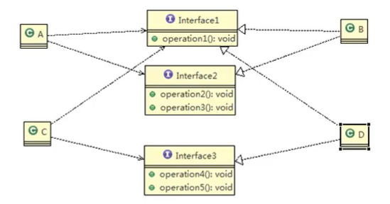
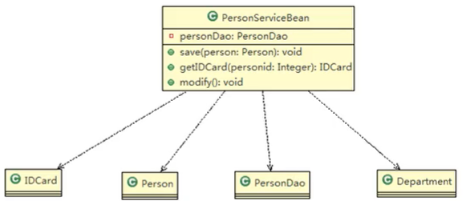
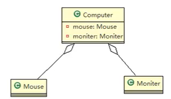
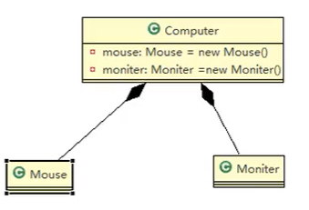

## 1、设计原则

- 软件工程中，设计模式(design pattern）是对软件设计中普遍存在（反复出现)的各种问题，所提出的解决方案。
- 编写软件过程中，面临着来自耦合性，内聚性以及可维护性，可扩展性，重用性，灵活性等多方面的挑战，设计模式是为了让程序(软件)，具有更好的：
  - 代码重用性（同种功能一次编写）；
  - 可读性（编程规范性）；
  - 可扩展性（方便增加新功能）；
  - 可靠性（新增功能与原有功能没有影响）；
  - 使程序呈现高内聚，低耦合的特性。
- 设计模式常用的七大原则（设计模式的依据）:
  1. 单一职责原则；
  2. 接口隔离原则；
  3. 依赖倒转原则；
  4. 里氏替换原则；
  5. 开闭原则；
  6. 迪米特法则；
  7. 合成复用原则。


- 单一职责原则：
  - 对类来说的，即一个类应该只负责一项职责。
  - 如果类A负责两个不同职责：职责1，职责2。当职责1需求变更而改变A时，可能造成职责2执行错误，所以需要将类A的粒度分解为A1，A2。
  - 目的：
    - 降低类的复杂度，一个类只负责一项职责；
    - 提高类的可读性，可维护性；
    - 降低变更引起的风险。
  - 通常情况下，我们应当遵守单一职责原则，只有逻辑足够简单，才可以在代码级（类级）违反单一职责原则；只有类中方法数量足够少时，可以在方法级别保持单一职责原则。
  
- 接口隔离原则：

  - 客户端不应该依赖他不需要的接口，即一个类对另一个类的依赖应该建立在最小接口上。

  - 例：

    - 类B和D都是接口Interface1的实现类。A通过Interface1依赖于接口中的1、2、3号方法（就是在类中使用接口的方法）。C通过Interface1依赖于接口中的1、4、5号方法。

    - 类B是作为A中方法的传入参数而设计，类D是作为C中方法的传入参数而设计。

      

    - 接口Interface1对于类A和类C来说不是最小接口，类B和类D必须去实现他们不需要的方法。

    - 将接口Interface1拆分为独立的几个接口，类A和类c分别与他们需要的接口建立依赖关系，类B和类D对应实现方法。也就是采用接口隔离原则。

      

- 依赖倒转原则：

  - 高层模块不应该依赖低层模块，模块依赖的应该都是抽象。
  - 抽象不应该依赖细节，细节应该依赖抽象。
  - 依赖倒转(倒置)的中心思想是面向接口编程。
  - 依赖倒转原则是基于这样的设计理念:相对于细节的多变性，抽象的东西要稳定的多。以抽象为基础搭建的架构比以细节为基础的架构要稳定的多。在java中，抽象指的是接口或抽象类,细节就是具体的实现类。
  - 使用接口或抽象类的目的是制定好规范，而不涉及任何具体的操作，把展现细节的任务交给他们的实现类去完成。
  - 例：
    - 为具体的实现类抽象出一个接口。
    - 在方法接收的参数中，不写具体的实现类，而是写这个实现类所抽象成的接口。
  - 依赖关系传递的三种方式：
    - 用所调用的方法传递。
    - 用构造方法传递。
    - 用setter方法传递。
    - 本质都是传入了一个接口类型的实例对象，只不过传入的时机不同。
  - 细节：
    - 低层模块尽量都要有抽象类或接口，或者两者都有，程序稳定性更好。
    - 变量的声明类型尽量是抽象类或接口，这样我们的变量引用和实际对象间，就存在一个缓冲层，利于程序扩展和优化。
    - 继承时遵循里氏替换原则。

- 里氏替换原则：

  - 继承关系增加了对象中的耦合性，里氏替换原则就是为了正确的使用继承，
  - 如果对每个类型为T1的对象o1，都有类型为T2的对象o2，使得以T1定义的所有程序P在所有的对象o1都代换成o2时，程序P的行为没有发生变化，那么类型T2是类型T1的子类型。换句话说，**所有引用基类的地方必须能透明地使用其子类的对象**。
  - 在使用继承时，遵循里氏替换原则，在子类中尽量不要重写父类的方法。
  - 在实际编程中，我们常常会通过重写父类的方法完成新的功能，这样写起来虽然简单，但整个继承体系的复用性会比较差。特别是运行多态比较频繁的时候。
  - 通用的做法是：将原有的继承关系去掉，原来的父类和子类都继承一个更基础的基类，通过**聚合，组合，依赖**来解决问题。
  - 例：
    - 类B原本继承于A，但是需要重写方法。将A和B都继承于基类Base。
    - 组合：指在B类中创建一个类A的实例作为成员变量，然后使用这个对象调用A的方法。
    - 聚合：指在B类中创建一个类A的引用作为成员变量，然后使用setter方法将引用指向实例。
    - 依赖：指在B类中的方法的传入参数为类A的实例。

- 开闭原则：

  - 开闭原则(Open Closed Principle）是编程中最基础、最重要的设计原则。
  - 一个软件实体如类，模块和函数应该对扩展开放（对提供方），对修改关闭（对使用方）。用抽象构建框架，用实现扩展细节。
  - 当软件需要变化时，尽量通过扩展软件实体的行为来实现变化，而不是通过修改已有的代码来实现变化。
  - 编程中遵循其它原则，以及使用设计模式的目的就是遵循开闭原则。
  - 例：
    - 类似于依赖倒转原则中类似，通过在使用方中传入一个接口类型，调用接口中的方法。
    - 这样扩展时只需要创建一个该接口新的的实现类即可。

- 迪米特法则：

  - 一个对象应该对其他对象保持最少的了解。类与类关系越密切，耦合度越大。
  - 迪米特法则(Demeter Principle)又叫最少知道原则，即一个类对自己依赖的类知道的越少越好。也就是说，对于被依赖的类不管多么复杂，都尽量将逻辑封装在类的内部。对外除了提供的public方法，不对外泄露任何信息。
  - 目的：降低类直接不必要的依赖。
  - 迪米特法则还有个更简单的定义：只与直接的朋友通信。
  - 直接的朋友：每个对象都会与其他对象有耦合关系，只要两个对象之间有耦合关系我们就说这两个对象之间是朋友关系。耦合的方式很多，依赖，关联，组合，聚合等。其中，我们称出现在成员变量，方法参数，方法返回值中的类为直接的朋友，而出现在局部变量中的类不是直接的朋友。
  - 就是说，对于一个类中的操作，最好将细节都封装到这个类内部，对外只暴露方法；尽量避免将非直接的朋友作为局部变量使用。

- 合成复用原则：

  - 尽量使用合成/聚合的方式，而不是使用继承。

- 设计原则核心思想：

  - 找出应用中可能需要变化之处，把它们独立出来，不要和那些不需要变化的代码混在一起。
  - 针对接口编程,而不是针对实现编程。
  - 为了交互对象之间的松耦合设计而努力。


## 2、UML类图

- UML——Unified modeling language UML(统一建模语言)，是一种用于软件系统分析和设计的语言工具，它用于帮助软件开发人员进行思考和记录思路的结果。

- UML本身是一套符号的规定，就像数学符号和化学符号一样，这些符号用于描述软件模型中的各个元素和他们之间的关系，比如类、接口、实现、泛化、依赖、组合、聚合等。

- UML类图：描述类与类之间的关系。

- 依赖：

  - 只要是在类中用到了对方，那么他们之间就存在依赖关系。如果没有对方，连编绎都通过不了。

  - 包括：成员变量、方法接收参数、方法返回类型、方法中局部变量（不推荐）等其他被使用的类。

  - 例：

    - 代码：

      ```java
      public class PersonSepiceBean {
      	private PersonDao personDao; 
          void save(Person person){}
      	public IDCard getIDCard(Integer personid){
          	return null;
          }
      	public void modify(){
      	Department department = new Department();
          }
      }
      public class PersonDao {}
      public class IDCard {}
      public class Person {}
      public class Department {}
      ```

    - UML类图（尖头虚线）：本类指向依赖的类。

      

- 泛化：

  - 即继承，是依赖的一种特例。

  - UML类图（三角头实线）：子类指向父类。

    

- 实现：

  - 即接口实现，是依赖的一种特例。
  - UML类图（三角头虚线）：实现类指向接口。

- 关联：

  - 类与类之间的联系，是依赖的一种特例。
  - 是成员属性层面的依赖。
  - 具有导航性，即单向关系和双向关系。
  - 具有多重性，即一对一、一对多、多对多。
  - UML类图（实线）：两方平等连接。
  
- 聚合：

  - 整体和部分的关系，整体与部分可以分开，是关联的一种特例。
  - 具有导航性（即谁聚合谁）和多重性。
  - UML类图（空心菱形实线）：部分指向整体。
  - 整体与部分可以分开是指，A聚合了B和C，但是A与B和C分开后还具有原本的功能。比如B和C是A中的成员属性，但是没有直接初始化，而是只能用setter方法之后在进行初始化。

  

- 组合：

  - 整体和部分的关系，但整体与部分是不可以分开的，是关联的一种特例。
  - UML类图（实心菱形实线）：部分指向整体。
  - 整体与部分不可分开是指，A组合了B和C，但是A与B和C分开后失去了原本的功能。比如B和C是A中的成员属性，而且是直接初始化new的。

  


## 3、单例模式

- 设计模式分类：

  - 创建型模式:单例模式、抽象工厂模式、原型模式、建造者模式、工厂模式。
  - 结构型模式:适配器模式、桥接模式、装饰模式、组合模式、外观模式、享元模式、代理模式。
  - 行为型模式:模版方法模式、命令模式、访问者模式、迭代器模式、观察者模式、中介者模式、备忘录模式、解释器模式(Interpreter模式)、状态模式、策略模式、职责链模式(责任链模式)。

- 单例模式：

  - 所谓类的单例设计模式，就是采取一定的方法保证在整个的软件系统中，对某个类只能存在一个对象实例，并且该类只提供一个取得其对象实例的方法（静态的）。
  - 八种写法：
    - 饿汉式(静态常量)
    - 饿汉式（静态代码块)
    - 懒汉式(线程不安全)
    - 懒汉式(线程安全，同步方法)
    - 懒汉式(线程安全，同步代码块)
    - 双重检查
    - 静态内部类枚举

- 饿汉式（静态常量/静态代码块）：

  - 步骤：

    1. 构造器私有化（防止被new）。
    2. 类的内部创建对象（类加载时）。
    3. 向外暴露一个静态的公共方法。

  - 代码：

    ```java
    //静态常量
    public class Test1 {
        //构造器私有化（防止被new）
        private Test1(){
    
        }
        //类的内部创建对象
        private final static Test1 instance = new Test1();
        //向外暴露一个静态的公共方法
        public static Test1 getInstance(){
            return instance;
        }
    }
    
    //静态代码块
    public class Test2 {
        private Test2(){
    
        }
        private static Test2 instance;
        static {
            instance = new Test2();
        }
        public static Test2 getInstance(){
            return instance;
        }
    }
    ```

  - 优点：简单，在类装载时就完成了实例化。避免了线程同步问题。

  - 缺点：没有达到懒加载效果，如果没有使用过这个实例也会创建，导致内存浪费。

- 懒汉式（线程不安全）：

  - 当使用到提供的创建实例的方式时，才创建实例。

  - 需要判断是否已经创建了实例，如果没有则创建，创建了则直接返回。

  - 代码：

    ```java
    public class Test3 {
        private Test3(){
    
        }
        private static Test3 instance;
        public static Test3 getInstance(){
            if(instance==null){
                instance = new Test3();
            }
            return instance;
        }
    }
    ```

  - 优点：起到了懒加载的效果。

  - 缺点：只能在单线程下使用。如果在多线程下，一个线程进入了if (singleton == null)判断语句块，还未来得及往下执行，另一个线程也通过了这个判断语句，这时便会产生多个实例。所以在多线程环境下不可使用这种方式。

- 懒汉式（线程安全）：

  - 最笨重的同步，在获取实例的静态方法上使用同步方法。

  - 如果要用同步代码块的话，要写在判断外，写在判断内是无效的。

  - 代码：

    ```java
    public class Test4 {
        private Test4(){
    
        }
        private static Test4 instance;
        public static synchronized Test4 getInstance(){
            if(instance==null){
                instance = new Test4();
            }
            return instance;
        }
    }
    ```

  - 优点：解决了线程不安全问题。

  - 缺点：效率太低了，每个线程在想获得类的实例时候，执行getInstance()方法都要进行司步。而其实这个方法只执行一次实例化代码就够了，后面的想获得该类实例,直接return就行了。方法进行同步效率太低，在实际开发中，不推荐使用这种方式。

- 双重检查锁：

  - 如果如上一种方法，将同步代码块加在判断外边，效率与同步方法基本没有区别。

  - 如果在同步代码块外部再加一个判断，创建实例后，就都不会在进入同步代码块，提高了效率。

  - 代码：

    ```java
    public class Test5 {
        private Test5(){
    
        }
        private static Test5 instance;
        public static Test5 getInstance(){
            if(instance==null){
                synchronized (Test5.class){
                    if(instance==null){
                        instance = new Test5();
                    }
                }
            }
            return instance;
        }
    }
    ```

  - 优点：保证了线程安全，避免了反复进行方法同步，效率较高。实际开发中推荐使用。

- 静态内部类：

  - 当外部类被装载时，静态内部类不会被装载。

  - 在静态内部类被调用时，才会装载静态内部类，而且是线程安全的。

  - 代码：

    ```java
    public class Test6 {
        private Test6(){
    
        }
        private static class inner {
            private static final Test6 INSTANCE = new Test6();
        }
        public static Test6 getInstance(){
            return inner.INSTANCE;
        }
    }
    ```

  - 优点：借助JVM实现了延迟加载和线程安全，推荐使用。

- 枚举：

  -  代码：

    ```java
    public class Test7 {
        
    }
    enum enumTest7 {
        INSTANCE;
        private Test7 instance;
        private enumTest7(){
            instance=new Test7();
        }
        public Test7 getInstance() {
            return instance;
        }
    }
    ```

  - 优点：不仅能避免线程不安全，而且能防止反序列化重新创建新对象。

- 源码分析：

  - JDK中的java.lang.Runtime，用的是饿汉式单例。

  ```java
  public class Runtime {
      private static Runtime currentRuntime = new Runtime();
      public static Runtime getRuntime() {
          return currentRuntime;
      }
      private Runtime() {}
  }
  ```

- 注意事项：

  - 单例模式保证了系统内存中该类只存在一个对象，节省了系统资源，对于一些需要频繁创建销毁的对象，使用单例模式可以提亮系缤性能。
  - 当想实例化一个单例类的时候，必须要记住使用相应的获取对象的方法，而不是使用new。
  - 单例模式使用的场景：需要频繁的进行创建和销毁的对象、创建对象时耗时过多或耗费资源过多(即:重量级对象)但又经常用到的对象、工具类对象、频繁访问数据库或文件的对象(比如数据源、session工厂等)。


