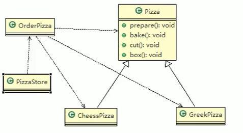
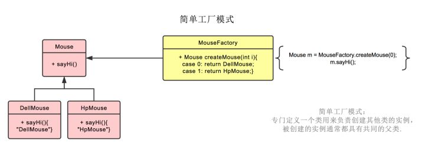
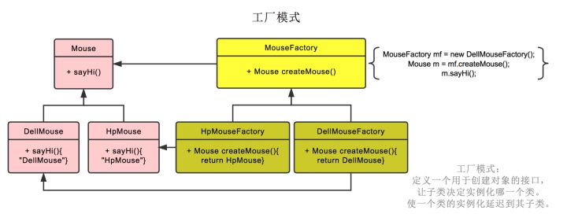
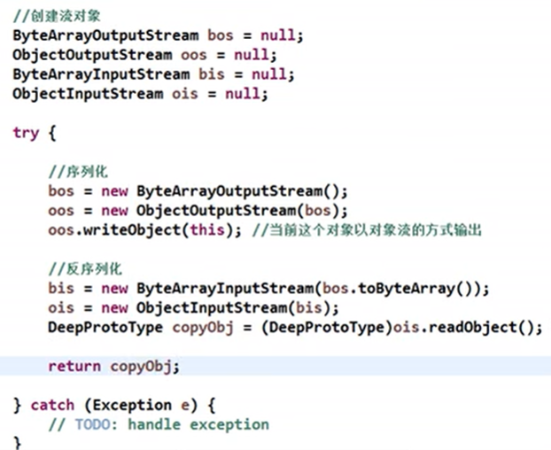
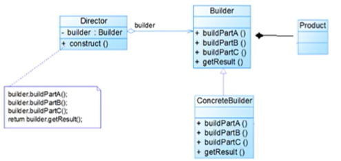
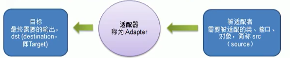

## 1、工厂模式

[Java3y工厂模式](https://mp.weixin.qq.com/s?__biz=MzI4Njg5MDA5NA==&mid=2247484243&idx=1&sn=972cbe6cdb578256e4d4771e7ca25de3&chksm=ebd74252dca0cb44419903758e8ca52d9ab287562f80be9365e305d6dcc2deaa45b40f9fd2e9&scene=21###wechat_redirect)

Head First设计模式 4.工厂模式

[抽象工厂模式和工厂模式的区别](https://www.zhihu.com/question/20367734)

- 目的：简单来说让**创建对象变得简单**而且**修改对象时能很方便**。

- 示例：一个披萨的项目。

  - 要便于披萨种类的扩展，要便于维护。

  1. 披萨的种类很多(比如GreekPizz、CheesePizz等)。
  2. 披萨的制作有prepare，bake, cut, box四步。
  3. 完成披萨店订购功能。

- 传统的思路：

  - 创建一个披萨抽象类，其中有prepare，bake, cut, box四个方法。
  - 不同类型的披萨作为一个具体的类，继承自披萨类。
  - 子类中可以重写父类的方法。
  - 创建一个订购披萨的类，在其中根据订购的披萨名称创建不同的对象。
  - 创建一个披萨店类，发出订购要求。

  

- 传统方式的缺点：

  - 违反了开闭原则，即对扩展开放，对修改关闭。
  - 如果想新增一个披萨的种类，不但需要新增一个新的披萨类，而且需要在订购披萨的类中修改创建披萨的代码。
  - 改进思路：把创建披萨对象封装到一个类中，这样有新的披萨种类时，只需要修改这个类，不需要修改调用该类创建披萨对象的地方的代码。即简单工厂模式。

- 简单工厂模式：

  - 简单工厂模式是属于创建型模式，是工厂模式的一种。简单工厂模式是由一个工厂对象决定创建出哪一种产品类的实例。简单工厂模式是工厂模式家族中最简单实用的模式。

  - 简单工厂模式：定义了一个创建对象的类，由这个类来封装实例化对象的行为(代码)。

  - 在软件开发中，当我们会用到大量的创建某种、某类或者某批对象时，就会使用到工厂模式。

  - 改进：创建一个简单工厂类，这样订购披萨类只依赖于简单工厂类，不直接依赖于具体的披萨类。

  - 代码：

    ```java
    public class Simplefactory {
        public Pizza createPizza(String orderType){
            Pizza pizza = null;
            if("A".equals(orderType)){
                pizza = new APizza();
                pizza.setName("aa");
            } else if ("B".equals(orderType)){
                pizza = new BPizza();
                pizza.setName("bb");
            }
            return pizza;
        }
    }
    ```

  - 这样，在新增披萨时，只需要修改简单工厂中的代码。

  - 如果将简单工厂模式中的方法改为静态方法也可以，而且简化了调用。这样也称静态工程模式。

  - 类图：

    - 鼠标工厂，生产HP和Dell的鼠标。

    

- 工厂方法模式：

  - 新需求：如果不仅要选择披萨的类型，还需要选择点餐的位置。类型和地点组合，抽象为不同的披萨类。

  - 如果使用简单工厂模式，需要创建多个简单工厂。而且这些工厂之间没有联系，难以复用代码。

  - 工厂方法模式设计方案：将披萨项目的实例化功能抽象成披萨店类中的抽象方法，在不同的披萨店子类中具体实现。

  - 工厂方法模式：定义了一个创建对象的抽象方法，由子类决定要实例化的类。工厂方法模式将对象的实例化推迟到子类。

  - 此时，所谓的工厂，就是这个抽象方法。

    - 它是抽象的，依赖子类来进行对象创建。
    - 返回值是产品顶层接口Pizza，也就是这个工厂方法所创建的对象。
    - 这个工厂方法可以有参数，也可以没有。

  - 披萨店（创建者）与披萨（产品）之间的层级是对应的，即顶级的披萨店接口对应顶级的披萨接口，实现类北京披萨店对应实现类北京的A披萨、B披萨。

  - 代码：

    - 在使用时，将抽象工厂类的引用指向具体的子类工厂，然后再调用抽象工厂方法。

    ```java
    //订购披萨类
    public abstract class PizzaStore {
        public abstract Pizza createPizza(String orderType);
    
        public Pizza OrderPizza(String type){
            Pizza pizza = null;
            pizza = createPizza(type);
            pizza.prepare();
            pizza.bake();
            return pizza;
        }
    }
    
    //在北京订购披萨类
    public class BJPizzaStore extends PizzaStore {
    
        @Override
        public Pizza createPizza(String orderType) {
            Pizza pizza = null;
            if("A".equals(orderType)){
                pizza = new BJAPizza();
                pizza.setName("aa");
            } else if ("B".equals(orderType)){
                pizza = new BJBPizza();
                pizza.setName("bb");
            }
            return pizza;
        }
    }
    ```

  - 优点：如果有新的对象需要增加，只需要增加一个新的具体工厂类，对原有的代码没有影响。而简单工厂模式则需要修改简单工厂中的代码。

  - 类图：

    - 鼠标工厂中有一个生产鼠标的抽象方法，有子工厂HP鼠标工厂和Dell鼠标工厂。

    

- 抽象工厂模式：

  - 抽象工厂模式：定义了一个interface（或抽象类）用于创建相关或有依赖关系的对象簇，而无需指明具体的类。

  - 抽象工厂模式中，抽象工厂中的每一个方法都相当于是工厂方法模式中的工厂方式。这些方法是抽象的，需要由其具体的子类工厂来实现。

  - 这些多个“工厂方法”创建出的多个不同对象的组合，称之为一个产品簇。

  - 类似的，抽象工厂模式中，创建者的层级也是与产品簇的层级对应的。

  - 类图：

    - 鼠标和键盘构成一个产品簇。

    

- 源码分析：

  - java.util.Calendar，使用了简单工厂模式。

  ```java
  if (aLocale.hasExtensions()) {
      String caltype = aLocale.getUnicodeLocaleType("ca");
      if (caltype != null) {
          switch (caltype) {
              case "buddhist":
                  cal = new BuddhistCalendar(zone, aLocale);
                  break;
              case "japanese":
                  cal = new JapaneseImperialCalendar(zone, aLocale);
                  break;
              case "gregory":
                  cal = new GregorianCalendar(zone, aLocale);
                  break;
          }
      }
  }
  ```

  

## 2、原型模式

- 示例：克隆羊。一个具有名字、年龄、颜色等属性的羊，需要将其克隆10只。

- 传统思路：

  - 创建初始羊对象。
  - 创建新的羊对象，初始化属性通过对初始羊的getter方法获取。
  - 这样如果羊的属性更改，克隆的代码也需要修改。

- 改进思路：Java中Object类是所有类的根类，Object类提供了一个clone()方法，该方法可以将一个Java对象复制一份，但是需要实现clone的Java类必须要实现一个接口Cloneable，该接口表示该类能够复制且具有复制的能力。

- 原型模式(Prototype模式)是指：用原型实例指定创建对象的种类，并且通过拷贝这些原型，创建新的对象。

- 原型模式是一种创建型设计模式，允许一个对象再创建另外一个定制的对象，无需知道如何创建的细节。

- 工作原理是：通过将一个原型对象传给那个要发动创建的对象，这个要发动创建的对象通过请求原型对象拷贝它们自己来实施创建，即对象.clone()。

- 代码：

  ```java
  public class Sheep implements Cloneable {
      private String name;
      private int age;
  
      @Override
      protected Sheep clone() throws CloneNotSupportedException {
          return (Sheep)super.clone();
      }
      /* constructor，getter，setter */
  }
  
  
  Sheep sheep = new Sheep("a",10);
  Sheep sheep1 = sheep.clone();
  ```

- 源码分析：

  - Spring中原型bean（scope指定为prototype）的创建，使用了原型模式。
  - 这样bean就是多例的了。

- 浅拷贝：

  - 对于数据类型是基本数据类型的成员变量（包括字符串），浅拷贝会直接进行值传递，也就是将该属性值复制一份给新的对象。
  - 对于数据类型是引用数据类型的成员变量，比如说成员变量是某个数组、某个类的对象等，那么浅拷贝会进行引用传递，也就是只是将该成员变量的引用值（内存地址）复制一份给新的对象。因为实际上两个对象的该成员变量都指向同一个实例。在这种情况下，在一个对象中修改该成员变量会影响到另一个对象的该成员变量值。
  - 浅拷贝是使用默认的clone()方法来实现。

- 深拷贝：

  - 复制对象的所有基本数据类型的成员变量值。

  - 为所有引用数据类型的成员变量中请存储空间，并复制每个引用数据类型成员变量所引用的对象，直到该对象可达的所有对象。也就是说，对象进行深拷贝要对整个对象进行拷贝。

  - 深拷贝实现方式1：重写clone方法来实现深拷贝。

    - 重写clone方法中，首先调用默认的克隆方法，完成对基本数据类型和String的克隆。
    - 然后，对引用数据类型进行单独处理，即对其再调用一次clone()方法（前提是该类也实现了Cloneable），然后将赋值回去。
    - 再克隆该对象，使用重写后的clone方法来深拷贝。

  - 深拷贝实现方式2：通过对象序列化实现深拷贝。

    - 需要同时实现Serializable和Cloneable接口。

    - 先序列化输出，再反序列化读入为对象。

    - 创建一个deepClone()方法：

      

- 注意事项：

  - 创建新的对象比较复杂时，可以利用原型模式简化对象的创建过程，同时也能够提高效率。
  - 不用重新初始化对象，而是动态地获得对象运行时的状态。
  - 如果原始对象发生变化(增加或者减少属性)，其它克隆对象的也会发生相应的变化，无需修改代码。
  - 缺点:需要为每一个类配备一个克隆方法，这对全新的类来说不是很难，但对已有的类进行改造时，需要修改其源代码，违背了ocp原则.


## 3、建造者模式

- 示例：

  - 需要建房子，过程为打地基，砌墙，封顶。
  - 建不同的房子，虽然流程一样，但是每个过程具体的要求不同。

- 传统思路：

  - 创建一个抽象建房子类，其中有打地基，砌墙，封顶的抽象方法。然后在一个获取结果的方法中返回房子产品。
  - 建具体的房子的类要继承这个抽象类，实现抽象方法。
  - 将产品和创建产品的过程封装在了一起，耦合性增加了。

- 建造者模式(Builder Pattern）又叫生成器模式，是一种对象构建模式。它可以将复杂对象的建造过程抽象出来（抽象类别)，使这个抽象过程的不同实现方法可以构造出不同表现（属性)的对象。

- 建造者模式是一步一步创建一个复杂的对象，它允许用户只通过指定复杂对象的类型和内容就可以构建它们，用户不需要知道内部的具体构建细节。

- 建造者模式的四个角色：

  - Product（产品角色)：一个具体的产品对象。
  - Builder(抽象建造者)：指定创建一个Product对象所需要的各个部件和流程的接口/抽象类。
  - ConcreteBuilder（具体建造者)：实现抽象建造者接口，具体的建造环节。并有一个方法返回产品对象。
  - Director(指挥者)：构建一个使用Builder接口的对象。它主要是用于创建一个复杂的对象。它主要有两个作用，一是：隔离了客户与对象的生产过程，二是：负责控制产品对象的生产过程。

  

  - 产品被传入到了抽象建造者中。
  - 在具体建造者中实现建造的各个环节。
  - 在指挥者中，创建抽象建造者的引用指向具体建造者，通过建造者提供的各个环节的方法，由指挥者确定流程，并最终返回产品对象。
  - 被调用时，将具体建造者传入指挥者，由指挥者的构建方法返回最终的产品。

- 代码：

  ```java
  //房子类
  public class House {
      private String wall;
      private String baise;
      /* getter&setter */
  }
  
  //抽象建造者
  public abstract class HouseBuilder {
      protected House house;
  
      public abstract void buildBasic();
      public abstract void buildWall();
  
      public House buildHouse(){
          return house;
      }
  }
  
  //具体建造者
  public class CommonHouseBuilder extends HouseBuilder{
      @Override
      public void buildBasic() {
          System.out.println("common-basic");
      }
  
      @Override
      public void buildWall() {
          System.out.println("common-wall");
      }
  }
  
  //指挥者
  public class HouseDirector {
      private HouseBuilder houseBuilder;
  
      public HouseDirector(HouseBuilder houseBuilder) {
          this.houseBuilder = houseBuilder;
      }
  
      public House constuctHouse(){
          houseBuilder.buildBasic();
          houseBuilder.buildWall();
          return houseBuilder.buildHouse();
      }
  }
  ```

  

- 源码分析：

  - java.lang.StringBuilder中使用到了建造者模式。
  - StringBuilder继承了AbstractStringBuilder抽象类，AbstractStringBuilder实现了Appendable接口。
  - Appendable可以看作时抽象建造者，AbstractStringBuilder可以看作是具体建造者，StringBuilder可以看作时具体建造者和指挥者。

- 注意事项：

  - 客户端(使用程序)不必知道产品内部组成的细节，将产品本身与产品的创建过程解耦，使得相同的创建过程可以创建不同的产品对象。
  - 每一个具体建造者都相对独立，而与其他的具体建造者无关，因此可以很方便地替换具体建造者或增加新的具体建造者，用户使用不同的具体建造者即可得到不同的产品对象。
  - 可以更加精细地控制产品的创建过程。将复杂产品的创建步骤分解在不同的方法中，使得创建过程更加清晰，也更方便使用程序来控制创建过程。
  - 增加新的具体建造者无须修改原有类库的代码，指挥者类针对抽象建造者类编程，系统扩展方便，符合“开闭原则”。
  - 建造者模式所创建的产品一般具有较多的共同点，其组成部分相似，如果产品之间的差异性很大，则不适合使用建选者模式，因此其使用范围受到一定的限制。
  - 如果产品的内部变化复杂，可能会导致需要定义很多具体建造者类来实现这种变化导致系统变得很庞大，因此在这种情况下，要考虑是否选择建造者模式.
  - 抽象工厂模式VS建造者模式：
    - 抽象工厂模式实现对产品家族的创建，一个产品家族是这样的一系列产品：具有不同分类维度的产品组合，采用抽象工厂模式不需要关心构建过程，只关心什么产品由什么工厂生产即可。
    - 建造者模式则是要求按照指定的流程建造产品，它的主要目的是通过组装零配件而产生一个新产品


## 4、适配器模式

- 示例：三项的插头插不进两孔的插座，需要转换接头，也就是适配器。

- 适配器模式(Adapter Pattern)将某个类的接口转换成客户端期望的另一个接口表示，主的目的是兼容性，让原本因接口不匹配不能一起工作的两个类可以协同工作。其别名为包装器(Wrapper)。

- 适配器模式属于结构型模式

- 主要分为三类：类适配器模式、对象适配器模式、接口适配器模式。

- 工作原理：
  1）适配器模式:将一个类的接口转换成另一种接口.让原本接口不兼容的类可以兼容。
  2)从用户的角度看不到被适配者，是解耦的。
  3)用户调用适配器转化出来的接口方法，适配器再调用被适配者的相关接口方法。
  4)用户收到反馈结果，感觉只是和目标接口交互。

  

- 类适配器模式：

  - Adapter类，通过继承src类，实现dst接口，完成src->dst的适配。

  - 代码：

    ```java
    //被适配的类
    public class Vol220V {
        public int output220V() {
            int src = 220;
            return src;
        }
    }
    
    //输出目标接口
    public interface Vol5V {
        public int output5V();
    }
    
    //适配器
    public class VolAdapter extends Vol220V implements Vol5V {
        @Override
        public int output5V() {
            int src = output220V();
            int dst = src/44;
            return dst;
        }
    }
    
    //需要使用目标接口输出
    public class Phone {
        public void charging(Vol5V vol5V) {
            if (vol5V.output5V()==5) {
                System.out.println("电压5V");
            }
        }
    }
    
    //最终调用
    Phone p = new Phone();
    p.charging(new VolAdapter());
    ```

  - Java是单继承机制，所以类适配器需要继承src类这一点算是一个缺点，因为这要求dst必须是接口，有一定局限性。

  - src类的方法在Adapter中都会暴露出来，也增加了使用的成本。

  - 由于其继承了src类，所以它可以根据需求重写src类的方法，使得Adapter的灵活性增强了。

- 对象适配器：

  - 基本思路和类的适配器模式相同，只是将Adapter类作修改，不是继承src类，而是持有src类的实例（构造器传入），以解决兼容性的问题。即：持有src类，实现dst类接口，完成src->dst的适配。
  - 根据“合成复用原则”，在系统中尽量使用关联关系来替代继承关系。也
  - 对象适配器模式是适配器模式常用的一种，最符合将被适配对象传入适配器返回目标接口类型的直观理解。
  - 不再要求dst是接口。

- 接口适配器：

  - 当不需要全部实现接口提供的方法时，可先设计一个抽象类实现接口，并为该接口中每个方法提供一个默认实现（空方法），那么该抽象类的子类可有选择地覆盖父类的某些方法来实现需求。
  - 适用于一个接口不想使用其所有的方法的情况。
  - 也就是说，接口适配器是同时实现了src和dst接口，然后在使用时根据情况使用匿名内部类实现所需要的方法。

- 源码分析：

  - 在SpringMVC中的HandlerAdapter中使用了适配器模式。
  - Controller接口是src，有不同的实现，调用方式（具体的参数、方法）也是不确定的。不用适配器需要if else。
  - HandlerAdapter是适配器接口，针对不同是Controller需要不同的适配器。目标dst是适配器对外提供统一的Controller调用方法。
  - [SpringMVC中的适配器模式](https://www.cnblogs.com/tongkey/p/7919401.html)。

- 注意事项：
  - 三种方式，是根据src是以怎样的形式给到Adapter(在Adapter里的形式）来命名的。
    - 类适配器：以类给到，在Adapter里，就是将src当做类，继承。
    - 对象适配器：以对象给到，在Adapter里，将src作为一个对象，持有。
    - 接口适配器：以接口给到，在Adapter里，将src作为一个接口，实现。
  - Adapter模式最大的作用还是将原本不兼容的接口融合在一起工作。
  - 实际开发中，实现起来不拘泥于我们开解的三种经典形式。


