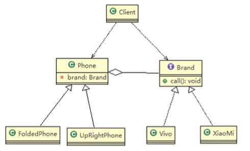
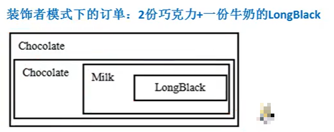
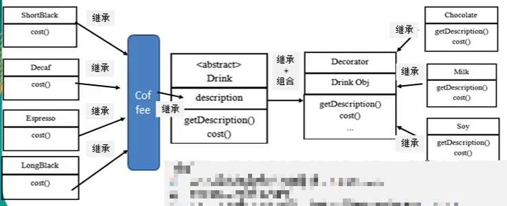
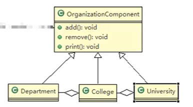
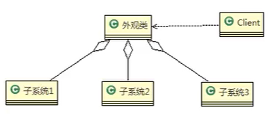
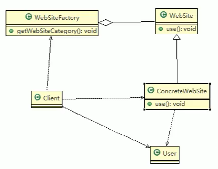

## 1、桥接模式

- 示例：手机分为不同的种类，每种种类下又有不同的手机厂商。每种手机都有打电话等类似的手机功能。

- 传统方法：

  - 不同类型的手机类继承手机类，不同厂商的手机类再继承不同类型的手机类。这样分为两层。
  - 如果要增加一个手机类型或者一个手机厂商，比较麻烦。
  - 实际上就是产品可以按两种分类维度进行分类（即抽象和实现），如何设计类之间的关系。

- 桥接模式(Bridge模式)是指：将实现与抽象放在两个不同的类层次中，使两个层次可以独立改变。是一种结构型设计模式。

- Bridge模式基于类的最小设计原则，通过使用封装、聚合及继承等行为让不同的类承担不同的职责。它的主要特点是把抽象(Abstraction)与行为实现(Implementation)分离开来，从而可以保持各部分的独立性以及应对他们的功能扩展。

- 桥接模式的角色：

  - 抽象类(Abstraction) ：维护了行为的具体实现类，是聚合关系，Abstraction充当桥接类。
  - RefinedAbstraction :是Abstraction抽象类的子类。
  - Implementor：行为实现类的接口。
  - ConcretelmplementorA /B：行为的具体实现类。

- 代码：

  - 类图：

    

  ```java
  //行为实现的接口
  public interface Brand {
      void open();
      void call();
  }
  
  //行为实现接口的实现
  public class HWBrand implements Brand {
      @Override
      public void open() {
          System.out.println("HWopen");
      }
  
      @Override
      public void call() {
          System.out.println("HWcall");
      }
  }
  
  //抽象
  public abstract class Phone {
      private Brand brand;
  
      public Phone(Brand brand) {
          this.brand = brand;
      }
  
      public void open(){
          brand.open();
      }
      public void call(){
          brand.call();
      }
  }
  
  //抽象的子类
  public class Phone4G extends Phone {
      public Phone4G(Brand brand) {
          super(brand);
      }
  
      @Override
      public void open() {
          super.open();
          System.out.println("4Gopen");
      }
  
      @Override
      public void call() {
          super.call();
          System.out.println("4Gcall");
      }
  }
  
  //调用
  Phone p = new Phone4G(new HWBrand());
  p.open();
  p.call();
  ```

- 源码分析：

  - JDBC中的Driver接口中使用了桥接模式。
  - MysqL有自己的connectionlmpl类，同样oracle也有对应的实现类。
  - Driver和connection之间是通过DriverManager类进行桥接的。

- 注意事项：
  - 实现了抽象和实现部分的分离，从而极大的提供了系统的灵活性，让抽象部分和实现部分独立开来，这有助于系统进行分层设计，从而产生更好的结构化系统。对于系统的高层部分，只需要知道抽象部分和实现部分的接口就可以了，其它的部分由具体业务来完成。
  - 桥接模式替代多层继承方案，可以减少子类的个数，降低系统的管理和维护成本。
  - 桥接模式的引入增加了系统的理解和设计难度，由于聚合关联关系建立在抽象层，要求开发者针对抽象进行设计和编程。
  - 桥接模式要求正确识别出系统中两个独立变化的维度，因此其使用范围有一定的局限性，即需要有这样的应用场景。


## 2、装饰者模式

- 示例：

  - 星巴克咖啡，包括多种单品咖啡和调料。
  - 可以点单品咖啡，也可以单品咖啡加一个或多个调料。
  - 如果将每种咖啡和调料的组合都创建一个类，需要创建非常多的类而且不易扩展。

- 改进思路：

  - 将调料内置到咖啡抽象类中，咖啡单品只需要继承这个抽象类。调料是作为成员变量的角色存在。
  - 这种方法可以控制类的数量，但是增删调料种类时，代码的维护量还是很大。

- 装饰者模式：动态的将新功能附加到对象上。在对象功能扩展方面，它比继承更有弹性，装饰者模式也体现了开闭原则(ocp)。

- 装饰者中的角色：

  - 主体，顶层接口，即各种单品咖啡和调料组成的饮品。
  - 具体的主体，即具体的单品咖啡。
  - 装饰者，各种调料的抽象层其中组合了主体。
  - 具体装饰者，即具体的调料。

- 如何表示被装饰者被装饰的结果：

  - 实际上是一个递归的过程。被装饰者被装饰其实就是被装饰者包裹了起来。其他装饰者想要继续装饰，就把之前的结果一并包裹起来。

  

- 代码：

  - 在使用时，将已有的drink对象传入到调料的构造器中即可。

  - 增删一种咖啡或调料，只需要修改一个类。

  - 类图：

    

  ```java
  //部件，被装饰者
  public abstract class Drink {
      public String des;  //描述
      public float price = 0.0F;
  
      public abstract float cost();
   	/* getter&setter */   
  }
  
  //具体部件
  public class Coffee extends Drink {
      @Override
      public float cost() {
          return super.getPrice();
      }
  }
  public class CoffeeA extends Coffee {
      public CoffeeA() {
          setDes("coffeeA");
          setPrice(6.0F);
      }
  }
  
  //基本装饰
  public class Decorator extends Drink {
      private Drink drink;
  
      public Decorator(Drink drink) {
          this.drink = drink;
      }
  
      @Override
      public float cost() {
          //自己调料的价格+单品咖啡的价格
          return super.getPrice()+drink.cost();
      }
  
      @Override
      public String getDes() {
          return super.getDes() + " " + drink.getDes();
      }
  }
  
  //具体装饰
  public class TiaoLiaoA extends Decorator {
      public TiaoLiaoA(Drink drink) {
          super(drink);
          setDes("TiaoLiaoA");
          setPrice(3.0F);
      }
  }
  ```

- 源码分析：

  - JDK中的FileInputStream就是一个基本装饰者。
  - 其中包含了一个IntpuStream部件。


## 3、组合模式

- 示例：

  - 需要展示学校的院系，一个学校有多个学院，一个学院有多个系。
  - 学校、学院和系之间可以用继承方式表达。
  - 这样不利于进行管理，应该将系组合进学院，学院组合进学校。

- 组合模式(Composite Pattern），又叫部分整体模式，它创建了对象组的树形结构，将对象组合成树状结构以表示“整体-部分”的层次关系。

- 组合模式依据树形结构来组合对象，用来表示部分以及整体层次。这种类型的设计模式属于结构型模式。

- 组合模式使得用户对单个对象和组合对象的访问具有一致性，即：组合能让客户以一致的方式处理个别对象以及组合对象。而不需要考虑操作对象是叶子节点还是非叶子节点。

- 代码：

  - 主体，顶层接口或抽象类，抽象了树形结构中节点的行为方法。

  - 叶子：继承了主体，表示了最底层的操作单位。

  - 非叶子节点：继承了主体，聚合了其下一层的非叶子节点（最底层聚合了叶子节点）。

  - 类图：

    

  ```java
  //顶层接口，主体
  public abstract class Component {
      private String name;
      private String des;
  
      protected abstract void print();
  
      protected void add(Component component){
          throw new UnsupportedOperationException();
      }
  
      protected void remove(Component component){
          throw new UnsupportedOperationException();
      }
  
      public Component(String name, String des) {
          this.name = name;
          this.des = des;
      }
      /* getter&setter */
  }
  
  //学校，第一层节点
  public class University extends Component {
      List<Component> unilist = new ArrayList<>();
      public University(String name, String des) {
          super(name, des);
      }
      @Override
      protected void add(Component component) {
          unilist.add(component);
      }
      @Override
      protected void remove(Component component) {
          unilist.remove(component);
      }
      @Override
      protected void print() {
          System.out.println(getName());
          for (Component c : unilist) {
              c.print();
          }
      }
  }
  
  //学院，第二层节点
  public class College extends Component {
      List<Component> collist = new ArrayList<>();
      public College(String name, String des) {
          super(name, des);
      }
      @Override
      protected void add(Component component) {
          collist.add(component);
      }
      @Override
      protected void remove(Component component) {
          collist.remove(component);
      }
      @Override
      protected void print() {
          System.out.println(getName());
          for (Component c : collist) {
              c.print();
          }
      }
  }
  
  //系，叶子
  public class Department extends Component {
      public Department(String name, String des) {
          super(name, des);
      }
      @Override
      protected void print() {
          System.out.println(getName());
      }
  }
  
  //使用
  Component university = new University("Teking", "1");
  Component college1 = new College("CS", "2");
  Component college2 = new College("ME", "-1");
  college1.add(new Department("RG","3"));
  college2.add(new Department("EE","4"));
  university.add(college1);
  university.add(college2);
  university.print();
  ```

- 源码分析：

  - JDK中的HashMap使用了组合模式。
  - Map接口相当于Component主体，HashMap相当于一个非叶子节点。
  - HashMap中组合了Node节点，Node就相当于叶子节点，其中存储了一个键值对。

- 注意事项：
  - 简化客户端操作。客户端只需要面对一致的对象而不用考虑整体部分或者节点叶子的问题。
  - 具有较强的扩展性。当我们要更改组合对象时，我们只需要调整内部的层次关系，客户端不用做出任何改动。
  - 方便创建出复杂的层次结构。客户端不用理会组合里面的组成细节，容易添加节点或者叶子从而创建出复杂的树形结构。
  - 需要遍历组织机构，或者处理的对象具有树形结构时，非常适合使用组合模式。
  - 要求较高的抽象性，如果节点和叶子有很多差异性的话，比如很多方法和属性都不一样，不适合使用组合模式。


## 4、外观模式

- 示例：

  - 打开家庭影院需要打开DVD、投影仪、关灯等一系列操作。
  - 可以创建一系列子系统对象，然后调用这些子系统的方法。
  - 调用过程混乱。
  - 可以提供一个高层接口类，用于调用具体的子系统，但是屏蔽子系统的内部细节。调用端只与这个接口类发生调用。

- 外观模式(Facade)，也叫“过程模式：外观模式为子系统中的一组接口提供一个一致的界面，此模式定义了一个高层接口，这个接口使得这一子系统更加容易使用。

- 外观模式通过定义一个一致的接口类，用以屏蔽内部子系统的细节，使得调用端只需跟这个接口类发生调用，而无需关心这个子系统的内部细节。

- 代码：

  - 外观类：为调用端提供统一的调用API接口。知道子系统如何工作，将调用端的请求派发给适当的子系统对象。

  - 调用者：调用外观类。

  - 子系统集合：处理外观类派发的请求，是功能的实际提供者。

  - 类图：

    

  ```java
  //子系统1
  public class DVDPlayer {
      private static DVDPlayer instance = new DVDPlayer();
      private DVDPlayer(){
  
      }
      public static DVDPlayer getInstance(){
          return instance;
      }
      public void on(){
          System.out.println("DVD-on");
      }
      public void off(){
          System.out.println("DVD-off");
      }
      public void play(){
          System.out.println("DVD-play");
      }
  }
  
  //子系统2
  public class Screen {
      private static Screen instance = new Screen();
      private Screen(){
  
      }
      public static Screen getInstance(){
          return instance;
      }
      public void on(){
          System.out.println("Screen-on");
      }
      public void off(){
          System.out.println("Screen-off");
      }
      public void play(){
          System.out.println("Screen-play");
      }
  }
  
  //外观
  public class TheaterFacade {
      private DVDPlayer dvdPlayer;
      private Screen screen;
  
      public TheaterFacade() {
          this.dvdPlayer = DVDPlayer.getInstance();
          this.screen = Screen.getInstance();
      }
  
      public void ready(){
          dvdPlayer.on();
          screen.on();
      }
      public void play(){
          dvdPlayer.play();
          screen.play();
      }
      public void end(){
          dvdPlayer.off();
          screen.off();
      }
  }
  
  //调用
  TheaterFacade facade = new TheaterFacade();
  facade.ready();
  facade.play();
  facade.end();
  ```

- 源码分析：

  - Mybatis中使用Configuration创建MetaObject对象用到了外观模式。

- 注意事项：

  - 外观模式对外屏蔽了子系统的细节，因此外观模式降低了客户端对子系统使用的复杂性。
  - 外观模式对客户端与子系统的耦合关系，让子系统内部的模块更易维护和扩展。
  - 通过合理的使用外观模式，可以帮我们更好的划分访问的层次。
  - 当系统需要进行分层设计时，可以考虑使用Facade模式。
  - 在维护一个遗留的大型系统时，可能这个系统已经变得非常难以维护和扩展，此时可以考虑为新系统开发一个Facade类，来提供遗留系统的比较清晰简单的接口，让新系统与Facade类交互，提高复用性。
  - 不能过多的或者不合理的使用外观模式，使用外观模式好，还是直接调用模块好。要以让系统有层次，利于维护为目的。


## 5、享元模式

- 示例：

  - 一个产品展示网站，希望以不同的形式发布。
  - 如果单独的为每一种形式构造一个实例，会造成资源浪费。
  - 最好能整合到一个网站中，实现代码和资源的共享。

- 享元模式（Flyweight Pattern）也叫蝇量模式：运用共旱技术有效地支持大量细粒度的对象。

- 常用于系统底层开发，解决系统的性能问题。像数据库连接池，里面都是创建好的连接对象，在这些连接对象中有我们需要的则直接拿来用，避免重新创建，如果没有我们需要的，则创建一个。

- 享元模式能够解决重复对象的内存浪费的问题，当系统中有大量相似对象，需要缓冲池时。不需总是创建新对象，可以从缓冲池里拿。这样可以降低系统内存，同时提高效率。

- 享元模式经典的应用场景就是池技术了，String常量池、数据库连接池、缓冲池等等都是享元模式的应用，享元模式是池技术的重要实现方式。

- 角色：

  - FlyWeight：抽象的享元角色，是产品的抽象类。同时定义出对象的外部状态和内部状态的接口或实现。
    - 内部状态：存储在享元对象内部的，可以共享的相同内容，与外部环境无关。
    - 外部状态：需要外部环境来设置的不能共享的内容。
  - ConcreteFlyWeight：具体的享元角色，具体的产品类。实现抽象角色定义的相关业务。
  - UnShareConcreteFlyWeight：不可共享的角色，不会出现在享元工厂。
  - FlyWeightFacctory：享元工厂，用于构建一个池容器。提供从池中获取对象的方法。

- 类图：

  

- 代码：

  ```java
  //抽象的享元角色
  public abstract class WebSite {
      public abstract void use(User user);
  }
  
  //具体享元角色，type是内部状态
  public class ConcreteWebSite extends WebSite {
      private String type = "A";
      public ConcreteWebSite(String type) {
          this.type = type;
      }
      @Override
      public void use(User user) {
          System.out.println("type: " + type + " user:"+user.getName());
      }
  }
  
  //享元工厂
  public class WebSiteFactory {
      private HashMap<String,ConcreteWebSite> pool = new HashMap<>();
      public WebSite getWebSiteCategory(String type){
          if(!pool.containsKey(type)){
              pool.put(type,new ConcreteWebSite(type));
          }
          return pool.get(type);
      }
      public int getWebSiteSize(){
          return pool.size();
      }
  }
  
  //使用者，外部状态
  public class User {
      private String name;
  	/* getter&setter */
  }
  
  //调用
  User user = new User();
  user.setName("name");
  WebSiteFactory factory = new WebSiteFactory();
  WebSite webSite1= factory.getWebSiteCategory("A");
  webSite1.use(user);
  WebSite webSite2 = factory.getWebSiteCategory("B");
  webSite2.use(user);
  System.out.println(factory.getWebSiteSize());
  ```
  
- 源码分析：

  - JDK中的Integer的缓存用到了享元模式。
  - Integer中的缓冲池中缓存了-128~127的整数，用valueOf获取到的同样的值的对象是同一个（直接new出来的不是）。

- 注意事项：
  - 在享元模式这样理解，“享”就表示共享，“元”表示对象。
  - 系统中有大量对象，这些对象消耗大量内存，并且对象的状态大部分可以外部化时，我们就可以考虑选用享元模式。
  - 用唯一标识码判断，如果在内存中有，则返回这个唯一标识码所标识的对象，用HashMap/HashTable存储。
  - 享元模式大大减少了对象的创建，降低了程序内存的占用，提高效率。
  - 享元模式提高了系统的复杂度。需要分离出内部状态和外部状态，而外部状态具有固化特性，不应该随着内部状态的改变而改变，这是我们使用享元模式需要注意的地方。
  - 使用享元模式时，注意划分内部状态和外部状态，并且需要有一个工厂类加以控制。享元模式经典的应用场景是需要缓冲池的场景，比如String常量池、数据库连接池。


