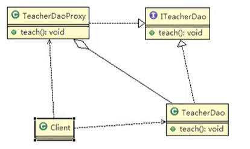
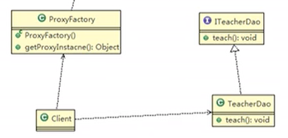
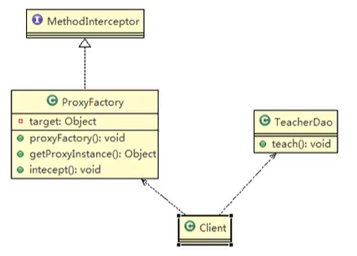
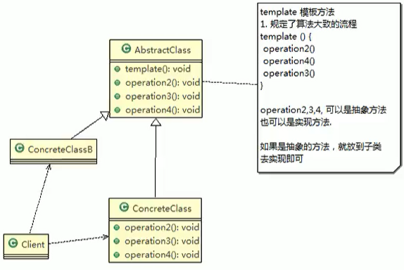
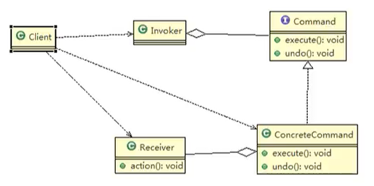
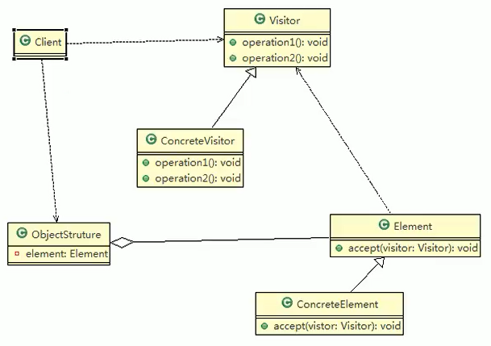
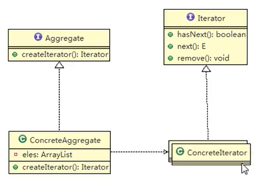
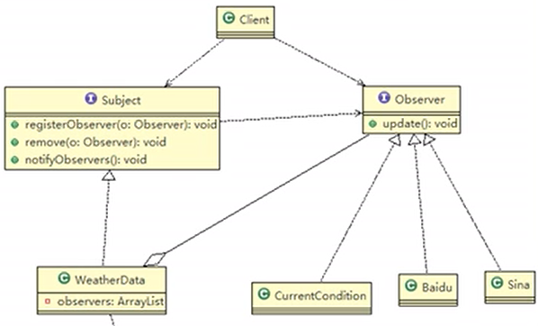

## 1、代理模式

- 代理模式：为一个对象提供一个替身，以控制对这个对象（被代理的对象）的访问。即通过代理对象访问目标对象。

- 这样做的好处是：可以在目标对象实现的基础上,增强额外的功能操作，即扩展目标对象的功能。

- 被代理的对象可以是远程对象、创建开销大的对象或需要安全控制的对象代理模式有不同的形式，主要有三种静态代理、动态代理（JDK代理或接口代理）和cglib代理（不需要实现接口，一种特殊的动态代理）。

- 静态代理：

  - 静态代理在使用时，需要定义接口或者父类，被代理对象(即目标对象)与代理对象一起实现相同的接口或者是继承相同父类。

  - 示例：培训机构代理老师进行教学。对外暴露的是培训机构，但是实际调用的是老师。

  - 类图：

    

  - 代码：

    ```java
    //代理对象和被代理对象都要实现teach接口
    public interface Teach {
        void doTeach();
    }
    
    //被代理对象
    public class Teacher implements Teach {
        @Override
        public void doTeach() {
            System.out.println("teacher-teach");
        }
    }
    
    //代理对象，聚合了被代理对象
    public class Train implements Teach {
        private Teach teach;
        public Train(Teach teach) {
            this.teach = teach;
        }
        @Override
        public void doTeach() {
            System.out.println("train-start");
            teach.doTeach();
            System.out.println("train-end");
        }
    }
    
    //使用
    Teacher teacher = new Teacher();
    Train train = new Train(teacher);
    train.doTeach();
    ```

  - 优点：在不修改目标对象的功能前提下，能通过代理对象对目标功能扩展。

  - 缺点：因为代理对象需要与目标对象实现一样的接口，所以会有很多代理类。一旦接口增加方法，目标对象与代理对象都要维护。

- 动态代理：

  - 代理对象不需要实现接口。但是目标对象（被代理的）要实现接口，否则不能用动态代理。

  - 代理对象的生成，是利用JDK的API，动态的在内存中构建代理对象。

  - JDK中生成代理对象的API：

    - 代理类所在包：java.lang.reflect.Proxy。
    - JDK实现代理只需要使用newProxyInstance方法,该方法需要接收三个参数。
    - 完整的写法是:
      `static Object newProxyInstance(ClassLoader loader, Class<?>[] interfaces,InvocationHandler h)`。
    - ClassLoader loader：指定当前目标对象使用的类加载器。
    - Class<?>[] interfaces：目标对象实现的接口类型，使用泛型。
    - InvocationHandler h：创建一个事件处理器。在通过代理对象调用方法时，会触发这个事件处理器方法。
    - method.invoke(被代理对象,被调用方法)：调用被代理对象的被调用方法。

  - 代理工厂类中，getProxyInstance方法，根据传入的被代理类，利用反射机制，返回被代理对象并聚合。调用这个对象的方法进行代理。

  - 类图：

    

  - 代码：

    ```java
    //Teach和Teacher与静态代理中相同
    
    //动态代理
    public class ProxyFactory {
        private Object object;
        public ProxyFactory(Object object) {
            this.object = object;
        }
        public Object getProxyInstance(){
            return Proxy.newProxyInstance(object.getClass().getClassLoader(),
                    object.getClass().getInterfaces(),
                    new InvocationHandler() {
                        @Override
                        public Object invoke(Object proxy, Method method, Object[] args) throws Throwable {
                            System.out.println("代理开始");
                            Object invoke = method.invoke(object, args);
                            System.out.println("代理结束");
                            return invoke;
                        }
                    });
        }
    }
    
    //使用
    Teach teach = new Teacher();
    Teach proxyInstance = (Teach) new ProxyFactory(teach).getProxyInstance();
    proxyInstance.doTeach();
    ```

- Cglib代理：

  - 静态代理和JDK代理模式都要求目标对象是实现一个接口，但是有时候目标对象只是一个单独的对象，并没有实现任何的接口，这个时候可使用目标对象子类来实现代理，这就是cglib代理。

  - Cglib代理也叫作子类代理，它是在内存中构建一个子类对象从而实现对目标对象功能扩展。

  - Cglib是一个强大的高性能的代码生成包，它可以在运行期扩展java类与实现java接口。

  - 在AOP编程中如何选择代理模式：

    - 目标对象需要实现接口，用JDK代理。
    - 目标对象不需要实现接口，用Cglib代理。

  - Cglib包的底层是通过使用字节码处理框架ASM来转换字节码并生成新的类。

  - 代理的类不能为final，否则报错。目标对象的方法如果为final/static，那么就不会被拦截，即不会执行目标对象额外的业务方法。

  - 类图：

    

  - 代码：

    - 代理工厂需要实现MethodInterceptor接口。

    ```java
    //被代理的类不再需要实现接口
    public class Teacher {
        public void doTeach() {
            System.out.println("teacher-teach");
        }
    }
    
    //Cglib代理
    public class CglibProxy implements MethodInterceptor {
        private Object object;
        public CglibProxy(Object object) {
            this.object = object;
        }
        //返回一个代理对象
        public Object getProxyInstance() {
            //1、创建工具类
            Enhancer enhancer = new Enhancer();
            //2、设置父类
            enhancer.setSuperclass(object.getClass());
            //3、创建回调
            enhancer.setCallback(this);
            //4、返回子类
            return enhancer.create();
        }
        //拦截器，类似之前的InvocationHandler
        @Override
        public Object intercept(Object o, Method method, Object[] args, MethodProxy methodProxy) throws Throwable {
            System.out.println("cglib-start");
            Object invoke = method.invoke(object, args);
            System.out.println("cglib-end");
            return invoke;
        }
    }
    
    //使用
    Teacher teacher = new Teacher();
    Teacher cglibProxy = (Teacher) new CglibProxy(teacher).getProxyInstance();
    cglibProxy.doTeach();
    ```

- 代理模式的变体：

  - 防火墙代理。
  - 缓存代理。
  - 远程代理。
  - 同步代理。


## 2、模板模式

- 示例：

  - 制作豆浆，需要一系列的流程。
  - 不同的材料产出不同的豆浆，但是流程是相同的。

- 模板方法模式(Template Method Pattern)，又叫模板模式(Template Pattern)，在一个抽象类公开定义了执行它的方法的模板。它的子类可以按需要重写方法实现，但调用将以抽象类中定义的方式进行。

- 模板方法模式定义一个操作中的算法的骨架，而将一些步骤延迟到子类中，使得子类可以不改变一个算法的结构，就可以重定义该算法的某些特定步骤。

- 流程和共用的部分在抽象类中实现，具体特有的在子类中实现。

- 角色：

  - AbstractClass，抽象类，确定了方法实现的骨架，具体的需要子类实现。
  - ConcreteClass，继承抽象类的子类，根据子类的特点，分别实现抽象方法。

- 类图：

  

- 代码：

  ```java
  //抽象类
  public abstract class AbstractClass {
      //保证模板不被子类覆盖
      public final void template(){
          operation1();
          operation2();
          operation3();
      }
      public abstract void operation1();
      public abstract void operation2();
      public void operation3(){
          System.out.println("father-step3");
      }
  }
  
  //子类
  public class ConcreteClass extends AbstractClass {
      @Override
      public void operation1() {
          System.out.println("son-step1");
      }
  
      @Override
      public void operation2() {
          System.out.println("son-step2");
      }
  }
  
  //使用
  AbstractClass temp = new ConcreteClass();
  temp.template();
  ```

- 钩子方法：

  - 在模板方法模式的父类中，我们可以定义一个方法，它默认不做任何事，子类可以视情况要不要覆盖它，该方法称为“钩子”。
  -  钩子可以在定义时就挂着东西（父类可有实现），可以在后来看情况挂上别的东西（子类可重写），也可以总是不挂任何东西（父类中无实现，并且子类中未重写或重写无实现）。

- 源码分析：

  - Spring中的IOC容器初始化时用到了模板方法模式。
  - AbstractApplicationContext中的refresh()方法就是一个模板方法。

- 注意事项：

  - 基本思想是：算法只存在于一个地方，也就是在父类中，容易修改。需要修改算法时，只要修改父类的模板方法或者已经实现的某些步骤，子类就会继承这些修改。
  - 实现了最大化代码复用。父类的模板方法和已实现的某些步骤会被子类继承而直接使用。
  - 既统一了算法，也提供了很大的灵活性。父类的模板方法确保了算法的结构保持不变，同时由子类提供部分步骤的实现。
  - 该模式的不足之处：每一个不同的实现都需要一个子类实现，导致类的个数增加，使得系统更加庞大。
  - 一般模板方法都加上final关键字，防止子类重写模板方法。
  - 模板方法模式使用场景：当要完成在某个过程，该过程要执行一系列步骤，这一系列的步骤基本相同，但其个别步骤在实现时可能不同，通常考虑用模板方法模式来处理。


## 3、命令模式

- 示例：

  - 有一套智能家电，需要不同厂商的APP进行控制。
  - 希望不同厂家提供接口，用一个APP实现控制。
  - 将动作好请求者和执行者解耦。

- 命令模式(Command Pattern)：在软件设计中，我们经常需要向某些对象发送请求，但是并不知道请求的接收者是谁，也不知道被请求的操作是哪个，我们只需在程序运行时指定具体的请求接收者即可，此时，可以使用命令模式来进行设计。

- 命令模式使得请求发送者与请求接收者消除彼此之间的耦合，让对象之间的调用关系更加灵活，实现解耦。

- 在命令模式中，会将一个请求封装为一个对象，以便使用不同参数来表示不同的请求(即命令)，同时命令模式也支持可撤销的操作。

- 通俗易懂的理解：将军发布命令，士兵去执行。其中：将军（命令发布者）、士兵（命令的具体执行者）、命令(连接将军和士兵)。

- 角色：

  - 命令的调用者Invoker，持有具体命令对象。
  - 命令的接收者Receiver，包括接收到命令后的具体行为。
  - 命令接口Command，包括命令的执行和撤销方法。
  - 具体命令ConcreteCommand，实现了命令接口，持有命令的接收者对象。

- 类图：

  

- 代码：

  ```java
  //命令接口
  public interface Command {
      void execute();
      void undo();
  }
  
  //命令接收者，电灯
  public class Light {
      public void on(){
          System.out.println("light-on");
      }
      public void off(){
          System.out.println("light-off");
      }
  }
  
  //开灯命令
  public class LightOn implements Command {
      private Light light;
      public LightOn(Light light) {
          this.light = light;
      }
      @Override
      public void execute() {
          light.on();
      }
      @Override
      public void undo() {
          light.off();
      }
  }
  
  //关灯命令
  public class LightOff implements Command {
      private Light light;
      public LightOff(Light light) {
          this.light = light;
      }
      @Override
      public void execute() {
          light.off();
      }
      @Override
      public void undo() {
          light.on();
      }
  }
  
  //空命令，可用于初始化等
  public class NoCommand implements Command {
      @Override
      public void execute() {
  
      }
      @Override
      public void undo() {
  
      }
  }
  
  //命令的调用者
  public class Invoker {
      private Command[] onCommands;
      private Command[] offCommands;
      private Command undoCommand;
      public Invoker() {
          this.onCommands = new Command[5];
          this.offCommands = new Command[5];
          this.undoCommand = new NoCommand();
          for (int i = 0; i < 5; i++) {
              onCommands[i] = new NoCommand();
              offCommands[i] = new NoCommand();
          }
      }
      public void setCommands(int no, Command onCommand, Command offCommand) {
          onCommands[no] = onCommand;
          offCommands[no] = offCommand;
      }
      public void pushOn(int no){
          onCommands[no].execute();
          undoCommand = onCommands[no];
      }
      public void pushOff(int no){
          offCommands[no].execute();
          undoCommand = offCommands[no];
      }
      public void undo(){
          undoCommand.undo();
          undoCommand = new NoCommand();
      }
  }
  
  //使用
  Invoker invoker = new Invoker();
  Light light = new Light();
  invoker.setCommands(0, new LightOn(light), new LightOff(light));
  invoker.pushOn(0);
  invoker.pushOff(0);
  invoker.undo();
  ```

- 源码分析：

  - Spring中的JdbcTemplate用到了命令模式。
  - StatementCallback类似于命令接口。
  - 内部类QueryStatementCallback类似于具体命令实现和命令接收者。
  - JdbcTemplate是命令的调用者，通过exexcute()方法调用了具体命令实现。

- 注意事项：
  - 将发起请求的对象与执行请求的对象解耦。发起请求的对象是调用者，调用者只要调用命令对象的execute()方法就可以让接收者工作，而不必知道具体的接收者对象是谁、是如何实现的，命令对象会负责让接收者执行请求的动作，也就是说：”请求发起者”和“请求执行者”之间的解耦是通过命令对象实现的，命令对象起到了纽带桥梁的作用。
  - 容易设计一个命令队列。只要把命令对象放到列队，就可以多线程的执行命令容易实现对请求的撤销和重做。
  - 命令模式不足：可能导致某些系统有过多的具体命令类，增加了系统的复杂度，这点在在使用的时候要注意。
  - 空命令也是一种设计模式，它为我们省去了判空的操作。
  - 命令模式经典的应用场景：界面的一个按钮都是一条命令、模拟CMD(DOS命令)订单的撤销/恢复、触发-反馈机制。


## 4、访问者模式

- 示例：
  - 将观众分为男女，对参赛歌手进行评价，包括成功或失败。
  - 可以将男女都继承于抽象的Person接口。
  - 如果要增加一种评价或者观众种类，代码扩展性差。

- 访问者模式(Visitor Pattern)，封装一些作用于某种数据结构的各元素的操作，它可以在不改变数据结构的前提下定义作用于这些元素的新的操作。
- 主要将数据结构与数据操作分离，解决数据结构和操作耦合性问题。
- 访问者模式的基本工作原理是：在被访问的类里面加一个对外提供接待访问者的方法接口。
- 访问者模式主要应用场景是：需要对一个对象结构中的对象进行很多不同操作(这些操作彼此没有关联)，同时需要避免让这些操作"污染"这些对象的类，可以选用访问者模式解决。
- 角色：
  - 抽象访问者Visitor，其中定义了访问不同被访问者的抽象方法。
  - 具体访问者ConcreteVisitor，实现了进行访问的抽象方法。
  - 抽象被访问者Element，有一个方法用于接收访问者类型。
  - 具体被访问者ConcreteElement，实现具体的接受访问者方法。
  - 对象数据结构ObjectStructure，聚合了被访问者的集合。

- 类图：

  

- 代码：

  - 双分派是指不管类怎么变化，我们都能找到期望的方法运行。双分派意味着得到执行的操作取决于请求的种类和接收者的类型。
  - 双分派可在ObjectStructure中的dsiplay方法中看到。遍历People，比如其中一个对象是Man（即接收者的类型）。Man被调用accpet()接收一种类型的访问者（即请求的类型），比如Success，这是第一次分派。在accpet()方法中，调用访问者的getManResult方法，同时将自己this作为参数传入，是第二次分派。
  - 双分派保证了，如果需要新增一个请求种类（具体访问者），只需要将其传入dsiplay方法即可。不需要对被访问者作出修改，因为双分派导致accept调用的总是其对应的方法。

  ```java
  //抽象和具体被访问者
  public abstract class Person {
      public abstract void accept(Visitor visitor);
  }
  
  public class Man extends Person {
      @Override
      public void accept(Visitor visitor) {
          visitor.getManResult(this);
      }
  }
  
  //抽象和具体访问者
  public abstract class Visitor {
      public abstract void getManResult(Man man);
      public abstract void getWomanResult(Woman woman);
  }
  
  public class Success extends Visitor {
      @Override
      public void getManResult(Man man) {
          System.out.println("man:success");
      }
      @Override
      public void getWomanResult(Woman woman) {
          System.out.println("woman:success");
      }
  }
  
  //对象数据结构
  public class ObjectStructure {
      private List<Person> people = new LinkedList<>();
      public void attach(Person person) {
          people.add(person);
      }
      public void delete(Person person) {
          people.remove(person);
      }
      public void display(Visitor visitor) {
          for (Person person : people) {
              person.accept(visitor);
          }
      }
  }
  
  //使用
  ObjectStructure os = new ObjectStructure();
  os.attach(new Man());
  os.attach(new Woman());
  os.display(new Success());
  ```

- 注意事项：

  - 优点：
    - 访问者模式符合单一职责原则、让程序具有优秀的扩展性、灵活性非常高。
    - 访问者模式可以对功能进行统一，可以做报表、UI、拦截器与过滤器，适用于数据结构相对稳定的系统。
  - 缺点：
    - 具体元素对访问者公布细节，也就是说访问者关注了其他类的内部细节，这是迪米特法则所不建议的,这样造成了具体元素（指被访问者）变更比较困难。
    - 违背了依赖倒转原则。访问者依赖的是具体元素，而不是抽象元素。
    - 因此，如果一个系统有比较稳定的数据结构，又有经常变化的功能需求，那么访问者模式就是比较合适的。


## 5、迭代器模式

- 示例：

  - 还是展示学校学院和和系（之前组合模式的例子），如何去遍历。
  - 比如系以集合方式放在学院中，学院用数组方法放在学校中。

- 迭代器模式( lterator Pattern）：提供一种遍历集合元素的统一接口，用一致的方法遍历集合元素，不需要知道集合对象的底层表示，即不暴露其内部的结构。

- 如果我们的集合元素是用不同的方式实现的，有数组，还有java的集合类，或者还有其他方式，当客户端要遍历这些集合元素的时候就要使用多种遍历方式，而且还会暴露元素的内部结构，可以考虑使用迭代器模式解决。
  迭代器模式。

- 角色：

  - 迭代器接口Iterator，系统提供，有hasNext、next、remove方法。
  - 具体的迭代器，实现迭代功能。
  - 聚合接口Aggregate。
  - 具体的聚合接口，持有被遍历的集合。提供一个方法，返回具体的迭代器。

- 类图：

  

- 代码：

  ```java
  //具体的迭代器
  public class CSIterator implements Iterator {
      Department[] departments;
      int position = 0;   //索引
      public CSIterator(Department[] departments) {
          this.departments = departments;
      }
      @Override
      public boolean hasNext() {
          if (position>=departments.length || departments[position]==null){
              return false;
          } else {
              return true;
          }
      }
      @Override
      public Department next() {
          position += 1;
          return departments[position-1];
      }
  }
  
  public class EEIterator implements Iterator {
      List<Department> departments;
      int index = -1;   //索引
      public EEIterator(List<Department> departments) {
          this.departments = departments;
      }
      @Override
      public boolean hasNext() {
          if (index>=departments.size()-1) {
              return false;
          } else {
              index += 1;
              return true;
          }
      }
      @Override
      public Department next() {
          return departments.get(index);
      }
  }
  
  //聚合接口
  public interface College {
      String getName();
      void addDepartment(String name);
      Iterator createIterator();
  }
  
  //聚合实现
  public class CSCollege implements College {
      Department[] departments;
      int num = 0;    //个数
      public CSCollege(int size) {
          this.departments = new Department[size];
      }
      @Override
      public String getName() {
          return "CS";
      }
      @Override
      public void addDepartment(String name) {
          departments[num] = new Department(name);
          num += 1;
      }
      @Override
      public Iterator createIterator() {
          return new CSIterator(departments);
      }
  }
  
  public class EECollege implements College {
      List<Department> departments;
      public EECollege() {
          this.departments = new ArrayList<>();
      }
      @Override
      public String getName() {
          return "EE";
      }
      @Override
      public void addDepartment(String name) {
          departments.add(new Department(name));
      }
      @Override
      public Iterator createIterator() {
          return new EEIterator(departments);
      }
  }
  
  //调用
  public class University {
      List<College> colleges;
      public University(List<College> colleges) {
          this.colleges = colleges;
      }
      public void printCollege() {
          for (College college : colleges) {
              System.out.println(college);
              printDepartment(college);
          }
      }
      public void printDepartment(College college) {
          Iterator iterator = college.createIterator();
          while (iterator.hasNext()) {
              System.out.println(((Department)iterator.next()).getName());
          }
      }
  }
  List<College> colleges = new ArrayList<>();
  CSCollege csCollege = new CSCollege(3);
  csCollege.addDepartment("Java");
  csCollege.addDepartment("Python");
  csCollege.addDepartment("PHP");
  colleges.add(csCollege);
  EECollege eeCollege = new EECollege();
  eeCollege.addDepartment("FPGA");
  eeCollege.addDepartment("Arduino");
  colleges.add(eeCollege);
  University university = new University(colleges);
  university.printCollege();
  ```

- 源码分析：

  - JDK中的ArrayList中用到了迭代器模式。
  - List接口相当于聚合接口，ArrayList相当于聚合实现。迭代器实现iter是ArrayList的内部类。

- 注意事项：

  - 优点：
    - 提供一个统一的方法遍历对象，客户不用再考虑聚合的类型，使用一种方法就可以遍历对象了。
    - 隐藏了聚合的内部结构，客户端要遍历聚合的时候只能取到迭代器，而不会知道聚合的具体组成。
    - 提供了一种设计思想，就是一个类应该只有一个引起变化的原因（叫做单一责任原则)。在聚合类中，我们把迭代器分开，就是要把管理对象集合和遍历对象集合的责任分开，这样一来集合改变的话，只影响到聚合对象。而如果遍历方式改变的话，只影响到了迭代器。
    - 当要展示一组相似对象，或者遍历一组相同对象时使用，适合使用迭代器模式。
  - 缺点：
    - 每个聚合对象都要一个迭代器，会生成多个迭代器不好管理类。


## 6、观察者模式

- 示例：
  - 气象站每天发布气象数据，需要设计API便于的三分接入获取数据。如果数据发生变化，也要实时改变。
  - 把气象数据封装为一个对象，并且提供获取数据和改变数据的方法。

- 观察者模式（Observer pattern），是对象之间多对一依赖的一种设计方案，被依赖的对象为Subject（一的一方），依赖的对象为Observer（多的一方），subject通知Observer变化。即通过类似于订阅-发布模式来实现对对象的观察。

- 角色：

  - 主题接口Subject，发布数据。包括注册观察者、移除观察者和通知观察者的方法。
  - 主题实现类，实现Subject中的相关方法，其中聚合了许多观察者。
  - 观察者接口Observer，接收更新的数据输入。
  - 观察者实现。

- 类图：

  

- 代码：

  ```java
  //主题接口
  public interface Subject {
      void registerObserver(Observer o);
      void removeObserver(Observer o);
      void notifyObservers();
  }
  
  //主题实现
  public class WeatherData implements Subject {
      private List<Observer> list;
      private float dataA;
      private float dataB;
      public WeatherData() {
          this.list = new ArrayList<>();
      }
      public void setData(float dataA, float dataB) {
          this.dataA = dataA;
          this.dataB = dataB;
          notifyObservers();
      }
      @Override
      public void registerObserver(Observer o) {
          list.add(o);
      }
      @Override
      public void removeObserver(Observer o) {
          list.remove(o);
      }
      @Override
      public void notifyObservers() {
          for (Observer observer : list) {
              observer.update(dataA,dataB);
          }
      }
  }
  
  //观察者接口
  public interface Observer {
      void update(float dataA, float dataB);
  }
  
  //观察者实现
  public class CurrentCondition implements Observer {
      privatWeatherData weatherData = new WeatherData();
          CurrentCondition condition = new CurrentCondition();
          weatherData.registerObserver(condition);
          weatherData.setData(10.1F,17.3F);e float dataA;
      private float dataB;
      @Override
      public void update(float dataA, float dataB) {
          this.dataA = dataA;
          this.dataB = dataB;
          display();
      }
      public void display() {
          System.out.println(this+"dataA:"+dataA);
          System.out.println(this+"dataB:"+dataB);
      }
  }
  
  //使用
  WeatherData weatherData = new WeatherData();
  CurrentCondition condition = new CurrentCondition();
  weatherData.registerObserver(condition);
  weatherData.setData(10.1F,17.3F);
  ```

- 源码分析：
  - JDK中的Observable中使用了观察者模式。
  - Observable类似于主题接口，Observer类似于观察者接口。

- 注意事项：
  - 观察者模式设计后，会以集合的方式来管理用户(Observer)，包括注册，移除和通知。
  - 这样，增加观察者(这里可以理解成一个新的公告板)，就不需要去修改核心类，遵守了ocp原则。


