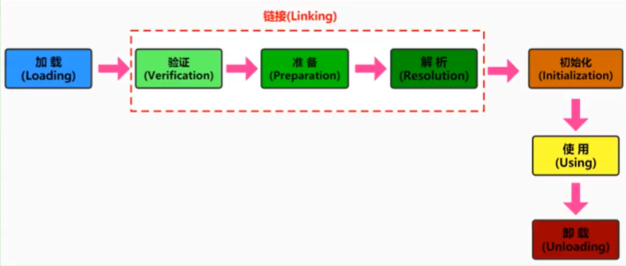
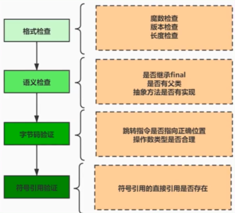
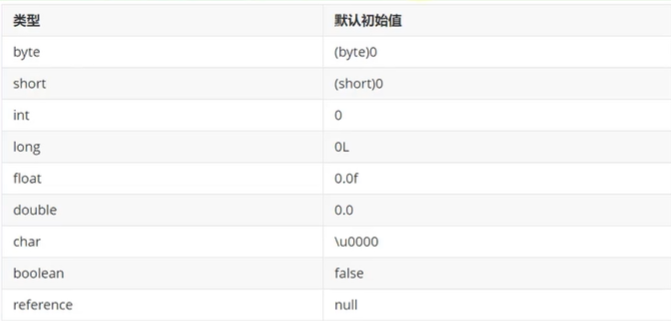
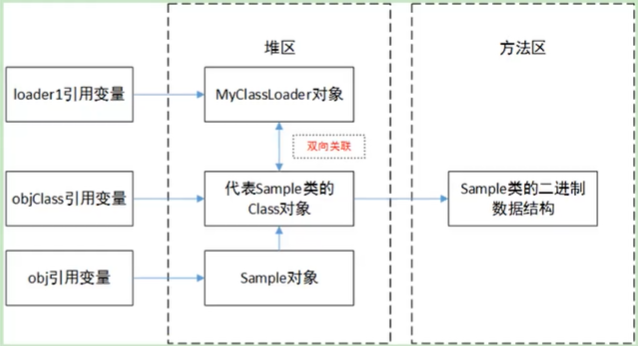
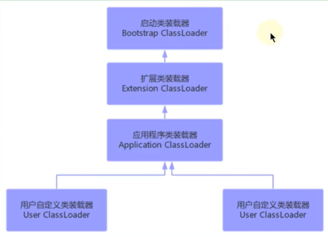
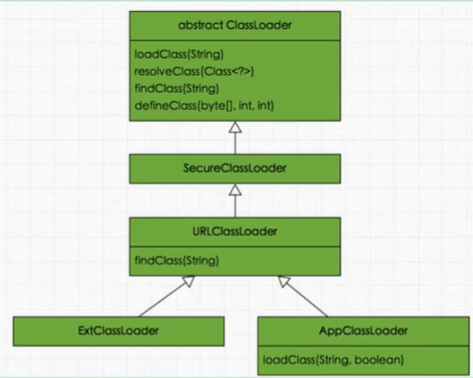

## 1、类的加载过程

- 在Java中数据类型分为基本数据类型和引用数据类型。基本数据类型由虚拟机预先定义，引用数据类型则需要进行类的加载。

- 按照Java虚拟机规范，从c1ass文件到加载到内存中的类，到类卸载出内存为止，它的整个生命周期包括如下7个阶段：

  

- 阶段1：加载阶段（Loading）：
  - 加载的理解：
    - 所谓加载，简而言之就是将Java类的字节码文件加载到机器内存中，并在内存中构建出Java类的原型——类模板对象。
    - 所谓类模板对象，其实就是Java类在]VM内存中的一个快照，JVM将从字节码文件中解析出的常量池、类字段、类方法等信息存储到类模板中，这样JVM在运行期便能通过类模板而获取Java类中的任意信息，能够对Java类的成员变量进行遍历，也能进行Java方法的调用。
    - 反射的机制即基于这一基础。如果JVM没有将Java类的声明信息存储起来，则JVM在运行期也无法反射。
  - 加载完成的操作：
    - 加载阶段，简言之，查找并加载类的二进制数据，生成Class的实例。
    - 在加载类时，Java虚拟机必须完成以下3件事情：
      - 通过类的全名，获取类的二进制数据流。
      - 解析类的二进制数据流为方法区内的数据结构（Java类模型）。
      - 创建java.lang.Class类的实例，表示该类型。作为方法区这个类的各种数据的入口。
  - 二进制流的获取方式：
    - 对于类的二进制数据流，虚拟机可以通过多种途径产生或获得。（只要所读取的字节码符合JVM规范即可）
    - 虚拟机可能通过文件系统读入一个class后缀的文件（最常见）
    - 读入jar、zip等归档数据包，提取类文件。
    - 事先存放在数据库中的类的二进制数据
    - 使用类似于HTTP之类的协议通过网络进行加教I
    - 在运行时生成一段Class的二进制信息等
    - 在获取到类的二进制信息后，Java虚拟机就会处理这些数据，并最终转为一个java.lang.Class的实例。
    - 如果输入数据不是ClassFile的结构，则会抛出ClassFormatError。
  - 类模板与Class实例的位置：
    - 类模的位置：
      - 加载的类在JVM中创建相应的类结构，类结构会存储在方法区（JDK1.8之前：永久代；JDK1.8及之后：元空间）。
    - 与Class实例的位置：
      - 类将.class文件加载至元空间后，会在堆中创建一个Java.lang.Class对象，用来封装类位于方法区内的数据结构，该class对象是在加载类的过程中创建的，每个类都对应有一个class类型的对象。
      - 外部可以通过访问代表Order类的Class对象来获取Order的类数据结构。
    - Class类的构造方法是私有的，只有JVM能够创建。
    - java.lang.Class实例是访问类型元数据的接口，也是实现反射的关键数据、入口。通过Class类提供的接口，可以获得目标类所关联的.class文件中具体的数据结构：方法、字段等信息。
  - 数组类的加载：
    - 创建数组类的情况稍微有些特殊，因为数组类本身并不是由类加载器负责创建，而是由JVM在运行时根据需要而直接创建的，但数组的元素类型仍然需要依靠类加载器去创建。创建数组类（下述简称A）的过程：
      - 如果数组的元素类型是引用类型，那么就遵循定义的加载过程递归加载和创建数组A的元素类型；
      - JVM使用指定的元素类型和数组维度来创建新的数组类。
    - 如果数组的元素类型是引用类型，数组类的可访问性就由元素类型的可访问性决定。否则数组类的可访问性将被缺省定义为public。

- 阶段2：链接阶段（Linking）：

  - 验证阶段（Verification）：

    - 当类加载到系统后，就开始链接操作，验证是链接操作的第一步。
    - 它的目的是保证加载的字节码是合法、合理并符合规范的。

    

    - 其中格式验证会和加载阶段一起执行。验证通过之后，类加载器才会成功将类的二进制数据信息加载到方法区中。
    - 格式验证之外的验证操作将会在方法区中进行。
    - 链接阶段的验证虽然拖慢了加载速度，但是它避免了在字节码运行时还需要进行各种检查。

  - 准备阶段（Preparation）：

    - 简言之，为类的静态变量分配内存，并将其初始化为默认值。

    

    - 这里不包含基本数据类型的字段用static final修饰（常量）的情况，因为final在编译的时候就会分配了，准备阶段会显式赋值。
    - 这里不会为实例变量分配初始化，类变量会分配在方法区中，而实例变量是会随着对象一起分配到Java堆中。
    - 在这个阶段并不会像初始化阶段中那样会有初始化或者代码被执行。
    - 如果使用字面量的方式定义一个字符的常量的话，也是在准备环节直接进行显示赋值（使用new的方式不会）。

  - 解析阶段（Resolution）：
  
    - 将类、接口、字和方法的符号引用转为直接引用。
    - 符号引用就是一些字面量的引用，和虚拟机的内部数据结构和和内存布局无关。比较容易理解的就是在Class类文件中，通过常量池进行了大量的符号引用。但是在程序实际运行时，只有符号引用是不够的，方法被调用时，系统需要明确知道该方法的位置。所谓解析就是将符号引用转为直接引用，也就是得到类、字段、方法在内存中的指针或者偏移量。
    - 以方法为例，Java虚拟机为每个类都准备了一张方法表，将其所有的方法都列在表中，当需要调用一个类的方法的时候，只要知道这个方法在方法表中的偏移量就可以直接调用该方法。通过解析操作，符号引用就可以转变为目标方法在类中方法表中的位置，从而使得方法被成功调用。
    - 如果直接引用存在，那么可以肯定系统中存在该类、方法或者字段。但只存在符号引用，不能确定系统中一定存在该结构。
    - Java虚拟机规范并没有明确要求解析阶段一定要按照顺序执行。在HotSpot VM中，加载、验证、准备和初始化会按照顺序执行，但链接阶段中的解析操作往往会伴随着JVM在执行完初始化之后再执行。
  
- 阶段3：初始化阶段（Initialization）：

  - 为类的静态变量予正确的初始值。

  - 类的初始化是类装载的最后一个阶段。如果前面的步骤都没有问题，那么表示类可以顺利装载到系统中。此时，类才会开始执行Java字节码。（即：到了初始化阶段，才真正开始执行类中定义的Java程序代码。）

  - 初始化阶段的重要工作是执行类的初始化方法：`<clinit>()`方法。

    - 该方法仅能由Java编译器生成并由JVM调用，程序开发者无法自定义一个同名的方法，更无法直接在Java程序中调用该方法，虽然该方法也是由字节码指令所组成。
    - 它是由类静态成员变量的赋值语句以及static语句块合并产生的。

  - 在加载一个类之前，虚拟机总是会试图加载该类的父类，因此父类的<clinit>总是在子类<clinit>之前被调用。也就是说，父类的static块优先级高于子类。

  - 不会生成<clinit>方法的情况：

    - 一个类中并没有声明任何的类变量，也没有静态代码块时。
    - 一个类中声明类变量，但是没有明确使用类变量的初始化语句以及静态代码块来执行初始化操作时。
    - 一个类中包含static final修饰的基本数据类型的字段，这些类字段初始化语句采用编译时常量表达式。

  - <clinit>方法中的赋值：

    - 链接阶段的准备环节的赋值主要包括：
      - 对于基本数据类型或者String，使用static final修饰，并且是显式赋值（而非调用方法或构造器）。
    - 除此之外，都是在<clinit>方法中赋值。
      - 比如static final修饰的int，但是是由调用方法返回值赋值的。
      - 比如static final修饰的，new出的String。
      - 其他static修饰的字段。

  - <clinit>方法的线程安全性：

    - 虚拟机会保证一个类的<c1init>方法在多线程环境中被正确地加锁、同步，如果多个线程同时去初始化一个类，那么只会有一个线程去执行这个类的<clinit>方法，其他线程都需要阻塞等待，直到活动线程执行<clinit>方法完毕。
    - 没有显式的使用synchronized，是隐式锁。
    - 正是因为函数<c1init>带锁线程安全的，因此，如果在一个类的<clinit>方法中有耗时很长的操作，就可能造成多个线程阻塞，引发死锁。并且这种死锁是很难发现的，因为看起来它们并没有可用的锁信息。
    - 如果之前的线程成功加载了类，则等在队列中的线程就没有机会再执行<c1init>方法了。那么，当需要使用这个类时，虚拟机会直接返回给它已经准备好的信息。

  - 类的主动和被动使用：

    - 主动使用会调用<c1init>方法（执行初始化阶段），被动使用不会调用<c1init>方法。

    - 主动使用包括：

      1.当创建一个类的实例时，比如使用new关键字，或者通过反射、克隆、反序列化。
      2.当调用类的静态方法时，即当使用了字节码invokestatic指令。
      3.当使用类、接口的静态字段时（不包括显式赋值的static final）。
      4.当使用java.lang.reflect包中的方法反射类的方法时。比如：Class.forName（"com.atguigu.java.Test"）
      5.当初始化子类时，如果发现其父类还没有进行过初始化，则需要先触发其父类的初始化。
      6.如果一个接口定义了default方法，那么直接实现或者间接实现该接口的类的初始化，该接口要在其之前被初始化。
      7.当虚拟机启动时，用户需要指定一个要执行的主类（包含main()方法的那个类），虚拟机会先初始化这个主类。
      8.当初次调用MethodHandle实例时，初始化该MethodHandle指向的方法所在的类。（涉及解析REF_getStatic、REF_putStatic、REF_invokeStatic方法句柄对应的类）

    - 类的被动使用：

      - 并不是在代码中出现的类，一般都会被加载，但不一定会被初始化。如果不符合主动使用的条件，类就不会初始化。

      1.当访问一个静态字段时，只有真正声明这个字段的类才会被初始化。当通过子类引用父类的静态变量，不会导致子类初始化
      2.通过数组定义类引用，不会触发此类的初始化
      3.引用常量不会触发此类或接口的初始化。因为常量在链接阶段就已经被显式赋值了。
      4.调用ClassLoader类的loadclass()方法加载一个类，并不是对类的主动使用，不会导致类的初始化。

  - 当Java虚拟机初始化一个类时，要求它的所有父类都已经被初始化，但是这条规则并不适用于接口。

    - 在初始化一个类时，并不会先初始化它所实现的接口。
    - 在初始化一个接口时，并不会先初始化它的父接口。
    - 因此，一个父接口并不会因为它的子接口或者实现类的初始化而初始化。只有当程序首次使用特定接口的静态字段时，才会导致该接口的初始化。
    - 如果该接口定义了default方法则不同。

- 阶段4：使用阶段（using）：
  - 可以在程序中访问和调用它的静态类成员信息（比如：静态字段、静态方法），或者使用new关键字为其创建对象实例。

- 阶段5：卸载阶段（Unloading）：

  - 类、类的加载器、类的实例之间的引用关系：

    - 在类加载器的内部实现中，用一个Java集合来存放所加载类的引用。
    - 另一方面，一个Class对象总是会引用它的类加载器，调用class对象的getclassLoader()方法，就能获得它的类加载器。
    - 由此可见，代表某个类的Class实例与其类的加载器之间为双向关联关系。
    - 一个类的实例总是引用代表这个类的Class对象。在object类中定义了getclass()方法，这个方法返回代表对象所属类的Class对象的引用。
    - 此外，所有的Java类都有一个静态属性class，它引用代表这个类的Class对象。

    

    - loader1引用了类加载器，objClass引用了类模板的Class对象，obj引用了类模板的实例。

  - 类的生命周期：

    - 当Sample类被加载、链接和初始化后，它的生命周期就开始了。当代表Sample类的Class对象不再被引用，即不可触及时，class对象就会结束生命周期，Sample类在方法区内的数据也会被卸载，从而结束Sample类的生命周期。
    - 一个类何时结束生命周期，取决于代表它的Class对象何时结束生命周期。

  - 判断方法区中的类模板可以被回收：

    - 该类所有的实例都已经被回收。也就是Java堆中不存在该类及其任何派生子类的实例。
    - 加载该类的类加载器已经被回收。这个条件除非是经过精心设计的可替换类加载器的场景，通常是很难达成的。
    - 该类对应的java.lang.Class对象没有在任何地方被引用，无法在任何地方通过反射访问该类的方法。

## 2、类的加载器

- 类加载器是JVM执行类加载机制的前提。
- ClassLoader的作用：
  - ClassLoader是Java的核心组件，所有的Class都是由classLoader进行加载的。
  - ClassLoader负责通过各种方式将Class信息的二进制数据流读入VM内部，转换为一个与目标类对应的java.lang.Class对象实例。然后交给Java虚拟机进行链接、初始化等操作。
  - 因此，ClassLoader在整个装载阶段，只能影响到类的加载，而无法通过ClassLoader去改变类的链接和初始化行为。至于它是否可以运行，则由Execution Engine决定。
- 类的显式加载和隐式加载：
  - class文件的显式加载与隐式加载的方式是指JVM加载class文件到内存的方式。
  - 显式加载指的是在代码中通过调用ClassLoader加载class对象，如直接使用Class.forNane（name）或this.getClass().getClassLoader().loadClass()加载class对象。
  - 隐式加载则是不直接在代码中调用ClassLoader的方法加载class对象，而是通过虚拟机自动加载到内存中，如在加载某个类的class文件时，该类的class文件中引用了另外一个类的对象，此时额外引用的类将通过JVM自动加载到内存中。

- 类的唯一性：
  - 对于任意一个类，都需要由加载它的类加载器和这个类本身一同确认其在Java虚拟机中的唯一性。
  - 每一个类加载器，都拥有一个独立的类名称空间：比较两个类是否相等，只有在这两个类是由同一个类加载器加载的前提下才有意义。否则，即使这两个类源自同一个Class文件，被同一个虚拟机加载，只要加载他们的类加载器不同，那这两个类就必定不相等。

- 类加载器的命名空间：

  - 每个类加载器都有自己的命名空间，命名空间由该加载器及所有的父加载器所加载的类组成。
  - 在同一命名空间中，不会出现类的完整名字（包括类的包名）相同的两个类。
  - 在不同的命名空间中，有可能会出现类的完整名字（包括类的包名）相同的两个类。
  - 在大型应用中，我们往往借助这一特性，来运行同一个类的不同版本。

- 类加载机制的三个基本特征：

  - 双亲委派模型。但不是所有类加载都遵守这个模型，有的时候，启动类加载器所加载的类型，是可能要加载用户代码的，比如上下文加载器。
  - 可见性，子类加载器可以访问父加载器加载的类型，但是反过来是不允许的。不然，因为缺少必要的隔离，我们就没有办法利用类加载器去实现容器的逻辑。
  - 单一性，由于父加载器的类型对于子加载器是可见的度所以父加载器中加载过的类型，就不会在子加载器中重复加载。但是注意，类加载器“邻居”间，同一类型仍然可以被加载多次，因为互相并不可见。

- 类的加载器的分类：

  - JVM支持两种类型的类加载器，分别为引导类加载器（Bootstrap ClassLoader）和自定义类加裁器（User-Defined ClassLoader）。

  - 从概念上来讲，自定义类加载器一般指的是程序中由开发人员自定义的一类类加载器，但是Java虚拟机规范却没有这么定义，而是将所有派生于抽象类ClassLoader的类加载器都划分为自定义类加载器。

  - 最常见的类加载器结构主要是如下情况：

    

  - 除了顶层的启动类加载器外，其余的类加载器都应当有自己的“父类”加载器。

  - 不同类加载器看似是继承关系，实际上是包含关系。在下层加载器中，包含着上层加载器的引用。

  - 启动类加载器（引导类加载器，Bootstrap ClassLoader）：

    * 这个类加载使用C/C++语言实现的，嵌套在JVM内部。
    * 它用来加载Java的核心库（JAVA_HOME/jre/lib/rt.jar或sun.boot.class.path路径下的内容）。用于提供JVM自身需要的类。
    * 并不继承自java.lang.ClassLoader，没有父加载器。
    * 出于安全考虑，Bootstrap启动类加载器只加载包名为java、javax、sun等开头的类。
    * 加载扩展类和应用程序类加载器，并指定为他们的父类加载器。

  - 扩展类加载器（Extension ClassLoader）：

    - Java语言编写，由sun.misc.Launcher$ExtClassLoader实现。
    - 继承于ClassLoader类，父类加载器为启动类加载器。
    - 从java.ext.dirs系统属性所指定的目录中加载类库，或从JDK的安装目录的jre/lib/ext子目录下加载类库。如果用户创建的JAR放在此目录下，也会自动由扩展类加载器加载。

  - 应用程序类加载器（系统类加载器，AppClassLoader）：

    - java语言编写，由sun.misc.LaunchergappClassLoader实现。
    - 继承于ClassLoader类，父类加载器为扩展类加载器。
    - 它负责加载环境变量classpath或系统属性java.class.path 指定路径下的类库。
    - 应用程序中的类加载器默认是系统类加载器。
    - 它是用户自定义类加载器的默认父加载器。
    - 通过classLoader的getSystemclassLoader()方法可以获取到该类加载器。

  - 用户自定义类加载器：

    - 在Java的日常应用程序开发中，类的加载几乎是由上述3种类加载器相互配合执行的。在必要时，我们还可以自定义类加载器，来定制类的加载方式。
    - 体现Java语言强大生命力和巨大魅力的关键因素之一便是，Java开发者可以自定义类加载器来实现类库的动态加载，加载源可以是本地的JAR包，也可以是网络上的远程资源。
    - 自定义加载器能够实现应用隔离，例如Tomcat，Spring等中间件和组件框架都在内部实现了自定义的加载器，并通过自定义加载器隔离不同的组件模块。
    - 自定义类加载器通常需要继承于ClassLoader。

- 获取ClassLoader的途径：

  - 获得当前类的ClassLoader：
    clazz.getClassLoader()。
  - 获得当前线程上下文的ClassLoader：
    Thread.currentThread().getContextClassLoader()。
  - 获得系统的ClassLoader：ClassLoader.getSystemclassLoader()。
  - 数组类的Class对象，不是由类加载器去创建的，而是在Java运行期JVM根据需要自动创建的。对于数组类的类加载器来说，是通过class.getClassLoader()返回的，与数组当中元素类型的类加载器是一样的；如果数组当中的元素类型是基本数据类型，数组类是没有类加载器的（不需要加载）。

- ClassLoader与现有类加载器的关系：

  

  - ClassLoader是一个抽象类，但是内部没有抽象方法。
  - `public final ClassLoader getParent()`：
    返回该类加载器的超类加载器。
  - `public Class<?>loadClass(string name)throws ClassNotFoundException`：加载名称为name的类，返回结果为java.lang.Class类的实例。
    - 如果找不到类，则返回ClassNotFoundException异常。该方法中的逻辑就是双亲委派模式的实现。
    - 调用了一个同步方法，保证一个类只能被加载一次。
    - 实现了双亲委派机制。重写该方法可以选择抹去双亲委派机制。
  - `protected Class<?> findClass(string name)throws ClassNotFoundException`：查找二进制名称为name的类，返回结果为java.lang.Class类的实例。
    - 这是一个受保护的方法，JVM鼓励我们重写此方法，（遵循双亲委派机制的情况下），该方法会在检查完父类加载器之后被loadClass()方法调用。
    - 在该方法中可以自定义类的加载。在ClassLoader中没有方法体，在URLClassLoader中才有具体实现。
  - `protected final Class<?> defineClass(String name,byte[] b,int off,int len)`：将字节数组形式的字节码，解析为Class对象。
  
- Class.forName（）与ClassLoader.loadClass（）：

  - `Class.forName（）`：是一个静态方法，最常用的是Class.forName（String className）；根据传入的类的全限定名返回一个Class对象。该方法在将Class文件加载到内存的同时，会执行类的初始化。
  - `ClassLoader.loadClass（）`：这是一个实例方法，需要一个ClassLoader对象来调用该方法。该方法将Class文件加载到内存时，并不会执行类的初始化，直到这个类第一次使用时才进行初始化。

- 双亲委派模型：
  - 类加载器用来把类加载到Java虚拟机中。从JDK1.2版本开始，类的加载过程采用双亲委派机制，这种机制能更好地保证Java平台的安全。
  - 定义：如果一个类加载器在接到加载类的请求时，它首先不会自己尝试去加载这个类，而是把这个请求任务委托给父类加载器去完成，依次递归，如果父类加载器可以完成类加载任务，就成功返回。只有父类加载器无法完成此加载任务时，才自己去加载。
  - 本质：规定了类加载的顺序是：引导类加载器先加载，若加载不到，由扩展类加载器加载，若还加载不到，才会由系统类加载器加载，最后才会尝试由自定义的类加载器进行加载。
  - 双亲委派机制优势：
    - 避免类的重复加载，确保一类的全局唯一性。Java类随着它的类加载器一起具备了一种带有优先级的层次关系，通过这种层级关可以避免类的重复加载，当父亲已经加载了该类时，就没有必要子ClassLoader再加载一次。
    - 保护程序安全，防止核心API被随意篡改。
  - 双亲委派机制的弊端：
    - 检查类是否加载的委托过程是单向的，这个方式虽然从结构上说比较清晰，使各个ClassLoader的职责非常明确，但是同时会带来一个问题，即顶层的ClassLoader无法访问底层的ClassLoader所加载的类。
    - 比如启动类加载器加载了接口，但是其实现类却是需要由应用程序类加载器加载。
  - 三次双亲委派机制的破坏：
    - 第一次：在JDK1.2即双亲委派机制出现之前，用户自定义类加载器需要重写loadClass()方法。在JDK1.2之后运行时，会将实现双亲委派机制的ClassLoader中的loadClass()方法覆盖。
    - 第二次：
      - 为了弥补双亲委派机制的缺陷，即启动类加载器向下请求应用程序类加载器加载其所需的类，在双亲委派机制下无法实现。
      - 引入线程上下文加载器（也属于应用程序类加载器），作为委托中介。当启动类加载器需要应用程序类加载器进行类的加载时，就像将请求委托给线程上下文加载器，再由它调用应用程序类加载器。
    - 第三次：
      - 由于用户对程序动态性的追求，比如代码热替换、模块热部署。
      - OSGi模块热部署中，每个程序模块都有一个自己的类加载器，类加载器之间不再是树状结构，而是网状结构。
  - 热替换：
    - 热替换是指在程序的运行过程中，不停止服务，只通过替换程序文件来修改程序的行为。热替换的关键需求在于服务不能中断，修改必须立即表现正在运行的系统之中。
    - 在需要热替换时，创建一个新的自定义类加载器，用新的类加载器加载被替换的类。

- 沙箱安全机制：
  - 目的：保证程序安全，保护Java原生的JDK代码。
  - 沙箱机制就是将Java代码限定在虚拟机（JVM）特定的运行范围中，并且严格限制代码对本地系统资原访问。通过这样的措施来保证对代码的有限隔离，防止对本地系统造成破坏。
  - 沙箱主要限制系统资源访问，包括：CPU、内存、文件系统、网络。不同级别的沙箱对这些资源访问的限制也可以不一样。
  - JDK1.0：将执行程序分成本地代码和远程代码两种，本地代码默认视为可信任的，而远程代码则被看作是不受信的。对于授信的本地代码，可以访问一切本地资源。而对于非授信的远程代码，安全依赖于沙箱（Sandbox）机制。
  - JDK1.1：针对安全机制做了改进，增加了安全策略。允许用户指定代码对本地资源的访问权限，比如指定某远程代码为受信任的。
  - JDK1.2：再次改进了安全机制，增加了代码签名。不论本地代码或是远程代码，都会按照用户的安全策略设定，由类加载器加载到虚拟机中权限不同的运行空间（权限组），来实现差异化的代码执行权限控制。
  - JDK1.6：引入了域（Domain）的概念。虚拟机会把所有代码加载到不同的系统域和应用域。系统域部分专门负责与关键资源进行交互，而各个应用域部分则通过系统域的部分代理来对各种需要的资源进行访问。虚拟机中不同的受保护域（Protected Domain），对应不一样的权限（Permission）。存在于不同域中的类文件就具有了当前域的全部权限。

- 自定义类的加载器：
  - 为什么自定义类的加载器：
    - 隔离加载类：在某些框架内进行中间件与应用的模块隔离，把类加载到不同的环境。
    - 修改类加载的方式：类的加载模型并非强制，除Bootstrap外，其他的加载并非一定要引入，或者根据实际情况在某个时间点进行按需进行动态加载。
    - 扩展加载字节码文件的源。
    - 防止源码泄漏：Java代码容易被编译和篡改，可以进行编译加密。那么类加载也需要自定义，还原加密的字节码。
  - 实现方式：
    - 一般来说推荐重写`findClass()`方法。这样不会破坏双亲委派机制。
    - 自定义加载器的父类时应用程序类加载器。
    - 获取字节码文件为字节数组，调用`defineClass()`方法，将字节数组转换为Class实例。

- Java9新特性：
  - 扩展机制被移除，扩展类加载器由于向后兼容性的原因被保留，不过被重命名为平台类加载器（platform class loader）。可以通过ClassLoader的新方法`getPlatformClassLoader（）`来获取。
    - JDK9时基于模块化进行构建（原来的rt.jar和tools.jar被拆分成数十个JMOD文件），其中的Java类库就已天然地满足了可扩展的需求，无须再保留<JAVA_HOME>\lib\ext目录，此前使用这个目录或者java.ext.dirs系统变量来扩展JDK功能的机制已经没有继续存在的价值了。
  - 平台类加载器和应用程序类加载器都不再继承自java.net.URLClassLoader。现在启类加载器、平台类加载器、应用程序类加载器全都继承于jdk.internal.loader.BuiltinClassLoader。
  - 类加载器有了名称。该名称在构造方法中指定，可以通过getName（）方法来获取。平台类加载器的名称是platform，应用类加载器的名称是app。
  - 启动类加载器现在是在jvm内部和java类库共同协作实现的类加载器（以前是C++实现），但为了与之前代码兼容，在获取启动类加载器的场景中仍然会返回null，而不会得到BootClassLoader实例。
  - 类加载的委派关系也发生了变动。当平台及应用程序类加载器收到类加载请求，在委派给父加载器加载前，要先判断该类是否能够归属到某一个系统模块中，如果可以找到这样的归属关系，就要优先委派给负责那个模块的加载器完成加载。

