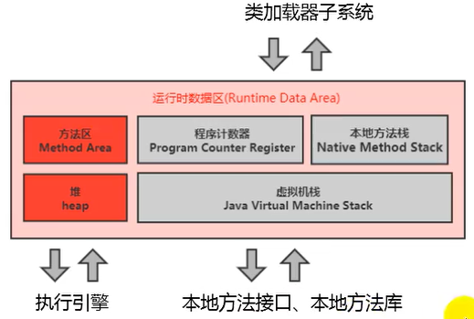
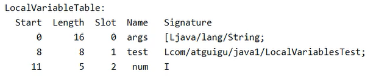

## 1、运行时数据区概述

- JVM内存布局规定了Java在运行过程中内存申请、分配、管理的策略，保证了JVM的高效稳定运行。不同的JVM对于内存的划分方式和管理机制存在着部分差异。

- 运行时数据区：

  

  - Java虚拟机定义了若干种程序运行期间会使用到的运行时数据区，其中有一些会随着虚拟机启动而创建，随着虚拟机退出而销毁。
  - 另外一些则是与线程对应的，这些与线程对应的数据区域会随着线程开始和结束而创建和销毁。
  - 每个线程独立：包括程序计数器、栈、本地虚拟机栈。
  - 线程间共享：堆、堆外内存（永久代或元空间（方法区）、代码缓存）。
  - 每个JVM只有一个Runtime实例。即为运行时环境（运行时数据区）。

- 线程：

  - 在Hotspot JVM里，每个线程都与操作系统的本地线程直接映射。
  - 当一个Java线程准备好执行以后，此时一个操作系统的本地线程也同时创建。Java线程执行终止后，本地线程也会回收。
  - 操作系统负责所有线程的安排调度到任何一个可用的CPU上。一旦本地线程初始化成功，它就会调用Java线程中的run（）方法。


## 2、程序计数器

- 程序计数器（PC寄存器）：
  - 是对物理PC寄存器的一种抽象模拟。
  - PC寄存器用来存储指向下一条指令的地址，也即将要执行的指令代码的指令地址。由执行引擎读取下一条指令。
  - 每个线程都有它自己的程序计数器，是线程私有的，生命周期与线程的生命周期保持一致。
  - 任何时间一个线程都只有一个方法在执行，也就是所谓的当前方法。程序计数器会存储当前线程正在执行的Java方法的JVM指令地址；或者，如果是在执行native方法，则是未指定值（undefined）。
  - 它是程序控制流的指示器，分支、循环、跳转、异常处理、线程恢复等基础功能都需要依赖这个计数器来完成。
  - 字节码解释器工作时就是通过改变这个计数器的值来选取下一条需要执行的字节码指令。
  - 它是唯一一个在Java虚拟机规范中没有规定任何outOfMemoryError情况的区域。
- 两个问题：
  - 使用PC寄存器存储字节码指令地址有什么用呢？为什么使用PC寄存器记录当前线程的执行地址呢？
    - 因为CPU需要不停的切换各个线程，这时候切换回来以后，就得知道接着从哪开始继续执行。
    - JVM的字节码解释器就需要通过改变PC寄存器的值来明确下一条应该执行什么样的字节码指令。
  - PC寄存器为么会被设定为线程私有？
    - 多线程在一个特定的时间段内只会执行其中某一个线程的方法，CPU会不停地做任务切换，这样必然导致经常中断或恢复。
    - 为了能够准确地记录各个线程正在执行的当前字节码指令地址，最好的办法自然是为每一个线程都分配一个PC寄存器，这样一来各个线程之间便可以进行独立计算，从而不会出现相互干扰的情况。


## 3、虚拟机栈

- 虚拟机栈的出现背景：
  - 由于跨平台性的设计，Java的指令都是根据栈来设计的。不同平台CPU架构不同，所以不能设计为基于寄存器的。
  - 优点是跨平台，指令集小，编译器容易实现，缺点是性能下降，实现同样的功能需要更多的指令。
  
- 内存中的栈和堆：
  - 栈是运行时的单位，而堆是存储的单位。
  - 即：栈解决程序的运行问题，即程序如何执行，或者说如何处理数据。堆解决的是数据存储的问题，即数据怎么放、放在哪儿。
  
- Java虚拟机栈是什么？
  - Java虚拟机栈（Java virtual Machine stack），早期也叫Java栈。
  - 每个线程在创建时都会创建一个虚拟机栈，其内部保存一个个的栈帧（Stack Frame），对应着一次次的Java方法调用。
  - 是线程私有的。
  - 生命周期和线程一致。
  - 作用：主管Java程序的运行，它保存方法的局部变量（基本数据类型、对象的引用地址）、部分结果，并参与方法的调用和返回。
  - 栈是一种快速有效的分配存储方式，访问速度仅次于程序计数器。
  - JVM直接对Java栈的操作只有两个：
    - 每个方法执行，伴随着进栈（入栈、压栈）
    - 执行结束后的出栈工作
  - 对于栈来说不存在垃圾回收问题。
  
- 栈的常见异常：
  - Java虚拟机规范允许Java栈的大小是动态的或者是固定不变的。
  - 如果采用固定大小的Java虚拟机栈，那每一个线程的Java虚拟机栈容量可以在线程创建的时候独立选定。如果线程请求分配的栈容量超过Java虚拟机栈允许的最大容量，Java虚拟机将会抛出一个StackOverflowError异常。
  - 如果Java虚拟机栈可以动态扩展，并且在尝试扩展的时候无法申请到足够的内存，或者在创建新的线程时没有足够的内存去创建对应的虚拟机栈，那Java虚拟机将会抛出一个OutOfMemoryError异常。
  
- 设置线程的栈最大内存：在VM options中设置`-Xss设置的大小`。

- 栈中存储什么：
  - 每个线程都有自己的栈，栈中的数据都是以栈帧（stack Erame）的格式存在。
  - 在这个线程上正在执行的每个方法都各自对应一个栈帧（stack Erame）。
  - 栈帧是一个内存区块，是一个数据集，维系着方法执行过程中的各种数据信息。
  
- 栈的运行原理：
  - JVM直接对Java栈的操作只有两个，就是对栈帧的压栈和出栈，遵循“先进后出”/“后进先出"原则。
  - 在一条活动线程中，一个时间点上，只会有一个活动的栈帧。即只有当前正在执行的方法的栈帧（栈顶栈帧）是有效的，这个栈帧被称为当前栈帧（Current Frame），与当前栈帧相对应的方法就是当前方法（current Method），定义这个方法的类就是当前类（Current Class）。
  - 执行引擎运行的所有字节码指令只针对当前栈帧进行操作。
  - 如果在该方法中调用了其他方法，对应的新的栈帧会被创建出来，放在栈的顶端，成为新的当前帧。
  - 当前栈帧对应的方法执行完后，该栈帧就出栈。
  - 不同线程中所包含的栈帧是不允许存在相互引用的，即不可能在一个栈帧之中引用另外一个线程的栈帧。
  - 如果当前方法是被前一个栈帧对应的方法调用的，方法返回之际，当前栈帧会传回此方法的执行结果给前一个栈帧，接着，虚拟机会丢弃当前栈帧，使得前一个栈帧重新成为当前栈帧。
  - Java方法有两种返回函数的方式，一种是正常的函数返回，使用return指令；另外一种是抛出异常。不管使用哪种方式，都会导致栈帧被弹出。
  
- 栈帧的内部结构：
  - 局部变量表（Local variables）。
  - 操作数栈（Operand stack）（或表达式栈）。
  - 动态链接（Dynamic Linking）（或指向运行时常量池的方法引用）。
  - 方法返回地址（Return Address）（或方法正常退出或者异常退出的定义）。
  - 一些附加信息。
  
- 局部变量表：
  - 局部变量表也被称之为局部变量数组或本地变量表。
  - 定义为一个数字数组，主要用于存储方法传入参数和定义在方法体内的局部变量，这些数据类型包括各类基本数据类型、对象引用（reference），以及returnAddress类型。
  - 由于局部变量表是建立在线程的栈上，是线程的私有数据，因此不存在数据安全问题。
  - 局部变量表所需的容量大小是在编译期确定下来的，并保存在方法的code属性的maximum local variables数据项中。在方法运行期间是不会改变局部变量表的大小的。
  - 参数值的存放总是在局部变量数组的index0开始，到数组长度-1的索引结束。
  - 局部变量表，最基本的存储单元是Slot（变量槽）。
  - 在局部变量表里，32位以内的类型只占用一个slot（包括returnAddress类型），64位的类型（long和double）占用两个slot。（byte、short、char在存储前被转换为int，boolean也被转换为int，0表示false，非0表示true。long和double则占据两个slot）
  - 局部变量表中的变量只在当前方法调用中有效。在方法执行时，虚拟机通过使用局部变量表完成参数值到参数变量列表的传递过程。当方法调用结束后，随着方法栈帧的销毁，局部变量表也会随之销毁。
  
- 局部变量表的结构（非静态方法还有this）：

  ```java
  public static void main(String[] args){
  	LocalVariablesTest test = new LocalVariablesTest();
      int num = 10;
  }
  ```

  

- 字节码中方法的内部结构：
  - Name：方法名。
  - Descriptor：方法的输入参数和返回值。
  - Access flags：方法的修饰符。
  - ByteCode：字节码指令。
  - Exception table：异常。
  - Misc：局部变量表大小，字节码指令长度。
  - LocalVariableTable：局部变量表，包括在字节码指令中声明的位置和作用域等。
  - LineNumberTable：源代码与字节码指令的行号对应关系。
  
- 变量槽：
  - JVM会为局部变量表中的每一个slot都分配一个访问索引，通过这个索引即可成功访问到局部变量表中指定的局部变量值。
  - 当一个实例方法被调用的时候，它的方法参数和方法体内部定义的局部变量将会按照顺序被复制到局部变量中的每一个slot上。
  - 如果需要访问局部变量表中一个64bit的局部变量值时，只需要使用前一个索引即可。（比如：访问long或double类型变量）
  - 如果当前帧是由构造方法或者实例方法创建的，那么该对象引用this将会存放在index为0的slot处，其余的参数按照参数表顺序继续排列。（静态方法没有，所以静态方法中不能调用this）
  - 栈帧中的局部变量表中的槽位是可以重用的，如果一个局部变量过了其作用域，那么在其作用域之后申明的新的局部变量就很有可能会复用过期局部变量的槽位，从而达到节省资源的目的。
  
- 静态变量与局部变量的对比：

  - 参数表分配完毕之后，再根据方法体内定义的变量的顺序和作用域分配。
  - 我们知道类变量表有两次初始化的机会，第一次是在“准备阶段”，执行系统初始化，对类变量设置零值，另一次则是在“初始化”阶段，赋予程序员在代码中定义的初始值。
  - 实例变量随着对象的创建，会在堆空间中分配实例变量空间，并进行默认赋值。
  - 和类变量初始化不同的是，局部变量表不存在系统初始化的过程，这意味着一旦定义了局部变量则必须人为的初始化，否则无法使用。
  
- 在栈帧中，与性能调优关系最为密切的部分就是局部变量表。在方法执行时，虚拟机使用局部变量表完成方法的传递。

- 局部变量表中的变量也是重要的垃圾回收根节点，只要被局部变量表直接或间接引用的对象都不会被回收。

- 操作数栈：

  - 每一个独立的栈帧中除了包含局部变量表以外，还包含一个后进先出（Last-In-First-Out）的操作数栈，也可以称之为表达式栈（Expression stack）。
  - 操作数栈，在方法执行过程中，根据字节码指令，往栈中写入数据或提取数据，即入栈（push）/出栈（pop）。
    - 某些字节码指令将值压入操作数栈，其余的字节码指令将操作数取出栈。使用它们后再把结果压入栈。
    - 比如：执行复制、交换、求和等操作。
  - 操作数栈，主要用于保存计算过程的中间结果，同时作为计算过程中变量临时的存储空间。
  - 操作数栈就是JVM执行引擎的一个工作区，当一个方法刚开始执行的时候，一个新的栈帧也会随之被创建出来，这个方法的操作数栈是空的。
  - 每一个操作数栈都会拥有一个明确的栈深度用于存储数值，其所需的最大深度在编译期就定义好了，保存在方法的Code属性中，max_stack的值。
  - 栈中的任何一个元素都是可以任意的Java数据类型。
    -  32bit的类型占用一个栈单位深度。
    -  64bit的类型占用两个栈单位深度。
  - 操作数栈并非采用访问索引的方式来进行数据访问的，而是只能通过标准的入栈（push）和出栈（pop）操作来完成一次数据访问。
  - 如果被调用的方法带有返回值的话，其返回值将会被压入当前栈帧的操作数栈中，并更新PC寄存器中下一条需要执行的字节码指令。
  - 操作数栈中元素的数据类型必须与字节码指令的序列严格匹配，这由编译器在编译器期间进行验证，同时在类加载过程中的类检验阶段的数据流分析阶段要再次验证。
  - 说Java虚拟机的解释引擎是基于栈的执行引擎，其中的栈指的就是操作数栈。
  
- 代码追踪声明变量时操作数栈和局部变量表的操作：P53。

- 栈顶缓存技术：
  
  - 将栈顶元素全部缓存在物理CPU的寄存器中，以此降低对内存的读/写次数，提升执行引擎的执行效率。
  
- 动态链接（指向运行时常量池的方法引用）：
  - 每一个栈帧内部都包含一个指向运行时常量池中该栈帧所属方法的引用。包含这个引用的目的就是为了支持当前方法的代码能够实现动态链接（Dynamic Linking）。比如：invokedynamic指令。
  - 在Java源文件被编译到字节码文件中时，所有的变量和方法引用都作为符号引用（Symbolic Reference）保存在class文件的常量池里。
  - 比如：描述一个方法调用了另外的其他方法时，就是通过常量池中指向方法的符号引用来表示的，那么动态链接的作用就是为了将这些符号引用转换为调用方法的直接引用。
  - 为什么需要常量池呢？提供一些符号和常量，便于指令的识别。
  
- 方法的调用：
  - 在JVM中，将符号引用转换为调用方法的直接引用与方法的绑定机制相关。
    - 静态链接：当一个字节码文件被装载进JVM内部时，如果被调用的目标方法在编译期可知，且运行期保持不变时。这种情况下将调用方法的符号引用转换为直接引用的过程称之为静态链接。
    - 动态链接：如果被调用的方法在编译期无法被确定下来，也就是说，只能够在程序运行期将调用方法的符号引用转换为直接引用，由于这种引用转换过程具备动态性，因此也就被称之为动态链接。
  - 对应的方法的绑定机制为：早期绑定（Early Binding）和晚期绑定（Late Binding），（因为多态特性的存在）。绑定是一个字段、方法或者类在符号引用被替换为直接引用的过程，这仅仅发生一次。
    - 早期绑定：早期绑定就是指被调用的目标方法如果在编译期可知，且运行期保持不变时，即可将这个方法与所属的类型进行绑定，这样一来，由于明确了被调用的目标方法究竟是哪一个，因此也就可以使用静态链接的方式将符号引用转换为直接引用。
    - 晚期绑定：如果被调用的方法在编译期无法被确定下来，只能够在程序运行期根据实际的类型绑定相关的方法，这种绑定方式也就被称之为晚期绑定。
  
- 虚方法和非虚方法：
  - 非虚方法：如果方法在编译期就确定了具体的调用版木，这个版本在运行时是不可变的。这样的方法称为非虚方法（不存在多态）。
  - 包括：静态方法、私有方法、final方法、实例构造器、父类方法都是非虚方法。
  - 其他方法称为虚方法。
  
- 虚拟机中提供了以下几条方法调用指令：
  - 普通调用指令：
    - invokestatic：调用静态方法，解析阶段确定唯一方法版本。
    - invokespecial：调用<init>方法、私有及父类方法，解析阶段确定唯一方法版本。
    - invokevirtual：调用所有虚方法。
    - invokeinterface：调用接口方法。
  - 动态调用指令：
    - invokedynamic：动态解析出需要调用的方法。
  - 然后执行前四条指令固化在虚拟机内部，方法的调用执行不可人为干预，而invokedynamic指令则支持由用户确定方法版本。
  - 其中invokestatic指令和invokespecial指令调用的方法称为非虚方法，其余的（final修饰的除外）称为虚方法。
  
- 动态类型语言和静态类型语言：
  - 动态类型语言和静态类型语言两者的区别就在于对类型的检查是在编译期还是在运行期，满足前者就是静态类型语言，反之是动态类型语言。
  - 静态类型语言是判断变量自身的类型信息；动态类型语言是判断变量值的类型信息，变量没有类型信息，变量值才有类型信息这是动态语言的一个重要特征。
  
- 方法重写的本质：
  - 找到操作数栈顶的第一个元素所执行的对象的实际类型，记作C。
  - 如果在类型C中找到与常量中的描述符合简单名称都相符的方法，则进行访问权限校验，如果通过则返回这个方法的直接引用，查找过程结束；如果不通过则返回java.lang.illegalAccessError异常。
  - 否则，按照继承关系从下往上依次对c的各个父类进行第2步的搜索和验证过程。
  - 如果始终没有找到合适的方法，则抛出java.lang.AbstractMethodError异常。
  - illegalAccessError介绍：程序试图访问或修改一个属性或调用一个方法，这个属性或方法，你没有权限访问。一般的，这个会引起编译器异常。这个错误如果发生在运行时，就说明一个类发生了不兼容的改变。

- 虚方法表：
  - 如果在每次动态分派的过程中都要重新在类的方法元数据中搜索合适的目标的话就可能影响到执行效率。因此，为了提高性能，JVM采用在类的方法区建立一个虚方法表（virtual method table）（非虚方法不会出现在表中）来实现。使用索引表来代替查找。
  - 每个类中都有一个虚方法表，表中存放着各个方法的实际入口。
  - 那么虚方法表什么时候被创建？虚方法表会在类加载的链接阶段（解析）被创建并开始初始化，类的变量初始值准备完成之后，JVM会把该类的方法表也初始化完毕。

- 方法返回地址：
  - 存放调用该方法的PC寄存器的值，交给执行引擎进行后续操作。比如A方法在第n行调用了B方法，B方法完成后就会按照方法返回地址第n行返回A方法。
  - 一个方法的结束，有两种方式：
    - 正常执行完成。
    - 出现未处理的异常，非正常退出。
  - 无论通过哪种方式退出，在方法退出后都返回到该方法被调用的位置。
    - 方法正常退出时，调用者的pc计数器的值作为返回地址，即调用该方法的指令的下一条指令的地址。
    - 通过异常退出的，返回地址是要通过异常表来确定，栈帧中一般不会保存这部分信息。
    - 本质上，方法的退出就是当前栈帧出栈的过程。此时，需要恢复上层方法的局部变量表、操作数栈、将返回值压入调用者栈帧的操作数栈、设置PC寄存器值等，让调用者方法继续执行下去。
    - 正常完成出口和异常完成出口的区别在于：通过异常完成出口退出的不会给他的上层调用者产生任何的返回值。
  - 当一个方法开始执行后，只有两种方式可以退出这个方法：
    - 执行引擎遇到任意一个方法返回的字节码指令（return），会有返回值传递给上层的方法调用者，简称正常完成出口。
    - 一个方法在正常调用完成之后究竟需要使用哪一个返回指令还需要根据方法返回值的实际数据类型而定。
    - 在字节码指令中，返回指令包含ireturn（当返回值是boolean，byte，char，short和int类型时使用），lreturn，freturn，dreturn以及areturn（引用类型），另外还有一个return指令供声明为void的方法、实例初始化方法、类和接口的初始方法使用。
    - 在方法执行的过程中遇到了异常（Exception），并且这个异常没有住方法内进行处理，也就是只要在本方法的异常表中没有搜索到匹配的异常处理器，就会导致方法退出。简称异常完成出口。
    - 方法执行过程中抛出异常时的异常处理，存储在一个异常处理表，方便在发生异常的时候找到处理异常的代码。
  
- 一些附加信息：如对程序调试提供支持的信息。

- 五个问题：
  - 栈溢出？调整栈大小就能保证不溢出吗？
    - 栈溢出出现在栈的大小固定的情况，当压入栈的数据满了就会溢出。
    - 不能，可能只是让栈溢出的时间延缓了，但也可能就不会溢出了。
  - 垃圾回收是否会涉及到虚拟机栈？
    - 不会。虚拟机栈存在Error但不存在垃圾回收，只有进栈出栈操作。
  - 分配的栈内存越大越好吗？
    - 不是，虽然可能延缓了溢出的时间，但是也挤占了其他线程的内存空间。
  - 方法中的定义的局部变量是否线程安全？
    - 具体问题具体分析。
    - 如果局部变量是在该方法内声明的，则是线程安全的。
    - 如果局部变量是作为参数传入的，则可能是线程不安全的。
    - 如果局部变量作为返回值返回了，则可能是线程不安全的。
    - 就是说如果局部变量是在方法内部声明内部消亡的，则是安全的。


