## 1、垃圾回收的相关概念

- 在默认情况下，通过`System.gc()`或者`Runtime.getRuntime().gc()`的调用，会显式触发Full GC，同时对老年代和新生代进行回收，尝试释放被丢弃对象占用的内存。

- 然而`System.gc()`调用附带一个免责声明，无法保证对垃圾收集器的调用。实际上只是提醒JVM希望进行一次垃圾回收，但不确定是否会执行。

- JVM实现者可以通过`System.gc()`调用来决定JVM的GC行为。而一般情况下，垃圾回收应该是自动进行的，无须手动触发，否则就太过于麻烦了。在一些特殊情况下，如我们正在编写一个性能基准，我们可以在运行之间调用`System.gc()`。

- 实际上调用的是`Runtime.getRuntime().gc()`。

- 但是在`System.gc()`之后加上`System.runFinalization()`，则会强制调用失去引用的对象的`finalize()`方法。2

- 手动GC理解对象回收：

  ```java
  public class Test2 {
  	//因为引用还在，不会被回收
      public void func1(){
          byte[] buffer = new byte[10*1024*1024];
          System.gc();
      }
      //引用消失，被回收
      public void func2(){
          byte[] buffer = new byte[10*1024*1024];
          buffer = null;
          System.gc();
      }
      //因为局部变量表中的1的位置（0是this）还没有被覆盖，引用还在，不会被回收
      public void func3(){
          {
              byte[] buffer = new byte[10 * 1024 * 1024];
          }
          System.gc();
      }
      //局部变量表中buffer被value覆盖了，引用消失，被回收
      public void func4(){
          {
              byte[] buffer = new byte[10 * 1024 * 1024];
          }
          int value = 10;
          System.gc();
      }
      //方法出栈，引用消失，被回收
      public void func5(){
          func1();
          System.gc();
      }
      public static void main(String[] args) {
          Test2 test2 = new Test2();
          test2.func1();
      }
  }
  ```


- 内存溢出（OOM）：
  - javadoc中对OutOfMemoryError的解释是，没有空闲内存，并且垃圾收集器也无法提供更多内存。
  - JVM的堆内存不够的主要原因：
    - JVM的堆内存设置不够。
    - 代码中创建了大量大对象，并且长时间不能被垃圾回收器收集。
  - 在即将OOM时，JVM会进行一次独占式的Full GC操作，这时候会回收大量的内存，供应用程序继续使用。
  - GC不是在任何情况下垃圾收集器都会被触发的。比如分配一个超大对象，超过堆的最大值，JVM可以判断出垃圾收集并不能解决这个问题，所以直接抛出OOM。
- 内存泄漏：
  - 严格来讲，只有对象不会再被程序用到了，但是GC又不能回收他们的情况，才叫内存泄漏。
  - 但实际情况很多时候一些不太好的实践（或疏忽）会导致对象的生命周期变得很长甚至导致OOM，也可以叫做宽泛意义上的内存泄漏。
  - 尽管内存泄漏并不会立刻引起程序崩溃，但是一旦发生内存泄漏，程序中的可用内存就会被逐步蚕食，直至耗尽所有内存，最终可能出现OutOfMemory异常，导致程序崩溃。
  - 这里的存储空间并不是指物理内存，而是指虚拟内存大小，这个虚拟内存大小取决于磁盘交换区设定的大小。
  - 内存泄露的例子：
    - 单例模式：单例的生命周期和应用程序是一样长的，所以单例程序中，如果持有对外部对象的引用的话，那么这个外部对象是不能被回收的，则会导致内存泄漏的产生。
    - 一些提供close的资源未关闭导致内存泄漏
      数据库连接（dataSourse.getConnection()），网络连接（socket）和IO连接必须手动close，否则是不能被回收的。
- Stop The World：
  - Stop-The-World，简称STW，指的是GC事件发生过程中，会产生应用程序的停顿。停顿产生时整个应用程序线程都会被暂停，没有任何响应，有点像卡死的感觉，这个停顿称为STW。
  - 可达性分析算法中枚举根节点（GC Roots）会导致所有Java执行线程停顿。
    - 分析工作必须在一个能确保一致性的快照中进行。
    - 一致性指整个分析期间整个执行系统看起来像被冻结在某个时间点上。
    - 如果出现分析过程中对象引用关系还在不断变化，则分析结果的准确性无法保证。
  - 被STW中断的应用程序线程会在完成GC之后恢复，频繁中断会让用户感觉卡顿，所以我们需要减少STW的发生。
  - STW事件和采用哪款GC无关，所有的Gc都有这个事件。
  - STW是JVM在后台自动发起和自动完成的。在用户不可见的情况下，把用户正常的工作线程全部停掉。
  - 开发中不要用`System.gc()`，会导致stop-the-world的发生。
- 垃圾回收的并行与并发：
  - 并行（Parallel）：指多条垃圾收集线程并行工作，但此时用户线程仍处于等待状态。如ParNew， Parallel Scavenge，Parallel Old。
  - 串行（Serial）：相较于并行的概念，单线程执行。
    如果内存不够，则程序暂停，启动JVM垃圾回收器进行垃圾回收。回收完，再启动程序的线程（实际上并行也是如此）。
  - 并发（Concurrent）：在一个时间段内，指用户线程与垃圾收集线程同时执行（但不一定是并行的，可能会交替执行），垃圾回收线程在执行时不会停顿用户程序的运行。用户程序在继续运行，而垃圾收集程序线程运行于另一个CPU上；如CMS，G1。
- 安全点和安全区域：
  - 安全点：程序执行时并非在所有地方都能停顿下来开始GC，只有在特定的位置才能停顿下来开始GC，这些位置称为“安全点（Safepoint），
  - Safe Point的选择很重要，如果太少可能导致GC等待的时间太长，如果太频繁可能导致运行时的性能问题。
  - 大部分指令的执行时间都非常短暂，通常会根据“是否具有让程序长时间执行的特征”为标准。比如：选择一些执行时间较长的指令作为Safe Point，如方法调用、循环跳转和异常跳转等。
  - 如何在GC发生时，检查所有线程都跑到最近的安全点停顿下来呢？
    - 抢先式中断：（目前没有虚拟机采用了）。首先中断所有线程。如果还有线程不在安全点，就恢复线程，让线程跑到安全点。
    - 主动式中断：设置一个中断标志，各个线程运行到Safe Point的时候主动轮询这个标志，如果中断标志为真，则将自己进行中断挂起。
  - Safepoint机制保证了程序执行时，在不太长的时间内就会遇到可进入GC的Safepoint。但是，程序“不执行”的时候，例如线程处于Sleep状态或Blocked状态，这时候线程无法响应JVM的中断请求，“走”到安全点去中断挂起，JVM也不太可能等待线程被唤醒。对于这种情况，就需要安全区域（Safe Region）来解决。
  - 安全区域是指在一段代码片段中，对象的引用关系不会发生变化，在这个区域中的任何位置开始GC都是安全的。我们也可以把safe Region看做是被扩展了的Safepoint。
  - 线程在进 Safe Region的时候先标记自己已进入了Safe Region，这样GC时就不需要管进入Safe Region的线程了。等到被唤醒时准备离开Safe Region时，先检查能否离开，如果GC完成了，那么线程可以离开，否则它必须等待直到收到安全离开的信号为止。


- 垃圾回收与对象引用：

  - 我们希望能描述这样一类对象：当内存空间还足够时，则能保留在内存中；如果内存空间在进行垃圾收集后还是很紧张，则可以抛弃这些对象。
  - 在JDK 1.2版之后，Java对引用的概念进行了扩充，将引用分为强引用（Strong Reference）、软引用（Soft Reference）、弱引用（Weak Reference）和虚引用
    （Phantom Reference）4种，这4种引用强度依次逐渐减弱。
  - 强引用（StrongReference）：最传统的“引用”的定义，是指在程序代码之中普遍有在的引用赋值，即类似"object obj=new object（）"这种引用关系。无论任何情况下，只要强引用关系还存在，垃圾收集器就永远不会回收掉被引用的对象。
  - 软引用（SoftReference）：在系统将要发生内存溢出之前，将会把这些对象列入回收范围之中进行第二次回收。如果这次回收后还没有足够的内存，才会抛出内存溢出异常。
  - 弱引用（WeakReference）：被弱引用关联的对象只能生存到下一次垃圾收集之前。当垃圾收集器工作时，无论内存空间是否足够，都会回收掉被弱引用关联的对象。
  - 虚引用（PhantomReference）：一个对象是否有虚引用的存在，完全不会对其生存时间构成影响，也无法通过虚引用来获得一个对象的实例。为一个对象设置虚引用关联的唯一目的就是能在这个对象被收集器回收时收到一个系统通知。
  - 强引用：永不回收；软引用：内存不够即回收；弱引用：被垃圾回收发现即回收；虚引用：作为对象回收跟踪。

- 强引用：

  - 在Java程序中，最常见的引用类型是强引用（普通系统99%以上都是强引用），也就是我们最常见的普通对象引用，也是默认的引用类型。
  - 当在Java语言中使用new操作符创建一个新的对象，并将其赋值给一个变量的时候，这个变量就成为指向该对象的一个强引用。
  - 只要强引用的对象是可触及的，垃圾收集器就永远不会回收掉被引用的对象。
  - 对于一个普通的对象，如果没有其他的引用关系，只要超过了引用的作用域或者显式地将相应（强）引用赋值为null，就是可以当做垃圾被收集了，当然具体回收时机还是要看垃圾收集策略。
  - 相对的，软引用、弱引用和虚引用的对象是软可触及、弱可触及和虚可触及的，在一定条件下，都是可以被回收的。所以，强引用是造成Java内存泄漏的主要原因之一。
  - 强引用具备以下特点：
    - 强引用可以直接访问目标对象。
    - 强引用所指向的对象在任何时候都不会被系统回收，虚拟机宁愿抛出OOM异常，也不会回收强引用所指向对象。
    - 强引用可能导致内存泄漏。

- 软引用：

  - 软引用是用来描述一些还有用，但非必需的对象。只被软引用关联着的对象，在系统将要发生内存溢出异常前，会把这些对象列进回收范围之中进行第二次回收（第一次回收是针对不可达对象），如果这次回收还没有足够的内存，才会抛出内存溢出异常。

  - 软引用通常用来实现内存敏感的缓存。比如：高速缓存就有用到软引用。如果还有空闲内存，就可以暂时保留缓存，当内存不足时清理掉，这样就保证了使用缓存的同时，不会耗尽内存。

  - 垃圾回收器在某个时刻决定回收软可达的对象的时候，会清理软引用，并可选地把引用存放到一个引用队列（Reference Queue）。

  - 类似弱引用，只不过Java虚拟机会尽量让软引用的存活时间长一些，迫不得已才清理。

  - 实现软引用：

    ```java
    Object obj = new object();	//声明强引用
    SoftReferencecobjet f= new SoftReference<object>(obj);	//生成软引用
    obj = null;	//销毁强引用
    Object o = f.get();	//用软引用获取对象
    ```

- 弱引用：

  - 弱引用也是用来描述那些非必需对象，只被弱引用关联的对象只能生存到下一次垃圾收集发生为止。在系统GC时，只要发现弱引用，不管系统堆空间使用是否充足，都会回收掉只被弱引用关联的对象。

  - 但是，由于垃圾回收器的线程通常优先级很低，因此，并不一定能很快地发现持有弱引用的对象。在这种情况下，弱引用对象可以存在较长的时间。

  - 弱引用和软引用一样，在构造弱引用时，也可以指定一个引用队列，当弱引用对象被回收时，就会加入指定的引用队列，通过这个队列可以跟踪对象的回收情况。

  - 软引用、弱引用都非常适合来保存那些可有可无的缓存数据。如果这么做，当系统内存不足时，这些缓存数据会被回收，不会导致内存溢出。而当内存资源充足时，这些缓存数据又可以存在相当长的时间，从而起到加速系统的作用。

  - 弱引用对象与软引用对象的最大不同就在于，当GC在进行回收时，需要通过算法检查是否回收软引用对象，而对于弱引用对象，GC总是进行回收。弱引用对象更容易、更快被GC回收。

  - 实现弱引用：

    ```java
    WeakReferencecobjet f= new WeakReference<object>(new Object());	//生成弱引用
    Object o = f.get();	//用弱引用获取对象
    ```

- 虚引用：

  - 是所有引用类型中最弱的一个。

  - 一个对象是否有虚引用的存在，完全不会决定对象的生命周期。如果一个对象仅持有虚引用，那么它和没有引用几乎是一样的，随时都可能被垃圾回收器回收。

  - 它不能单独使用，也无法通过虚引用来获取被引用的对象。当试图通过虚引用的get()方法取得对象时，总是null。

  - 为一个对象设置虚引用关联的唯一目的在于跟踪垃圾回收过程。比如：能在这个对象被收集器回收时收到一个系统通知。

  - 虚引用必须和引用队列一起使用。虚引用在创建时必须提供一个引用队列作为参数。当垃圾回收器准备回收一个对象时，如果发现它还有虚引用，就会在回收对象后，将这个虚引用加入引用队列，以通知应用程序对象的回收情况。

  - 由于虚引用可以跟踪对象的回收时间，因此，也可以将一些资源释放操作放置在虚引用中执行和记录。

  - 实现虚引用：

    ```java
    object obj = new object(); 
    ReferenceQueue phantomQueue = new Referencequeue(); 
    PhantomReferencekobject> pf = new PhantomReferencecobject>(obj, phantomQueue); obj = null;
    ```

- 终结器引用：

  - 它用以实现对象的finalize()方法，也可以称为终结器引用。
  - 无需手动编码，其内部配合引用队列使用。
  - 在GC时，终结器引用入队。由Finalizer线程通过终结器引用找到被引用对象并调用它的finalize()方法，第二次GC时才能回收被引用对象。


## 2、垃圾回收器

- 垃圾回收器的分类：

  - 按线程数分：
    - 串行回收指的是在同一时间段内只允许有一个CPU用于执行垃圾回收操作，此时工作线程被暂停，直至垃圾收集工作结束。
      - 在诸如单CPU处理器或者较小的应用内存等硬件平台不是特别优越的场合，串行回收器的性能表现可以超过并行回收器和并发回收器。所以，串行回收默认被应用在客户端的Client模式下的JVM中
      - 在并发能力比较强的CPU上，并行回收器产生的停顿时闻要短于串行回收器。
    - 并行收集可以运用多个CPU同时执行垃圾回收，因此提升了应用的吞吐量，不过并行回收仍然与串行回收一样，采用独占式，使用了"stop-the-world"机制。
  - 按照工作模式分：
    - 并发式垃圾回收器与应用程序线程交替工作，以尽可能减少应用程序的停顿时间。
    - 独占式垃圾回收器（stop the world）一旦运行，就停止应用程序中的所有用户线程，直到垃圾回收过程完全结束。
  - 按碎片处理方式分：
    - 压缩式垃圾回收器会在回收完成后，对存活对象进行压缩整理，消除回收后的碎片。
    - 非压缩式的垃圾回收器不进行这步操作。
  - 按工作的内存区间分，又可分为年轻代垃圾回收器和老年代垃圾回收器。

- 评估垃圾回收器的指标：

  - 吞吐量：运行用户代码的时间占总运行时间的比例
    （总运行时间：程序的运行时间+内存回收的时间）。
  - 垃圾收集开销：吞吐量的补数，垃圾收集所用时间与总运行时间的比例。
  - 暂停时间：执行垃圾收集时，程序的工作线程被暂停的时间。
  - 收集频率：相对于应用程序的执行，收集操作发生的频率。
  - 内存占用：Java堆区所占的内存大小。
  - 快速：一个对象从诞生到被回收所经历的时间。
  - 最重要的是吞吐量和暂停时间。
  - 高吞吐量较好因为这会让应用程序的最终用户感觉有应用程序线程在做“生产性”工作。直觉上，吞吐量越高程序运行越快。
  - 低暂停时间（低延迟）较好因为从最终用户的角度来看不管是GC还是其他原因导致一个应用被挂起始终是不好的。因此，具有低的较大暂停时间是非常重要的，特别是对于一个交互式应用程序。
  - 在设计（或使用）GC算法时，我们必须确定我们的目标：一个GC算法只可能针对两个目标之一（即只专注于较大吞吐量或最小暂停时间），或尝试找到一个二者的折衷。

- 七种经典的垃圾回收器：

  - 串行回收器：Serial，Serial old。
  - 并行回收器：ParNew，Parallel Scavenge，Parallel old。
  - 并发回收器：CMS，G1。
  - 为什么要有很多收集器？因为Java的使用场景很多，移动端，服务器等。所以就需要针对不同的场景，提供不同的垃圾收集器，提高垃圾收集的性能。我们选择的只是对具体应用最合适的收集器。

- 垃圾回收器与垃圾分代：

  - 新生代收集器：Serial，ParNew，Parallel scavenge；
  - 老年代收集器：Serial old，Parallel old，CMS；
  - 整堆收集器：G1。

  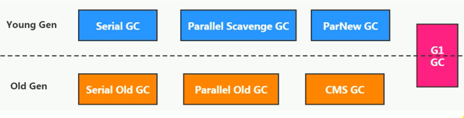

- 垃圾回收器的组合关系：

  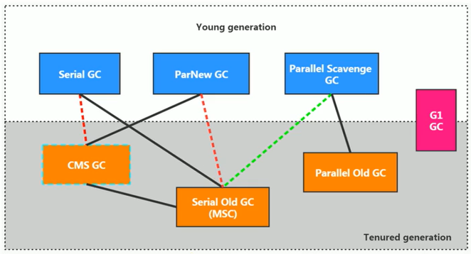

  - jdk8之前，所有的线（实线和虚线）之间都可以组合。
  - 在jdk8中，红色虚线被废弃；在jdk9中被移除。
  - 在jdk14中，绿色虚线被废弃，青色虚线（CMS）被删除。
  - Serial old与CMS的连线是表示，其作为老年代CMS收集器的后备垃圾收集方案。

- 查看使用的垃圾回收器：

  - -XX：+PrintCommandLineFlags：查看命令行相关参数（包含使用的垃圾收集器）
  - 使用命令行指令：jinfo -flag 相关垃圾回收参数 进程ID。
  - jdk6~8默认Parallel scavenge + Parallel Old。
  - jdk9及以后默认G1。


- Serial回收器：串行回收

  - Serial收集器是最基本、历史最悠久的垃圾收集器了。JDK1.3之前回收新生代唯一的选择。
  - Serial收集器作为Hotspot中Client模式下的默认新生代垃圾收集器。
  - Serial 收集器采用复制算法、串行回收和"Stop-the-World"机制的方式执行内存回收。|
  - 除了年轻代之外，Serial收集器还提供用于执行老年代垃圾收集的Serial old收集器。Serial old收集器同样也采用了串行回收和"Stop the World"机制，只不过内存回收算法使用的是标记-压缩算法。
    - Serial old是运行在Client模式下默认的老年代的垃圾回收器
    - Serial old在Server模式下主要有两个用途：①与新生代的Parallel Scavenge配合使用；②作为老年代CMS收集器的后备垃圾收集方案。
  - 这个收集器是一个单线程的收集器，但它的“单线程”的意义并不仅仅说明它只会使用一个CPU或一条收集线程去完成垃圾收集工作，更重要的是在它进行垃圾收集时，必须暂停其他所有的工作线程，直到它收集结束（stop The world）。
  - 优势：简单而高效（与其他收集器的单线程比），对于限定单个CPU的环境来说，Serial收集器由于没有线程交互的开销，专心做垃圾收集自然可以获得最高的单线程收集效率。
    - 运行在Client模式下的虚拟机是个不错的选择。
  - 在用户的桌面应用场景中，可用内存一般不大（几十MB至一两百MB），可以在较短时间内完成垃圾收集（几十ms至一百多ms），只要不频繁发生，使用串行回收器是可以接受的。
  - 在Hotspot虚拟机中，使用-XX：+UseSerialGC参数可以指定年轻代和老年代都使用串行收集器。等价于新生代用Serial GC，且老年代用Serial old GC。
  - 现在已经不用串行的了。而且在限定单核cpu才可以用。
  - 对于交互较强的应用而言，这种垃圾收集器是不能接受的。一般在Java web应用程序中是不会采用串行垃圾收集器的。

  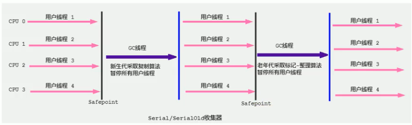


- ParNew回收器：并行回收

  - 如果说Serial GC是年轻代中的单线程垃圾收集器，那么ParNew收集器则是Serial收集器的多线程版本。
    - Par是Parallel的缩写，New：只能处理的是新生代。
  - ParNew收集器除了采用并行回收的方式执行内存回收外，两款垃圾收集器之间几乎没有任何区别。
  - ParNew收集器在年轻代中同样也是采用复制算法、"stop-the-world"机制。
  - ParNew 是很多JVM运行在Server模式下新生代的默认垃圾收集器。

  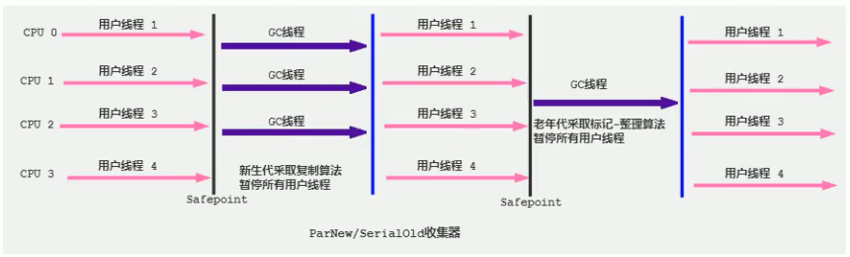

  - 对于新生代，回收次数频繁，使用并行方式高效。
  - 对于老年代，回收次数少，使用串行方式节省资源。（CPU并行需要切换线程，串行可以省去切换线程的资源）
  - 由于ParNew收集器是基于并行回收，那么是否可以断定ParNew收集器的回收效率在任何场景下都会比Serial收集器更高效？
    - ParNew收集器运行在多CPU的环境下，由于可以充分利用多CPU、多核心等物理硬件资源优势，可以更快速地完成垃圾收集，提升程序的吞吐量。
    - 但是在单个CPU的环境下，ParNew收集器不比Serial收集器更高效。虽然Serial收集器是基于串行回收，但是由于CPU不需要频繁地做任务切换，因此可以有效避免多线程交互过程中产生的一些额外开销。
  - 除Serial外，只有ParNew GC能与CMS收集器配合工作。
  - 在程序中，开发人员可以通过选项”-XX：+UseParNewGC"手动指定使用ParNew收集器执行内存回收任务。它表示年轻代使用并行收集器，不影响老年代。
  - -XX:ParallelGCThreads限制线程数量，默以开启和CPU数量相同的线程数。


- Parallel Scavenge回收器：吞吐量优先

  - HotSpot的年轻代中除了拥有ParNew收集器是基于并行回收的以外，Parallel Scavenge收集器同样也采用了复制算法、并行回收和"Stop the World"机制。
  - 那么Parallel收集器的出现是否多此一举？
    - 和ParNew收集器不同，Parallel scavenge收集器的目标则是达到一个可控制的吞吐量（Throughput），它也被称为吞吐量优先的垃圾收集器。
    - 自适应调节策略也是Parallel Scavenge与ParNew一个重要区别。
  - 高吞吐量则可以高效率地利用CPU时间，尽快完成程序的运算任务，主要适合在后台运算而不需要太多交互的任务。因此，常见在服务器环境中使用。
  - Parallel收集器在JDK1.6时提供了用于执行老年代垃圾收集的Parallel old收集器，用来代替老年代的Serial old收集器。
  - Parallel old收集器采用了标记-压缩算法，但同样也是基于并行回收和"stop-the-world"机制。
  - 在程序吞吐量优先的应用场景中，Parallel收集器和Parallel old收集器的组合，在server模式下的内存回收性能很不错。
  - 在jdk8中，默认是Parallel+Parallel old垃圾收集器。

  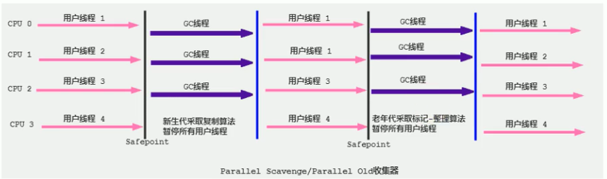

  - -XX：+UseParallelGC手动指定年轻代使用Parallel并行收集器执行内存回收任务。
  - -XX：+UseParalleloldGC 手动指定老年代都是使用并行回收收集器。
  - 分别适用于新生代和老年代。默认jdk8是开启的。
    上面两个参数，默认开启一个，另一个也会被开启。（互相激活）
  - -XX:ParallelGCThreads 设置年轻代并行收集器的线程数。
    - 一般地，最好与CPU数量相等，以避免过多的线程数影响垃圾收集性能。
    - 在默认情况下，当CPU数量小于等于8个，ParallelGCThreads的值等于CPU数量。
    - 当CPU数量大于8个，ParallelGCThreads的值等于3+[(5*CPU Count)/8]。
  - -XX:MaxGCPauseMillis 设置垃圾收集器最大停顿时间（即STW的时间）。单位是毫秒。
    - 为了尽可能地把停顿时间控制在MaxGCPauseMills以内，收集器在工作时会调整Java堆大小或者其他一些参数。
    - 对于用户来讲，停顿时间越短体验越好。但是在服务器端，我们注重高并发，整体的吞吐量。所以服务器端适合Parallel进行控制。
    - 该参数使用需谨慎。
  - -XX:GCTimeRatio 垃圾收集时间占总时间的比例（=1/（N+1））。
    - 用于衡量吞吐量的大小。
    - 取值范围（0，100）。默认值99，也就是垃圾回收时间不超过1%。
    - 与前一个-XX:MaxGCPauseMillis参数有一定矛盾性。暂停时间越长，Ratio参数就容易超过设定的比例。
  - -XX：+UseAdaptivesizePolicy 设置Parallel Scavenge收集器具有自适应调节策略
    - 在这种模式下，年轻代的大小、Eden和Survivor的比例、晋升老年代的对象年龄等参数会被自动调整，已达到在堆大小、吞吐量和停顿时间之间的平衡点。
    - 在手动调优比较困难的场合，可以直接使用这种自适应的方式，仅指定虚拟机的最大堆、目标的吞吐量（GCTimeRatio）和停顿时间（MaxGCPauseMills），让虚拟机自己完成调优工作。


- CMS回收器：低延迟

  - 在JDK1.5时期，HotSpot 推出了一款在强交互应用中几乎可认为有划时代意义的垃圾收集器：CMS（Concurrent-Mark-Sweep）收集器，这款收集器是HotSpot虚拟机中第一款真正意义上的并发收集器，它第一次实现了让垃圾收集线程与用户线程同时工作。
  - CMS收集器的关注点是尽可能缩短垃圾收集时用户线程的停顿时间。停顿时间越短（低延迟）就越适合与用户交互的程序，良好的响应速度能提升用户体验。
    - 目前很大一部分的Java应用集中在互联网站或者B/S系统的服务端上，这类应用尤其重视服务的响应速度，希望系统停顿时间最短，以给用户带来较好的体验。
    - CMS收集器就非常符合这类应用的需求。
  - CMS的垃圾收集算法采用标记-清除算法，并且也会"stop-the-world"。
  - CMS作为老年代的收集器，无法与JDK1.4.0中已经存在的新生代收集器Parallel Scavenge配合工作，所以在JDK1.5中使用CMS来收集老年代的时候，新生代只能选择ParNew或者Serial收集器中的一个。

  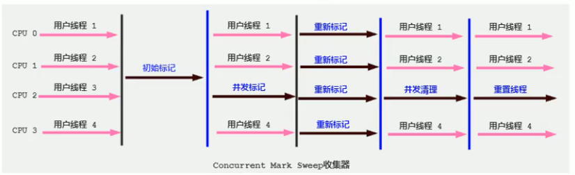

  - CMS整个过程比之前的收集器要复杂，整个过程分为4个主要阶段，即初始标记阶段、并发标记阶段、重新标记阶段和并发清除阶段。
    - 初始标记（Initial-Mark）阶段：在这个阶段中，程序中所有的工作线程都将会因为
      “stop-the-World”机制而出现短暂的暂停，这个阶段的主要任务仅仅只是标记出GCRoots能直接关联到的对象。一旦标记完成之后就会恢复之前被暂停的所有应用线程。由于直接关联对象比较小，所以这里的速度非常快。
    - 并发标记（Concurrent-Mark）阶段：从GC Roots的直接关联对象开始遍历整个对象图的过程，这个过程耗时较长但是不需要停顿用户线程，可以与垃圾收集线程一起并发运行。
    - 重新标记（Remark）阶段：由于在并发标记阶段中，程序的工作线程会和垃圾收集线程同时运行或者交叉运行，因此为了修正并发标记期间，因用户程序继续运作而导致标记产生变动的那一部分对象的标记记录，这个阶段的停顿时间通常会比初始标记阶段稍长一些，但也远比并发标记阶段的时间短。
    - 并发清除（Concurrent-Sweep）阶段：此阶段清理删除掉标记阶段判断的已经死亡的对象，释放内存空间。由于不需要移动存活对象，所以这个阶段也是可以与用户线程同时并发的。
  - 尽管CMS收集器采用的是并发回收（非独占式），但是在其初始化标记和再次标记这两个阶段中仍然需要执行“stop-the-World”机制暂停程序中的工作线程，不过暂停时间并不会太长，因此可以说明目前所有的垃圾收集器都做不到完全不需要“stop-the-World”，只是尽可能地缩短暂停时间。
  - 由于最耗费时间的并发标记与并发清除阶段都不需要暂停工作，所以整体的回收是低停顿的。
  - 另外，由于在垃圾收集阶段用户线程没有中断，所以在CMS回收过程中，还应该确保应用程序用户线程有足够的内存可用。因此，CMS收集器不能像其他收集器那样等到老年代几乎完全被填满了再进行收集，而是当堆内存使用率达到某一阈值时，便开始进行回收，以确保应用程序在CMS工作过程中依然有足够的空间支持应用程序运行。
  - 要是CMS运行期间预留的内存无法满足程序需要，就会出现一次“Concurrent Mode Failure”失败，这时虚拟机将启动后备预案：临时启用Serial old收集器来重新进行老年代的垃圾收集，这样停顿时间就很长了。
  - CMS收集器的垃圾收集算法采用的是标记一清除算法，这意味着每次执行完内存回收后，由于被执行内存回收的无用对象所占用的内存空间极有可能是不连续的一些内存块，不可避免地将会产生一些内存碎片。那么CMS在为新对象分配内存空间时，将无法使用指针碰撞（Bump the Pointer）技术，而只能够选择空闲列表（Free List）执行内存分配。
  - 既然Mark Sweep会造成内存碎片，那么为什么不把算法换成Mark Compact呢？
    + 因为当并发清除的时候，用Compact整理内存的话，原来的用户线程使用的内存就无法使用。要保证用户线程能继续执行，前提的它运行的资源不受影响。Mark Compact更适合“stop the world”这种场景下使用。
  - 优点：
    - 并发收集。
    - 低延迟。
  - 缺点：
    - 会产生内存碎片，导致并发清除后，用户线程可用的空间不足。在无法分配大对象的情况下，不得不提前触发Full GC。
    - CMS收集器对cpu资源非常敏感。在并发阶段，它虽然不会导致用户停顿，但是会因为占用了一部分线程而导致应用程序变慢，总吞吐量会降低。
    - CMS收集器无法处理浮动垃圾。可能出现“Concurrent Mode Failure"失败而导致另一次Full GC的产生。在并发标记阶段由于程序的工作线程和垃圾收集线程是同时运行或者交叉运行的，那么在并发标记阶段如果产生新的垃圾对象，CMS将无法对这些垃圾对象进行标记，最终会导致这些新产生的垃圾对象没有被及时回收，从而只能在下一次执行GC时释放这些之前未被回收的内存空间。
  - CMS可以设置的参数：
    - -XX：+UseConcMarkSweepGC手动指定使用CMS收集器执行内存回收任务。
      - 开启该参数后会自动将-XX：+UseParNewGC打开。即：ParNew（Young区用）+CMS（old区用）+Serial old的组合。
    - -XX:CMSlnitiatingoccupanyFraction 设置堆内存使用率的阈值，一旦达到该阈值，便开始进行回收。
      - JDK5及以前版本的默认值为68，即当老年代的空间使用率达到68%时，会执行一次cMs回收。JDK6及以上版本默认值为92%。
      -  如果内存增长缓慢，则可以设置一个稍大的值，大的阀值可以有效降低CMS的触发频率，减少老年代回收的次数可以较为明显地改善应用程序性能。反之，如果应用程序内存使用率增长很快，则应该降低这个阀值，以避免频繁触发老年代串行收集器。因此通过该选项便可以有效降低Full GC的执行次数。
    - -XX：+UseCMSCompactAtFullCollection 用于指定在执行完Full GC后对内存空间递行压缩整理，以此避免内存碎片的产生。不过由于内存压缩整理过程无法并发执行，所带来的问题就是停顿时间变得更长了。
    - -XX:CMSFullGCsBeforecompaction 设置在执行多少次FullGC后对内存空间进行压缩整理。
    - -XX:ParallelCMSThreads 设置CMS的线程数量。
      - CMS默认启动的线程数是（ParallelGCThreads+3）/4，ParallelGCThreads 是年轻代并行收集器的线程数。
      - 当CPU资源比较紧张时，受到CMS收集器线程的影响，应用程序的性能在垃圾回收阶段可能会非常糟糕。
  - GC的选择：
    - 如果你想要最小化地使用内存和并行开销，请选Serial GC；
    - 如果你想要最大化应用程序的吞吐量，请选Parallel GC；
    - 如果你想要最小化GC的中断或停顿时间，请选CMS GC。


- G1回收器：区域化分代式。

  - 应用程序所应对的业务越来愈庞大，经常造成STW的GC又跟不上实际的需求。官方给G1设定的目标是在延迟可控的情况下获得尽可能高的吞吐量，担当起“全功能收集器”的期望。

  - 为什么名字叫做Garbage First（G1）？。

    - 因为G1是一个并行回收器，它把堆内存分割为很多不相关的区域（Region）（物理上不连续的）。使用不同的Region来表示Eden、幸存者0区，幸存者1区，老年代等。
    - G1 GC有计划地避免在整个Java堆中进行全区域的垃圾收集。G1跟踪各个Region里面的垃圾堆积的价值大小（回收所获得的空间大小以及回收所需时间的经验值），在后台维护一个优先列表，每次根据允许的收集时间，优先回收价值最大的Region。
    - 由于这种方式的侧重点在于回收垃圾最大量的区间（Region），所以我们给G1一个名字：垃圾优先（Garbage First）。

  - 优点：

    - 并行与并发：
      - 并行性：G1在回收期间，可以有多个GC线程同时工作，有效利用多核计算能力。此时用户线程STW。
      - 并发性：G1拥有与应用程序交替执行的能力，部分工作可以和应用程序同时执行，因此，一般来说，不会在整个回收阶段发生完全阻塞应用程序的情况。
    - 分代收集：
      - 从分代上看，G1依然属于分代型垃圾回收器，它会区分年轻代和老年代，年轻代依然有Eden区和Survivor区。但从堆的结构上看，它不要求整个Eden区、年轻代或者老年代都是连续的，也不再坚持固定大小和固定数量。
      - 将堆空间分为若干个区域（Region），这些区域中包含了逻辑上的年轻代和老年代。
      - 和之前的各类回收器不同，它同时兼顾年轻代和老年代。其他回收器，或工作在年轻代，或工作在老年代。
    - 空间整合：
      - CMS:“标记-清除”算法、内存碎片、若干次GC后进行一次碎片整理。
      - G1将内存划分为一个个的region。内存的回收是以region作为基本单位的。
        - Region之间是复制算法，但整体上实际可看作是标记-压缩（Mark-Compact）
          算法，两种算法都可以避免内存碎片。
        - 这种特性有利于程序长时间运行，分配大对象时不会因为无法找到连续内存空间而提前触发下一次GC。尤其是当Java堆非常大的时候，G1的优势更加明显。
    - 可预测的停顿时间模型（即：软实时soft real-time）：
      - 这是G1相对于CMS的另一大优势，G1除了追求低停顿外，还能建立可预测的停顿时间模型，能让使用者明确指定在一个长度为M毫秒的时间片段内，消耗在垃圾收集上的时间不得超过N毫秒。
      - 由于分区的原因，G1可以只选取部分区域进行内存回收，这样缩小了回收的范围，因此对于全局停顿情况的发生也能得到较好的控制。
      - G1跟踪各个Region里面的垃圾堆积的价值大小（回收所获得的空间大小以及回收所需时间的经验值），在后台维护一个优先列表，每次根据允许的收集时间，优先回收价值最大的Region。保证了G1收集器在有限的时间内可以获取尽可能高的收集效率。
      - 相比于CMSGC，G1未必能做到CMS在最好情况下的延时停顿，但是最差情况要好很多。

  - 缺点：

    - 相较于CMS，G1还不具备全方位、压倒性优势。比如在用户程序运行过程中，G1无论是为了垃圾收集产生的内存占用（Footprint）还是程序运行时的额外执行负载（Overload）都要比CMS要高。
    - 从经验上来说，在小内存应用上CMS的表现大概率会优于G1，而G1在大内存应用上则发挥其优势。平衡点在6-8GB之间。

  - G1可以设置的参数：

    - -XX：+UseG1GC手动指定使用G1收集器执行内存回收任务。
    - -XX:G1HeapRegipnsize设置每个Region的大小。值是2的幂，范围是1MB到32MB之间，目标是根据最小的Java堆大小划分出约2048个区域。默认是堆内存的1/2000。
    - -XX:MaxGCPauseMi1lis 设置期望达到的最大Gc停顿时间指标（JVM会尽力实现，但不保证达到）。默认值是200ms。
    - -XX:ParallelGCThread 设置STw工作线程数的值。最多设置为8
    - -XX:ConcGCThreads设置并发标记的线程数。将n设置为并行垃圾回收线程（ParallelGcThreads）的1/4左右。
    - -XX:InitiatingHeapoccupancyPercent 设置触发并发GC周期的Java堆占用率阀值。超过此值，就触发GC。默认值是45。

  - G1的使用操作：

    - 第一步：开启G1垃圾收集器；
    - 第二步：设置堆的最大内存；
    - 第三步：设置最大的停顿时间；
    - G1中提供了三种垃圾回收模式：YoungGC、Mixed Gc和FullGC，在不同的条件下被触发。

  - G1的适用场景：

    - 面向服务端应用，针对具有大内存、多处理器的机器。在普通大小的堆里表现并不惊喜）。

    - 最主要的应用是需要低GC延迟，并具有大堆的应用程序提供解决方案；如：在堆大小约6GB或更大时，可预测的暂停时间可以低于0.5秒；（G1通过每次只清理一部分而不是全部的Region的增量式清理来保证每次Gc停顿时间不会过长）。

    - 用来替换掉JDK1.5中的CMS收集器；在下面的情况时，使用G1可能比CMS好：

      ①超过50%的Java堆被活动数据占用；
      ②对象分配频率或年代提升频率变化很大；
      ③GC停顿时间过长（长于0.5至1秒）。

      HotSpot垃圾收集器里，除了G1以外，其他的垃圾收集器使用内置的JVM线程执行GC的多线程操作，而G1GC可以采用应用线程承担后台运行的GC工作，即当JVM的GC线程处理速度慢时，系统会调用应用程序线程帮助加速垃圾回收过程。

  - 分区Region：化整为零。

    - 使用G1收集器时，它将整个Java堆划分成约2048个大小相同的独立Region块，每个Region块大小根据堆空间的实际大小而定，整体被控制在1MB到32MB之间，且为2的N次幂。所有的Region大小相同，且在JVw生命周期内不会被改变。

    - 虽然还保留有新生代和老年代的概念，但新生代和老年代不再是物理隔离的了，它们都是一部分Region（不需要连续）的集合。通过Region的动态分配方式实现逻辑上的连续。

    - 一个region 有可能属于Eden，Survivor 或者Old/Tenured内存区域。但是一个region只可能属于一个角色。E表示该region属于Eden内存区域，S表示属于survivor内存区域，O表示属于old内存区域。空白的表示未使用的内存空间。

      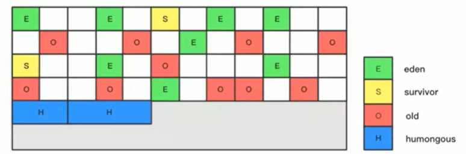

    - G1垃圾收集器还增加了一种新的内存区域，叫做Humongous内存区域，H块。主要用于存储大对象，如果超过0.5个region，就放到H。

    - 设置H的原因：对于堆中的大对象，默认直接会被分配到老年代，但是如果它是一个短期存在的大对象，就会对垃圾收集器造成负面影响。为了解决这个问题，G1划分了一个Humongous区，它用来专门存放大对象。如果一个H区装不下一个大对象，那么G1会寻找连续的H区来存储。为了能找到连续的H区，有时候不得不启动Full GC。G1的大多数行为都把H区作为老年代的一部分来看待。

  - G1垃圾回收过程：主要包括三个环节。

    - 年轻代GC（Young GC）。

      - 应用程序分配内存，当年轻代的Eden区用尽时开始年轻代回收过程；G1的年轻代收集阶段是一个并行的独占式收集器。
      - 在年轻代回收期，G1GC暂停所有应用程序线程（STW），启动多线程执行年轻代回收。然后从年轻代区间移动存活对象到survivor区间或者老年区间，也有可能是两个区间都会涉及。

      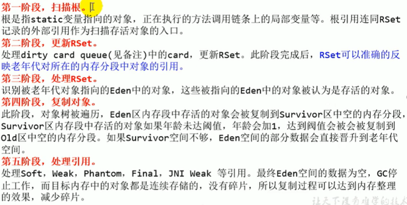

    - 老年代并发标记过程（Concurrent Marking）。

      - 当堆内存使用达到一定值（默认45%）时，开始老年代并发标记过程。

      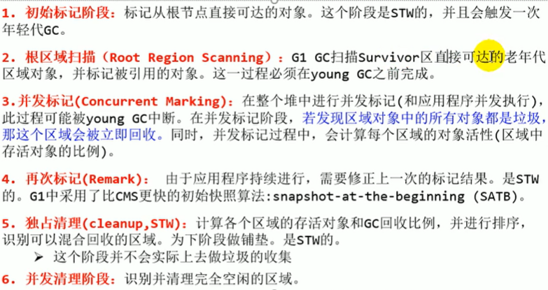

    - 混合回收（Mixed GC）。

      - 标记完成马上开始混合回收过程。对于一个混合回收期，G1GC从老年区间移动存活对象到空闲区间，这些空闲区间也就成为了老年代的一部分。
      - 和年轻代不同，老年代的G1回收器和其他GC不同，G1的老年代回收器不需要整个老年代被回收，一次只需要扫描/回收一小部分老年代的Region就可以了。同时，这个老年代Region是和年轻代一起被回收的。

      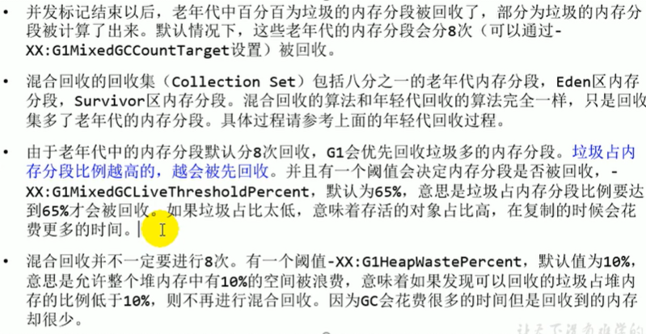

    - （如果需要，单线程、独占式、高强度的FullGC还是继续存在的。它针对GC的评估失败提供了一种失败保护机制，即强力回收）。

      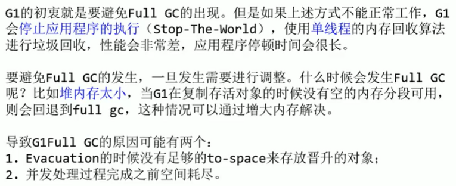

  - Remembered Set：记忆集RSet。

    - 一个Region不可能是孤立的，一个Region中的对象可能被其他任意Region中对象引用，判断对象存活时，需要扫描整个Java堆才能保证准确。

    - 在其他的分代收集器，也存在这样的问题（而G1更突出）回收新生代也不得不同时扫描老年代，这样的话会降低MinorGC的效率。

    - 无论G1还是其他分代收集器，JVM都是使用Remembered Set来避免全局扫描：
      每个Region都有一个对应的Remembered Set。

      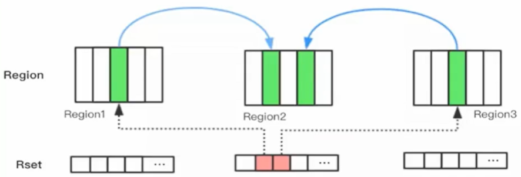

    - 每次Reference类型数据写操作时，都会产生一个Write Barrier（写屏障）暂时中断操作；然后检查将要写入的引用指向的对象是否和该Reference类型数据在不同的Region（对于除G1外的其他收集器：检查老年代对象是否引用了新生代对象）；

    - 如果不同，通过CardTable把相关引用信息记录到引用指向对象的所在Region对应的Remembered Set中；当进行垃圾收集时，在GC根节点的枚举范围加入Remembered Set；就可以保证不进行全局扫描，也不会有遗漏。

    - 将引用信息记录时，会先将引用信息入队到dirty card queue（脏卡表）中，在进行垃圾收集时再更新RSet。这是为了减少RSet进行线程同步的开销。

  - G1优化建议：
  
    - 年轻代大小：
      - 避免使用-xmn或-XX:NewRatio等相关选项显式设置年轻代大小。
      - 固定年轻代的大小会覆盖暂停时间目标。
    - 暂停时间目标不要太过严苛：
      - G1GC的吞吐量目标是90%的应用程序时间和10%的垃圾回收时间
      - 评估G1GC的吞吐量时，暂停时间目标不要太严苛。目标太过严苛表示你愿意承受更多的垃圾回收开销（次数），而这些会直接影响到吞吐量。


- 垃圾回收器总结：

  - 7种经典垃圾回收器：

    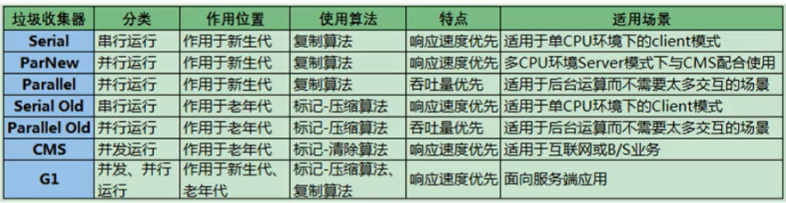

  - GC发展阶段：Serial =>Parallel（并行）=>CMS（并发）=>G1=>ZGC。

  - 怎么选择垃圾收集器？

    1.优先调整堆的大小让JVM自适应完成。

    2.如果内存小于100M，使用串行收集器。

    3.如果是单核、单机程序，并且没有停顿时间的要求，串行收集器。

    4.如果是多CPU、需要高吞吐量、允许停顿时间超过1秒，选择并行或者JVM自己选择。
    5.如果是多CPU、追求低停顿时间，需快速响应（比如延迟不能超过1秒，如互联网应用），使用并发收集器。
    官方推荐G1，性能高。现在互联网的项目，基本都是使用G1。


- ZGC：革命性的。
  - ZGC在尽可能对吞吐量影响不大的前提下，实现在任意堆内存大小下都可以把垃圾收集的停顿时间限制在十毫秒以内的低延迟。
  - ZGC收集器是一款基于Region内存布局的，（暂时）不设分代的，使用了读屏障、染色指针和内存多重映射等技术来实现可并发的标记-压缩算法的，以低延迟为首要目标的一款垃圾收集器。
  - ZGC的工作过程可以分为4个阶段：并发标记-并发预备重分配-并发重分配-并发重映射等。
  - ZGC几乎在所有地方并发执行的，除了初始标记的是STW的。所以停顿时间几乎就耗费在初始标记上，这部分的实际时间是非常少的。


## 3、GC日志

- JVM内存分配与垃圾回收日志：

  - -XX：+PrintGC 输出GC日志。类似：-verbose:gc。
  - -XX：+PrintGCDetails 输出GC的详细日志。
  - -XX：+PrintGCTimeStamps 输出GC的时间戳（以基准时间的形式）。
  - -XX：+PrintGCDatestamps 输出GC的时间戳（以日期的形式，如2013-05-04T21：53：59.234+0800）。
  - -XX：+PrintHeapAtGC在进行Gc的前后打印出堆的信息。
  - -Xloggc：../1ogs/gc.1og 日志文件的输出路径。

- 日志补充说明：

  - "[GC"和”[FullGC"说明了这次垃圾收集的停顿类型，如果有"Full”则说明GC发生了"stop The World"。

  - 使用Serial收集器在新生代的名字是Default New Generation，因此显示的是"[DefNew"。

  - 使用ParNew收集器在新生代的名字会变成”[ParNew”，意思是"Parallel New Generation"。

  - 使用Parallel Scavenge收集器在新生代的名字是"[PSYoungGen"。

  - 老年代的收集和新生代道理一样，名字也是收集器决定的

  - 使用G1收集器的话，会显示为"garbage-first heap"。

  - Allocation Failure表明本次引起GC的原因是因为在年轻代中没有足够的空间能够存储新的数据了。

  - [PSYoungGen：5986K->696K（8704K）]5986K->704K（9216K）
    中括号内：GC回收前年轻代大小，回收后大小，（年轻代总大小）。

    括号外：GC回收前年轻代和老年代大小，回收后大小，（年轻代和老年代总大小）。

  - user代表用户态回收耗时，sys内核态回收耗时，real实际耗时。由于多核的原因，时间总和可能会超过real时间。

- Young GC日志：

  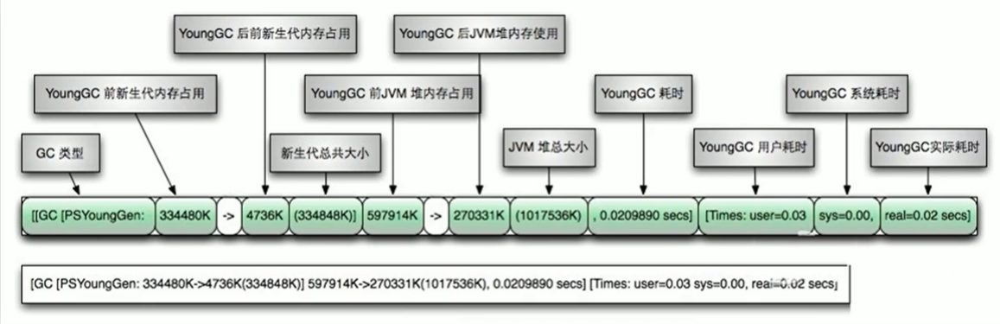

- Full GC日志：

  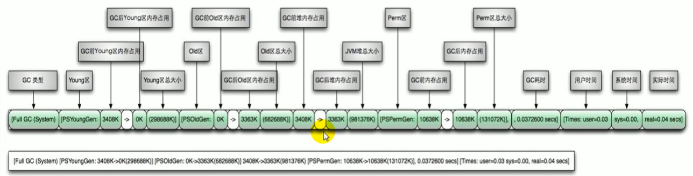


- 从GC日志看不同GC的不同行为：

  - 运行如下代码：

    ```java
    public class GCLog{
    	private static final int _1MB=1024*1024;
        public static void testAllocation(){
            byte[] allocation1,allocation2,allocation3,allocation4;
            allocation1=new byte[2*_1MB];
            allocation2=new byte[2*_1MB];
            allocation3=new byte[2*_1MB];
            allocation4=new byte[4*_1MB];
        }
        public static void main(String[] agrs){
            testAllocation();
        }
    }
    ```

  - JVM内存设置，Eden区8M，S0/S1区1M。

  - 使用Serial GC（JDK8中需指定），先存入三个2M的，当第四个4M的申请内存时，先进行Young GC，发现2M的大小都无法放入S0区，则将前三个直接放入老年代，4M的放入Eden区。

  - 使用Parallel Scavenge GC，先存入三个2M的，当第四个4M的申请内存时，不会发生Young GC，直接将4M的存入老年代。


