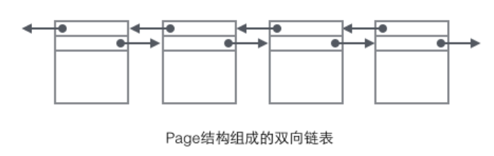
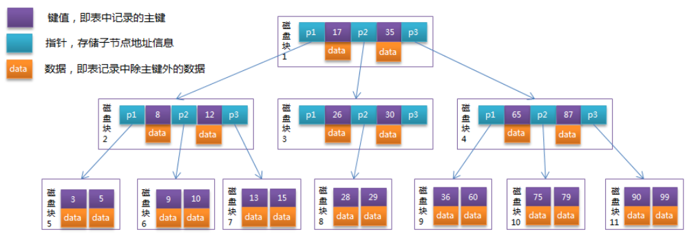
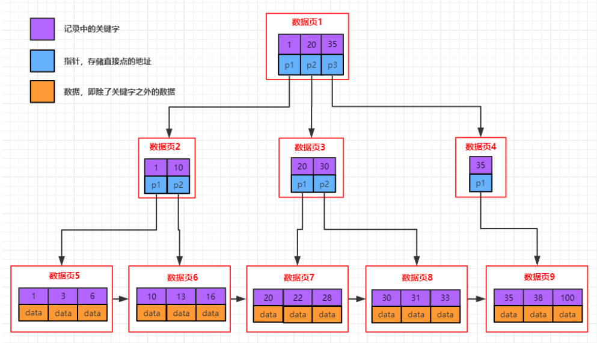
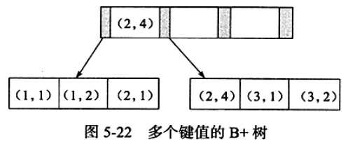
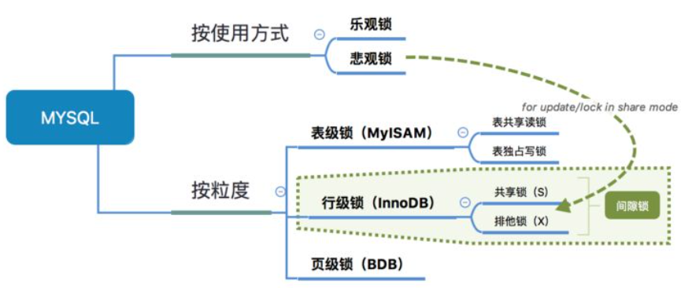

[Java3y索引和锁](https://mp.weixin.qq.com/s?__biz=MzI4Njg5MDA5NA==&mid=2247484721&idx=1&sn=410dea1863ba823bec802769e1e6fe8a&chksm=ebd74430dca0cd265a9a91dcb2059e368f43a25f3de578c9dbb105e1fba0947e1fd0b9c2f4ef&token=1676899695&lang=zh_CN###rd)

MySQL笔记：22篇

[JavaGuide数据索引2](https://snailclimb.gitee.io/javaguide/#/docs/database/数据库索引)

MySQL技术内幕-InnoDB存储引擎

## 1、索引的结构

- 索引的优点：

  - 可以大大加快 数据的检索速度（大大减少的检索的数据量）,  这也是创建索引的最主要的原因。
  - 通过创建唯一性索引，可以保证数据库表中每一行数据的唯一性。
- 索引的缺点：

  - 创建索引和维护索引需要耗费许多时间：当对表中的数据进行增删改的时候，如果数据有索引，那么索引也需要动态的修改，会降低SQL执行效率。
  - 占用物理存储空间 ：索引需要使用物理文件存储，也会耗费一定空间。

- MySQL的基本存储结构是页，记录都存在页里面：

  - mysql中页是innodb中存储数据的基本单位，也是mysql中管理数据的最⼩单位，和磁盘交互的时候都是以页来进⾏的，默认是16kb，mysql中采⽤b+树存储数据，页相当于b+树中的⼀个节点。

    

  - 每个数据页中都可以包含多条数据。同时，在页的Page Header中，还包含有指向上一个和下一个数据页的指针。这样，各个数据页就组成了一个双向链表。

    

  - 而每个数据页中的记录又可以组成一个单向链表：

    - 每个数据页都会为存储在它里边的记录生成一个页目录，在通过主键查找某条记录的时候可以在页目录中使用二分法快速定位到对应的槽，然后再遍历该槽对应分组中的记录即可快速找到指定的记录。
    - 以其他列(非主键)作为搜索条件：只能从最小记录开始依次遍历单链表中的每条记录。

  - 如果我们写 `select * from user where username='xxx'`这样没有进行任何优化的sql语句，默认会这样做：

    - 定位到记录所在的页，需要遍历双向链表，找到所在的页。
    - 从所在的页内中查找相应的记录，由于不是根据主键查询，只能遍历所在页的单链表了。

- B树：

  - 每个节点最多有m个孩子,m称为b树的阶。
  - 除了根节点和叶子节点外，其它每个节点至少有。Ceil(m/2)个孩子。
  - 若根节点不是叶子节点，则至少有2个孩子。
  - 所有叶子节点都在同一层，且包含键值和数据信息。
  - 每个非终端节点包含n个键值信息。
  - 关键字的个数n满足: ceil(m/2)-1 <=n <= m-1ki(i=1,....)为关键字，且关键字升序排序。
  - Pi(i=1..n)为指向子树根节点的指针。P(i-1)指向的子树的所有节点关键字均小于ki，但都大于k(i-1)。

  

  - 总而言之，B树的叶子节点中只包含数据项和数据项对应的键值。
  - 而非叶子节点，首先包含了用于分割范围的键值（升序）和该键值对应的数据项（内部数据）。在n个键值分割出的n+1个范围中，这个节点用n+1个指针指向该结点的n+1个孩子节点。
  - B树定位某个值很快且只需要少量IO操作，但是如果要进行范围检索则需要大量IO操作。

- B+树：

  - 每个结点至多有m个子女。
  - 除根结点外,每个结点至少有[m/2]个子女，根结点至少有两个子女。
  - 有k个子女的结点必有k个键值。
  - 父节点中持有访问子节点的指针。
  - 父节点的键值在子节点中都存在，而且要么是最小值，要么是最大值。如果节点中键值是升序的方式，父节点的键值是子节点的最小值。
  - 最底层的节点是叶子节点。
  - 除叶子节点之外，其他节点不保存数据，只保存键值和指针。
  - 叶⼦节点包含了所有数据的键值以及数据，叶⼦节点之间⽤链表连接起来，可以⾮常⽅便的⽀持范围查找。

  

- b+树与b-树的几点不同：
  1. b+树中一个节点如果有k个键值，最多可以包含k个子节点(k个键值对应k个指针)﹔而b树对应k+1个子节点（多了一个指向子节点的指针)。
  2. b+树除叶子节点之外其他节点只存储键值和指向子节点的指针，而b树还存储了数据，这样同样大小情况下，b+树可以存储更多的键值。
  3. b+树叶子节点中存储了所有键值及数据，并且多个节点用链表连接，从上图中看子节点中数据从左向右是有序的，这样快速可以支撑范围查找（先定位范围的最大值和最小值，然后子节点中依靠链表遍历范围数据)。
  
- B-Tree和B+Tree的优劣比较：
  1. B-Tree因为非叶子结点也保存具体数据，所以在查找某个关键字的时候找到即可返回。而B+Tree所有的数据都在叶子结点，每次查找都得到叶子结点。所以在==同样高度==的B-Tree和B+Tree中, B-Tree查找某个关键字的效率更高。
  2. 由于B+Tree所有的数据都在叶子结点，并且结点之间有指针连接，在找大于某个关键字或者小于某个关键字的数据的时候，B+Tree只需要找到该关键字然后沿着链表遍历就可以了，而B-Tree还需要遍历该关键字结点的根结点去搜索。
  3. 由于B-Tree的每个结点（这里的结点可以理解为一个数据页）都存储主键+实际数据，而B+Tree非叶子结点只存储关键字信息，而每个页的大小有限是有限的，所以同一页能存储的B-Tree的数据会比B+Tree存储的更少。这样==同样总量的数据==，B-Tree的深度会更大，增大查询时的磁盘I/О次数，进而影响查询效率。

- 索引影响数据增删改效率：
  - B+树是一颗平衡树，如果我们对这颗树增删改的话，那肯定会破坏它的原有结构。
  - 要维持平衡树，就必须做额外的工作。正因为这些额外的工作开销，导致索引会降低增删改的速度。

- 联合索引的B+树结构：

  - 联合索引就是指，对表上的多个列进行索引。

  - 本质上来说，联合索引也是一颗B+树，只不过键值的数量不是1，而是大于等于2。例如对于索引(a,b)，键值可能为(2,4)。

  - 与之前一样，键值也是排序的。不过是先按第一个键值排序，再按第二个键值排序。

    

  - 在这种情况下，显然对于a列或(a,b)列进行符合要求的查询是可以使用索引的。但是单独对b列的查询不可以，因为b列的值只在a值相同时是有序的，并不是全局有序的。

- 哈希索引：
  
  - 哈希索引就是采用一定的哈希算法，把键值换算成新的哈希值，检索时不需要类似B+树那样从根节点到叶子节点逐级查找，只需一次哈希算法即可立刻定位到相应的位置，速度非常快。
  - 本质上就是把键值换算成新的哈希值，根据这个哈希值来定位。
  
  - 哈希索引的局限：
    - 哈希索引没办法利用索引完成排序。
    - 不支持最左匹配原则。
    - 在有大量哈希值情况下，哈希索引的效率也是极低的---->哈希碰撞问题。
    - 不支持范围查询。

## 2、索引的分类

- 索引的类型：

  - 主键索引：数据表的主键列使用的就是主键索引。
    - 一张数据表有只能有一个主键，并且主键不能为null，不能重复。
    - 在mysql的InnoDB的表中，当没有显式的指定表的主键时，InnoDB会自动先检查表中是否有非空的唯一索引的字段，如果有，则选择该字段为默认的主键，否则InnoDB将会自动创建一个6Byte的自增主键。

  - 二级索引（辅助索引）：
    - 二级索引的叶子节点存储的数据是主键。也就是说，通过二级索引，可以定位主键的位置。
    - 唯一索引，普通索引，前缀索引等索引属于二级索引。
    - 唯一索引(Unique Key) ：唯一索引也是一种约束。唯一索引的属性列不能出现重复的数据，但是允许数据为NULL，一张表允许创建多个唯一索引。建立唯一索引的目的大部分时候都是为了该属性列的数据的唯一性，而不是为了查询效率。
    - 普通索引(Index) ：普通索引的唯一作用就是为了快速查询数据，一张表允许创建多个普通索引，并允许数据重复和NULL。
    - 前缀索引(Prefix) ：前缀索引只适用于字符串类型的数据。前缀索引是对文本的前几个字符创建索引，相比普通索引建立的数据更小， 因为只取前几个字符。
    - 全文索引(Full Text) ：全文索引主要是为了检索大文本数据中的关键字的信息，是目前搜索引擎数据库使用的一种技术。Mysql5.6之前只有MYISAM引擎支持全文索引，5.6之后InnoDB也支持了全文索引。 

- 聚集索引和非聚焦索引：
  - 聚集索引就是以主键创建的索引。
    - 聚集指的是索引结构与数据一起存放。
    - 优点：查询速度很快。
    - 缺点：依赖于有序的数据；更新的代价大（所以主键一般不更新）。
  - 非聚集索引就是以非主键创建的索引。
    - 非聚集指的是索引结构与数据分开存放。
    - 优点：更新代价比聚集索引低。
    - 缺点：也依赖于有序的数据；可能需要回表二次查询。
  - 非聚集索引在建立的时候未必是单列的，可以多个列来创建索引。
- 区别：

  - 聚集索引在叶子节点存储的是表中的数据。
  - 非聚集索引在叶子节点存储的是主键和索引列。
  - 使用非聚集索引查询出数据时，拿到叶子上的主键再去查到想要查找的数据。(拿到主键再查找这个过程叫做回表)。
- 理解覆盖索引：
  - 如果不是聚集索引，叶子节点存储的是主键+索引列值。最终还是要“回表”，也就是要通过主键再查找一次。这样就会比较慢。
  - 但是如果使用的是覆盖索引，就是我们要的数据就是索引列（或者索引列包含查询列），就不用回表了。

## 3、MySQL中的锁

- 一般情况下，锁是数据库隐式加的：
  - 对于UPDATE 、DELETE 、INSERT语句，InnoDB会自动给涉及数据集加排他锁(X)。
  - MylSAM在执行查询语句SELECT前，会自动给涉及的所有表加读锁，在执行更新操作（UPDATE、DELETE、INSERT等）前，会自动给涉及的表加写锁，这个过程并不需要用户干预。
  
- 从锁的粒度来看：
  - 表锁：开销小，加锁快；不会出现死锁；锁定力度大，发生锁冲突概率高，并发度最低。
  - 行锁：开销大，加锁慢；会出现死锁；锁定粒度小，发生锁冲突的概率低，并发度高。
  - InnoDB行锁和表锁都支持；MylSAM只支持表锁。
  - InnoDB只有通过索引条件检索数据才使用行级锁，否则，InnoDB将使用表锁。
  
- 表锁：
  - 分为表读锁和表写锁。
  - 读读不阻塞，读写阻塞，写写阻塞。
  - 如果某个进程想要获取读锁，同时另外一个进程想要获取写锁。在mysql里边，写锁是优先于读锁的。
  - 写锁和读锁优先级的问题是可以通过参数调节的： `max_write_lock_count`和 `low-priority-updates`。
  - MylSAM可以支持查询和插入操作的并发进行。可以通过系统变量`concurrent_insert`来指定是否启用。
  - 在MyISAM中它默认是：如果MylSAM表中没有空洞(即表的中间没有被删除的行)，MyISAM允许在一个进程读表的同时，另一个进程从表尾插入记录。但是InnoDB存储引擎是不支持的。
  
- 行锁：
  - 行锁也分为读锁（共享锁）和写锁（排它锁），只不过锁的对应是一行数据。
  - 为了允许行锁和表锁共存，实现多粒度锁机制, InnoDB还有两种内部使用的意向锁(Intention Locks），这两种意向锁都是表锁︰
    - 意向共享锁(IS)︰事务打算给数据行加行共享锁，事务在给一个数据行加共享锁前必须先取得该表
      的IS锁。
    - 意向排他锁（IX)︰事务打算给数据行加行排他锁，事务在给一个数据行加排他锁前必须先取得该表的IX锁。
    - 意向锁也是数据库隐式帮我们做了，不需要程序员操心。

- 锁与事务隔离级别：

  - 数据库事务有不同的隔离级别，不同的隔离级别对锁的使用是不同的，**锁的应用最终导致不同事务的隔离级别**。

    - 事务的隔离级别就是**通过锁的机制来实现**，只不过**隐藏了加锁细节**。

  - MVCC(Multi-Version Concurrency Control)多版本并发控制，可以简单地认为：**MVCC就是行级锁的一个变种(升级版)**。

  - 在**表锁中我们读写是阻塞**的，基于提升并发性能的考虑，**MVCC一般读写是不阻塞的**(所以说MVCC很多情况下避免了加锁的操作)。

    - MVCC实现的**读写不阻塞**正如其名：**多版本**并发控制--->通过一定机制生成一个数据请求**时间点的一致性数据快照（Snapshot)**，并用这个快照来提供一定级别（**语句级或事务级**）的**一致性读取**。
- 从用户的角度来看，好像是**数据库可以提供同一数据的多个版本**。
  
- 快照有**两个级别**：
  
    - 语句级
    
    - - 针对于 `Readcommitted`隔离级别。
    
    - 事务级别
    
    - - 针对于 `Repeatableread`隔离级别。
    
    - 语句级指的是每个修改语句都会生成新快照；事务级指的是每个事务中都使用的是事务开始时创建的快照。
  
- 事务隔离级别的锁实现：

  - `Read uncommitted`会出现的现象--->脏读：**一个事务读取到另外一个事务未提交的数据**：
    - 出现脏读的原因是因为在读的时候**没有加读锁**，导致可以**读取出还没释放锁的记录**。
    - 脏读过程：
      - 事务A读取记录(没有加任何的锁)。
      - 事务B修改记录(此时加了写锁，并且还没有commit-->也就没有释放掉写锁)。
      - 事务A再次读取记录(此时因为事务A在读取时没有加任何锁，所以可以读取到事务B还没提交的(没释放掉写锁)的记录。
  - `Read committed`避免脏读的做法：
    - 在读取的时候生成一个版本号，直到其他事务commit，数据被修改了之后，才会有新的版本号。
    - 可重复读过程：
      - 事务A读取了记录(生成版本号)。
      - 事务B修改了记录(此时加了写锁)。
      - 事务A再读取的时候，**是依据最新的版本号来读取的**(当事务B执行commit了之后，会生成一个新的版本号)，如果事务B还没有commit，那事务A读取的还是之前版本号的数据。
  - `Read committed`出现的现象--->不可重复读：**一个事务读取到另外一个事务已经提交的数据**，也就是说一个事务可以看到其他事务所做的修改。
    - `Read committed`是**语句级别**的快照！**每次读取的都是当前最新的版本**。
    - `Repeatable read`避免不可重复读是**事务级别**的快照。每次读取的都是当前事务的版本，即使数据被其他事务修改了，也只会读取当前事务版本的数据。
    - InnoDB的MVCC，是通过在每行记录后面保存两个隐藏的列来实现的。
      - 这两个列，一个保存了行的创建时间，一个保存行的过期时间（或删除时间)。当然存储的并不是实际的时间值,而是系统版本号(system version number) 。
      - 每开始一个新的事务，系统版本号都会自动递增。事务开始时刻的系统版本号会作为事务的版本号。用来和查询到的每行记录的版本号进往比较。
    - InnoDB会根据以下两个条件检查每行记录:
      - 只查找版本早于当前事务版本的数据行(也就是，行的系统版本号小于或等于事务的系统版本号)，这样可以确保事务读取的行，要么是在事务开始前已经存在的，要么是事务自身插入或者修改过的。
      - 行的删除版本要么未定义，要么大于当前事务版本号。这可以确保事务读取到的行，在事务开始之前未被删除。
  - `Repeatable read`出现的现象--->幻读：**是指在一个事务内读取到了别的事务插入的数据，导致前后读取不一致。**
    - MySQL的 `Repeatableread`隔离级别加上GAP间隙锁**已经处理了幻读了**。

- 乐观锁和悲观锁：

  - **丢失更新**：`Repeatable read`隔离级别下，一个事务的更新**覆盖了其它事务的更新结果**。
  - 解决的方法：
    - 使用Serializable隔离级别，事务是串行执行的。
    - 乐观锁。
    - 悲观锁。
  - 悲观锁：
    - 悲观在认为数据冲突是大概率会发生的。
    - 手动加行排它锁`select * from xxxx for update`。
  - 乐观锁：
    - 乐观锁是一种思想，具体实现是，表中有一个版本字段，第一次读的时候，获取到这个字段。处理完业务逻辑开始更新的时候，需要再次查看该字段的值是否和第一次的一样。如果一样则更新，反之拒绝。
    - 之所以叫乐观，因为这个模式没有从数据库加锁，等到更新的时候再判断是否可以更新。
    - 乐观在认为数据冲突是小概率发生的。

- 间隙锁：

  - 间隙锁只会在 `Repeatable read`隔离级别下使用。
  - 当我们**用范围条件检索数据**而不是相等条件检索数据，并请求共享或排他锁时，InnoDB会给**符合范围条件的已有数据记录的索引项加锁**；对于键值在条件范围内但并不存在的记录，叫做“间隙（GAP)”。InnoDB也会对这个“间隙”加锁，这种锁机制就是所谓的间隙锁。
  - InnoDB使用间隙锁的目的有两个：
    - **为了防止幻读**( `Repeatableread`隔离级别下再通过GAP锁即可避免了幻读)。
    - 满足恢复和复制的需要。MySQL的恢复机制要求：**在一个事务未提交前，其他并发事务不能插入满足其锁定条件的任何记录，也就是不允许出现幻读**。

