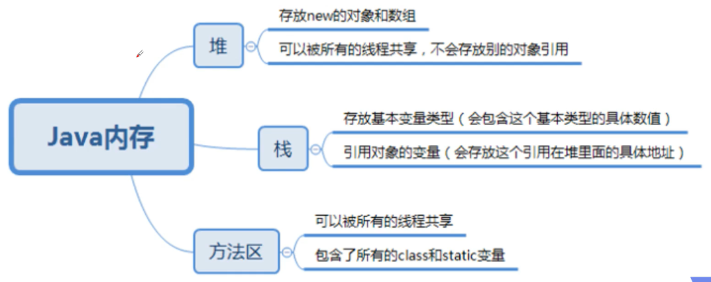
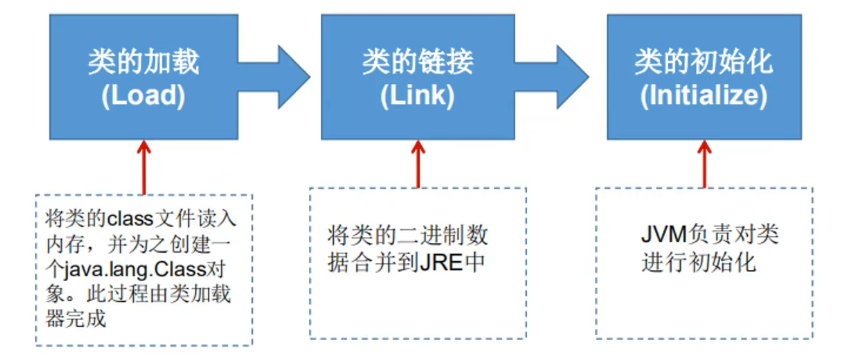
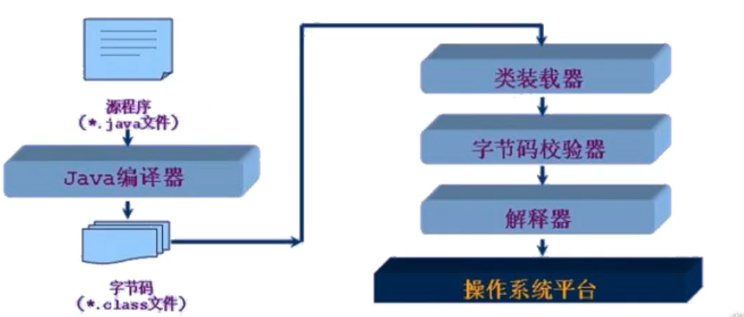

## 1、Junit单元测试

- 测试的分类：
  - 黑盒测试。只需要关注输入的输出，不考虑实现方式。
  - 白盒测试。考虑实现方式，关注执行流程。
- Junit 属于白盒测试：
  1. 定义一个测试类。测试类名最好为 被测试的类名 + Test，放入 test 包中。
  2. 定义测试方法，可以独立运行。方法名最后为 test + 测试的方法名。返回值建议为 void，参数列表建议为空参。
  3. 给方法加`@Test`注解。需要导入 JUnit4 依赖。
- 断言：将所期望的结果和真实结果进行比较。
  - 例如使用`Assert.assertEquals(期望值, 真实值)`方法。
  - 结果不同则测试结果为出错。
- `@Before`注解，该注解修饰的方法会在所有测试方法执行之前被执行。
- `@After`注解，该注解修饰的方法会在所有测试方法执行之后被执行（即使测试方法出错也会被执行）。

## 2、反射

> 将类的各个组成部分封装为其他对象，这被称为反射机制。

- Java 代码在计算机中经历的三个阶段：
  1. javac 编译为 .class 字节码文件。被称为源代码阶段。
  2. 类通过类加载器（ClassLoader）加载进内存，被加载为 Class 类对象。
     - 成员变量封装为 Field[] 对象，构造方法封装为 Construct[] 对象，成员方法封装为 Method[] 对象。这就是反射。
     - 被称为类对象阶段。
  3. 实例化对象。被称为运行阶段。
  
- 反射的好处：
  - 在程序运行的过程中，可以对对象进行操作。
  - 可以解耦，提供程序的可扩展性。
  - 缺点：对性能有影响。使用反射基本上是一种解释操作，我们可以告诉JVM，我们希望做什么并且它满足我们的要求。这类操作总是慢于直接执行相同的操作。
  - 一个类在内存中只有一个class对象。
  - 一个类被加载后，类的整个结构部会被封装在Class对象中。
  - 在Object类中定义了`public final Class getClass()`方法，被所有子类继承。
  
    - 该方法返回值的类型是一个Class类，此类是Java反射的源头，实际上所谓反射从程序的运行结果来看也很好理解，即：可以通过对象反射求出类的名称。
    - Class本身也是一个类。
    - Class对象只能由系统建立对象。
    - 一个加载的类在JVM中只会有一个Class实例。
    - 一个Class对象对应的是一个加载到JVM中的一个.class文件。
    - 每个类的实例都会记得自己是由哪个Class实例所生成。
    - 通过Class可以完整地得到一个类中的所有被加载的结构。
    - Class类是Reflection的根源，针对任何你想动态加载、运行的类，唯有先获得相应的Class对象。
  
- 获取字节码 Class 对象的方式：
  1. 如果是源代码阶段，通过`Class.forName("全类名")`将字节码文件加载进内存，创建并返回 Class 类对象。
     - 多用于配置文件，将类名定义在配置文件中，读取文件加载类。
  2. 如果是类对象阶段，通过`类名.class`属性获取。
     - 多用于参数传递。
  3. 如果是运行阶段，通过`对象.getClass()`方法获取。
     - 多用于对象的获取字节码对象。
  4. 同一个字节码文件（.class）在一次程序运行过程中，只会被加载一次，使用不同方式获取的 Class 对象是同一个。
  
- 类加载内存：

  - Java内存分析：

    

  - 类的加载过程：

    

    - 加载：将class文件字节码内容加载到内存中，并将这些静态数据转换成方法区的运行时数据结构，然后生成一个代表这个类的java.lang.Class对象。
    - 链接：将Java类的二进制代码合并到JVM的运行状态之中的过程。
      - 验证：确保加载的类信息符合JVM规范，没有安全方面的问题。
      - 准备：正式为类变量（static）分配内存并设置类变量默认初始值的阶段，这些内存都将在方法区中进行分配。
      - 解析：虚拟机常量池内的符号引用（常量名）替换为直接引用（地址）的过程。
    - 初始化：
      - 执行类构造器<clinit>（）方法的过程。类构造器<clinit>（）方法是由编译期自动收集类中所有类变量的赋值动作和静态代码块中的语句合并产生的。（类构造器是构造类信息的，不是构造该类对象的构造器）
      - 当初始化一个类的时候，如果发现其父类还没有进行初始化，则需要先触发其父类的初始化。
      - 虚拟机会保证一个类的<clinit>（）方法在多线程环境中被正确加锁和同步。

  - 什么时候会发生类的初始化：

    - 类的主动引用（一定会发生类的初始化）：
      - 当虚拟机启动，先初始化main方法所在的类。
      - new一个类的对象。
      - 调用类的静态成员（除了final常量）和静态方法。
      - 使用java.lang.reflect包的方法对类进行反射调用。
      - 当初始化一个类，如果其父类没有被初始化，则先会初始化它的父类。
    - 类的被动引用（不会发生类的初始化）：
      - 当访问一个静态域时，只有真正声明这个域的类才会被初始化。如：当通过子类引用父类的静态变量，不会导致子类初始化。
      - 通过数组定义类引用，不会触发此类的初始化。
      - 引用常量不会触发此类的初始化（常量在链接阶段就存入调用类的常量池中了）。

  - 类加载器：

    - 类加载的作用：将class文件字节码内容加载到内存中，并将这些静态数据转换成方法区的运行时数据结构，然后在堆中生成一个代表这个类的java.lang.Class对象，作为方法区中类数据的访问入口。

      

    - 类缓存：标准的JavaSE类加载器可以按要求查找类，但一旦某个类被加载到类加载器中，它将维持加载（缓存）一段时间。不过JVM垃圾回收机制可以回收这些Class对象。

- Class 对象的功能：
  - 获取功能：
    - 获取成员变量。
      - `Field[] getFields()`：获取所有public修饰的成员变量。
      - `Field getField(String name)`：获取指定的public修饰的成员变量。
      - `Field[] getDeclaredFields()`：获取所有的成员变量，包括所有修饰符。
      - `Field getFieldDeclared(String name)`：获取指定的成员变量，包括所有修饰符。
    - 获取构造方法。
      - `Constructor<?>[] getConstructors()`：获取所有public的构造方法。
      - `Constructor<?> getConstructor(class<?>...parameterTypes)`：获取指定的public修饰的构造方法。
        - 传入的可变参数是class对象类型，如String和int应传入`String.class`和`int.class`。
      - `Constructor<?>[] getDeclaredConstructor()`：获取所有的构造方法，包括所有修饰符。
      - `Constructor<?> getDeclaredConstructor(class<?>...parameterTypes)`：获取指定的构造方法，包括所有修饰符。
    - 获取成员方法。
      - `Method[] getMethods()`：获取所有public的成员方法。
      - `Method[] getMethod(String name, class<?>...parameterTypes)`：获取指定的public修饰的成员方法。
        - 传入的是方法名称和方法的参数列表。
      - `Method[] getDeclaredMethods()`：获取所有的成员方法。
      - `Method[] getDeclaredMethod(String name, class<?>...parameterTypes)`：获取指定的成员方法。
    - 获取类名。
      - `String getName()`：获取全类名。
  - 获得父类：`Class getSuperclass()`。
  
- 有那些类型有Class对象：

  - class：外部类，成员（成员内部类，静态内部类），局部内部类，匿名内部类。
  - interface：接口。
  - []：数组。
  - enum：枚举。
  - annotation：注解@interface 。
  - primitive type：基本数据类型。
  - void。

- 成员变量对象Field的方法：

  - `Object get(Object o)`：获取成员变量的值。
  - `void set(Object o, Object value)`：设置成员变量的值。
  - `void setAccessible(true)`：访问非公有的成员变量，需要忽略访问权限修饰符的安全检查（暴力反射）。

- 构造方法对象Constructor的方法：

  - `Object newInstance(Object...parameter)`：创建对象。
  - 如果是空参构造，也可以使用Class对象的`newInstance`方法。
  - `void setAccessible(true)`：访问非公有的成员变量，需要忽略访问权限修饰符的安全检查（暴力反射）。

- 成员方法Method对象的方法：

  - `Object invoke(Object o, Object...args)`：传入对应的对象和参数列表的class对象列表。
  - `String getName()`：获取方法名。
  - 所有方法，还包括了这个对象继承的父类中的方法。
  - `void setAccessible(true)`：访问非公有的成员变量，需要忽略访问权限修饰符的安全检查（暴力反射）。

- 反射操作泛型：

  - Java采用泛型擦除的机制来引入泛型，Java中的泛型仅仅是给编译器javac使用的，确保数据的安全性和免去强制类型转换问题，但是，一旦编译完成，所有和泛型有关的类型全部擦除。
  - 为了通过反射操作这些类型，Java新增了 ParameterizedType，GenericArrayType，TypeVariable和WildcardType几种类型来代表不能被归一到Class类中的类型但是又和原始类型齐名的类型。
    - ParameterizedType：表示一种参数化类型，比如Collection<String>。
    - GenericArrayType：表示一种元素类型是参数化类型或者类型变量的数组类型
    - TypeVariable：是各种类型变量的公共父接口。
    - WildcardType：代表一种通配符类型表达式。

- 实例：

  - 需求：利用反射创建一个框架类，在不改变该类的任何代码的情况下，创建任意类的对象，并执行其任意方法。

  - 步骤：

    1. 将需要创建的对象的全类名和需要执行的方法定义在配置文件中。
    2. 在程序中加载读取配置文件。
    3. 利用反射加载类文件进内存。
    4. 创建对象、执行方法。

  - RelectFram.java：

    ```java
    public class ReflectFrame {
        public static void main(String[] args) throws Exception {
            Properties pro = new Properties();
            ClassLoader classLoader = ReflectFrame.class.getClassLoader();
            InputStream inputStream = classLoader.getResourceAsStream("pro.properties");
            pro.load(inputStream);
            String className = pro.getProperty("className");
            String methodName = pro.getProperty("methodName");
            Class cls = Class.forName(className);
            Object obj = cls.newInstance();
            Method method = cls.getMethod(methodName);
            method.invoke(obj);
        }
    }
    ```

  - Person.java：

    ```java
    public class Person {
        private String name;
        public Person() {
        }
        public Person(String name) {
            this.name = name;
        }
        public String getName() {
            return name;
        }
        public void setName(String name) {
            this.name = name;
        }
        public void sleep() {
            System.out.println("sleep");
        }
    }
    ```

  - pro.properties：

    ```pro
    className=cn.iwehdio.domin.Student
    methodName=study
    ```

## 3、注解

> 是一种代码级别的说明，对元素进行说明注释。

- 注解使用：`@注解名称`。

- 注解作用：编写文档、编译检查、代码分析。

- Java中预定义的注解：
  - `@Override`：检测被该注解标注的方法是否继承/实现自父类/接口。
  - `@Deprecated`：该注解标注的内容，表示已过时。
  - `SupperessWarnings("all")`：压制所有警告。
  
- 自定义注解：
  - 格式：
    - 元注解：用于描述注解的注解。
    - `public @interface 注解名{属性列表} `。
  - 本质：
    - `public interface 注解名 extends java.lang.annotation.Annotation{}`
    - 注解是一个接口，继承自`Annotation`接口。
  - 属性：接口中可以定义的抽象方法。
    1. 属性的返回值类型为基本数据类型、String、枚举、注解或以上类型的数组。
    2. 定义了属性，在使用时需要给属性赋值。格式为`@注解(属性名=属性值)`。
    3. 属性可以用`default`指定默认值。
    4. 如果只有一个`value`属性，赋值时可以直接写属性值。
    5. 数组赋值时，使用`{}`。
  - 元注解：
    -  `@Target`：描述注解能够作用的位置。
      - `{ElemntType=枚举值}`：TYPE只能作用于类上，METHOD只能作用在方法上，FIELD只能作用于成员变量上。
    - `@Retention`：描述注解被保留的阶段。
      - RUNTIME会直到运行时被保留，在class字节码文件中并且被JVM读到。
    - `@Docunmented`：描述注解是否被抽取到api文档中。
    - `@Inherited`：描述注解是否被子类继承。
  
- 注解的解析：获取注解中定义的属性值。

  - 注解可以部分替代配置文件。

  1. 获取该类的字节码文件对象：`被注解修饰的类.class`。

  2. 获取注解对象，在内存中生成一个该注解接口的子类实现对象：`getAnnotation(注解名.class)`。

  3. 调用注解对象中的抽象方法，获取返回值。

  4. 实例：

     - Myanno：

       ```java
       @Target({ElementType.TYPE})
       @Retention(RetentionPolicy.RUNTIME)
       public @interface Myanno {
           String className();
           String methodName();
       }
       ```

     - DemoTest:

       ```java
       @Myanno(className = "package cn.iwehdio.annotation;", methodName = "show")
       public class DemoTest {
           public static void main(String[] args) {
               Class<DemoTest> dtClass = DemoTest.class;
               Myanno ma = dtClass.getAnnotation(Myanno.class);
               String classname = ma.className();
               String methodname = ma.methodName();
               System.out.println(classname);
               System.out.println(methodname);
           }
       }
       ```

- 实例：

  - 给所需要测试的方法加上`@check`注解，对所有要测试的方法进行测试，并输出错误日志。

  - check.java：

    ```java
    @Target({ElementType.METHOD})
    @Retention(RetentionPolicy.RUNTIME)
    public @interface check {
    }
    ```

  - caculator.java：

    ```java
    public class calulator {
        @check
        public void mul() {
            System.out.println("1*0=" + (1*0));
        }
        @check
        public void div() {
            System.out.println("1*0=" + (1/0));
        }
    }
    ```

  - demo2.java：

    ```java
    public class demo2 {
        public static void main(String[] args) throws IOException {
            calulator c = new calulator();
            Class cls = c.getClass();
            Method[] methods = cls.getMethods();
    
            int num = 0;
            BufferedWriter bw = new BufferedWriter(new FileWriter("bug.txt"));
    
            for (Method m : methods ) {
                if(m.isAnnotationPresent(check.class)) {
                    try {
                        m.invoke(c);
                    } catch (Exception e) {
                        bw.write("异常出现在" + m.getName());
                        bw.newLine();
                        bw.write("异常名称" + e.getCause().getClass());
                        bw.newLine();
                        bw.write("异常类型" + e.getCause().getMessage());
                        bw.newLine();
                        bw.write("-----------");
                        num++;
                    }
                }
            }
            bw.write("共出现" + num + "次异常");
            bw.newLine();
            bw.flush();
            bw.close();
        }
    }
    ```

  - BUG输出bug.txt：

    ```html
    异常出现在div
    异常名称class java.lang.ArithmeticException
    异常类型/ by zero
    -----------
    共出现1次异常
    ```

    

