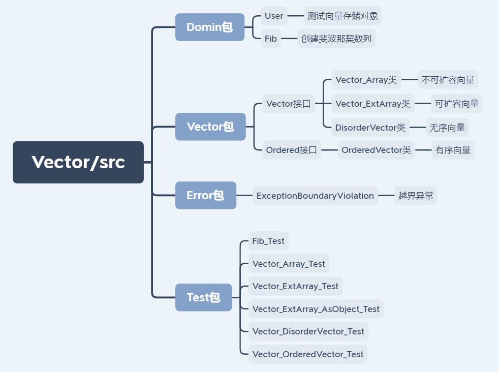
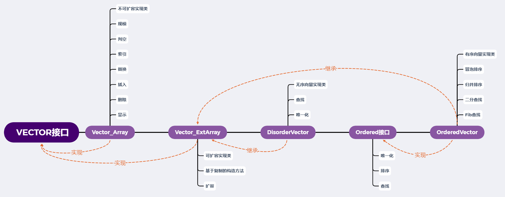

# 2+、向量的Java实现

## 1、项目结构

- 项目结构：

  

- 核心类体系结构与功能：

  

## 2、辅助类

- User：

  ```java
  package Domin;
  public class User {
      private int id;
      private int age;
      private String phoneNumber;
  
      public User(int id, int age, String phoneNumber) {
          this.id = id;
          this.age = age;
          this.phoneNumber = phoneNumber;
      }
      @Override
      public boolean equals(Object o) {
          if (this == o) return true;
          if (o == null || getClass() != o.getClass()) return false;
          User user = (User) o;
          return id == user.id &&
                  age == user.age &&
                  phoneNumber.equals(user.phoneNumber);
      }
      @Override
      public String toString() {
          return "User{id=" + id +
                  ", age=" + age +
                  ", phoneNumber='" + phoneNumber + '\'' +
                  '}';
      }
      public int getId() {
          return id;
      }
      public void setId(int id) {
          this.id = id;
      }
      public int getAge() {
          return age;
      }
      public void setAge(int age) {
          this.age = age;
      }
      public String getPhoneNumber() {
          return phoneNumber;
      }
      public void setPhoneNumber(String phoneNumber) {
          this.phoneNumber = phoneNumber;
      }
  }
  ```

- Fib：

  ```java
  package Domin;
  public class Fib {
      private int[] Arr;
      private int max_num = 5;
      private int N;
      private int n;
      private int index;
      public Fib(int N) {
          Arr = new int[max_num];
          this.N = N;
          this.generateTable();
      }
      private int generateTable(){
          if(this.N <= 0) return -1;
          else if(this.N == 1) {
              Arr[0] = 1;
              return 1;
          }else {
              Arr[0] = 1;
              Arr[1] = 1;
          }
          int i = 1;
          while (Arr[this.n = i++] < this.N) {
              if(i >= max_num) this.expand();
              Arr[i] = Arr[i-1] + Arr[i-2];
          }
          this.index = i;
          this.prev();
          return this.n;
      }
      public int prev(){
          return --this.index;
      }
      public int get(){
          return this.Arr[this.index-1];
      }
      public void show(){
          if(this.n == 0){
              System.out.println("向量为空");
          } else {
              System.out.print("[");
              for (int i = 0; i < this.n; i++) {
                  System.out.print(this.Arr[i] + ", ");
              }
              System.out.println(this.Arr[this.n] + "]");
          }
      }
      private int expand(){
          int new_size = this.max_num * 2;
          int[] B = new int[new_size];
          for(int i = 0; i < this.max_num; i++){
              B[i] = this.Arr[i];
          }
          max_num = new_size;
          this.Arr = B;
          System.out.println("Fib数组扩容完成，最大容量为" + this.max_num);
          return new_size;
      }
  
  }
  ```

- Fib_Test 测试类：

  ```java
  package Test;
  import Domin.Fib;
  public class Fib_Test {
      public static void main(String[] args) {
          int num = 100;
          Fib fib = new Fib(num);
          fib.show();
          System.out.println("最后一项" + fib.get());
          fib.prev();
          System.out.println("前移一项" + fib.get());
      }
  }
  ```

  - 结果为：

    ```html
    Fib数组扩容完成，最大容量为10
    Fib数组扩容完成，最大容量为20
    [1, 1, 2, 3, 5, 8, 13, 21, 34, 55, 89, 144]
    最后一项89
    前移一项55
    ```

    

- ExceptionBoundaryViolation：

  ```java
  package Error;
  public class ExceptionBoundaryViolation extends RuntimeException {
      public ExceptionBoundaryViolation(String error){
          super(error);
      }
  }
  ```

## 3、Vector接口的实现

- Vector接口：

  - 要传入秩作为参数的，都需要考虑下标越界异常。
  - 删除重载了单个元素删除和区间删除。
  - 引入了泛型，但只用于元素输入输出时的类型转换。

  ```java
  import Error.ExceptionBoundaryViolation;
  public interface Vector<T> {
      //规模
      public int getSize();
      //判空
      public boolean isEmpty();
      //索引，有索引输入的都抛出下标越界异常
      public T get(int rank) throws ExceptionBoundaryViolation;
      //替换
      public T replace(int rank, T obj) throws ExceptionBoundaryViolation;
      //插入
      public T insert(int rank, T obj) throws ExceptionBoundaryViolation;
      //删除
      public T remove(int rank) throws ExceptionBoundaryViolation;
      public int remove(int left, int right) throws ExceptionBoundaryViolation;
      //显示
      public void show();
  }
  ```

- Vector_Array 不可扩容向量实现类：

  ```java
  package Vector;
  import Error.ExceptionBoundaryViolation;
  public class Vector_Array<T> implements Vector<T> {
      private final int max_num = 1024;
      private int n = 0;
      private Object[] Array;
      public Vector_Array() {
          Array = new Object[max_num];
          n = 0;
      }
      @Override
      public int getSize() {
          return n;
      }
      @Override
      public boolean isEmpty() {
          return (n == 0)? true : false;
      }
      @Override
      public T get(int rank) throws ExceptionBoundaryViolation {
          if (rank < 0 || rank >= n){
              throw new ExceptionBoundaryViolation("错误0：秩越界");
          }
          return (T)Array[rank];
      }
      @Override
      public T replace(int rank, T new_obj) throws ExceptionBoundaryViolation {
          if (rank < 0 || rank >= n){
              throw new ExceptionBoundaryViolation("错误0：秩越界");
          }
          Object past_obj = Array[rank];
          Array[rank] = new_obj;
          return (T)past_obj;
      }
      @Override
      public T insert(int rank, T obj) throws ExceptionBoundaryViolation {
          if (rank < 0 || rank > n) {     //注意插入时对越界的判断，与n比较没有=号
              throw new ExceptionBoundaryViolation("错误0：秩越界");
          } else if (n + 1 > max_num) {
              throw new ExceptionBoundaryViolation("错误1：容量不足");
          }
          for (int index = n; index > rank; index--) {
              Array[n] = Array[n-1];
          }
          n++;
          Array[rank] = obj;
          return (T)obj;
      }
      @Override
      public T remove(int rank) throws ExceptionBoundaryViolation {
          if(rank < 0 || rank >= n) {
              throw new ExceptionBoundaryViolation("错误0：秩越界");
          }
          Object past_obj = Array[rank];
          for (int index = rank; index < n-1; index++){
              Array[index] = Array[index + 1];
          }
          n--;
          return (T)past_obj;
      }
      @Override
      public int remove(int left, int right){
          if(left == right) return 0;
          while(right < n){
              Array[left++] = Array[right++];
          }
          n = left;
          return right - left;
      }
      @Override
      public void show() {
          if(n == 0){
              System.out.println("向量为空");
          } else {
              System.out.print("[");
              for (int index = 0; index < n-1; index++) {
                  System.out.print(this.get(index) + ", ");
              }
              System.out.println(this.get(n-1) + "]");
          }
      }
  }
  ```

- Vector_ExtArray 可扩容向量实现类：

  - 重载了基于复制区间的构造方法。
  - 扩容方法每次加倍扩容。

  ```java
  package Vector;
  import Error.ExceptionBoundaryViolation;
  
  public class Vector_ExtArray<T> implements Vector<T> {
      //protected 可以在子类中使用
      protected int max_num = 8;      //初始容量
      protected int n = 0;
      protected Object[] Array;
  
      public Vector_ExtArray() {
          Array = new Object[max_num];
          n = 0;
      }
      public Vector_ExtArray(Vector<T> vector, int left, int right) {
          if(left < 0 || right > vector.getSize())
              throw new ExceptionBoundaryViolation("错误2：指定的复制区域错误");
          n = right - left;
          Array = new Object[n];
          for(int i=left, j=0; i<right; i++, j++){
              Array[j] = vector.get(i);
          }
      }
      @Override
      public int getSize() {
          return n;
      }
      @Override
      public boolean isEmpty() {
          return (n == 0)? true : false;
      }
      @Override
      public T get(int rank) throws ExceptionBoundaryViolation {
          if (rank < 0 || rank >= n){
              throw new ExceptionBoundaryViolation("错误0：秩越界");
          }
          return (T)Array[rank];
      }
      @Override
      public T replace(int rank, T new_obj) throws ExceptionBoundaryViolation {
          if (rank < 0 || rank >= n){
              throw new ExceptionBoundaryViolation("错误0：秩越界");
          }
          Object past_obj = Array[rank];
          Array[rank] = new_obj;
          return (T)past_obj;
      }
      @Override
      public T insert(int rank, T obj) throws ExceptionBoundaryViolation {
          if (rank < 0 || rank > n) {     //注意插入时对越界的判断，与n比较没有=号
              throw new ExceptionBoundaryViolation("错误0：秩越界");
          } else if (n == max_num) {
              System.out.println("容量不足,需要扩容");
              this.expand();
          }
          for (int index = n; index > rank; index--) {
              Array[index] = Array[index-1];
          }
          n++;
          Array[rank] = obj;
          return (T)obj;
      }
      @Override
      public T remove(int rank) throws ExceptionBoundaryViolation {
          if(rank < 0 || rank >= n) {
              throw new ExceptionBoundaryViolation("错误0：秩越界");
          }
          Object past_obj = Array[rank];
          for (int index = rank; index < n-1; index++){
              Array[index] = Array[index + 1];
          }
          n--;
          return (T)past_obj;
      }
      @Override
      public int remove(int left, int right){
          if(left == right) return 0;
          while(right < n){
              Array[left++] = Array[right++];
          }
          n = left;
          return right - left;
      }
      @Override
      public void show() {
          if(n == 0){
              System.out.println("向量为空");
          } else {
              System.out.print("[");
              for (int index = 0; index < n-1; index++) {
                  System.out.print(this.get(index) + ", ");
              }
              System.out.println(this.get(n-1) + "]");
          }
      }
      private int expand(){
          int new_size = max_num * 2;
          Object[] B = new Object[new_size];
          for(int index = 0; index < max_num; index++){
              B[index] = Array[index];
          }
          max_num = new_size;
          Array = B;
          System.out.println("扩容完成，最大容量为" + max_num);
          return new_size;
      }
  }
  ```

- Vector_ExtArray_Test 可扩容向量测试：

  ```java
  package Test;
  import Vector.Vector;
  import Vector.Vector_ExtArray;
  public class Vector_ExtArray_Test {
      public static void main(String[] args) {
  
          Vector<Integer> vector = new Vector_ExtArray<Integer>();
          System.out.println("空向量：");
          vector.show();
          System.out.println("判空：" + vector.isEmpty());
          System.out.println("规模：" + vector.getSize());
  
          int num = 10;
          int doAt = 5;
          int new_data = doAt * 2;
          for (int i=0; i < num; i++){
              vector.insert(i, i*i);
          }
          vector.show();
          vector.insert(3, doAt * doAt);
          System.out.println("插入数据后");
          vector.show();
  
          System.out.println("规模：" + vector.getSize());
          System.out.println("在秩为" + doAt + "的数据为：" + vector.get(doAt));
  
          vector.replace(doAt, new_data);
          System.out.println("将在秩为" + doAt + "的数据替换为：" + new_data);
          System.out.println("替换后：");
          vector.show();
  
          vector.remove(doAt);
          System.out.println("将在秩" + doAt + "的数据移除后新数据为：" + new_data);
          System.out.println("删除后：");
          vector.show();
          System.out.println("规模：" + vector.getSize());
  
          int left = 2;
          int rigth = 5;
          System.out.println(left + "到" + rigth + "之间删除");
          vector.remove(left, rigth);
          vector.show();
  
          //测试异常
          vector.get(num + 1);
      }
  }
  ```

  - 结果为：

    ```html
    空向量：
    向量为空
    判空：true
    规模：0
    插入数据后
    [0, 1, 4, 9, 16, 25, 36, 49, 64, 81]
    规模：10
    在秩为5的数据为：25
    将在秩为5的数据替换为：10
    替换后：
    [0, 1, 4, 9, 16, 10, 36, 49, 64, 81]
    将在秩5的数据移除后新数据为：10
    删除后：
    [0, 1, 4, 9, 16, 36, 49, 64, 81]
    规模：9
    Exception in thread "main" Error.ExceptionBoundaryViolation: 错误0：秩越界
    	at Vector.Vector_Array.get(Vector_Array.java:28)
    	at Test.Vector_Array_Test.main(Vector_Array_Test.java:39)
    
    Process finished with exit code 1
    ```

- Vector_ExtArray_AsObject_Test 向量元素为对象测试：

  ```java
  package Test;
  
  import Domin.User;
  import Vector.Vector;
  import Vector.Vector_ExtArray;
  
  public class Vector_ExtArray_AsObject_Test {
      public static void main(String[] args) {
  
          Vector<User> vector = new Vector_ExtArray<User>();
          System.out.println("空向量：");
          vector.show();
          System.out.println("判空：" + vector.isEmpty());
          System.out.println("规模：" + vector.getSize());
  
          int num = 10;
          int doAt = 5;
          User new_data = new User(20, 22, "10086" + Integer.toString(20 * 2));
          for (int i=0; i < num; i++){
              vector.insert(i, new User(i, 22, "10086" + Integer.toString(i * 2)));
          }
          System.out.println("插入数据后");
          vector.show();
  
          System.out.println("规模：" + vector.getSize());
          System.out.println("在秩为" + doAt + "的数据为：" + vector.get(doAt));
  
          vector.replace(doAt, new_data);
          System.out.println("将在秩为" + doAt + "的数据替换为：" + new_data);
          System.out.println("替换后：");
          vector.show();
  
          vector.remove(doAt);
          System.out.println("将在秩" + doAt + "的数据移除后新数据为：" + new_data);
          System.out.println("删除后：");
          vector.show();
          System.out.println("规模：" + vector.getSize());
  
          //测试异常
          vector.get(num + 1);
  
      }
  }
  ```

## 4、无序向量与有序向量

- DisorderVector 无序向量：

  ```java
  package Vector;
  import Error.ExceptionBoundaryViolation;
  public class DisorderVector<T> extends Vector_ExtArray<T>{
  
      public int find(T e, int left, int right){
          if(left < 0 || right > super.n) return -1;      //right是右哨兵节点，可以等于n
          while((left < right--) && (!e.equals(super.Array[right])));
          return right;
      }
      public int find(T e){
          return find(e, 0, super.n);
      }
  
      //唯一化
      public int uniquify(){
          int removeNum = 0;
          for(int index=1 ; index<super.n; index++){       //从第二个元素开始
              int Rank = this.find((T)super.Array[index], 0, index);
              if(Rank != -1){
                  remove(index--);
                  removeNum++;
              }
          }
          return removeNum;
      }
  
      public DisorderVector() {
          super();
      }
  
      @Override
      public T remove(int rank) throws ExceptionBoundaryViolation {
          return super.remove(rank);
      }
  
      @Override
      public int remove(int left, int right) {
          return super.remove(left, right);
      }
  
      @Override
      public int getSize() {
          return super.getSize();
      }
  
      @Override
      public boolean isEmpty() {
          return super.isEmpty();
      }
  
      @Override
      public T get(int rank) throws ExceptionBoundaryViolation {
          return super.get(rank);
      }
  
      @Override
      public T replace(int rank, T new_obj) throws ExceptionBoundaryViolation {
          return super.replace(rank, new_obj);
      }
  
      @Override
      public T insert(int rank, T obj) throws ExceptionBoundaryViolation {
          return super.insert(rank, obj);
      }
  
      @Override
      public void show() {
          super.show();
      }
  }
  ```

- Vector_DisorderVector_Test 无序向量测试：

  ```java
  package Test;
  import Vector.Vector;
  import Vector.DisorderVector;
  public class Vector_DisorderVector_Test {
      public static void main(String[] args) {
  
          DisorderVector<Integer> vector = new DisorderVector<Integer>();
          int num = 10;
          int doAt = 25;
          for (int i=0; i < num; i++){
              vector.insert(i, i*i);
          }
          vector.insert(3, doAt);
          vector.insert(5, doAt);
          vector.insert(7, doAt);
          vector.insert(9, doAt);
          vector.insert(11, 64);
          vector.insert(13, 0);
          System.out.println("插入数据后:");
          vector.show();
  
          System.out.println("寻找数据为" + doAt + "的位置:");
          int Rank = vector.find(doAt);
          System.out.println(Rank);
  
          System.out.println("去重:");
          int removeNum = vector.uniquify();
          vector.show();
          System.out.println("共移除了" + removeNum + "个重复元素");
      }
  }
  ```

  - 结果为：

    ```html
    容量不足,需要扩容
    扩容完成，最大容量为16
    插入数据后:
    [0, 1, 4, 25, 9, 25, 16, 25, 25, 25, 36, 64, 49, 0, 64, 81]
    寻找数据为25的位置:
    9
    去重:
    [0, 1, 4, 25, 9, 16, 36, 64, 49, 81]
    共移除了6个重复元素
    ```

- Ordered 有序接口：

  - 泛型必须已经实现了`compareTo()`方法。

  ```java
  package Vector;
  public interface Ordered<T extends Comparable> {
  
      //唯一化
      public int uniquify();
  
      //冒泡排序
      public void bubbleSort(int left, int right);
      public void bubbleSort();
      //归并排序
      public void mergeSort(int left, int right);
      public void mergeSort();
  
      //二分查找
      public int binsearch(T e, int left, int right);
      public int binsearch(T e);
  
      //Fib查找
      public int fibsearch(T e, int left, int right);
      public int fibsearch(T e);
  }
  ```

- OrderedVector 有序向量：

  - 归并排序要注意，索引后半段向量的起始位置要加 mid，赋值原向量的起始位置要加 left 。

  ```java
  package Vector;
  import Domin.Fib;
  public class OrderedVector<T extends Comparable> extends Vector_ExtArray<T> implements Ordered<T> {
  
      @Override
      public int uniquify() {
          int left = 0;               //双指针
          int right = 0;
          while(++right < super.n){
              if(!super.Array[left].equals(super.Array[right])){
                  super.Array[++left] = super.Array[right];
              }
          }
          super.n = ++left;           //左指针左侧是结果
          return right - left;
      }
  
      @Override
      public void bubbleSort(int left, int right) {
          while (left < (right = bubble(left, right)));
      }
  
      @Override
      public void bubbleSort() {
          bubbleSort(0, super.n);
      }
  
      private int bubble(int left, int right){
          int last = left;
          while (++left < right){
              if(((T)super.Array[left]).compareTo(super.Array[left-1]) == -1){
                  last = left;
                  T temp = (T)super.Array[left-1];
                  super.Array[left-1] = super.Array[left];
                  super.Array[left] = temp;
              }
          }
          return last;
      }
  
      @Override
      public void mergeSort(int left, int right) {
          if(right - left < 2)return;
          int mid = (left + right) >> 1;
          mergeSort(left, mid);
          mergeSort(mid, right);
          merge(left, mid, right);
      }
  
      @Override
      public void mergeSort() {
          mergeSort(0, super.n);
      }
  
      private void merge(int left, int mid, int right) {
          Vector_ExtArray<T> vector = new Vector_ExtArray<T>(this, left, mid);
          int lb = mid - left;
          int lc = right - mid;
          for(int i=0, j=0, k=0; (j<lb) || (k<lc); ) {
              if((j<lb) && (lc<=k || (vector.get(j).compareTo(super.Array[k + mid])<1))){
                  super.Array[left + i++] = vector.get(j++);
              }
              if((k<lc) && (lb<=j || (vector.get(j).compareTo(super.Array[k + mid])==1))){
                  super.Array[left + i++] = super.Array[k++ + mid];
              }
          }
      }
  
      public int binsearch_A(T e, int left, int right) {
          while(left < right){
              int mid = (left + right) >> 1;
              if(e.compareTo(super.Array[mid]) == -1){
                  right = mid;
              } else if(e.compareTo(super.Array[mid]) == 1){
                  left = mid + 1;
              } else {
                  return mid;
              }
          }
          return -1;
      }
      public int binsearch_A(T e) {
          return binsearch_A(e, 0, super.n);
      }
  
      public int binsearch_B(T e, int left, int right) {
          int mid = (left + right) >> 1;
          while(right - left > 1){
              mid = (left + right) >> 1;
              if(e.compareTo(super.Array[mid]) == -1){
                  right = mid;
              } else {
                  left = mid ;
              }
          }
          return (e.equals(super.Array[mid]))? mid : -1;
      }
      public int binsearch_B(T e) {
          return binsearch_A(e, 0, super.n);
      }
  
      @Override
      public int binsearch(T e, int left, int right) {
          while(left < right){
              int mid = (left + right) >> 1;
              if(e.compareTo(super.Array[mid]) == -1){
                  right = mid;
              } else if(e.compareTo(super.Array[mid]) == 1){
                  left = mid + 1;
              }
          }
          return --left;
      }
  
      @Override
      public int binsearch(T e) {
          return binsearch(e, 0, super.n);
      }
  
      @Override
      public int fibsearch(T e, int left, int right) {
          Fib fib = new Fib(right - left);
          int mid;
          while (right - left > fib.get()){
              fib.prev();
              mid = left + fib.get() -1;
              if(e.compareTo(super.Array[mid]) == -1){
                  right = mid;
              } else if(e.compareTo(super.Array[mid]) == 1){
                  left = mid + 1;
              } else {
                  return mid;
              }
          }
          return -1;
      }
  
      @Override
      public int fibsearch(T e) {
          return fibsearch(e, 0, super.n);
      }
  }
  ```

- Vector_OrderedVector_Test 有序向量测试：

  ```java
  package Test;
  
  import Vector.Vector;
  import Vector.OrderedVector;
  import Vector.Vector_ExtArray;
  import java.util.Random;
  
  public class Vector_OrderedVector_Test {
      public static void main(String[] args) {
          OrderedVector<Integer> vector = new OrderedVector<Integer>();
          Random random = new Random();
          int num = 20;
  
          System.out.println("查找：");
          int doAt1 = 3*3;
          int doAt2 = 7*7;
          int doAt3 = 11*11;
          int doAt4 = 15*15;
          for (int i=0; i < num; i++){
              vector.insert(i, i * i);
          }
          System.out.println("插入数据后");
          vector.show();
  
          int Rank = vector.binsearch_A(doAt1);
          System.out.println("binsearch_A:数据" + doAt1 + "在位置" + Rank);
          Rank = vector.binsearch_B(doAt2);
          System.out.println("binsearch_B:数据" + doAt2 + "在位置" + Rank);
          Rank = vector.binsearch_A(doAt3);
          System.out.println("binsearch_C:数据" + doAt3 + "在位置" + Rank);
          Rank = vector.fibsearch(doAt4);
          System.out.println("fibsearch:数据" + doAt4 + "在位置" + Rank);
  
          System.out.println("-------------------------");
          System.out.println("排序：");
          OrderedVector<Integer> vector1 = new OrderedVector<Integer>();
          for (int i=0; i < num; i++){
              vector1.insert(i, random.nextInt(100));
          }
          System.out.println("插入数据后");
          vector1.show();
          System.out.println("冒泡排序：");
          vector1.bubbleSort();
          vector1.show();
  
          OrderedVector<Integer> vector2 = new OrderedVector<Integer>();
          for (int i=0; i < num; i++){
              vector2.insert(i, random.nextInt(100));
          }
          System.out.println("插入数据后");
          vector2.show();
          System.out.println("归并排序：");
          vector2.mergeSort();
          vector2.show();
      }
  }
  ```

  - 结果为：

    ```html
    查找：
    容量不足,需要扩容
    扩容完成，最大容量为16
    容量不足,需要扩容
    扩容完成，最大容量为32
    插入数据后
    [0, 1, 4, 9, 16, 25, 36, 49, 64, 81, 100, 121, 144, 169, 196, 225, 256, 289, 324, 361]
    binsearch_A:数据9在位置3
    binsearch_B:数据49在位置7
    binsearch_C:数据121在位置11
    Fib数组扩容完成，最大容量为10
    fibsearch:数据225在位置15
    -------------------------
    排序：
    容量不足,需要扩容
    扩容完成，最大容量为16
    容量不足,需要扩容
    扩容完成，最大容量为32
    插入数据后
    [89, 17, 15, 88, 80, 95, 93, 57, 21, 93, 67, 69, 30, 79, 84, 5, 19, 6, 70, 2]
    冒泡排序：
    [2, 5, 6, 15, 17, 19, 21, 30, 57, 67, 69, 70, 79, 80, 84, 88, 89, 93, 93, 95]
    容量不足,需要扩容
    扩容完成，最大容量为16
    容量不足,需要扩容
    扩容完成，最大容量为32
    插入数据后
    [39, 89, 73, 24, 3, 57, 54, 83, 11, 81, 30, 42, 24, 78, 29, 73, 48, 31, 7, 38]
    归并排序：
    [3, 7, 11, 24, 24, 29, 30, 31, 38, 39, 42, 48, 54, 57, 73, 73, 78, 81, 83, 89]
    ```


## 5、思考

- 查看课程提供的源码，其提供了更多的接口，用于抽象不同层次的共性。

- 判等器和比较器：

  - Java 不像 C++ 中支持运算符的重载，所以需要调用方法来实现判等和比较。

  - 判等 比较简单，调用 `.equals()` 方法，如果是自定义类型需要在类中重写。在课程源码中，构造了判等器进行格式统一。实际上与直接调用无本质区别。

    ```java
    //判等器接口
    public interface EqualityTester {
       public boolean isEqualTo(Object a, Object b);//若a与b相等，则返回true；否则，返回false
    }
    //默认判等器
    public class EqualityTesterDefault implements EqualityTester {
       public EqualityTesterDefault() {}
       public boolean isEqualTo(Object a, Object b)
       {  return (a.equals(b)); }//使用Java提供的判等器
    }
    ```

  - 比较 相对而言比较麻烦。

    - 第一种方法是，类似于判等，在类型中重写`.compareTo()`方法。但是`.equals()` 方法是有默认实现（即比较对象的地址），但`.compareTo()`方法没有默认实现。

    - 为了让编译器知道，所传入的类型实现了比较方法，该类型需要实现` Comparable`接口，同时传入的泛型也为可比较的类型`<T extends Comparable>`。

    - 只有继承了Comparable接口并重写了compareTo方法，这个类才视为Compareable类,如果值写了compareTo方法，没有明确implement Comparable则其只是一个普通的类。

    - 第一种方法需要更改传入类型的源代码，比较麻烦。第二种方法是，构造比较器，实现`Comparator`接口，这样可以对比较器调用`compare()`方法。在使用时，传入比较器即可。

      ```java
      //比较器接口
      public interface Comparator {
         public int compare(Object a, Object b);//若a>（=或<）b，返回正数、零或负数
      }
      //默认比较器
      public class ComparatorDefault implements Comparator {
         public ComparatorDefault() {}
         public int compare(Object a, Object b) throws ClassCastException {
            return ((Comparable) a).compareTo(b);
         }
      }
      ```

- 排序器：

  - 所有的排序算法都是排序器的一个实现类，Sequence 是继承自向量和列表的接口。

    ```java
    //排序器接口
    public interface Sorter {
       public void sort(Sequence s);
    }
    //冒泡排序
    public class Sorter_Bubblesort implements Sorter {
       private Comparator C;
    
       public Sorter_Bubblesort()
       {  this(new ComparatorDefault()); }
    
       public Sorter_Bubblesort(Comparator comp)
       {  C = comp; }
    
       public void sort(Sequence S) {
           /* 冒泡排序实现 */
       }
    }
    ```

  - 具体的排序实现类中，空参构造使用默认比较器，有参构造使用传入的比较器。

- 调用排序器：

  ```java
  public class Comparator_Test {
      public static void main(String[] args) {
          Sorter_Bubblesort sorter_Bubblesort = new Sorter_Bubblesort();
          int num = 20;
          OrderedVector<Integer> vector = new OrderedVector<Integer>();
          Random random = new Random();
          for (int i=0; i < num; i++){
              vector.insert(i, random.nextInt(100));
          }
          System.out.println("插入数据后");
          vector.show();
          System.out.println("排序：");
          sorter_Bubblesort.sort(vector);
          vector.show();
      }
  }
  ```

- 实现对 User 类的比较器并进行排序：

  - ComparatorAsUser：

    ```java
    public class ComparatorAsUser implements Comparator{
        //User 类的比较器，先比Id大小，再比Age大小，最后是PhoneNumber长度
        @Override
        public int compare(Object a, Object b) {
            int res;
            User user_a = (User) a;
            User user_b = (User) b;
            if (user_a.equals(user_b)) {
                res = 0;
            } else {
                int comForId = Integer.compare(user_a.getId(), user_b.getId());
                if (comForId == 0) {
                    int comForAge = Integer.compare(user_a.getAge(), user_b.getAge());
                    if (comForAge == 0) {
                        res = Integer.compare(user_a.getPhoneNumber().length(), user_b.getPhoneNumber().length());
                    } else {
                        res = comForAge;
                    }
                } else {
                    res = comForId;
                }
            }
            return res;
        }
    }
    ```

  - Comparator_User_Test：

    ```java
    public class Comparator_User_Test {
        public static void main(String[] args) {
            Sorter_Bubblesort sorter_Bubblesort = new Sorter_Bubblesort(new ComparatorAsUser());
            Vector_ExtArray<User> vector = new Vector_ExtArray<User>();
    
            vector.insert(0, new User(5, 19, "13568"));
            vector.insert(1, new User(4, 16, "13568"));
            vector.insert(2, new User(2, 17, "13568"));
            vector.insert(3, new User(1, 11, "13568"));
            vector.insert(4, new User(3, 14, "13568"));
            vector.insert(5, new User(2, 11, "13568"));
            vector.insert(6, new User(3, 20, "13568"));
            vector.insert(6, new User(3, 20, "1356648"));
    
            System.out.println("插入数据后");
            vector.show();
            System.out.println("排序：");
            sorter_Bubblesort.sort(vector);
            vector.show();
        }
    }
    ```

  - 结果为：

    ```java
    插入数据后
    [User{id=5, age=19, phoneNumber='13568'}
    , User{id=4, age=16, phoneNumber='13568'}
    , User{id=2, age=17, phoneNumber='13568'}
    , User{id=1, age=11, phoneNumber='13568'}
    , User{id=3, age=14, phoneNumber='13568'}
    , User{id=2, age=11, phoneNumber='13568'}
    , User{id=3, age=20, phoneNumber='1356648'}
    , User{id=3, age=20, phoneNumber='13568'}
    ]
    排序：
    [User{id=1, age=11, phoneNumber='13568'}
    , User{id=2, age=11, phoneNumber='13568'}
    , User{id=2, age=17, phoneNumber='13568'}
    , User{id=3, age=14, phoneNumber='13568'}
    , User{id=3, age=20, phoneNumber='13568'}
    , User{id=3, age=20, phoneNumber='1356648'}
    , User{id=4, age=16, phoneNumber='13568'}
    , User{id=5, age=19, phoneNumber='13568'}
    ]
    ```

    

- 课程源码中没有使用泛型，所有可能无法对输入的元素进行类型检查。

- 不是很明白对向量和列表接口的继承：Sequence 接口有何意义。

