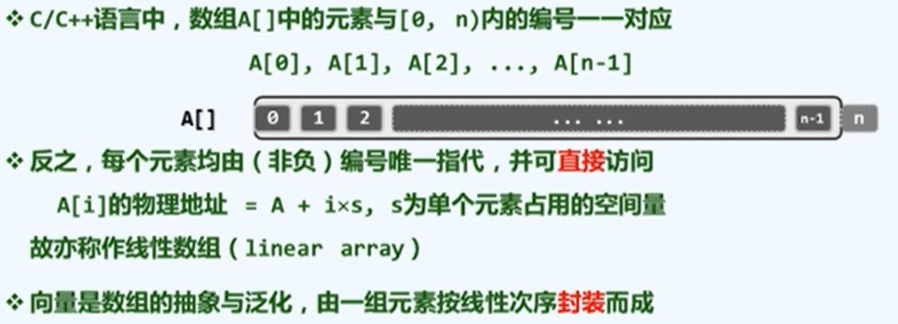
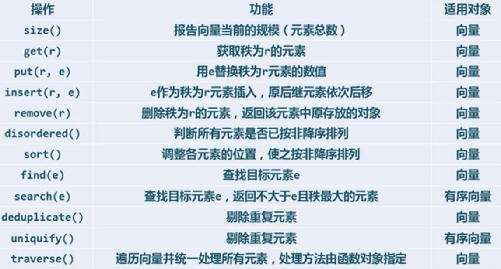
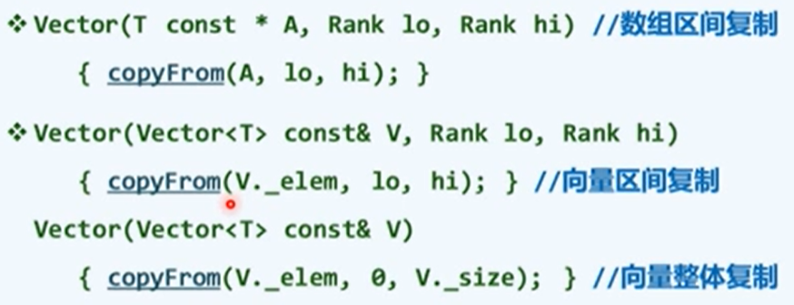
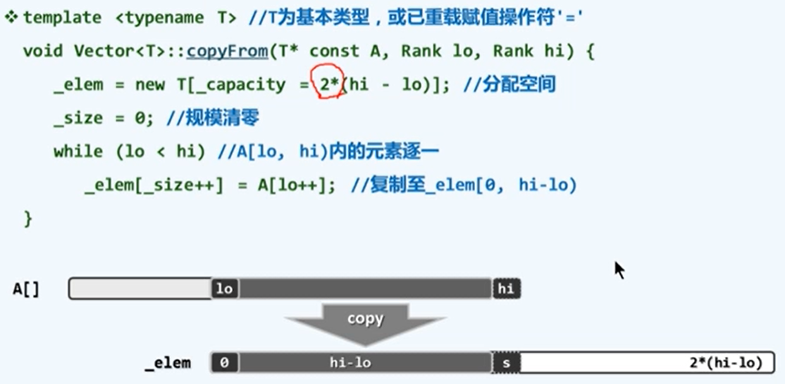
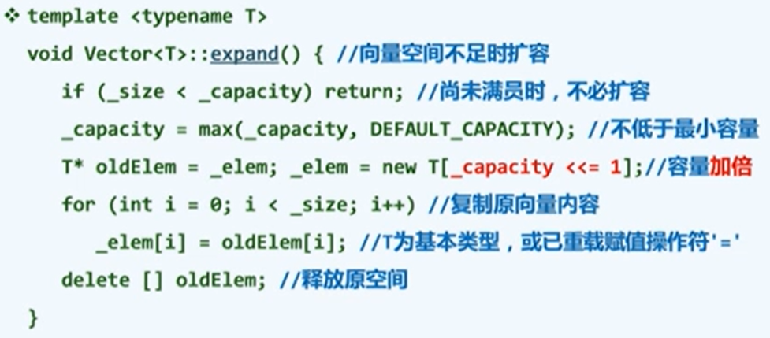
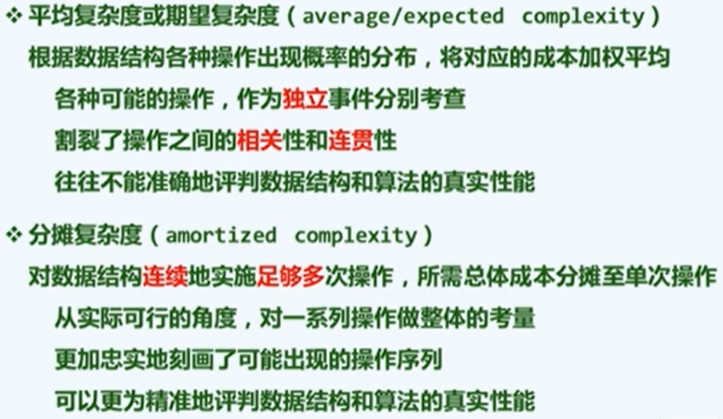
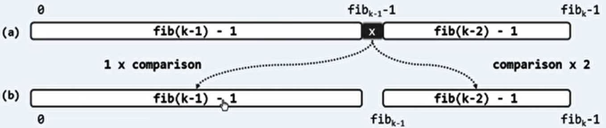
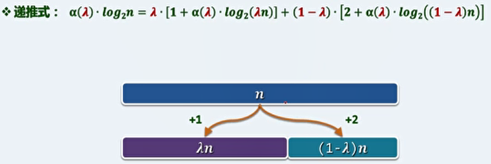
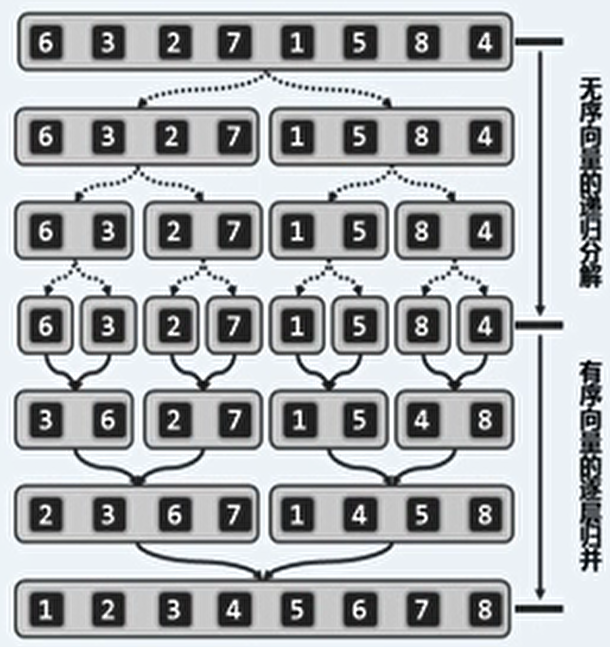

# 2、向量

## 1、接口与实现

> 向量（Vector）是最基本的线性结构，与列表一同称为线性序列。

- 抽象数据类型(abstract data type) = 数据模型 + 定义在该模型上的一组操作。

- 数据结构(data structure) = 基于某种特定语言，实现抽象数据类型的一整套算法。

- 抽象数据类型只关心使用的功能不关心实现即使用者，数据结构关系算法实现即开发者。

- 向量是数组的抽象与泛化，由一组元素按线性次序封装而成。

  - 

  - 各元素与`[0,n)`内的秩一一对应。

  - 元素类型不限于基本类型。

  - 向量 ADT 接口：

    

- Vector模板类

  - 构造：

    ```c++
    Vector (int c = DEFAULT_CAPACITY){
        _elem = new T[_capacity = c]; //默认
        _size = 0;
    }
    ```

    其他重载方法：

    

  -  析构：

    ```c++
    ~Vector(){
        delete [] _elem;	//释放内部空间
    }
    ```

  - 基于复制的构造（copyFrom）：

    

## 2、可扩容向量

- 根据实际需求动态调整容量的原因：

  - 最初的向量采用静态空间管理，并不具有可扩容性。而且可能出现上溢或下溢（装填因子 = 规模 / 容量 << 50%）。
  - 一般的应用环境难以准确预测空间的需求量。

- 动态空间管理：

  - 即将上溢时，适当扩大内部数组的容量。

  - 即将上溢 > 申请新的更大的内存空间 > 将原来的向量内容复制入新的内存空间 > 释放原有的向量的内存空间。

  - 加倍扩容算法实现：

    

  - 容量递增策略：每次扩容增加固定大小的容量。

    - 最坏情况：在初始容量为0的空向量中，连续插入 `n = m*I >> 2`个元素。
    - 总体耗时`O(n^2)`，每次扩容的分摊成本为`O(n)`。效率较低。

  - 容量加倍策略：每次扩容容量翻倍。

    - 最坏情况：在初始容量为1的满向量中，连续插入 `n = 2^m >> 2`个元素。
    - 总体耗时`O(n)`，每次扩容的分摊成本为`O(1)`。损失了一部分空间效率。

  - 分摊复杂度：（如果对单次扩容进行分析，上述两种最坏情况都是`O(n)`）。

    

## 3、有序向量和无序向量

- 无序向量：没有排序，或无法排序的向量。

- 无序向量的操作：

  - 元素访问，下标运算符 [ ] 重载。

    ```c++
    template <typename T>  // 0 <= r < _size
    T &Vector<T>::operator[](Rank r) const {
        return _elem[r];
    } // 返回值为引用，因此 V[r]可同时用于右值的访问和左值的修改。
    ```

  - 插入操作：先判断是否需要扩容。然后从后往前，后继元素顺次后移一个单元。最后插入新元素，返回容量和秩。

    ```c++
    template <typename T>  // 0 <= r < _size
    Rank Vector<T>::insert(Rank r, T const &e){
        expand();
        for(int i=_size; i>r; i--){
            _elem[i] = _elem[i-1];
        }
        _elem[r] = e;
        _size ++;
        return r;
    }
    ```

  - 区间删除：如果要删除区间 [lo, hi) 中的元素，将 [hi,  _size) 中的元素顺次前移 hi - lo 位。最后更新规模，必要时缩容。

    ```c++
    template <typename T>  // 0 <= lo < hi < _size
    int Vector<T>::remove(Rank lo, Rank hi){
        if(lo == hi) return 0;
        while(hi <_size){
            _elem[lo++] = _elem[hi++];
        }
        _size = lo;
        return hi -lo;
    }
    ```

  - 查找：对于无序相邻，泛型 T 必须为可判等的基本类型，或已重载操作符 == 或 ！= 。查找 区间 [lo, hi) 中的元素。

    ```c++
    template <typename T>  // 0 <= lo < hi <= _size
    Rank Vector<T>::find(T const &e, Rank lo, Rank hi) const {					
        //有多个值匹配时返回秩最大的
        while((lo < hi--) && e!=_elem[hi]);	//逆向查找
        return hi;			//如果找到，返回匹配的秩
    }
    ```

    输入敏感：复杂度最好 O(1)，最差 O(n)。

  - 单元素删除：就是删除区间 [ r, r+1 ) ，即区间删除的特例。

    ```c++
    template <typename T>  // 0 <= r < _size
    T Vector<T>::remove(Rank r){
        T e = _elem[r];		//备份
        remove(r, r+1);
        return e;			//返回被删除的元素
    }
    ```

  - 无序向量的唯一化：去重操作。

    - 繁琐版：从头部开始遍历，查找第 i 个元素在其前缀中是否有重复的。如果有重复的则删除这个元素，如果没有则 i++ 。当前元素的后缀长度单调下降并且最终到0。由于 find() 和 remove() 操作每次累加的复杂度为线性，最坏的情况为  O(n^2) 。

  - 遍历操作：对向量中的每个元素分别实施 visit 操作。

    - 局部性修改，函数指针：

      ```c++
      template <typename T>
      void Vector<T>::traverse(void (*visit)(T&)){
          for(int i=0; i<_size; i++)
              visit(_elem[i]);
      }
      ```

    - 全局性修改，函数对象：

      ```c++
      template <typename T> template <typename VST>
      void Vector<T>::traverse(VST& visit){
          for(int i=0; i<_size; i++)
              visit(_elem[i]);
      }
      ```

    - 将向量中的所有元素加一，例：

      ```c++
      template <typename T>
      struct Increase{	// 函数对象：重载运算符 ()
          virtual void operator()(T &e){
              e++;
          }
      }
      template <typename T>
      void increase(Vector<T> &V){
          V.taverse(Increae<T>());
      }
      ```

- 有序向量：相比无序向量，还需要有比较操作，比较是否有大有小。而且其中的元素顺序要按序排列。

- 向量逆序程度的度量：向量逆序对的数目。

- 有序向量的去重操作：

  - 在有序向量中，重复的元素必然相互紧邻构成一个区间。

  - 低效算法：从头部开始，从前往后，逐一比对各对相邻的元素。如果雷同则删除后者，否则转至后一个元素。复杂度为 O(n^2) 。

  - 高效算法：

    - 低效的根源：同一个元素可作为被删除元素的后继多次前移。则可考虑成批的删除和移动。

    - 从头部开始向后扫描，发现雷同者时，一直跳过，直到发现不同元素。然后将不同的元素前移至紧邻于前者右侧。

      ```c++
      template <typename T>
      int Vector<T>::uniquify(){
          Rank i=0, j=0;
          while(++j < _size){		// 边界
              // 没有显式的删除操作，而是直接把不同的元素进行移动。如果调用 remove 方法，仍然不能达到高效率
              if(_elem[i] != _elem[j]) {
                  _elem[++i] = _elem[j];
              }
          }
          _size = ++i;	// 按向量规模删除元素
          return j - i;	//返回被删除的元素数量
      }
      ```

      通过 j 可知共进行 n - 1 次迭代，每次常数时间，时间复杂度为 O(n)。改进策略是一步到位，从全局考虑。

## 4、有序向量的查找算法

- 有序向量的查找功能：

  - 统一接口：

    ```c++
    template <typename T>
    Rank Vector<T>::search(T const &e, Rank lo, Rank hi) const {
        return // 具体的二分查找或Fibonacci插值的结果
    }
    ```

  - 语义约定：

    1. 便于有序向量自身的维护（有序插入）：`V.insert(1 + V.search(e), e)`。即使失败或有重复，也给出插入位置。
    2. 约定返回值为不大于 e 的最右一个元素的秩。
    3. 若 e 小于最小的 lo 上的元素，则返回 lo - 1 （左侧哨兵）。若 e 大于最大的 hi 上的元素，则返回 hi - 1 （右侧哨兵左邻）。
    4. 如果有多个重复元素，则插入到重复元素结束后的下一个位置。

- 有序向量的二分查找功能：版本A——原理：

  - 减而治之：以某一元素 `x=S[mi]` 为界，都可将查找区间分为，该元素的左侧、本身和右侧三部分。

  - 将目标元素 e 与 x 做比较，即可进行进一步处理：

    1. 若 e < x，则 e 若存在在 x 左侧 S[ lo, mi )；
    2. 若 e > x，则 e 若存在在 x 右侧 S( mi, hi )；
    3. 若 e = x，则命中返回。前两种情况递归深入。

  - 二分策略：mi 总是取为中点，每经过至多两次比较，或者命中，或者将问题规模缩减一半。

  - 实现：

    ```c++
    // 版本A
    template <typename T>
    static Rank binsearch(T *A, T const &e, Rank lo, Rank hi){
        while(lo < hi){
            Rank mi = (lo + hi) >> 1;	//向下取整
            if(e < A[mi]) hi = mi;	//多用 < 表示从左到右的顺序意义
            else if(A[mi] < e) lo = mi + 1;	//lo移动到mi的右侧
            else return mi;
        }
        return -1;
    }
    ```

  - 时间复杂度：`O(log n)`：

    - 线性递归：`T(n)=T(n/2)+O(1)=O(log n)`。
    - 递归跟踪：轴点取中的，递归深度 `O(log n)`，各个实例均耗时 `O(1)`。

  - 查找长度：考查关键码的比较次数（ if语句）。

    - 对于版本A，查找成功或失败的平均查找长度大致为`O(1.5log n)`。

  - 改进思路：

    - 转向左、右分支前的关键码比较次数不等，但递归深度却相同。可据此进行优化。
    - 通过递归深度的不均衡，对转向成本的不均衡进行补偿。

- 有序向量的 Fibonacci 查找功能：

  - 原理：如果向量长度为斐波那契数减一，即 n = fib(k) - 1，则可取 mi = fib(k - 1) - 1。这样前、后子向量的长度分别为 fib(k - 1) - 1、fib(k - 2) - 1。

    

  - 这样 Fibonacci 查找的查找长度，在常系数意义上优于二分查找。

  - 实现：

    ```c++
    // Fibonacci 查找
    template <typename T>
    static Rank fibsearch(T *A, Tconst &e, Rank lo, Rank hi){
        Fib fib(hi - lo);	//创建Fib数列
        while(hi - lo < fib.get()){
            fib.prev();		//获取当前项的前一项
            Rank mi = lo + fib.get() - 1;	//黄金比例切分
            if(e < A[mi]) hi = mi;	
            else if(A[mi] < e) lo = mi + 1;	
            else return mi;
        }
        return -1;
    }
    ```

  - fib 查找的最优性：

    - 通用策略，选取的轴点 A[ λn ] 不同，二分查找对应 λ=0.5，fib查找对应 λ=0.6180339...。

    - 平均查找长度实际上是 λ 的函数 α ( λ ) 。

    - 可以构造函数 α ( λ )的递推式，用 λ 表示进入左侧区间的概率：

      

    - 可以由求极值的方法证明，λ 为黄金分割数时， α ( λ )即平均查找长度最小。
  
- 有序向量的二分查找功能：版本B——改进：

  - 改进思路：如果每个分支只有两个方向，则每次只做一次关键码比较即可。

  - 将轴点归入右侧区间：

    - e < x 时进入左侧；
    - e >= x 时进入右侧；
    - 当 hi - lo = 1时，才判断与目标元素是否相等。

  - 实现：

    ```c++
    // 版本B
    template <typename T>
    static Rank binsearch(T *A, Tconst &e, Rank lo, Rank hi){
        while(1 < hi - lo){	//有效长度为1时退出
            Rank mi = (lo + hi) >> 1;	
            (e < A[mi])? hi = mi : lo = mi;
        }
        return (e == A[lo])? lo : -1;
    }
    ```

  - 相比版本A，最好的情况下更坏，最坏的情况下更好，相对比较稳定。

- 有序向量的二分查找功能：版本C——语义约定实现：

  - 实现：

    ```c++
    // 版本C
    template <typename T>
    static Rank binsearch(T *A, Tconst &e, Rank lo, Rank hi){
        while(lo < hi){
            Rank mi = (lo + hi) >> 1;	
            (e < A[mi])? hi = mi : lo = mi + 1;	//左侧区间[lo, mi)，区间右侧(mi, hi)
        }
        return --lo; 		//考虑一些mi的问题
        //循环结束时，lo为大于e的元素的最小秩，故lo - 1即不大于e的元素的最大秩
    }
    ```
  
- 与版本B的差异：
  
    - 查找区间缩短至 0 而并非 1 时，算法才结束。
    - 转入右侧区间时，左边界取 mi + 1 而非 mi 。
  - 实现了约定的返回的秩的语义约定。
  
- 正确性：
  
    - 不变性：总有 A[ 0, lo ) <= e < A[ hi, n ) ，也就是说左边界 lo 的左侧总有 <= e，包括右边界的右侧总有 > e。在查找区间 [ lo, hi ) 之外，lo - 1总是小于 e 的最大者，hi 总是大于 e 的最小者。
    - 单调性：问题的规模递归的成半减小，最后缩减到 1。
    - 最终，lo = hi 将整个区间分为左右两侧，[ 0, lo ) 中的元素总有 <= e，[ lo, n )中的元素总有 > e，则取返回值为[ 0, lo ) 中的最后一个元素 lo - 1。

## 5、排序算法

- 排序器统一接口：

  ```c++
  template <typename T>
  void Vector<T>::sort(Rank lo, Rank hi){
      switch(rand()%5){
          // 冒泡排序（第二章）
          case 1:bubbleSort(lo, hi);break;
          // 选择排序（第二章习题）
          case 2:selectSort(lo, hi);break;
          // 归并排序（第二章）
          case 3:mergeSort(lo, hi);break;
          // 堆排序（第十章）
          case 4:heapSort(lo, hi);break;
          // 快速排序（第十二章）
          case 5:quickSort(lo, hi);break;
      }
  }
  ```

- 冒泡排序的原始思路：

  - 每两个相邻的元素比较大小，并按比较结果决定是否交换位置。对向量进行扫描，这样每次比如会将最大的元素交换至向量末尾。

- 改进思路1：

  - 长度等于扫描次数的向量的末尾部分一定是有序的，但是向量的前缀部分未必是无序的。
  - 可以通过记录向量的前缀部分是否有序（即上一次扫描时是否经过了交换）来改进。
  - 设置一个标志位，记录在上次扫描中是否发生了交换，没有发生交换时表示排序已完成，退出递归。 
  - 时间复杂度与改进前相比，是同底不同高的梯形与三角形的关系。

- 改进思路1的缺陷：

  - 举一个例子，如果一个向量的前缀部分是完全乱序的，而末尾部分是完全顺序的，则浪费了一些操作。
  - 如果取前缀长度是总长度的平方根即 r = √n，则对于改进后的算法需要 O(n\*r) = O(n^1.5) 的时间，而对完全乱序的长度为 r 的向量排序所需的最小时间为 O(√n^2) = O(n) 。说明还有改进空间。

- 改进思路2：

  - 多消耗的时间，是对末尾部分中已经排好序的部分进行了多次无用的扫描。

  - 设置一个标志位 f ，记录在上次扫描中最后一次发生交换的位置，初值为 lo ，记录了最右一对逆序对的位置。然后将 hi 置为 f ，因为 f 的右侧已经是有序的。

  - 实现：

    ```c++
    template <typename T>
    void Vector<T>::bubbleSort(Rank lo, Rank hi){
        // 直到返回的逆序对为初值 lo 时跳出
        while(lo < (hi = bubble(lo, hi)));
    }
    template <typename T>
    Rank Vector<T>::bubble()(Rank lo, Rank hi){
        Rank last = lo;	//记录最右侧的逆序对位置
        while(++lo < hi){	//从左往右扫描
            if(_elem[lo-1] > _elem[lo]){
                last = lo;
                swap(_elem[lo-1],_elem[lo]);
            }
        }
        return last;
    }
    ```

  - 时间复杂度是多个小梯形的面积和，但总面积一定小于等于改进1中的梯形面积。

- 综合评价：

  - 各个改进算法的效率，对于最好情况下为 O(n) ，最坏情况下为 O(n^2) ，与改进前相同。
  - 算法稳定性：输入重复元素时，输出序列的相对次序能否保持不变。
  - 冒泡排序是稳定的，因为只有逆序时即严格大于时才会交换位置。
  - 排序算法的效率上界为 O(n^2) ，下界为  O(nlog n) 。

- 归并排序原理：

  - 运用了分治策略。先将向量一分为二（O(1)），将子序列递归的排序（2\*T(n/2)），最后合并子序列（O(n)）。

  - 线性递归：`T(n)=2*T(n/2)+O(n)`。则时间复杂度为`O(nlog n)`。

  - 例：

    

-  二路归并思路：

  - 只关注向量中最小的第一个元素，取出其中更小的一个（如果相等则任取一个），然后取出元素的后继顶替成为第一个元素。

  - 二路归并的基本实现：

    ```c++
    template <typename T>
    void Vector<T>::merge(Rank lo, Rank mi, Rank hi){
        T* A = _elem + lo;	//合并后的向量A[0, hi-lo) = _elem[lo, hi)
        int lb = mi - lo;	//前子向量B的长度
        T* B = new T[lb];	//创建新的内存空间存储B
        for(Rank i = 0; i < lb; B[i] = A[i++]);
        int lc = hi - mi;	//后子向量C的长度
        T* C = _elem + mi;	//不创建新的内存空间，C存储在原本A的后半部分
        /* i 是所要存入A的索引，j是前子向量B的索引，k是后子向量C的索引。
        当索引j和k均到达末尾时才退出*/ 
        for(Rank i=0, j=0, k=0; (j<lb)||(k<lc);){
            /*当索引j未到达末尾时，进行判断。
            如果 lc<=k，说明C中元素已经全部填入A中。
            如果 B[j]<=C[k]，说明B和C的首元素C中的更大，将B的首元素填入A。
            用 ||，在满足lc<=k时短路B[j]<=C[k]，防止下标越界。
            认为B的末尾的后继存在一个哨兵，值为正无穷。*/
            if((j<lb)&&(lc<=k||(B[j]<=C[k])))
                A[i++] = B[j++];
            if((k<lc)&&(lb<=j||(C[k]<B[j])))
                A[i++] = C[k++];
        }
        delete[] B;
    }
    ```

  - 该循环实现紧凑，但效率不如拆分处理。

  - 算法的正确性，运行中不会出现C中的有用信息被覆盖。

- 归并算法实现：

  ``` c++
  template <typename T>
  void Vector<T>::mergeSort(Rank lo, Rank hi){
      if(hi - lo < 2) return;	//区间只有一个元素，自然有序，递归基
      int mi = (lo + hi) >> 1;	//中点为界
      mergeSort(lo, mi);	//对前半段和后半段排序
      mergeSort(mi, hi);
      merge(lo, mi, hi);	//归并
  ```

- 性能分析：

  - 初始 j = k = 0。最终 j = lb, k = lc 。
  - 每经过一次迭代，j 和 k 中至少有一个会加一，（j + k至少加一）。
  - 推知函数 merge() 中总体迭代不过 O(n) 次，消耗线性时间。
  - 与之前对应，有线性递归方程`T(n)=2*T(n/2)+O(n)`。则时间复杂度为`O(nlog n)`。