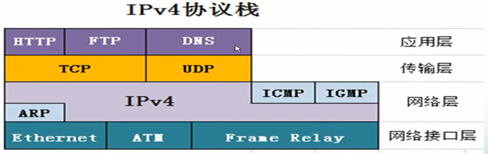
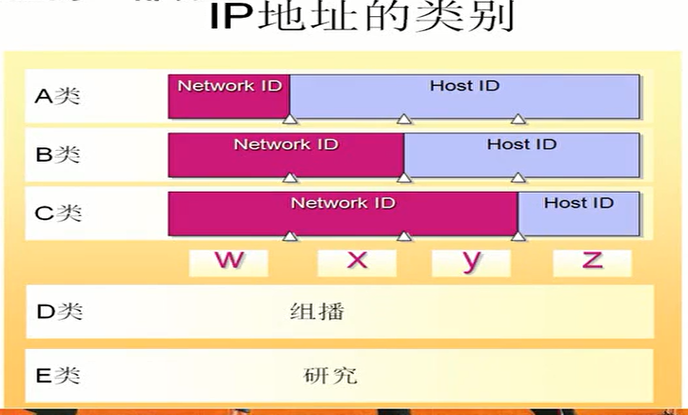
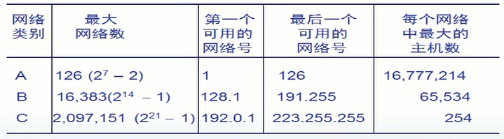
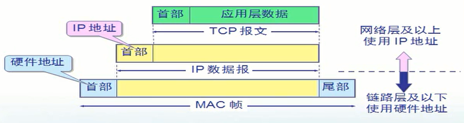
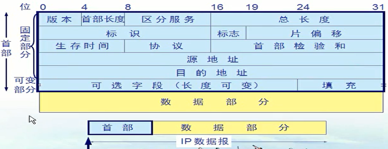
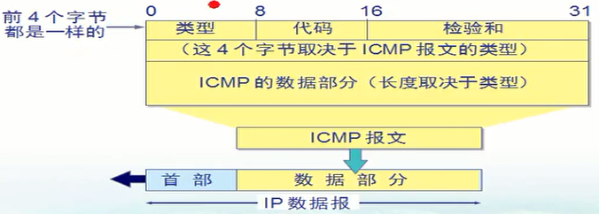

## 1、网络层

- 网络层关注的是，如何将分组从源端沿着网络路径送达目的端。
- 在计算机通信中，可靠交付是由端系统负责的。
- 网络层提供的两种服务：
  - 虚电路服务。
    - 虚电路表示这只是一条逻辑上的连接，分组都沿着这条逻辑连接传送，而不是真正建立了一个连接。
    - 可靠通信由网络保证，可以不写地址。
    - 总是按发送顺序到达终点。
  - 数据报服务。
    - 发送分组前不需要先建立连接，数据包需要写地址，可靠性由用户主机保证。
    - 走那一条路径是路由器临时决定的，分组可能沿着不同路径传送。
    - 不一定按发送顺序到达终点。
    - 目前使用的是数据报服务。

## 2、IP

- 中继系统：
  - 物理层：转发器。
  - 数据链路层：网桥或交换机。
  - 网络层：路由器。
- 网关就是路由器接口的地址，一般设为最后一个数字为1。
- 互联网就是指用路由器互联的网络。
- 虚拟互联网：使用IP协议，使得性能各异的网络从用户看起来是一个统一的网络。
-  网络层协议：
  - 网际协议IP。
  - 地址解析协议ARP。
  - 网际控制报文协议ICMP。
  - 网际组管理协议IGMP。
  - IP协议依赖ARP协议，ICMP和IGMP协议依赖IP协议。
  
  
- IP地址：
  - 层次化IP地址将32位的二进制IP地址分为网络ID和主机ID。每8位二进制被分为一段，共四段。
  
  - 网络地址唯一指定了每个网络。同一网络中每台计算机共享相同的网络地址，并称为自己IP地址的一部分。
  
  - 主机部分不能全1也不能全0。全为0表示网段，全为1表示广播。
  
  - IP地址的分类：
    - A类：前一段为网络部分，后三段为主机地址。网络ID以0开头。
    -  B类：前二段为网络部分，后二段为主机地址。网络ID以10开头。
    - C类：前三段为网络部分，后一段为主机地址。网络ID以110开头。
    - D类：组播地址。以1110开头。
    - E类：研究地址。以1111开头。
    
    
    
    
    
  - 特殊的几个IP地址：
    - 127.0.0.1：本地环回地址。
    - 169.254.0.0：自动获得IP发生错误，Windows自动生成的地址。
    - 10.0.0.0/172.16.0.0~172.31.0.0/192.168.0.0~192.168.255.0：保留的私网地址。
    
  - 子网掩码：
    - 用来指明一个IP地址的那些位是网络地址，那些是主机地址。
    - 方式是与目标IP做与运算。子网掩码为1的位为网络地址，为0的位为主机地址。
    - 默认子网掩码是根据IP的地址的不同分类有关。
    - 发送数据时，子网掩码会与目标IP做与运算，如果不在一个网络地址则发送给路由器，在同一个网络部分则直接发送给目标。
- IP地址将一个C类网络等分为两个子网：
  - 每个子网是原来的一半，子网掩码后移一位，为255.255.255.128。
  - 这样做与运算，主机地址以0开始和以1开始的被分为两个网段，1~126和129~254。
- IP地址将一个C类网络等分为四个子网：
  - 每个子网是原来的四分之一，子网掩码后移两位，为255.255.255.192。
  - 这样做与运算，主机地址以00、01、10开始和以01开始的被分为四个网段，1~62、65~126、129~190和193~254。
- 点到点网络的子网掩码最好是252。也就是该网段中只有两个能用的IP地址。
- 变长子网划分：划分为大小不一的网段，每个网段的子网掩码都不同。
- IP地址将一个B类网络等分为两个子网：
  
  - 每个子网是原来的一半，子网掩码后移一位，为255.255.128.0。
- 利用超网合并网段：
  - 两个计算机物理上在一个网段，但是在两个C类网络里，导致通信效率低。（192.168.0.0和192.168.1.0）
  - IP地址将两个C类网络合并为一个超网：子网掩码前移一位，为255.255.254.0。
- IP地址和MAC地址：
  - 交换机基于数据帧的MAC地址转发数据帧（数据包+MAC源地址和目标地址）。
  - 路由器基于数据包的IP地址转发数据包（数据+IP源地址和目标地址）。
  - IP地址决定了数据包最终发送给谁，MAC地址决定了数据包下一步发送给谁。
  
  
- 基于MAC地址控制代理服务器只能控制本网段的计算机，跨网段只能通过IP地址控制。

- IP数据报：
  - 一个IP数据报由首部和数据两部分组成。
  - 首部固定长度为20字节。首部包括固定部分和可变部分。
  - 固定部分包括：版本、首部长度、区分服务、总长度、表示、标志、片偏移、生存时间（TTL）、协议、首部检验和、源地址和目的地址。
  - 可变部分用来支持排错、测量和安全措施。长度哦那个1到40个字节。
  
  
- 路由：
  - 路由器在不同网段转发数据包，称为数据路由。
  - 网络畅通的条件：沿途路由器必须知道到目标网络下一跳给那个接口，沿途路由器必须知道到源网络下一跳给那个接口。
  - 静态路由：告诉路由器除了直连的网段以外，其他的网段怎么走（路由表）。
  - Windows计算机的网关就是默认路由。

## 3、协议

- ARP协议：
  - 把IP地址解析为MAC地址。
  - ARP欺骗：计算机A要与计算机B通信，计算机C告诉计算机A他的MAC地址，之后每次A与B通信都需要通过C。
  - 逆向ARP（RARP）：计算机用物理地址请求IP地址。

- ICMP协议：
  - 提高IP数据报成功交付的机会，允许报告差错情况。是IP层的协议。
  - 格式：类型 - 代码 - 校验和。
  - 报文种类有两种：差错报告报文和询问报文。
  - ping命令：英特网包探索期，用于测试网络连接量的程序。发送一个ICMP回声请求消息给目的地并报告是否收到所希望的ICMP回声应答。
  - pathping命令：可以跟踪数据包的路径，查看到哪一步不通。
  
  

- IP协议包括RIP协议，OSPF协议和BGP协议。

- RIP协议：
  - 最早的动态路由协议，不需要添加路由表，在自治系统内部。
  - 周期性广播自己所连接的网段。
  - 根据到达某网段的路由器跳数动态选择最短路径。

- OSPF协议：
  - 动态路由协议，开放式最短路径优先协议，在自治系统内部。
  - 选择最短路径依据的是带宽。
  - 支持把整体分为多区域进行路由。
  - 触发式更新：只有当链路状态发生变化时，路由器才向所有路由器发送信息。
  - 维护三个表：邻居表、链路状态表和路由表。

- BGP协议：
  - 外部网关协议。是不同自治系统的路由器之间交换路由信息的协议。
  - 在每个自治系统中都有一个发言人。
  - 交换路由信息数量不多，发言人的数量也不多。

- VPN：
  - 通过广域网数据包中包含局域网数据包来实现访问局域网。
  - VPN拨号拨通后，相当于二者处在同一个局域网。
  - 用隧道技术可以实现站点间虚拟专用网。

- NAT：
  - 网络地址转换技术。
  - PAT：端口地址转换。
  - NAT端口映射（PAT）：将连接到公网的服务器的端口号映射到内网的某个计算机的某个端口，外网通过端口映射可以访问内网该计算机的地址。

- IGMP协议：
  - 组播（多播）管理协议。
  - 管理组播成员。