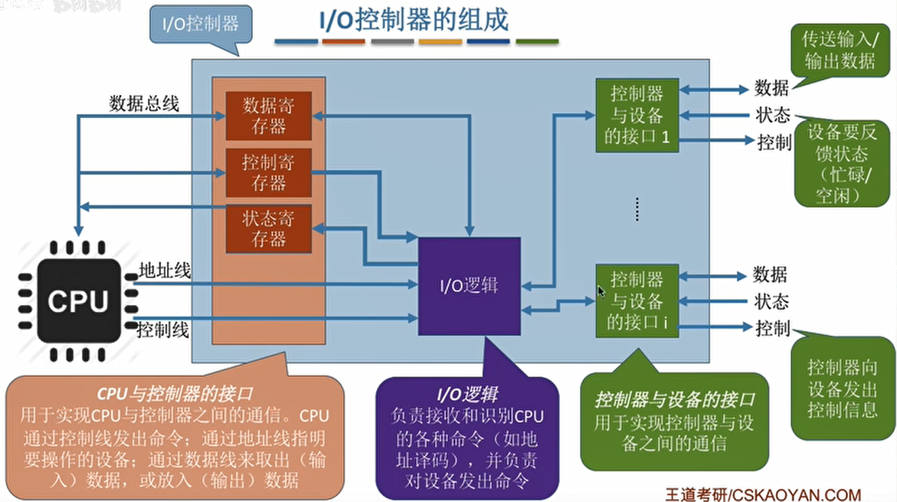
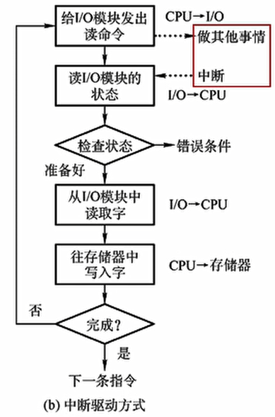
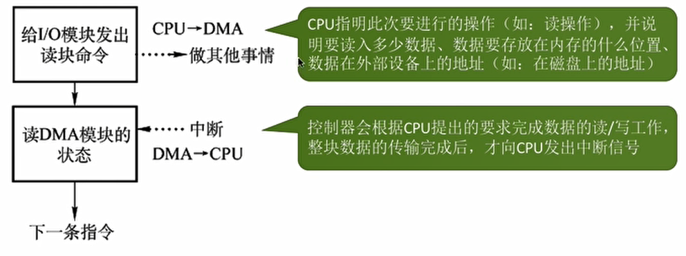
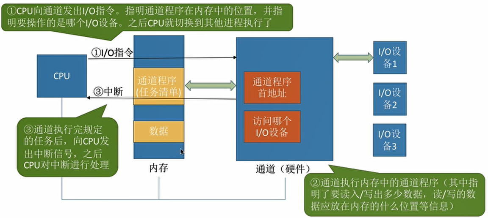
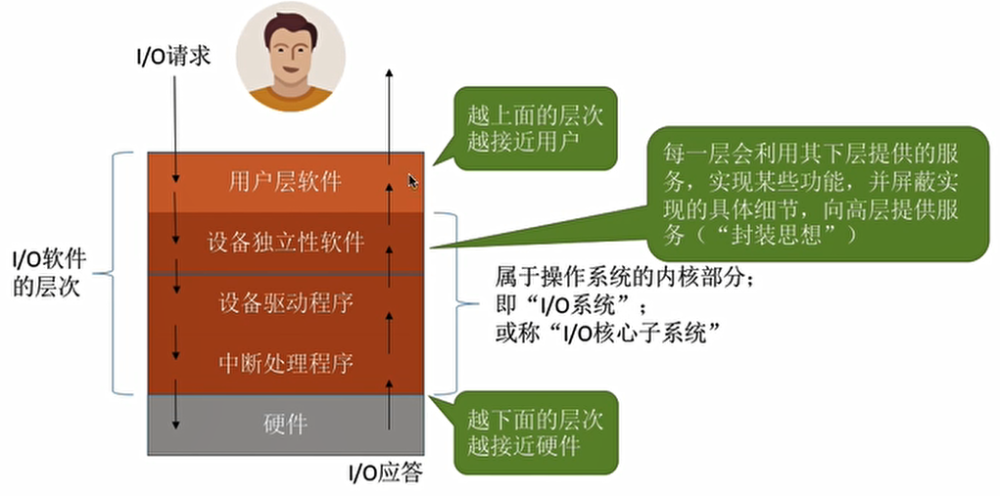
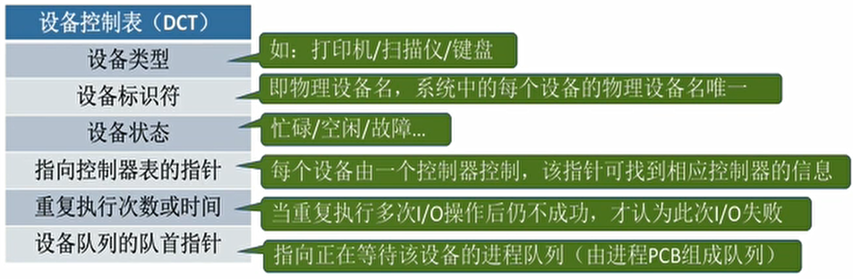
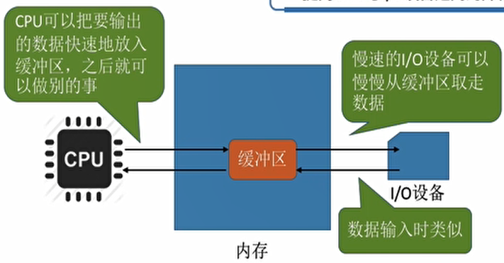

## 1、磁盘

- 磁盘的结构：

  - 磁盘：磁盘的表面由一些磁性物质组成，可以用这些磁性物质来记录二进制数据。
  - 磁道：磁盘的盘面被划分成一个个磁道。这样的个“圈”就是一个磁道。
  - 扇区：一个磁道又被划分成一个个扇区，每个扇区就是一个“磁盘块”。各个扇区存放的数据量相同（如1KB）。
  - 最内侧磁道上的扇区面积最小，因此数据密度最大。
  - 盘面：磁盘由多个盘片摞起来，每个盘片有两个盘面。
  - 柱面：所有盘面中相对位置相同的磁道组成柱面。
  - 可用（柱面号，盘面号，扇区号）来定位任意一个“磁盘块”。

- 如何在磁盘中读写数据：

  - 磁头臂需要把“磁头”移动到想要读/写的扇区所在的磁道。

  - 磁盘会转起来，让目标扇区从磁头下面划过，才能完成对扇区的读/写操作。

  - 根据地址读取一个块：

    1，根据“柱面号”移动磁臂，让磁头指向指定柱面：
    2，激活指定盘面对应的磁头；
    3，磁盘旋转的过程中，指定的扇区会从磁头下面划过，这样就完成了对指定扇区的读/写。

- 磁盘的分类：

  - 磁头可否移动：
    - 磁头可以移动的称为活动头磁盘。磁臂可以来回伸缩来带动磁头定位磁道。
    - 磁头不可移动的称为固定头磁盘。这种磁盘中每个磁道有一个磁头。
  - 盘片是否可更换：固定盘磁盘/可换盘磁盘。

- 一次磁盘读写操作需要的时间：

  - 寻找时间（寻道时间）Ts：在读/写数据前，将磁头移动到指定磁道所花的时间。
    1，启动磁头臂是需要时间的。假设耗时为s；
    2，移动磁头也是需要时间的。假设磁头匀速移动，每跨越一个磁道耗时为m，总共需要跨越n条磁道。

    则：寻道时间Ts =s+ m*n。

  - 延迟时间Tp：通过旋转磁盘，使磁头定位到目标扇区所需要的时间。

    设磁盘转速为r（单位：转/秒，或转/分），则平均所需的延迟时间TR=（1/2）*（1/r）=1/2r。

  - 传输时间T：从磁盘读出或向磁盘写入数据所经历的间。假设磁盘转速为r，此次读/写的字节数为b，每个磁道上的字节数为N，则：传输时间Ta=（1/r）*（b/N）= b/（rN）。

- 磁盘调度算法：

  - 调度算法只会影响寻道时间（移动磁头的时间），延迟时间和传输时间受磁盘转速影响。

  - 先来先服务（FCFS）：

    - 根据进程请求访问磁盘的先后顺序进行调度。
    - 优点：公平；如果请求访问的磁道比较集中的话，算法性能还算过的去。
    - 缺点：如果有大量进程竞争使用磁盘，请求访问的磁道很分散，则FCFS在性能上很差，寻道时间长。

  - 最短寻找时间优先（SSTF）：

    - 优先处理的磁道是与当前磁头最近的磁道。
    - 可以保证每次的寻道时间最短，但是并不能保证总的寻道时间最短。（其实就是贪心算法的思想，只是选择眼前最优，但是总体未必最优）
    - 优点：性能较好，平均寻道时间短。
    - 缺点：可能产生“饥饿”现象。

  - 扫描算法（SCAN）：

    - 结合SSTF算法，但是只有磁头移动到最外侧磁道的时候才能往内移动，移动到最内侧磁道的时候才能往外移动。

    - 优点：性能较好，平均寻道时间较短，不会产生饥饿现象

    - 缺点：

      1，只有到达最边上的磁道时才能改变磁头移动方向，事实上，处理了184号磁道的访问请求之后就不需要再往右移动磁头了。
      2，SCAN算法对于各个位置磁道的响应频率不平均。（如：假设此时磁头正在往右移动，且刚处理过90号磁道，那么下次处理90号磁道的请求就需要等磁头移动很长一段距离；而响应了184号磁道的请求之后，很快又可以再次响应184号磁道的请求了）

  - LOOK调度算法：

    - 结合SCAN算法，如果在磁头移动方向上已经没有别的请求，就可以立即改变磁头移动方向。
    - 优点：比起SCAN算法来，不需要每次都移动到最外侧或最内侧才改变磁头方向，使寻道时间进一步缩短。

  - 循环扫描算法（C-SACN）：

    - 结合SCAN算法，只有磁头朝某个特定方向移动时才处理磁道访问求，而返回时直接快速移动至起始端而不处理任何请求。
    - 优点：比起SCAN来，对于各个位置磁道的响应频率很平均。
    - 缺点：只有到达最边上的磁道时才能改变磁头移动方向。磁头返回时不需要返回到最边缘的磁道。

  - C-LOOK调度算法：

    - 结合LOOK和C-SCAN算法。
    - 优点：比起C-SCAN算法来，不需要每次都移动到最外侧或最内侧才改变磁头方向，使寻道时间进一步缩短。

- 减少磁盘延迟时间的方法：

  - 延迟时间：磁头读入一个扇区数据后需要一小段时间处理，如果逻辑上相邻的扇区在物理上也相邻，则读入几个连续的逻辑扇区，可能需要很长的“延迟时间”。
  - 交替编号：即让逻辑上相邻的扇区在物理上有一定的间隔，可以使读取连续的逻辑扇区所需要的延迟时间更小。
  - 错位命名：让相邻盘面的扇区编号"错位"，原理同交替编号。
  - 磁盘地址结构的设计：为什么磁盘的物理地址是（柱面号，盘面号，扇区号）而不是（盘面号，柱面号，扇区号）：
    - 读取地址连续的磁盘块时，采用（柱面号，盘面号，扇区号）的地址结构可以减少磁头移动消耗的时间。

- 磁盘的管理：

  - 磁盘初始化：
    - 进行低级格式化（物理格式化），将磁盘的各个磁道划分为扇区。一个扇区通常可分为头、数据区域（如512B大小）、尾三个部分组成。管理扇区所需要的各种数据结构一般存放在头、尾两个部分，包括扇区校验码。
    - 将磁盘分区，每个分区由若干柱面组成（即分为我们熟悉的C盘、D盘、E盘）。
    - 进行逻辑格式化，创建文件系统。包括创建文件系统的根目录、初始化存储空间管理所用的数据结构（如位示图、空闲分区表）。
  - 引导块：
    - 计算机开机时需要进行一系列初始化的工作，这些初始化工作是通过执行初始化程序（自举程序）完成的。
    - 完整的自举程序放在磁盘的启动块（即引导块/启动分区）上，启动块位于磁盘的固定位置。拥有引导块的盘称为启动磁盘或系统磁盘（C：盘）。
    - 开机时计算机先运行ROM上的“自举装入程序”，通过执行该程序就可找到引导块，并将完整的“自举程序”读入内存，完成初始化。
  - 坏块的管理：
    - 坏了、无法正常使用的扇区就是“坏块”。这属于硬件故障，操作系统是无法修复的。应该将坏块标记来，以免错误地使用到它。
    - 对于简单的磁盘，可以在逻辑格式化时（建立文件系统时）对整个磁盘进行坏块检查，标明哪些扇区是坏扇区，比如：在FAT表上标明。（在这种方式中，坏块对操作系统不透明）。
    - 对于复杂的磁盘，磁盘控制器（磁盘设备内部的一个硬件部件）会维护一个坏块链表。
    - 在磁盘出厂前进行低级格式化（物理格式化）时就将坏块链进行初始化。会保留一些“备用扇区”，用于替换坏块。这种方案称为扇区备用。且这种处理方式中，坏块对操作系统透明。

## 2、IO设备管理

- I/O设备的概念和分类：

  - "I/O"就是“输入/输出”（Input/output），I/O设备就是可以将数据输入到计算机，或者可以接收计算机输出数据的外部设备，属于计算机中的硬件部件。
  - 按使用特性分类：
    - 人机交互类外部设备。数据传输速度满。
    - 存储设备。数据传输速度快。
    - 网络通信设备。数据传输速度介于上二者之间。
  - 按传输速率分类：
    - 低速设备。
    - 中速设备。
    - 高速设备。
  - 按信息交换的单位分类：
    - 块设备。传输快，可寻址。
    - 字符设备。传输慢，不可寻址，常采用中断驱动方式。

- I/O控制器：

  - 实现CPU对设备的控制。

  - 功能：

    - 接受和识别CPU发出的命令，控制寄存器；
    - 向CPU报告I/O设备的状态，状态寄存器；
    - 数据交换，数据寄存器；
    - 地址识别，区分各个寄存器。

  - 组成：

    - CPU与控制器的接口：用于实现CPU与控制器之间的通信。CPU通过控制线发出命令：通过地址线指明要操作的设备；通过数据线来取出（输入）数据，或放入（输出）数据。
    - I/O逻辑：负责接收和识别CPU的各种命令（如地址译码），并负责对设备发出命令。
    - 控制器与设备的接口：用于实现控制器与设备之间的通信。

    

    - 细节：

      1，一个I/O控制器可能会对应多个设备；
      2，数据寄存器、控制寄存器、状态寄存器可能有多个（如：每个控制/状态寄存器对应一个具体的设备），且这些寄存器都要有相应的地址，才能方便CPU操作。有的计算机会让这些寄存器占用内存地址的一部分，称为内存映像I/O；另一些计算机则采用I/O专用地址，即寄存器独立编址。

- I/O控制方式：

  - 程序直接控制方式：

    - 完成一次读写操作的流程：
      - CPU向控制器发出读指令于是设备启动，并且状态奇存器设为1（未就绪）。
      - 轮询检查控制器的状态（其实就是在不断地执行程序的循环，若状态位一直是1，说明设备还没准备好要输入的数据，于是CPU会不断地轮询）。
      - 输入设备准备好数据后将数据传给控制器，并报告自身状态。
      - 控制器将输入的数据放到数据寄存器中，并将状态改为0（已就绪）。
      - CPU发现设备已就绪，即可将数据寄存器中的内容读入CPU的寄存器中，再把CPU寄存器中的内容放入内存。
      - 若还要继续读入数据，则CPU继续发出读指令。
    - CPU干预的频率：很频繁，I/O操作开始之前、完成之后需要CPU介入，并且在等待I/O完成的过程中CPU需要不断地轮询检查。
    - 数据传送单位：一个字。
    - 数据流向：
      - 读操作（数据输入）：I/O设备 ->  CPU ->  内存。
      - 写操作（数据输出）：内存 -> CPU -> I/O设备。
      - 每个字的读/写都需要CPU的帮助。
    - 优点：实现简单。在读/写指令之后，加上实现循环检查的一系列指令即可（因此才称为“程序直接控制方式"）。
    - 缺点：CPU和I/O设备只能串行工作，CPU需要一直轮询检查，长期处于“忙等”状态，CPU和I/O设备利用率低。

  - 中断驱动方式：

    - 引入中断机制。由于I/O设备速度很慢，因此在CPU发出读/写命令后，可将等待I/O的进程阻塞，先切换到别的进程执行。

    - 当I/O完成后，控制器会向CPU发出一个中断信号，CPU检测到中断信号后，会保存当前进程的运行环境信息，转去执行中断处理程序处理该中断。处理中断的过程中，CPU从I/O控制器读一个字的数据传送到CPU寄存器，再写入主存。接着，CPU恢复等待I/O的进程（或其他进程）的运行环境，然后继续执行。

    - 完成一次读写操作的流程：

      

    - 注意：
      1，CPU会在每个指令周期的末尾检查中断；
      2，中断处理过程中需要保存、恢复进程的运行环境，这个过程是需要一定时间开销的。可见，如果中断发生的频率太高，也会降低系统性能。

    - CPU干预频率：每次I/O操作开始之前、完成之后需要CPU介入。等待I/O完成的过程中CPU可以切换到别的进程执行。

    - 数据传送单位：一个字。

    - 数据流向：

      - 读操作（数据输入）：I/O设备 ->  CPU ->  内存。
      - 写操作（数据输出）：内存 -> CPU -> I/O设备。
      - 每个字的读/写都需要CPU的帮助。

    - 优点：与“程序直接控制方式”相比，在“中断驱动方式”中，I/O控制器会通过中断信号主动报告I/O已完成，CPU不再需要不停地轮询。CPU和I/O设备可并行工作，CPU利用率得到明显提升。

    - 缺点：每个字在I/O设备与内存之间的传输，都需要经过CPU。而频繁的中断处理会消耗较多的CPU时间。

  - DMA方式（直接存储器存储）：

    - 完成一次读写操作的流程：

      

    - CPU干预频率：仅在传送一个或多个数据块的开始和结束时，才需要CPU干预。

    - 数据传送单位：每次读/写一个或多个块（注意：每次读写的只能是连续的多个块，且这些块读入内存后在内存中也必须是连续的）。

    - 数据流向：从设备直接放入内存，或从内存直接到设备。

    - 优点：数据传输以“块”为单位，CPU介入频率进一步降低。数据的传输不再需要先经过CPU再写入内存，数据传输效率进一步增加。CPU和I/O设备的并行性得到提升。

    - 缺点：CPU每发出一条I/O指令，只能读/写一个或多个连续的数据块。

  - 通道控制方式：

    - 通道：一种硬件，可以理解为是“弱版的CPU"。通道可以识别并执行一系列通道指令。

    - 完成一次读写操作的流程：

      

    - CPU干预的频率：极低，通道会根据CPU的指示执行相应的通道程序，只有完成一组数据块的读/写后才需要发出中断信号，请求CPU干预。

    - 数据传送的单位：每次读/写一组数据块。

    - 数据流向：从设备直接放入内存，或从内存直接到设备。

    - 缺点：实现复杂，需要专门的通道硬件支持。

    - 优点：CPU、通道，I/O设备可并行工作，资源利用率很高。

- I/O软件层次结构：

  - 层次结构：

    

  - 用户层软件：

    - 用户层软件实现了与用户交互的接口，用户可直接使用该层提供的、与I/O操作相关的库函数对设备进行操作。
    - 用户层软件将用户请求翻译成格式化的I/O请求，并通过“系统调用”请求操作系统内核的服务。

  - 设备独立性软件：

    - 设备独立性软件，又称设备无关性软件。与设备的硬件特性无关的功能几乎都在这一层实现。
    - 实现的功能：
      - 向上层提供统一的调用接口（如read/write系统调用）。
      - 对设备的保护。
      - 差错处理。
      - 设备的分配与回收。
      - 数据缓冲区管理。
      - 建立逻辑设备名到物理设备名的映射关系：根据设备类型选择调用相应的驱动程序。

  - 设备驱动程序：

    - 主要负责对硬件设备的具体控制，将上层发出的一系列命令（如read/write）转化成特定设备“能听得懂”的一系列操作。包括设置设备寄存器；检查设备状态等。
    - 不同的I/O设备有不同的硬件特性，具体细节只有设备的厂家才知道因此厂家需要根据设备的硬件特性设计并提供相应的驱动程序。

  - 中断处理程序：

    - 当I/O任务完成时，I/O控制器会发送一个中断信号，系统会根据中断信号类型找到相应的中断处理程序并执行。
    - CPU从控制器读出设备状态，根据I/O是否正常结束选择是从设备中读入数据并经由CPU放入内存缓冲区，还是根据异常原因做相应处理。

- I/O核心子系统：

  - 在哪个层次实现：
    - 用户层软件：假脱机技术（SPOOLing技术）。
    - 设备独立性软件：I/O调度、设备保护、设备分配与回收、缓冲区管理。
    
  - I/O调度：
    - 用某种算法确定一个好的顺序来处理各个I/O请求。
    - 调度算法可参考磁盘调度算法。
    
  - 设备保护：
    
    - 参考文件的访问权限。
    
  - 假脱机技术：
    - 什么是脱机技术：
      - 脱离主机（CPU）的控制进行输入/输出操作，而是由外围控制机处理。
      - 假脱机技术：用软件的方式模拟脱机技术。
      - 缓解设备与CPU的速度矛盾，实现预输入、缓输出。
    - 输入井和输出井：模拟脱机输入/输出时的磁带。
    - 输入进程和输出进程：模拟脱机输入/输出时的外围控制机。
    - 输入缓冲区和输出缓冲区：内存中的缓冲区，输入、输出时的"中转站"。
    
  - 设备的分配和回收：
  
    - 设备分配时应考虑的因素：
  
      - 设备的固有属性：独占设备、共享设备、虚拟设备。
      - 设备分配算法：类似将处理机分配给进程。
      - 设备分配中的安全性：
        - 安全分配方式：为进程分配一个设备后就将进程阻塞，本次I/O完成后才将进程唤醒。（破坏了请求和保持条件，不会死锁）
        - 不安全分配方式：进程发出I/O请求后，系统为其分配I/O设备，进程可继续执行，之后还可以发出新的I/O请求。只有某个I/O请求得不到满足时才将进程阻塞。
  
    - 分配方式：
  
      - 静态分配：进程运行前为其分配全部所需资源，运行结束后归还资源。（破坏了请求和保持条件，不会死锁）
      - 动态分配：进程运行过程中动态申请设备资源。
  
    -  分配管理的数据结构：
  
      - 一个通道控制多个控制器，一个控制器控制多个设备。
  
      - 设备控制表（DCT）：系统为每个设备配置一张DCT，用于记录设备情况。
  
        
  
      - 控制器控制表（COCT）：每个设备控制器都会对应一张COCT。操作系统根据CocT的信息对控制器进行操作和管理。
  
      - 通道控制表（CHCT）：每个通道都会对应一张CHCT。操作系统根据CHCT的信息对通道进行操作和管理。
  
      - 系统设备表（SDT）：记录了系统中全部设备的情况，每个设备对应一个表目。
  
    - 设备分配的步骤：
  
      - 根据进程请求的逻辑设备名查找SDT（注：用户编程时提供的逻辑设备名其实就是“设备类型”）
      - 查找SDT，找到用户进程指定类型的、并且空闲的设备，将其分配给该进程。操作系统在逻辑设备表（LUT）中新增一个表项
      - 根据DCT找到CoCT，若控制器忙碌则将进程PCB挂到控制器等待队列中，不忙碌则将控制器分配给进程。
      - 根据COCT找到CHCT，若通道忙碌则将进程PCB挂到通道等待队列中，不忙碌则将通道分配给进程。
      - 只有设备、控制器、通道三者都分配成功时，这次设备分配才算成功，之后便可启动I/O设备进行数据传送。
  
  - 缓冲区管理：
  
    - 缓冲区是一个存储区域，可以由专门的硬件寄存器组成，也可利用内存作为缓冲区。
  
      
  
    - 缓冲区的作用：
  
      - 缓和CPU与I/O设备之间速度不匹配的矛盾；
      - 减少对CPU的中断频率，放宽对CPU中断相应时间的限制；
      - 解决数据粒度不匹配的问题；
      - 提高CPU与I/O设备之间的并行性。
  
    - 缓冲区管理策略：
  
      - 单缓存：假设某用户进程请求某种块设备读入若干块的数据。若采用单缓冲的策略，操作系统会在主存中为其分配一个缓冲区（没有特别说明，一个缓冲区的大小就是一个块）。
      - 当缓冲区数据非空时，不能往缓冲区冲入数据，只能从缓冲区把数据传出；当缓冲区为空时，可以往缓冲区冲入数据，但必须把缓冲区充满以后，才能从缓冲区把数据传出。
      - 双缓存：假设某用户进程请求某种块设备读入若干块的数据。若采用双缓冲的策略，操作系统会在主存中其分配两个缓冲区（没有特别说明，一个缓冲区的大小就是一个块）。
      - 单/双缓冲区在通信时的区别：
        - 若两个相互通信的机器只设置单缓冲区，在任一时刻只能实现数据的单向传输。
        - 若两个相互通信的机器设置双缓冲区，则同一时刻可以实现双向的数据传输。
        - 管道通信中的“管道”其实就是缓冲区。要实现数据的双向传输，必须设置两个管道。
      - 循环缓冲区：将多个大小相等的缓冲区链接成一个循环队列。
      - 缓冲池：由系统中共用的缓冲区组成。这些缓冲区按使用状况可以分为：空缓冲队列、装满输入数据的缓冲队列（输入队列）、装满输出数据的缓冲队列（输出队列）。
      - 根据一个缓冲区在实际运算中扮演的功能不同，又设置了四种工作缓冲区：用于收容输入数据的工作缓冲区（hin）、用于提取输入数据的工作缓冲区（sin）、用于收容输出数据的工作缓冲区（hout）、用于提取输出数据的工作缓冲区（sout）。

