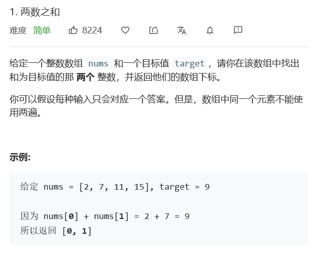

## 1、两数之和

- 题目：

  

- 题解1：

  ```python
  class Solution:
      def twoSum(self, nums: List[int], target: int) -> List[int]:
          d = {}
          for i,num in enumerate(nums):
              if target - num in d:
                  return [d[target - num],i]
              d[num] = i
  ```

  - 用字典模拟哈希表。
  - 从前往后遍历，将值作为字典的键，索引作为字典的值。

- 