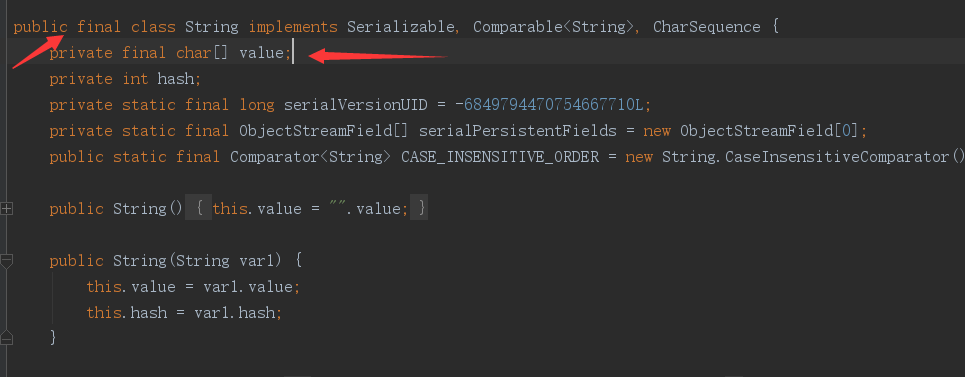
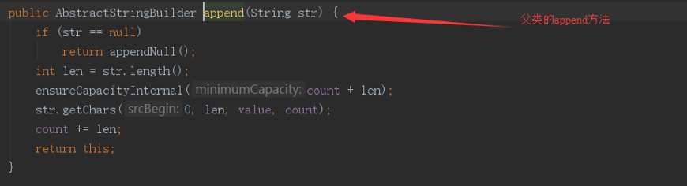

## 1、StringBuilder和StringBuffer

- 学习自https://www.jianshu.com/p/64519f1b1137。

- 数组就分为可变数组和不可变数组。可变数组能够动态插入和删除，而不可变数组一旦分配好空间后则不能进行动态插入或删除操作。

- String类：

  - String是一个不可变的类，属性value为不可变数组。在String初始化时，你定义多少，字符数组的长度就是多少，不存在扩容。

  - 在源码中可以看出，String类被`final`修饰，不可被继承，存储用到的字符数组value也被`final`修饰不可被更改。

    

  - 截取方法`subString()`如果参数为0就返回自身对象，否则就重写创建一个新的对象。

  - 事实上，String类的许多方法都是在内部重新生成一个String对象，所以对String进行操作效率较低。

- StringBuilder类：

  - 内部是一个可变数组，初始化时字符数组的容量为16。

  - StringBuilder继承自AbstractStringBuilder抽象类，很多方法都是调用父类实现。

  - 空参构造方法：调用父类的构造，默认大小为16。

  - 参数为容量的构造方法：自定义初始化容量。

  - 参数为String的构造方法：在传入的数组长度基础上再增加16个字符长度的容量，并将传入字符串`append()`到StringBuilder数组中。

  - 父类的`append()`方法的实现：

    

    1. 首先判断append的参数是否为null。
    2. 其次`ensureCapacityInternal()`方法保证这次append的时候内部数组容量是充足的。
    3. 调用String的`getChars()`方法，将新加入的String复制到StringBuilder数组中（参数为起始点、终点、StringBuilder数组、已有的字符长度）。其实最终调用的是System的`arraycopy()`方法。

- StringBuffer类：

  - 线程安全的高效字符串操作类。
  - `append()`方法加了同步锁，实现线程安全。
  - `toString()`方法引入了缓存`toStringCache`，是一个char数组，多次调用时会先从缓存中取出。但是StringBuffer只要做了更改，该缓存就会置为null。

  

- String 类不可变，内部维护的char[] 数组长度不可变，为final修饰，String类也是final修饰，不存在扩容。字符串拼接，截取，都会生成一个新的对象。频繁操作字符串效率低下，因为每次都会生成新的对象。

-  StringBuilder 类内部维护可变长度char[] ， 初始化数组容量为16，存在扩容， 其append拼接字符串方法内部调用System的native方法，进行数组的拷贝，不会重新生成新的StringBuilder对象。非线程安全的字符串操作类， 其每次调用 toString方法而重新生成的String对象，不会共享StringBuilder对象内部的char[]，会进行一次char[]的copy操作。

- StringBuffer 类内部维护可变长度char[]， 基本上与StringBuilder一致，但其为线程安全的字符串操作类，大部分方法都采用了Synchronized关键字修改，以此来实现在多线程下的操作字符串的安全性。其toString方法而重新生成的String对象，会共享StringBuffer对象中的toStringCache属性（char[]），但是每次的StringBuffer对象修改，都会置null该属性值。


## 2、面试题1.1  判定字符是否唯一

> 判断字符是否唯一：实现一个算法，确定一个字符串 `s` 的所有字符是否全都不同。

- 初始思路：

  - 数组存储已经遍历过的字符，但是这样需要额外的空间和较长的比较时间。

    ```java
    public boolean isUnique(String astr) {
        char[] temp = new char[astr.length()];
        boolean flag = true;
        for(int i=0; i<astr.length();i++) {
            for(char q : temp) {
                if(q == astr.charAt(i)){
                    flag = false;
                    break;
                }
            }
            temp[i] = astr.charAt(i);
        }
        return flag;
    }
    ```

  - 题目提示尽量不要使用额外的空间。时间复杂度O(n^2)。

    ```java
    public boolean isUnique(String str) {
        for(int i=0; i<str.length();i++) {
            for(int j=i+1;j<str.length();j++) {
                if(str.charAt(i)==str.charAt(j)){
                    return false;
                }
            }
        }
        return true;
    }
    ```

- 书上的题解：

  - 假定字符集为ASCII，ASCII码字符个数为128个。

  - 解法1：

    - 构架一个布尔数组，索引值i对应的标记指示该字符串是否含有字母表第i个字符。若这个字符第二次出现，则返回false。时间复杂度O(n)，空间复杂度O(1)。

      ```java
      public boolean isUnique(String str) {
          boolean[] flag = new boolean[128];
          for(int i=0;i<str.length();i++) {
              int val = str.charAt(i);
              if(flag[val]) {
                  return false;
              }
              flag[val] = true;
          }
          return true;
      }
      ```

  - 解法2：使用位运算。

- 力扣题解：

  - 题解1：

    - 由于ASCII码字符个数为128个，而且题目说了如果你不使用额外的数据结构，会很加分。因此可以使用两个64位的long变量来存储是否出现某个字符，二进制位1表示出现过， 0表示未出现过。

      ```java
      public boolean isUnique(String astr) {
          long low64 = 0;
          long high64 = 0;
          for (char c : astr.toCharArray()) {
              if (c >= 64) {
                  long bitIndex = 1L << c - 64;
                  if ((high64 & bitIndex) != 0) {
                      return false;
                  }
                  high64 |= bitIndex;
              } else {
                  long bitIndex = 1L << c;
                  if ((low64 & bitIndex) != 0) {
                      return false;
                  }
                  low64 |= bitIndex;
              }
          }
          return true;
      }
      ```

    - 分别用low64和high64表示低64位和高64位的ACSII码是否出现过。转换为二进制就是，从左往右第n位二进制为1，就说明此字符出现过。

    - 算数运算符优先位运算符，所以`1L << c - 64`表示先减64再左移c-64位。

    - `high64 |= bitIndex`表示将high64赋值为二者按位与的结果。也就是将这位字符也存入high64中。

- 总结：

  - 因为对于是否重复的结果是二值的，所以可以用布尔数组来存储结果。
  - 对于长度有限的问题，可以用long类型的变量进行位运算来替代布尔数组的功能。
  - 注意位运算的优先级最低，在比较时需要加入括号。


## 3、面试题1.2  判定是否为字符重排

> 给定两个字符串，请编写程序，确定其中一个字符串的字符重新排列后，能否变成另一个字符串。

- 初始思路：

  - 是否可以重排，其实就是看两个字符串中的字符类型与个数是否相等。类型与个数都相等的才能进行重排。如果字符串长度不同，怎样也无法重排。
  - 或者说指定两个字符串的标准型，比如都升序排列后是否相等。

- 书上的题解：

  - 题解1：排序。

    ```java
    public boolean CheckPermutation(String s1, String s2) {
        String a1 = stringSort(s1);
        String a2 = stringSort(s2);
        return a1.equals(a2);
    }
    
    public String stringSort(String s) {
        char[] a = s.toCharArray();
        Arrays.sort(a);
        return new String(a);
    }
    ```

  - 题解2：看每个字符的个数是否相等。

    ```java
    public boolean CheckPermutation(String str1, String str2) {
        int[] temp = new int[128];
        if(str1.length()!=str2.length()) {
            return false;
        }
        for(int i=0;i<str1.length();i++) {
            char c = str1.charAt(i);
            temp[c]++;
        }
        for(int i=0;i<str2.length();i++) {
            int c = (int)str2.charAt(i);
            if(--temp[c]<0) {
                return false;
            }
        }
        return true;
    }
    ```

- 总结：

  - Leetcode上可以使用Java的一些类的方法。比如：
    - String转换int：`Integer.parseInt(String)`。
    - StringBuffer的方法：
      - 转换String：`new StringBuffer("")`。
      - 添加方法：`.append("")`。
      - 删除方法：`deleteCharAt(index)`和`delete(start，end)`。
      - 插入方法：`insert(offset,"")`。
      - 反转方法：`reverse()`。
      - 更新方法：`setCharAt(index,"")`。
    - 数组排序：`Array.Sort(a)`。
  - 注意解法2的`--temp[c]<0`的判断。每次找到一个元素，都会将数组中记录该元素出现次数减一，直到减去后小于0说明出现了第一个数组中没出现过或出现过但数量大于第一个数组的。更严谨的说，应该先比较两个字符串长度是否一致。
  - int数组的初始化值为全0。

## 4、面试题1.3  URL化

> URL化。编写一种方法，将字符串中的空格全部替换为%20。假定该字符串尾部有足够的空间存放新增字符，并且知道字符串的“真实”长度。（注：用Java实现的话，请使用字符数组实现，以便直接在数组上操作。）
>

- 初始思路：

  - c创建一个新字符数组，从后往前遍历，遇到字符就复制，遇到空格就填充`%20`。

    ```java
    class Solution {
        public String replaceSpaces(String S, int length) {
            char[] temp = new char[length*3];
            int index = 0;
            char[] chars = S.toCharArray();
            for(int i=0; i<length;i++) {
                if(chars[i] == ' ') {
                    temp[index++] = '%';
                    temp[index++] = '2';
                    temp[index++] = '0';
                } else {
                    temp[index++] = chars[i];
                }
            }
            return new String(temp, 0, index);
        }
    }
    ```

  - 题中说字符串尾部有足够的空间存放新增字符，也就是说题目希望在原有字符串上修改。

  - 可以先遍历一遍字符数组，找出字符数组中有几个空格，然后从后往前，每个字符按照其前边的空格个数向后移动。

    ```java
    class Solution {
        public String replaceSpaces(String S, int length) {
            char[] s = S.toCharArray();
            int size;
            int i;
            int count = 0;
            for(i=0; i<length;i++) {
                if(' ' == s[i]) {
                    count += 1;
                }
            }
            size = i + count * 2;
            for(i-=1;i>=0;i--) {
                if(s[i]!=' ') {
                    s[i+count*2] = s[i];
                } else {
                    s[i+count*2] = '0';
                    s[i+count*2-1] = '2';
                    s[i+count*2-2] = '%';
                    count -= 1;
                }
            }
            return new String(s, 0, size);
        }
    }
    ```

    - 但是时间反而比第一种方法变长了。
    - 注意返回时如果字符串末尾还有空格需要进行截断，也就是计算size的意义。

- 书上的题解：

  - 处理字符串操作问题时，常见做法是从字符串尾部开始编辑，从后往前反向操作。这种做法很有用，因为字符串尾部有额外的缓冲，可以直接修改，不必担心会覆写原有数据。
  - 进行两次扫描。第一次扫描先数出字符串中有多少空格，从而算出最终的字符串有多长。第二次扫描才真正开始反向编辑字符串。检测到空格则将%20复制到下一个位置，若不是空白，就复制原先的字符。
  - 与上边第二种解法基本相同。

- 力扣题解：实际上不符合使用字符数组的题意。

  - 使用StringBuilder：

    ```java
    class Solution {
        public String replaceSpaces(String S, int length) {
            StringBuilder sb = new StringBuilder();
            for(int i = 0; i < length; i++){
                if(S.charAt(i) == ' '){
                    sb.append("%20");
                }else{
                    sb.append(S.charAt(i));
                }
            }
            return sb.toString();
        }
    }
    ```

  - 使用String内部方法：

    ```java
    class Solution {
        public String replaceSpaces(String S, int length) {
            return S.substring(0, length).replaceAll(" ", "%20");
        }
    }
    ```


## 5、面试题1.4  回文排列

> 给定一个字符串，编写一个函数判定其是否为某个回文串的排列之一。回文串是指正反两个方向都一样的单词或短语。排列是指字母的重新排列。回文串不一定是字典当中的单词

- 初始思路：

  - 先说什么情况下会是一个回文排列：需要对字符种类进行计数，最多只能有一个字符的个数是奇数。

  - 所以其实转换为了计数问题，可以用hashmap进行存储。

    ```java
    class Solution {
        public boolean canPermutePalindrome(String s) {
            Map<Character, Integer> save = new HashMap<>();
            for(char temp : s.toCharArray()) {
                if(save.containsKey(temp)) {
                    save.put(temp, save.get(temp) + 1);
                } else {
                    save.put(temp, 1);
                }
            }
            int count = 0;
            for(int e : save.values()) {
                if(e % 2 != 0) {
                    count += 1;
                }
                if (count > 1) {
                    return false;
                }
            }
            return true;
        }
    }
    ```

    

  - Java中Map的常用API：
    - put：添加或修改；
    - get：根据键获取值。
    - cotainsKey：判断是否包含这个key。
    - keyset：获取键的集合。
    - values：获取值的集合。
  - 注意map的数据类型必须为引用类型，基本数据类型需要使用包装类Character和Integer。

- 力扣题解：

  - 使用集合，如果集合中没有就添加，集合中有就删除，最后集合中的元素必须小于等于1。

    ```java
    class Solution {
        public boolean canPermutePalindrome(String s) {
            Set<Character> set = new HashSet<>();
            for (char c : s.toCharArray()) {
                if (!set.add(c)) {
                    set.remove(c);
                }
            }
            return set.size() <= 1;
        }
    }
    ```

  - set的add方法返回值为null时表示添加成功，即原set没有这个值。
  
  - 也可以使用数组来实现哈希表，效率可能更高。


## 6、面试题 1.5  一次编辑

> 字符串有三种编辑操作:插入一个字符、删除一个字符或者替换一个字符。 给定两个字符串，编写一个函数判定它们是否只需要一次(或者零次)编辑。
>

- 初始思路：

  - 需要注意的是，不仅要看字符的个数，还要看字符的顺序。字符的编辑不等于可以重排。

  - 如果是替换，两个字符串长度一致，可以进行顺序比较看是否只有一个不同。

  - 删除和添加可以不失一般性的看作长字符串删除。进行顺序比较，如果有一个有不同，则较长的字符串向后移一位继续比较。

    ```java
    class Solution {
        public boolean oneEditAway(String first, String second) {
            char[] s1 = first.toCharArray();
            char[] s2 = second.toCharArray();
            int count = 0;
            if(s1.length==s2.length) {
                for(int i=0;i<s1.length;i++) {
                    if(s1[i]!=s2[i]) {
                        count += 1;
                        if(count > 1) {
                            return false;
                        }
                    }
                }
            } else {
                if(s2.length > s1.length) {
                    char[] temp = s1;
                    s1 = s2;
                    s2 = temp;
                }
                if(s1.length - s2.length > 1){
                        return false;
                }
                for(int i=0,j=0;i<s1.length && j<s2.length;i++,j++) {
                    if(s1[i]!=s2[j]) {
                        count += 1;
                        j--;
                        if(count > 1) {
                            return false;
                        }
                    }
                }
            }
            return true;
        }
    }
    ```

    - i和j都需要考虑小于长度，不然会索引越界。
    - 首先需要将字符串长度相差大于1的情况去除，防止提前退出。

- 力扣题解：

  - 出现第一个不同的字符后，如果是长度相同字符串，那就比较下一个，如果长度不一样，那就从该字符开始进行比较：

    ```java
    class Solution {
        public boolean oneEditAway(String first, String second) {
            if (first == null || second == null) return false;
            int len1 = first.length();
            int len2 = second.length();
            if (Math.abs(len1 - len2) > 1) return false;
            if (len2 > len1) return oneEditAway(second, first);
            
            // 保持第一个比第二个长
            for (int i = 0; i < len2; i++){
                if (first.charAt(i) != second.charAt(i)){
                    // 如果是长度相同字符串，那就比较下一个，如果长度不一样，那就从该字符开始进行比较。
                    return first.substring(i + 1).equals(second.substring(len1 == len2 ? i + 1 : i));
                }
            }
            return true;
        }
    }
    ```

  - 首先，考虑传入为null和长度相差大于1的情况。

  - 对于长短串的赋值可以使用再调用一次该函数。

  - 运行条件i < len2可以防止下标越界（如果使用i < len1可能会越界）。


## 7、面试题1.6 字符串压缩

> 字符串压缩。利用字符重复出现的次数，编写一种方法，实现基本的字符串压缩功能。比如，字符串aabcccccaaa会变为a2b1c5a3。若“压缩”后的字符串没有变短，则返回原先的字符串。你可以假设字符串中只包含大小写英文字母（a至z）
>

- 初始思路：

  - 从前往后遍历，设置变量存储上一个字符和出现的次数。如果下一个字符与上一个字符不同就更新。

    ```java
    class Solution {
        public String compressString(String S) {
            if(S==null || "".equals(S)) return S;
            int originLength = S.length();
            char[] s = S.toCharArray();
            int times = 1;
            char lastStr = s[0];
            StringBuilder sb = new StringBuilder();
            for(int i=1;i<s.length;i++) {
                if(s[i]==lastStr) {
                    times += 1;
                } else {
                    sb.append(lastStr);
                    sb.append(times);
                    lastStr = s[i];
                    times = 1;
                }
            }
            sb.append(lastStr);
            sb.append(times);
            if(sb.length()>=originLength) {
                return S;
            } else {
                return sb.toString();
            }
        }
    }
    ```

  - 注意要考虑输入为空串`""`的情况。

  - StringBuilder中拼接int类型直接append即可，不需要先转为String。

- 书上的题解：

  - 直接使用String拼接效率比较低，可以使用StringBuilder优化。
  - 如果不使用StringBuilder，可以先计算出字符串压缩后的长度，构建出相应大小的字符数组。

- 力扣题解：

  - 先把字符串转为字符数组，比直接使用charAt效率要高。


## 8、面试题1.7 旋转矩阵

> 给你一幅由 `N × N` 矩阵表示的图像，其中每个像素的大小为 4 字节。请你设计一种算法，将图像旋转 90 度。
>
> 不占用额外内存空间能否做到？

- 初始思路：

  - 根据示例，应该是顺时针旋转90度。

  - 指定一个旋转中心，计算每个像素到旋转中心的相对位置，新y轴=中心点y轴+（像素点x轴-中心点x轴），新x轴=中心点x轴-（像素点y轴-中心点y轴）。

  - 又因为是方阵，中心点y轴和x轴相等，新y轴=像素点x轴，新x轴=N-1-像素点y轴。

  - 注意x轴表示第二个索引列，y轴表示第一个索引行。

  - 使用额外空间的方法：

    ```java
    class Solution {
        public void rotate(int[][] matrix) {
            int len = matrix.length;
            int ave = len - 1;
            int[][] m = new int[len][len];
            for(int i=0;i<len;i++) {
                for(int j=0;j<len;j++) {
                    int y = ave - i;
                    int x = j;
                    m[x][y] = matrix[i][j];
                }
            }
            for(int i=0;i<len;i++) {
                for(int j=0;j<len;j++) {
                     matrix[i][j] = m[i][j];
                }
            }
        }
    }
    ```

- 力扣题解：

  - 对于矩阵中第 i 行的第 j 个元素，在旋转后，它出现在倒数第 i 列的第 j 个位置。
  - 我们将其翻译成代码。由于矩阵中的行列从 0 开始计数，因此对于矩阵中的元素`matrix[row][col]`，在旋转后，它的新位置为 `matrix[col][n-row-1]`。
  - 遍历左上角的1/4矩阵，用一个变量记录需要交换的值。

  ```java
  class Solution {
      public void rotate(int[][] matrix) {
          if(matrix == null || matrix.length == 0)
              return;
          int range = (matrix.length % 2==0)? matrix.length/2 : matrix.length/2+1;
          for(int i = 0; i < range; i++){
              for(int j = 0; j < matrix.length/2; j++){
                  int tmp = matrix[i][j];
                  matrix[i][j] = matrix[matrix.length-1-j][i];
                  matrix[matrix.length-1-j][i] = matrix[matrix.length-1-i][matrix.length-1-j];
                  matrix[matrix.length-1-i][matrix.length-1-j] = matrix[j][matrix.length-1-i];
                  matrix[j][matrix.length-1-i] = tmp;
              }
          }
      }
  }
  ```

  - 注意Java中的`/`其实是整除。