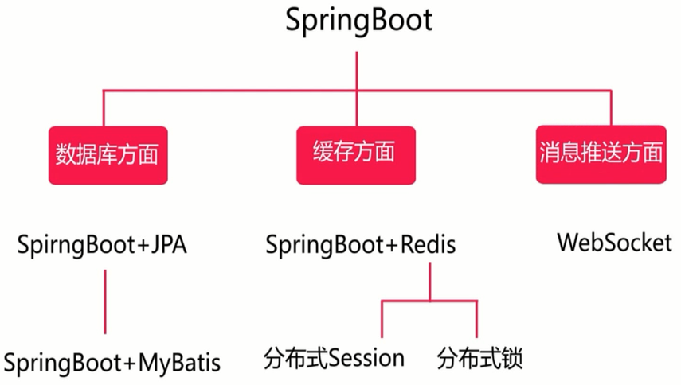
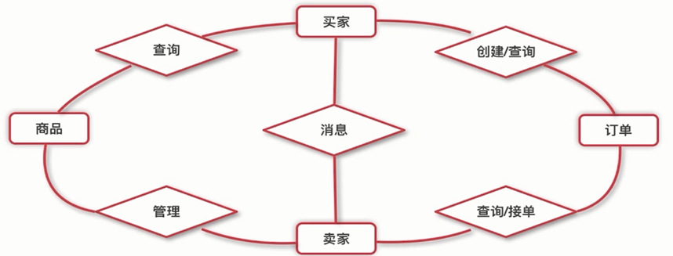

## 1、总体介绍

- 使用的主要技术：

  

  - SpringBoot：1.5.2。
  - JDK：1.8。
  - MySQL：5.7.32。
  - Nginx：1.12.2。
  - Redis：3.2.8。

- 角色划分：

  - 买家（手机端，微信公众号）。
  - 买家（PC端）。

- 功能分析：

  - 商品。
  - 订单。
  - 类目。

- 关系图：

  

- 部署架构：Nginx + Tomcat + Redis + MySQL。

- 数据库设计：

  - 商品表product_info，包括商品的相关信息。
  - 类目表product_category，是商品的分类信息，与商品表是一对多的关系。
  - 订单详情表order_detail，订单的具体内容。
  - 订单主表order_master，订单的核心信息，与订单详情表是一对多的关系。
  - 卖家信息表seller_info。


## 2、环境搭建

- 对开发流程还不太熟悉，为了方便，测试期间，在阿里云的Docker上部署MySQL和Redis，在本机上部署Nginx和Tomcat。

- Win10下环境搭建：

  - Nginx：
    - 按照[windows下nginx的安装及使用](https://www.cnblogs.com/jiangwangxiang/p/8481661.html)安装。
    
    - 前端静态资源部署参考[springboot微信点餐系统中的前端代码部署到自己的电脑上](https://blog.csdn.net/weixin_39973810/article/details/87457640)。
    
    - 配置文件：
    
      ```html
      http {
          server {
              listen       80;
              server_name  sell.com;
      
              location / {
                  root   html/sell;
                  index  index.html index.htm;
              }
      		
      		location /sell {
      			proxy_pass http://127.0.0.1:8080/sell/;
      		}
      	}
      }
      ```
      
    - 
  
- 阿里云Docker环境搭建：

  - MySQL：先安装镜像运行容器，然后本机SQLyog连接。

    ```shell
    docker pull mysql:5.7
    docker run --name mysql_wxdc -p 3306:3306 -e MYSQL_ROOT_PASSWORD=123456 mysql
    docker exec -it mysql_wxdc /bin/bash
    mysql -u root -p
    ```

    - 修改字符集：[docker下修改mysql配置文件](https://www.cnblogs.com/boboblue/p/12161482.html)，[Docker安装MySQL并挂载数据及配置文件](https://www.cnblogs.com/weile0769/p/11863779.html)。
    - 修改时区：[mysql修改时区的几种方法](https://www.cnblogs.com/shiqiangqiang/p/8393662.html)。

- 创建数据库表：

  ```sql
  CREATE DATABASE WXDC;
  
  CREATE TABLE `product_info` (
  	`product_id` VARCHAR(32) PRIMARY KEY,
  	`product_name` VARCHAR(64) NOT NULL COMMENT '产品名称',
  	`product_price` DECIMAL(8,2) NOT NULL COMMENT '产品单价',
  	`product_stock` INT NOT NULL COMMENT '库存',
  	`product_description` VARCHAR(64) COMMENT '描述',
  	`product_icon` VARCHAR(512) COMMENT '小图',
  	`category_type` INT NOT NULL COMMENT '类目编号',
  	`create_time` TIMESTAMP NOT NULL DEFAULT CURRENT_TIMESTAMP COMMENT '创建时间',
  	`update_time` TIMESTAMP NOT NULL DEFAULT CURRENT_TIMESTAMP ON UPDATE CURRENT_TIMESTAMP COMMENT '更新时间'
  ) COMMENT '商品表';
  
  CREATE TABLE `product_category`(
  	`category_id` INT PRIMARY KEY AUTO_INCREMENT,
  	`category_name` VARCHAR(64) NOT NULL COMMENT '类目名字',
  	`category_type` INT NOT NULL UNIQUE KEY COMMENT '类目编号',
  	`create_time` TIMESTAMP NOT NULL DEFAULT CURRENT_TIMESTAMP COMMENT '创建时间',
  	`update_time` TIMESTAMP NOT NULL DEFAULT CURRENT_TIMESTAMP ON UPDATE CURRENT_TIMESTAMP COMMENT '更新时间'
  ) COMMENT '类目表';
  
  CREATE TABLE `order_master`(
  	`order_id` VARCHAR(32) PRIMARY KEY,
  	`buyer_name` VARCHAR(32) NOT NULL COMMENT '买家名字',
  	`buyer_phone` VARCHAR(32) NOT NULL COMMENT '买家电话',
  	`buyer_address` VARCHAR(128) NOT NULL COMMENT '买家地址',
  	`buyer_openid` VARCHAR(64) NOT NULL COMMENT '微信openid',
  	`order_amount` DECIMAL(8,2) NOT NULL COMMENT '订单总金额',
  	`order_status` TINYINT(3) NOT NULL DEFAULT 0 COMMENT '订单状态，默认0新下单',
  	`pay_status` TINYINT(3) NOT NULL DEFAULT 0 COMMENT '支付状态，默认0未支付',
  	`create_time` TIMESTAMP NOT NULL DEFAULT CURRENT_TIMESTAMP COMMENT '创建时间',
  	`update_time` TIMESTAMP NOT NULL DEFAULT CURRENT_TIMESTAMP ON UPDATE CURRENT_TIMESTAMP COMMENT '更新时间',
  	KEY `idx_buyer_openid` (`buyer_openid`)
  ) COMMENT '订单主表';
  
  CREATE TABLE `order_detail`(
  	`detail_id` VARCHAR(32) PRIMARY KEY,
  	`order_id` VARCHAR(32) NOT NULL,
  	`product_id` VARCHAR(32) NOT NULL,
  	`product_name` VARCHAR(64) NOT NULL COMMENT '商品名称',
  	`product_price` DECIMAL(8,2) NOT NULL COMMENT '商品价格',
  	`product_quantity` INT NOT NULL COMMENT '商品数量',
  	`product_icon` VARCHAR(512) COMMENT '商品小图',
  	`create_time` TIMESTAMP NOT NULL DEFAULT CURRENT_TIMESTAMP COMMENT '创建时间',
  	`update_time` TIMESTAMP NOT NULL DEFAULT CURRENT_TIMESTAMP ON UPDATE CURRENT_TIMESTAMP COMMENT '更新时间',
  	KEY `idx_order_id` (`order_id`)
  ) COMMENT '订单详情';
  ```
  
- IDEA创建项目：

  - 使用Spring initializer，勾选Web。

  - SpringBoot 1.x版本下的单元测试：

    ```java
    import org.junit.Test;
    import org.junit.runner.RunWith;
    import org.springframework.boot.test.context.SpringBootTest;
    import org.springframework.test.context.junit4.SpringRunner;
    
    @RunWith(SpringRunner.class)
    @SpringBootTest
    public class SpringbootesApplicationTests {
        @Test
        public void test() {
    		//方法体
        }
    }
    ```

  - maven的pom.xml配置：

    ```xml
    <?xml version="1.0" encoding="UTF-8"?>
    <project xmlns="http://maven.apache.org/POM/4.0.0" xmlns:xsi="http://www.w3.org/2001/XMLSchema-instance"
             xsi:schemaLocation="http://maven.apache.org/POM/4.0.0 https://maven.apache.org/xsd/maven-4.0.0.xsd">
        <modelVersion>4.0.0</modelVersion>
        <parent>
            <groupId>org.springframework.boot</groupId>
            <artifactId>spring-boot-starter-parent</artifactId>
            <version>1.5.2.RELEASE</version>
            <relativePath/> <!-- lookup parent from repository -->
        </parent>
        <groupId>cn.iwehdio</groupId>
        <artifactId>sell</artifactId>
        <version>0.0.1-SNAPSHOT</version>
        <name>sell</name>
        <description>Demo project for Spring Boot</description>
    
        <properties>
            <java.version>1.8</java.version>
        </properties>
    
        <dependencies>
            <dependency>
                <groupId>org.springframework.boot</groupId>
                <artifactId>spring-boot-starter-web</artifactId>
            </dependency>
    
            <dependency>
                <groupId>org.springframework.boot</groupId>
                <artifactId>spring-boot-starter-test</artifactId>
                <scope>test</scope>
            </dependency>
    
            <dependency>
                <groupId>mysql</groupId>
                <artifactId>mysql-connector-java</artifactId>
            </dependency>
    
            <dependency>
                <groupId>org.springframework.boot</groupId>
                <artifactId>spring-boot-starter-data-jpa</artifactId>
            </dependency>
    
            <dependency>
                <groupId>org.projectlombok</groupId>
                <artifactId>lombok</artifactId>
            </dependency>
    
            <dependency>
                <groupId>com.google.code.gson</groupId>
                <artifactId>gson</artifactId>
            </dependency>
    
            <dependency>
                <groupId>com.github.binarywang</groupId>
                <artifactId>weixin-java-mp</artifactId>
                <version>2.7.0</version>
            </dependency>
    
            <dependency>
                <groupId>cn.springboot</groupId>
                <artifactId>best-pay-sdk</artifactId>
                <version>1.1.0</version>
            </dependency>
    
            <dependency>
                <groupId>org.springframework.boot</groupId>
                <artifactId>spring-boot-starter-freemarker</artifactId>
            </dependency>
    
            <dependency>
                <groupId>org.springframework.boot</groupId>
                <artifactId>spring-boot-starter-data-redis</artifactId>
            </dependency>
    
            <dependency>
                <groupId>org.springframework.boot</groupId>
                <artifactId>spring-boot-starter-websocket</artifactId>
            </dependency>
        </dependencies>
    
        <build>
            <plugins>
                <plugin>
                    <groupId>org.springframework.boot</groupId>
                    <artifactId>spring-boot-maven-plugin</artifactId>
                </plugin>
            </plugins>
        </build>
    
    </project>
    ```

  - application.yml数据库配置：

    ```yaml
    spring:
      datasource:
        driver-class-name: com.mysql.jdbc.Driver
        platform: mysql
        url: jdbc:mysql://ip地址:3306/WXDC?characterEncoding=utf-8&useSSL=false
        username: root
        password: 123456
      jpa:
        show-sql: true
    server:
    	context-path: /sell # url前缀
    ```
    
    

- 日志：

  - 日志框架的能力：

    - 定制输出目标。
    - 定制输出格式。
    - 携带上下文信息。
    - 运行时选择性输出。
    - 灵活的配置。
    - 优秀的性能。

  - 日志门面SLF4j + 日志实现Logback。

  - 使用：

    ```java
    private final Logger logger = LoggerFactory.getLogger(当前类.class);
    //输出常量，debug、error等方法
    logger.info("1");
    //输出变量
    String name;
    logger.info("name:{}",name);
    ```

  - LogBack的配置：
  
    - application.yml简单配置：
  
      ```yaml
      logging:
        pattern: 
          console: "%d - %msg%n"	#输出格式
        file: 	G:\Code\IDEA_code\WXDC\log\sell.log	#输出日志文件
        level: debug	#输出日志级别
      ```
  
    -  logback-spring.xml复杂配置（resource下）：
  
      ```xml
      <?xml version="1.0" encoding="UTF-8"?>
      <configuration>
          <!--  输出格式  -->
          <appender name="consoleLog" class="ch.qos.logback.core.ConsoleAppender">
                  <layout class="ch.qos.logback.classic.PatternLayout">
                          <pattern>%d - %msg%n</pattern>
                  </layout>
          </appender>
          <!--  Info日志，过滤掉Error级别  -->
          <appender name="fileInfoLog" class="ch.qos.logback.core.rolling.RollingFileAppender">
              <filter class="ch.qos.logback.classic.filter.LevelFilter">
                  <level>ERROR</level>
                  <onMatch>DENY</onMatch>
                  <onMismatch>ACCEPT</onMismatch>
              </filter>
              <encoder>
                  <pattern>%d - %msg%n</pattern>
              </encoder>
              <!--  滚动策略，每天一个日志文件  -->
              <rollingPolicy class="ch.qos.logback.core.rolling.TimeBasedRollingPolicy">
                  <fileNamePattern>G:\Code\IDEA_code\WXDC\log\sellInfo.%d.log</fileNamePattern>
              </rollingPolicy>
          </appender>
          <!--  Error日志，只指定Error级别  -->
          <appender name="fileErrorLog" class="ch.qos.logback.core.rolling.RollingFileAppender">
              <filter class="ch.qos.logback.classic.filter.ThresholdFilter">
                  <level>ERROR</level>
              </filter>
              <encoder>
                  <pattern>%d - %msg%n</pattern>
              </encoder>
              <rollingPolicy class="ch.qos.logback.core.rolling.TimeBasedRollingPolicy">
                  <fileNamePattern>G:\Code\IDEA_code\WXDC\log\sellError.%d.log</fileNamePattern>
              </rollingPolicy>
          </appender>
      
          <root level="info">
              <appender-ref ref="consoleLog" />
              <appender-ref ref="fileInfoLog" />
              <appender-ref ref="fileErrorLog" />
          </root>
      </configuration>
      ```

- 第一部分项目结构（[导出方法](https://www.cnblogs.com/shuai7boy/p/12850967.html)）：

  ```html
  │  SellApplication.java
  │  
  ├─controller	控制器
  │      BuyerOrderController.java	操作订单
  │		 - create() 创建订单
  │		 - list() 订单列表
  │		 - detail() 订单详情
  │		 - cancel() 取消订单
  │      BuyerProductController.java	操作产品
  │		- list() 查询所有产品列表
  │      
  ├─converter		对象类型转换器
  │      OrderForm2OrderDTOConverter.java
  │      OrderMaster2OrderDTOConverter.java
  │      
  ├─dao	与数据库交互的dao接口，都实现了JpaRepository
  │      OrderDetailDao.java	订单详情
  │		 - findByOrderId()
  │      OrderMasterDao.java	订单主表
  │		 - findByBuyerOpenid()
  │      ProductCategoryDao.java	产品目录
  │		 - findByCategoryTypeIn()
  │      ProductInfoDao.java	产品详情
  │		 - findByProductStatus()
  │      
  ├─dataObject	与数据库直接交互的实体类，不含关联关系
  │      OrderDetail.java		订单详情实体类
  │      OrderMaster.java		订单主表实体类
  │      ProductCategory.java		产品目录实体类
  │      ProductInfo.java		产品信息实体类
  │      
  ├─dto	数据传输对象
  │      CartDTO.java  购物车中的单个对象
  │      OrderDTO.java 包含了订单主表和订单详情列表
  │      
  ├─enums		枚举提高可读性
  │      OrderStatusEnum.java 订单状态枚举
  │      PayStatusEnum.java	支付状态枚举
  │      ProductStatusEnum.java	产品状态枚举
  │      ResultEnum.java	出现的异常种类枚举
  │      
  ├─exception		自定义异常
  │      SellException.java	售卖过程中出现的异常
  │      
  ├─form	前端传回参数封装的对象
  │      OrderForm.java 创建订单时前端传回参数
  │      
  ├─service	业务层，实现业务接口
  │  │  BuyerService.java	核实买家信息的订单操作
  │  │	 - findOneOrder()	查找订单
  │  │	 - cancelOrder()	取消订单
  │  │  OrderMasterService.java	订单操作
  │  │	 - create() 创建
  │  │	 - findOne() 查询单个
  │  │	 - findList() 查询所有
  │  │	 - cancel() 取消订单
  │  │	 - finish() 完结订单
  │  │	 - paid() 支付订单
  │  │  ProductCategoryService.java	产品目录
  │  │	 - findOne() 根据目录id查找
  │  │	 - findAll() 查找所有
  │  │	 - findByCategoryTypeIn() 根据一组目录id查找
  │  │	 - save() 保存一个目录
  │  │  ProductInfoService.java 产品详情
  │  │	 - findOne() 根据产品id查找
  │  │	 - findAll() 查找所有
  │  │	 - findUpAll() 查找所有上架的商品
  │  │	 - save() 保存一个产品
  │  │	 - increaseStock() 增加库存
  │  │	 - decreaseStock() 减少库存
  │  │  
  │  └─impl
  │          BuyerServiceImpl.java
  │          OrderMasterServiceImpl.java
  │          ProductCategoryServiceImpl.java
  │          ProductInfoServiceImpl.java
  │          
  ├─utils	工具类
  │      Date2LongSerializer.java	修改Date的序列化
  │      KeyUtil.java		生成唯一主键，时间+随机数
  │      ProductResultVOUtil.java	封装返回对象
  │      
  └─viewObject	返回给前端的数据封装实体类
          ProductCategoryVO.java		目录对象
          ProductResultVO.java	顶层返回对象
          ProdutInfoVO.java	产品对象
  ```


## 3、商品显示

- SpringData Jpa，对于数据库中表或者字段，命名为下划线分割的，在类名中自动对应驼峰命名分割的。

- 类目表（买家类名）：

  - 实体类：

    ```java
    import org.hibernate.annotations.DynamicUpdate;
    import javax.persistence.Entity;
    import javax.persistence.GeneratedValue;
    import javax.persistence.Id;
    import java.util.Date;
    @Entity
    @DynamicUpdate  //使得updateTime动态更新
    public class ProductCategory {
        @Id
        @GeneratedValue
        private Integer categoryId;
        private String categoryName;
        private Integer categoryType;
        private Date createTime;
        private Date updateTime;
        //一定要有无参构造
        public ProductCategory() {
        }
        public ProductCategory(String categoryName, Integer categoryType) {
            this.categoryName = categoryName;
            this.categoryType = categoryType;
        }
        /* getter&setter&toString */
    }
    ```

  - Dao接口：

    ```java
    public interface ProductCategoryDao extends JpaRepository<ProductCategory,Integer> {
        List<ProductCategory> findByCategoryTypeIn(List<Integer> categoryTypeList);
    }
    ```

  - dao测试类：

    ```java
    import org.junit.Test;
    import org.junit.runner.RunWith;
    import org.springframework.beans.factory.annotation.Autowired;
    import org.springframework.boot.test.context.SpringBootTest;
    import org.springframework.test.context.junit4.SpringRunner;
    
    @RunWith(SpringRunner.class)
    @SpringBootTest
    public class ProductCategoryDaoTest {
        @Autowired
        private ProductCategoryDao dao;
        @Test
        public void findOneTest(){
            ProductCategory productCategory = dao.findOne(1);
            System.out.println(productCategory);
        }
        @Test
        public void saveOneTest(){
            ProductCategory productCategory = new ProductCategory("目录2",3);
            dao.save(productCategory);
            System.out.println(productCategory);
        }
        @Test
        public void updateOneTest(){
            ProductCategory productCategory = dao.findOne(2);
            productCategory.setCategoryType(4);
            dao.save(productCategory);
            System.out.println(productCategory);
        }
        @Test
        public void findListTest(){
            List<Integer> findList = Arrays.asList(1,2,3,4);
            List<ProductCategory> byCategoryTypeIn = dao.findByCategoryTypeIn(findList);
            System.out.println(byCategoryTypeIn);
        }
    }
    ```

  - Service接口：

    ```java
    public interface ProductCategoryService {
        ProductCategory findOne(Integer categoryId);
        List<ProductCategory> findAll();
        List<ProductCategory> findByCategoryTypeIn(List<Integer> categoryTypeList);
        ProductCategory save(ProductCategory productCategory);
    }
    ```

  - service实现类：

    ```java
    import org.springframework.beans.factory.annotation.Autowired;
    import org.springframework.stereotype.Service;
    
    @Service
    public class ProductCategoryServiceImpl implements ProductCategoryService {
        @Autowired
        private ProductCategoryDao dao;
        @Override
        public ProductCategory findOne(Integer categoryId) {
            return dao.findOne(categoryId);
        }
        @Override
        public List<ProductCategory> findAll() {
            return dao.findAll();
        }
        @Override
        public List<ProductCategory> findByCategoryTypeIn(List<Integer> categoryTypeList) {
            return dao.findByCategoryTypeIn(categoryTypeList);
        }
        @Override
        public ProductCategory save(ProductCategory productCategory) {
            return dao.save(productCategory);
        }
    }
    ```

  - service测试类：

    ```java
    @RunWith(SpringRunner.class)
    @SpringBootTest
    public class ProductCategoryServiceImplTest {
        @Autowired
        private ProductCategoryService service;
        @Test
        public void findOne() {
            ProductCategory one = service.findOne(1);
            System.out.println(one);
        }
        @Test
        public void findAll() {
            List<ProductCategory> all = service.findAll();
            System.out.println(all);
        }
        @Test
        public void findByCategoryTypeIn() {
            List<ProductCategory> byCategoryTypeIn = service.findByCategoryTypeIn(Arrays.asList(1, 2, 3, 4));
            System.out.println(byCategoryTypeIn);
        }
        @Test
        public void save() {
            ProductCategory productCategory = new ProductCategory("目录3", 5);
            service.save(productCategory);
    
        }
    }
    ```


- 商品表：

    - 实体类：
    
        ```java
        @Entity
        @DynamicUpdate
        public class ProductInfo {
            @Id
            private String productId;
            private String productName;
            private BigDecimal productPrice;
            private Integer productStock;
            private String productDescription;
            private String productIcon;
            private Integer productStatus;  //0正常，1下架
            private Integer categoryType;
            private Date createTime;
            private Date updateTime;
            public ProductInfo() {
            }

            public ProductInfo(String productId, String productName, BigDecimal productPrice, Integer productStock, String productDescription, String productIcon, Integer productStatus, Integer categoryType) {
                this.productId = productId;
                this.productName = productName;
                this.productPrice = productPrice;
                this.productStock = productStock;
                this.productDescription = productDescription;
                this.productIcon = productIcon;
                this.productStatus = productStatus;
                this.categoryType = categoryType;
            }
            /* getter&setter&toString */
    }
      ```

  - Dao接口：
  
    ```java
    public interface ProductInfoDao extends JpaRepository<ProductInfo,String> {
        List<ProductInfo> findByProductStatus(Integer productStatus);
  }
    ```

  - dao测试类：
  
    ```java
    @RunWith(SpringRunner.class)
    @SpringBootTest
    public class ProductInfoDaoTest {
        @Autowired
        private ProductInfoDao dao;
        @Test
        public void saveTest(){
            ProductInfo productInfo = new ProductInfo("1", "商品1", new BigDecimal("12.3"), 20, "描述1", "url", 0, 1);
            dao.save(productInfo);
        }
  }
    ```

  - Service接口：
  
    ```java
    public interface ProductInfoService {
        ProductInfo findOne(String productId);
        List<ProductInfo> findUpAll();  //所有上架商品
        Page<ProductInfo> findAll(Pageable pageable);
        ProductInfo save(ProductInfo productInfo);
        //加减库存
  }
    ```

  - service实现类：
  
    ```java
    @Service
    public class ProductInfoServiceImpl implements ProductInfoService {
        @Autowired
        private ProductInfoDao dao;
        @Override
        public ProductInfo findOne(String productId) {
            return dao.findOne(productId);
        }
        @Override
        public List<ProductInfo> findUpAll() {
            return dao.findByProductStatus(ProductStatusEnum.UP.getCode());
        }
        @Override
        public Page<ProductInfo> findAll(Pageable pageable) {
            return dao.findAll(pageable);
        }
        @Override
        public ProductInfo save(ProductInfo productInfo) {
            return dao.save(productInfo);
        }
  }
    ```

  - service测试类：
  
    ```java
    @RunWith(SpringRunner.class)
    @SpringBootTest
    public class ProductInfoServiceImplTest {
        @Autowired
        private ProductInfoService service;
        @Test
        public void findOne() {
            ProductInfo one = service.findOne("12");
            System.out.println(one);
        }
        @Test
        public void findUpAll() {
            List<ProductInfo> upAll = service.findUpAll();
            System.out.println(upAll);
        }
        @Test
        public void findAll() {
            PageRequest request = new PageRequest(0,2);
            Page<ProductInfo> all = service.findAll(request);
            System.out.println(all.getTotalElements());
        }
        @Test
        public void save() {
            ProductInfo productInfo = new ProductInfo("12", "商品12", new BigDecimal("612.3"), 20, "描述12", "url", 0, 1);
            service.save(productInfo);
        }
    }
    
    //枚举增加可读性
    public enum ProductStatusEnum {
        UP(0,"上架"),
        DOWN(1,"下架");
    
        private Integer code;
        private String message;
        ProductStatusEnum(Integer code, String message) {
            this.code = code;
            this.message = message;
        }
        public Integer getCode() {
            return code;
        }
        public String getMessage() {
            return message;
        }
    }
    ```


- 商品列表：

  - 请求：

    ```http
    GET /sell/buyer/product/list
    ```

  - 返回：

    ```json
    {
        "code": 0,
        "msg": "成功",
        "data": [	# 类名列表
            {
                "name": "热榜",
                "type": 1,
                "foods": [	# 类目中的商品列表
                    {
                        "id": "123456",
                        "name": "皮蛋粥",
                        "price": 1.2,
                        "description": "好吃的皮蛋粥",
                        "icon": "http://xxx.com",
                    }
                ]
            },
            {
                "name": "好吃的",
                "type": 2,
                "foods": [
                    {
                        "id": "123457",
                        "name": "慕斯蛋糕",
                        "price": 10.9,
                        "description": "美味爽口",
                        "icon": "http://xxx.com",
                    }
                ]
            }
        ]
    }
    ```

  - 返回的对应的实体类：

    - ProductResultVO的设计理由是，要返回前端的JSON格式都是以code+msg+data的形式，其中data是具体的不同的数据对象。

    ```java
    public class ProductResultVO<T> {
        private Integer code;   //状态码，0正常1错误
        private String msg;
        private List<T> data;
        /* getter&setter&toString */
    }
    
    public class ProductCategoryVO {
        @JsonProperty("name")	//注解用来指定JSON序列化时的项目名
        private String categoryName;
        @JsonProperty("type")
        private Integer categoryType;
        private List<ProdutInfoVO> foods;
        /* getter&setter&toString */
    }
    
    public class ProdutInfoVO {
        @JsonProperty("id")
        private String productId;
        @JsonProperty("name")
        private String productName;
        @JsonProperty("price")
        private BigDecimal productPrice;
        @JsonProperty("description")
        private String productDescription;
        @JsonProperty("icon")
        private String productIcon;
        /* getter&setter&toString */
    }
    ```

  - 根据要返回的对象封装ProductResultVO：

    ```java
    public class ProductResultVOUtil {
        public static ProductResultVO success(Object object) {
            ProductResultVO resultVO = new ProductResultVO();
            resultVO.setData(object);
            resultVO.setMsg("success");
            resultVO.setCode(0);
            return resultVO;
        }
        public static ProductResultVO success() {
            return success(null);
        }
    }
    ```

    

  - 控制器测试：

    ```java
    @RestController
    @RequestMapping("/buyer/product")
    public class BuyerProductController {
        @GetMapping("/list")
        public ProductResultVO<ProductCategoryVO> list() {
            ProductResultVO<ProductCategoryVO> resultVO = new ProductResultVO<>();
            ProductCategoryVO categoryVO = new ProductCategoryVO();
            ProdutInfoVO infoVO = new ProdutInfoVO();
    
            categoryVO.setFoods(Arrays.asList(infoVO,infoVO));
            resultVO.setData(Arrays.asList(categoryVO));
            return resultVO;
        }
    }
    ```

  - 控制器实现业务：

    1. 业务目的：返回所有上架的商品并且按类名显示。
    2. 首先查询所有上架商品。
    3. 通过所有上架商品，遍历查询其类目（此处有优化空间），得到目前有商品的所有类目。
    4. 数据封装。
       - 创建一个最终返回的结果对象。
       - 创建一个列表，元素是某个类目下显示的信息和商品。
       - 遍历获得的类目列表。并添加到上一步的列表。
         - 创建一个列表，元素是商品的展示信息。
         - 遍历上架的商品列表，比较类名是否相同。相同则添加到列表。
       - 设置相关信息并返回最终的结果对象。

    ```java
    @RestController
    @RequestMapping("/buyer/product")
    public class BuyerProductController {
        @Autowired
        private ProductCategoryService categoryService;
        @Autowired
        private ProductInfoService infoService;
    
        @GetMapping("/list")
        public ProductResultVO<ProductCategoryVO> list() {
            //1、查询所有上架商品
            List<ProductInfo> upAll = infoService.findUpAll();
            //2、查询类名
            List<Integer> categoryTypeList = new ArrayList<>();
            for (ProductInfo productInfo : upAll) {
                categoryTypeList.add(productInfo.getCategoryType());
            }
            List<ProductCategory> productCategoryList = categoryService.findByCategoryTypeIn(categoryTypeList);
            //3、数据拼装
            ProductResultVO<ProductCategoryVO> resultVO = new ProductResultVO<>();
            List<ProductCategoryVO> categoryVOList = new ArrayList<>();
            for (ProductCategory productCategory : productCategoryList) {
                ProductCategoryVO categoryVO = new ProductCategoryVO();
                categoryVO.setCategoryType(productCategory.getCategoryType());
                categoryVO.setCategoryName(productCategory.getCategoryName());
                List<ProdutInfoVO> infoVOList = new ArrayList<>();
                for (ProductInfo productInfo : upAll) {
                    if (productInfo.getCategoryType().equals(productCategory.getCategoryType())){
                        ProdutInfoVO infoVO = new ProdutInfoVO();
                        BeanUtils.copyProperties(productInfo,infoVO);
                        infoVOList.add(infoVO);
                    }
                }
                categoryVO.setFoods(infoVOList);
                categoryVOList.add(categoryVO);
            }
            resultVO.setData(categoryVOList);
            resultVO.setCode(0);
            resultVO.setMsg("success");
            return resultVO;
        }
    }
    ```

  - 前端联调：

    - 因为还没有连微信，需要手动设置Cookie。

      - 先进入/#/order下。

      - 浏览器检查，在console中设置`document.cookie="openid=abc"`。


## 3、创建订单

- 订单主表：

  - 实体类：

    ```java
    @Entity
    @DynamicUpdate
    public class OrderMaster {
        @Id
        private String orderId;
        private String buyerName;
        private String buyerPhone;
        private String buyerAddress;
        private String buyerOpenid;
        private BigDecimal orderAmount;
        private Integer orderStatus = OrderStatusEnum.NEW.getCode();
        private Integer payStatus = PayStatusEnum.WAIT.getCode();
        private Date createTime;
        private Date updateTime;
    
        public OrderMaster() {
        }
        public OrderMaster(String orderId, String buyerName, String buyerPhone, String buyerAddress, String buyerOpenid, BigDecimal orderAmount) {
            this.orderId = orderId;
            this.buyerName = buyerName;
            this.buyerPhone = buyerPhone;
            this.buyerAddress = buyerAddress;
            this.buyerOpenid = buyerOpenid;
            this.orderAmount = orderAmount;
        }
        /* g s t */
    }
    
    //枚举提高可读性
    public enum  OrderStatusEnum {
        NEW(0,"新订单"),
        FINISHED(1,"完结"),
        CANCEL(2,"已取消");
    
        private Integer code;
        private String message;
        OrderStatusEnum(Integer code, String message) {
            this.code = code;
            this.message = message;
        }
        public Integer getCode() {
            return code;
        }
        public String getMessage() {
            return message;
        }
    }
    
    public enum PayStatusEnum {
        WAIT(0,"等待支付"),
        SUCCESS(1,"支付成功");
    
        private Integer code;
        private String message;
        PayStatusEnum(Integer code, String message) {
            this.code = code;
            this.message = message;
        }
        public Integer getCode() {
            return code;
        }
        public String getMessage() {
            return message;
        }
    }
    ```

  - Dao接口：

    ```java
    public interface OrderMasterDao extends JpaRepository<OrderMaster,String> {
        //根据微信的openid查询订单
        Page<OrderMaster> findByBuyerOpenid(String buyerOpenid, Pageable pageable);
    }
    ```

  - dao测试类：

    ```java
    @RunWith(SpringRunner.class)
    @SpringBootTest
    public class OrderMasterDaoTest {
        @Autowired
        private OrderMasterDao dao;
        @Test
        public void saveTest(){
            OrderMaster orderMaster = new OrderMaster("1","订单1","122","CN","123",new BigDecimal("52.2"));
            dao.save(orderMaster);
        }
        @Test
        public void findByBuyerOpenid() {
            PageRequest request = new PageRequest(0,2);
            Page<OrderMaster> byBuyerOpenid = dao.findByBuyerOpenid("123", request);
            System.out.println(byBuyerOpenid.getTotalElements());
        }
    }
    ```

  - Service接口：

    - 为了数据传输方便，新建一个订单DTO数据传输对象，其中包含了具体订单列表。

      ```java
      public class OrderDTO {
          private String orderId;
          private String buyerName;
          private String buyerPhone;
          private String buyerAddress;
          private String buyerOpenid;
          private BigDecimal orderAmount;
          private Integer orderStatus = OrderStatusEnum.NEW.getCode();
          private Integer payStatus = PayStatusEnum.WAIT.getCode();
          private Date createTime;
          private Date updateTime;
          private List<OrderDetail> orderDetailList;
      }
      ```

    - 功能包括：创建、查询单个、查询所有、取消、完结、支付。

      ```java
      public interface OrderMasterService {
          OrderDTO create(OrderDTO orderDTO);
          OrderDTO findOne(String orderId);
          Page<OrderDTO> findList(String buyerOpenid, Pageable pageable);
          OrderDTO cancel(OrderDTO orderDTO);
          OrderDTO finish(OrderDTO orderDTO);
          OrderDTO paid(OrderDTO orderDTO);
      }
      ```

- 订单细节：

  - 实体类：

    ```java
    @Entity
    public class OrderDetail {
        @Id
        private String detailId;
        private String orderId;
        private String productId;
        private String productName;
        private BigDecimal productPrice;
        private Integer productQuantity;
        private String productIcon;
    
        public OrderDetail() {
        }
        public OrderDetail(String detailId, String orderId, String productId, String productName, BigDecimal productPrice, Integer productQuantity, String productIcon) {
            this.detailId = detailId;
            this.orderId = orderId;
            this.productId = productId;
            this.productName = productName;
            this.productPrice = productPrice;
            this.productQuantity = productQuantity;
            this.productIcon = productIcon;
        }
        /* g s t */
    }
    ```

  - Dao接口：

    ```java
    public interface OrderDetailDao extends JpaRepository<OrderDetail,String> {
        //根据订单号返回所有详细订单
        List<OrderDetail> findByOrderId(String orderId);
    }
    ```

  - dao测试类：

    ```java
    @RunWith(SpringRunner.class)
    @SpringBootTest
    public class OrderDetailDaoTest {
        @Autowired
        private OrderDetailDao dao;
        @Test
        public void saveTest(){
            OrderDetail orderDetail = new OrderDetail("1","1","1","商品1",new BigDecimal("46.2"),20,"url");
            dao.save(orderDetail);
        }
        @Test
        public void findByOrderId() {
            List<OrderDetail> byOrderId = dao.findByOrderId("1");
            System.out.println(byOrderId);
        }
    }
    ```


- 创建订单：

  - 请求：

    ```http
    POST /sell/buyer/order/create
    ```

  - 参数：注意这里参数都不应该带引号，否则数据库中也会带引号。

    ```json
    name: 张三
    phone: 18868822111
    address: 慕课网总部
    openid: ew3euwhd7sjw9diwkq //用户的微信openid
    items: [{	//购物车
        productId: 1423113435324,
        productQuantity: 2 //购买数量
    }]
    ```

  - 返回：注意这里的data是一个map，而不是像别的是一个`List<map>`。

    ```json
    {
      "code": 0,
      "msg": "成功",
      "data": {
          "orderId": "147283992738221" 
      }
    }
    ```

- 创建总订单的service实现类：

  - 一些商品的信息需要从数据库中查，另一些从前端获取。

  - 创建订单：

    - 查询商品数量和价格。
    - 计算总价。
    - 写入订单数据库master和detail。
    - 扣库存。

  - 前端传入的购物车信息只有商品id和数量，创建实体类：

    ```java
    //购物车
    public class CartDTO {
        private String productId;
        private Integer productQuantity;
    }
    ```

  - 在ProductInfoService中增加加减库存的方法，及其实现：

    - `@Transactional`事务使得方法运行过程中抛出异常则回滚。
    - 减库存可能会出现超卖，后期用分布式锁防止。

    ```java
    void increaseStock(List<CartDTO> cartDTOList);
    void decreaseStock(List<CartDTO> cartDTOList);
    
    @Override
    @Transactional
    public void increaseStock(List<CartDTO> cartDTOList) {
        for (CartDTO cartDTO : cartDTOList) {
            ProductInfo productInfo = dao.findOne(cartDTO.getProductId());
            if(productInfo == null) {
                throw new SellException(ResultEnum.PRODUCT_NOT_EXIST);
            }
            int result = productInfo.getProductStock() + cartDTO.getProductQuantity();
            productInfo.setProductStock(result);
            dao.save(productInfo);
        }
    }
    
    @Override
    @Transactional
    public void decreaseStock(List<CartDTO> cartDTOList) {
        for (CartDTO cartDTO : cartDTOList) {
            ProductInfo productInfo = dao.findOne(cartDTO.getProductId());
            if(productInfo == null) {
                throw new SellException(ResultEnum.PRODUCT_NOT_EXIST);
            }
            int result = productInfo.getProductStock() - cartDTO.getProductQuantity();
            if (result < 0 ) {
                throw new SellException(ResultEnum.PRODUCT_STOCK_ERROR);
            }
            productInfo.setProductStock(result);
            dao.save(productInfo);
        }
    }
    ```

  - 查询商品结果状态的枚举：

    ```java
    public enum ResultEnum {
        PRODUCT_NOT_EXIST(0,"商品不存在"),
        PRODUCT_STOCK_ERROR(1,"库存错误"),
        ORDER_NOT_EXIST(2,"订单不存在"),
        ORDERDETAIL_NOT_EXIST(3,"订单详情不存在"),
        ORDER_STATUS_ERROR(4,"订单状态不正确"),
        ORDER_UPDATE_FAIL(5,"订单更新失败"),
        ORDER_DETAIL_EMPTY(6,"订单详情为空"),
        ORDER_PAY_STATUS_ERROR(7,"支付状态错误"),
        PARAM_ERROR(8,"参数不正确"),
        CART_EMPTY(9,"购物车为空"),
        ORDER_OWNER_ERROR(10,"操作的不是你的订单"),
        ;
        private Integer code;
        private String message;
    }
    ```

  - 售卖的异常：

    ```java
    public class SellException extends RuntimeException {
        private Integer code;
    
        public SellException(ResultEnum resultEnum) {
            super(resultEnum.getMessage());
            this.code = resultEnum.getCode();
        }
    }
    ```

  - 生成总订单和详细订单唯一主键的工具类：

    ```java
    public class KeyUtil {
        //生成唯一主键：时间+6位随机数
        public static synchronized String genUniqueKey() {
            Random random = new Random();
            Integer num = random.nextInt(900000) + 100000;
            return System.currentTimeMillis() + String.valueOf(num);
        }
    }
    ```

  - 创建订单：

    1. 传入的OrderDTO中的OrderDetail只有购物车的信息。
    2. 遍历OrderDetailList，查询商品，计算总价。
    3. 分别写入订单详情表和订单主表。

    ```java
    @Service
    public class OrderMasterServiceImpl implements OrderMasterService {
        @Autowired
        private ProductInfoService productInfoService;
        @Autowired
        private OrderMasterDao masterDao;
        @Autowired
        private OrderDetailDao detailDao;
        @Override
        @Transactional
        public OrderDTO create(OrderDTO orderDTO) {
            //开始生成订单号，初始化总价和购物车列表
            String orderId = KeyUtil.genUniqueKey();
            BigDecimal orderAmount = new BigDecimal("0");
            List<CartDTO> cartDTOList = new ArrayList<>();
            //1、查询商品数量和价格
            for (OrderDetail orderDetail : orderDTO.getOrderDetailList()) {
                ProductInfo productInfo = productInfoService.findOne(orderDetail.getProductId());
                if(productInfo == null) {
                    throw new SellException(ResultEnum.PRODUCT_NOT_EXIST);
                }
                //2、计算总价
                orderAmount = productInfo.getProductPrice()
                    .multiply(new BigDecimal(orderDetail.getProductQuantity()))
                    .add(orderAmount);
                //3、写入订单数据库detail，注意先拷贝再赋新值
                BeanUtils.copyProperties(productInfo,orderDetail);
                orderDetail.setDetailId(KeyUtil.genUniqueKey());
                orderDetail.setOrderId(orderId);
                detailDao.save(orderDetail);
    
                CartDTO cartDTO = new CartDTO(orderDetail.getProductId(), orderDetail.getProductQuantity());
                cartDTOList.add(cartDTO);
    
            }
            //3、写入订单数据库master
            OrderMaster orderMaster = new OrderMaster();
            BeanUtils.copyProperties(orderDTO,orderMaster);
            orderMaster.setOrderId(orderId);
            orderMaster.setOrderAmount(orderAmount);
            orderMaster.setOrderStatus(OrderStatusEnum.NEW.getCode());
            orderMaster.setPayStatus(PayStatusEnum.WAIT.getCode());
            masterDao.save(orderMaster);
            //4、扣库存
            productInfoService.decreaseStock(cartDTOList);
    
            return orderDTO;
        }
    }
    ```

  - 测试类：

    ```java
    @RunWith(SpringRunner.class)
    @SpringBootTest
    public class OrderMasterServiceImplTest {
        @Autowired
        private OrderMasterService service;
        private final String BUYER_OPENID = "aaa";
        @Test
        public void create() {
            OrderDTO orderDTO = new OrderDTO();
            orderDTO.setBuyerName("iwehdio");
            orderDTO.setBuyerAddress("XXX-Add");
            orderDTO.setBuyerPhone("4466");
            orderDTO.setBuyerOpenid(BUYER_OPENID);
    
            List<OrderDetail> orderDetailList = new ArrayList<>();
    
            OrderDetail o1 = new OrderDetail();
            o1.setProductId("1");
            o1.setProductQuantity(2);
            OrderDetail o2 = new OrderDetail();
            o2.setProductId("12");
            o2.setProductQuantity(5);
            orderDetailList.add(o1);
            orderDetailList.add(o2);
            orderDTO.setOrderDetailList(orderDetailList);
            service.create(orderDTO);
        }
    }
    ```

    

- service层的其他订单操作：

  - 查找一个：

    - 订单id和订单详情为空时抛出异常。

    ```java
    @Override
    public OrderDTO findOne(String orderId) {
        OrderMaster orderMaster = masterDao.findOne(orderId);
        if (orderMaster == null) {
            throw new SellException(ResultEnum.ORDER_NOT_EXIST);
        }
        List<OrderDetail> orderDetailList = detailDao.findByOrderId(orderId);
        if (orderDetailList.isEmpty()){
            throw new SellException(ResultEnum.ORDERDETAIL_NOT_EXIST);
        }
        OrderDTO orderDTO = new OrderDTO();
        BeanUtils.copyProperties(orderMaster,orderDTO);
        orderDTO.setOrderDetailList(orderDetailList);
        return orderDTO;
    }
    ```

  - 查询某个用户的所有订单：

    ```java
    @Override
    public Page<OrderDTO> findList(String buyerOpenid, Pageable pageable) {
        Page<OrderMaster> orderMasterPage = masterDao.findByBuyerOpenid(buyerOpenid, pageable);
        List<OrderDTO> orderDTOList = OrderMaster2OrderDTOConverter.convert(orderMasterPage.getContent());
        return new PageImpl<OrderDTO>(orderDTOList,pageable,orderMasterPage.getTotalElements());
    }
    
    //OrderMaster转化为OrderDTO
    public class OrderMaster2OrderDTOConverter {
        public static OrderDTO convert(OrderMaster orderMaster) {
            OrderDTO orderDTO = new OrderDTO();
            BeanUtils.copyProperties(orderMaster,orderDTO);
            return orderDTO;
        }
        public static List<OrderDTO> convert(List<OrderMaster> orderMasterList) {
            List<OrderDTO> orderDTOList = new ArrayList<>();
            for (OrderMaster orderMaster : orderMasterList) {
                orderDTOList.add(convert(orderMaster));
            }
            return orderDTOList;
        }
    }
    ```

  - 订单取消：

    1. 判断订单状态，新创建的new才能被取消。
    2. 修改订单状态为取消。
    3. 返还库存。

    ```java
    @Override
    @Transactional
    public OrderDTO cancel(OrderDTO orderDTO) {
        OrderMaster orderMaster = new OrderMaster();
        //1、判断订单状态，指定状态下才能被取消
        if (!OrderStatusEnum.NEW.getCode().equals(orderDTO.getOrderStatus())){
            logger.error("【取消订单】订单状态不正确，orderId={},orderStatus={}",
                         orderDTO.getOrderId(),orderDTO.getOrderStatus());
            throw new SellException(ResultEnum.ORDER_STATUS_ERROR);
        }
        //2、修改订单状态
        orderDTO.setOrderStatus(OrderStatusEnum.CANCEL.getCode());
        BeanUtils.copyProperties(orderDTO,orderMaster);
        OrderMaster save = masterDao.save(orderMaster);
        if (save ==null){
            logger.error("【取消订单】更新失败,orderMaster={}",orderMaster);
            throw new SellException(ResultEnum.ORDER_UPDATE_FAIL);
        }
        //3、返还库存
        if(orderDTO.getOrderDetailList().isEmpty()) {
            logger.error("【取消订单】详情为空,orderDTO={}",orderDTO);
            throw new SellException(ResultEnum.ORDER_DETAIL_EMPTY);
        }
        List<CartDTO> cartDTOList = new ArrayList<>();
        for (OrderDetail orderDetail : orderDTO.getOrderDetailList()) {
            cartDTOList.add(new CartDTO(orderDetail.getProductId(),orderDetail.getProductQuantity()));
        }
        productInfoService.increaseStock(cartDTOList);
        //4、如果已支付需要退款
        if (PayStatusEnum.SUCCESS.getCode().equals(orderDTO.getPayStatus())){
            //TODO
        }
        return orderDTO;
    }
    ```

  - 订单完结：

    ```java
    @Override
    @Transactional
    public OrderDTO finish(OrderDTO orderDTO) {
        OrderMaster orderMaster = new OrderMaster();
        //1、判断订单状态，指定状态下才能被完结
        if (!OrderStatusEnum.NEW.getCode().equals(orderDTO.getOrderStatus())){
            logger.error("【完结订单】订单状态不正确，orderId={},orderStatus={}",
                         orderDTO.getOrderId(),orderDTO.getOrderStatus());
            throw new SellException(ResultEnum.ORDER_STATUS_ERROR);
        }
        //2、修改订单状态
        orderDTO.setOrderStatus(OrderStatusEnum.FINISHED.getCode());
        BeanUtils.copyProperties(orderDTO,orderMaster);
        OrderMaster save = masterDao.save(orderMaster);
        if (save ==null){
            logger.error("【完结订单】更新失败,orderMaster={}",orderMaster);
            throw new SellException(ResultEnum.ORDER_UPDATE_FAIL);
        }
        return orderDTO;
    }
    ```

  - 订单完成支付：

    ```java
    @Override
    @Transactional
    public OrderDTO paid(OrderDTO orderDTO) {
        OrderMaster orderMaster = new OrderMaster();
        //1、判断订单状态，指定状态下才能被支付
        if (!OrderStatusEnum.NEW.getCode().equals(orderDTO.getOrderStatus())){
            logger.error("【支付订单】订单状态不正确，orderId={},orderStatus={}",
                         orderDTO.getOrderId(),orderDTO.getOrderStatus());
            throw new SellException(ResultEnum.ORDER_STATUS_ERROR);
        }
        //2、判断订单支付状态
        if (!PayStatusEnum.WAIT.getCode().equals(orderDTO.getPayStatus())){
            logger.error("【支付订单】更新失败,orderDTO={}",orderDTO);
            throw new SellException(ResultEnum.ORDER_PAY_STATUS_ERROR);
        }
        //3、修改订单状态
        orderDTO.setPayStatus(PayStatusEnum.SUCCESS.getCode());
        BeanUtils.copyProperties(orderDTO,orderMaster);
        OrderMaster save = masterDao.save(orderMaster);
        if (save ==null){
            logger.error("【支付订单】更新失败,orderMaster={}",orderMaster);
            throw new SellException(ResultEnum.ORDER_UPDATE_FAIL);
        }
        return orderDTO;
    }
    ```

  - 测试类：

    ```java
    private final String BUYER_OPENID = "aaa";
    
    @Test
    public void findOne() {
        OrderDTO orderDTO = service.findOne("1606478486299603884");
        System.out.println(orderDTO);
    }
    
    @Test
    public void findList() {
        PageRequest request = new PageRequest(0,2);
        Page<OrderDTO> list = service.findList(BUYER_OPENID, request);
        System.out.println(list.getContent());
    }
    
    @Test
    public void cancel() {
        OrderDTO orderDTO = service.findOne("1606478486299603884");
        OrderDTO cancel = service.cancel(orderDTO);
        System.out.println(cancel);
    }
    
    @Test
    public void finish() {
        OrderDTO orderDTO = service.findOne("1606478486299603884");
        OrderDTO finish = service.finish(orderDTO);
        System.out.println(finish);
    }
    
    @Test
    public void paid() {
        OrderDTO orderDTO = service.findOne("1606478486299603884");
        OrderDTO paid = service.paid(orderDTO);
        System.out.println(paid);
    }
    ```

- 创建总订单的控制器controller层：
  
  - 按照前端传回参数封装的对象：
  
    - 相应的做了表单校验。
    - 需要将其转化为OrderDTO，用一个转换类。
  
    ```java
    public class OrderForm {
        @NotEmpty(message = "姓名必填")
        private String name;
        @NotEmpty(message = "手机号必填")
        private String phone;
        @NotEmpty(message = "地址必填")
        private String address;
        @NotEmpty(message = "openid必填")
        private String openid;
        @NotEmpty(message = "购物车不能为空")
        private String items;
        /* g s t */
    }
    
    public class OrderForm2OrderDTOConverter {
        private static Logger logger = LoggerFactory.getLogger(OrderForm2OrderDTOConverter.class);
        public static OrderDTO convert(OrderForm orderForm) {
            OrderDTO orderDTO = new OrderDTO();
            orderDTO.setBuyerName(orderForm.getName());
            orderDTO.setBuyerPhone(orderForm.getPhone());
            orderDTO.setBuyerOpenid(orderForm.getOpenid());
            orderDTO.setBuyerAddress(orderForm.getAddress());
    
            Gson gson = new Gson();
            List<OrderDetail> orderDetailList;
            try {
                orderDetailList = gson.fromJson(orderForm.getItems(),new TypeToken<List<OrderDetail>>(){}.getType());
            } catch (JsonSyntaxException e) {
                logger.error("【对象转换】错误，string={}",orderForm.getItems());
                throw new SellException(ResultEnum.PARAM_ERROR);
            }
            orderDTO.setOrderDetailList(orderDetailList);
            return orderDTO;
        }
    }
    ```
  
  - 创建订单的控制器实现：
  
    ```java
    @RestController
    @RequestMapping("/buyer/order")
    public class BuyerOrderController {
        private final Logger logger = LoggerFactory.getLogger(BuyerOrderController.class);
        @Autowired
        private OrderMasterService masterService;
        @Autowired
        private BuyerService buyerService;
        //创建订单
        @PostMapping("/create")
        public ProductResultVO<Map<String,String>> create(@Valid OrderForm orderForm,
                                                          BindingResult bindingResult) {
            if (bindingResult.hasErrors()) {
                logger.error("【创建订单】参数不正确，orderForm={}",orderForm);
                throw new SellException(ResultEnum.PARAM_ERROR,
                        bindingResult.getFieldError().getDefaultMessage());
            }
            OrderDTO orderDTO = OrderForm2OrderDTOConverter.convert(orderForm);
            if(orderDTO.getOrderDetailList().isEmpty()){
                logger.error("【创建订单】购物车不能为空");
                throw new SellException(ResultEnum.CART_EMPTY);
            }
            OrderDTO result = masterService.create(orderDTO);
            Map<String,String> map = new HashMap<>();
            map.put("orederId",result.getOrderId());
            return ProductResultVOUtil.success(map);
        }
    }
    ```
  
- 其他功能的请求与返回：

  - 返回前端的数据为null怎么办：

    - 一般来说尽量不要给前端返回null。

    - 第一种方法是如果为null就不返回这项，可在全局配置文件中：

      ```yaml
      spring:
          jackson:
              default-property-inclusion: non_null
      ```

    - 第二种是设置一个返回的默认值，在实体类中直接初始化成员变量。

  - 订单列表：

    - 请求：

      ```http
      GET /sell/buyer/order/list
      ```

    - 参数：

      ```properties
      openid: 18eu2jwk2kse3r42e2e
      page: 0 //从第0页开始
      size: 10
      ```

    - 返回：

      ```json
      {
        "code": 0,
        "msg": "成功",
        "data": [
          {
            "orderId": "161873371171128075",
            "buyerName": "张三",
            "buyerPhone": "18868877111",
            "buyerAddress": "慕课网总部",
            "buyerOpenid": "18eu2jwk2kse3r42e2e",
            "orderAmount": 0,
            "orderStatus": 0,
            "payStatus": 0,
            "createTime": 1490171219,
            "updateTime": 1490171219,
            "orderDetailList": null
          },
          {
            "orderId": "161873371171128076",
            "buyerName": "张三",
            "buyerPhone": "18868877111",
            "buyerAddress": "慕课网总部",
            "buyerOpenid": "18eu2jwk2kse3r42e2e",
            "orderAmount": 0,
            "orderStatus": 0,
            "payStatus": 0,
            "createTime": 1490171219,
            "updateTime": 1490171219,
            "orderDetailList": null
          }]
      }
      ```

  - 订单详情：

    - 请求：

      ```http
      GET /sell/buyer/order/detail
      ```

    - 参数：

      ```properties
      openid: 18eu2jwk2kse3r42e2e
      orderId: 161899085773669363
      ```

    - 返回：

      ```json
      {
          "code": 0,
          "msg": "成功",
          "data": {
                "orderId": "161899085773669363",
                "buyerName": "李四",
                "buyerPhone": "18868877111",
                "buyerAddress": "慕课网总部",
                "buyerOpenid": "18eu2jwk2kse3r42e2e",
                "orderAmount": 18,
                "orderStatus": 0,
                "payStatus": 0,
                "createTime": 1490177352,
                "updateTime": 1490177352,
                "orderDetailList": [
                  {
                      "detailId": "161899085974995851",
                      "orderId": "161899085773669363",
                      "productId": "157875196362360019",
                      "productName": "招牌奶茶",
                      "productPrice": 9,
                      "productQuantity": 2,
                      "productIcon": "http://xxx.com",
                      "productImage": "http://xxx.com"
                  }
              ]
          }
      }
      ```

  - 取消订单：

    - 请求：

      ```http
      POST /sell/buyer/order/cancel
      ```

    - 参数：

      ```properties
      openid: 18eu2jwk2kse3r42e2e
      orderId: 161899085773669363
      ```

    - 返回：

      ```json
      {
          "code": 0,
          "msg": "成功",
          "data": null
      }
      ```

- 其他功能的控制器实现：

  - 订单列表：

    ```java
    @GetMapping("/list")
    public ProductResultVO<List<OrderDTO>> list(@RequestParam("openid") String openid,
                                                @RequestParam(value = "page",defaultValue = "0") Integer page,
                                                @RequestParam(value = "size",defaultValue = "10") Integer size){
        if (StringUtils.isEmpty(openid)){
            logger.error("【查询订单列表】openid为空");
            throw new SellException(ResultEnum.PARAM_ERROR);
        }
        PageRequest request = new PageRequest(page,size);
        Page<OrderDTO> list = masterService.findList(openid, request);
        return ProductResultVOUtil.success(list.getContent());
    }
    ```

    - 返回前端的createTime和updateTime默认被乘以1000转化为了秒。

      - 主要原因是Json对Date的序列化机制。
      - 需要在OrderDTO中日期类型上指定`@JsonSerialize(using = Date2LongSerializer.class)`。

      ```java
      import com.fasterxml.jackson.core.JsonGenerator;
      import com.fasterxml.jackson.core.JsonProcessingException;
      import com.fasterxml.jackson.databind.JsonSerializer;
      import com.fasterxml.jackson.databind.SerializerProvider;
      
      public class Date2LongSerializer extends JsonSerializer<Date> {
          @Override
          public void serialize(Date value, JsonGenerator gen, SerializerProvider serializers) throws IOException, JsonProcessingException {
              gen.writeNumber(value.getTime()/1000);
          }
      }
      ```

  - 订单详情/取消订单：

    - 订单详情和取消订单的操作都需要判断身份，即同一个访问的openid才能操作他自己的订单。

    - 买家服务：

      ```java
      public interface BuyerService {
          OrderDTO findOneOrder(String openid,String orderId);
          OrderDTO cancelOrder(String openid,String orderId);
      }
      
      @Service
      public class BuyerServiceImpl implements BuyerService {
          @Autowired
          private OrderMasterService masterService;
          private final Logger logger = LoggerFactory.getLogger(BuyerServiceImpl.class);
      
          @Override
          public OrderDTO findOneOrder(String openid, String orderId) {
              return checkOrderOwner(openid,orderId);
          }
      
          @Override
          public OrderDTO cancelOrder(String openid, String orderId) {
              OrderDTO orderDTO = checkOrderOwner(openid, orderId);
              if (orderDTO == null) {
                  logger.error("【取消订单】查不到该订单,orderId={}",orderId);
                  throw new SellException(ResultEnum.ORDER_NOT_EXIST);
              }
              return masterService.cancel(orderDTO);
          }
      
          private OrderDTO checkOrderOwner(String openid,String orderId){
              OrderDTO orderDTO = masterService.findOne(orderId);
              if (orderDTO == null) {
                  return null;
              }
              if (!orderDTO.getBuyerOpenid().equalsIgnoreCase(openid)) {
                  logger.error("【查询订单】订单的openid不一致,openid={},orderDTO={}",openid,orderDTO);
                  throw new SellException(ResultEnum.ORDER_OWNER_ERROR);
              }
              return orderDTO;
          }
      }
      ```

    - 订单详情控制器方法：

      ```java
      //订单详情
      @GetMapping("/detail")
      public ProductResultVO<OrderDTO> detail(@RequestParam("openid") String openid,
                                              @RequestParam("orderId") String orderId){
          OrderDTO orderDTO = buyerService.findOneOrder(openid,orderId);
          return ProductResultVOUtil.success(orderDTO);
      }
      ```

    - 取消订单控制器方法：

      ```java
      //取消订单
      @PostMapping("/cancel")
      public ProductResultVO<OrderDTO> cancel(@RequestParam("openid") String openid,
                                              @RequestParam("orderId") String orderId){
          buyerService.cancelOrder(openid,orderId);
          return ProductResultVOUtil.success();
      }
      ```

      


