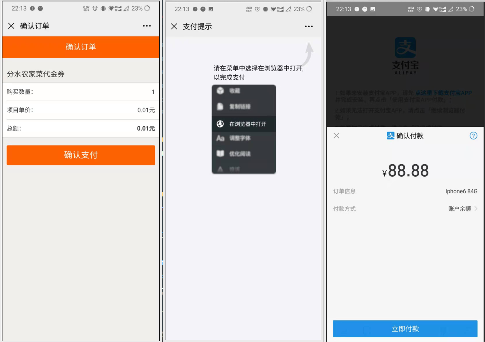
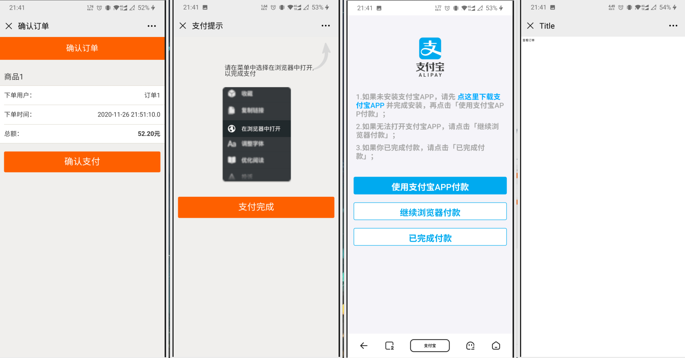

## 1、微信部分

- 微信支付文档：[【微信支付】JSAPI支付开发者文档](https://pay.weixin.qq.com/wiki/doc/api/jsapi.php?chapter=7_1)。

- 微信公众账户测试号获取：[公众号测试号](https://developers.weixin.qq.com/doc/offiaccount/Basic_Information/Requesting_an_API_Test_Account.html)。

- 使用natapp内网穿透：[基于springboot接入微信公众号（内网穿透技术）](https://blog.csdn.net/weixin_39735923/article/details/79242827)。以下挨打url中，带有http://xxxx.natappfree.cc格式的均为请求到的不同的穿透域名。

- 此外，还需要设置体验接口权限表下的网页账号的授权回调页面域名（不能填带/的路径）。

- 获取openID：手工方式和SDK方式。

  - 请求：

    ```http
    重定向到 /sell/wechat/authorize
    ```

  - 参数：

    ```properties
    returnUrl: http://xxx.com/abc  //【必填】
    ```

  - 返回：

    ```http
    http://xxx.com/abc?openid=oZxSYw5ldcxv6H0EU67GgSXOUrVg
    ```

- 网页回调手动获取openID：[微信网页授权](https://developers.weixin.qq.com/doc/offiaccount/OA_Web_Apps/Wechat_webpage_authorization.html)

  - 第一步：用户同意授权，获取code

    - 请求用户授权，访问：

      ```http
      https://open.weixin.qq.com/connect/oauth2/authorize?appid=APPID&redirect_uri=REDIRECT_URI&response_type=code&scope=SCOPE&state=STATE#wechat_redirect
      
      ----
      
      https://open.weixin.qq.com/connect/oauth2/authorize?appid=APPID&redirect_uri=http://hpqv53.natappfree.cc/sell/auth&response_type=code&scope=snsapi_base&state=123#wechat_redirect
      ```

    -  具体参数含义：

      | 参数             | 是否必须 | 说明                                                         |
      | :--------------- | :------- | :----------------------------------------------------------- |
      | appid            | 是       | 公众号的唯一标识                                             |
      | redirect_uri     | 是       | 授权后重定向的回调链接地址， 请使用 urlEncode 对链接进行处理 |
      | response_type    | 是       | 返回类型，请填写code                                         |
      | scope            | 是       | 应用授权作用域，snsapi_base （不弹出授权页面，直接跳转，只能获取用户openid），snsapi_userinfo （弹出授权页面，可通过openid拿到昵称、性别、所在地。并且， 即使在未关注的情况下，只要用户授权，也能获取其信息 ） |
      | state            | 否       | 重定向后会带上state参数，开发者可以填写a-zA-Z0-9的参数值，最多128字节 |
      | #wechat_redirect | 是       | 无论直接打开还是做页面302重定向时候，必须带此参数            |

    - 如果用户同意授权，页面将跳转至 redirect_uri/?code=CODE&state=STATE。

      -  code作为换取access_token的票据，每次用户授权带上的code将不一样，code只能使用一次，5分钟未被使用自动过期。

  - 第二步：通过code换取网页授权access_token

    - 获取code后，请求以下链接获取access_token：

      ```http
      https://api.weixin.qq.com/sns/oauth2/access_token?appid=APPID&secret=SECRET&code=CODE&grant_type=authorization_code
      
      --- 改成具体的APPID和SECRETID
      
      https://api.weixin.qq.com/sns/oauth2/access_token?appid=APPID&secret=SECRETID&code=CODE&grant_type=authorization_code
      ```

    - 参数说明：

      | 参数       | 是否必须 | 说明                     |
      | :--------- | :------- | :----------------------- |
      | appid      | 是       | 公众号的唯一标识         |
      | secret     | 是       | 公众号的appsecret        |
      | code       | 是       | 填写第一步获取的code参数 |
      | grant_type | 是       | 填写为authorization_code |

    - 返回格式：

      ```json
      //成功时
      {
        "access_token":"ACCESS_TOKEN",
        "expires_in":7200,
        "refresh_token":"REFRESH_TOKEN",
        "openid":"OPENID",
        "scope":"SCOPE" 
      }
      
      //错误时
      {"errcode":40029,"errmsg":"invalid code"}
      ```

    - 参数说明：

      | 参数          | 描述                                                         |
      | :------------ | :----------------------------------------------------------- |
      | access_token  | 网页授权接口调用凭证,注意：此access_token与基础支持的access_token不同 |
      | expires_in    | access_token接口调用凭证超时时间，单位（秒）                 |
      | refresh_token | 用户刷新access_token                                         |
      | openid        | 用户唯一标识，请注意，在未关注公众号时，用户访问公众号的网页，也会产生一个用户和公众号唯一的OpenID |
      | scope         | 用户授权的作用域，使用逗号（,）分隔                          |

  - 代码：

    ```java
    @RestController
    public class WeiXinController {
        private final Logger logger = LoggerFactory.getLogger(WeChatController.class);
        @GetMapping("/auth")
        public void auth(@RequestParam("code") String code) {
            logger.info("code={}",code);
            String url = "https://api.weixin.qq.com/sns/oauth2/access_token?appid=APPID&secret=SECRETID&code="+code+"&grant_type=authorization_code";
            RestTemplate restTemplate = new RestTemplate();
            String access = restTemplate.getForObject(url, String.class);
            logger.info(access);
        }
    }
    ```

- 使用SDK方式：[MP_OAuth2网页授权 ](https://github.com/Wechat-Group/WxJava/wiki/MP_OAuth2网页授权)

  - maven依赖：

    ```xml
    <dependency>
        <groupId>com.github.binarywang</groupId>
        <artifactId>weixin-java-mp</artifactId>
        <version>2.7.0</version>
    </dependency>
    
    <!-- Springboot的配置类 -->
    <dependency>
        <groupId>org.springframework.boot</groupId>
        <artifactId>spring-boot-configuration-processor</artifactId>
        <optional>true</optional>
    </dependency>
    ```

  - 配置类：

    ```java
    @Component
    @ConfigurationProperties(prefix = "wechat")
    public class WechatAccountConfig {
        private String mpAppId;
        private String mpAppSecret;
    }
    ```

  - 配置文件：

    ```yaml
    wechat:
      mpAppId: wx4451dcc6f165f0f4
      mpAppSecret: cf93b89968d2fdf90af56d733ccd1a16
    ```

  - 自动配置：

    ```java
    @Component
    @Configuration
    public class WechatMConfig {
        @Autowired
        private WechatAccountConfig accountConfig;
        @Bean
        public WxMpService wxMPService(){
            WxMpService wxMpService = new WxMpServiceImpl();
            wxMpService.setWxMpConfigStorage(wxMpConfigStorage());
            return wxMpService;
        }
        @Bean
        public WxMpConfigStorage wxMpConfigStorage(){
            WxMpInMemoryConfigStorage wxMpConfigStorage = new WxMpInMemoryConfigStorage();
            wxMpConfigStorage.setAppId(accountConfig.getMpAppId());
            wxMpConfigStorage.setSecret(accountConfig.getMpAppSecret());
            return wxMpConfigStorage;
        }
    }
    ```

  - SDK网页授权：

    1. authorize方法相当于获取code。
    2. userInfo方法相当于根据code获取openid。

    ```java
    @Controller
    @RequestMapping("/wechat")
    public class WechatController {
        @Autowired
        private WxMpService wxMpService;
        @GetMapping("/authorize")
        public String authorize(@RequestParam("returnUrl") String returnUrl){
            String url = "http://hpqv53.natappfree.cc/sell/wechat/userInfo";
            String redirectUrl = wxMpService.oauth2buildAuthorizationUrl(url, WxConsts.OAUTH2_SCOPE_BASE, returnUrl);
            System.out.println(redirectUrl);
            return "redirect:"+redirectUrl;
    
        }
        @GetMapping("/userInfo")
        public String userInfo(@RequestParam("code") String code,
                             @RequestParam("state") String returnUrl){
            WxMpOAuth2AccessToken accessToken;
            try {
                accessToken = wxMpService.oauth2getAccessToken(code);
            } catch (WxErrorException e) {
                throw new SellException(ResultEnum.WECHAT_MP_ERROR,e.getError().getErrorMsg());
            }
            String openId = accessToken.getOpenId();
            return "redirect:"+returnUrl+"?openid="+openId;
        }
    }
    ```

  - 测试请求以下链接：

    ```http
    http://hpqv53.natappfree.cc/sell/wechat/authorize?returnUrl=http://www.imooc.com
    ```

- 接入前端调试：

  - 首先更改前端项目中的/config/index.js中：

    ```js
    sellUrl: 'sell.com',
    openidUrl: 'http://43bwcy.natappfree.cc/sell/wechat/authorize',
    ```

  - 然后npm run build编译，编译后的文件在dist目录下，再复制到Nginx部署静态资源的位置。

  - 获取电脑和手机的IP地址。测试能不能ping通。

  - 在手机上设置手动HTTP代理，地址为电脑的IP地址，端口为8888。

  - 下载fiddler，设置监听端口为8888，并且允许远程连接。


## 2、支付部分

- 主要用到的是统一下单和支付结果通知两个API。

- 使用SDK：[支付SDK](https://github.com/pay-group/best-pay-sdk)。

  - 请求：

    ```http
    重定向 /sell/pay/create
    ```

  - 参数：

    ```properties
    orderId:16465165415452
    returnUrl:http://xxx.com/abc/order/16465165415452
    ```

  - 返回：

    ```http
    http://xxx.com/abc/order/16465165415452
    ```

  - maven依赖：

    ```xml
    <dependency>
        <groupId>cn.springboot</groupId>
        <artifactId>best-pay-sdk</artifactId>
        <version>1.1.0</version>
    </dependency>
    ```

- 但是微信测试号不提供支付功能，只能用在微信内拉起支付宝的方式测试，因为支付宝提供了沙箱测试环境。[开放平台-沙箱环境 (alipay.com)](https://openhome.alipay.com/platform/appDaily.htm)。

- 使用官方的老SDK

    - 引入老SDK的maven依赖：

      ```xml
      <dependency>
          <groupId>com.alipay.sdk</groupId>
          <artifactId>alipay-sdk-java</artifactId>
          <version>4.10.167.ALL</version>
      </dependency>
      ```
      
  - 根据[官方的接入文档](https://opendocs.alipay.com/open/203/105285#%E5%88%9B%E5%BB%BA%E8%AE%A2%E5%8D%95)，主要是对AlipayClient和AlipayTradeWapPayRequest进行一些配置，然后用`form = alipayClient.pageExecute(alipayRequest).getBody()`获取提交到前端的表单，用`response.getWriter().write(form)`输出。

- 支付宝支付相关的配置类：

  - 配置类：

    ```java
    @Component
    @ConfigurationProperties(prefix = "alipay")
    public class AlipayConfig {
        String charset = "UTF-8";
        String appId;
        String appPrivateKey;
        String alipayPublicKey;
        String serverUrl = "https://openapi.alipaydev.com/gateway.do";
        String baseUrl;
    }
    ```

  - 配置文件：

    ```yaml
    alipay:
      app-id: 
      alipay-public-key: 
      app-private-key: 
      base-url: 
    ```

  - 可以先用这种方式测试一下。

- 支付宝针对官方的老SDK提供了实现的[Demo](https://opendocs.alipay.com/open/203/105285/#%E5%BE%AE%E4%BF%A1%E5%85%AC%E4%BC%97%E5%B9%B3%E5%8F%B0%E6%97%A0%E6%B3%95%E4%BD%BF%E7%94%A8%E6%94%AF%E4%BB%98%E5%AE%9D%E6%94%B6%E4%BB%98%E6%AC%BE%E7%9A%84%E8%A7%A3%E5%86%B3%E6%96%B9%E6%A1%88)：

  - demo中，ap.js提供了跳转逻辑，pay.htm是提供了跳转页面，另外两个是示例。使用需要注意的是要在htm文件中正确配置ap.js的路径。
  - 以get方式为例，最终访问的是demo_get.htm下的确认支付的a标签中的href路径。如果使用get方式，需要将后端的请求数据动态传入，可以使用freemaker模板引擎。

- freemaker模板引擎：

  - maven依赖：

    ```xml
    <dependency>
        <groupId>org.springframework.boot</groupId>
        <artifactId>spring-boot-starter-freemarker</artifactId>
    </dependency>
    ```

  - 前端使用：

    - 在template目录下创建后缀为.ftl的文件。
    - 使用`${键名}`的方式获取后端传入的数据，对于对象使用`${键名.属性名}`。

  - 后端数据：

    - 返回一个ModelAndView对象，设置viewName为.ftl文件名。
    - 设置model为一个map形式的数据。


- 实现微信调用支付宝支付：

  - 主要就是要传给前端一个拼接好的url。

  - ` alipayClient.pageExecute(alipayRequest).getBody()`返回的String对象是一个form表单，写到前端是用post方式。

    - 而没有找到单独的获取url等的方法，只好用截取form字符串的方法。（其实用post的demo可能好一点？）
    - 在form表单中，只有biz_content属性是在表单属性，其他都被拼接在了action属性中。

  - 必须调用`alipayClient.pageExecute(alipayRequest)`方法的原因是，需要根据支付宝公钥和应用私钥获得签名sign属性，当然也可以[自行实现](https://opendocs.alipay.com/open/291/106118)。而且经过这个方法后，其中的属性都被UrlEncode了（除了biz_content）。

  - 所以解决办法是对form字符串进行截取（其实不是一个很好的方法），然后拼接UrlEncode后的biz_content属性。

  - 测试控制器：

    ```java
    @Controller
    @RequestMapping("/pay")
    public class PayController {
        @Autowired
        private AlipayConfig alipayConfig;
        @GetMapping("/create")
        public ModelAndView create(@RequestParam("orderId") String orderId,
                           @RequestParam("returnUrl") String returnUrl,
                           HttpServletResponse response){
    
            String CHARSET = alipayConfig.getCharset();
            String APP_ID = alipayConfig.getAppId();
            String APP_PRIVATE_KEY = alipayConfig.getAppPrivateKey();
            String ALIPAY_PUBLIC_KEY = alipayConfig.getAlipayPublicKey();
            AlipayClient alipayClient = new DefaultAlipayClient(alipayConfig.getServerUrl(), APP_ID, APP_PRIVATE_KEY, "json", CHARSET, ALIPAY_PUBLIC_KEY, "RSA2"); //获得初始化的AlipayClient
            AlipayTradeWapPayRequest alipayRequest = new AlipayTradeWapPayRequest();//创建API对应的request
            String baseUrl = alipayConfig.getBaseUrl();
            alipayRequest.setReturnUrl(baseUrl+"/pay/returnUrl");
            alipayRequest.setNotifyUrl(baseUrl+"/pay/notifyUrl");//在公共参数中设置回跳和通知地址
            alipayRequest.setBizContent("{" +
                    " \"out_trade_no\":\"201603200756150101002\"," +
                    " \"total_amount\":\"88.88\"," +
                    " \"subject\":\"Iphone6 84G\"," +
                    " \"product_code\":\"QUICK_WAP_PAY\"" +
                    " }");
    
            String form = "";
            try {
                form = alipayClient.pageExecute(alipayRequest).getBody();
            } catch (AlipayApiException e) {
                e.printStackTrace();
            }
            String oriUrl = StringUtils.substringBetween(form,alipayConfig.getServerUrl(),"\">");
            String biz_content = "";
            try {
                biz_content = URLEncoder.encode(alipayRequest.getBizContent(),"utf-8");
            } catch (UnsupportedEncodingException e) {
                e.printStackTrace();
            }
            String toUrl = oriUrl + "&biz_content=" + biz_content;
    
            toUrl = alipayConfig.getServerUrl() + toUrl;
            Map<String,String> map = new HashMap<>();
            map.put("toUrl",toUrl);
            return new ModelAndView("confirm_order",map);
        }
    }
    ```

  - 前端模板页面confirm_order.ftl，其实就是把demo_get.htm中a标签中具体的url变成了`${toUrl}`。

- 实现效果：

  

- 实现具体业务：
  
  - 根据传入的orderId查询订单详情，获取相关信息并且传到前端。
  
  - 控制器：
  
    ```java
    @Controller
    @RequestMapping("/pay")
    public class PayController {
        private Logger logger = LoggerFactory.getLogger(PayController.class);
        @Autowired
        private OrderMasterService masterService;
        @Autowired
        private PayService payService;
        @GetMapping("/create")
        public ModelAndView create(@RequestParam("orderId") String orderId,
                                   @RequestParam("returnUrl") String returnUrl) {
            OrderDTO orderDTO = masterService.findOne(orderId);
            if (orderDTO == null) {
                logger.error("【支付出错】订单不存在，orderId={}",orderId);
                throw new SellException(ResultEnum.ORDER_NOT_EXIST);
            }
            //拼接订单中的商品名
            StringBuilder subject = new StringBuilder();
            List<OrderDetail> orderDetailList = orderDTO.getOrderDetailList();
            for (OrderDetail orderDetail : orderDetailList) {
                subject.append(orderDetail.getProductName()).append(" ");
            }
            Map<String, String> returnMap = payService.create(orderDTO);
            Map<String, String> map = new HashMap<>();
            map.put("toUrl", returnMap.get("toUrl"));
            try {
                map.put("checkUrl", returnMap.get("checkUrl") + "&returnUrl=" + URLEncoder.encode(returnUrl,"utf-8"));
            } catch (UnsupportedEncodingException e) {
                e.printStackTrace();
            }
            map.put("productName",subject.toString());
            map.put("amount", orderDTO.getOrderAmount().toString());
            map.put("buyerName",orderDTO.getBuyerName());
            map.put("orderTime", orderDTO.getCreateTime().toString());
            map.put("orderId", orderId);
            return new ModelAndView("confirm_order", map);
        }
    }
    ```
  
  - 业务层：
  
    ```java
    @Service
    public class PayServiceImpl implements PayService {
        @Autowired
        private AlipayConfig alipayConfig;
        @Autowired
        private OrderMasterService masterService;
        private Logger logger = LoggerFactory.getLogger(PayServiceImpl.class);
        @Override
        public Map<String, String> create(OrderDTO orderDTO) {
            String subject = getProductNames(orderDTO);
            String CHARSET = alipayConfig.getCharset();
            String APP_ID = alipayConfig.getAppId();
            String APP_PRIVATE_KEY = alipayConfig.getAppPrivateKey();
            String ALIPAY_PUBLIC_KEY = alipayConfig.getAlipayPublicKey();
            AlipayClient alipayClient = new DefaultAlipayClient(alipayConfig.getServerUrl(), APP_ID, APP_PRIVATE_KEY, "json", CHARSET, ALIPAY_PUBLIC_KEY, "RSA2"); //获得初始化的AlipayClient
            AlipayTradeWapPayRequest alipayRequest = new AlipayTradeWapPayRequest();//创建API对应的request
            String baseUrl = alipayConfig.getBaseUrl();
            alipayRequest.setReturnUrl(baseUrl + "/pay/backwechat");
            alipayRequest.setNotifyUrl(baseUrl + "/pay/notifyUrl");//在公共参数中设置回跳和通知地址
            alipayRequest.setBizContent("{" +
                    " \"out_trade_no\":\"" + orderDTO.getOrderId() + "\"," +
                    " \"total_amount\":\"" + orderDTO.getOrderAmount() + "\"," +
                    " \"subject\":\"" + subject + "\"," +
                    " \"product_code\":\"QUICK_WAP_PAY\"" +
                    " }");
            String form = "";
            try {
                form = alipayClient.pageExecute(alipayRequest).getBody();
            } catch (AlipayApiException e) {
                e.printStackTrace();
            }
            String oriUrl = StringUtils.substringBetween(form, alipayConfig.getServerUrl(), "\">");
            String biz_content = "";
            try {
                biz_content = URLEncoder.encode(alipayRequest.getBizContent(), "utf-8");
            } catch (UnsupportedEncodingException e) {
                e.printStackTrace();
            }
            String toUrl = oriUrl + "&biz_content=" + biz_content;
    
            toUrl = alipayConfig.getServerUrl() + toUrl;
            String checkUrl = baseUrl + "/pay/checkpay?orderId=" + orderDTO.getOrderId();
            Map<String, String> map = new HashMap<>();
            map.put("toUrl",toUrl);
            map.put("checkUrl",checkUrl);
    
            return map;
        }
    
        private String getProductNames(OrderDTO orderDTO) {
            StringBuilder subject = new StringBuilder();
            List<OrderDetail> orderDetailList = orderDTO.getOrderDetailList();
            for (OrderDetail orderDetail : orderDetailList) {
                subject.append(orderDetail.getProductName()).append(" ");
          }
            return subject.toString();
        }
    }
    ```
    
    
  
- 异步通知：

  - 验证签名。

  - 获取返回的支付状态。

  - 校验支付金额。

  - 全部校验通过后，通知支付平台停止异步通知。

  - 具体见[支付宝异步回调文档](https://opendocs.alipay.com/open/203/105286)。

  - 控制器：

    ```java
    @PostMapping("/notifyUrl")
    public void notifyUrl(HttpServletRequest request, HttpServletResponse response) {
        boolean signVerified = payService.notifyUrl(request, response);
        if (signVerified) {
            masterService.paid(masterService.findOne(request.getParameter("out_trade_no")));
        }
        logger.info("【异步回调】回调结果{},orderId={}",signVerified,request.getParameter("out_trade_no"));
    }
    ```

  - 业务层：

    ```java
    @Override
    public boolean notifyUrl(HttpServletRequest request, HttpServletResponse response) {
        response.setContentType("text/html;charset=utf-8");
    
        Map<String, String> paramsMap = new HashMap<>(); //将异步通知中收到的所有参数都存放到map中
        Map<String, String[]> requestParams = request.getParameterMap();
        for (Iterator<String> iter = requestParams.keySet().iterator(); iter.hasNext();) {
            String name = iter.next();
            String[] values = requestParams.get(name);
            String valueStr = "";
            for (int i = 0; i < values.length; i++) {
                valueStr = (i == values.length - 1) ? valueStr + values[i] : valueStr + values[i] + ",";
            }
            paramsMap.put(name, valueStr);
        }
    
        boolean signVerified = false; //调用SDK验证签名
        try {
            signVerified = AlipaySignature.rsaCheckV1(paramsMap, alipayConfig.getAlipayPublicKey(), alipayConfig.getCharset(), alipayConfig.getSign_type());
        } catch (AlipayApiException e) {
            e.printStackTrace();
        }
    
    
        boolean check = checkBotifyRequest(paramsMap);
        try {
            PrintWriter writer = response.getWriter();
            check = checkBotifyRequest(paramsMap);
            if(signVerified && check){
                writer.write("success");
                logger.info("【回调支付成功】,orderId={}",request.getParameter("out_trade_no"));
            }else{
                writer.write("failure");
                logger.info("【回调支付失败】,orderId={}",request.getParameter("out_trade_no"));
            }
            response.getWriter().close();
        } catch (IOException e) {
            e.printStackTrace();
        }
    
        return signVerified && check;
    }
    ```
  
- 还要考虑的一点是从外部浏览器支付完成后如何跳转回微信：

  - 首先，直接用同步回调returnUrl（固定为/backwechat）回到微信：

    - 控制器：

      ```java
      @GetMapping("/backwechat")
      public ModelAndView backwechat(){
          return new ModelAndView("jumpback");
      }
      ```

    - 前端：

      ```html
      <script>
          window.onload =function () {
              window.location = "weixin://"
          }
      </script>
      ```

    - 这样回到的就是跳转之前的微信界面，但是现在的问题是如何进入下一步。

  - 改造原有的跳转页面，增加一个支付完成的按钮。

    - 添加在pay.htm中：
    
      ```html
      <div class="wrapper buy-wrapper">
          <a id="checkpay" class="J-btn-submit btn mj-submit btn-strong btn-larger btn-block">支付完成</a>
      </div>
      ```
    
      ```javascript
      var checkUrl = getQueryString(location.href, "checkUrl");
      var returnUrl = getQueryString(location.href, "returnUrl");
      document.querySelector("#checkpay").href = checkUrl + "&returnUrl=" + returnUrl;
      ```
    
    - 为了能获取checkUrl，需要对之前的前端文件进行一些改造：
    
      - confir_order.ftl：
    
        ```html
        <input id="orderId" type="hidden" value=${checkUrl} />
        ```
    
        ```javascript
        var checkUrl = document.getElementById("orderId").value;
        
        _AP.pay(e.target.href, checkUrl);
        ```
    
      - ap.js：
    
        ```javascript
        b.pay = function(d, checkUrl) {
            var c = encodeURIComponent(a.encode(d));
            location.href = "pay.htm?goto=" + c + "&checkUrl=" + checkUrl;
        };
        ```
    
    - 后端的处理：
    
      - PayServiceImpl中拼接checkUrl，同时使用一个map返回toUrl和checkUrl：
    
        ```java
        String checkUrl = baseUrl + "/pay/checkpay?orderId=" + orderDTO.getOrderId();
        ```
    
      - PayController中放入map中：
    
        ```java
        map.put("checkUrl", returnMap.get("checkUrl"));
        ```
    
  - 最后的结果：

    - 如果支付前直接点支付完成，会查询订单是否完成。
    - 支付完成后在浏览器中点击完成付款，会跳转到微信中，然后点击支付完成会跳转到最终页面。

    

- 接入前端调试：

  - 首先更改前端项目中的/config/index.js中：

    ```javascript
    sellUrl: 'http://sell.com',
    openidUrl: 'http://5w3ab3.natappfree.cc/sell/wechat/authorize',
    wechatPayUrl: 'http://5w3ab3.natappfree.cc/sell/pay/create'
    ```

  - 重新部署前端。

- 退款：

  - 使用请求`AlipayTradeRefundRequest`，传入orderId和退款金额。
  
  - 业务层：
  
    ```java
    @Override
    public void refund(String orderId) {
        String CHARSET = alipayConfig.getCharset();
        String APP_ID = alipayConfig.getAppId();
        String APP_PRIVATE_KEY = alipayConfig.getAppPrivateKey();
        String ALIPAY_PUBLIC_KEY = alipayConfig.getAlipayPublicKey();
        AlipayClient alipayClient = new DefaultAlipayClient(alipayConfig.getServerUrl(), APP_ID, APP_PRIVATE_KEY, "json", CHARSET, ALIPAY_PUBLIC_KEY, "RSA2"); //获得初始化的AlipayClient
        AlipayTradeRefundRequest request = new AlipayTradeRefundRequest();//创建API对应的request类
        OrderDTO orderDTO = masterService.findOne(orderId);
        request.setBizContent("{" +
                              "\"out_trade_no\":\"" + orderId + "\"," +
                              "\"out_request_no\":\"1000001\"," +
                              "\"refund_amount\":\"0" + orderDTO.getOrderAmount() + "\"}"); //设置业务参数
        AlipayTradeRefundResponse response = null;//通过alipayClient调用API，获得对应的response类
        try {
            response = alipayClient.execute(request);
        } catch (AlipayApiException e) {
            e.printStackTrace();
        }
        System.out.print(response.getBody());
    }
    ```
  
  - 在orderMasterService的cancel取消订单方法中最后被调用。


