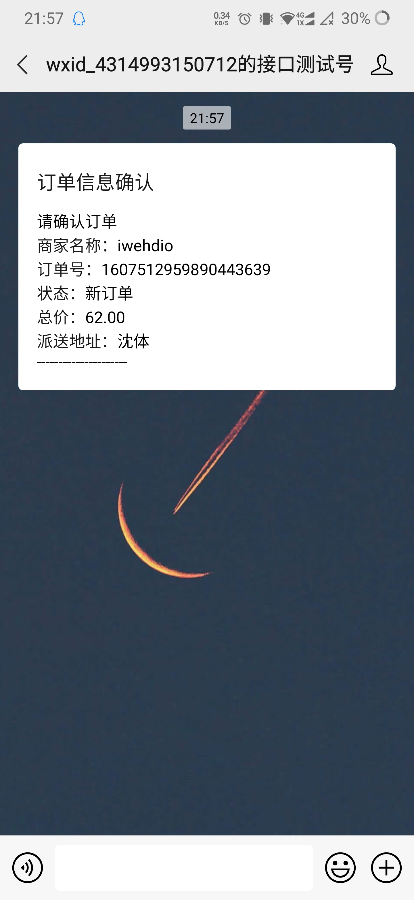
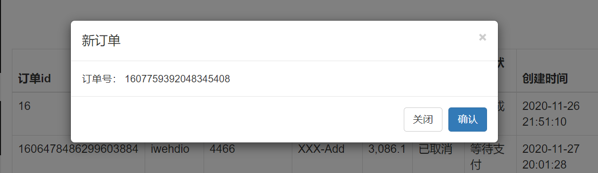

## 1、卖家订单

- 请求：

  ```yaml
  订单列表: /seller/order/list?page=1&size=10
  取消订单: /seller/order/cancel?orderId=1
  订单详情: /seller/order/detail?orderId=1
  完结订单: /seller/order/finish?orderId=1
  ```

- 订单业务层OrderMasterService：

  - 查看订单列表：

    - 控制器：

      ```java
      @Controller
      @RequestMapping("/seller/order")
      public class SellerOrderController {
          @Autowired
          private OrderMasterService masterService;
          @GetMapping("/list")
          public ModelAndView list(@RequestParam(value = "page",defaultValue = "1") Integer page,
                                   @RequestParam(value = "size",defaultValue = "10") Integer size,
                                   Map<String,Object> map){
              PageRequest request = new PageRequest(page-1, size);
              Page<OrderDTO> orderDTOPage = masterService.findAll(request);
              map.put("orderDTOPage",orderDTOPage);
              return new ModelAndView("order/list",map);
          }
      }
      ```

    - 业务层：

      ```java
      @Override
      public Page<OrderDTO> findAll(Pageable pageable) {
          Page<OrderMaster> masterPage = masterDao.findAll(pageable);
          List<OrderDTO> orderDTOList = OrderMaster2OrderDTOConverter.convert(masterPage.getContent());
          return new PageImpl<OrderDTO>(orderDTOList, pageable, masterPage.getTotalElements());
      }
      ```

  - 根据数据库中订单状态和支付状态的code获取对应的枚举的message信息：

    - 创建接口，两个状态的枚举都实现该接口：

      ```java
      public interface CodeEnum {
          Integer getCode();
      }
      ```

    - 创建工具类：

      ```java
      public class EnumUtil {
          public static <T extends CodeEnum> T getByCode(Integer code, Class<T> enumClass){
              for (T enumConstant : enumClass.getEnumConstants()) {
                  if (code.equals(enumConstant.getCode())){
                      return enumConstant;
                  }
              }
              return null;
          }
      }
      ```

    - 在OrderDTO中创建对应方法：

      ```java
      @JsonIgnore
      public OrderStatusEnum getOrderStatusEnum() {
          return EnumUtil.getByCode(orderStatus, OrderStatusEnum.class);
      }
      @JsonIgnore
      public PayStatusEnum getpayStatusEnum() {
          return EnumUtil.getByCode(payStatus, PayStatusEnum.class);
      }
      ```

    - 前端使用：

      ```html
      <#list orderDTOPage.content as orderDTO>
          <tr>
              <td>${orderDTO.orderId}</td>
              <td>${orderDTO.buyerName}</td>
              <td>${orderDTO.buyerPhone}</td>
              <td>${orderDTO.buyerAddress}</td>
              <td>${orderDTO.orderAmount}</td>
              <td>${orderDTO.getOrderStatusEnum().getMessage()}</td>
              <td>${orderDTO.getpayStatusEnum().getMessage()}</td>
              <td>${orderDTO.createTime}</td>
              <td>
                  <a href="/sell/seller/order/detail?orderId=${orderDTO.orderId}">详情</a>
              </td>
              <td>
                  <#if orderDTO.getOrderStatusEnum().getMessage() =="新订单">
                      <a href="/sell/seller/order/cancel?orderId=${orderDTO.orderId}">取消</a>
                  </#if>
              </td>
          </tr>
      </#list >
      ```

  - 翻页效果：

    ```html
    <div class="col-md-12 column">
        <ul class="pagination pull-right">
            <#if currentPage lte 1>
                <li class="disabled"><a href="#">上一页</a></li>
            <#else>
                <li><a href="/sell/seller/order/list?page=${currentPage-1}&size=${size}">上一页</a></li>
            </#if>
            <#list 1..orderDTOPage.getTotalPages() as index>
                <#if currentPage == index>
                    <li class="disabled"><a href="#">${index}</a></li>
                <#else>
                    <li><a href="/sell/seller/order/list?page=${index}&size=${size}">${index}</a></li>
                </#if>
            </#list>
            <#if currentPage gte orderDTOPage.getTotalPages()>
                 <li class="disabled" ><a href="#">下一页</a></li>
            <#else>
                <li><a href="/sell/seller/order/list?page=${currentPage+1}&size=${size}">下一页</a></li>
            </#if>
        </ul>
    </div>
    ```

  - 取消订单按钮：

    - 控制器：

      ```java
      private String returnUrl = "/sell/seller/order/list";
      @GetMapping("/cancel")
      public ModelAndView cancel(@RequestParam("orderId") String orderId,
                                 Map<String,Object> map){
          OrderDTO orderDTO;
          try {
              orderDTO = masterService.findOne(orderId);
              masterService.cancel(orderDTO);
          } catch (SellException e) {
              map.put("msg", e.getMessage());
              map.put("url",returnUrl);
              return new ModelAndView("sellerOrder/error",map);
          }
      
          map.put("msg", "SUCCESS");
          map.put("url",returnUrl);
          return new ModelAndView("sellerOrder/success",map);
      }
      ```

    - 前端：

      ```html
      <td>
          <#if orderDTO.getOrderStatusEnum().getMessage() !="已取消">
              <a href="/sell/seller/order/cancel?orderId=${orderDTO.orderId}">取消</a>
          </#if>
      </td>
      ```

    - 所要跳转的页面：

      ```html
      <body>
      <div class="container">
          <div class="row clearfix">
              <div class="col-md-12 column">
                  <div class="alert alert-dismissable alert-success">
                      <button type="button" class="close" data-dismiss="alert" aria-hidden="true">×</button>
                      <h4>
                         成功!
                      </h4> <strong>${msg}</strong><a href="${url}" class="alert-link"> 3s后返回</a>
                  </div>
              </div>
          </div>
      </div>
      <script>
          setTimeout('location.href="${url}"',3000);
      </script>
      </body>
      ```

  - 详情按钮：

    - 控制器：

      ```java
      @GetMapping("/detail")
          public ModelAndView detail(@RequestParam("orderId") String orderId,
                                     Map<String,Object> map) {
              OrderDTO orderDTO;
              try {
                  orderDTO = masterService.findOne(orderId);
              } catch (SellException e) {
                  map.put("msg", e.getMessage());
                  map.put("url",returnUrl);
                  return new ModelAndView("sellerOrder/error",map);
              }
              map.put("orderDTO", orderDTO);
              return new ModelAndView("sellerOrder/detail",map);
          }
      ```

    - 前端：

      ```html
      <div class="container">
          <div class="row clearfix">
              <div class="col-md-12 column">
                  <table class="table table-hover table-bordered">
                      <thead>
                      <tr>
                          <th>订单id</th>
                          <th>订单金额</th>
                      </tr>
                      </thead>
                      <tbody>
                      <tr>
                          <td>${orderDTO.orderId}</td>
                          <td>${orderDTO.orderAmount}</td>
                      </tr>
                      </tbody>
                  </table>
              </div>
      
              <div class="col-md-12 column">
                  <table class="table table-hover table-bordered">
                      <thead>
                      <tr>
                          <th>商品id</th>
                          <th>商品名称</th>
                          <th>价格</th>
                          <th>数量</th>
                          <th>总价</th>
                      </tr>
                      </thead>
                      <tbody>
                      <#list orderDTO.orderDetailList as detail>
                      <tr>
                          <td>${detail.productId}</td>
                          <td>${detail.productName}</td>
                          <td>${detail.productPrice}</td>
                          <td>${detail.productQuantity}</td>
                          <td>${detail.productPrice * detail.productQuantity}</td>
                      </tr>
                      </#list>
                      </tbody>
                  </table>
              </div>
      
              <div class="col-md-12 column">
                  <#if orderDTO.getOrderStatusEnum().getMessage() != "已取消">
                      <a href="/sell/seller/order/finish?orderId=${orderDTO.orderId}" type="button" class="btn btn-default btn-primary">完结订单</a>
                      <a href="/sell/seller/order/cancel?orderId=${orderDTO.orderId}" type="button" class="btn btn-default btn-danger">取消订单</a>
                  </#if>
              </div>
      
          </div>
      </div>
      ```

    - 完结订单：

      ```java
      @GetMapping("/finish")
      public ModelAndView finish(@RequestParam("orderId") String orderId,
                                 Map<String,Object> map) {
          OrderDTO orderDTO;
          try {
              orderDTO = masterService.findOne(orderId);
              masterService.finish(orderDTO);
          } catch (SellException e) {
              map.put("msg", e.getMessage());
              map.put("url",returnUrl);
              return new ModelAndView("sellerOrder/error",map);
          }
          map.put("msg", "SUCCESS");
          map.put("url",returnUrl);
          return new ModelAndView("sellerOrder/success",map);
      }
      ```

      


## 2、商品列表

- 请求：

  ```yaml
  商品列表: /seller/product/list?page=1&size=10
  商品上架: /seller/product/onSale?productId=1
  商品下架: /seller/product/offSale?productId=1
  商品新增: /seller/product/index
  商品修改: /seller/product/index?productId=1
  ```
  
- 卖家后端侧边栏（需要css样式）：

  ```html
  <nav class="navbar navbar-inverse navbar-fixed-top" id="sidebar-wrapper" role="navigation">
      <ul class="nav sidebar-nav">
          <li class="sidebar-brand">
              <a href="#">
                  卖家管理系统
              </a>
          </li>
          <li>
              <a href="/sell/seller/order/list"><i class="fa fa-fw fa-list-alt"></i> 订单</a>
          </li>
          <li class="dropdown open">
              <a href="#" class="dropdown-toggle" data-toggle="dropdown" aria-expanded="true"><i class="fa fa-fw fa-plus"></i> 商品 <span class="caret"></span></a>
              <ul class="dropdown-menu" role="menu">
                  <li class="dropdown-header">操作</li>
                  <li><a href="/sell/seller/product/list">列表</a></li>
                  <li><a href="/sell/seller/product/index">新增</a></li>
              </ul>
          </li>
          <li class="dropdown open">
              <a href="#" class="dropdown-toggle" data-toggle="dropdown" aria-expanded="true"><i class="fa fa-fw fa-plus"></i> 类目 <span class="caret"></span></a>
              <ul class="dropdown-menu" role="menu">
                  <li class="dropdown-header">操作</li>
                  <li><a href="/sell/seller/category/list">列表</a></li>
                  <li><a href="/sell/seller/category/index">新增</a></li>
              </ul>
          </li>
  
          <li>
              <a href="/sell/seller/logout"><i class="fa fa-fw fa-list-alt"></i> 登出</a>
          </li>
      </ul>
  </nav>
  ```

- 引入侧边栏：

  ```html
  <link rel="stylesheet" href="/sell/css/style.css">
  
  <div id="wrapper" class="toggled">
      <!--    侧边栏，这里的引入路径是从templates下开始的绝对路径    -->
      <#include "/sellerOrder/nav.ftl">
  
      <!--    主体内容在这个div中   -->
      <div id="page-content-wrapper">
  
      </div>
  </div>
  ```

- 商品列表控制器：

  ```java
  @Controller
  @RequestMapping("/seller/product")
  public class SellerProductController {
      @Autowired
      private ProductInfoService productService;
      @Autowired
      private ProductCategoryService categoryService;
      @GetMapping("/list")
      public ModelAndView list(@RequestParam(value = "page",defaultValue = "1") Integer page,
                               @RequestParam(value = "size",defaultValue = "10") Integer size,
                               Map<String,Object> map){
          PageRequest request = new PageRequest(page-1, size);
          Page<ProductInfo> productInfoPage = productService.findAll(request);
          map.put("productInfoPage",productInfoPage);
          map.put("currentPage",page);
          map.put("size",size);
          return new ModelAndView("sellerProduct/list",map);
      }
  }
  ```

  

- 商品上下架：

  - 商品信息业务层：

    ```java
    @Override
    public ProductInfo onSale(String pruductId) {
        ProductInfo productInfo = dao.findOne(pruductId);
        if (productInfo == null) {
            throw new SellException(ResultEnum.PRODUCT_NOT_EXIST);
        }
        if (productInfo.getProductStatusEnum() == ProductStatusEnum.UP) {
            throw new SellException(ResultEnum.PRODUCT_STATUS_ERROR);
        }
        productInfo.setProductStatus(ProductStatusEnum.UP.getCode());
        return dao.save(productInfo);
    }
    ```

  - 控制器：

    ```java
    private String returnUrl = "/sell/seller/product/list";
    @GetMapping("/onSale")
    public ModelAndView onSale(@RequestParam("productId") String productId,
                               Map<String,Object> map) {
        try {
            productService.onSale(productId);
        } catch (SellException e) {
            map.put("msg", e.getMessage());
            map.put("url",returnUrl);
            return new ModelAndView("common/error",map);
        }
        map.put("msg", "SUCCESS");
        map.put("url",returnUrl);
        return new ModelAndView("common/success",map);
    }
    ```

- 商品新增修改：

  - 跳转商品修改页并回显：

    - 控制器：

      ```java
      @GetMapping("/index")
      public ModelAndView index(@RequestParam(value = "productId",required = false) String productId,
                                Map<String,Object> map) {
          if (productId!=null && !productId.isEmpty()) {
              ProductInfo productInfo = productService.findOne(productId);
              map.put("productInfo",productInfo);
          }
          List<ProductCategory> categoryList = categoryService.findAll();
          map.put("categoryList", categoryList);
          return new ModelAndView("sellerProduct/index",map);
      
      }
      ```

    - 前端：

      ```html
      <html>
      <head>
          <meta charset="utf-8">
          <link rel="stylesheet" href="/sell/css/style.css">
          <link href="https://cdn.bootcdn.net/ajax/libs/twitter-bootstrap/3.3.5/css/bootstrap.min.css" rel="stylesheet">
      </head>
      <body>
      <div id="wrapper" class="toggled">
          <!--    侧边栏    -->
          <#include "common/nav.ftl">
      
          <!--    主体内容在这个div中   -->
          <div id="page-content-wrapper">
              <div class="container-fluid">
              <div class="row clearfix">
                  <div class="col-md-12 column">
                      <form role="form" method="post" action="/sell/seller/product/save">
                          <div class="form-group">
                              <label>名称</label>
                              <input name="productName" value="${(productInfo.productName)!''}" type="text" class="form-control" >
                          </div>
                          <div class="form-group">
                              <label>库存</label>
                              <input name="productName" value="${(productInfo.productStock)!''}" type="number" class="form-control" >
                          </div>
                          <div class="form-group">
                              <label>描述</label>
                              <input name="productName" value="${(productInfo.productDescription)!''}" type="text" class="form-control" >
                          </div>
                          <div class="form-group">
                              <label>图片</label>
                              
                              <input name="productName" value="${(productInfo.productIcon)!''}" type="text" class="form-control" >
                          </div>
                          <div class="form-group">
                              <label>类目</label>
                              <select name="categoryType" class="form-control">
                                  <#list categoryList as category>
                                      <option value="${category.categoryType}"
                                          <#if productInfo.categoryType == category.categoryType>
                                              selected
                                          </#if>
                                      >${category.categoryName}
                                      </option>
                                  </#list>
                              </select>
                          </div>
                          <input type="hidden" name="productId" value="${(productInfo.productId)!''}">
                          <button type="submit" class="btn btn-default">提交</button>
                      </form>
                  </div>
              </div>
          </div>
          </div>
      </div>
      </body>
      </html>
      ```

  - 修改和新增：

    - 表单类：

      ```java
      public class ProductForm {
          private String productId;
          private String productName;
          private BigDecimal productPrice;
          private Integer productStock;
          private String productDescription;
          private String productIcon;
          private Integer categoryType;
      }
      ```

    - 控制器：

      ```java
      @PostMapping("/save")
      public ModelAndView save(@Valid ProductForm form,
                               BindingResult bindingResult,
                               Map<String,Object> map){
          if (bindingResult.hasErrors()) {
              map.put("msg", bindingResult.getFieldError().getDefaultMessage());
              map.put("url","/sell/seller/product/index");
              return new ModelAndView("common/error",map);
          }
          ProductInfo productInfo = new ProductInfo();
          try {
              if (form.getProductId()!=null && !form.getProductId().isEmpty()) {
                  productInfo = productService.findOne(form.getProductId());
              }else {
                  form.setProductId(KeyUtil.genUniqueKey());
                  productInfo.setProductStatus(ProductStatusEnum.DOWN.getCode());
              }
              BeanUtils.copyProperties(form,productInfo);
              productService.save(productInfo);
          } catch (Exception e) {
              map.put("msg", e.getMessage());
              map.put("url","/sell/seller/product/index");
              return new ModelAndView("common/error",map);
          }
          map.put("msg", "SUCCESS");
          map.put("url",returnUrl);
          return new ModelAndView("common/success",map);
      }
      ```

      


## 3、类目列表

- 请求：

  ```yaml
  类名列表: /seller/category/list
  类名新增: /seller/category/index
  类名修改: /seller/category/index?categoryId=1
  ```

- 类目列表控制器：

  ```java
  @Controller
  @RequestMapping("/seller/category")
  public class SellerCategoryController {
      @Autowired
      private ProductCategoryService categoryService;
      @GetMapping("/list")
      public ModelAndView list(Map<String,Object> map) {
          List<ProductCategory> categoryList = categoryService.findAll();
          map.put("categoryList", categoryList);
          return new ModelAndView("sellerCategory/list",map);
      }
  }
  ```

- 类目修改控制器：

  ```java
  @GetMapping("/index")
  public ModelAndView index(@RequestParam(value = "categoryId",required = false) Integer categoryId,
                            Map<String,Object> map) {
      if (categoryId != null) {
          ProductCategory productCategory = categoryService.findOne(categoryId);
          map.put("category",productCategory);
      }
      return new ModelAndView("sellerCategory/index",map);
  }
  ```

- 类目保存：

  - 表单类：

    ```java
    public class CategoryForm {
        private Integer categoryId;
        private String categoryName;
        private Integer categoryType;
    }
    ```

  - 控制器：

    ```java
    @PostMapping("/save")
    public ModelAndView save(@Valid CategoryForm form,
                             BindingResult bindingResult,
                             Map<String,Object> map) {
        if (bindingResult.hasErrors()) {
            map.put("msg",bindingResult.getFieldError().getDefaultMessage());
            map.put("url","/sell/seller/category/index");
            return new ModelAndView("common/error",map);
        }
        ProductCategory productCategory = new ProductCategory();
        try {
            if (form.getCategoryId() !=null) {
                productCategory = categoryService.findOne(form.getCategoryId());
            }
            BeanUtils.copyProperties(form,productCategory);
            categoryService.save(productCategory);
        } catch (Exception e) {
            map.put("msg",e.getMessage());
            map.put("url","/sell/seller/category/index");
            return new ModelAndView("common/error",map);
        }
        map.put("msg","SUCCESS");
        map.put("url","/sell/seller/category/list");
        return new ModelAndView("common/success",map);
    }
    ```

- 前端页面与之前类似。


## 4、登入登出

- 什么是分布式系统：
  - 旨在支持应用程序和服务的开发，可以利用物理架构由多个自治的处理元素，不共享主内存，但通过网络发送消息合作。
  - 与集群的联系：集群中的节点都是同一个角色，而分布式是不同的功能模块。
  - 水平扩展：多个服务器提供相同的服务。
  - 垂直扩展：多个服务器提供不同的服务，或者说一块大的服务被拆分为多个功能模块。
- session：
  - 在无状态的Http请求中获取和保存状态。
  - 分布式session，水平或垂直扩展的不同服务器需要保持session统一。
  - 可以使用redis集群，所有的session都存入该集群中。


- 创建卖家信息表：

  - MySQL：

    ```sql
    CREATE TABLE `seller_info`(
    	`seller_id` VARCHAR(32) PRIMARY KEY,
    	`username` VARCHAR(32) NOT NULL,
    	`password` VARCHAR(32) NOT NULL,
    	`openid` VARCHAR(64) NOT NULL,
    	`create_time` TIMESTAMP NOT NULL DEFAULT CURRENT_TIMESTAMP,
    	`update_time` TIMESTAMP NOT NULL DEFAULT CURRENT_TIMESTAMP ON UPDATE CURRENT_TIMESTAMP
    );
    ```

  - 实体类：

    ```java
    @Entity
    public class SellerInfo {
        @Id
        private String sellerId;
        private String username;
        private String passWord;
        private String openid;
    }
    ```

  - dao：

    ```java
    public interface SellerInfoDao extends JpaRepository<SellerInfo,String> {
        SellerInfo findByOpenid(String openid);
        SellerInfo save(SellerInfo sellerInfo);
    }
    ```

  - 业务层：

    ```java
    @Service
    public class SellerInforServiceImpl implements SellerInfoService {
        @Autowired
        private SellerInfoDao dao;
        @Override
        public SellerInfo findSellerInfoByOpenid(String openid) {
            return dao.findByOpenid(openid);
        }
    }
    ```

- 微信扫描获取openid：

  - 开发文档：[网站应用微信登录](https://developers.weixin.qq.com/doc/oplatform/Website_App/WeChat_Login/Wechat_Login.html)。但是需要微信开放平台账户，先搁置。
  - 具体原理：[微信扫码登录原理](https://mp.weixin.qq.com/s/1lG-aAyVycO4zTbOqdy6BA)。
  - 具体获取openid的流程与之前买家端类似，也是先获取code，再根据code获取openid。

- 阿里云安装redis：

  ```shell
  docker pull redis:3.2.8-alpine 
  docker run -itd --name redis_wxdc -p 6379:6379 redis:3.2.8-alpine --requirepass 123456
  ```

- SpringBoot配置文件：

  ```yaml
  Spring: 
  	redis:
          host: ip地址
          port: 6379
          password: 
  ```

- 登入：

  - openid与数据库中的数据匹配。如果不匹配就跳转错误页面。
  - 设置token到redis。token由UUID生成，是存储的键，存储的值是openid，并且设置过期时间。
  - 设置token到Cookie。键是"token"，值是生成的UUID。
  - 校验登录状态，通过Cookie中的token查询redis中有没有对应的数据。

- 登出：

  - 从Cookie中获取token，并从Cookie中清除。
  - 根据token清除redis中的openid。

- AOP实现身份验证：

  - 创建切面类，切入点表达式设置为Seller开头的Controller，且不为登录方法。
  - 创建前置通知，获取请求，查询Cookie和redis。
  - 如果校验不通过则抛出一个登录校验异常。
  - 使用`@ControllerAdvice`全局异常处理。

- 简单的账户密码登录：
  - 在SellerInfoDao中添加方法`SellerInfo findByUsername(String username)`。在业务层也增加对应的方法。
  
  - 登入：
  
    ```java
    @Controller
    @RequestMapping("/seller")
    public class SellerLogController {
        private final String prefix = "token_";
        private final Integer expire = 7200; //过期时间
    
        @Autowired
        private SellerInfoService sellerInfoService;
        @Autowired
        private StringRedisTemplate redisTemplate;
        @GetMapping("/login")
        public ModelAndView login(){
            return new ModelAndView("login/login");
        }
    
        @GetMapping("/loginning")
        public ModelAndView loginning(@RequestParam("username") String username,
                                      @RequestParam("password") String password,
                                      Map<String,Object> map,
                                      HttpServletResponse response){
            SellerInfo sellerInfo = sellerInfoService.findSellerInfoByUsername(username);
            if (sellerInfo==null || sellerInfo.getPassword()==null || !sellerInfo.getPassword().equals(password)) {
                map.put("msg","登录失败");
                map.put("url","/sell/seller/login");
                return new ModelAndView("common/error",map);
            }
            String token = UUID.randomUUID().toString();
            redisTemplate.opsForValue().set(prefix + token, username, expire, TimeUnit.SECONDS);
            CookieUtil.saveCookie(response,prefix, prefix + token);
            return new ModelAndView("redirect:/seller/order/list");
        }
    }
    ```
  
  - 登出：
  
    ```java
    @GetMapping("/logout")
    public ModelAndView logout(HttpServletRequest request,
                               HttpServletResponse response,
                               Map<String,Object> map) {
        String cookie = CookieUtil.removeCookie(request, response,prefix);
        if (cookie!=null) {
            redisTemplate.opsForValue().getOperations().delete(cookie);
        }
        map.put("msg","登出成功");
        map.put("url","#");
        return new ModelAndView("common/success",map);
    }
    ```
  
  - Cookie工具类：
  
    ```java
    public class CookieUtil {
        public static void saveCookie(HttpServletResponse response,String key,String value) {
            Cookie cookie = new Cookie(key, value);
            response.addCookie(cookie);
        }
        public static Cookie findCookie(HttpServletRequest request,String key){
            Cookie[] cookies = request.getCookies();
            if (cookies!=null) {
                for (Cookie cookie : cookies) {
                    if (key.equals(cookie.getName())) {
                        return cookie;
                    }
                }
            }
            return null;
        }
    
        public static String removeCookie(HttpServletRequest request,HttpServletResponse response, String key){
            Cookie cookie = findCookie(request, key);
            if (cookie!=null){
                cookie.setMaxAge(0);
                response.addCookie(cookie);
                return cookie.getValue();
            }
            return null;
        }
    }
    ```
  
- AOP实现身份验证：

  - Aspect切面类：

    ```java
    @Aspect
    @Component
    public class SellerAuthAspect {
        private final String prefix = "token_";
        @Autowired
        private StringRedisTemplate redisTemplate;
        @Pointcut("execution(public * cn.iwehdio.sell.controller.Seller*.*(..))" +
                "&& !execution(public * cn.iwehdio.sell.controller.SellerLogController.*(..))")
        public void verify(){}
    
        @Before("verify()")
        public void doVerify(){
            ServletRequestAttributes attributes = (ServletRequestAttributes) RequestContextHolder.getRequestAttributes();
            HttpServletRequest request = attributes.getRequest();
            Cookie cookie = CookieUtil.findCookie(request, prefix);
            if (cookie==null){
                throw new SellerAuthException();
            }
            String s = redisTemplate.opsForValue().get(cookie.getValue());
            if (s==null){
                throw new SellerAuthException();
            }
        }
    }
    ```

  - 全局异常处理器：

    ```java
    @ControllerAdvice
    public class SellerAuthExceptionHandler {
        @ExceptionHandler(SellerAuthException.class)
        public ModelAndView handlerSellerAuth(){
            return new ModelAndView("redirect:/seller/login");
        }
    }
    ```

    


## 5、消息推送

- 微信模板消息文档：[模板消息接口](https://developers.weixin.qq.com/doc/offiaccount/Message_Management/Template_Message_Interface.html)。

- 设置模板消息接口：

  - 模板id：ScqECQqmMIsSVnHiw8LhlNUY17bq9qa9TkN5zZO1nBc。

  - 模板内容：

    ```html
    {{first.DATA}} 
    商家名称：{{sellerName.DATA}} 
    订单号：{{orderId.DATA}} 
    状态：{{orderStatus.DATA}} 
    总价：{{orderAmount.DATA}} 
    派送地址：{{orderAddress.DATA}} 
    {{endMsg.DATA}}
    ```

- 业务层实现：

  ```java
  public interface PushMessageService {
      void orderStatus(OrderDTO orderDTO);
  }
  
  @Service
  public class PushMessageServiceImpl implements PushMessageService {
      @Autowired
      private WxMpService wxMpService;
      @Autowired
      private WechatAccountConfig wechatAccountConfig;
      private final String TEMPLATEID = "confirmMessage";
      @Override
      public void orderStatus(OrderDTO orderDTO) {
          WxMpTemplateMessage templateMessage = new WxMpTemplateMessage();
          templateMessage.setTemplateId(wechatAccountConfig.getTemplateIds().get(TEMPLATEID));
          templateMessage.setToUser(orderDTO.getBuyerOpenid());
          List<WxMpTemplateData> data = Arrays.asList(
                  new WxMpTemplateData("first","请确认订单"),
                  new WxMpTemplateData("sellerName","iwehdio"),
                  new WxMpTemplateData("orderId",orderDTO.getOrderId()),
                  new WxMpTemplateData("orderStatus",orderDTO.getOrderStatusEnum().getMessage()),
                  new WxMpTemplateData("orderAmount",orderDTO.getOrderAmount().toString()),
                  new WxMpTemplateData("orderAddress",orderDTO.getBuyerAddress()),
                  new WxMpTemplateData("endMsg","---------------------")
          );
          templateMessage.setData(data);
          try {
              wxMpService.getTemplateMsgService().sendTemplateMsg(templateMessage);
          } catch (WxErrorException e) {
              e.printStackTrace();
          }
      }
  }
  ```

- 效果：

  


- WebSocket：

  - 分为客户端和服务端，客户端接收消息，服务端发送消息。

  - 客户端在本项目中就是买家后台管理页面的前端页面。

  - WebSocket配置类：

    ```java
    @Component
    public class WebSocketConfig {
        @Bean
        public ServerEndpointExporter serverEndpointExporter(){
            return new ServerEndpointExporter();
        }
    }
    ```

  - 后端发送WebSocket请求：

    ```java
    @Component
    @ServerEndpoint("/webSocket")
    public class WebSocket {
        private Session session;
        private static CopyOnWriteArraySet<WebSocket> webSockets = new CopyOnWriteArraySet<>();
    
        @OnOpen
        public void onOpen(Session session) {
            this.session = session;
            webSockets.add(this);
        }
        @OnClose
        public void onClose() {
            webSockets.remove(this);
        }
        @OnMessage
        public void onMessage(String message) {
    
        }
    
        public void sendMessage(String message) {
            for (WebSocket webSocket : webSockets) {
                try {
                    webSocket.session.getBasicRemote().sendText(message);
                } catch (IOException e) {
                    e.printStackTrace();
                }
            }
        }
    
    }
    ```

  - 前端处理WebSocket消息：

    ```html
    <div class="modal fade" id="msgmodal" role="dialog" aria-labelledby="myModalLabel" aria-hidden="true">
        <div class="modal-dialog">
            <div class="modal-content">
                <div class="modal-header">
                    <button type="button" class="close" data-dismiss="modal" aria-hidden="true">×</button>
                    <h4 class="modal-title" id="myModalLabel">
                        新订单
                    </h4>
                </div>
                <div class="modal-body" id="modal-body">
                    订单号：
                </div>
                <div class="modal-footer">
                    <button type="button" class="btn btn-default" data-dismiss="modal">关闭</button>
                    <button onclick="location.reload()" type="button" class="btn btn-primary">确认</button>
                </div>
            </div>
        </div>
    </div>
    
    <script src="https://cdn.bootcdn.net/ajax/libs/jquery/1.12.4/jquery.min.js"></script>
        <script src="https://cdn.bootcdn.net/ajax/libs/twitter-bootstrap/3.3.5/js/bootstrap.min.js"></script>
    <script>
        var webSocket = null;
        if('WebSocket' in window) {
            webSocket = new WebSocket('ws://n5a8qq.natappfree.cc/sell/webSocket');
        } else {
            alert('不支持WebSocket');
        }
        webSocket.onopen = function (event) {
            console.log('建立连接');
        };
        webSocket.onclose = function (event) {
            console.log('连接关闭');
        };
        webSocket.onmessage = function (event) {
            console.log('收到消息'+event.data);
            $('#modal-body').text($('#modal-body').text()+ event.data);
            $("#msgmodal").modal('show');
        };
        webSocket.onerror = function (event) {
            console.log('出错');
        };
        window.onbeforeunload = function () {
            webSocket.close();
        };
    </script>
    ```

  - 效果：

    


