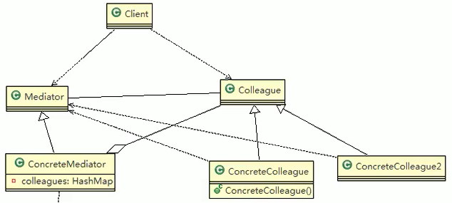
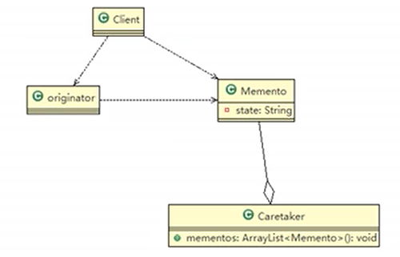
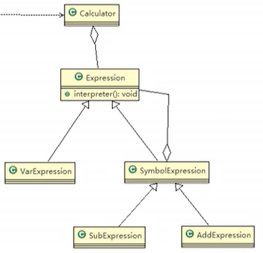
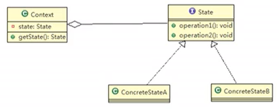
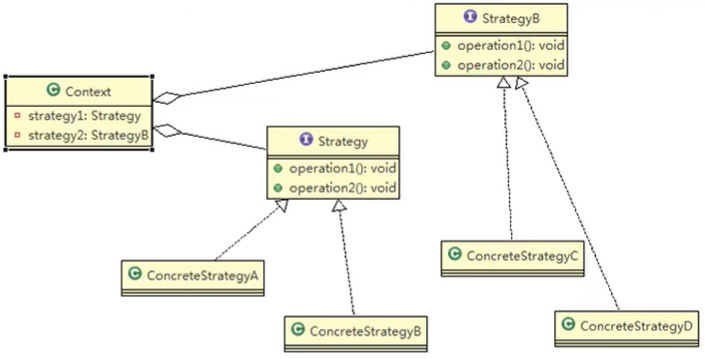
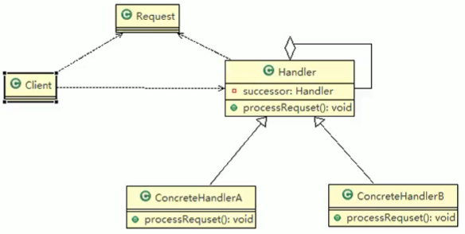

## 1、中介者模式

- 示例：

  - 客户买房需要一系列的流程。
  - 可以用中介来对流程中的各个部分进行对接，客户直接与中介沟通。

- 中介者模式(Mediator Pattern)，用一个中介对象来封装一系列的对象交互。中介者使各个对象不需要显式地相互引用，从而使其耦合松散，而且可以独立地改变它们之间的交互，使代码易于维护。

- 其实感觉很类似于发布-订阅模型。

- 角色：

  - 中介者抽象类Mediator，定义了同时对象到中介者对象的接口。
  - 中介者具体实现类，聚合了一些同事具体实现类。
  - 同事抽象类。
  - 同事具体实现类，被中介的对象。聚合了中介者，但是同事之间没有关系。

- 类图：

  

- 代码：

  - 为了体现出中介是通过接收一个同事发出的消息，实现对多个同事的操作。在ActionA和ActionB中添加了模拟业务方法startAction和endAction，在ConcreteMediator中添加了getMessage模拟业务逻辑，没有实际意义。

  ```java
  //中介接口
  public interface Mediator {
      //将同事对象加入到集合中
      void register(String name, Colleague colleague);
      //接收具体同事发出的消息
      void getMessage(int stateChange, String name);
  }
  
  //中介实现
  public class ConcreteMediator implements Mediator {
      //存储所有注册的同事
      private HashMap<String,Colleague> colleagueMap;
      public ConcreteMediator() {
          this.colleagueMap = new HashMap<>();
      }
      @Override
      public void register(String name, Colleague colleague) {
          colleagueMap.put(name,colleague);
      }
      @Override
      public void getMessage(int stateChange, String name) {
          if (colleagueMap.get(name) instanceof ActionA && stateChange==0) {
              System.out.println("actionA-Send");
              for (String s : colleagueMap.keySet()) {
                  Colleague c = colleagueMap.get(s);
                  if (c instanceof ActionA) {
                      ((ActionA) c).startAction();
                  } else if (c instanceof ActionB) {
                      ((ActionB) c).startAction();
                  }
              }
          } else if (colleagueMap.get(name) instanceof ActionB && stateChange==1) {
              System.out.println("actionB-Send");
              for (String s : colleagueMap.keySet()) {
                  Colleague c = colleagueMap.get(s);
                  if (c instanceof ActionA) {
                      ((ActionA) c).endAction();
                  } else if (c instanceof ActionB) {
                      ((ActionB) c).endAction();
                  }
              }
          }
      }
  }
  
  //同事抽象类
  public abstract class Colleague {
      protected Mediator mediator;
      protected String name;
      public Colleague(Mediator mediator, String name) {
          this.mediator = mediator;
          this.name = name;
      }
      public Mediator getMediator() {
          return mediator;
      }
      public abstract void sendMessage(int stateChange);
  }
  
  //同事实现类
  public class ActionA extends Colleague {
      public ActionA(Mediator mediator, String name) {
          super(mediator, name);
          mediator.register(name,this);
      }
      @Override
      public void sendMessage(int stateChange) {
          System.out.println("actionA:"+stateChange);
          this.getMediator().getMessage(stateChange,name);
      }
      public void startAction(){
          System.out.println("actionA-start");
      }
      public void endAction(){
          System.out.println("actionA-end");
      }
  }
  
  public class ActionB extends Colleague {
      public ActionB(Mediator mediator, String name) {
          super(mediator, name);
          mediator.register(name,this);
      }
      @Override
      public void sendMessage(int stateChange) {
          System.out.println("actionB:"+stateChange);
          this.getMediator().getMessage(stateChange,name);
      }
      public void startAction(){
          System.out.println("actionB-start");
      }
      public void endAction(){
          System.out.println("actionB-end");
      }
  }
  
  //使用
  Mediator mediator = new ConcreteMediator();
  ActionA a = new ActionA(mediator,"actionA-001");
  ActionB b = new ActionB(mediator,"actionB-001");
  a.sendMessage(0);
  a.sendMessage(1);
  b.sendMessage(0);
  b.sendMessage(1);
  ```

- 注意事项：

  - 多个类相互耦合，会形成网状结构,使用中介者模式将网状结构分离为星型结构，进行解耦。
  - 减少类间依赖，降低了耦合，符合迪米特原则。
  - 中介者承担了较多的责任，一旦中介者出现了问题，整个系统就会受到影响。
  - 如果设计不当，中介者对象本身会变得过于复杂。


## 2、备忘录模式

- 示例：需要对游戏数值进行存档。

- 备忘录模式(Memento Pattern）在不破坏封装性的前提下，捕获一个对象的内部状态，并在该对象之外保存这个状态。这样以后就可将该对象恢复到原先保存的状态。

- 可以这里理解备忘录模式：现实生活中的备忘录是用来记录某些要去做的事情，或者是记录已经达成的共同意见的事情，以防忘记了。

- 在软件层面，备忘录模式有着相同的含义，备忘录对象主要用来记录一个对象的某种状态，或者某些数据，当要做回退时，可以从备忘录对象里获取原来的数据进行恢复操作。

- 角色：

  - 要记录的对象originator。
  - 备忘录对象Memento。
  - 存储多个备忘录（不同版本和不同记录对象）Caretaker，聚合了备忘录对象。

- 类图：

  

- 代码：

  ```java
  //所要存储的对象
  public class Originator {
    private String state;   //所要存储的信息
      public Memento saveState(){
          return new Memento(state);
      }
      public void setFromMemento(Memento memento) {
          state = memento.getState();
      }
      public String getState() {
          return state;
      }
      public void setState(String state) {
          this.state = state;
      }
  }
  
  //备忘录对象
  public class Memento {
      private String state;
      public Memento(String state) {
          this.state = state;
      }
      public String getState() {
          return state;
      }
  }
  
  //备忘录集合
  public class Caretaker {
      private List<Memento> list = new ArrayList<>();
      public void add(Memento memento) {
          list.add(memento);
      }
      public Memento get(int index) {
          return list.get(index);
      }
  }
  
  //使用
  Originator originator = new Originator();
  Caretaker caretaker = new Caretaker();
  originator.setState("state#1");
  caretaker.add(originator.saveState());
  System.out.println(originator.getState());
  originator.setState("state#2");
  caretaker.add(originator.saveState());
  System.out.println(originator.getState());
  originator.setFromMemento(caretaker.get(0));
  System.out.println(originator.getState());
  ```
  
- 注意事项：

  - 给用户提供了一种可以恢复状态的机制，可以使用户能够比较方便地回到某个历史的状态。
  - 实现了信息的封装，使得用户不需要关心状态的保存细节。
  - 如果类的成员变量过多，势必会占用比较大的资源，而且每一次保存都会消耗一定的内存。
  - 为了节约内存，备忘录模式可以和原型模式配合使用。


## 3、解释器模式

- 示例：

  - 先输入一个加减表达式，再输入表达式中变量的值。
  - 用一个方法解析表达式，根据输入的值进行解析。
  - 如果再加入乘除运算不好扩展。

- 解释器模式( Interpreter Pattern)：是指给定一个语言(表达式)，定义它的文法的一种表示，并定义一个解释器，使用该解释器来解释语言中的句子(表达式)。

- 应用场景：

  - 应用可以将一个需要解释执行的语言中的句子表示为一个抽象语法树。
  - 一些重复出现的问题可以用一种简单的语言来表达。
  - 一个简单语法需要解释的场景。

- 角色：

  - 表达式的抽象类AbstractExpression，声明一个抽象的解释操作，其中有一个interpret解释方法。
  - 终结符表达式TernimalExpression，实现与文法中的终结符相关的解释操作，继承于表达式的抽象类。
  - 非终结表达式NoTernimalExpression，实现与文法中的非终结符相关的解释操作，继承于表达式的抽象类。其中聚合了表达式的抽象类。
  - 环境角色Context，存储了解释器之外的全局信息。
  - 在Client中需要输入Context和TernimalExpression。

- 类图：

  - 变量表达式VarExpression是终结符表达式。
  - SymbolExpression是非终结表达式，其下有加法和减法解释器，这也是非终结的含义。

  

- 代码：

  -  通过一个String存储表达式，用一个HashMap存储变量的值。
  - 环境角色计算器类中，每次取出栈中的（左元素）和右元素，组成一个新的解释器对象压入栈。
  - 最后run方法递归的调用解释方法，完成运算。
  - 这样如果要加入 乘除法，只需新加入乘法和除法解释器。

  ```java
  //表达式的抽象类
  public abstract class Expression {
      public abstract int interpreter(HashMap<String,Integer> var);
  }
  
  //变量解释器
  public class VarExpression extends Expression {
      private String key;
      public VarExpression(String key) {
          this.key = key;
      }
      @Override
      public int interpreter(HashMap<String, Integer> var) {
          return var.get(this.key);
      }
  }
  
  //符号解释器
  public class SymbolExpression extends Expression{
      protected Expression left;
      protected Expression right;
      public SymbolExpression(Expression left, Expression right) {
          this.left = left;
          this.right = right;
      }
      //子类中才有实现
      @Override
      public int interpreter(HashMap<String, Integer> var) {
          return 0;
      }
  }
  
  //加法解释器
  public class AddExpression extends SymbolExpression {
      public AddExpression(Expression left, Expression right) {
          super(left, right);
      }
      @Override
      public int interpreter(HashMap<String, Integer> var) {
          //减法解释器这里为减
          return super.left.interpreter(var)+super.right.interpreter(var);
      }
  }
  
  //环境角色
  public class Calculator {
      private Expression expression;
      public Calculator(String expStr) {
          Stack<Expression> stack = new Stack<>();
          char[] charArray = expStr.toCharArray();
          Expression left = null;
          Expression right = null;
          for (int i = 0; i < charArray.length; i++) {
              switch (charArray[i]) {
                  case '+':
                      left = stack.pop();
                      right = new VarExpression(String.valueOf(charArray[++i]));
                      stack.push(new AddExpression(left,right));
                      break;
                  case '-':
                      left = stack.pop();
                      right = new VarExpression(String.valueOf(charArray[++i]));
                      stack.push(new SubExpression(left,right));
                      break;
                  default:
                      stack.push(new VarExpression(String.valueOf(charArray[i])));
                      break;
              }
          }
          this.expression = stack.pop();
      }
      public int run(HashMap<String,Integer> var){
          return this.expression.interpreter(var);
      }
  }
  
  //使用
  HashMap<String,Integer> var = new HashMap<>();
  String expStr = "a+b";
  var.put("a",1);
  var.put("b",5);
  Calculator calculator = new Calculator(expStr);
  System.out.println(calculator.run(var));
  ```

- 源码分析：

  - Spring中的SpelExpressionParser中用到了解释器模式。

- 注意事项：

  - 当有一个语言需要解释执行，可将该语言中的句子表示为一个抽象语法树，就可以考虑使用解释器模式，让程序具有良好的扩展性。
  - 使用解释器可能带来的问题：解释器模式会引起类膨胀、解释器模式采用递归调用方法,将会导致调试非常复杂、效率可能降低。


## 4、状态模式

- 示例：抽奖活动，有可以抽奖、不能抽奖、奖品发放和奖品领完的状态。抽奖扣50积分，抽中减少一个奖品。

- 状态模式(State Pattern)：它主要用来解决对象在多种状态转换时，需要对外输出不同的行为的问题。状态和行为是一一对应的，状态之间可以相互转换。

- 当一个对象的内在状态改变时，允许改变其行为，这个对象看起来像是改变了其类。

- 角色：

  - 状态接口State，其中规定了一些方法。
  - 具体状态ConcreteState，实现了状态接口即不同状态下的行为。
  - 实际状态Context，聚合了一个状态接口实例，定义了当前状态。

- 类图：

  

- 代码：

  - 不同状态下，方法的实现不同。可以抽奖状态下只有roll方法中奖才会改变状态。获取奖品状态下只有得到奖品才能改变状态（此处应该还有奖品发放完的状态）。

  ```java
  //状态接口，抽奖和获取奖品两个方法
  public interface State {
      void roll();
      void getPrize();
  }
  
  //可以抽奖状态
  public class CanRollState implements State {
      private Activity activity;
      public CanRollState(Activity activity) {
          this.activity = activity;
      }
      @Override
      public void roll() {
          //抽奖概率代码
          System.out.println("中奖了");
          activity.state = activity.getState;
      }
      @Override
      public void getPrize() {
          System.out.println("先抽奖");
      }
  }
  
  //抽中后获取奖品状态
  public class GetState implements State {
      private Activity activity;
      public GetState(Activity activity) {
          this.activity = activity;
      }
      @Override
      public void roll() {
          System.out.println("已经抽过了");
      }
      @Override
      public void getPrize() {
          if(activity.count-->0){
              System.out.println("领取奖品");
              activity.state = activity.canRollState;
          } else {
              System.out.println("奖品没有了");
          }
      }
  }
  
  //实际状态
  public class Activity {
      public State state = null;
      public State canRollState = new CanRollState(this);
      public State getState = new GetState(this);
      public int count;	//奖品数量
  
      public Activity(int count) {
          this.state = canRollState;
          this.count = count;
      }
      public void roll(){
          state.roll();
      }
      public void getPrize(){
          state.getPrize();
      }
  }
  
  //使用
  Activity activity = new Activity(2);
  for (int i = 0; i < 5; i++) {
      System.out.println(i);
      activity.roll();
      activity.getPrize();
  }
  ```

- 注意事项：

  - 代码有很强的可读性。状态模式将每个状态的行为封装到对应的一个类中。
  - 方便维护。将容易产生问题的if-else语句删除了，如果把每个状态的行为都放到一个类中，每次调用方法时都要判断当前是什么状态，不但会产出很多if-else语句，而且容易出错。
  - 符合“开闭原则”。容易增删状态。
  - 会产生很多类。每个状态都要一个对应的类，当状态过多时会产生很多类，加大维护难度。
  - 当一个事件或者对象有很多种状态，状态之间会相互转换，对不同的状态要求有不同的行为的时候，可以考虑使用状态模式。


## 5、策略模式

- 示例：

  - 有不同的鸭子，不同的鸭子有其特有的行为，并且需要显示鸭子的信息。
  - 传统方式，不同的鸭子继承自鸭子抽象类。
  - 如果子类不希望使用父类提供的方法，需要一一覆盖其实现。

- 策略模式(Strategy Pattern）中，定义算法族，分别封装起来，让他们之间可以互相替换，此模式让算法的变化独立于使用算法的客户。

- 将算法的使用者和提供者解耦了。

- 这算法体现了几个设计原则，第一、把变化的代码从不变的代码中分离出来；第二、针对接口编程而不是具体类（定义了策略接口)；第三、多用组合/聚合，少用继承（客户通过组合方式使用策略)。

- 角色：

  - 策略接口strategy。
  - 策略接口的实现类ConcreteStrategy。
  - 环境角色context中聚合了策略接口类型，可以有多个实例。也可以聚合多个不同的策略接口类型。

- 类图：

  

- 代码：

  - 假定所有鸭子都会游泳，但是不是所有都会飞行和叫，将其分别抽取为策略接口。

  ```java
  //策略接口
  public interface Fly {
      void fly();
  }
  
  //策略实现
  public class CanFly implements Fly {
      @Override
      public void fly() {
          System.out.println("可以飞");
      }
  }
  
  public class NoFly implements Fly {
      @Override
      public void fly() {
          System.out.println("不能飞");
      }
  }
  
  //环境角色抽象类
  public abstract class Duck {
      protected Fly flyStrategy;
      protected Quack quackStrategy;  //其他策略
      public void fly() {
          if (flyStrategy!=null) {
              System.out.println(this);
              flyStrategy.fly();
          }
      }
      //可以改变策略
      public void setFlyStrategy(Fly flyStrategy) {
          this.flyStrategy = flyStrategy;
      }
  }
  
  //环境角色实现
  public class PekingDuck extends Duck {
      public PekingDuck() {
          flyStrategy = new CanFly();
      }
  }
  
  public class ToyDuck extends Duck {
      public ToyDuck() {
          flyStrategy = new NoFly();
      }
  }
  
  //使用
  PekingDuck pekingDuck = new PekingDuck();
  pekingDuck.fly();
  ToyDuck toyDuck = new ToyDuck();
  toyDuck.fly();
  toyDuck.setFlyStrategy(new CanFly());
  toyDuck.fly();
  ```

- 源码分析：

  - JDK的Arrays工具类排序`sort(data,comparator)`方法中使用到了策略模式。
  - 将Comparator接口作为策略接口，在实现中指定具体的排序中两个元素的比较方式。

- 注意事项：

  - 策略模式的关键是：分析项目中变化部分（即策略）与不变部分。
  - 策略模式的核心思想是：多用组合/聚合少用继承；用行为类组合，而不是行为的继承。更有弹性。
  - 体现了“对修改关闭，对扩展开放”原则，客户端增加行为不用修改原有代码，只要添加一种策略（或者行为）即可，避免了使用多重转移语句(if..else if..else)。
  - 提供了可以替换继承关系的办法：策略模式将算法封装在独立的Strategy类中使得你可以独立于其Context改变它，使它易于切换、易于理解、易于扩展。
  - 每添加一个策略就要增加一个类，当策略过多是会导致类数目庞大。


## 6、职责链模式

- 示例：

  - 学校需要采购项目，根据金额，需要不同级别的领导审批。
  - 根据采购金额进行分支判断，然后请求不同的审批者。

- 职责链模式(Chain of Responsibility Pattern) ，又叫责任链模式，为请求创建了一个接收者对象的链。这种模式对请求的发送者和接收者进行解耦。

- 职责链模式通常每个接收者都包含对另一个接收者的引用。如果一个对象不能处理该请求，那么它会把相同的请求传给下一个接收者，依此类推。

- 角色：

  - 请求的处理者抽象类Handler，其中聚合了一个Handler。也就是每个处理者都保有一个指向下一个处理者的引用。
  - 具体的处理者ConcreteHandler，继承了处理者抽象类。如果可以处理当前请求则处理，否则交给其后继处理者处理。
  - 请求Request，被处理者依赖。

- 类图：

  

- 代码：

  ```java
  //请求
  public class Request {
      private float price;
      public Request(float price) {
          this.price = price;
      }
      public float getPrice() {
          return price;
      }
  }
  
  //抽象处理者
  public abstract class Handler {
      protected String name;
      protected Handler handler;
      public Handler(String name, Handler handler) {
          this.name = name;
          this.handler = handler;
      }
      public abstract void process(Request request);
  }
  
  //处理者实现
  public class LowLevel extends Handler {
      public LowLevel(String name, Handler handler) {
          super(name, handler);
      }
      @Override
      public void process(Request request) {
          if(request.getPrice()<5000) {
              System.out.println(name+"处理了");
          } else {
              System.out.println(name+"无法处理，移交上级");
              handler.process(request);
          }
      }
  }
  
  public class HighLevel extends Handler {
      public HighLevel(String name, Handler handler) {
          super(name, handler);
      }
      @Override
      public void process(Request request) {
          System.out.println(name+"处理了");
      }
  }
  
  //使用
  Request request = new Request(7000.0F);
  Handler handler1 = new HighLevel("校长",null);
  Handler handler2 = new LowLevel("院长",handler1);
  handler2.process(request);
  ```

- 源码分析：

  - SpringMVC中的HandlerExecutionChain用到了职责链模式。

- 注意事项：

  - 将请求和处理分开，实现解耦，提高系统的灵活性。
  - 简化了对象，使对象不需要知道链的结构。
  - 性能会受到影响，特别是在链比较长的时候，因此需控制链中最大节点数量，一般通过在Handler中设置一个最大节点数量，在setNext()方法中判断是否已经超过阀值，超过则不允许该链建立，避免出现超长链无意识地破坏系统性能。
  - 调试不方便。采用了类似递归的方式，调试时逻辑可能比较复杂。
  - 最佳应用场景：有多个对象可以处理同一个请求时，比如：多级请求、审批流程、Java Web中Tomcat对Encoding的处理、拦截器。


