[接口隔离原则](https://blog.csdn.net/zhengzhb/article/details/7296921)

[23种设计模式](https://refactoringguru.cn/design-patterns/catalog)

## 1、概述

- 设计原则：
  - 单一职责原则：一个类应该只负责一项职责。
  - 接口隔离原则：一个类中的方法的传入参数是接口类型，那么该接口中定义的方法应该在这个类中都使用到了，否则应该做接口分解。
  - 依赖倒转原则：如果类型是不确定的，应当写实现类的抽象，即上层的抽象类或接口。
  - 里氏替换原则：所有使用父类对象的地方都能透明的更改为子类。即继承时尽量不重写方法，否则应该使用聚合、组合、依赖。
  - 开闭原则：扩展对提供方开放，对使用方关闭。即通过增加模块的方法扩展，而不是在使用方修改代码。
  - 迪米特法则：一个类中的操作，将细节都封装到这个类内部，对外只暴露方法。
  - 合成复用原则：尽量使用组合/聚合的方式，而不是使用继承。
- 设计模式分类：
  - **创建型模式**提供创建对象的机制， 增加已有代码的灵活性和可复用性。
  - **结构型模式**介绍如何将对象和类组装成较大的结构， 并同时保持结构的灵活和高效。
  - **行为模式**负责对象间的高效沟通和职责委派。

## 2、创建型模式

### 单例模式Singleton

> 保证一个类只有一个实例， 并提供一个访问该实例的全局节点。

- 目的：只有一个实例。

- 实现：构造器私有。

- 基本点：

  - 构造方法私有。
  - 提供一个静态获取实例的方法。
  - 解决了两个问题， 所以违反了单一职责原则

- 角色：

  1. 单例实例Singeton。

- 类图：

  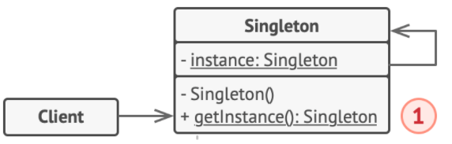

- 使用：调用单例的静态获取实例方法。

- 分类与演进：

  - 饿汉式：类加载时创建对象。
    - 静态常量，静态代码块。
  - 懒汉式：被调用时创建对象。
    - 简单懒汉式，线程不安全。
    - 加入同步方法/同步代码块，效率低。
    - 双重检查锁。
  - 使用Java提供的机制：
    - 静态内部类。
    - 枚举。
  
- 关系：
  
  - 抽象工厂、 生成器和原型都可以用单例模式来实现。
  - 外观模式类通常可以转换为单例模式类。

### 工厂方法Factory Method

> 在父类中提供一个创建对象的方法， 允许子类决定实例化对象的类型。

- 目的：不同的子类，同样的方法，生产不同的对象。

- 实现：利用多态，工厂方法声明为产品接口，具体工厂方法创建不同产品。

- 基本点：

  - 工厂方法是父类工厂中的一个抽象方法，在不同的子类中实现以返回不同的产品。
  - 工厂生产的产品应具有共同的基类或者接口。
  - 客户端中只会依赖父类工厂和产品基类。

- 角色：

  1. 产品基类Product。
  2. 具体产品类ConcreteProduct。
  3. 父类工厂Creator。
  4. 具体工厂类ConcreteCreator。

- 类图：

  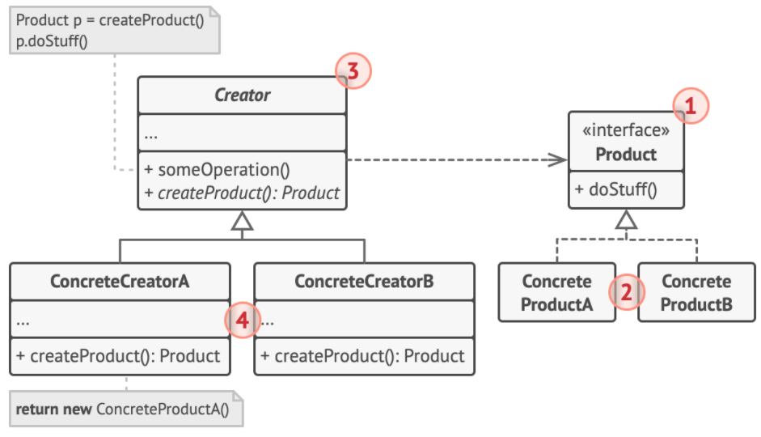

- 使用：创建一个父类工厂指向的具体工厂类，调用其生产方法。

- 关系：

  - 抽象工厂模式通常基于一组工厂方法。
  - 工厂方法是模板方法模式的一种特殊形式。 同时， 工厂方法可以作为一个大型模板方法中的一个步骤。
  - 在许多设计工作的初期都会使用工厂方法模式 （较为简单， 而且可以更方便地通过子类进行定制）， 随后演化为使用抽象工厂模式、 原型模式或生成器模式 （更灵活但更加复杂）。

### 抽象工厂Abstract Factory

> 创建一系列相关的对象， 而无需指定其具体类。

- 目的：生产的对象有两个分类维度。

- 实现：其实就是多个工厂方法。

- 基本点：

  - 生产的产品有两个分类维度，比如维度A颜色和维度B形状。
  - 其中一个维度A应该声明为顶层接口，该维度A下所有的维度B产品都实现这个接口。比如所有形状的产品都实现了红色接口。

- 角色：

  1. 不同的产品接口Product（在这里字母AB是维度A，数字12是维度B）。
  2. 具体的产品类ConcreteProduct.
  3. 抽象工厂AbstractFactory。
  4. 具体工厂ConcreteFactory，不同工厂对应维度A，同一工厂中的不同方法对应维度B。
  5. 客户端Client。

- 类图：

  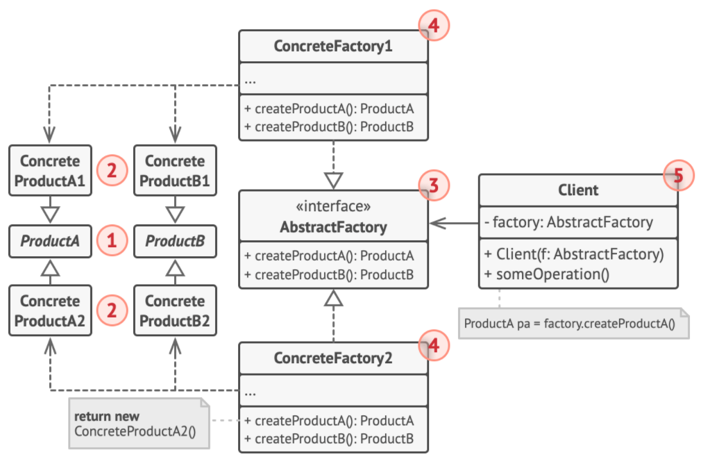

- 使用：创建一个抽象工厂指向的具体工厂类（按维度A），调用其生产方法（按维度B）。

- 关系：

  - 生成器重点关注如何分步生成复杂对象。 抽象工厂专门用于生产一系列相关对象。 抽象工厂会马上返回产品， 生成器则允许你在获取产品前执行一些额外构造步骤。
  - 当只需对客户端代码隐藏子系统创建对象的方式时， 你可以使用抽象工厂来代替外观模式。
  - 可以将抽象工厂和桥接模式搭配使用。 如果由桥接定义的抽象只能与特定实现合作， 这一模式搭配就非常有用。 在这种情况下， 抽象工厂可以对这些关系进行封装， 并且对客户端代码隐藏其复杂性。

### 原型模式Prototype

> 复制已有对象， 而又无需使代码依赖它们所属的类。

- 目的：使对象自己从内部生成一份复制。

- 实现：重写克隆方法。

- 基本点：

  - 从外部复制对象，复杂且有时不可行，如只知道接口而不知道实现类。
  - 将克隆过程委派给被克隆的实际对象。 
  - Cloneable接口使得克隆对象且无需将代码和对象所属类耦合。 

- 角色：

  1. 原型接口Prototype，在Java中为Cloneable接口，声明克隆方法。
  2. 具体原型ConcretePrototype，实现克隆方法。
  3. 客户端Client。

- 类图：

  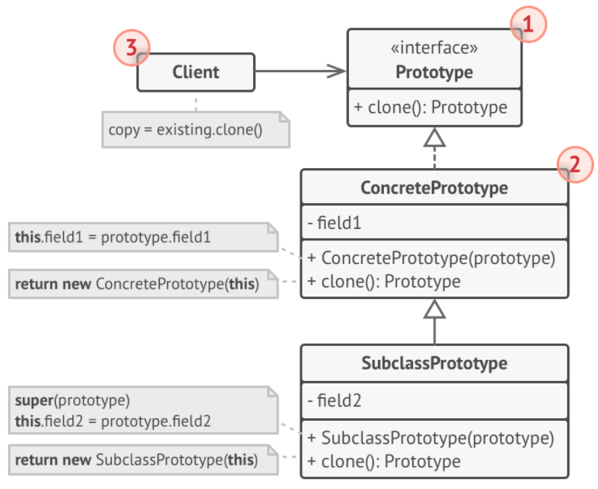

- 使用：调用具体原型的clone方法（默认浅拷贝，深拷贝需要重写）。

- 关系：

  - 原型可用于保存命令模式的历史记录。
  - 大量使用组合模式和装饰模式的设计通常可从对于原型的使用中获益。 你可以通过该模式来复制复杂结构， 而非从零开始重新构造。
  - 原型并不基于继承， 因此没有继承的缺点。 另一方面， 原型需要对被复制对象进行复杂的初始化。 工厂方法基于继承， 但是它不需要初始化步骤。

### 建造者模式Builder

> 将复杂对象的建造步骤抽象出来， 使用相同的创建代码生成不同类型和形式的对象。

- 目的：把生成产品的步骤抽象出来，不同产品的步骤相同具体实现不同。

- 实现：主管持有抽象建造者的引用，但是调用的是具体建造者。

- 基本点：

  - 将对象构造代码按步骤从产品类中抽取出来， 将其放在一个名为建造者的独立对象中。
  - 每次创建对象时，只需调用那些需要的步骤。

- 角色：

  1. 建造者接口Builder。
  2. 具体建造者类ConcreteBuilder。
  3. 产品类型Product。
  4. 主管Director，封装调用步骤的顺序。
  5. 客户端Client。

- 类图：

  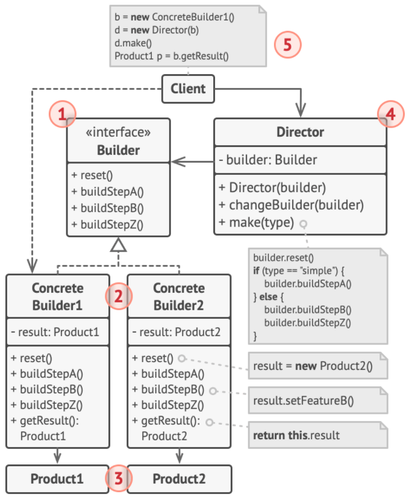

- 使用：

  - 创建一个具体建造者。
  - 将具体建造者传入主管中。
  - 调用主管中的封装方法。

- 关系：

  - 可以在创建复杂组合模式树时使用建造者， 因为这可使其构造步骤以递归的方式运行。
  - 可以结合使用建造者和桥接模式： 主管类负责抽象工作， 各种不同的生成器负责实现工作。
  - 建造者模式与模板方法模式：
    - 都是将代码分抽象为了多个步骤，在子类中对步骤进行实现。然后不同子类实现的步骤会被以相同的次序调用。
    - 建造者的步骤调用是在指挥者中，可能会有多个指挥者，而他们的步骤调用次序不同。
    - 模板方法的步骤是在抽象父类中，子类调用模板方法使用的都是同一个次序。

## 3、结构型模式

### 适配器模式Adapter

> 使接口不兼容的对象能够相互合作。

- 目的：调用者现有的的是类型A，被调用者需要接收的是类型B。

- 实现：适配器实现调用者现有的类型A的接口，聚合了被调用者的类型B，适配器中调用被调用者。

- 基本点：

  - 适配器实现了从类型A转换为类型B的逻辑。

- 角色（对象适配器）：

  1. 客户端Client。
  2. 客户端接口ClientInterface，客户端传入的是类型A。
  3. 服务Service，服务只能接收的是类型B。
  4. 适配器Adapter，实现客户端接口的同时封装了服务对象。 适配器接受客户端通过适配器接口发起的调用， 并将其转换为适用于被封装服务对象的调用。

- 类图：

  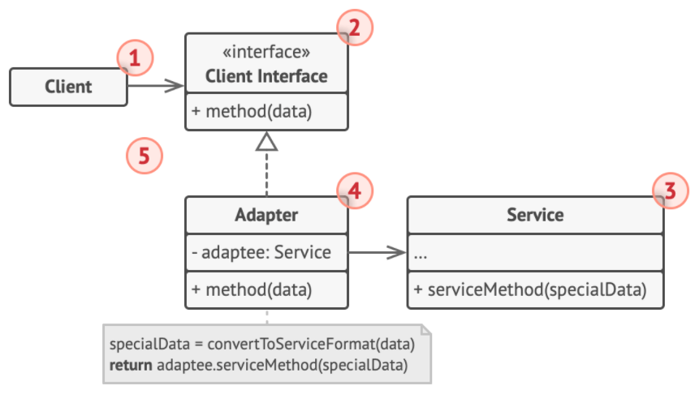

- 使用：直接调用实现了客户端接口的适配器的方法。

- 分类：

  - 以上都是对对象适配器的说明。
  - 还有类适配器和接口适配器。

- 关系：

  - 适配器可以对已有对象的接口进行修改， 装饰模式则能在不改变对象接口的前提下强化对象功能。 此外， 装饰还支持递归组合， 适配器则无法实现。
  - 适配器能为被封装对象提供不同的接口， 代理模式能为对象提供相同的接口， 装饰则能为对象提供加强的接口。
  - 外观模式为现有对象定义了一个新接口， 适配器则会试图运用已有的接口。 适配器通常只封装一个对象， 外观通常会作用于整个对象子系统上。

### 桥接模式Bridge

> 将一个大类或一系列紧密相关的类拆分为抽象和实现两个独立的层次结构， 从而能在开发时分别使用。

- 目的：实现上下两个层次之间的模块组合。

- 实现：底层被组合到高层中。

- 基本点：

  - 需要解决的问题是，两个部分的组合行为，如红色方形和蓝色圆形，扩展麻烦。
  - 桥接的含义是将两个部分分离，使其可以任意组合。比如不同的GUI界面（抽象）和面向不同操作系统的API（实现）。
  - 一般来说，抽象是给客户端调用的，所以实现要组合到抽象中。

- 角色：

  1. 抽象部分Abstraction，提供高层控制逻辑，依赖于底层的实现对象。
  2. 实现部分Implementation，为所有具体实现声明通用接口。
  3. 具体实现Concrete Implementations，被组合到抽象中。
  4. 精确抽象Refined Abstraction，提供控制逻辑的变体。

- 类图：

  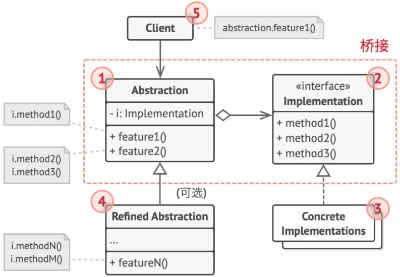

- 使用：调用抽象部分中的方法。

- 关系：

  - 桥接模式通常会于开发前期进行设计， 使你能够将程序的各个部分独立开来以便开发。 另一方面， 适配器模式通常在已有程序中使用， 让相互不兼容的类能很好地合作。

### 组合模式Composite

> 将对象组合成树状结构， 并且能像使用独立对象一样使用它们。

- 目的：是一种将对象按包含关系进行组织的形式。

- 实现：非叶子节点中聚合了叶子节点。

- 基本点：

  - 就是将“部分”组合到“整体”中。从上往下看，非叶子节点中可能包含叶子节点和其他非叶子节点。
  - 处理问题时，可能会从上往下递归这棵树，最后操作由最底层不可分的叶子节点完成。

- 角色：

  1. 组件Component，作为接口描述了树中叶子节点和非叶子节点共有的操作。
  2. 叶子节点Leaf，是树的基本结构， 不包含子项目。一般情况下， 叶节点最终会完成大部分的实际工作。
  3. 组合Composite/容器Container，即非叶子节点，包含叶子节点或其他非叶子节点。
     - 容器不知道其子项目所属的具体类， 它只通过通用的组件接口与其子项目交互。
     - 容器接收到请求后会将工作分配给自己的子项目， 处理中间结果， 然后将最终结果返回给客户端。
     - 容器中实现了对其子项目进行增删等操作。
  4. 客户端Client。

- 类图：

  

- 使用：调用最顶层容器的方法。

- 关系：

  - 责任链模式通常和组合模式结合使用。 在这种情况下， 叶组件接收到请求后， 可以将请求沿包含全体父组件的链一直传递至对象树的底部。
  - 可以使用迭代器模式来遍历组合树。
  - 可以使用访问者模式对整个组合树执行操作。
  - 可以使用享元模式实现组合树的共享叶节点以节省内存。
  - 组合和装饰模式的结构图很相似， 因为两者都依赖递归组合来组织无限数量的对象。
    - 装饰类似于组合， 但其只有一个子组件。 
    - 此外： 装饰为被封装对象添加了额外的职责， 组合仅对其子节点的结果进行了 “求和”。

### 装饰者模式Decorator

> 通过将对象放入包含行为的特殊封装对象中来为原对象绑定新的行为。

- 目的：装饰的含义就是为对象添加新的功能，并生成一个新对象。

- 实现：将被装饰的组件组合到装饰者中。

- 基本点：

  - 装饰也是一个递归的过程。部件被装饰，其实说的就是被装饰者包裹了起来。如果想要再对其装饰，就用其他的装饰者再把其包裹一次。
  - 装饰者可以在将请求委派给目标前后对其进行处理， 所以可能会改变最终结果。

- 角色：

  1. 部件Component，声明了装饰者和被装饰对象的接口。
  2. 具体部件Concrete Componnet，被装饰的类，定义了一些基础行为。
  3. 基础装饰Base Decorator，组合了一个通用部件接口。装饰基类会将所有操作委派给这个被装饰的对象。
  4. 具体装饰类Concrete Decorator，定义了装饰部件的额外方法。可重写父类的方法或在把操作委派给这个被装饰的对象前后执行额外行为。
  5. 客户端Client。

- 类图：

  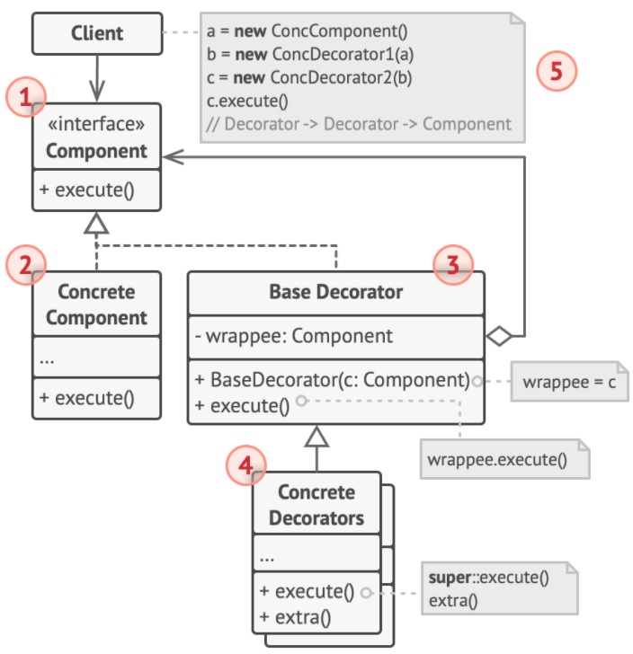

- 使用：

  - 创建一个部件接口指向的具体部件。
  - 创建一个部件接口指向的具体装饰者，并将之前的具体部件传入。
  - 之后可以层层装饰。

- 关系：

  - 责任链模式和装饰模式的类结构非常相似。 两者都依赖递归组合将需要执行的操作传递给一系列对象。 
    - 责任链的管理者可以相互独立地执行一切操作， 还可以随时停止传递请求。
     - 各种装饰可以在遵循基本接口的情况下扩展对象的行为。但装饰无法中断请求的传递。
  - 装饰可让你更改对象的外表， 策略模式则让你能够改变其本质。
  - 装饰和代理有着相似的结构， 但是其意图却非常不同。 
    - 这两个模式的构建都基于组合原则， 也就是说一个对象应该将部分工作委派给另一个对象。 
    - 两者之间的不同之处在于代理通常自行管理其服务对象的生命周期， 而装饰的生成则总是由客户端进行控制。
  
  

### 外观模式Facade

> 为程序库、 框架或其他复杂类提供一个简单的接口。

- 目的：对外提供简单界面。

- 实现：外观类中聚合了具体执行业务的对象。

- 基本点：

  - 将一系列的复杂操作封装起来，类似于GUI界面。

- 角色：

  1. 外观Facade，提供了一种访问特定子系统功能的便捷方式。
  2. 附加外观Additional Facade，避免多种不相关的功能污染单一外观。客户端和其他外观都可使用附加外观。
  3. 复杂子系统Complex Subsystem，即被封装的一系列复杂操作。
  4. 客户端Client。

- 类图：

  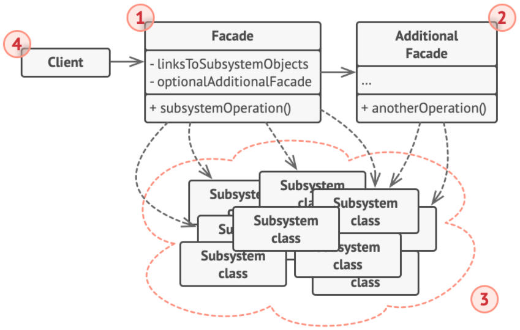

- 使用：客户端中调用外观中的方法。

- 关系：

  - 享元模式展示了如何生成大量的小型对象， 外观则展示了如何用一个对象来代表整个子系统。
  - 外观和中介者模式的职责类似： 它们都尝试在大量紧密耦合的类中组织起合作。
    - 外观为子系统中的所有对象定义了一个简单接口， 但是它不提供任何新功能。 子系统本身不会意识到外观的存在。 子系统中的对象可以直接进行交流。
    - 中介者将系统中组件的沟通行为中心化。 各组件只知道中介者对象， 无法直接相互交流。
  - 外观与代理模式的相似之处在于它们都缓存了一个复杂实体并自行对其进行初始化。 
    - 代理与其服务对象遵循同一接口， 使得自己和服务对象可以互换， 在这一点上它与外观不同。

### 享元模式Flyweight

> 摒弃了在每个对象中保存所有数据的方式， 通过共享多个对象所共有的相同状态， 使得在有限的内存容量中载入更多对象。

- 目的：共享一些通用的数据。

- 实现：要使用的对象中组合了外在状态和享元对象（内在状态）。

- 基本点：

  - 外在状态：变化的，不能共享的信息；内在状态：不变的，可以共享的信息。
  - 不在对象中存储外在状态， 而是将其传递给依赖于它的一个特殊方法。 程序只在对象中保存内在状态。
  - 享元：一个仅存储内在状态的对象。

- 角色：

  1. 享元模式是一种优化。适用于大量类似对象同时占用内存，且其中存储有相同的数据。
  2. 享元Flyweight，包含原始对象中部分能在多个对象中共享的状态。 
     - 同一享元对象可在许多不同情景中使用。 享元中存储的状态被称为 “内在状态”。
     -  传递给享元方法的状态被称为 “外在状态”。
  3. 情景Context，包含原始对象中各不相同的外在状态。 情景与享元对象组合在一起就能表示原始对象的全部状态。
  4. 通常情况下， 原始对象的行为会保留在享元类中。 因此调用享元方法必须提供部分外在状态作为参数。 但你也可将行为移动到情景类中， 然后将连入的享元作为单纯的数据对象。
  5. 客户端Client。
  6. 享元工厂Flyweight Factory，会对已有享元的缓存池进行管理。 有了工厂后， 客户端就无需直接创建享元， 它们只需调用工厂并向其传递目标享元的一些内在状态即可。 

- 类图：

  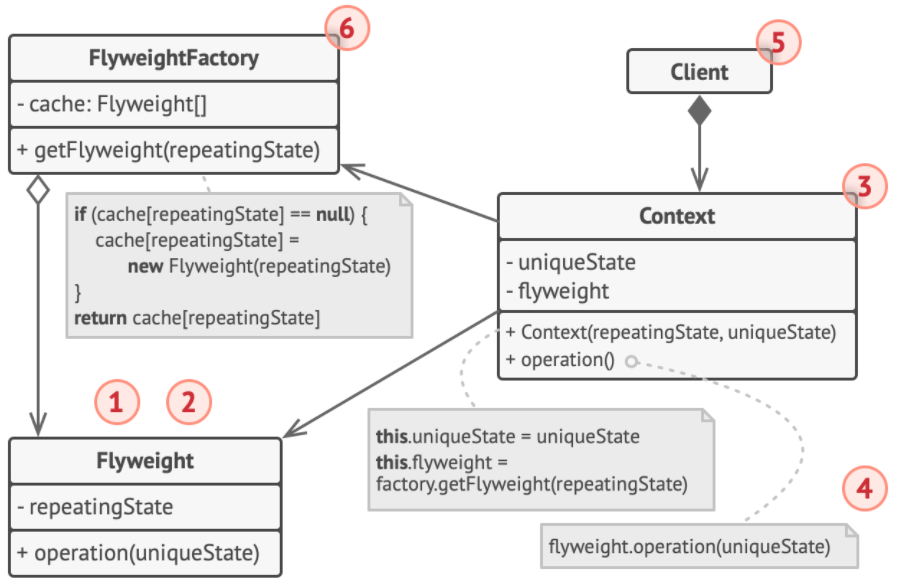

- 使用：

  - 向享元工厂传入内在状态，获取享元对象。
  - 通过情景传入外在状态，调用情景的方法进行操作。

- 关系：

  - 如果你能将对象的所有共享状态简化为一个享元对象， 那么享元就和单例模式类似了。 但这两个模式有两个根本性的不同。
    - 只会有一个单例实体， 但是享元类可以有多个实体， 各实体的内在状态也可以不同。
    - 单例对象可以是可变的。 享元对象是不可变的。

### 代理模式Proxy

> 提供对象的替代品或其占位符。 代理控制着对于原对象的访问， 并允许在将请求提交给对象前后进行一些处理。

- 目的：在执行原对象的方法前后添加额外操作。

- 实现：代理对象实现了原对象接口并聚合了原对象。

- 基本点：

  - 代理类被认为实现了与服务类相同的接口。
  - 外部调用代理类时，代理类会将其委托给服务类。并且可以在委托前后执行一些额外操作。

- 角色：

  1. 服务接口Service Interface，声明了服务的方法。 代理必须遵循该接口才能伪装成服务对象。
  2. 服务类Service（被代理），提供了一些实用的业务逻辑。
  3. 代理类Proxy，包含一个指向服务对象的引用成员变量。 代理接收到任务后会将请求传递给服务对象。 通常情况下， 代理会对其服务对象的整个生命周期进行管理。
  4. 客户端Client。

- 类图：

  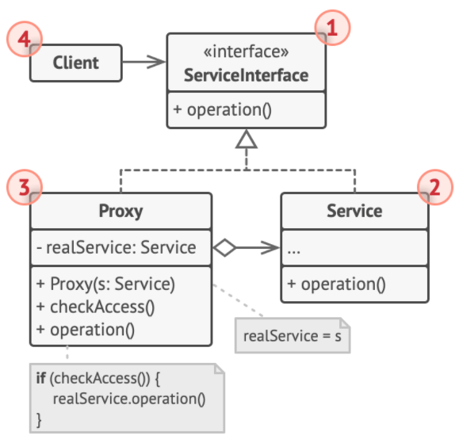

- 使用：直接使用代理对象。

- 备注：以上属于静态代理。Java中还有动态代理，包括基于接口的JDK动态代理和基于cglib的动态代理。

## 4、行为型模式

### 模板方法模式Template Method

> 在超类中定义了一个算法的框架， 允许子类在不修改结构的情况下重写算法的特定步骤。

- 目的：

- 实现：

- 基本点：

  - 将算法分解为一系列步骤， 然后将这些步骤改写为方法， 最后在 “模板方法” 中依次调用这些方法。
  - 在子类中重写步骤方法，实现调用不同子类的模板对象使用不同的步骤。
  - 钩子方法：钩子是内容为空的可选步骤。 即使不重写钩子， 模板方法也能工作。 钩子通常放置在算法重要步骤的前后， 为子类提供额外的算法扩展点。 

- 角色：

  1. 抽象类Abstract­Class，会声明作为算法步骤的方法， 以及依次调用它们的实际模板方法。 算法步骤可以被声明为 抽象类型， 也可以提供一些默认实现。
  2. 具体类Concrete­Class，可以重写所有步骤， 但不能重写模板方法自身。

- 类图：

  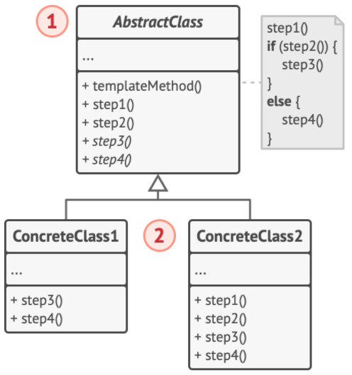

- 使用：调用子类的模板方法。

- 关系：

  - 模板方法基于继承机制： 它允许你通过扩展子类中的部分内容来改变部分算法。 
  - 策略模式基于组合机制： 你可以通过对相应行为提供不同的策略来改变对象的部分行为。
  -  模板方法在类层次上运作， 因此它是静态的。 策略在对象层次上运作， 因此允许在运行时切换行为。

### 命令模式Command

> 将请求转换为一个包含与请求相关的所有信息的独立对象。 该转换让你能根据不同的请求将方法参数化、 延迟请求执行或将其放入队列中， 且能实现可撤销操作。

- 目的：将命令的参数和接受者封装到命令对象中。

- 实现：发送者中聚合了命令对象，命令对象中聚合了接收者。

- 基本点：

  - 将一个请求封装为一个命令对象，使用不同参数来表示不同的命令。
  - 执行命令方法一般没有任何参数，需要使用数据对命令进行预先配置， 或者让其能够自行获取数据。
  - 使用命令对象间接的调用接受者，命令对象在发送者中可以被存入一个命令队列中。

- 角色：

  1. 发送者Sender/触发者Invoker，负责对请求进行初始化， 组合了一个或多个命令对象。 
  2. 命令接口Command，通常仅声明一个执行命令的方法。
  3. 具体命令Concrete Commands，实现各种类型的请求。 具体命令自身并不完成工作， 而是会将调用委派给被组合的业务逻辑对象。 
  4. 接收者Receiver，是业务逻辑对象，包含部分业务逻辑。 绝大部分命令只处理如何将请求传递到接收者的细节， 接收者自己会完成实际的工作。
  5. 客户端Client。

- 类图：

  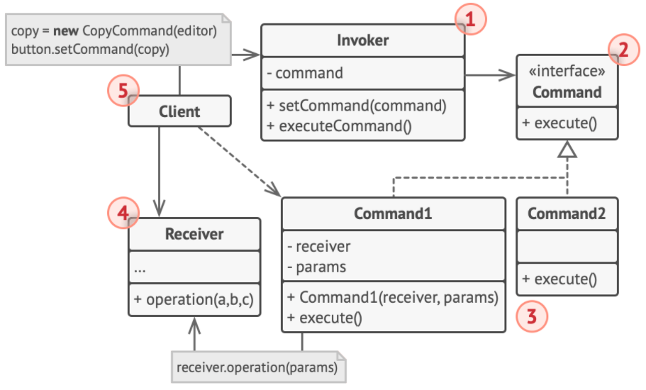

- 使用：

  - 创建接受者。
  - 创建命令，并将接受者作为参数传入。
  - 创建发送者，并将命令按顺序设置到发送者中。

- 关系：

  - 责任链模式、 命令模式、 中介者模式和观察者模式用于处理请求发送者和接收者之间的不同连接方式：
    - 责任链按照顺序将请求动态传递给一系列的潜在接收者， 直至其中一名接收者对请求进行处理。
    - 命令在发送者和请求者之间建立单向连接。
    - 中介者清除了发送者和请求者之间的直接连接， 强制它们通过一个中介对象进行间接沟通。
    - 观察者允许接收者动态地订阅或取消接收请求。
  - 责任链的管理者可使用命令模式实现。
    - 可以对由请求代表的同一个上下文对象执行许多不同的操作。
    - 另外一种实现方式， 那就是请求自身就是一个命令对象。 在这种情况下， 你可以对由一系列不同上下文连接而成的链执行相同的操作。
  - 可以同时使用命令和备忘录模式来实现 “撤销”。 在这种情况下， 命令用于对目标对象执行各种不同的操作， 备忘录用来保存一条命令执行前该对象的状态。
  - 命令和策略模式看上去很像， 因为两者都能通过某些行为来参数化对象。 但是， 它们的意图有非常大的不同。
    - 可以使用命令来将任何操作转换为对象。 操作的参数将成为对象的成员变量。 你可以通过转换来延迟操作的执行、 将操作放入队列、 保存历史命令或者向远程服务发送命令等。
    - 策略通常可用于描述完成某件事的不同方式， 让你能够在同一个上下文类中切换算法。
  - 原型模式可用于保存命令的历史记录。
  - 你可以将访问者模式视为命令模式的加强版本， 其对象可对不同类的多种对象执行操作。

### 访问者模式Visitor

> 将算法与其所作用的对象隔离开来。

- 目的：将数据结构与数据操作分离。

- 实现：双分派。

- 基本点：

  - 在被访问的类里面加一个对外提供接待访问者（作为传入参数）的方法接口。
  - 算法的实现是在具体访问者中。
  - 双分派：访问者接口定义的访问者方法为具体元素类，具体元素类中的接收方法会调用这个访问者方法并传入this，这就保证了调用接收方法时会分派到对应的访问者。

- 角色：

  1. 访问者接口Visitor，声明了一系列以对象结构的不同具体元素类为参数的访问者方法。 
  2. 具体访问者Concrete Visitor，会为不同的具体元素类实现相同行为。即在同一个具体访问者中，希望对所访问的对象执行相同行为。
  3. 元素接口Element，声明了一个方法来 “接收” 访问者，参数被声明为访问者接口类型。
  4. 客户端Client。其实一般这里还有一个对象数据结构ObjectStructure，可将不同的具体元素存入其中，然后被具体访问者访问。

- 类图：

  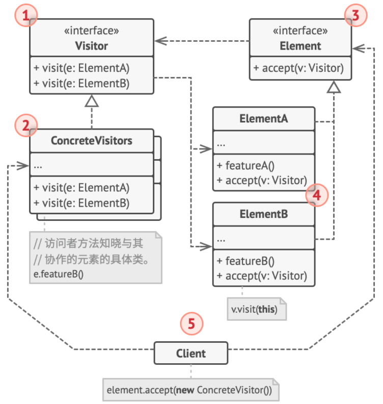

- 使用：

  - 创建具体元素对象，存入对象数据结构。
  - 创建具体访问者，调用对象数据结构中元素的接收方法，对数据结构中的所有元素进行访问。

- 关系：

  - 可以同时使用访问者和迭代器模式来遍历复杂数据结构， 并对其中的元素执行所需操作， 即使这些元素所属的类完全不同。

### 迭代器模式Iterator

> 在不暴露集合底层表现形式 （列表、 栈和树等） 的情况下遍历集合中所有的元素。

- 目的：遍历集合中的元素。

- 实现：具体迭代器中组合了具体集合类型。

- 基本点：

  - 客户端并不关心存储数据的具体方式。 
  - 所有迭代器实现相同的接口。 这样客户端就能兼容任何类型的集合或遍历算法。 
  - 为希望使用迭代器进行遍历的集合实现具体迭代器类。 迭代器对象必须与单个集合实体链接。 链接关系通常通过将集合传入迭代器的构造函数。

- 角色：

  1. 迭代器接口Iterator，声明了遍历集合所需的操作： 是否还有下一个元素、获取下一个元素、 获取当前位置和重新开始迭代等。
  2. 具体迭代器Concrete Iterators，实现遍历集合的一种特定算法。 迭代器对象必须跟踪自身遍历的进度。 这使得多个迭代器可以相互独立地遍历同一集合。
  3. 集合接口Collection，声明一个或多个方法来获取与集合兼容的迭代器。
  4. 具体集合Concrete Collections，会在客户端请求迭代器时返回一个特定的具体迭代器类实体。
  5. 客户端Client， 通过集合和迭代器的接口与两者进行交互。

- 类图：

  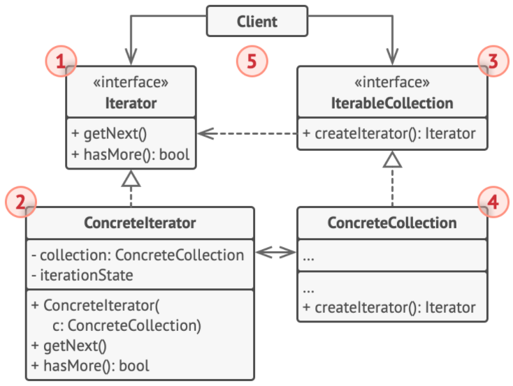

- 使用：

  - 创建一个迭代器对象，并从构造传入所要迭代的集合。
  - 用一个迭代器接口类型指向这个对象，调用迭代方法遍历。

- 关系：

  - 可以同时使用备忘录模式和迭代器来获取当前迭代器的状态， 并且在需要的时候进行回滚。

### 观察者模式Observer

> 允许定义一种订阅机制， 可在对象事件发生时通知多个 “观察” 该对象的其他对象。

- 目的：订阅-发布模型。

- 实现：发布者中组合了订阅者的列表。

- 基本点：

  - 类似于订阅-发布模型。
  - 发布者将自身的状态改变通知给其他对象， 所有希望关注发布者状态变化的其他对象被称为订阅者。

- 角色：

  1. 发布者Publisher，会向聚合在其中的订阅者对象发送值得关注的事件。 事件会在发布者自身状态改变或执行特定行为后发生。 发布者中包含一个允许新订阅者加入和当前订阅者离开列表的订阅构架。
  2. 当新事件发生时， 发送者会遍历订阅列表并调用每个订阅者对象的通知方法。 该方法是在订阅者接口中声明的。
  3. 订阅者Subscriber，接口声明了通知接口。 在绝大多数情况下， 该接口仅包含一个 update更新方法，但可以拥有多个参数。
  4. 具体订阅者Concrete Subscribers，可以执行一些操作来回应发布者的通知。 
  5. 订阅者通常需要一些上下文信息来正确地处理更新。 因此， 发布者通常会将一些上下文数据作为通知方法的参数进行传递。 发布者也可将自身作为参数进行传递， 使订阅者直接获取所需的数据。
  6. 客户端Client。

- 类图：

  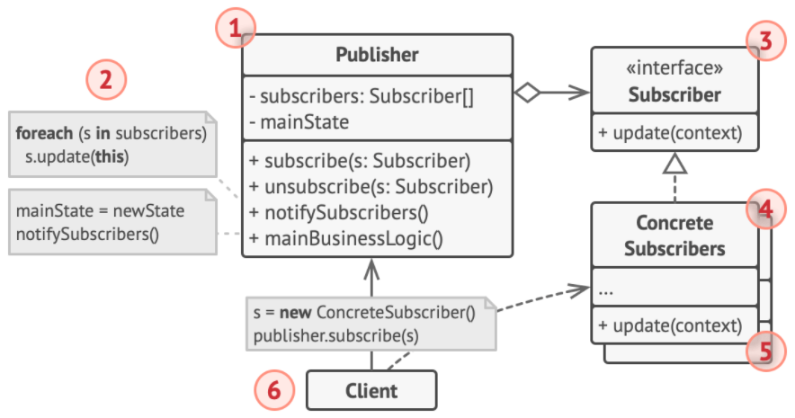

- 使用：

  - 创建发布者和订阅者。
  - 使用发布者的订阅方法传入订阅者，实现订阅。
  - 发布者更新，订阅者得到消息。

- 关系：

  - 中介者和观察者之间的区别：
    - 中介者的主要目标是消除一系列系统组件之间的相互依赖。 这些组件将依赖于同一个中介者对象。 观察者的目标是在对象之间建立动态的单向连接， 使得部分对象可作为其他对象的附属发挥作用。
    - 有一种流行的中介者模式实现方式依赖于观察者。 中介者对象担当发布者的角色， 其他组件则作为订阅者， 可以订阅中介者的事件或取消订阅。 当中介者以这种方式实现时， 它可能看上去与观察者非常相似。但同时，中介者也可以使用其他实现方式。
    - 假设有一个程序， 其所有的组件都变成了发布者， 它们之间可以相互建立动态连接。 这样程序中就没有中心化的中介者对象， 而只有一些分布式的观察者。

### 中介者模式Mediator

> 限制对象之间的直接交互， 迫使它们通过一个中介者对象进行合作。

- 目的：组件之间通过中介通信。

- 实现：中介者中组合了各个组件，通过组件类型执行不同操作。

- 基本点：

  - 组件之间只能通过中介者间接合作。
  - 组件仅依赖于一个中介者类， 无需与多个其他组件相耦合。

- 角色：

  1. 组件Component，是各种包含业务逻辑的类。 每个组件都有一个指向中介者的引用， 该引用被声明为中介者接口类型。 组件不知道中介者实际所属的类， 因此可通过将其连接到不同的中介者以使其能在其他程序中复用。
  2. 中介者接口Mediator，声明了与组件交流的方法， 但通常仅包括一个通知方法。 组件可将任意上下文 （包括自己的对象） 作为该方法的参数。
  3. 具体中介者Concrete Mediator，封装了多种组件间的关系。 具体中介者通常会保存所有组件的引用并对其进行管理， 甚至有时会对其生命周期进行管理。
  4. 组件并不知道其他组件的情况。 如果组件内发生了重要事件， 它只能通知中介者。 中介者收到通知后能轻易地确定发送者，并依此判断接下来需要触发的组件了。发送者不知道最终会由谁来处理自己的请求， 接收者也不知道最初是谁发出了请求。

- 类图：

  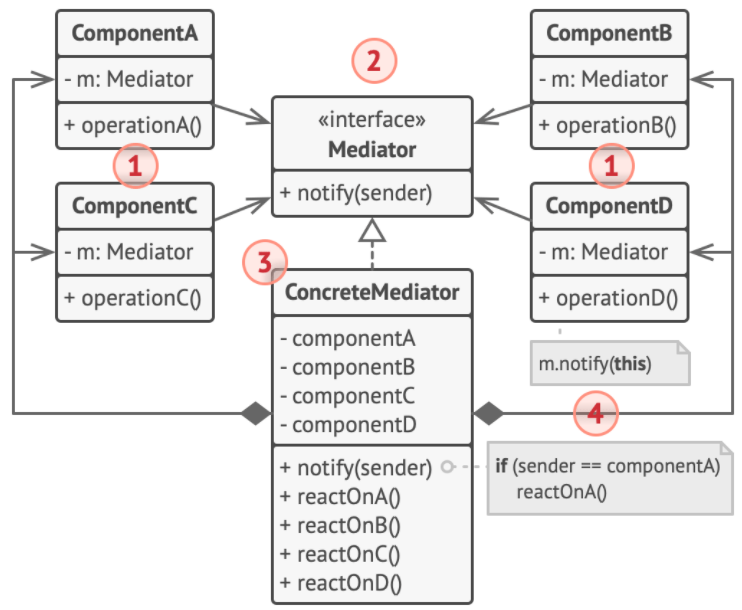

- 使用：

  - 创建中介者，实现根据不同组件的行为执行不同操作。
  - 创建不同的组件，都聚合了中介者。并且在中介者中注册了其组件本身。
  - 某个组件调用通知方法请求中介者，中介者处理请求。

### 备忘录模式Memento

> 在不暴露对象实现细节的情况下保存和恢复对象之前的状态。

- 目的：保存和恢复对象中的数据。

- 实现：原对象可被保存为备忘录对象，备忘录对象作为集合被聚合到负责人中管理。

- 基本点：

  - 将创建状态快照 （Snapshot） 的工作委派给实际状态的拥有者原发器 （Originator） 对象。 这样其他对象就不再需要从 “外部” 复制编辑器状态了。
  - 原发器对象有生成快照和读取快照的方法。所有的快照对象按次序被负责人管理，可以按时间先后恢复。

- 角色：

  1. 原发器类Originato，类可以生成自身状态的快照， 也可以在需要时通过快照恢复自身状态。
  2. 备忘录Memento，是原发器状态快照的值对象 （value object）。 通常做法是将备忘录设为不可变的， 并通过构造函数一次性传递数据。
  3. 负责人Caretaker，实现了捕捉原发器的状态， 以及恢复状态的方法。通过保存备忘录栈来记录原发器的历史状态。 
  4. 在该实现方法中， 备忘录类将被实现为原发器中的内部类。 这样原发器就可访问备忘录的成员变量和方法， 即使这些方法被声明为私有。 另一方面， 负责人对于备忘录的成员变量和方法的访问权限非常有限： 它们只能在栈中保存备忘录， 而不能修改其状态。

- 类图：

  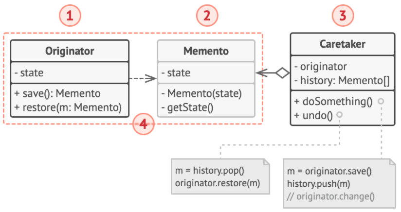

- 另一种实现：

  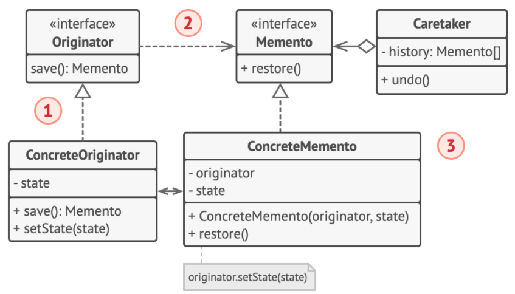

- 使用：

  - 创建原发器对象，并生成备忘录对象。
  - 创建负责人对象，将备忘录对象存入负责人。
  - 原发器对象发生改变后需要回滚，负责人对象调用撤销方法。

### 解释器模式

> 用于解析一棵抽象语法树。

- 目的：解析一定语法的表达式。

- 实现：非终结表达式迭代，一直到遇到终结表达式。

- 基本点：

  - 用于解析表达式，这种表达式有着特定的文法约束，比如正则表达式。

- 角色：

  1. 上下文对象Context，保存了一些解释器外的信息，比如何时调用何种解释器。
  2. 抽象表达式AbstractExpression，声明一个抽象的解释操作，这个接口为抽象语法树中所有的节点所共享。一般都只定义了一个解释方法。
  3. 终结表达式TerminalExpression，通常比较简单，主要处理场景元素和数据的转换。
  4. 非终结表达式nonterminalExpression，每个非终结符表达式都代表了一个文法规则，并且每个文法规则都只关心自己周边的文法规则的结果，因此这就产生了每个非终结符表达式调用自己周边的非终结符表达式，然后最终、最小的文法规则就是终结符表达式。
  5. 客户端Client。

- 类图：

  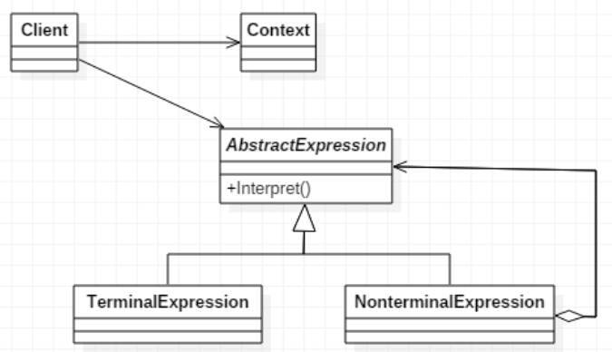

- 使用：

  - 前提是上下文对象组织好了表达式的解释逻辑。
  - 输入表达式给上下文对象，并调用方法进行解释。

### 状态模式State

> 在一个对象的内部状态变化时改变其行为， 使其看上去就像改变了自身所属的类一样。

- 目的：不同的状态下方法实现不同。

- 实现：状态被组合到所要使用的对象中，状态对象中实现了该状态下的方法。

- 基本点：

  - 许多不同的状态对应于相同的方法，但是不同状态下方法具体的执行内容不同。
  - 为上下文对象的所有可能状态新建一个类， 然后将所有状态的对应行为抽取到这些类中。与状态有关的方法都将在这些类中实现。

- 角色：

  1. 上下文对象Context，保存了对于一个状态对象的引用， 并会将所有与该状态相关的工作委派给它。 上下文通过状态接口与状态对象交互， 且会提供一个设置器用于传递新的状态对象。
  2. 状态接口State，声明特定于具体状态的方法。 
  3. 具体状态Concrete States，会自行实现特定于具体状态的方法。 状态对象可存储对于上下文对象的反向引用。 状态可以通过该引用从上下文处获取所需信息， 并且能触发状态转移。
  4. 上下文和具体状态都可以设置上下文的下个状态， 并可通过替换连接到上下文的状态对象来完成实际的状态转换。

- 类图：

  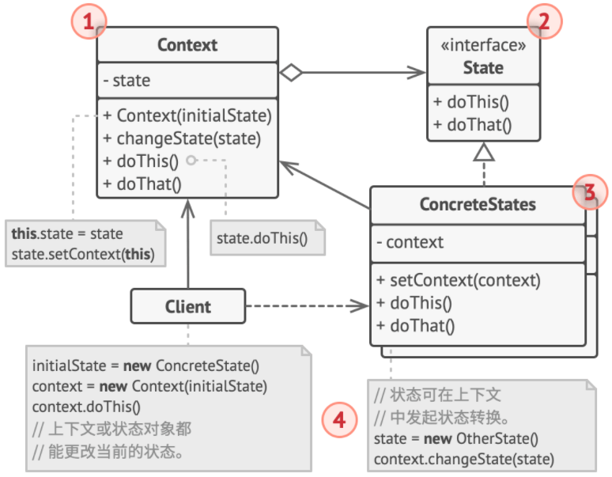

- 使用：

  - 创建上下文对象并传入初始状态。
  - 为上下文对象设置状态改变，并调用上下文对象的具体方法。

- 关系：

  - 状态可被视为策略的扩展。 两者都基于组合机制：
    - 它们都通过将部分工作委派给 “帮手” 对象来改变其在不同情景下的行为。 
    - 策略使得这些对象相互之间完全独立， 它们不知道其他对象的存在。 
    - 但状态模式没有限制具体状态之间的依赖， 且允许它们自行改变在不同情景下的状态。

### 策略模式Strategy

> 定义一系列算法， 并将每种算法分别放入独立的类中， 以使算法的对象能够相互替换。

- 目的：由所要使用的对象选择一种策略，来决定该对象的行为。

- 实现：策略被组合到所要使用的对象中，策略对象中实现了该策略下的方法。

- 基本点：

  - 找出负责用许多不同方式完成特定任务的类， 然后将其中的算法抽取到一组被称为策略的独立类中。

- 角色：

  1. 上下文对象Context，维护指向具体策略的引用， 且仅通过策略接口与该对象进行交流。
  2. 策略接口Strategy，是所有具体策略的通用接口， 它声明了一个上下文用于执行策略的方法。
  3. 具体策略Concrete Strategies，实现了上下文所用算法的各种不同变体。
  4. 当上下文需要运行算法时， 它会在其已连接的策略对象上调用执行方法。 上下文不清楚其所涉及的策略类型与算法的执行方式。
  5. 客户端Client，会创建一个特定策略对象并将其传递给上下文。 上下文则会提供一个设置器以便客户端在运行时替换相关联的策略。

- 类图：

  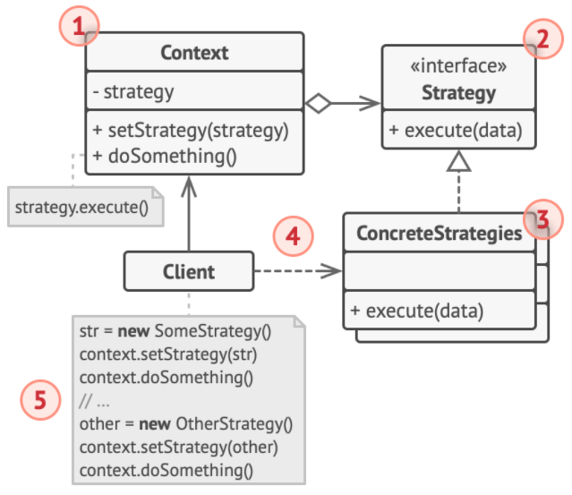

- 使用：

  - 创建上下文对象。
  - 客户端创建具体策略对象，并将其设置如上下文对象。
  - 上下文对象执行策略。

### 责任链Chain of Responsibility

> 将请求沿着处理者链进行发送。 收到请求后， 每个处理者均可对请求进行处理， 或将其传递给链上的下个处理者。

- 目的：请求被按一定次序处理。

- 实现：每个处理者持有下一个处理者的引用。

- 基本点：

  - 将特定行为转换为被称作处理者的独立对象。 
  - 将这些处理者连成一条链。 链上的每个处理者都有一个成员变量来保存对于下一处理者的引用。 
  - 处理者还负责沿着链传递请求，但可以决定不再沿着链传递请求。

- 角色：

  1. 处理者接口Handler，声明了所有具体处理者的方法。 该接口通常仅包含单个方法用于请求处理， 但有时其还会包含一个设置链上下个处理者的方法。
  2. 基础处理者Base Handler，是一个可选的类， 你可以将所有处理者共用的样本代码放置在其中。
     - 通常情况下， 该类中定义了一个保存对于下个处理者引用的成员变量。 
     - 客户端可通过将处理者传递给上个处理者的构造函数或设定方法来创建链。
     -  该类还可以实现默认的处理行为： 确定下个处理者存在后再将请求传递给它。
  3. 具体处理者Concrete Handlers，包含处理请求的实际代码。 每个处理者接收到请求后， 都必须决定是否进行处理， 以及是否沿着链传递请求。
  4. 客户端Client，可根据程序逻辑一次性或者动态地生成链。 请求可发送给链上的任意一个处理者， 而非必须是第一个处理者。

- 类图：

  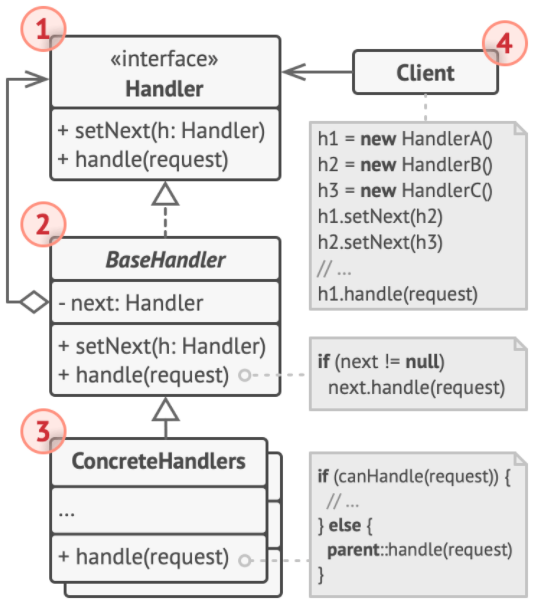

- 使用：

  - 创建多个具体处理者。
  - 为每个具体处理者设置其责任链上的下一个处理者。
  - 调用某个具体处理者的处理方法。

