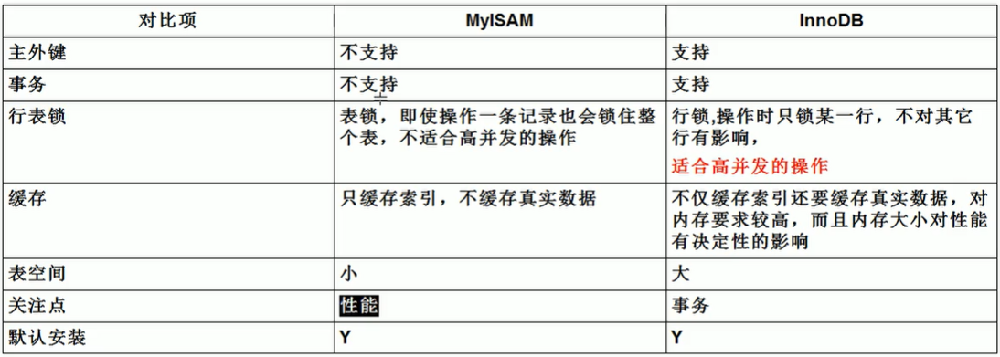
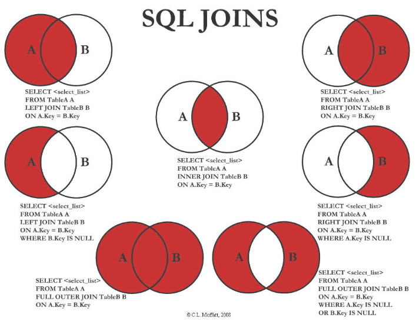
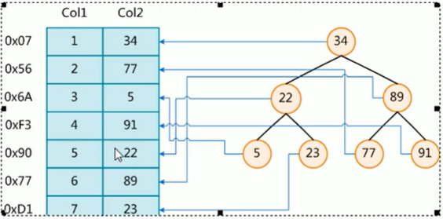
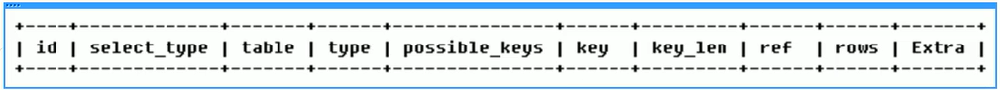

## 1、概述

- Linux下操作MYSQL：
  - 开启服务：`service mysql start`。
  - 停止服务：`service mysql stop`。
  - 设置root密码：`/usr/bin/mysqkadmin -u root password 123456`。
  - 启动MySQL：`mysql -uroot -p`。
  - 开机自启动：`chkconfig mysql on`。
  - 数据库文件路径：`/var/lib/mysql/`。
- 修改字符集：
  - 修改配置文件（5.5版本）：默认配置在/usr/share/mysql/my-huge.cnf下，复制到/etc/my.cnf。
  - [client]下添加：default-character-set=utf-8。
  - [mysqld]下添加：character_set_server=utf-8,character_set_client=utf-8,collation-server=utf-8。
  - [mysql]下添加：default-character-set=utf-8。
- 主要配置文件：
  - 二进制日志log-bin：用于主从复制。
  - 错误日志log-error：默认关闭，记录严重的警告和错误。
  - 查询日志log：默认关闭，记录查询的sql语句。
  - 数据文件：
    - frm文件：存放表结构。
    - myd文件：存放表数据。
    - myi文件：存放表索引。

- MySQL架构：
  - 连接层：JDBC等。
  - 服务层：
    - 数据库连接池。
    - 备份。
    - SQL层面：SQL语句、存储过程、视图等。
    - Parser解析语句。
    - SQL优化器。
    - 缓存。
  - 可拔插的存储引擎：MyISAM、InnoDB等。
  - 存储层：文件系统。

- 存储引擎：

  - 查看使用的存储引擎：`show variables like '%storage_engine%'`。

  - MyISAM和InnoDB：

    


## 2、索引

- SQL性能下降的原因：

  - 查询语句的写法效率低。
  - 索引失效。
  - 关联查询太多join。
  - 服务器调优及参数设置。

- SQL的执行顺序：

   ```sql
  (8) SELECT (9)DISTINCT<select_list>
  
  (1) FROM <left_table>
  
  (3) <join_type> JOIN <right_table>
  
  (2)         ON <join_condition>
  
  (4) WHERE <where_condition>
  
  (5) GROUP BY <group_by_list>
  
  (6) WITH {CUBE|ROLLUP}
  
  (7) HAVING <having_condition>
  
  (10) ORDER BY <order_by_list>
  
  (11) LIMIT <limit_number>
  ```

  (1) FROM:对FROM子句中的左表`<left_table>`和右表`<right_table>`执行笛卡儿积，产生虚拟表VT1;
   (2) ON: 对虚拟表VT1进行ON筛选，只有那些符合`<join_condition>`的行才被插入虚拟表VT2;
   (3) JOIN: 如果指定了`OUTER JOIN`(如LEFT OUTER JOIN、RIGHT OUTER JOIN)，那么保留表中未匹配的行作为外部行添加到虚拟表VT2，产生虚拟表VT3。如果FROM子句包含两个以上的表，则对上一个连接生成的结果表VT3和下一个表重复执行步骤1~步骤3，直到处理完所有的表;
   (4) WHERE: 对虚拟表VT3应用WHERE过滤条件，只有符合`<where_condition>`的记录才会被插入虚拟表VT4;
   (5) GROUP By: 根据GROUP BY子句中的列，对VT4中的记录进行分组操作，产生VT5;如果应用了group by，那么后面的所有步骤都只能得到的VT5的列或者是聚合函数（count、sum、avg等）。原因在于最终的结果集中只为每个组包含一行。这一点请牢记。
   (6) CUBE|ROllUP: 对VT5进行CUBE或ROLLUP操作，产生表VT6;
   (7) HAVING: 对虚拟表VT6应用HAVING过滤器，只有符合`<having_condition>`的记录才会被插入到VT7;
   (8) SELECT: 第二次执行SELECT操作，选择指定的列，插入到虚拟表VT8中;
   (9) DISTINCT: 去除重复，产生虚拟表VT9;
   (10) ORDER BY: 将虚拟表VT9中的记录按照`<order_by_list>`进行排序操作，产生虚拟表VT10;
   (11) LIMIT: 取出指定街行的记录，产生虚拟表VT11，并返回给查询用户。

- 注：group by后的CUBE|ROllUP：

   - 用于group by后有多个字段分组时。
   -  CUBE 生成的结果集显示了所选列中值的所有组合的聚合。
   -  ROLLUP  生成的结果集显示了所选列中值的某一层次结构的聚合，只返回第一个分组条件指定的列的统计行。

- 七种Join：

  

  - MySQL中不支持full全连接，需要用左右外连接union联合。


- 索引概述：

  - MySQL官方对索引的定义为：索引（Index）是帮助MySQL高效获取数据的数据结构。

    - 数据本身之外，数据库还维护着一个满足特定查找算法的数据结构，这些数据结构以某种方式指向数据，这样就可以在这些数据结构的基础上实现高级查找算法，这种数据结构（B树）就是索引。总之，就是排序+查找功能。

    - 为了加快查找，可以维护一个右边所示的二叉查找树，每个节点分别包含索引键值和一个指向对应数据记录物理地址的指针，这样就可以运用二叉查找在一定的复杂度内获取到相应数据，从而快速的检索出符合条件的记录。

      

  - 索引的目的在于提高查询效率，可以类比字典。

    - 如果要查“mysql”这个单词，我们肯定需要定位到m字母，然后从下往下找到y字母，再找到剩下的sql。
    - 如果没有索引，就需要遍历所有表项。
    - 一般来说索引本身也很大，不可能全部存储在内存中，因此索引往往以索引文件的形式存储的磁盘上。
    - 平常所说的索引，如果没有特别指明，都是指B树（多路搜索树，并不一定是二叉的）结构组织的索引。其中聚集索引，次要索引，复合索引，前缀索引，唯一索引默认都是使用B+树索引，统称索引。

  - 索引：

    - 提高数据检索的效率，降低数据库的IO成本。
    - 通过索引列对数据进行排序，降低数据排序的成本，降低了CPU的消耗。

  - 劣势：

    - 实际上索引也是一张表，该表保存了主键与索引字段，并指向实体表的记录，所以索引列也是要占用空间的。
    - 虽然索引大大提高了查询速度，同时却会降低更新表的速度，如对表进行INSERT、UPDATE和DELETE。因为更新表时，MySQL不仅要保存数据，还要保存一下索引文件每次更新添加了索引列的字段，都会调整因为更新所带来的键值变化后的索引信息。
    - 索引只是提高效率的一个因素，如果有大数据量的表，就需要花时间研究建立最优秀的索引。

- 索引的分类：
  - 单值索引：即一个索引只包含单个列，一个表可以有多个单列索引。
  - 唯一索引：索引列的值必须唯一，但允许有空值。
  - 复合索引：一个索引包含多个列。
  - 一般而言，一张表中的索引不超过5个。
- 索引的操作：
  - 创建：
    - `create index 索引名 on 表名(索引列)`。
    - `alter 表名 add index [索引名] on (索引列)`。
      - 可以将index替换为primary、unique、fulltext，分别表示主键索引、唯一索引和全文索引。
  - 删除：`drop index [索引名] on 表名`。
  - 查看：`show index from 表名`。

- 索引的结构：B树索引。
- 那些情况需要创建索引：
  - 主键自动建立唯一索引。
  - 频繁作为查询条件的字段应该创建索引。
  - 查询中与其它表关联的字段，外键关系建立索引。
  - 频繁更新的字段不适合创建索引。
  - Where条件里用不到的字段不创建索引。
  - 在高并发下倾向创建组合索引。
  - 查询中排序的字段，排序字段若通过索引去访问将大大提高排序速度。
  - 查询中统计或者分组字段。
- 那些情况不适合创建索引：
  - 表记录太少。
  - 经常增删改的表。
  - 数据重复（差异率低）并且分布均匀。
  - 索引的选择性：索引列不同的值个数 / 索引列记录数，越接近1效率越高。


- 性能分析：

  - MySQL Query Optimizer：优化select语句的执行效率。
  - MySQL常见瓶颈：
    - CPU：CPU在饱和的时候一般发生在数据装入内存或从磁盘上读取数据时候。
    - IO：磁盘I/O瓶颈发生在装入数据远大于内存容量的时候。
    - 服务器硬件的性能瓶颈：top，free，iostat和vmstat来查看系统的性能状态。
  - Explain。

- Explain：

  - 使用EXPLAIN关键字可以模拟优化器执行SQL查询语句，从而知道MySQL是如何处理SQL语句的。分析查询语句或是表结构的性能瓶颈。
  - 实现的功能：
    - 表的读取顺序。
    - 数据读取操作的操作类型。
    - 哪些索引可以使用。
    - 哪些索引被实际使用。
    - 表之间的引用。
    - 每张表有多少行被优化器查询。
  - 操作：
    - `explain + SQL语句`。

- 返回的执行计划包含的信息：

  

  - id：
    - select查询的序列号，包含一组数字，表示查询中执行select子句或操作表的顺序。
    - 有三种取值：
      - id相同，执行顺序由上至下。
      - id不同，如果是子查询，id的序号会递增，id值越大优先级越高，越先被执行。
      - id相同不同，同时存在。先按id值越大优先级越高，id相同时再按执行顺序由上至下。
  - select_type：
    - 查询的类型，主要是用于区别普通查询、联合查询、子查询等的复杂查询。
    - 有六种取值：
      - SIMPLE：简单的select查询，查询中不包含子查询或者UNION。
      - PRIMARY：查询中若包含任何复杂的子部分，最外层查询则被标记为。
      - SUBOUERY：在SELECT或WHERE列表中包含了子查询。
      - DERIVED ：在FROM列表中包含的子查询被标记为DERIVED（衍生）。MySQL会递归执行这些子查询，把结果放在临时表里。
      - UNION ：若第二个SELECT出现在UNION之后，则被标记为UNION；若UNION包含在FROM子句的子查询中，外层SELECT将被标记为DERIVED。
      - UNION RESULT：从UNION表获取结果的SELECT。
  - table：显示这一行的数据是关于哪张表的。
  - type：
    - 显示查询使用了何种类型。
    - 一般有七种常用的取值：
      - system：表只有一行记录（等于系统表），这是const类型的特列，平时不会出现。
      - const：表示通过索引一次就找到了，const用于比较primary key或者unique索引。因为只匹配一行数据，所以很快如将主键置于where列表中，MySQL就能将该查询转换为一个常量。
      - eq_ref：唯一性索引扫描，对于每个索引键，表中只有一条记录与之匹配。常见于主键或唯一索引扫描。
      - ref：非唯一性索引扫描，返回匹配某个单独值的所有行。本质上也是一种索引访问，它返回所有匹配某个单独值的行，然而，它可能会找到多个符合条件的行，所以属于查找和扫描的混合体。
      - range：只检索给定范围的行，使用一个索引来选择行。key列显示使用了哪个索引一般就是在你的where语句中出现了between、<、>、in等的查询这种范围扫描索引扫描比全表扫描要好，因为它只需要开始于索引的某一点，而结束语另一点，不用扫描全部索引。
      - index：Full Index Scan，index与ALL区别为index类型只遍历索引树。这通常比ALL快，因为索引文件通常比数据文件小。（也就是说虽然all和Index都是读全表，但index是从索引中读取的，而all是从硬盘中读的）
      - ALL：Full Table Scan，将遍历全表以找到匹配的行。
    - 按从好到差依此排序：system > const > eq_ref > ref > range > index > ALL。
    - 一般保证查询类型至少到reange，到ref较好。
  - possible_keys：
    - 显示可能应用在这张表中的索引，一个或多个。
      查询涉及到的字段若存在索引，则该索引将被列出，但不一定被查询实际使用。
  - key：
    - 实际使用的索引。如果为NULL则没有使用索引。
    - 查询中若使用了覆盖索引，则该索引仅出现在key列表中，不在possible_keys中。
  - key_len：
    - 表示索引中使用的字节数，可通过该列计算查询中使用的索引的长度。越长查询越精确，越短效率越高。
    - key_len显示的值为索引字段的最大可能长度，并非实际使用长度，即key_len是根据表定义计算而得，不是通过表内检索出的。
  - ref：
    - 显示索引被哪些列使用了。也就是说，哪些列或常量被用于查找索引列上的值。如果是索引与常量比较，则显示const。
  - rows：
    - 根据表统计信息及索引选用情况，大致估算出找到所需的记录所需要读取的行数。
  - Extra：
    - 不适合在其他列显示，但是也很重要的额外信息。
    - Using filesort：
      - 说明mysql会对数据使用一个外部的索引排序，而不是按照表内的索引顺序进行读取。
        MySQL中无法利用索引完成的排序操作称为“文件排序”。
      - 比如表中对A、B、C三个字段做了复合索引，但是查询和排序过程中只用到了A和C字段，就会产生文件排序。
    - Using temporary：
      - 使了用临时表保存中间结果，MySQL在对查询结果排序时使用临时表。常见于排序order by和分组查询group by。
    - Using index：
      - 表示相应的select操作中使用了覆盖索引（Covering Index），避免访问了表的数据行，效率较高。
      - 如果同时出现using where，表明索引被用来执行索引键值的查找；如果没有同时出现using where，表明索引用来读取数据而非执行查找动作。
    - Using where：使用了where过滤。
    - Using join buffer：使用连接缓存。
    - Impossible where：where条件总是false。
    - select tables optimized away：在没有GROUPBY子句的情况下，基于索引优化MIN/MAX操作或者对于MyISAM存储引擎优化COUNT（*）操作，不必等到执行阶段再进行计算，查询执行计划生成的阶段即完成优化。
    - distinct：优化distinct，在找到第一匹配的元组后即停止找同样值的动作。


- 覆盖索引：
  - 就是select的数据列只用从索引中就能够取得，不必读取数据行，MySQL可以利用索引返回select列表中的字段，而不必根据索引再次读取数据文件，换句话说查询列要被所建的索引覆盖。
  - 索引是高效找到行的一个方法，但是一般数据库也能使用索引找到一个列的数据，因此它不必读取整个行。毕竟索引叶子节点存储了它们索引的数据；当能通过读取索引就可以得到想要的数据，那就不需要读取行了。一个索引包含了（或覆盖了）满足查询结果的数据就叫做覆盖索引。
  - 如果要使用覆盖索引，select后查询的字段，需要包含在所建立的复合索引的字段。


- 索引分析：
  - 单表优化：
    - 问题：查询category_id为1且comments大于1的情况下，views最多的article_id。
    - SQL：`SELECT id,author_id FROM article WHERE category_id =1 AND comments > 1 ORDER BY views DESC LIMIT 1`。
    - 未建索引的情况下，type为ALL，Extra中出现了Using filesort。性能很差，需要优化。
    - 索引方式1：
      - 建立where后面的用到的字段所构成的复合索引，即`(category_id,comments,views)`。
      - type变为range，而且使用到了索引。但产生文件排序。
      - 但是由于comments的条件是大于，而索引会按照创建的字段顺序依此排序，所以会导致comments后的字段索引失效。
    - 索引方式2：
      - 创建索引2`(category_id,views)`，不包括条件为range的comments。
      - type变为ref，没有出现文件排序。
  - 两表优化：
    - 问题：分类对应书名，两张表通过主键左外连接。
    - SQL：`SELECT * FROM class LEFT JOIN book ON class.card=book.card`。
    - 未建索引的情况下，type为ALL。
    - 索引方式：
      - 创建右表的主键card的索引。
      - type变为ref，rows行数下降。
      - 因为左外连接相当于遍历左边表的主键，去右边表中查找匹配，所以主要的查找是针对右表的。
      - 相应的，右外连接的索引应该加在左表上。
  - 三表优化：
    - 问题：分类对应书名和手机名，三张表两次左外连接。
    - SQL：`SELECT * FROM class LEFT JOIN book ON class.card=book.card LEFT JOIN phone ON book.card =phone.card`。
    - 未建索引的情况下，type为ALL。
    - 索引方式：
      - 分别建立两次左外连接的右表book和phone的索引。
      - type变为ref，rows下降。
  - Join语句优化：
    - 尽可能减少Join语句中的NestedLoop（join连接的比较次数）的循环总次数；“永远用小结果集驱动大的结果集”。也就是说如果是左外连接，左表应该是数据较少的那个。
    - 优先优化NestedLoop的内层循环；
    - 保证Join语句中被驱动表上Join条件字段已经被索引；
    - 当无法保证被驱动表的Join条件字段被索引且内存资源充足的前提下，不要太吝惜JoinBuffer的设置。


- 索引优化：
  - 全值匹配：
    -  用等号将索引中的所有字段与常量比较作为where筛选条件。也就是对索引中的所有列进行匹配。
  - 最佳左前缀法则：
    - 查询从索引的最左前列开始并且不跳过索引中的列。
    - 因为索引实现的排序，就是按照索引建立时声明的顺序。
  - 对索引列做操作，会导致索引失效而转向全表扫描：
    - 这些操作包括，对索引列进行计算、函数、（自动or手动）类型转换等。比如：`where left(name,4)='july'`。
    - 因为这些操作的结果是预先不可知的，所以无法使用索引。
  - 不能使用索引中范围条件右边的列：
    - 就是如果条件中A列使用了大于或小于等范围查找，那么索引中A列以后的索引都失效了。
    - 对于A列和其左侧的等值条件索引仍然有效，但是对于A列是type是range而不是ref。
  - 尽量使用覆盖索引，减少select*：
    - 只访问索引的查询，查询列包含在索引列中。
  - 使用不等于（！=或者<>）的时候无法使用索引会导致全表扫描：
    - 因为不等于无法利用比较提前确定结果。
  - is null，is not nul也无法使用索引。
  - like以通配符开头（%abc...），索引失效会变成全表扫描：
    - 如何解决这种索引失效：使用覆盖索引。也就是建立一个所要通配的列与其他列的一个复合索引。
  - 字符串不加单引号索引失效：
    - 比如对于字符类型，要写`name='100'`而不是`name=100`。其实相当于做了自动类型转换。
  - 少用or，用它来连接时会索引失效。

- 索引优化例：
  - 表中有字段c1、c2、c3，创建索引(c1，c2，c3)。
  - 对于定值和范围筛选，都是按最佳左前缀准则，且范围后都失效。
  - 如果加入order by：
    - 使用explain分析到的是使用索引进行查询的情况，而order by可以使用索引进行排序，但不显示在explain的结果中。
    - `c1= and c2= order by c3`：使用了c1、c2作为查询，使用c3作为排序。
    - `c1= order by c2,c3`：使用了c1作为查询，使用c2、c3作为排序。
    - `c1= order by c3,c2`：使用了c1作为查询，而先用c3排序，导致无法使用索引。出现了文件排序。
    - `c1= and c2= order by c3,c2`：使用了c1、c2作为查询，使用c3作为排序。因为c2有定值条件不存在排序问题。
    - `c1= and c2> order by c3`：使用了c1、c2作为查询，但是由于c2是范围，所以排序c3时索引失效。
    - `c1= and c2> order by c2`： 使用了c1、c2作为查询，排序c2时也使用索引。
    - `c1= and c2> order by c2,c3`：使用了c1、c2作为查询，排序c2、c3时也使用索引。
  - 如果加入group by：
    - 在进行分组之前，也需要先进行排序，所以单独使用时与order by类似。
  - 一般性建议：
    - 对于单键索引，尽量选择针对当前query过滤性更好的索引。
    - 在选择组合索引的时候，当前Query中过滤性最好的字段在索引字段顺序中，位置越靠前越好。
    - 在选择组合索引的时候，尽量选择可以能够包含当前query中的where字句中更多字段的索引。
    - 尽可能通过分析统计信息和调整query的写法来达到选择合适索引的目的。


## 3、查询截取分析

- SQL优化流程：

  1、慢查询的开启并捕获。
  2、explain+慢SQL分析。
  3、show profile查询SQL在Mysql服务器里面的执行细节和生命周期情况。
  4、SQL数据库服务器的参数调优。

- 小表驱动大表：

  - 小的数据集驱动大的数据集。外部循环时小表，内部循环是大表。

  - in和exist：

    - 当B表的数据规模小于A表时，用in优于exists。

      ```sql
      select * from A where id in(select id from B)
      等价于：
      for select id from B
      for select * from A where A.id=B.id
      ```

    - 当A表的数据规模小于B表时，用exists优于in。

      ```sql
      select * from A where exists(select 1 from B where B.id=A.id)
      等价于
      for select*from A
      for select*from B where B.id=A.id
      ```

    - exists可以理解为一种in的变种，也就是将主查询的数据，放到子查询中做条件验证，根据验证结果（TRUE或FALSE）来决定查询的数据结果是否得以保留。

    - in和exists使用时，执行逻辑不同。in是先执行子查询（子查询驱动），exists是根据主表项作为参数进行子查询（主查询驱动）。

- order by排序优化：

  - 尽量使用index索引排序，避免使用filesort文件排序。
  - order by使用index排序的情况：
    - ORDER BY语句使用索引最左前列。
    - 使用Where子句与Order BY子句条件列组合满足索引最左前列。
  - 对于索引(c1，c2，c3)：
    - `c2= order by c1,c3`：index排序。
    - `c2> order by c1,c3`：filesort排序。
    - `c1= and c3> order by c2`：index排序。
    - `c3> order by c1,c2`：index排序。
    - `c3> order by c2,c1`：filesort排序。
    - `c1= order by c1,c2 desc`：filesort排序。
    - `c1= order by c1 desc,c2 desc`：index排序。排序字段同升同降
  - filesort排序：
    - 双路排序：
      - MySQL4.1之前。指的是对磁盘进行两次扫描。
      - 第一次取出行指针和orderby列到buffer中进行排序。第二次根据排序结果用行指针从表中读取数据。
    - 单路排序：
      - MySQL4.1之后。指的是对磁盘进行一次扫描。
      - 直接从磁盘读取所有查询列到buffer，但是需要更大的空间。
    - 单路排序可能出现的问题：
      - 如果取出的数据在sort_buffer中存不下，就需要多次取出和排序，反而造成性能降低。
    - 提高order by的速度：
      - 尽量不使用`select *`。
      - 尝试提高sort_buffer_size。
      - 尝试提高max_length_for_sort_data。
  - group by分组：相当于先排序后分组，uorder by类似。

- 慢查询：

  - MySQL的慢查询日志是MySQL提供的一种日志记录，它用来记录在MySQL中响应时间超过阀值的语句，具体指运行时间超过long query time值的SQL，会被记录到慢查询日志中。
  - long_query_time的默认值为10，意思是运行10秒以上的语句。可以通过`show variables like '%long_query_time%'`查看。
  - 由他来查看哪些SQL超出了最大忍耐时间值，比如一条sql执行超过5秒钟，就算慢SQL，希望能收集超过5秒的sql，结合之前explain进行全面分析。
  - 默认情况下，MySQL数据库没有开启慢查询日志，需要我们手动来设置这个参数。如果不是调优需要的话，一般不建议启动该数，因为开启慢查询日志会或多或少带来一定的性能影响。慢查询日志支持将日志记录写入文件。
  - 查看是否开启：`show variables like '%slow_query_log%'`。
  - 开启：`set global slow_query_log=1`。
  - 设置阈值：`set global long_query_time=阈值`。
  - 查询当前系统中有多少条慢查询记录：`show global status like '%Slow_queries%'`。
  - 慢查询日志分析工具mysqldumpslow。

- 批量数据插入：P228。

- Show Profile：

  - 是mysql提供可以用来分析当前会话中语句执行的资源消耗情况。可以用于SQL的调优的测量。
  - 开启：`set profiling=on`。
  - 查看结果：`show profile`。
  - 诊断SQL：`show profile cpu,block io for query 查询SQLid`。
  - 值得注意的结论：
    - converting HEAP to MyISAM：查询结果太大，内存都不够用了往磁盘上搬了。
    - Creating tmp table创建临时表：拷贝数据到临时表，用完再删除。
    - Copying to tmp table on disk：把内存中临时表复制到磁盘，危险。
    - locked。

- 全局查询日志：

  - 不要在生产环境中开启，用于测试环境。
  - 开启：
    - `set global general_log=1`。
    - `set global log_output='TABLE"`。
    - 此后，你所编写的sql语句，将会记录到mysql库里的general_log表。
    - 查看：`select * from mysql.general_log`。


## 4、锁

- 锁的分类：
  - 从数据操作的类型：
    - 读锁(共享锁)：针对同一份数据，多个读操作可以同时进行而不会互相影响。
    - 写锁（排它锁）:当前写操作没有完成前，它会阻断其他写锁和读锁。
  - 从数据操作的粒度：
    - 表锁（偏读）。
    - 行锁（偏写）。
    - 页锁。
  
- 表锁：
  - 偏向MyISAM存储引擎，开销小，加锁快；无死锁。锁定粒度大，发生锁冲突的概率最高，并发度最低。
  - 查看表是否有锁：`show open tables`。
  - 添加表锁（读或写）：`lock table 表名 read/write`。
  - 释放表锁：`unlock tables`。
  - 查看锁争用情况：`show status like 'table%'`。
    - Table_locks_immediate：产生表级锁定的次数，表示可以立即获取锁的查询次数，每立即获取锁值加1。
    - Table_locks_waited：出现表级锁定争用而发生等待的次数(不能立即获取锁的次数，每等待一次锁值加1)，此值高则说明存在着较严重的表级锁争用情况。
  - 读锁：
    - 在会话1中对表加读锁。
    - 在加锁期间，会话1和会话2都能对该表进行查询。
    - 在加锁期间，会话1不能对该表进行增删改操作，会话2对该表进行增删改操作会阻塞。
    - 在加锁期间，会话1不能查询其他的表，会话2可以查询或增删改其他的表。
  - 写锁：
    - 在会话1中对表加写锁。
    - 在加锁期间，会话1可以对该表进行查询和增删改。但是不能查询其他表。
    - 在加锁期间，会话2对该表进行查询或增删改会阻塞。但是可以查询或增删改其他锁。
  - 读锁会阻塞写，但是不会阻塞读；写锁读和写都会阻塞。
  - Myisam的读写锁调度是写优先，这也是myisam不适合做写为主表的引擎的原因。因为写锁后，其他线程不能做任何操作，大量的更新会使查询很难得到锁，从而造成永远阻塞。
  
- 行锁：

  - 偏向InnoDB存储引擎，开销大，加锁慢;会出现死锁;锁定粒度最小，发生锁冲突的概率最低,并发度也最高。
  - InnoDB与MyISAM的最大不同有两点:一是支持事务(TRANSACTION);二是采用了行级锁。
  - 行锁就是对表中的一行进行锁定。当有两个会话修改同一行时，第一个会话没有提交事务则第二个会话的修改会阻塞；当修改不同行时，两个会话不会相互影响。
  - 索引失效导致行锁升级为表锁：
    - 比如在修改语句中产生了自动类型转换，导致使用的索引失效。本来的行锁会升级为表锁。
    - 此时，另一个会话想要修改另一行会被阻塞，因为前一个会话加了表锁。
  - 查看锁争用情况：
    - `show status like 'innodb_row_lock%'`。
    - Innodb_row_lock_time_avg：等待平均时长。
    - Innodb_row_lock_waits：等待总次数。
    - Innodb_row_lock_time：等待总时长。

- 间隙锁：

  - 在可重复读的隔离级别下，使用范围条件查询/修改数据时，InnorDB会给符合条件的已有数据行的索引项加锁。对于索引值在这个范围但不存在的记录，叫做间隙。
  - InnoDB也会对这个间隙加锁。这样，如果提交之前，另一个会话想要插入此索引值的数据行，会被阻塞。

- 如何锁定一行：

  ```sql
  begin;
  -- 对该行加行锁
  select * from row_lock where a=8 for update;
  
  -- 对该行数据操作,其他会话想修改该行会阻塞
  
  commit;
  ```

- 页锁：开销和加锁时间界于表锁和行锁之间;会出现死锁;锁定粒度界于表锁和行锁之间，并发度一般。

- 优化建议：

  - 尽可能让所有数据检索都通过索引来完成，避免无索引行锁升级为表锁。
  - 合理设计索引，尽量缩小锁的范围尽可能较少检索条件，避免间隙锁。
  - 尽量控制事务大小，减少锁定资源量和时间长度。

  - 尽可能低级别事务隔离。


## 5、主从复制

- MySQL复制过程分成三步：
  - master将改变记录到二进制日志(binary log)。这些记录过程叫做二进制日志事件，binary log events；
  - slave将master的binary log events拷贝到它的中继日志(relay log) ;
  - slave重做中继日志中的事件，将改变应用到自己的数据库中。MySQL复制是异步的且串行化的。
- 复制的基本原则：
  - 每个slave只有一个master。
  - 每个slave只能有一个唯一的服务器ID。
  - 每个master可以有多个salve。
- 复制的最大问题：延迟。
- 一主一从配置：
  - 数据库版本相同，并且网络可以相互ping通。
  - 主机配置文件[mysqld]下配置：
    - 配置主服务器唯一ID：server-id=1。
    - 启用二进制日志：log-bin=MySQL本地路径\mysqlbin。
    - 此外，还可选配置错误日志、根目录、临时目录、数据目录
    - 设置读写都可以：read-only=0。
    - 设置不要复制的数据库：binlog-ignore-db=数据库名。
    - 设置需要复制的数据库：binlog-do-db=数据库名。
  - 从机配置文件[mysqld]下配置：
    - 配置从服务器唯一ID：server-id=2。
    - 启用二进制日志。
  - 重启主从机，关闭防火墙。
  - 主机上建立账户并授权slave：
    - `GRANT REPLICATION SLAVE ON *,*TO ’账户'@'从机IP地址’IDENTIFIEDBY ’密码’`。
    - `flush privileges`：刷新系统权限。
    - 查看主机状态：`show status master`。
      - 记录file和position项的值。
  - 从机上配置：
    - `CHANGE MASTER TO MASTER_HOST='主机IP地址',MASTER_USER='账户',
      MASTER_PASSWORD='密码',
      MASTER_LOG_FILE='file项的值’,MASTER_LOG_POS=position项的值`。
    - 启动从服务器复制：`start slave`。
    - 查看配置是否成功：`show slave status/G`。
      - Slave_IO_Running: Yes，Slave_sQL_Running: Yes表示成功。
    - 停止从服务复制：`stop slave`。


