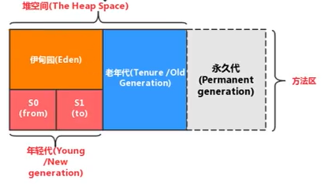
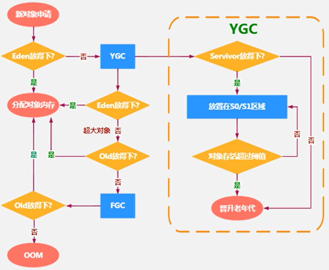

## 1、本地方法

- 什么是本地方法？

  - 一个Native Method就是一个Java调用非Java代码的接口。一个Native Method是这样一个Java方法：该方法用native修饰，实现由非Java语言实现，比如C。
  - 在定义一个native method时，并不提供实现体（有些像定义一个Java interface），因为其实现体是由非java语言在外面实现的。
  - 本地接口的作用是融合不同的编程语言为Java所用，它的初衷是融合C/C++程序。

- 为什么使用本地方法？

  - Java应用需要与Java外面的环境交互。
  - 为了提高效率，实现与底层操作系统交互。
  - Sun的解释器是用C实现的，可以像普通的C一样与外部交互。

- 本地方法栈：

  - Java虚拟机栈用于管理Java方法的调用，而本地方法栈用于管理本地方法的调用。
  - 本地方法栈，也是线程私有的。
  - 允许被实现成固定或者是可动态扩展的内存大小。（在内存溢出方面是相同的）
    - 如果线程请求分配的栈容量超过本地方法栈允许的最大容量，Java虚拟机将会抛出一个 stackoverflowError异常。
    - 如果本地方法栈可以动态扩展，并且在尝试扩展的时候无法申请到足够的内存，或者在创建新的线程时没有足够的内存去创建对应的本地方法栈，那么Java虚拟机将会抛出一个outofMemoryerror异常。
  - 本地方法是使用C语言实现的。它的具体做法是Native Method stack中登记native方法，在Execution Engine执行时加载本地方法库。
  - 当某个线程调用一个本地方法时，它就进入了一个全新的并且不再受虚拟机限制的世界。它和虚拟机拥有同样的权限。
    - 本地方法可以通过本地方法接口来访问虚拟机内部的运行时数据区。
    - 它甚至可以直接使用本地处理器中的寄存器。
    - 直接从本地内存的堆中分配任意数量的内存。
  - 并不是所有的JVM都支持本地方法。因为Java虚拟机规范并没有明确要求本地方法栈的使用语言、具体实现方式、数据结构等。如果JVM不打算支持native方法，也可以无需实现本地方法栈。
  - 在Hotspot JVM中，直接将本地方法栈和虚拟机栈合二为一。

## 2、堆

- 堆的核心概述：
  - 一个JVM实例只存在一个堆内存，堆也是Java内存管理的核心区域。
  - Java堆区在JVM启动的时候即被创建，其空间大小也就确定了。是JVM管理的最大一块内存空间。堆内存的大小是可以调节的。
  - 《Java虚拟机规范》规定，堆可以处于物理上不连续的内存空间中，但在逻辑上它应该被视为连续的。
  - 所有的线程共享Java堆，在这里还可以划分线程私有的缓冲区（Thread Local Allocation Buffer，TLAB）。这是为了部分解决线程安全问题。
  - 《Java虚拟机规范》中对Java堆的描述是：所有的对象实例以及数组都应当在运行时分配在堆上。
    - 实际上，从实际使用角度看，“几乎”所有的对象实例都在这里分配内存。
    - 也有可能在栈上分配。
  - 数组和对象可能永远不会存储在栈上，因为栈帧中保存引用，这个引用指向对象或者数组在堆中的位置。
  - 在方法结束后，堆中的对象不会马上被移除，仅仅在垃圾收集的时候才会被移除。
  - 堆，是GC（Garbage Collection，垃圾收集器）执行垃圾回收的重点区域。
  - 设置初始堆大小和最大堆大小：在VM options中设置`-Xms大小`和`-Xmx大小`。
  
- 堆的细分内存结构：
  - 现代垃圾收集器大部分都基于分代收集理论设计。
  - Java 7及之前堆内存逻辑上分为三部分：新生区（Young Generation Space）+养老区（Tenure Generation Space）+永久区（Permanent Space）。
  - Java 8及之后堆内存逻辑上分为三部分：新生区+养老区+元空间（Meta Space）。
  - 实际上，永久区/元空间都是属于方法区的实现。
  - 新生区又分为伊甸园（Eden）、幸存者0区（S0/from）和幸存者1区（S1/to）。
  
  
  
- 堆空间大小的设置：

  - 堆空间大小也就是指年轻代+老年代的大小。
  - Java堆区用于存储Java对象实例，那么堆的大小在JVM启动时就已经设定好了，大家可以通过选项"-Xmx"和"-Xms"来进行设置。
    - "-Xms"用于表示堆区的起始内存，等价于-XX：InitialHeapsize。
    - "-Xmx"则用于表示堆区的最大内存，等价于-XX:MaxHeapSize。
  - 一旦堆区中的内存大小超过"-Xmx"所指定的最大内存时，将会抛出OutOfMemoryError异常。
  - 通常会将-Xms和-Xmx两个参数配置相同的值，其目的是为了能够在java垃圾回收机制清理完堆区后不需要重新分隔计算堆区的大小，从而提高性能。
  - 默认情况下，初始内存大小：物理电脑内存大小/64；最大内存大小：物理电脑内存大小/4。

- 年轻代和老年代：

  - 存储在JVM中的Java对象可以被划分为两类：
    - 一类是生命周期较短的瞬时对象，这类对象的创建和消亡都非常迅速。
    - 另外一类对象的生命周期却非常长，在某些极端的情况下还能够与JVM的生命周期保持一致。
  - Java堆区进一步细分的话，可以划分为年轻代（YoungGen）和老年代（OldGen）。
  - 其中年轻代又可以划分为Eden空间、Survivor0空间和Survivor1空间（有时也叫做from区、to区）。
  - 配置新生代与老年代在堆结构的占比：
    - 默认-XX：NewRatio=2，表示新生代占1，老年代占2，新生代占整个堆的1/3。在新生代中，S0和S1区各占新生代的1/10。
    - 可以修改-XX：NewRatio=4，表示新生代占1，老年代占4，新生代占整个堆的1/5。
    - 在HotSpot中，Eden空间和另外两个Survivor空间缺省所占的比例是8：1：1。当然开发人员可以通过选项"-XX：SurvivorRatio"调整这个空间比例。比如-XX：SurvivorRatio=8。
    - 几乎所有的Java对象都是在eden区被new出来的。
    - 绝大部分的Java对象的销毁都在新生代进行了。
    - 可以使用选项"-Xmn"设置新生代最大内存大小。这个参数一般使用默认值就可以了。

- 对象的内存分配过程（P72、73）：

  - 为新对象分配内存是一件非常严谨和复杂的任务，JVM的设计者们不仅需要考虑内存如何分配、在哪里分配等问题，并且由于内存分配算法与内存回收算法密切相关，所以还需要考虑GC执行完内存回收后是否会在内存空间中产生内存碎片。

  1. new的对象先放伊甸园区。此区有大小限制。
  2. 当伊甸园的空间填满时，程序又需要创建对象，JVM的垃圾回收器将对伊甸园区进行垃圾回收（YGC/Minor GC），将伊甸园区中的不再被其他对象所引用的对象进行销毁。
  3. 然后将伊甸园中的剩余对象移动到幸存者0区。再加载新的对象放到伊甸园区。
  4. 如果再次触发垃圾回收，此时上次幸存下来的放到幸存者0区的，如果没有回收，就会放到幸存者1区。同时，伊甸园区中的剩余对象也放到幸存者1区。
  5. 如果再次经历垃圾回收，此时会重新放回幸存者0区，接着再去幸存者1区。每次被移动一次，年龄计数器age就会加1。
  6. 啥时候能去养老区呢？可以设置次数也就是年龄计数器的大小。默认是15次。可以设置参数：-XX:MaxTenuringThreshold=<N>进行设置。
  7. 在养老区，相对悠闲。当养老区内存不足时，再次触发GC：FGC/Major Gc，进行养老区的内存清理。
  8. 若养老区执行了FGC/Major GC之后发现依然无法进行对象的保存，就会产生OOM异常。

  

  - 针对幸存者S0、S1区：复制之后有交换，谁空谁是to。
  - 关于垃圾回收：频繁在新生区收集，很少在养老区收集，几乎不在永久区/元空间收集。
  - 触发YGC/Minor GC的要求是伊甸园区满了，S0或S1区满了不会触发GC。但是YGC/Minor GC也会对S0或S1区进行垃圾回收。S0或S1区满了可能会直接进入老年代。
  - 也有可能对象一被创建就在老年代。

- Minor GC、Major GC和Full GC：

  - JVM在进行GC时，并非每次都对上面三个内存（新生代、老年代；方法区）区域一起回收的，大部分时候回收的都是指新生代。
  - 针对HotSpot VM的实现，它里面的GC按照回收区域又分为两大种类型：一种是部分收集Partial GC），一种是整堆收集（Full GC）。
    - 部分收集：不是完整收集整个Java堆的垃圾收集。其中又分为：
      - 新生代收集（Minor GC/Young GC）：只是新生代的垃圾收集。
      - 老年代收集（Major GC/Old GC）：只是老年代的垃圾收集。
        - 目前，只有CMS GC会有单独收集老年代的行为。
        - 很多时候Major GC会和Full GC混淆使用，需要具体分辨是老年代回收还是整堆回收。
      - 混合收集（Mixed GC）：收集整个新生代以及部分老年代的垃圾收集。
        - 目前，只有G1 GC会有这种行为
    - 整堆收集（Full GC）：收集整个java堆和方法区的垃圾收集。

- 年轻代GC（Minor GC）触发机制：

  - 当年轻代空间不足时，就会触发Minor GC，这里的年轻代满指的是Eden代满，Survivor满不会引发GC。（每次Minor GC会清理年轻代的内存）
  - 因为Java对象大多都具备朝生夕灭的特性，所以Minor GC非常频繁，一般回收速度也比较快。
  - Minor Gc会引发STW，暂停其它用户的线程，等垃圾回收结束，用户线程才恢复运行。

- 老年代GC（Major GC）触发机制：

  - 指发生在老年代的GC，对象从老年代消失时，我们说"Major GC"或"Full GC发生了。
  - 出现了Major GC，经常会伴随至少一次的Minor GC（但非绝对的，在Parallel Scavenge收集器的收集策略里就有直接进行Major GC的策略选择过程）
  -  Major GC的速度一般会比Minor Gc慢10倍以上，STW的时间更长。
  - 如果Major GC后，内存还不足，就报OOM了。

- Full GC触发机制：
  触发Full GC执行的情况有如下五种：

  - 调用`System.gc()`时，系统建议执行Full Gc，但是不必然执行。
  - 老年代空间不足。
  - 方法区空间不足。
  - 通过Minor GC后进入老年代的平均大小大于老年代的可用内存。
  - 由Eden区、survivor space0（From Space）区向survivor space1（To Space）区复制时，对象大小大于To Space可用内存，则把该对象转存到老年代，且老年代的可用内存小于该对象大小.

- 堆空间的分代思想：

  - 不同对象的生命周期不同。70%-99%的对象是临时对象。
  - 其实不分代完全可以，分代的唯一理由就是优化GC性能。
  - 如果没有分代，那所有的对象都在一块。GC的时候要找到哪些对象没用，这样就会对堆的所有区域进行扫描。
  - 而很多对象都是朝生夕死的，如果分代的话，把新创建的对象放到某一地方，当GC的时候先把这块存储“朝生夕死”对象的区域进行回收，这样就会腾出很大的空间出来。

- 内存分配策略：

  - 优先分配到Eden。
  - 大对象直接分配到老年代。尽量避免程序中出现过多的大对象。
  - 长期存活的对象分配到老年代。
  - 动态对象年龄判断。如果survivor区中相同年龄的所有对象大小的总和大于Survivor空间的一半，年龄大于或等于该年龄的对象可以直接进入老年代，无须等MaxTenuringThreshold中要求的年龄。
  - 空间分配担保：-XX：HandlePromotionFailure。

- TLAB（Thread Local Allocation Buffer）：

  - 堆区是线程共享区域，任何线程都可以访问到堆区中的共享数据。
  - 由于对象实例的创建在JVM中非常频繁，因此在并发环境下从堆区中划分内存空间是线程不安全的。
  - 为避免多个线程操作同一地址，需要使用加锁等机制，进而影响分配速度。
  - 从内存模型而不是垃圾收集的角度，对Eden区域继续进行划分，JVM为每个线程分配了一个私有缓存区域，它包含在Eden空间内。
  - 多线程同时分配内存时，使用TLAB可以避免一系列的非线程安全问题，同时还能够提升内存分配的吞吐量，因此我们可以将这种内存分配方式称之为快速分配策略。
  - 几乎所有OpenJDK衍生出来的JVM都提供了TLAB的设计。
  - 尽管不是所有的对象实例都能够在TLAB中成功分配内存，但JVM确实是将TLAB作为内存分配的首选。
  - 在程序中，可以通过选项"-xx:UseTLAB"设置是否开启TLAB空间。默认情况下，TLAB空间的内存非常小，仅占有整个Eden空间的1%，可以通过选项"-XX:TLABWasteTargetPercent"设置TLAB空间所占用Eden空间的百分比大小。
  - 一旦对象在TLAB空间分配内存失败时，JVM就会尝试着通过使用加锁机制确保数据操作的原子性，从而直接在Eden空间中分配内存。

- 堆空间的参数设置：

  - -XX：+PrintFlagsInitial：查看所有的参数的默认初始值
  
  - -XX：+PrintFlagsFinal：查看所有的参数的最终值。（可能会存在修改，不再是初始值）
  
  - -Xms：初始堆空间内存（默认为物理内存的1/64）
  
  - -Xmx：最大堆空间内存（默认为物理内存的1/4）
  
  - -Xmn：设置新生代的大小。（初始值及最大值）
  
  - -XX：NewRatio：配置新生代与老年代在堆结构的占比。
  
  - -XX：SurvivorRatio：设置新生代中Eden和s0/S1空间的比例
  
  - -XX：MaxTenuringThreshold：设置新生代垃圾的最大年龄。
  
  - -XX：+PrintGCDetails：输出详细的GC处理日志。
- 打印gc简要信息：-XX：+PrintGC/-verbose：gc。
  
  -  -XX：HandlePromotionFailure：是否设置空间分配担保。
- 具体查看某个参数的指令：
    - jps：查看当前运行中的进程。
    - jinfo-flag survivorRatio进程id。
  
- 堆是分配对象存储的唯一选择吗？

  - 在《深入理解Java虚拟机》中关于Java堆内存有这样一段描述：随着JIT编译期的发展与逃逸分析技术逐渐成熟，栈上分配、标量替换优化技术将会导致一些微妙的变化，所有的对象都分配到堆上也渐渐变得不那么“绝对”了。
  - 在Java虚拟机中，对象是在Java堆中分配内存的，这是一个普遍的常识。但是，有一种特殊情况，那就是如果经过逃逸分析（Escape Analysis）后发现，一个对象并没有逃逸出方法的话，那么就可能被优化成栈上分配。这样就无需在堆上分配内存，也无须进行垃圾回收了。这也是最常见的堆外存储技术。
  - 此外，基于OpenJDK深度定制的TaoBaoVM，其中创新的GCIH（GC invisible heap）技术实现off-heap，将生命周期较长的Java对象从heap中移至heap外，并且GC不能管理GCIH内部的Java对象，以此达到降低GC的回收频率和提升GC的回收效率的目的。
  - 逃逸分析的基本行为就是分析对象动态作用域：
    - 当一个对象在方法中被定义后，对象只在方法内部使用，则认为没有发生逃逸。
    - 当一个对象在方法中被定义后，它被外部方法所引用，则认为发生逃逸。例如作为调用参数传递到其他地方中。
  - 使用逃逸分析，编译器可以对代码做如下优化：
    - 栈上分配。将堆分配转化为栈分配。如果一个对象在子程序中被分配，要使指向该对象的指针永远不会逃逸，对象可能是栈分配的候选，而不是堆分配。
      - JIT编译器在编译期间根据逃逸分析的结果，发现如果一个对象并没有逃逸出方法的话，就可能被优化成栈上分配。
      - 分配完成后，继续在调用栈内执行，最后线程结束，栈空间被回收，局部变量对象也被回收。这样就无须进行垃圾回收了。
      - 常见的发生逃逸的场景：给成员变量赋值、方法返回值、实例引用传递。
    - 同步省略。如果一个对象被发现只能从一个线程被访问到，那么对于这个对象的操作可以不考虑同步。
      - 在动态编译同步块的时候，JIT编译器可以借助逃逸分析来判断同步块所使用的锁对象是否只能够被一个线程访问而没有被发布到其他线程。
      - 如果没有，那么JIT编译器在编译这个同步块的时候就会取消对这部分代码的同步。这样就能大大提高并发性和性能。这个取消同步的过程就叫同步省略，也叫锁消除。
    - 分离对象或标量替换。有的对象可能不需要作为一个连续的内存结构存在也可以被访问到，那么对象的部分（或全部）可以不存储在内存，而是存储在CPU寄存器（对于JVM就是栈）中。
      - 标量（Scalar）是指一个无法再分解成更小的数据的数据。Java中的原始数据类型就是标量。
      - 相对的，那些还可以分解的数据叫做聚合量（Aggregate），Java中的对象就是聚合量，因为他可以分解成其他聚合量和标量。
      - 在JIT阶段，如果经过逃逸分析，发现一个对象不会被外界访问的话，那么经过JIT优化，就会把这个对象拆解成若干个成员变量的标量来代替，这样就相当于把对象创建在栈上而不是堆上。这个过程就是标量替换。
  - 栈上分配就相当于通过出栈自动进行内存释放，不需要像在堆中再进行GC。
  - HotSpot中实现了标量替换，但未实现栈上分配。所以还是认为所有对象都是在堆上分配的。

