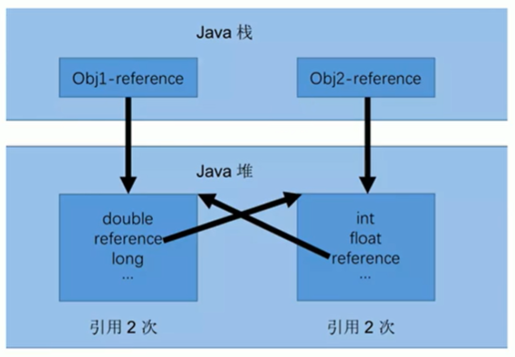
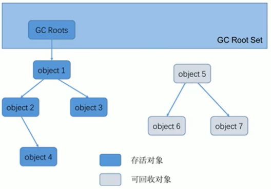
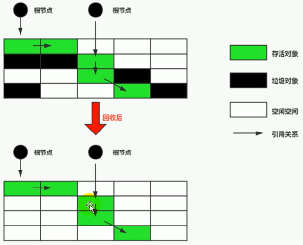
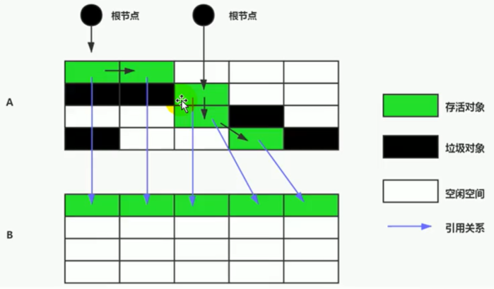
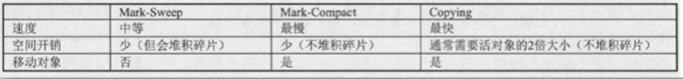

## 1、垃圾回收概述

- 关于垃圾收集有三个经典问题：
  - 哪些内存需要回收？
  - 什么时候回收？
  - 如何回收？
- 什么是垃圾（Garbage）呢？
  - 垃圾是指在运行程序中没有任何指针指向的对象，这个对象就是需要被回收的垃圾。
  - 基本数据类型不存在垃圾回收。
  - 如果不及时对内存中的垃圾进行清理，那么，这些垃圾对象所占的内存空间会一直保留到应用程序结束，被保留的空间无法被其他对象使用。甚至可能导致内存溢出。
- 为什么需要GC？
  - 对于高级语言来说，一个基本认知是如果不进行垃圾回收，内存迟早都会被消耗完。
  - 除了释放没用的对象，垃圾回收也可以清除内存里的记录碎片。碎片整理将所占用的堆内存移到堆的一端，以便JVM将整理出的内存分配给新的对象。
  - 随着应用程序所应付的业务越来越庞大、复杂，用户越来越多，没有GC就不能保证应用程序的正常进行。而经常造成STW的GC又跟不上实际的需求，所以才会不断地尝试对GC进行优化。
- Java垃圾回收机制：
  - 自动内存管理，无需开发人员手动参与内存的分配与回收，这样降低内存泄漏和内存溢出的风险。
  - GC主要针对的区域是堆区和方法区。
  - 频繁回收新生代，较少回收老年代，基本不动方法区。


## 2、垃圾回收算法

- 垃圾回收的阶段：
  - 标记阶段：判断对象是否存活，找出那些是垃圾。
  - 清除阶段：清除标记的垃圾。
- 垃圾标记阶段：
  - 在堆里存放着几乎所有的Java对象实例，在GC执行垃圾回收之前，首先需要区分出内存中哪些是存活对象，哪些是已经死亡的对象。只有被标记为己经死亡的对象，GC才会在执行垃圾回收时，释放掉其所占用的内存空间。
  - 当一个对象已经不再被任何的存活对象继续引用时，就可以宣判为已经死亡。
  - 判断对象存活一般有两种方式：引用计数算法和可达性分析算法。
- 引用计数算法：
  - 引用计数算法（Reference Counting）比较简单，对每个对象保存一个整型的引用计数器属性。用于记录对象被引用的情况。
  
  - 对于一个对象A，只要有任何一个对象引用了A，则A的引用计数器就加1；当引用失效时，引用计数器就减1。只要对象A的引用计数器的值为0，即表示对象A不可能再被使用，可进行回收。
  
  - 优点：
    - 实现简单，垃圾对象便于辨识；
    - 判定效率高，回收没有延迟性。
    
  - 缺点：
    - 它需要单独的字段存储计数器，这样的做法增加了存储空间的开销。
    - 每次赋值都需要更新计数器，伴随着加法和减法操作，这增加了时间开销。
    - 引用计数器有一个严重的问题，即无法处理循环引用的情况。这是一条致命缺陷，导致在Java的垃圾回收器中没有使用这类算法。
    
  - 引用计数算法中的循环引用：
  
    
- Python如何解决循环引用？
  - 手动解除：就是在合适的时机，解除引用关系。
  - 使用弱引用weakref，weakref是Python提供的标准库，旨在解决循环引用。
- 可达性分析算法（根搜索算法、追踪性垃圾收集）：
  - 相对于引用计数算法而言，可达性分析算法不仅同样具备实现简单和执行高效等特点，更重要的是该算法可以有效地解决在引用计数算法中循环引用的问题，防止内存泄漏的发生。
  - 所谓"GC Roots"根集合就是一组必须活跃的引用。
  - 基本思路：
    - 可达性分析算法是以根对象集合（GC Roots）为起始点，按照从上至下的方式搜索被根对象集合所连接的目标对象是否可达。
    - 使用可达性分析算法后，内存中的存活对象都会被根对象集合直接或间接连接着，搜索所走过的路径称为引用链（Reference Chain）。
    - 如果目标对象没有任何引用链相连，则是不可达的，就意味着该对象己经死亡，可以标记为垃圾对象。
    - 在可达性分析算法中，只有能够被根对象集合直接或者间接连接的对象才是存活对象。
  - 如果要使用可达性分析算法来判断内存是否可回收，那么分析工作必须在一个能保障一致性的快照中进行。这点不满足的话分析结果的准确性就无法保证。
  - 这点也是导致GC进行时必须"Stop The World"的一个重要原因。即使是号称（几乎）不会发生停顿的CMS收集器中，枚举根节点时也是必须要停顿的。
  
  
- 在Java语言中，GC Roots包括以下几类元素：
  - 虚拟机栈中引用的对象。比如：各个线程被调用的方法中使用到的参数、局部变量等。
  - 本地方法栈内JNI（通常说的本地方法）引用的对象。
  - 方法区中类静态属性引用的对象。比如：Java类的引用类型静态变量。
  - 方法区中常量引用的对象。比如：字符串常量池（String Table）里的引用。
  - 所有被同步锁synchronized持有的对象。
  - Java虚拟机内部的引用。基本数据类型对应的Class对象，一些常驻的异常对象（如：NullPointerException，OutofMemoryError），系统类加载器。
  - 反映java虚拟机内部情况的JMXBean，JVMTI中注册的回调、本地代码缓存等。
- 除了这些固定的GC Roots集合以外，根据用户所选用的垃圾收集器以及当前回收的内存区域不同，还可以有其他对象“临时性”地加入，共同构成完整GC Roots集合。比如：分代收集和局部回收（Partial GC）。
  - 如果只针对Java堆中的某一块区域进行垃圾回收（比如：典型的只针对新生代），必须考虑到内存区域是虚拟机自己的实现细节，不是孤立封闭的，这个区域的对象完全有可能被其他区域的对象所引用，这时候就需要一并将关联的区域对象也加入GC Roots集合中去考虑，才能保证可达性分析的准确性（考虑老年代中对于新生代中对象的引用）。
  - 由于Root采用栈方式存放变量和指针，所以如果一个指针，它保存了堆内存里面的对象，但是自己又不存放在堆内存里面，那它就是一个Root。


- 对象的finalization机制：

  - Java语言提供了对象终止（finalization）机制来允许开发人员提供对象被销毁之前的自定义处理逻辑。
  - 当垃圾回收器发现没有引用指向一个对象 即：垃圾回收此对象之前，总会先调用这个对象的`finalize()`方法。
  - `finalize()`方法允许在子类中被重写，用于在对象被回收时进行资源释放。通常在这个方法中进行一些资源释放和清理的工作，比如关闭文件、套接字和数据库连接等。
  - 永远不要主动调用某个对象的finalize（）方法，应该交给垃圾回收机制调用。理由包括下面三点：
    - 在`finalize()`时可能会导致对象复活。
    - `finalize()`方法的执行时间是没有保障的，它完全由GC线程决定，极端情况下，若不发生GC，则`finalize()`方法将没有执行机会。
    - 一个糟糕的`finalize()`会严重影响GC的性能。
  - 由于`finalize()`方法的存在，虚拟机中的对象一般处于三种可能的状态。

- 如果从所有的根节点都无法访问到某个对象，说明对象已经不再使用了。一般来说，此对象需要被回收。但事实上，也并非是“非死不可”的，这时候它们暂时处于“缓刑”阶段。一个无法触及的对象有可能在某一个条件下“复活”自己，如果这样，那么对它的回收就是不合理的，为此，定义虚拟机中的对象可能的三种状态。如下：

  - 可触及的：从根节点开始，可以到达这个对象。
  - 可复活的：对象的所有引用都被释放，但是对象有可能在`finalize()`中复活。
  - 不可触及的：对象的`finalize()`被调用，并且没有复活，那么就会进入不可触及状态。不可触及的对象不可能被复活，因为`finalize()`只会被调用一次。

- 以上3种状态中，是由于`finalize()`方法的存在，进行的区分。只有在对象不可触及时才可以被回收。

- 判定一个对象objA是否可回收，至少要经历两次标记过程：

  - 1，如果对象objA到GC Roots没有引用链，则进行第一次标记。
  - 2，进行筛选，判断此对象是否有必要执行`finalize()`法
    - 如果对象objA没有重写`finalize()`方法，或者`finalize()`方法已经被虚拟机调用过，则虚拟机视为“没有必要执行”，objA被判定为不可触及的。
    - 如果对象objA重写了`finalize()`方法，且还未执行过，那么objA会被插入到F-Queue队列中，由一个虚拟机自动创建的、低优先级的Finalizer线程触发其`finalize()`方法执行。
    - `finalize()`方法是对象逃脱死亡的最后机会，稍后GC会对F-Queue队列中的对象进行第二次标记。如果objA在`finalize()`方法中与引用链上的任何一个对象建立了联系，那么在第二次标记时，objA会被移出“即将回收”集合。之后，对象如果再次出现没有引用存在的情况。在这个情况下，finalize方法不会被再次调用，对象会直接变成不可触及的状态，也就是说，一个对象的finalize方法只会被调用一次。

- 如何在`finalize()`方法中复活：

  ```java
  public class CanReliveobj{
  	public static CanReliveobj obj;//类变量，属于GC Root
  	@Override 
  	protected void finalize() throws Throwable {
          super.finalize();
          system.out.println("调用当前类重写的finalize方法");
          obj=this；//当前待回收的对象在finalize方法中与引用链上的一个对象建立了联系
      }
  }
  ```

  - 因为finalize方法只能被调用一次，因此最多也只能复活一次。


- 垃圾清除阶段：

  - 当成功区分出内存中存活对象和死亡对象后，GC接下来的任务就是执行垃圾回收，释放掉无用对象所占用的内存空间，以便有足够的可用内存空间为新对象分配内存。
  - 目前在JVM中比较常见的三种垃圾收集算法是标记一清除算法（Mark-Sweep）、复制算法（Copying）、标记-压缩算法（Mark-Compact）。

- 标记清除算法：

  - 当堆中的有效内存空间（available memory）被耗尽的时候，就会停止整个程序（也被称为stop the world），然后进行两项工作，第一项则是标记，第二项则是清除。
  - 标记：垃圾回收器从引用根节点开始遍历，标记所有被引用的对象。一般是在对象的Header中记录为可达对象（也就是说标记的是非垃圾对象）。
  - 清除：垃圾回收器对堆内存从头到尾进行线性的遍历，如果发现某个对象在其Header中没有标记为可达对象，则将其回收。
  - 缺点：
    - 效率不算高。
    - 在进行GC的时候，需要停止整个应用程序，导致用户体验差。
    - 这种方式清理出来的空闲内存是不连续的，产生内存碎片。需要维护一个空闲列表。
  - 这里所谓的清除并不是真的置空，而是把需要清除的对象地址保存在空闲的地址列表里。下次有新对象需要加载时，判断垃圾的位置空间是否够，如果够，就存放。

  

- 复制算法：

  - 将活着的内存空间分为两块，每次只使用其中一块，在垃圾回收时将正在使用的内存中的存活对象复制到未被使用的内存块中，之后清除正在使用的内存块中的所有对象，交换两个内存的角色，最后完成垃圾回收。
  - 优点：
    - 没有标记和清除过程，实现简单，运行高效。
    - 复制过去以后保证空间的连续性，不会出现“碎片”问题。
  - 缺点：
    - 此算法的缺点也是很明显的，就是需要两倍的内存空间。
    - 对于G1这种分拆成为大量region（区域）的GC，复制而不是移动，意味着GC需要维护region之间对象引用关系，不管是内存占用或者时间开销也不小。
    - 如果系统中的垃圾对象相对于存活对象很少，复制算法就不会太理想。因为复制算法适用于复制的存活对象数量相对较少的情况，比如堆空间中新生代的S0和S1区的情况。

  

- 标记压缩算法：

  - 前两种算法在老年代垃圾回收中执行效率较低，对标记清除算法进行改进。
  - 标记：与标记清除算法中类似。
  - 压缩：将所有的存活对象压缩到内存的一端，按顺序排放。
  - 清除：清理边界外所有的空间。
  - 标记-压缩算法的最终效果等同于标记-清除算法执行完成后，再进行一次内存碎片整理，因此，也可以把它称为标记-清除-压缩（Mark-Sweep-Compact）算法。
  - 二者的本质差异在于标记-清除算法是一种非移动式的回收算法，标记-压缩是移动式的。是否移动回收后的存活对象是一项优缺点并存的风险决策。
  - 标记的存活对象将会被整理，按照内存地址依次排列，而未被标记的内存会被清理掉。如此一来，当我们需要给新对象分配内存时，JVM只需要持有一个内存的起始地址即可，这比维护一个空闲列表显然少了许多开销。
  - 优点：
    - 消除了标记-清除算法当中，内存区域分散的缺点，我们需要给新对象分配内存时，JVM只需要持有一个内存的起始地址即可。
    - 消除了复制算法当中，内存减半的高额代价。
  - 缺点：
    - 从效率上来说，标记-压缩算法要低于复制算法和标记-清除算法。
    - 移动对象的同时，如果对象被其他对象引用，则还需要调整引用的地址。
    - 移动过程中，需要全程暂停用户应用程序。即STW。

  

- 清除阶段三种算法对比：

  

- 没有最优的算法，只有在具体场景下最合适的算法。

- 分代收集算法：

  - 分代收集算法，是基于这样一个事实：不同的对象的生命周期是不一样的。因此，不同生命周期的对象可以采取不同的收集方式，以便提高回收效率。一般是把Java堆分为新生代和老年代，这样就可以根据各个年代的特点使用不同的，回收算法，以提高垃圾回收的效率。
- 在Java程序运行的过程中，会产生大量的对象，其中有些对象是与业务信息相关，比如Http请求中的Session对象、线程、Socket连接，这类对象跟业务直接挂钩，因此生命周期比较长。但是还有一些对象，主要是程序运行过程中生成的临时变量，这些对象生命周期会比较短，比如：string对象，由于其不变类的特性，系统会产生大量的这些对象，有些对象甚至只用一次即可回收。
  - 年轻代（Young Gen）：
  - 年轻代特点：区域相对老年代较小，对象生命周期短、存活率低，回收频繁。
    - 这种情况，复制算法的回收整理，速度是最快的，复制算法的效率只和当前存活对象大小有关，因此很适用于年轻代的回收，而复制算法内存利用率不高的问题，通过hotspot中的两个survivor的设计得到缓解。
  - 老年代（Tenured Gen）：
    - 老年代特点：区域较大，对象生命周期长、存活率高，回收不及年轻代频繁。
    - 这种情况存在大量存活率高的对象，复制算法明显变得不合适。一般是由标记-清除或者是标记-清除与标记-压缩的混合实现。
      - Mark阶段的开销与存活对象的数量成正比。
      - Sweep阶段的开销与所管理区域的大小成正相关。
      - Compact阶段的开销与存活对象的数量成正比。 
  
- 增量收集算法：

  - 上述现有的算法，在垃圾回收过程中，应用软件将处于一种stop the world的状态。在stop the world状态下，应用程序所有的线程都会挂起，暂停一切正常的工作，等待垃圾回收的完成。如果垃圾回收时间过长，应用程序会被挂起很久，将严重影响用户体验或者系统的稳定。为了解决这个问题，即对实时垃圾收集算法的研究直接导致了增量收集（Incremental collecting）算法的诞生。
  - 如果一次性将所有的垃圾进行处理，需要造成系统长时间的停顿，那么就可以让垃圾收集线程和应用程序线程交替执行。每次，垃圾收集线程只收集一小片区域的内存空间，接着切换到应用程序线程。依次反复，直到垃圾收集完成。
  - 总的来说，增量收集算法的基础仍是传统的标记-清除和复制算法。增量收集算法通过对线程间冲突的妥善处理，允许垃圾收集线程以分阶段的方式完成标记、清理或复制工作。
  - 缺点：使用这种方式，由于在垃圾回收过程中，间断性地还执行了应用程序代码，所以能减少系统的停顿时间。但是，因为线程切换和上下文转换的消耗，会使得垃圾回收的总体成本上升，造成系统吞吐量的下降。

- 分区算法：

  - 一般来说，在相同条件下，堆空间越大，一次GC时所需要的时间就越长，有关GC产生的停顿也越长。为了更好地控制GC产生的停顿时间，将一块大的内存区域分割成多个小块，根据目标的停顿时间，每次合理地回收若干个小区间，而不是整个堆空间，从而减少一次GC所产生的停顿。
  - 分代算法将按照对象的生命周期长短划分成两个部分，分区算法将整个堆空间划分成连续的不同小区间。
  - 每一个小区间都独立使用，独立回收。这种算法的好处是可以控制一次回收多少个小区间。


