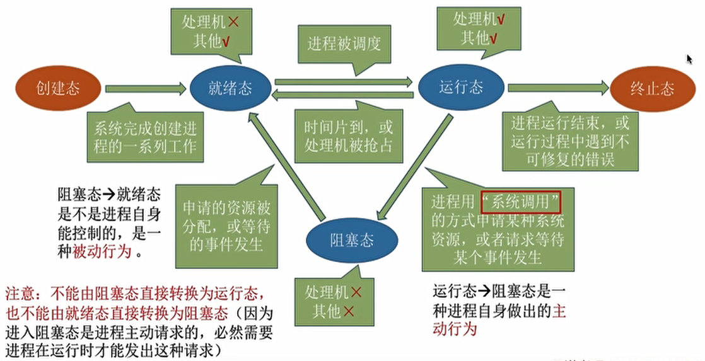
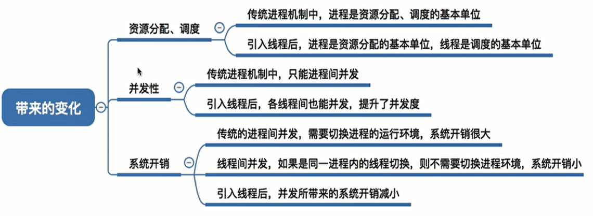
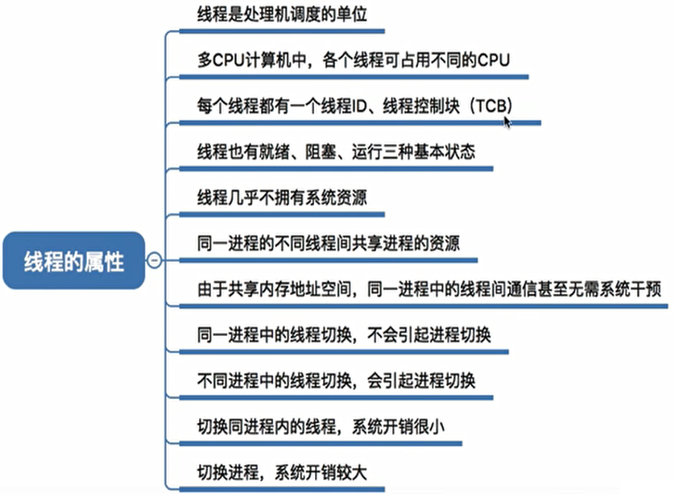

## 1、概述

- 操作系统的概念：
  - 负责管理协调硬件、软件等计算机资源的工作。
  - 为上层的应用程序、用户提供简单易用的服务。
  - 操作系统是系统软件。
- 操作系统的功能和目标：
  - 作为系统资源的管理者：
    - 功能：处理机（CPU）管理、存储器管理、文件管理、设备管理。
    - 目标：安全、高效。
  - 作为用户的计算机硬件之间的接口：
    - 功能：命令接口（分为联机和脱机）、程序接口（系统调用）、图形用户接口（GUI）。统称为用户接口。
    - 目标：方便用户使用。
  - 作为最接近硬件的层次：
    - 功能与目标：实现对硬件机器的拓展，提供方便用户的服务功能。
- 操作系统的四个特征：
  - 并发、共享、虚拟、异步。
  - 并发和共享为最基本的特征，并且互为存在条件。
  - 并发：指两个或多个事件在同一时间间隔内发生。事件在宏观上是同时发生的，微观上的交替发生的。
  - 共享：资源共享，指系统中的资源可供内存中多个并发执行的进程共同使用。分为互斥共享方式和同时共享方式。
  - 如果失去并发性，共享性失去存在的意义；失去共享性，并发性就不可能被实现。
  - 虚拟：指把一个物理上的实体变为若干个逻辑上的对应物。（虚拟存储器空分复用、虚拟处理器时分复用，没有并发性，虚拟性也没有实现的意义）
  - 异步：多道程序环境下，允许多个程序并发执行，但由于可分配的资源有限，进程的执行不是一贯到底的，而是走走停停，以不可预知的速度向前推进。（没有并发性，就不会导致异步性）
- 操作系统的发展和分类：
  - 手工操作阶段。
  - 批处理阶段（单道和多道）。
  - 分时操作系统。
  - 实时操作系统。
  - 网络操作系统。
  - 分布式操作系统。
  - 个人计算机操作系统。
- 操作系统运行机制：
  - 指令：处理器能识别、执行的最基本的命令。
  - 两种指令：
    - 特权指令：不允许用户程序使用。
    - 非特权指令。
  - 两种处理器状态：
    - 用户态（目态）：只能执行非特权指令。
    - 核心态（管态）：特权、非特权指定都可以执行。
  - 两种程序：
    - 内核程序：系统的管理者，运行在核心态。
    - 应用程序：运行在用户态。
  - 操作系统的内核：
    - 最接近硬件的层次被称为内核，是操作系统最基本最核心的部分。实现内核功能的就是内核程序。
    - 上面还有非内核功能。
    - 内核中包括时钟管理、中断处理、原语（最接近硬件的部分，具有原子性）。
    - 还包括进程管理、存储器管理、设备管理等。
- 操作系统的体系结构：
  - 大内核：将主要功能模块都作为内核，运行在核心态，性能高。
  - 微内核：只把最基本的功能保留在内核，需要在核心态和用户态之间切换，性能较低。
- 中断和异常：
  - 中断机制的诞生：
    - 本质：发生中断就意味着需要操作系统介入，开展管理工作。
    - 引入中断，可以实现多道程序并发执行。
  - 中断的概念和作用：
    - 中断发生，需要操作系统切换到核心态进行处理。
    - 中断发生后，当前进程暂停运行，由内核对中断进行处理。
    - 用户态切换为核心态是通过中断实现，而且中断是唯一途径。
    - 核心态切换为用户态是通过执行一个特权指令切换标志位实现。
  - 中断的分类：
    - 内中断（异常）：信号来源于CPU内部，与当前执行的指令有关。
      - 自愿中断：指令中断。
      - 强迫中断：硬件故障、软件中断。
      - 陷入、故障、终止。
    - 外中断（中断）：信号来源于CPU外部，与当前执行的指令无关。
      - 外设请求。
      - 人工干预。
  - 外中断的处理过程：
    - 执行完每个指令之后，CPU都要检查当前是否有外部中断。
    - 如果检测到外部中断，则需要保护被中断进程的CPU环境。
    - 根据中断信号类型转入相应的中断处理程序。
    - 恢复原进程的CPU环境并退出中断，原进程继续执行。
- 系统调用：
  - 概念：操作系统供应用程序使用的接口，是可供调用的特殊函数。
  - 应用系统想要使用共享资源，只能通过系统调用的方式向操作系统提出服务请求。这样可以保证系统的稳定性和安全性。
  - 功能分类：设备管理、文件管理、进程控制、进程通信、内存管理。
  - 系统调用的相关处理需要在核心态下使用。
  - 与库函数的区别：应用程序调用库函数，库函数请求系统调用。当然库函数不一定需要调用系统调用。
  - 背后的过程：
    - 传递系统调用参数 -> 执行陷入指令（用户态） -> 执行系统调用相应服务程序（核心态） -> 返回用户程序。
    - 陷入指令执行后引发一个内中断，CPU进入核心态。陷入指令是唯一一个只能在用户态执行，不能在核心态执行的指令。
    - 发出系统调用是在用户态，处理系统调用是在核心态。

## 2、进程与线程基础

- 进程实体：由内存中的程序段、数据段和进程控制块PCB组成。

- PCB是进程存在的唯一标志。创建进程就是创建PCB。

- 进程是进程实体的运行过程，是系统进行资源分配和调度的一个独立单位。

- 进程实体是静态的，进程是动态的。

- 进程的组成：

  - 程序段：程序代码存放。
  - 数据段：程序运行时使用、产生的运算数据。
  - PCB：操作系统对进程进行管理的各种信息。

- PCB包括：进程描述信息、进程控制和管理信息、资源分配清单和处理机相关信息。

- 进程的组织方式：

  - 链接方式和索引方式。
  - 根据进程状态（运行、就绪、阻塞）将PCB分为多个队列/索引表，操作系统持有指向各个队列/索引表的指针。

- 进程的特征：动态性、并发性、独立性、异步性、结构性。

- 进程的状态：

  - 三种基本状态：
    - 运行态：占有CPU，并在CPU上运行。
    - 就绪态：具备运行条件但没有空闲CPU，暂时不能运行。（具备除了CPU之外的所有条件）
    - 阻塞态：因等待某一事件而暂时不能运行。
  - 另外两种状态：
    - 创建态：进程正在被创建，操作系统为进程分配资源、初始化PCB。
    - 终止态：进程正在从系统中撤销，操作系统回收资源、撤销PCB。

- 进程状态的转换：

  - 就绪 -> 运行：进程被调度。
  - 运行 -> 就绪：时间片到或CPU被其他进程抢占。
  - 运行 -> 阻塞：等待系统资源分配或等待某事件发生（主动行为）。
  - 阻塞 -> 就绪：资源分配到位，等待的事件发生（被动行为）。

  

- 进程控制：
  - 概念：对系统中的所有进程实施有效管理，实现进程状态的转换。
  - 用原语实现进程控制，特点是执行期间不允许中断，即原子操作。通过关中断和开中断指令（特权指令）实现。
  - 进程控制相关的原语：
    - 更新PCB中的信息，如修改进程状态标准、将运行环境保存到PCB、从PCB中恢复环境。
    - 将PCB插入合适的队列。
    - 分配/回收资源。
    - 进程的创建和撤销原语、阻塞和唤醒原语、切换原语。
- 进程通信：
  - 进程通信就是进程之间的信息交换。
  - 各进程拥有的内存地址空间相互独立，一个进程不能直接访问另一个进程的地址空间。
  - 共享存储：
    - 两个进程可以访问同一块共享空间，进行信息交换。
    - 两个进程对共享空间的访问必须是互斥的。
    - 分为基于数据结构/存储区的共享。
  - 管道通信：
    - 用一个共享文件连接读写进程，即在内存中开辟一个大小固定的缓冲区。
    - 一个管道只能实现半双工通信，同一时间只能实现单向传输。而且各个进程要互斥的访问管道。
    - 管道写满时，写进程的写操作将被阻塞；管道取空时，写进程的写操作将被阻塞。
    - 管道没写满就不允许读，没读空就不允许写。
    - 数据被读出就会被抛弃，读进程最多只能有一个。
  - 消息传递：
    - 使用发送消息/接收消息的原语进行数据交换。
    - 分为直接/间接通信方式。

- 线程：

  - 为什么引入线程：有的进程需要同时做很多事，而传统的进程只能串行的执行一系列程序。为此，引入线程来增加并发度。

  - 传统的进程是程序执行流的最小单位，引入线程后，线程成为了程序执行流的最小单位。

  - 线程是一个基本的CPU执行单元。引入线程后，进程只作为除CPU之外的系统资源分配单元。

  - 引入线程后带来的变化：

    

  - 线程的属性：

    

  - 线程的实现方式：

    - 用户级线程：由应用程序通过线程库实现。线程管理工作由应用程序管理，无需操作系统干预。在用户看来是多个线程，在操作系统内核看来，意识不到线程的存在。
    - 内核级线程：线程管理工作由操作系统内核完成。线程切换必须在核心态下完成。
    - 内核级线程才是处理机分配的单位。

- 多线程模型：

  - 几个用户级线程映射到几个内核级线程。
  - 多对一模型：
    - 多个用户级线程映射到一个内核级线程。
    - 不需要切换到核心态，系统开销小、效率高。
    - 当一个用户级线程阻塞后，整个进程都会被阻塞，并发度不高。
  - 一对一模型：
    - 一个用户级线程映射到一个内核级线程。
    - 一个线程被阻塞，其他线程还可以执行，并发能力强。
    - 一个用户进程会占用多个内核级线程，线程切换需要核心态，系统开销大。
  - 多对多模型：
    - n个用户级线程映射到m个内核级线程（n>=m）。
    - 克服了多对一并发度不高的缺点和一对一模型系统开销大的缺点。

