## 1、信号量

- 信号量机制：

  - 概念：其实就是一个变量，可以用一个信号量来表示系统中某种资源的数量、

  - 用户进程通过使用操作系统提供的一对原语来对信号量进行操作，从而方便的实现了进程互斥。

  - 这里的一对原语是指wait(S)和signal(S)，也简写为P(S)和V(S)，即申请和释放资源。P、V操作必须成对出现。

  - 整数型信号量：

    - 用一个整数作为信号量，数值表示某种资源数。
    - 对信号量的操作只有三种：初始化、P操作、V操作。
    - 不满足让权等待原则。

  - 记录型信号量：

    - S.value表示某种资源数，S.L指向等待该资源的队列。
    - P操作中，先S.value++，之后可能执行block阻塞原语。
    - V操作中，先S.value--，之后可能执行wakeup唤醒原语。
    - 可以用记录型信号量实现系统资源的申请和释放，申请S.value--，然后如果S.value<0说明资源分配完了，就阻塞；释放S.value++，然后如果S.value<=0说明还有进程在等待队列中等待，就唤醒。
    - 记录型信号量可以实现进程互斥、进程同步。

    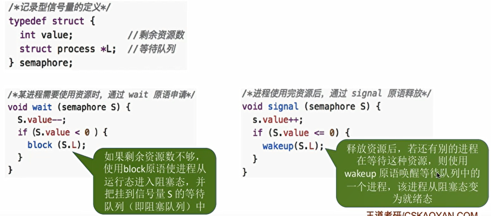

  - 实现进程互斥：

    - 划定临界区。
    - 设置互斥信号量mytex，初值为1。
    - 在临界区之前执行P(mutex)，在临界区之后执行V(mutex)。

  - 实现进程同步：

    - 分析那些地方是必须保证一前一后执行的两个操作。
    - 设置同步信号量S，初始值为0。
    - 在“前操作”之后执行V(S)。
    - 在“后操作”之前执行P(S)。

    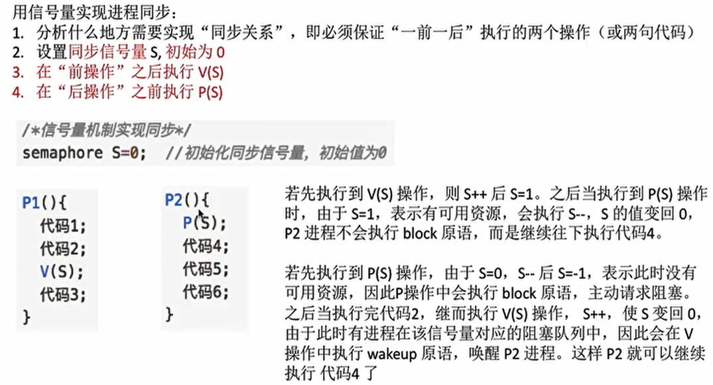

  - 实现前驱关系：

    - 每一对前驱关系都是一个进程同步问题。
    - 为每一对前驱关系设置一个同步变量，初始值为0。
    - 在“前操作”之后执行V操作。
    - 在“后操作”之前执行P操作。

    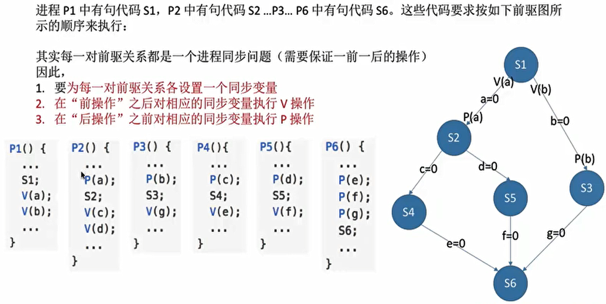

- 生产者消费者问题：

  - 生产者每次生产一个产品放入缓冲区，消费者每次从缓冲区取出一个产品使用。缓冲区满生产者必须等待（同步关系1），缓冲区空消费者必须等待（同步关系2）。

  - 缓冲区是临界资源，必须被互斥访问（互斥关系）。

  - 问题中的P、V操作：

    - 生产者每次P一个缓冲区，V一个产品。
    - 消费者每次V一个缓冲区，P一个产品。
    - 生产者和消费者互斥访问缓冲区。

  - 问题实现：

    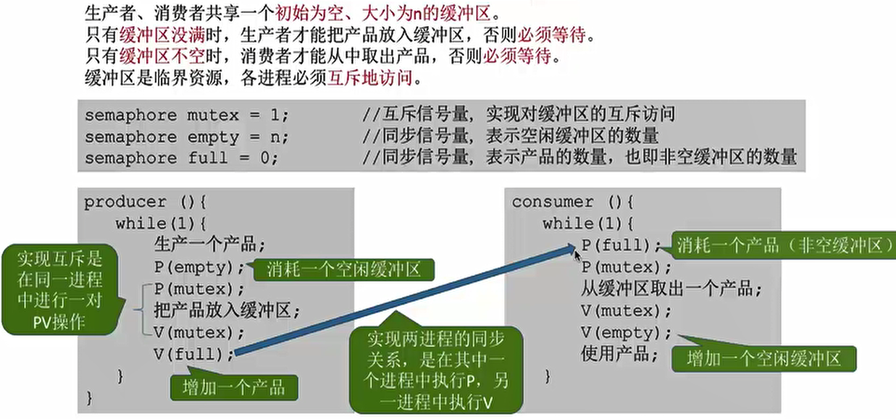

  - 相邻的P操作的顺序不能改变，否则会出现死锁。实现互斥的P操作一定要实现同步的P操作之后。相邻的V操作的顺序可以改变。

- 多生产者多消费者问题：

  - 问题描述：桌子上有一只盘子，每次只能向其中放入一个水果。爸爸专向盘子中放苹果，妈妈专向盘子中放橘子，儿子专等着吃盘子中的橘子，女儿专等着吃盘子中的苹果。

    只有盘子空时，爸爸或妈妈才可向盘子中放一个水果。仅当盘子中有自己需要的水果时，儿子或女儿可以从盘子中取出水果。

  - 多是指多种类，即不同的生产者生产不同的产品，不同的消费者消费不同的产品，但是共享缓冲区。

  - 问题分析：

    - 互斥关系：（mutex=1）：对缓冲区（盘子）的访问要互斥地进行。

    - 同步关系：
      1，父亲将苹果放入盘子后，女儿才能取苹果；

      2，母亲将橘子放入盘子后，儿子才能取橘子；

      3，只有盘子为空时，父亲或母亲才能放入水果。

  - 问题实现：

    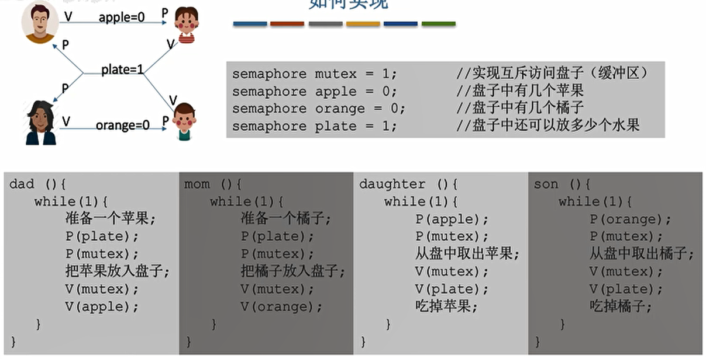

  - 当缓冲区只有1时，没有互斥信号量也可以。

- 吸烟者问题：

  - 问题描述：假设一个系统有三个抽烟者进程和一个供应者进程。每个抽烟者不停地卷烟并抽掉它，但是要卷起并抽掉一支烟，抽烟者需要有三种材料：烟草、纸和胶水。三个抽烟者中，第一个拥有烟草、第二个拥有纸、第三个拥有胶水。

    供应者进程无限地提供三种材料，供应者每次将两种材料放桌子上，拥有剩下那种材料的抽烟者卷一根烟并抽掉它，并给供应者进程一个信号告诉完成了，供应者就会放另外两种材料再桌上，这个过程一直重复（让三个抽烟者轮流地抽烟）。

  - 就是一个可以生产多种产品的单生产者的问题。

  - 问题分析：

    - 互斥关系：桌子是大小为1的缓存区，互斥访问。

    - 同步关系：

      1，桌上有组合一→第一个抽烟者取走东西；
      2，桌上有组合二→第二个抽烟者取走东西；
      3，桌上有组合三→第三个抽烟者取走东西；
      4，发出完成信号→供应者将下一个组合放到桌上。

  - 问题实现：

    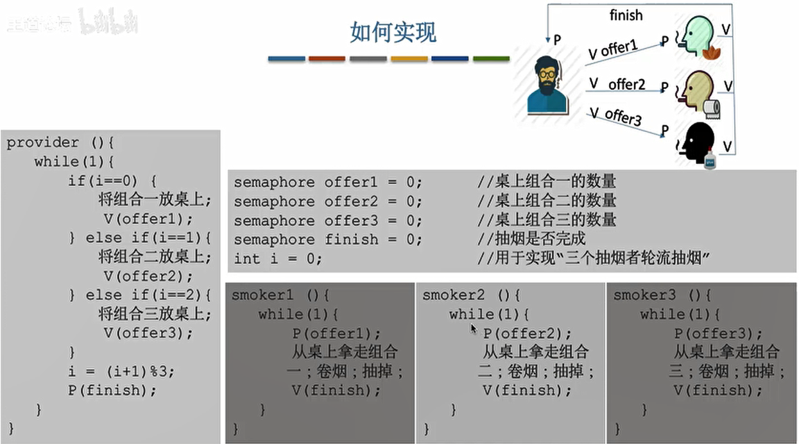

- 读者写者问题：

  - 问题描述：有读者和写者两组并发进程，共享一个文件，当两个或两个以上的读进程同时访问共享数据时不会产生副作用，但若某个写进程和其他进程（读进程或写进程）同时访问共享数据时则可能导致数据不一致的错误。因此要求：

    1，允许多个读者可以同时对文件执行读操作；

    2，只允许一个写者往文件中写信息；

    3，任一写者在完成写操作之前不允许其他读者或写者工作；

    4，写者执行写操作前，应让已有的读者和写者全部退出。

  - 问题分析：

    - 互斥关系：写进程-写进程、写进程-读进程。读进程与读进程不存在互斥问题。

  - 问题实现：

    - 实现1：

      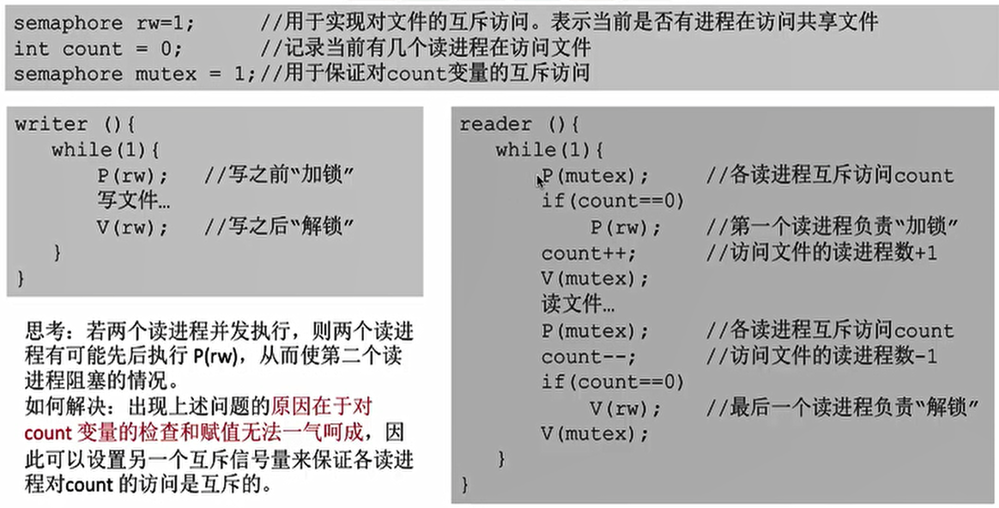

      - 问题：只要读进程还在读，写进程就要一直阻塞，可能会饿死。

    - 实现2：

      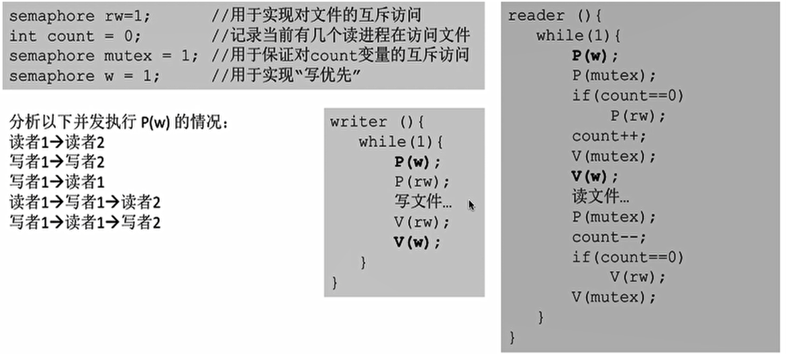

  - 核心思想：设置了一个count计数器来判断当前进入的进程是否是第第一个/最后一个读进程。

  - 如果需要一气呵成的操作，就应该想到使用互斥信号量。

- 哲学家进餐问题：

  - 问题描述：一张圆桌上坐着5名哲学家，每两个哲学家之间的桌上摆一根筷子，桌子的中间是一碗米饭。哲学家们倾注毕生的精力用于思考和进餐，哲学家在思考时，并不影响他人。只有当哲学家饥饿时，才试图拿起左、右两根筷子（一根一根地拿起）。

    如果筷子己在他人手上，则需等待。饥饿的哲学家只有同时拿起两根筷子才可以开始进餐，当进餐完毕后，放下筷子继续思考。

  - 问题分析：

    - 互斥关系：5位哲学家与左右邻居对其中间筷子的访问是互斥关系。
    - 这个问题中只有互斥关系，但与之前遇到的问题不同的事，每个哲学家进程需要同时持有两个临界资源才能开始吃饭。如何避免临界资源分配不当造成的死锁现象，是哲学家问题的精髓。

  - 如何防止死锁的发生：

    - 方法1：可以对哲学家进程施加一些限制条件，比如最多允许四个哲学家同时进餐。这样可以保证至少有一个哲学家是可以拿到左右两只筷子的。
    - 方法2：要求奇数号哲学家先拿左边的筷子，然后再拿右边的筷子，而偶数号哲学家刚好相反。用这种方法可以保证如果相邻的两个奇偶号哲学家都想吃饭，那么只会有其中一个可以拿起第一只筷子，另一个会直接阻塞。这就避免了占有一支后再等待另一只的情况。
    - 方法3：仅当一个哲学家左右两支筷子都可用时才允许他抓起筷子。更准确的说法应该是：各哲学家拿筷子这件事必须互斥的执行。这就保证了即使一个哲学家在拿筷子拿到一半时被阻塞，也不会有别的哲学家会继续尝试拿筷子。这样的话，当前正在吃饭的哲学家放下筷子后，被阻塞的哲学家就可以获得等待的筷子了。

  - 方法3的问题实现：

    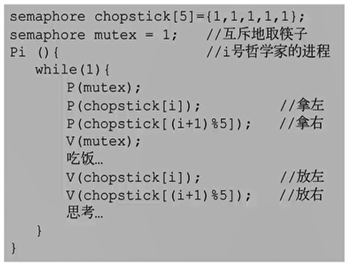

- 管程：

  - 为什么引入管程：复杂PV操作，程序易出错。管程是一种高级的互斥同步操作。

  - 管程的组成（其实就是一种封装，类比Java的类）：

    1，局部于管程的共享数据结构说明（成员变量）；
    2，对该数据结构进行操作的一组过程（成员方法操作成员变量）；
    3，对局部于管程的共享数据设置初始值的语句（构造函数初始化成员变量）；
    4，管程有一个名字（类名）。

  - 管程的基本特征：

    1，局部于管程的数据只能被局部于管程的过程所访问（成员变量是private）；
    2，一个进程只有通过调用管程内的过程才能进入管程访问共享数据（成员方法是public）；
    3，每次仅允许一个进程在管程内执行某个内部过程（互斥访问）。

  - 管程解决生产者消费问题：

    - 互斥特性的编译器负责实现的。
    - 可在管程中设置条件变量及等待/唤醒操作以解决同步问题。可以让一个进程或线程在条件变量上等待（此时，该进程应先释放管程的使用权，也就是让出“入口"”）；可以通过唤醒操作将等待在条件变量上的进程或线程唤醒。

    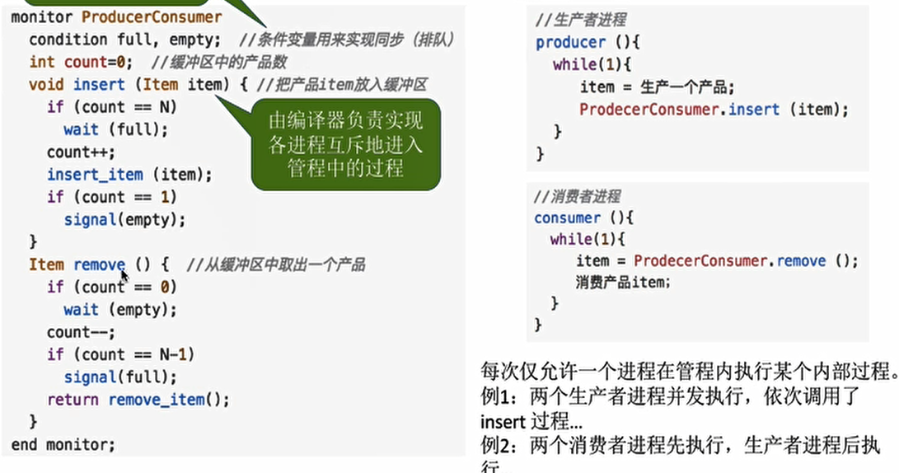

## 2、死锁

- 什么是死锁：在并发环境下，各进程因竞争资源而造成的一种互相等待对方手里的资源，导致各进程都阻塞，无法向前推进的现象。

- 死锁、饥饿、死循环的区别：

  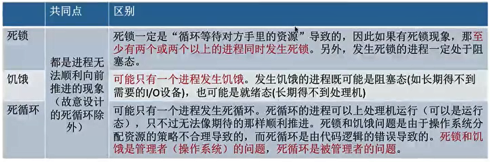

- 死锁产生的必要条件：

  - 互斥条件：只有对必须互斥使用的资源的争抢才会导致死锁。
  - 不剥夺条件：进程所获得的资源在未使用完之前，不能由其他进程强行夺走，只能主动释放。
  - 请求和保持条件：进程已经保持了至少一个资源，但又提出了新的资源请求，而该资源又被其他进程占有，此时请求进程被阻塞，但又对自己已有的资源保持不放。
  - 循环等待条件：存在一种进程资源的循环等待链，链中的每一个进程已获得的资源同时被下一个进程所请求（循环等待不一定死锁）。

- 什么时候对发生死锁：

  - 对系统资源的竞争。
  - 进程推进顺序非法。
  - 信号量使用不当。
  - 总之，就是对不可剥夺的资源的不合理分配。

- 死锁的处理策略：

  - 预防死锁，破环四个必要条件。
  - 避免死锁，用某种方法防止系统进入不安全状态（银行家算法）。
  - 死锁的检测和解除，允许死锁的发生，不过操作系统会负责检测出死锁的发生，然后采取某种措施解除死锁。

- 预防死锁：

  - 破坏互斥条件：把只能互斥使用的资源改造为允许共享使用，比如SPOOLing技术。
  - 破坏不剥夺条件：
    - 方案1：当某个进程请求新的资源得不到满足时，它必须立即释放保持的所有资源，待以后需要时再重新申请。
    - 方案2：当某个进程需要的资源被其他进程所占有的时候，可以由操作系统协助，将想要的资源强行剥夺。
  - 破坏请求和保持条件：可以采用静态分配方法，即进程在运行前一次申请完它所需要的全部资源，在它的资源未满足前，不让它投入运行。一旦投入运行后，这些资源就一直归它所有，该进程就不会再请求别的任何资源了。
  - 破坏循环等待条件：可采用顺序资源分配法。首先给系统中的资源编号，规定每个进程必须按编号递增的顺序请求资源，同类资源（即编号相同的资源）一次申请完。

- 避免死锁：

  - 安全序列：指如果系统按照这种序列分配资源，则每个进程都能顺利完成。只要能找出一个安全序列，系统就是安全状态。当然，安全序列可能有多个。

  - 如果系统处于安全状态，就一定不会发生死锁。如果系统进入不安全状态，就可能发生死锁。

  - “银行家算法”的核心思想：在进程提出资源申请时，先预判此次分配是否会导致系统进入不安全状态。如果会进入不安全状态，就暂时不答应这次请求，让该进程先阻塞等待。

  - 银行家算法的步骤：

    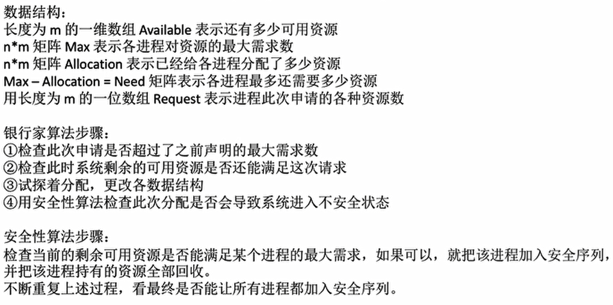

- 死锁的检测：

  - 用某种数据结构来保存资源的请求和分配信息；
  - 提供一种算法，利用上述信息来检测系统是否已进入死锁状态。
    - 最终能消除所有边，就称这个图是可完全简化的。此时一定没有发生死锁。（相当于能找到一个安全序列）
    - 如果最终不能消除所有边，那么此时就是发生了死锁。最终还连着边的那些进程就是处于死锁状态的进程。

  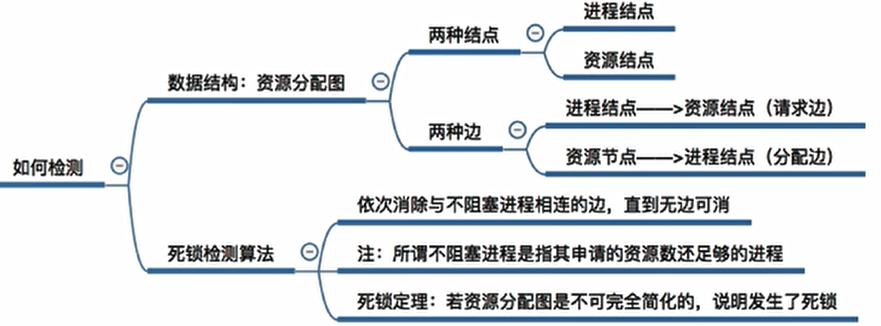

- 死锁的解除：

  - 资源剥夺法。挂起（暂时放到外存上）某些死锁进程，并抢占它的资源，将这些资源分配给其他的死锁进程。
  - 撤销进程法（或称终止进程法）。强制撤销部分、甚至全部死锁进程，并剥夺这些进程的资源。
  - 进程回退法。让一个或多个死锁进程回退到足以避免死锁的地步。这就要求系统要记录进程的历史信息，设置还原点。
  
    
