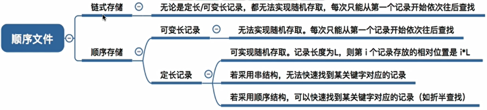
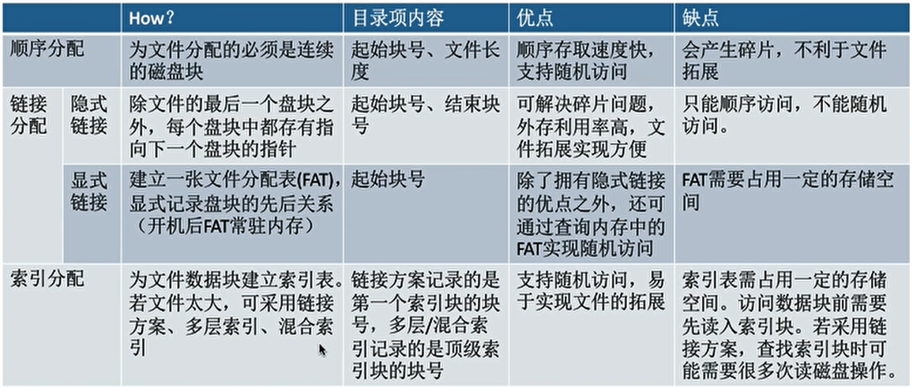
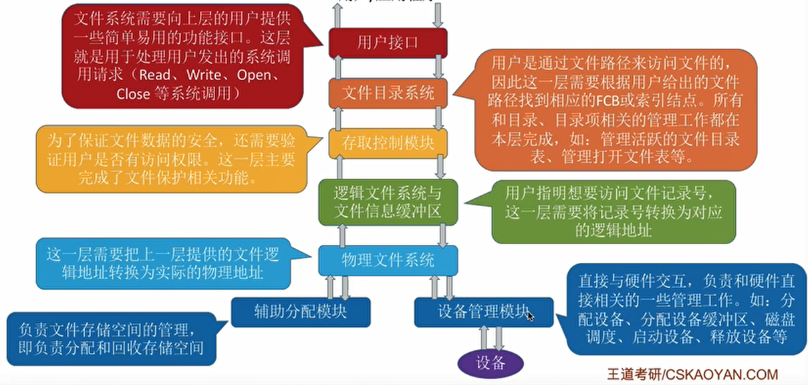

## 1、文件

- 文件管理：

  - 文件：一组有意义的信息集合。
  - 文件的属性：
    - 文件名。
    - 标识符。
    - 类型。
    - 位置。
    - 大小。
    - 创建时间、上次修改时间、保护信息。
  - 文件内部的数据组织：
    - 无结构文件，流式文件。
    - 有结构文件，记录式文件。由记录组成，记录由数据项组成。
  - 文件之间的组织：
    - 通过目录实现。
    - 目录也是一种有结构文件。
  - 操作系统应该向上提供什么功能：
    - 创建文件，create系统调用。
    - 读文件，read系统调用。
    - 写文件，write系统调用。
    - 删除文件，delete系统调用。
    - 打开文件，open系统调用。
    - 关闭文件，close系统调用。
  - 文件应如何存放在外存：
    - 外存也和内存一样由一个个存储单元组成。
    - 类似于内存分为一个个“内存块”，外存会分为一个个“块/磁盘块/物理块”。每个磁盘块的大小是相等的，每块一般包含2的整数幂个地址。
    - 文件的逻辑地址也可以分为（逻辑块号，块内地址），操作系统同样需要将逻辑地址转换为外存的物理地址（物理块号，块内地址）的形式。块内地址的位数取决于磁盘块的大小。
    - 操作系统以“块”为单位为文件分配存储空间，因此即使一个文件大小只有10B，但它依然需要占用1KB的磁盘块。外存中的数据读入内存时同样以块为单位。
  - 其他文件管理功能：文件共享、文件保护。

- 文件的逻辑结构：

  - 无结构文件。

  - 有结构文件：

    - 由一组相似的记录组成，又称“记录式文件”。每条记录又若干个数据项组成。一般来说，每条记录有一个数据项可作为关键字（作为识别不同记录的id）。

    - 根据各条记录的长度（占用的存储空间）是否相等，又可分为定长记录和可变长记录两种。

    - 顺序文件：

      - 文件中的记录一个接一个地顺序排列（逻辑上），记录可以是定长的或可变长的。各个记录在物理上可以顺序存储或链式存储。

      - 串结构：顺序结构记录之间的顺序与关键字无关。

      - 顺序结构：记录之间的顺序按关键字顺序排列。

      - 能否实现随机存取（找到第i个记录的地址）和找到某个关键词对应的记录：

        

    - 索引文件：

      - 建立一张索引表以加快文件检索速度，每个记录对应一个表项。各记录不用保持顺序，方便增加/删除记录。索引表中包括了记录的长度和指针。
      - 索引表本身就是定长记录的顺序文件，一个索引表项就是一条定长记录，因此索引文件可支持随机存取。
      - 若索引表按关键字顺序排列，则可支持快速检索。
      - 解决了顺序文件不方便增删记录的问题，同时让不定长记录的文件实现了随机存取。但索引表可能占用很多空间。

    - 索引顺序文件：

      - 索引顺序文件是索引文件和顺序文件思想的结合。索引顺序文件中，同样会为文件建立一张索引表，但不同的是：并不是每个记录对应一个索引表项，而是一组记录对应一个索引表项。
      - 检索记录时先顺序查索引表，找到分组，再顺序查找。
      - 分组当记录过多时，可建立多级索引表。

- 文件目录：
  - 文件控制块：
    - 文件控制块FCB就是目录文件中的一条记录，其中包含了文件名、物理存放位置等属性。
    - FCB实现了文件名和文件之间的映射。使用户（用户程序）可以实现“按名存取”。
    - FCB的有序集合称为文件目录。
  - 需要对目录进行那些操作：
    - 搜索：当用户要使用一个文件时，系统要根据文件名搜索目录，找到该文件对应的目录项。
    - 创建文件：创建一个新文件时，需要在其所属的目录中增加一个目录项。
    - 删除文件：当删除一个文件时，需要在目录中删除相应的目录项。
    - 显示目录：用户可以请求显示目录的内容，如显示该目录中的所有文件及相应属性。
    - 修改目录：某些文件属性保存在目录中，因此这些属性变化时需要修改相应的目录项。
  - 目录结构：
    - 单级目录结构：
      - 实现了“按名存取”，但是不允许重名。
      - 整个系统中只有一张目录表。
    - 两级目录结构：
      - 分为主文件目录和用户文件目录。
      - 允许不同用户的文件重名。
      - 不能对文件进行分类。
    - 多级目录结构（树形目录结构）：
      - 允许不同目录下的文件重名。
      - 用户（或用户进程）要访问某个文件时要用文件路径名标识文件。
      - 相比于绝对路径，使用当前目录下的相对路径可以减少磁盘I/O操作。
    - 无环图目录结构：
      - 解决树形目录结构不方便共享的缺点。
      - 可以用不同的文件名指向同一个文件，甚至可以指向同一个目录（共享同一目录下的所有内容）。
      - 用共享计数器来实现共享文件的删除。
  - 索引节点（对FCB的改进）：
    - 其实在查找各级目录的过程中只需要用到“文件名”这个信息，只有文件名匹配时，才需要读出文件的其他信息。
    - 将文件名之外的属性都放到索引节点指针指向的位置。
    - 通过减少磁盘I/O操作，提高了查找效率。
  
- 文件的物理结构（文件分配方式）：
  - 文件块：
    - 在外存管理中，为了方便对文件数据的管理，文件的逻辑地址空间也被分为了一个一个的文件“块”。
    - 于是文件的逻辑地址也可以表示为（逻辑块号，块内地址）的形式。
    - 操作系统为文件分配存储空间都是以块为单位的。
    - 用户通过逻辑地址来操作自己的文件，操作系统要负责实现从逻辑地址到物理地址的映射。
  - 连续分配：
    - 要求每个文件在磁盘上占有一组连续的块。
    - PCB中记录存放的起始块号和长度。
    - （逻辑块号，块内地址）到（物理块号，块内地址）。只需转换块号就行，块内地址保持不变。
    - 用户给出要访问的逻辑块号，操作系统找到该文件对应的目录项（FCB）中找到文件存储的起始块号，
      物理块号=起始块号+逻辑块号。
    - 优点：
      - 可以直接算出逻辑块号对应的物理块号，因此连续分配支持顺序访问和直接访问（即随机访问）。
      - 连续分配的文件在顺序读/写时速度最快，因为移动磁头的距离最短。
    - 缺点：
      - 对文件的拓展很不方便。
      - 存储空间利用率低，会产生难以利用的磁盘碎片。
  - 链接分配：
    - 采用离散分配的方式，分为隐式链接和显式链接。
    - 隐式链接：
      - PCB中记录了文件存放的起始块号和结束块号。
      - 除了文件的最后一个磁盘块之外，每个磁盘块中都会保存指向下一个盘块的指针，这些指针对用户是透明的。
      - 读入i号逻辑块，需要访问之前的0~i-1号逻辑快。
      - 缺点：
        - 只支持顺序访问，不支持随机访问，查找效率低。
        - 另外，指向下一个盘块的指针也需要耗费少量的存储空间。
      - 优点：
        - 方便文件拓展，不会有碎片问题。
    - 显式分配：
      - PCB中记录了文件存放的起始块号。
      - 把用于链接文件各物理块的指针显式地存放在一张表中，即文件分配表FAT。该表中记录某块物理块号的下一块是几号。
      - 从目录项中找到起始块号，查询内存中的文件分配表FAT，往后找到i号逻辑块对应的物理块号。
      - FAT常驻内存，逻辑块号转换成物理块号的过程不需要读磁盘操作。
      - 优点：
        - 支持顺序访问，也支持随机访问。
        - 不需要访问磁盘，因此相比于隐式链接来说，访问速度快很多。
        - 不会产生外部碎片，方便拓展。
      - 缺点：
        - FAT需要占用一定空间。
  - 索引分配：
    - PCB中记录了文件索引块的块号。
    - 允许文件离散地分配在各个磁盘块中，系统会为每个文件建立一张索引表，索引表中记录了文件的各个逻辑块对应的物理块。
    - 索引表存放的磁盘块称为索引块。文件数据存放的磁盘块称为数据块。
    - 用户给出要访问的逻辑块号1，操作系统找到该文件对应的FCB。从目录项中可知索引表存放位置，将索引表从外存读入内存，并查找索引表即可知i号逻辑块在外存中的存放位置。
    - 优点：
      - 支持随机访问，拓展也容易实现。
    - 缺点：
      - 索引表需要占据空间。
    - 如果索引表太大，一个索引块存不下：
      - 链接方案：
        - 将多个索引块链接起来存放。
        - 想找到第i个索引块，必须先读入前0~i-1个索引块。
      - 多层索引：
        - 建立多层索引（原理类似于多级页表）。使第一层索引块指向第二层的素引块。还可根据文件大小的要求再建立第三层、第四层索引块。
        - 若采用多层索引，则各层索引表大小不能超过一个磁盘块。
      - 混合索引：
        - 多种索引分配方式的结合。例如，一个文件的顶级索引表中，既包含直接地址索引（直接指向数据块），又包含一级间接索引（指向单层索引表）、还包含两级间接索引（指向两层索引表）。
        - 对于小文件，只需较少的读磁盘次数就可以访问目标数据块。（一般计算机中小文件更多）
  
  

- 文件存储空间管理（对空闲空间的管理）：
  - 存储空间的划分和初始化：
    - 划分：将物理磁盘划分为一个个的文件卷（逻辑卷、逻辑盘）。
    - 初始化：将各个文件卷划分为目录区、文件区。
    - 目录区主要存放文件目录信息（FCB）、用于磁盘存储空间管理的信息。
    - 文件区用于存放文件数据。
  - 存储空间管理方法：
    - 空闲表法：
      - 记录每一个空闲盘的起始块号和块数。
      - 适用于连续分配方式。
      - 可采用首次适应、最佳适应、最坏适应等算法来决定要为文件分配哪个区间。
    - 空闲链表法：
      - 分为空闲盘块链和空闲盘区链。
      -  操作系统保存着链头、链尾指针。
      - 空闲盘块链如何分配：若某文件申请K个盘块，则从链头开始依次摘下K个盘块分配，并修改空闲链的链头指针。
      - 空闲盘块链如何回收：回收的盘块依次挂到链尾，并修改空闲链的链尾指针。
      - 空闲盘块链适用于离散分配的物理结构。为文件分配多个盘块时可能要重复多次操作
      - 空闲盘区链如何分配：若某文件申请K个盘块，则可以采用首次适应、最佳适应等算法，从链头开始检索，按照算法规则找到一个大小符合要求的空闲盘区分配给文件。若没有合适的连续空闲块，也可以将不同盘区的盘块同时分配给一个文件，注意分配后可能要修改相应的链指针、盘区大小等数据
      - 空闲盘区链如何回收：若回收区和某个空闲盘区相邻，则需要将回收区合并到空闲盘区中。若回收区没有和任何空闲区相邻，将回收区作为单独的一个空闲盘区挂到链尾。
      - 空闲盘区链离散分配、连续分配都适用。为一个文件分配多个盘块时效率更高。
    -  位示图法：
      - 每个二进制位对应一个盘块。，"0"代表盘块空闲，"1"代表盘块已分配。位示图一般用连续的“字”来表示。
      - 如何分配：若文件需要k个块，1、顺序扫描位示图，找到K个相邻或不相邻的"0"：2、根据字号、位号算出对应的盘块号，将相应盘块分配给文件；3、将相应位设置为"1"。
      - 如何回收：1、根据回收的盘块号计算出对应的字号、位号；2、将相应二进制位设为"0"。
      -  位示图法离散分配、连续分配都适用。
    - 成组链接法：
      - 空闲表法、空闲链表法不适用于大型文件系统，因为空闲表或空闲链表可能过大。需要一种适合大型文件系统的方法。
      - 文件卷的目录区中专门用一个磁盘块作为“超级块”，当系统启动时需要将超级块读入内存。并且要保证内存与外存中的“超级块”数据一致。
      - 超级块中第一个盘块记录下一组空闲盘块的数量，第二个盘块记录下一组空闲盘块的地址， 其他盘块记录空闲块号。
  
- 文件的基本操作：

  - 创建文件：

    - 在背后调用了create系统调用。
    - 进行Create系统调用时，需要提供的几个主要参数：
      1，所需的外存空间大小（如：一盘块，即1KB）；
      2，文件存放路径（"D:/Demo"）；
      3，文件名（这个地方默认为“新建文本文档.txt"）。
    - 操作系统在处理Create系统调用时，主要做了两件事：
      1，在外存中找到文件所需的空间（结合空闲链表法、位示图、成组链接法等管理策略，找到空闲空间）；
      2，根据文件存放路径的信息找到该目录对应的目录文件（此处就是D:/Demo目录），在目录中创建该文件对应的目录项。目录项中包含了文件名、文件在外存中的存放位置等信息。

  - 删除文件：

    - 在背后调用了delete系统调用。
    - 进行Delete系统调用时，需要提供的几个主要参数：
      1，文件存放路径（"D:/Demo"）；
      2，文件名（"test.txt"）。
    - 操作系统在处理Delete系统调用时，主要做了几件事：
      1，根据文件存放路径找到相应的目录文件，从目录中找到文件名对应的目录项。
      2，根据该目录项记录的文件在外存的存放位置、文件大小等信息，回收文件占用的磁盘块。
      （回收磁盘块时，根据空闲表法、空闲链表法、位图法等管理策略的不同，需要做不同的处理）
      3，从目录表中删除文件对应的目录项。

  - 打开文件：

    - 在背后调用了open系统调用。
    - 打开文件需要提供的几个主要参数：
      1，文件存放路径（"D:/Demo"）；
      2，文件名（"test.xt"）；
      3，要对文件的操作类型（如：r只读；rw读写等）。
    - 操作系统在处理open系统调用时，主要做了几件事：
      1，根据文件存放路径找到相应的目录文件，从目录中找到文件名对应的的目录项，并检查该用户是否有指定的操作权限。
      2，将目录项复制到内存中的“打开文件表”中。并将对应表目的编号返回给用户。之后用户使用打开文件表的编号来指明要操作的文件。
    - 进程打开文件表中特有的属性：读写指针、访问权限（只读？读写？）；系统打开文件表中特有的属性：打开计数器（有多少个进程打开了该文件）。

  - 关闭文件：

    - 在背后调用了close系统调用。
    - 操作系统在处理Close系统调用时，主要做了几件事：
      1，将进程的打开文件表相应表项删除。
    - 2，回收分配给该文件的内存空间等资源3·系统打开文件表的打开计数器count减1，若count =0，则删除对应表项。

  - 读文件：

    - 在背后调用了read系统调用。

    - 读文件需要提供的几个主要参数：

      1，提供文件在打开文件表中的索引号；

      2，指明要读入多少数据；

      3，指明读入的数据要放在内存中的什么位置。

    - 操作系统在处理read系统调用时：

      会从读指针指向的外存中，将用户指定大小的数据读入用户指定的内存区域中。

  - 写文件：

    - 在背后调用了write系统调用。

    - 写文件需要提供的几个主要参数：

      1，提供文件在打开文件表中的索引号；

      2，指明要写出多少数据；

      3，指明写出的数据要放在内存中的什么位置。

    - 操作系统在处理write系统调用时：

      会从用户指定的内存区域中，将指定大小的数据写回写指针指向的外存。

- 文件共享：
  - 让多个用户共享的使用同一个文件。
  - 基于索引结点的共享方式（硬链接）：
    - 索引节点是指目录项中只包含文件名和索引节点指针。索引节点中包含文件的物理地址、链接的目录项数量等。
    - 不同用户的目录项，指向同一个文件的索引节点。
    - 用户每次删除文件时，链接的目录项数量count--，为0时真正删除文件数据和索引节点。
  - 基于符号链的共享方式（软链接）：
    - 使用Link类型的文件，记录了文件的存放路径，类似于快捷方式。
    - 此时如果原文件被删除，查找会失败。

- 文件保护：

  - 口令保护：
    - 为文件设置一个“口令”，用户请求访问该文件时必须提供“口令”。
    - 口令一般存放在文件对应的FCB或索引结点中。用户访问文件前需要先输入“口令”，操作系统会将用户提供的口令与FCB中存储的口令进行对比，如果正确，则允许该用户访问文件
    - 优点：保存口令的空间开销不多，验证口令的时间开销也很小。
    - 缺点：正确的“口令”存放在系统内部，不够安全。
  - 加密保护：
    - 使用某个“密码”对文件进行加密，在访问文件时需要提供正确的“密码”才能对文件进行正确的解密。
    - 比如用密码01001进行异或加密。
    - 优点：保密性强，不需要在系统中存储“密码”。
    - 缺点：编码/译码，或者说加密/解密要花费一定时间。
  - 访问控制：
    - 在每个文件的FCB（或索引结点）中增加一个访问控制列表（Access-Control List，ACL），该表中记录了各个用户可以对该文件执行哪些操作。
    - 访问类型：读/写/执行/添加/删除/列表清单。
    - 优点：实现灵活，可以实现复杂的文件保护功能。

- 文件系统的层次结构：

  

