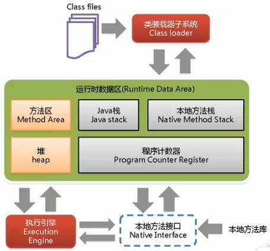
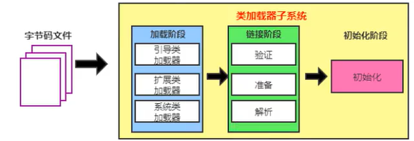
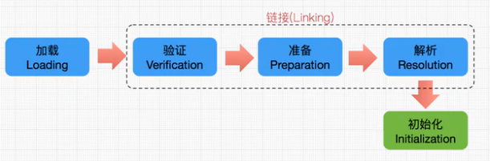

## 1、JVM概述

- Java虚拟机根本不关心运行在其内部的程序到底是使用何种编程语言编写的，它只关心“字节码”文件。也就是说Java虚拟机拥有语言无关性。

- Java虚拟机与Java语言并没有必然的联系，它只与特定的二进制文件格式Class文件格式所关联，Class文件中包含了Java虚拟机指令集（或者称为字节码、Bytecodes）和符号表，还有一些其他辅助信息。

- 虚拟机（virtual Machine），就是一台虚拟的计算机。它是一款软件，用来执行一系列虚拟计算机指令。大体上，虚拟机可以分为系统虚拟机和程序虚拟机。

  - visual Box，VMware就属于系统虚拟机，它们完全是对物理计算机的仿真，提供了一个可运行完整操作系统的软件平台。
  - 程序虚拟机的典型代表就是Java虚拟机，它专门为执行单个计算机程序而设计，在Java虚拟机中执行的指令我们称为Java字节码指令。

- Java虚拟机就是二进制字节码的运行环境，负责装载字节码到其内部，解释/编译为对应平台上的机器指令执行。每一条Java指令，Java虚拟机规范中都有详细定义，如怎么取操作数，怎么处理操作数，处理结果放在哪里。

- JVM是运行在操作系统之上的，它与硬件没有直接的交互。

- JVM体系结构：

  

- JVM架构模型：

  - Java编译器输入的指令流基本上是一种基于栈的指令集架构，另外一种指令集架构则是基于寄存器的指令集架构。
  - 基于栈式架构的特点：
    - 设计和实现更简单，适用于资源受限的系统。
    - 避开了寄存器的分配难题：使用零地址指令方式分配。
    - 指令流中的指令大部分是零地址指令，其执行过程依赖于操作栈。指令集更小，编译器容易实现。
    - 不需要硬件支持，可移植性更好，更好实现跨平台。

- JVM的生命周期：

  - 虚拟机的启动：
    - Java虚拟机的启动是通过引导类加载器（bootstrap class loader）创建一个初始类（initial class）来完成的，这个类是由虚拟机的具体实现指定的。
  - 虚拟机的执行：
    - 一个运行中的Java虚拟机有着一个清晰的任务：执行Java程序。
    - 程序开始执行时他才运行，程序结束时他就停止。
    - 执行一个所谓的Java程序的时候，真真正正在执行的是一个叫做Java虚拟机的进程。
  - 虚拟机的退出：
    * 程序正常执行结束。
    * 程序在执行过程中遇到了异常或错误而异常终止。
    * 由于操作系统出现错误而导致Java虚拟机进程终止。
    * 某线程调用Runtime类或System类的exit方法，或Runtime类的halt方法，并且Java安全管理器也允许这次exit或halt操作。

- JVM发展：
  - Sun Classic VM：1996年，Java1.0版本，第一款商用的Java虚拟机，1.4时被淘汰。只提供了解释器，效率较低。
  - Exact VM：jdk1.2时提供。准确式内存管理，可以知道内存中某个位置的数据具体是什么类型。编译器和解释器混合工作。
  - HotSpot VM：jdk1.3时成为默认虚拟机。热点代码探测技术，拥有绝对的市场地位。
  - JRocket VM：专注于服务器端应用。不包含解释器实现，是最快的JVM。
  - J9 VM：与HotSpot定位接近。
  - Azul VM和Liquid VM：与特定硬件平台绑定，性能更高。


## 2、类加载器子系统

- 类加载器子系统：

  - 类加载器子系统负责从文件系统或者网络中加载Class文件，class文件在文件开头有特定的文件标识。
  - ClassLoader只负责class文件的加载，至于它是否可以运行，则由Execution Engine（执行引擎）决定。
  - 加载的类信息存放于一块称为方法区的内存空间。除了类的信息外，方法区中还会存放运行时常量池信息，可能还包括字符串字面量和数字常量（这部分常量信息是Class文件中常量池部分的内存映射）

  

- 类加载器ClassLoader的角色：

  - class file存在于本地硬盘上，可以理解为设计师画在纸上的模板，而最终这个模板在执行的时候是要加载到JVM当中来根据这个文件实例化出n个一模一样的实例。
  - class file加载到JVM中，被称为DNA元数据模板，放在方法区。
  - 在.class文件-> JVM->最终成为元数据模板，此过程就要一个运输工具（类装载器Class Loader），扮演一个快递员的角色。

- 类的加载过程：

  

  - 加载Loading过程：

    - 通过一个类的全限定名获取定义此类的二进制字节流。
    - 将这个字节流所代表的静态存储结构转化为方法区的运行时数据结构。
    - 在内存中生成一个代表这个类的java.lang.Class对象，作为方法区这个类的各种数据的访问入口。

  - 链接Linking：

    - 验证（Verify）：
      - 目的在于确保class文件的字节流中包含信息符合当前虚拟机要求，保证被加载类的正确性，不会危害虚拟机自身安全。
      - 主要包括四种验证，文件格式验证，元数据验证，字节码验证，符号引用验证。
    - 准备（Prepare）：
      - 为类变量分配内存并且设置该类变量的默认初始值，即零值。
      - 这里不包含用final修饰的static，因为final在编译的时候就会分配了，准备阶段会显式初始化。
      - 这里不会为实例变量分配初始化，类变量会分配在方法区中，而实例变量是会随着对象一起分配到Java堆中。
    - 解析（Resolve）：
      - 将常量池内的符号引用转换为直接引用的过程。
      - 事实上，解析操作往往会伴随着JVM在执行完初始化之后再执行。
      - 符号引用就是一组符号来描述所引用的目标。符号引用的字面量形式明确定义在《java虚拟机规范》的从class文件格式中。
      - 直接引用就是直接指向目标的指针、相对偏移量或一个间接定位到目标的句柄。
      - 解析动作主要针对类或接口、字段、类方法、接口方法、方法类型等。

  - 初始化（Initialization）：

    -  初始化阶段就是执行类构造器方法<clinit>（）的过程。

    - 此方法不需定义，是javac编译器自动收集类中的所有类变量的赋值动作和静态代码块中的语句合并而来。如果没有，就不会生成该方法。

    - 构造器方法中指令按语句在源文件中出现的顺序执行。

    - <clinilt>（）不同于类的构造器。（关联：构造器是虚拟机视角下的<init>（））

    - 若该类具有父类，JVM会保证子类的<clinit>（）执行前，父类的<clinit>（）已经执行完毕。

    - 虚拟机必须保证一个类的<clinit>（）方法在多线程下被同步加锁。

    - 例子：

      ```java
      public class Test {
          static {
              number = 20;
          }
      	private static int number = 10; 
          public static void main(String[] args){
          	System.out.println(Test.number);
          }
          /*
          	执行过程：
          	链接Linking：number被设置为默认初始值0；
          	初始化Initialization：按顺序number先被赋值为20，后被赋值为10.
          */
          
      }
      ```

      

- 类加载器的分类：

  - 引导类（启动类）加载器bootstrapClassLoader。
    - 这个类加载使用c/C++语言实现的，嵌套在JVM内部。
    - 它用来加载Java的核心库（JAVA HOME/jre/lib/rt.jar.
      resources.jar或sun.boot.class.path路径下的内容），用于提供JVM自身需要的类。
    - 并不继承自java.lang.ClassLoader，没有父加载器。
    - 加载扩展类和应用程序类加载器，并指定为他们的父类加载器。
    - 出于安全考虑，Bootstrap启动类加载器只加载包名为java，javax，sun等开头的类
  - 自定义加载器：继承自ClassLoader。
    - 扩展类加载器extClassLoader。
      - Java语言编写，由sun.misc.LaunchersExtClassLoader实现。
      - 派生于ClassLoader类。
      - 父类加载器为引导类加载器。
      - 从java.ext.dirs系统属性所指定的目录中加载类库，或从JDK的安装目录的jre/lib/ext子目录（扩展目录）下加载类库。如果用户创建的JAR放在此目录下，也会自动由扩展类加载器加载。
    - 系统类（应用类）加载器appClassLoader。
      - java语言编写，由sun.misc.Launcher$AppClassLoader实现。
      - 派生于ClassLoader类。
      - 父类加载器为扩展类加载器。
      - 它负责加载环境变量classpath或系统属性java.class.path指定路径下的类库。
      - 该类加载是程序中默认的类加载器，一般来说，Java应用的类都是由它来完成加载
        通过ClassLoader.getSystemClassLoader（）方法可以获取到该类加载器。
    - 用户自定义类加载器：继承ClassLoader或URLClassLoader。
  - 对于用户自定义类，默认使用系统类加载器加载。
  - 对于系统核心类库，使用引导类加载器加载。

- ClassLoader类：是一个抽象类，除了引导类加载器外类加载器都继承了此类。

- 双亲委派机制：

  - Java虚拟机对class文件采用的是按需加载的方式，也就是说当需要使用该类时才会将它的class文件加载到内存生成class对象。而且加载某个类的class文件时，Java虚拟机采用的是双亲委派模式，即把请求交由父类处理，它是一种任务委派模式。
  - 原理：
    - 如果一个类加载器收到了类加载请求，它并不会自己先去加载，而是把这个请求委托给父类的加载器去执行。
    - 如果父类加载器还存在其父类加载器，则进一步向上委托，依次递归，请求最终将到达顶层的引导类加载器。
    - 如果父类加载器可以完成类加载任务，就成功返回，倘若父类加载器无法完成此加载任务，子加载器才会尝试自己去加载，这就是双亲委派模式。
  - 优点：避免类的重复加载。保护程序安全，防止核心API被随意篡改。
  - 沙箱安全机制：自定义string类，但是在加载自定义string类的时候会率先使用引导类加载器加载，而引导类加载器在加载的过程中会先加载jdk自带的文件
    （rt.jar包中java\lang\string.class），报错信息说没有main方法，就是因为加载的是rt.jar包中的string类。这样可以保证对java核心源代码的保护，这就是沙箱安全机制。

- 在JVM中表示两个Class对象是否为同一个类存在两个必要条件：

  - 类的完整类名必须一致，包括包名。
  - 加载这个类的ClassLoader（指ClassLoader实例对象）必须相同。
  - 换句话说，在JVM中，即使这两个类对象（class对象）来源同一个class文件，被同一个虚拟机所加载，但只要加载它们的ClassLoader实例对象不同，那么这两个类对象也是不相等的。

- 对类加载器的引用：JVM必须知道一个类型是由启动加载器加载的还是由用户类加载器加载的。如果一个类型是由用户类加载器加载的，那么JVM会将这个类加载器的一个引用作为类型信息的一部分保存在方法区中。当解析一个类型到另一个类型的引用的时候，JVM需要保证这两个类型的类加载器是相同的。

- 类的主动使用和被动使用：

  - 主动使用：
    - 创建类的实例。
    - 访问某个类或接口的静态变量，或者对该静态变量赋值。
    - 调用类的静态方法。
    - 反射（比如：Class.forName（"com.atguigu.Test"））。
    - 初始化一个类的子类。
    - Java虚拟机启动时被标明为启动类的类。
    - JDK 7开始提供的动态语言支持：java.lang.invoke.MethodHandle实例的解析结果REF getstatic，REF putstatic，REE invokestatic句柄对应的类没有初始化，则初始化。
  - 除了以上七种情况，其他使用Java类的方式都被看作是对类的被动使用，都不会导致类的初始化。


