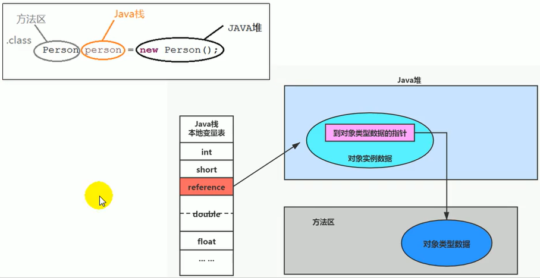
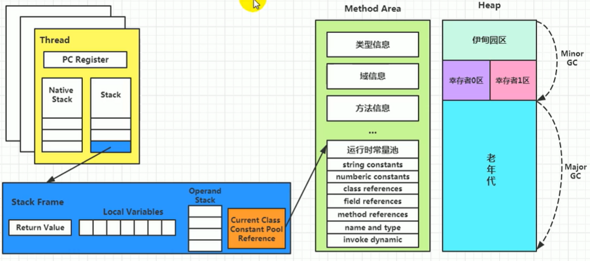
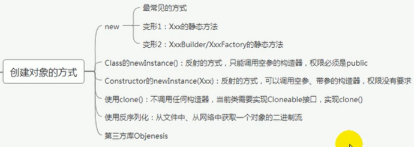
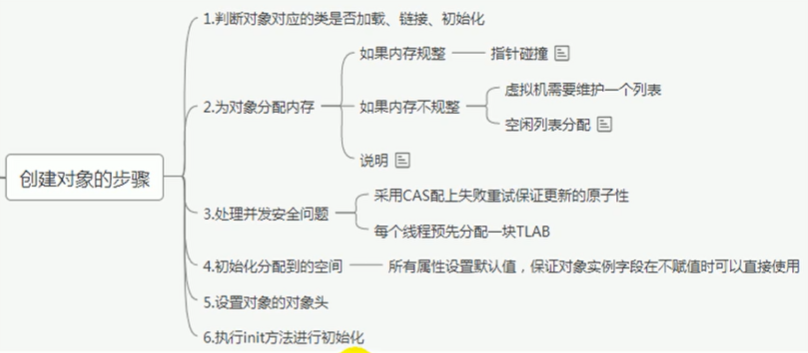
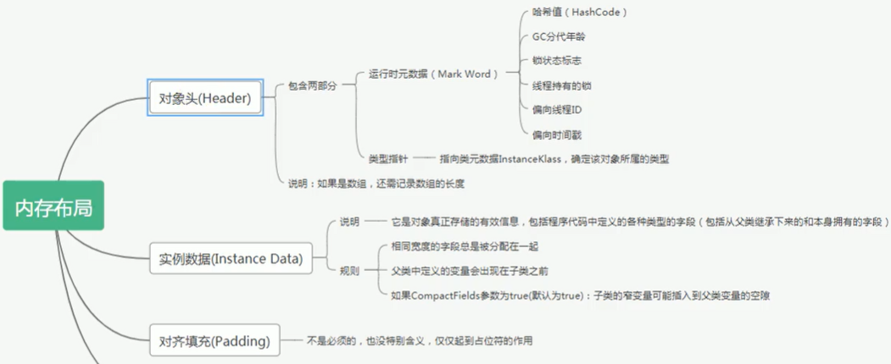
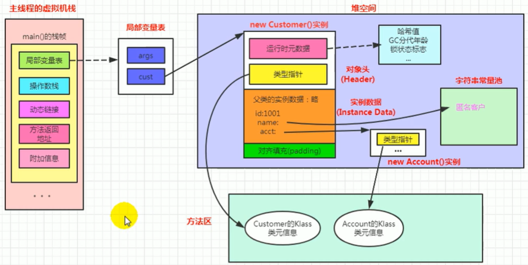
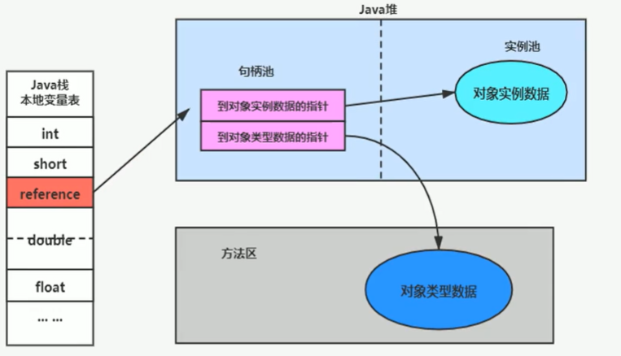
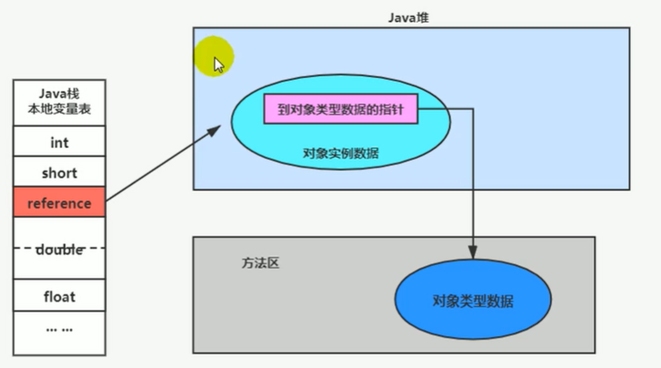

## 1、方法区

- 栈、堆、方法区的交互关系：

  

- 方法区：

  - 《Java虚拟机规范》中明确说明：“尽管所有的方法区在逻辑上是属于堆的一部分，但一些简单的实现可能不会选择去进行垃圾收集或者进行缩。”
  - 但对于HotspotJVM而言，方法区还有一个别名叫做Non-Heap（非堆），目的就是要和堆分开。
  - 所以，方法区看作是一块独立于Java堆的内存空间。
  - 方法区（Method Area）与Java堆一样，是各个线程共享的内存区域。
  - 方法区在JVM启动的时候被创建，并且它的实际的物理内存空间中和Java堆区一样都可以是不连续的。
  - 方法区的大小，跟堆空间一样，可以选择固定大小或者可扩展。
  - 方法区的大小决定了系统可以保存多少个类，如果系统定义了太多的类，导致方法区溢出，虚拟机同样会抛出内存溢出错误：java.lang.OutofMemoryError：PermGen space或者java.lang.OutofMemoryError：Metaspace。
  - 关闭JVM就会释放这个区域的内存。

- HotSpot中方法区的演进：

  - 在jdk7及以前，习惯上把方法区，称为永久代。jdk8开始，使用元空间取代了永久代。
  - 本质上，方法区和永久代并不等价。而仅是对hotspot而言是等价的。《Java虚拟机规范》对如何实现方法区，不做统一要求。例如：BEA JRockit/IBM J9中不存在永久代的概念。
  - 现在来看，当年使用永久代，不是好的idea。导致Java程序更容易OOM。
  - 元空间的本质和永久代类似，都是对JVM规范中方法区的实现。不过元空间与永久代最大的区别在于：元空间不在虚拟机设置的内存中，而是使用本地内存。
  - 永久代、元空间二者并不只是名字变了，内部结构也调整了。
  - 根据《Java虚拟机规范》的规定，如果方法区无法满足新的内存分配需求时，将抛出OOM异常。
  
- 设置方法区大小设置（jdk8中）：

  - 元数据区初始大小和最大大小可以使用参数-XX:Metaspacesize和-Xx:MaxMetaspacesize指定。
  - 默认值依赖于平台。windows下，-XX:Metaspacesize是21M，XX:MaxMetaspacesize的值是-1，即没有限制。
  - 与永久代不同，如果不指定大小，默认情况下，虚拟机会耗尽所有的可用系统内存。
  - 如果元数据区发生溢出，虚拟机一样会抛出异常OutOfMemoryError：Metaspace。
  - 对于一个64位的服务器端JVM来说，其默认的-XX：Metaspacesize值为21MB，这就是初始的高水位线。一旦触及这个水位线，Full GC将会被触发并卸载没用的类（即这些类对应的类加载器不再存活）
  - 然后这个高水位线将会重置。新的高水位线的值取决于GC后释放了多少元空间。如果释放的空间不足，那么在不超过MaxMetaspacesize时，适当提高该值。如果释放空间过多，则适当降低该值。
  - 如果初始化的高水位线设置过低，上述高水位线调整情况会发生很多次。通过垃圾回收器的日志可以观察到Full GC多次调用。为了避免频繁地GC，建议将-XX:Metaspacesize设置为一个相对较高的值。

- 如何解决OOM？
  - 要解决OOM异常或heap space的异常，一般的手段是首先通过内存映像分析工具如（Eclipse Memory Analyzer）对dump出来的堆转储快照进行分析，重点是确认内存中的对象是否是必要的，也就是要先分清楚到底是出现了内存泄漏（Memory Leak）还是内存溢出（Memory Overflow）。
  - 如果是内存泄漏，可进一步通过工具查看泄漏对象到GC Roots的引用链。于是就能找到泄漏对象是通过怎样的路径与GC Roots相关联并导致垃圾收集器无法自动回收它们的。掌握了泄漏对象的类型信息，以及GC Roots，引用链的信息，就可以比较准确地定位出泄漏代码的位置。
  - 如果不存在内存泄漏，换句话说就是内存中的对象确实都还必须存活着，那就应当检查虚拟机的堆参数（-Xmx与-Xms），与机器物理内存对比看是否还可以调大，从代码上检查是否存在某些对象生命周期过长、持有状态时间过长的情况，尝试减少程序运行期的内存消耗。
  
- 方法区的内部结构：
  - 《深入理解Java虚拟机》书中对方法区（Method Area）存储内容描述如下：它用于存储已被虚拟机加载的类型信息、常量、静态变量、即时编器编译后的代码缓存等。此外还会记录这个类是被那个加载器加载的。
  - 类型信息：对每个加载的类型（类class，接口interface、枚举enum、注解annotation），JVM必须在方法区中存储以下类型信息：
    - 这个类型的完整有效名称。（全名=包名.类名）
    - 这个类型直接父类的完整有效名。（对于interface或是java.lang.object，都没有父类）
    - 这个类型的修饰符。（public，abstract，final的某个子集）
    - 这个类型实现接口的一个有序列表。
  - 域（Field，成员变量）信息：JVM必须在方法区中保存类型的所有域的相关信息以及域的声明顺序。
    - 域的相关信息包括：域名称、域类型、域修饰符。（public，private，protected，static，final，volatile，transient的某个子集）
  - 方法（Method）信息：JVM必须保存所有方法的以下信息，同域信息一样包括声明顺序。
    - 方法名称。
    - 方法的返回类型。（或void）
    - 方法参数的数量和类型。（按顺序）
    - 方法的修饰符。（public，private，protected，static，final，synchronized，native，abstract的一个子集）
    - 方法的字节码（bytecodes）、操作数栈、局部变量表及大小。（abstract和native方法除外）
    - 异常表。（abstract和native方法除外）每个异常处理的开始位置、结束位置、代码处理在程序计数器中的偏移地址、被捕获的异常类的常量池索引。
  
- class文件中的常量池：

  - 一个有效的字节码文件中除了包含类的版本信息、字段、方法以及接口等描述信息外，还包含一项信息那就是常量池表（Constant Pool Table），包括各种字面量和对类型、域和方法的符号引用。
  - 一个java源文件中的类、接口，编译后产生一个字节码文件。而Java中的字节码需要数据支持，通常这种数据会很大以至于不能直接存到字节码里，换另一种方式，可以存到常量池，这个字节码包含了指向常量池的引用。在动态链接的时候会用到运行时常量池。
  - 常量池，可以看做是一张表，虚拟机指令根据这张常量表找到要执行的头名、方法名、参数类型、字面量等类型。

- 运行时常量池：

  - class文件中的常量池在运行时就被加载为方法区中的运行时常量池。
  - 运行时常量池，在加载类和接口到虚拟机后，就会创建对应的运行时常量池。
  - JVM为每个已加载的类型（类或接口）都维护一个常量池。池中的数据项像数组项一样，是通过索引访问的。
  - 运行时常量池中包含多种不同的常量，包括编译期就已经明确的数值字面量，也包括到运行期解析后才能够获得的方法或者字段引用。此时不再是常量池中的符号地址了，这里换为真实地址。
  - 运行时常量池，相对于class文件常量池的另一重要特征是：具备动态性。

- 方法区的演进（HotSpot）：

  - jdk1.6及之前：有永久代（permanent generation），静态变量引用存放在永久代上。
  - jdk1.7有永久代，但已经逐步“去永久代”，字符串常量池、静态变量引用移除，保存在堆中。
  - jdk1.8及之后：无永久代，类型信息、字段、方法、常量保存在本地内存的元空间，但字符串常量池、静态变量引用仍在堆。
  - 元空间替代永久代的动机：
    - 为永久代设置空间大小是很难确定的。在某些场景下，如果动态加载类过多，容易产生Perm区的OOM。而元空间和永久代之间最大的区别在于：元空间并不在虚拟机中，而是使用本地内存。因此，默认情况下，元空间的大小仅受本地内存限制。
    - 对永久代进行调优（full GC）是很困难的。

- StringTable为什么要调整（字符串常量从永久代放到堆）？

  - jdk7中将stringTable放到了堆空间中。因为永久代的回收效率很低，在full go的时候才会触发。而full gc是老年代的空间不足、永久代不足时才会触发。
  - 这就导致stringTable回收效率不高。而我们开发中会有大量的字符串被创建，回收效率低，导致永久代内存不足。放到堆里，能及时回收内存。

- 静态变量放在哪？

  - 静态引用对应的对象实体始终都存在堆空间。

  - 例子：

    ```java
    public class StaticObjTest {
        static class Test {
        	static objectHolder staticobj = new ObjectHolder(); 
            ObjectHolder instanceobj = new ObjectHolder(); 
            void foo() {
        		objectHolder localobj = new objectHolder(); 
            }
        private static class ObjectHolder {
        }
        public static void main(String[] args) {
        	Test test = new StaticobjTest. Test(); test. foo();
        }
    }
    ```

  - 等号右边都是对象实体，都放在堆空间。

  - 等号左边是对象引用，其中：

    - jdk7前，staticobj随着Test的类型信息存放在方法区，jdk7及以后随着Test的对象实例存放在Java堆。
    - instanceobj随着Test的对象实例存放在Java堆。
    - localobject则是存放在foo()方法栈帧的局部变量表中。

- 方法区的垃圾回收：

  - 《Java虚拟机规范》对方法区的约束是非常宽松的，提到过可以不要求虚拟机在方法区中实现垃圾收集。
- 一般来说这个区域的回收效果比较难令人满意，尤其是类型的卸载，条件相当苛刻。但是这部分区域的回收有时又确实是必要的。
  
  - 方法区的垃圾收集主要回收两部分内容：常量池中废弃的常量和不再使用的类型。
- 常量池之中主要存放的两大类常量：字面量和符号引用。
  
  - 字面量比较接近Java语言层次的常量概念，如文本字符串、被声明为final的常量值等。
    - 符号引用则属于编译原理方面的概念，包括下面三类常量：
    
      - 类和接口的全限定名。
    
      - 字段的名称和描述符。
      - 方法的名称和描述符。
    - Hotspot虚拟机对常量池的回收策略是很明确的，只要常量池中的常量没有被任何地方引用，就可以被回收。
    - 回收废弃常量与回收Java堆中的对象非常类似。
  - 判定一个类型是否属于“不再被使用的类”的条件就比较苛刻了。需要同时满足下面三个条件：
    
    - 该类所有的实例都已经被回收，也就是Java堆中不存在该类及其任何派生子类的实例。
    
  - 加载该类的类加载器已经被回收，这个条件除非是经过精心设计的可替换类加载器的场景，如OSGi、JSP的重加载等，否则通常是很难达成的。
    
    - 该类对应的Java.lang.Class对象没有在任何地方被引用，无法在任何地方通过反射访问该类的方法。
    
    - Java虚拟机被允许对满足上述三个条件的无用类进行回收，这里说的仅仅是“被允许”，而并不是和对象一样，没有引用了就必然会回收。关于是否要对类型进行回收，HotSpot虚拟机提供了-Xnoclassgc参数进行控制。
    
    - 在大量使用反射、动态代理、CGLib等字节码框架，动态生成JSP以及OSGi这类频繁自定义类加载器的场景中，通常都需要Java虚拟机具备类型卸载的能力，以保证不会对方法区造成过大的内存压力。
  
- 运行时数据区总体结构：

  


## 2、对象实例化

- 创建对象的方式：

  

- 创建对象的步骤：

  

- 对象的内存布局：

  

- 例子：

  ```java
  public class customerTest {
      public static void main(string[] args) {
          Customer cust = new Customer();
      }
  
      public class customer{
          int id = 1001;
          String name;
          Account acct;
          {
              name ="匿名客户";
          }
          public customer(){    
              acct =new Account();
          }
      }
      class Account{
      }
  }
  ```

  

- 对象的访问定位：

  - JVM通过栈帧上的reference引用变量记录了对象实例的地址值，从而访问到堆区的对象实例。

  - 对象访问方式：

    - 句柄访问：

      

      在对象实例的地址改变时，只需要改变句柄的值，不需要改变栈帧中reference引用的值。

    - 直接指针（HotSpot采用）：

      

      访问实例只需要一次索引；不需要额外占用句柄池空间，相对而言效率更高。


## 3、直接内存

- 不是虚拟机运行时数据区的一部分，也不是《Java虚拟机规范》中定义的内存区域。
- 直接内存是在Java堆外的、直接向系统申请的内存区间。
- 来源于NIO，通过存在堆中的DirectByteBuffer操作Native内存。通常，访问直接内存的速度会优于Java堆。即读写性能高。
  - 因此出于性能考虑，读写频繁的场合可能会考虑使用直接内存。
  - Java的NIO库允许Java程序使用直接内存，用于数据缓冲区。
- 也可能导致OutofMemoryError异常。
- 由于直接内存在Java堆外，因此它的大小不会直接受限于-Xmx指定的最大堆大小，但是系统内存是有限的，Java堆和直接内存的总和依然受限于操作系统能给出的最大内存。
- 缺点：
  - 分配回收成本较高。
  - 不受JVM内存回收管理。
- 直接内存大小可以通过MaxDirectMemorysize设置如果不指定，默认与堆的最大值-Xmx参数值一致。


