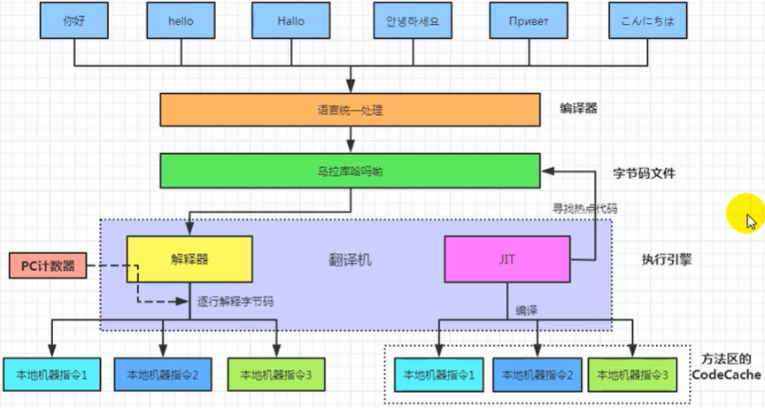
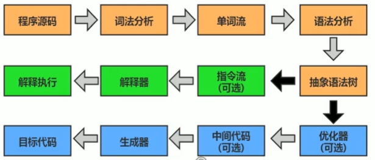

## 1、执行引擎

- 执行引擎是Java虚拟机核心的组成部分之一。

- “虚拟机”是一个相对于“物理机”的概念，这两种机器都有代码执行能力，其区别是物理机的执行引擎是直接建立在处理器、缓存、指令集和操作系统层面上的，而虚拟机的执行引擎则是由软件自行实现的，因此可以不受物理条件制约地定制指令集与执行引擎的结构体系，能够执行那些不被硬件直接支持的指令集格式。

- JVM的主要任务是负责装载字节码到其内部，但字节码并不能够直接运行在操作系统之上，因为字节码指令并非等价于本地机器指令，它内部包含的仅仅只是一些能够被JVM所识别的字节码指令、符号表，以及其他辅助信息。

- 如果想要让一个Java程序运行起来，执行引擎（Execution Engine）的任务就是将字节码指令解释/编译为对应平台上的本地机器指令才可以。简单来说，JVM中的执行引擎充当了将高级语言翻译为机器语言的译者。

- 从外观上来看，所有的Java虚拟机的执行引擎输入、输出都是一致的：输入的是字节码二进制流，处理过程是字节码解析执行的等效过程，输出的是执行结果。

- 执行引擎的工作过程：

  - 执行引擎在执行的过程中究竟需要执行什么样的字节码指令完全依赖于PC寄存器。
  - 每当执行完一项指令操作后，PC寄存器就会更新下一条需要被执行的指令地址。
  - 当然方法在执行的过程中，执行引擎有可能会通过存储在局部变量表中的对象引用准确定位到存储在Java堆区中的对象实例信息，以及通过对象头中的元数据指针定位到目标对象的类型信息。

  

- Java代码的编译执行：

  - 执行流程：

    

    黄色块由javac前端编译器完成（与JVM无关），蓝色块是编译执行，绿色块是解释执行。

  - 什么是解释器（Interpreter），什么是JIT编译器？

    - 解释器：当Java虚拟机启动时会根据预定义的规范对字节码采用逐行解释的方式执行，将每条字节码文件中的内容“翻译”为对应平台的本地机器指令执行。
    - JIT（Just In Time Compiler）编译器：就是虚拟机将源代码直接编译成和本地机器平台相关的机器语言。

  - 为什么说Java是半编译半解释型语言？

    - JDK1.0时代，将Java语言定位为“解释执行”还是比较准确的。再后来，Java也发展出可以直接生成本地代码的编译器。
    - 现在JVM在执行Java代码的时候，通常都会将解释执行与编译执行二者结合起来进行。

- 前备知识：

  - 机器码：

    - 各种用二进制编码方式表示的指令，叫做机器指令码。开始，人们就用它采编写程序，这就是机器语言。
    - 机器语言虽然能够被计算机理解和接受，但和人们的语言差别太大，不易被人们理解和记忆，并且用它编程容易出差错。
    - 用它编写的程序一经输入计算机，CPU直接读取运行，因此和其他语言编的租序相比，执行速度最快。
    - 机器指令与CPU紧密相关，所以不同种类的CPU所对应的机器指令也就不同。
- 指令：
  
  - 由于机器码是有0和1组成的二进制序列，可读性实在太差，于是人们发明了指令。
    - 指令就是把机器码中特定的0和1序列，简化成对应的指令（一般为英文简写，如mov，inc等），可读性稍好
    - 由于不同的硬件平台，执行同一个操作，对应的机器码可能不同，所以不同的硬件平台的同一种指令（比如mov），对应的机器码也可能不同。
  - 指令集：

    - 不同的硬件平台，各自支持的指令，是有差别的，因此每个平台所支持的指令，称之为对应平台的指令集。
  - 如常见的 x86指令集，对应的是x86架构的平台，ARM指令集，对应的是ARM架构的平台。
  - 汇编语言：
  
    - 由于指令的可读性还是太差，于是人们又发明了汇编语言。
  
    - 在汇编语言中，用助记符（Mnemonics）代替机器指令的操作码，用地址符号（Symbol）或标号（Label）代替指令或操作数的地址。
    - 在不同的硬件平台，汇编语言对应着不同的机器语言指令集，通过汇编过程转换成机器指令。
  
  
  - 由于计算机只认识机器码，所以用汇编语言编写的程序还必须翻译成机器指令码，计算机才能识别和执行。
  - 高级语言 -> 汇编语言，称为编译过程。汇编语言 -> 机器指令，称为汇编过程。
- 字节码：
    - 字节码是一种中间状态（中间码）的二进制代码（文件），它比机器码更抽象，需要直译器转译后才能成为机器码。字节码主要为了实现特定软件运行和软件环境、与硬件环境无关。
    - 字节码的实现方式是通过编译器和虚拟机器。编译器将源码编译成字节码，特定平台上的虚拟机器将字节码转译为可以直接执行的指令。
  
- 解释器：

  - 解释器真正意义上所承担的角色就是一个运行时“翻译者”，将字节码文件中的内容“翻译”为对应平台的本地机器指令执行。
  - 当一条字节码指令被解释执行完成后，接着再根据PC寄存器中记录的下一条需要被执行的字节码指令执行解释操作。
  - Java发展中产生了两套解释执行器，分为字节码解释器和模板解释器。
  - 为了解决解释器执行效率低问题，JVM平台支持一种叫作即时编译的技术。即时编译的目的是避免函数被解释执行，而是将整个函数体编译成为机器码，每次函数执行时，只执行编译后的机器码即可，这种方式可以使执行效率大幅度提升。

- JIT（即时）编译器：

  - HotSpot VM采用解释器与即时编译器并存的架构。在Java虚拟机运行时，解释器和即时编译器能够相互协作，各自取长补短，尽力去选择最合适的方式来权衡编译本地代码的时间和直接解释执行代码的时间。
  - 当虚拟机启动的时候，解释器可以首先发挥作用而不必等待即时编译器全部编译完成再执行，这样可以省去许多不必要的编译时间。并且随着程序运行时间的推移，即时编译器逐渐发挥作用，根据热点探测功能，将有价值的字节码编译为本地机器指令，以换取更高的程序执行效率。

- 编译器分类：

  - Java语言的“编译期”其实是一段“不确定”的操作过程，因为它可能是指一个前端编译器（其实叫“编译器的前端”更准确一些）把.java文件转变成.class文件的过程；
  - 也可能是指虚拟机的后端运行期编译器（JIT编译器，Just In Time Compiler）把字节码转变成机器码的过程。
  - 还可能是指使用静态提前编译器（AOT编译器，Ahead of Time Compiler）直接把.java文件编译成本地机器代码的过程。
  - 前端编译器：Sun的Javac，Eclipse JDT中的增量式编译器（ECJ）。
  - JIT编器：HotSpot VMc1，c2编译器。
  - AOT编译器：GNU Compiler for the Java（GCJ）、Excelsior JET。

- 热点代码及探测方式：

  - 是否需要启动JIT编译器将字节码直接编译为对应平台的本地机器指令，需要根据代码被调用执行的频率而定。
  - 关于那些需要被编译为本地代码的字节码，也被称之为“热点代码”，JIT编译器在运行时会针对那些频繁被调用的“热点代码”做出深度优化，将其直接编译为对应平台的本地机器指令，以此提升Java程序的执行性能。
  - 一个被多次调用的方法，或者是一个方法体内部循环次数较多的循环体都可以被称之为“热点代码”，因此都可以通过JIT编译器编译为本地机器指令。由于这种编译方式发生在方法的执行过程中，因此也被称之为栈上替换，或简称为OSR（On stack Replacement）编译。
  - 目前HotSpot VM所采用的热点探测方式是基于计数器的热点探测。采用基于计数器的热点探测，HotSpot 将会为每一个方法都建立2个不同类型的计数器，分别为方法调用计数器（Invocation Counter）和回边计数器（Back Edge Counter）。
    - 方法调用计数器用于统计方法的调用次数。
      - 这个计数器就用于统计方法被调用的次数，它的默认阈值在client模式下是1500次，在Server模式下是10000次。超过这个阈值，就会触发JIT编译。
      - 这个阈值可以通过虚拟机参数-XX：CompileThreshola来人为设定。
      - 当一个方法被调用时，会先检查该方法是否存在被JIT编译过的版本，如果存在，则优先使用编译后的本地代码来执行。如果不存在已被编译过的版本，则将此方法的调用计数器值加1，然后判断方法调用计数器与回边计数器值之和是否超过方法调用计数器的阈值。如果已超过阈值，那么将会向即时编译器提交一个该方法的代码编译请求。
      - 如果不做任何设置，方法调用计数器统计的并不是方法被调用的绝对次数，而是一个相对的执行频率，即一段时间之内方法被调用的次数。当超过一定的时间限度，如果方法的调用次数仍然不足以让它提交给即时编译器编译，那这个方法的调用计数器就会被减少一半，这个过程称为方法调用计数器热度的衰减（Counter Decay），而这段时间就称为此方法统计的半衰周期（Counter Half Life Time）。
      - 进行热度衰减的动作是在虚拟机进行垃圾收集时顺便进行的，可以使用虚拟机参数
        -XX:-UseCounterDecay来关闭热度衰减，让方法计数器统计方法调用的绝对次数，这样，只要系统运行时间足够长，绝大部分方法都会被编译成本地代码。另外，可以使用-XX:CounterHalfLifeTime参数设置半衰周期的时间，单位是秒。
    - 回边计数器则用于统计循环体执行的循环次数。
      - 它的作用是统计一个方法中循环体代码执行的次数，在字节码中遇到控制流向后跳转的指令称为“回边”（Back Edge）。显然，建立回边计数器统计的目的就是为了触发OSR编译。

- 缺省情况下HotSpot VM是采用解释器与即时编译器并存的架构，但也根据具体的应用场景，通过命令显式地为Java虚拟机指定在运行时到底是完全采用解释器执行，还是完全采用即时编译器执行。

  - -Xint：完全采用解释器模式执行程序；
  - -Xcomp：完全采用即时编译器模式执行程序。如果即时编译出现问题，解释器会介入执行。
  - -Xmixed：采用解释器+即时编译器的混合模式共同执行程序。

- 在HotSpot VM中内嵌有两个JIT编译器，分别为Client Compiler和Server Compiler，但大多数情况下我们简称为C1编译器和C2编译器。可以通过如下命令显式指定Java虚拟机在运行时到底使用哪一种即时编译器，：

  - -client：指定Java虚拟机运行在Client模式下，并使用C1编译器；C1编译器会对字节码进行简单和可靠的优化，耗时短。以达到更快的编译速度。
  - -server：指定Java虚拟机运行在Server模式下，并使用C2编译器。C2进行耗时较长的优化，以及激进优化。但优化的代码执行效率更高。

- C1和C2编译器不同的优化策略：在不同的编译器上有不同的优化策略：

  - C1编译器上主要有方法内联，去虚拟化、冗余消除。
    - 方法内联：将引用的函数代码编译到引用点处，这样可以减少栈帧的生成，减少参数传递以及跳转过程。
    - 去虚拟化：对唯一的实现类进行内联。
    - 冗余消除：在运行期间把一些不会执行的代码折叠掉。
  - C2的优化主要是在全局层面，逃逸分析是优化的基础。基于逃逸分析在C2上有如下几种优化：
    - 标量替换：用标量值代替聚合对象的属性值。
    - 栈上分配：对于未逃逸的对象分配对象在栈而不是堆。
    - 同步消除：清除同步操作，通常指synchronized。
  - 分层编译（Tiered Compilation）策略：程序解释执行（不开启性能监控）可以触发C1编译，将字节码编译成机器码，可以进行简单优化，也可以加上性能监控，C2编译会根据性能监控信息进行激进优化。
  - C2编译器启动时长比C1编译器慢，系统稳定执行以后，C2编译器执行速度远远快于C1编译器。

- Graal编译器：

  - 自JDK10起，HotSpot又加入一个全新的即时编译器：Graal编译器。
  - 目前，带着“实验状态"标签，需要使用开关参数
    -XX：+UnlockExperimentalVMoptions -XX：+UseJVMCICompiler去激活，才可以使用。

- AOT编译器：

  - jdk9引入了AOT编译器（静态提前编译器，Ahead of Time Compiler）。
  - Java 9引入了实验性AOT编译工具jaotc。它借助了Graal编译器，将所输入的Java类文件转换为机器码，并存放至生成的动态共享库之中。
  - 所谓AOT编译，是与即时编译相对立的一个概念。我们知道，即时编译指的是在程序的运行过程中，将字节码转换为可在硬件上直接运行的机器码，并部署至托管环境中的过程。而AOT编译指的则是，在程序运行之前，便将字节码转换为机器码的过程。
  - 优点：
    - Java虚拟机加载已经预编译成二进制库，可以直接执行。不必等待即时编译器的预热，减少Java应用给人带来“第一次运行慢”的不良体验。
  - 缺点：
    - 破坏了java“一次编译，到处运行”，必须为每个不同硬件、OS编译对应的发行包。
    - 降低了Java链接过程的动态性，加载的代码在编译期就必须全部已知。


## 2、StringTable

- String的基本特性：
  - string声明为final的，不可被继承。
  - string实现了serializable接口：表示字符串是支持序列化的。实现了comparable接口：表示string可以比较大小string。
  - 在jdk8及以前内部定义了final char[]用于存储字符串数据。jdk9时改为byte[]。
  - string：代表不可变的字符序列。简称：不可变性。
    - 当对字符串重新赋值时，需要重新指定内存区域赋值，不能使用原有的value进行赋值。
    - 当对现有的字符串进行连接操作时，也需要重新指定内存区域赋值，不能使用原有的value进行赋值。
    - 当调用string的replace（）方法修改指定字符或字符串时，也需要重新指定内存区域赋值，不能使用原有的value进行赋值。
  - 通过字面量的方式（区别于new）给一个字符串赋值，此时的字符串值声明在字符串常量池中。
  - 字符串常量池中是不会存储相同内容的字符串的。
- StringTable：
  - string的string Pool是一个固定大小的Hashtable（哈希表map），默认值大小长度是60013。
  - 如果放进string Pool的string非常多，就会造成Hash冲突严重，从而导致链表会很长，而链表长了后直接会造成的影响就是当调用`String.intern()`时性能会大幅下降。
  - 使用-XX：stringtablesize可设置stringrable的长度。
  - 在jdk6中stringrable是固定的，就是1009的长度，所以如果常量池中的字符串过多就会导致效率下降很快。stringTablesize设置没有要求。
  - 在jdk7中，stringTable的长度默认值是60013。
  - 从jdk8开始，1009是可设置的最小值。
- String的内存分配：
  - 在Java语言中有8种基本数据类型和一种比较特殊的类型string。这些类型为了使它们在运行过程中速度更快、更节省内存，都提供了一种常量池的概念。
  - 常量池就类似一个Java系统级别提供的缓存。8种基本数据类型的常量池都是系统协调的，string类型的常量池比较特殊。它的主要使用方法有两种。
    - 直接使用双引号声明出来的string对象会直接存储在常量池中。
    - 如果不是用双引号声明的string对象，可以使用string提供的`intern()`方法。
  - Java 6及以前，字符串常量池存放在永久代。
  - Java 7中oracle的工程师对字符串池的逻辑做了很大的改变，即将字符串常量池的位置调整到Java堆内。
    - 所有的字符串都保存在堆（Heap）中，和其他普通对象一样，这样可以让你在进行调优应用时仅需要调整堆大小就可以了。
    - 字符串常量池概念原本使用得比较多，但是这个改动使得我们有足够的理由让我们重新考虑在Java 7中使用`String.intern()`。
  - Java8元空间，字符串常量在堆.
  - stringTable为什么要调整？
    - permsize默认比较小。
    - 永久代垃圾回收频率低 。

- 字符串的拼接操作：

  - 常量与常量（两个字面量）的拼接结果在常量池，原理是编译期优化

  - 常量池中不会存在相同内容的常量。

  - 只要其中有一个是变量，结果就在堆中，相当于new了一个对象。变量拼接的原理是StringBuilder，在jdk5.0之前的是StringBuffer。

    ```java
    String s1 = "a";
    String s2 = s1 + "b";	//有一个是变量
    //但如果s1是final修饰的，就算是常量
    ```

  - 如果拼接的结果调用`intern()`方法，则主动将常量池中还没有的字符串对象放入池中，并返回此对象地址。

- 字符串变量拼接的底层原理：

  - 比如操作：`String s3 = s1 + s2`。
  - 首先new一个空的StringBuilder。
  - 调用两次`append()`操作，把s1和s2添加进去。
  - 调用`toString()`方法并返回。
  - 通过`StringBuilder.append()`方法拼接字符串的效率远高于使用String变量用`+`拼接的方式。
  - 因为后者会创建多个StringBuilder和String对象，而且会耗费时间GC。
  - 前者的改进，使用指定底层数组大小的带参构造器。

- `intern()`的使用：

  - 如果不是用双引号声明的string对象，可以使用string提供的intern方法：intern方法会从字符串常量池中查询当前字符串是否存在，若不存在就会将当前字符串放入常量池中。比如：`String myIhfo = new string("I ").intern()`。
  - 也就是说，如果在任意字符串上调用String.intern方法，那么其返回结果所指向的那个类实例，必须和直接以常量（字面量）形式出现的字符串实例完全相同。
  - Interned string就是确保字符串在内存里只有一份拷贝，这样可以节约内存空间，加快字符串操作任务的执行速度。注意，这个值会被存放在字符串内部池（string Intern Pool）。

- String相关题目：

  - `String str = new String("ab")`会创建几个对象？两个。

    - 一个是通过new在堆空间创建的。
    - 另一个是放入字符串常量池中的指令（这种new的方法也算是使用字面量）。

  - `String str = new String("a") + new String("b")`会创建几个对象？六个。

    - 前四个是与上题类似。
    - 拼接会产生一个StringBuilder对象，其返回时会调用`toString()`方法再生成一个对象。
    - 注意调用`toString()`方法时，不会在字符串常量池中创建ab。

  - `intern()`的使用题目：

    ```java
    String s1 = new string(original: "1"); 
    s1.intern(); 
    String s2 = "1"; 
    //jdk6:false,jdk7/8:false
    System.out.println(s1 == s2);
    String s3 = new string(original: "1") + new string(original: "1"); 
    s3.intern(); 
    String s4 = "11"; 
    //jdk6:false,jdk7/8:true
    System.out.println(s3 == s4);
    ```

    - 对于第一个比较，s1指向的是在堆空间中new的对象，s2指向的是常量池中的1，所以不相等。
    - s3的变量记录的地址是相当于指向对象`new String("11")`。
    - 在jdk6中，`s3.intern()`就是相当于在字符串常量池中创建了一个新的11。
    - 在jdk7/8中，`s3.intern()`没有在字符串常量池中创建新的11，而是创建了一个指向原有的堆空间中的s3的指针。

  - 总结：

    - jdk1.6中，将这个字符串对象尝试放入串池。
      - 如果串池中有，则并不会放入。返回已有的串池中的对象的地址。
      - 如果没有，会把此对象复制一份，放入串池，并返回串池中的对象地址。
    - Jdk1.7起，将这个字符串对象尝试放入串池。
      - 如果串池中有，则并不会放入。返回已有的串池中的对象的地址。
      - 如果没有，则会把对象的引用地址复制一份，放入串池，并返回串池中的引用地址。
    - 对于大量的重复字符串，使用`intern()`可以节省内存空间。

  - StringTable的垃圾回收：

    - 使用`String str = new String().intern()`，str指向的是字符串常量池中的值，new出来的String对象会被垃圾回收。
    
  - G1的String去重：
  
    - 不是针对常量池，因为常量池中本身就只有一份。
    - 指的是在堆中new的String对象的去重。


