## 1、Class文件概述

- 想要让一个Java程序正确地运行在JVM中，Java源码就必须要被编译为符合JVM规范的字节码。

  - 前端编译器的主要任务就是负责将符合Java语法规范的Java代码转换为符合JVM规范的字节码文件。
  - Javac是一种能够将Java源码编译为字节码的前端编译器。
  - Javac编译器在将Java源码编译为一个有效的字节码文件过程中经历了4个步骤，分别是词法解析、语法解析、语义解析以及生成字节码。
  - 前端编译器并不会直接涉及编译优化方面的技术，具体优化交由JIT即时编译器负责。

- Oracle的JDK软件包括两部分内容：

  - 一部分是将Java源代码编译成Java虚拟机的指令集的前端编译器。
  - 另一部分是用于实现Java虚拟机的运行时环境。

- 字节码文件里是什么？

  - 源代码经过编译器编译之后便会生成一个字节码文件，字节码是一种二进制的类文件，它的内容是JVM的指令，而不像C、C++经由编译器直接生成机器码。

- 什么是字节码指令（byte code）？

  - Java虚拟机的指令由一个字节长度的、代表着某种特定操作含义的操作码（opcode）以及跟随其后的零至多个代表此操作所需参数的操作数（operand）所构成。虚拟机中许多指令并不包含操作数，只有一个操作码。
  - 使用JDK自带的javap指令可以对字节码文件进行反解析。

- Class文件的本质：

  - 任何一个Class文件都对应着唯一一个类或接口定义信息，但反过来说，Class文件实际上它并不一定以磁盘文件的形式存在。
  - Class文件是一组以8位字节为基础单位的二进制流。
  - Class文件是JVM的基石。

## 2、Class文件结构

- Class文件格式：

  - Class文件没有任何分隔符号。所以在其中的数据项，无论是字节顺序还是数量，都是被严格限定的。哪个字节代表什么含义，长度是多少，先后顺序如何，都不允许改变。
  - Class文件格式采用一种类似于C语言结构体的方式进行数据存储，这种结构中只有两种数据类型：无符号数和表。
  - 无符号数属于基本的数据类型，以u1、u2、u4、u8来分别代表1个字节、2个字节、4个字节和8个字节的无符号数，无符号数可以用来描述数字、索引引用、数量值或者按照 UTF-8编码构成字符串值。
  - 表是由多个无符号数或者其他表作为数据项构成的复合数据类型，所有表都习惯性地以“_info”结尾。
  - 表用于描述有层次关系的复合结构的数据，整个Class文件本质上就是一张表。由于表没有固定长度，所以通常会在其前面加上个数说明。

- Class文件结构：

  - Class文件的结构并不是一成不变的，随着Java虚拟机的不断发展，总是不可避免地会对Class文件结构做出一些调整，但是其基本结构和框架是非常稳定的。

  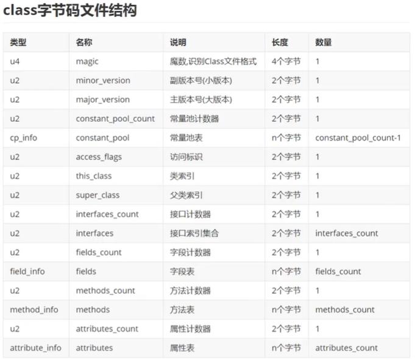

- 魔数：

  -  每个Class文件开头的4个字节的无符号整数称为魔数（MagicNumber）。
  - 它的唯一作用是确定这个文件是否为一个能被虚拟机接受的有效合法的Class文件。即：魔数是Class文件的标识符。
  - 魔数值固定为0xCAFEBABE。不会改变。
  - 如果一个class文件不以0xCAFEBABE开头，虚拟机在进行文件校验的时候就会直接抛出错误。
  - 使用魔数而不是扩展名来进行识别主要是基于安全方面的考虑，因为文件扩展名可以随意地改动。

- Class文件版本号：

  - 紧接着魔数的4个字节存储的是Class文件的版本号。同样也是4个字节。
  - 第5个和第6个字节所代表的含义就是编译的副版本号minor_version，而第7个和第8个字节就是编译的主版本号major_version。
  - 高版本虚拟机可以执行低版本生成的Class文件，反之则不行。

- 常量池：

  - 常量池是Class文件中内容最为丰富的区域之一。常量池对于Class文件中的字段和方法解析也有着至关重要的作用。常量池是Class文件的基石。
  - 在版本号之后，紧跟着的是常量池的数量，以及若干个常量池表项。
  - 常量池中常量的数量是不固定的，所以在常量池的入口需要放置一项u2类型的无符号数，代表常量池容量计数值（constant_pool_count）。与Java中语言习惯不一样的是，这个容量计数是从1而不是0开始的。
  - 常量池表项中，用于存放编译时期生成的各种字面量和符号引用，这部分内容将在类加载后进入方法区的运行时常量池中存放。

- 常量池计数器：

  - 由于常量池的数量不固定，时长时短，所以需要放置两个字节来表示常量池容量计数值。
  - 常量池容量计数值（u2类型）：从1开始，表示常量池中有多少项常量。即constant_pool_count=1表示常量池中有0个常量项。
  - 索引值0用来在特定情况下表示“不引用任何一个常量池项目”的含义。

- 常量池表：

  - constant_pool是一种表结构，以1~constant_pool_count-1为索引。表明了后面有多少个常量项。

  - 常量池主要存放两大类常量：字面量（Literal）和符号引用（Symbolic References）。

  - 它包含了Class文件结构及其子结构中引用的所有字符串常量、类或接口名、字段名和其他常量。

  - 常量池中的每一项都具备相同的特征。第1个字节作为类型标记，用于确定该项的格式，这个字节称为tag byte（标记字节、标签字节）。

    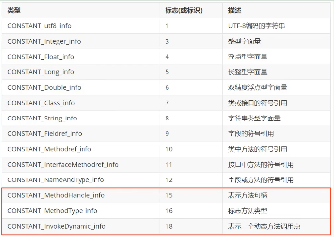

  - 字面量：文本字符串，或声明为final的常量值。

  - 符号引用：类和接口的全限定名，字段的名称和描述符，或方法的名称和描述符。

    - 描述符的作用是用来描述字段的数据类型、方法的参数列表（包括数量、类型以及顺序）和返回值。

    - 用描述符来描述方法时，按照先参数列表，后返回值的顺序描述，参数列表按照参数的严格顺序放在一组小括号“（）”之内。

    - 描述符：

      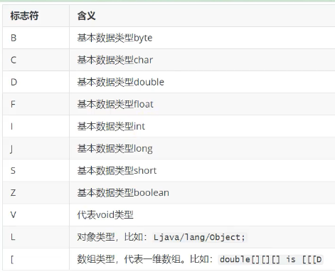

  - 虚拟机在加载Class文件时才会进行动态链接，也就是说，Class文件中不会保存各个方法和字段的最终内存布局信息，因此，这些字段和方法的符号引用不经过转换是无法直接被虚拟机使用的。当虚拟机运行时，需要从常量池中获得对应的符号引用，再在类加载过程中的解析阶段将其替换为直接引用，并翻译到具体的内存地址中。

  - 符号引用和直接引用的区别与关联：

    - 符号引用：符号引用以一组符号来描述所引用的目标，符号可以是任何形式的字面量，只要使用时能无歧义地定位到目标即可。符号引用与虚拟机实现的内存布局无关，引用的目标并不一定已经加载到了内存中。
    - 直接引用：直接引用可以是直接指向目标的指针、相对偏移量或是一个能间接定位到目标的句柄。直接引用是与虚拟机实现的内存布局相关的，同一个符号引用在不同虚拟机实例上翻译出来的直接引用一般不会相同。如果有了直接引用，那说明引用的目标必定已经存在于内存之中了。

- 常量池表中的常量：

  - 常量池表的结果和内容：

    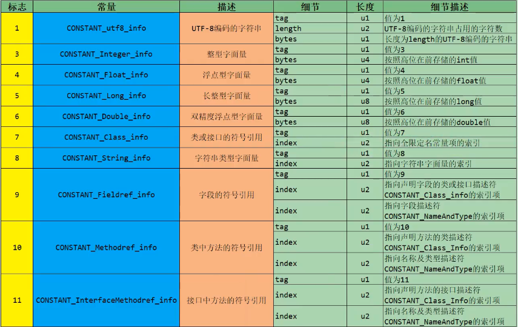

    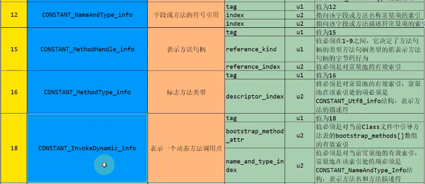

  - 常量项中，第一个字节tag表示常量类型。后续的index表示指向常量表中的其他项。最终所有的常量都会指向字面量。

  - 14种常量项中，只有字符串的长度是不确定的。

- 访问标识：

  - 在常量池后，紧跟着访问标记。该标记使用两个字节表示，用于识别一些类或者接口层次的访问信息，包括：这个Class是类还是接口；是否定义为public类型；是否定义为abstract类型；如果是类的话，是否被声明为final等。

  - 最后字节码中的访问标识的值是由下方的标志值相加得到的。

    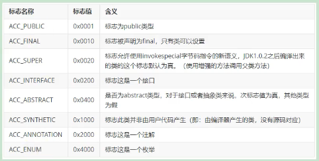

- 类索引、父类索引、接口索引集合：

  - 类索引、父类索引都由一个u2表示，值是指向常量池中的索引。
  - Object类的父类索引是0。
  - 在接口索引集合前有一个接口计数器，表示当前了或接口的直接接口数量，从0开始。
  - 接口索引集合中记录的是常量池中的索引，每个项为u2。
  - 如果接口计数器是0，则不存在接口索引集合。

- 字段表：

  - 这里的字段指的就是Java中的成员变量，包括类变量和实例变量，但是不包括局部变量。
  - 字段叫什么名字、字段被定义为什么数据类型，这些都是无法固定的，只能引用常量池中的常量来描述。
  - 它指向常量池索引集合，它描述了每个字段的完整信息。比如字段的标识符、访问修饰符（public、private或protected）、是类变量还是实例变量（static修饰符）、是否是常量（final修饰符）等。
  - 字段表集合中不会列出从父类或者实现的接口中继承而来的字段，但有可能列出原本Java代码之中不存在的字段。譬如在内部类中为了保持对外部类的访问性，会自动添加指向外部类实例的字段。
  - 在Java语言中字段是无法重载的，两个字段的数据类型、修饰符不管是否相同，都必须使用不一样的名称，但是对于字节码来讲，如果两个字段的描述符不一致，那字段重名就是合法的。

- 字段计数器：

  - 字段计数器的值表示当前class文件fields表的成员个数。使用u2来表示。

- 字段表集合：

  - 字段表中每个成员都是一个field_info结构，用于表示该类或接口所声明的所有类字段或者实例字段，不包括方法内部声明的变量，也不包括从父类或父接口继承的那些字段。

  - 一个字段的信息包括：

    - 作用域（public、private、protected修饰符）。
    - 实例变量还是类变量（static修饰符）可变性（final）。
    - 并发可见性（volatile修饰符，是否强制从主内存读写）。
    - 可否序列化（transient修饰符）。
    - 字段数据类型（基本数据类型、对象、数组）。
    - 字段名称。

  - 字段表结构：

    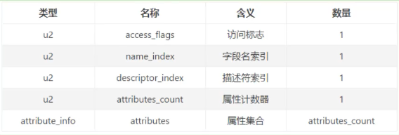

  - 字段访问标识：

    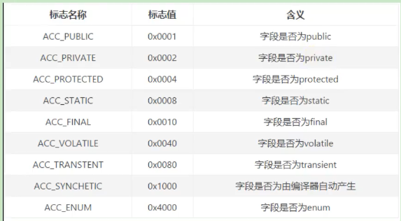

  - 字段名索引：根据索引，在常量池中找到字段名。

  - 字段描述符索引：与之前符号引用中的描述符类似。

  - 属性表集合：一个字段还可能拥有一些属性，用于存储更多的额外信息。比如初始化值（对于final常量而言）、一些注释信息等。属性个数存放在属性计数器中中，属性具体内容存放在属性集合中。

- 方法表：

  - 在字节码文件中，每一个method_info项都对应着一个类或者接口中的方法信息。比如方法的访问修饰符（public、private或protected），方法的返回值类型以及方法的参数信息等。
  - 如果这个方法不是抽象的或者不是native的，那么字节码中会体现出来。
  - 一方面，methods表只描述当前类或接口中声明的方法，不包括从父类或父接口继承的方法。另一方面，methods表有可能会出现由编译器自添加的方法，最典型的便是编译器产生的方法信息（比如：类（接口）初始化方法<c1init>）和实例初始化方法<init>（））。
  - 在Java语言中，要重载（Overload）一个方法，除了要与原方法具有相同的简单名称之外，还要求必须拥有一个与原方法不同的特征签名，特征签名就是一个方法中各个参数在常量池中的字段符号引用的集合，也就是因为返回值不会包含在特征签名之中，因此Java语言里无法仅仅依靠返回值的不同来对一个已有方法进行重载。但在Class文件格式中，特征签名的范围更大一些，只要描述符不是完全一致的两个方法就可以共存。也就是说，如果两个方法有相同的名称和特征签名，但返回值不同，那么也是可以合法共存于同一个class文件中。
  - 也就是说，尽管Java语法规范并不允许在一个类或者接口中声明多个方法签名相同的方法，但是和Java语法规范相反，字节码文件中却恰恰允许存放多个方法签名相同的方法，唯一的条件就是这些方法之间的返回值不能相同。

- 方法计数器：

  - 方法计数器的值表示当前class文件methods表的成员个数。使用u2来表示。

- 方法表集合：

  - methods表中的每个成员都必须是一个method_info结构，用于表示当前类或接口中某个方法的完整描述。

  - method_info结构可以表示类和接口中定义的所有方法，包括实例方法、类方法、实例初始化方法和类或接口初始化方法。

  - 方法表了结构与字段表类似，也包括访问标识、方法名索引、描述符索引、属性计数器和属性集合。

  - 方法访问标识：

    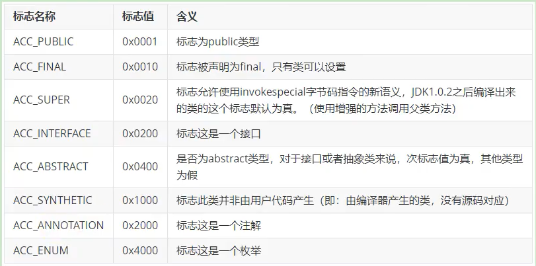

  - 方法名索引和描述符索引都指向常量池中，分别表示方法名和描述符（包括参数类型和返回值类型，比如`()V`）。

- 属性表：

  - 方法表集合之后的属性表集合，指的是class文件所携带的辅助信息，比如该class文件的源文件的名称。以及任何带有RetentionPolicy.CLASS 或者RetentionPolicy.RUNTIME的注解。这类信息通常被用于Java虚拟机的验证和运行，以及Java程序的调试。
  - 此外，字段表、方法表都可以有自己的属性表。用于描述某些场景专有的信息。
  - 属性表集合的限制没有那么严格，不再要求各个属性表具有严格的顺序，并且只要不与己有的属性名重复，任何人实现的编译器都可以向属性表中写入自己定义的属性信息，但Java虚拟机运行时会忽略掉它不认识的属性。

- 属性计数器：

  - 属性计数器的值表示当前class文件attributes表的成员个数。使用u2来表示。

- 属性表集合：

  - 属性的通用格式：

    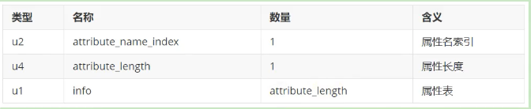

  - Code属性的格式：

    - Code属性就是存放方法体里面的代码。但是，并非所有方法表都有Code属性。像接口或者抽象方法，他们没有具体的方法体，因此也就不会有Code属性了。

    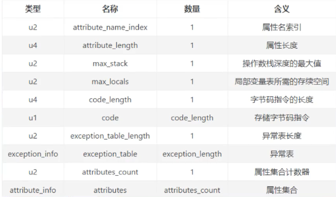

  - 从上表中可以看出，在一个属性中，还可以嵌套其他的属性表。

  - Code属性中LineNumberTable属性的格式：

    - LineNumberTable属性是用来描述Java源码行号与字节码行号之间的对应关系。这个属性可以用来在调试的时候定位代码执行的行数。
    - start_pc，即字节码行号；line_number，即Java源代码行号。
    - 在Code属性的属性表中，LineNumberTable属性可以按照任意顺序出现，此外，多个LineNumberTable属性可以共同表示一个行号在源文件中表示的内容，即LineNumberTable属性不需要与源文件的行一一对应。

    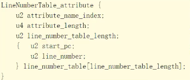

  - Code属性中LocalVariableTable属性的格式：

    - LocalVariableTable属性被调试器用于确定方法在执行过程中局部变量的信息
    - 每个局部变量最多只能有一个LocalVariableTable属性。
    - start pc+1ength表示这个变量在字节码中的生命周期起始和结束的偏移位置（this生命周期从头到尾）。
    - index就是这个变量在局部变量表中的槽位（槽位可复用）。
    - name就是变量名称。
    - Descriptor表示局部变量类型描述。

    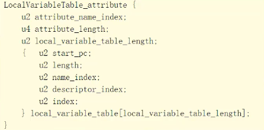

## 3、javap指令

- javap是jdk自带的反解析工具。它的作用就是根据class字节码文件，反解析出当前类对应的code区（字节码指令）
  、局部变量表、异常表和代码行偏移量映射表、常量池等信息。
- 通过局部变量表，我们可以查看局部变量的作用域范围、所在槽位等信息，甚至可以看到槽位复用等信息。
- 在前端编译器中，如果直接javac xx.java，就不会在生成对应的局部变量表等信息。如果使用javac-gxx.java就可以生成所有相关信息了。
- 如果使用eclipse或IDEA，则默认情况下，eclipse、IDEA在编译时会生成局部变量表、指令和代码行偏移量映射表等信息的。
- javap指令的相关参数：
  - 格式：`javap <options选项> <classes字节码文件>`。
  - -public：仅显示公共的类和成员。
  - -protected：显示受保护的和公共的类和成员。
  - -p/-private：显示所有类和成员。
  - -package：显示程序包、受保护的和公共的类和成员（默认权限及以上）。
  - -sysinfo：显示正在处理的类的系统信息。
  - -constants：显示静态最终常量。
  - -s：输出内部字段和方法的类型签名。
  - -l：输出行号和局部变量表。
  - -c：对代码进行反汇编，相当于输出Code属性中的字节码指令。
  - -v/-verbose：输出附加信息，包括-s、-l、/c。

