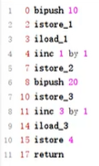
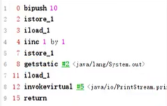
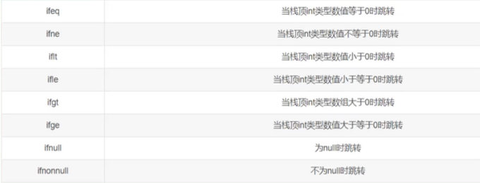
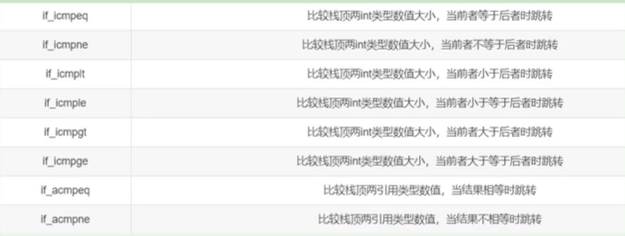

## 1、字节码指令概述

- 方法的字节码指令在方法表中各个方法的Code属性中。

- Java字节码对于虚拟机，就好像汇编语言对于计算机，属于基本执行指令。

- Java虚拟机的指令由一个字节长度的、代表着某种特定操作含义的数字（称为操作码，Opcode）以及跟随其后的零至多个代表此操作所需参数（称为操作数，Operands）而构成。即`操作码 操作数`

- 由于Java虚拟机采用面向操作数栈而不是寄存器的结构，所以大多数的指令都不包含操作数，只有一个操作码。

- 由于限制了Java虚拟机操作码的长度为一个字节（即0~255），这意味着指令集的操作码总数不可能超过256条。

- 执行模型：

  - 如果不考虑异常处理的话，那么Java虚拟机的解释器可以使用下面这个伪代码当做最基本的执行模型来理解。

  ```java
  do{
  	自动计算PC寄存器的值加1;
  	根据PC寄存器的指示位置,从字节码流中取出操作码;
  	if(字节码存在操作数)
  		从字节码流中取出操作数;
  	执行操作码所定义的操作;
  }while(字节码长度>0);
  ```

- 字节码与数据类型：

  - 在Java虚拟机的指令集中，大多数的指令都包含了其操作所对应的数据类型信息。例如，iload指令用于从局部变量表中加载int型的数据到操作数栈中，而fload指令加载的则是float类型的数据。
  - 对于大部分与数据类型相关的字节码指令，它们的操作码助记符中都有特殊的字符来表明专门为哪种数据类型服务：
    - i代表对int类型的数据操作，
    - l代表long
    - s代表short
    - b代表byte
    - c代表char
    - f代表float
    - d代表double
    - a代表引用类型
  - 也有一些指令的助记符中没有明确地指明操作类型的字母，如arraylength指令，它没有代表数据类型的特殊字符，但操作数永远只能是一个数组类型的对象。
  - 还有另外一些指令，如无条件跳转指令goto则是与数据类型无关的。
  - 大部分的指令都没有支持整数类型byte、char和short，甚至没有任何指令支持boolean类型。编译器会在编译期或运行期将byte和short类型的数据带符号扩展（sign-Extend）为相应的int类型数据，将boolean和char类型数据零位扩展（Zero-Extend）为相应的int类型数据。与之类似，在处理boolean、byte、short和char类型的数组时，也会转换为使用对应的int类型的字节码指令来处理。因此，大多数对于boolean、byte、short和char类型数据的操作，实际上都是使用相应的int类型作为运算类型。

- 指令分类：

  - 加载与存储指令
  - 算术指令
  - 类型转换指令
  - 对象的创建与访问指令
  - 方法调用与返回指令
  - 操作数栈管理指令
  - 比较控制指令
  - 异常处理指令
  - 同步控制指令

- 一个指令，可以从局部变量表、常量池、堆中对象、方法调用、系统调用中等取得数据，这些数据（可能是值，可能是对象的引用）被压入操作数栈。

- 一个指令，也可以从操作数栈中取出一到多个值（pop多次），完成赋值、加减乘除、方法传参、系统调用等等操作。


## 2、字节码指令

- 加载与存储指令：
  - 作用：将数据从栈帧中的局部变量表和操作数栈之间来回传递。加载一般指压栈到操作数栈中（从局部变量表或常量池），存储一般指从操作数栈出栈存入局部变量表中。
  - tips：
    - 指令助记符中，有一部分是以尖括号结尾的（例如`iload_<n>`）。这些指令助记符实际上代表了一组指令（例如`iload_<n>`代表了`iload_0`、`iload_1`、`iload_2`和`iload_3`这几个指令）。这几组指令都是某个带有一个操作数的通用指令（例如`iload`）的特殊形式，对于这若干组特殊指令来说，它们表面上没有操作数，不需要进行取操作数的动作，但操作数都隐含在指令中。
    - 除此之外，它们的语义与原生的通用指令完全一致（例如`iload_0`的语义与操作数为0时的`iload`指令语义完全一致）。在尖括号之间的字母指定了指令隐含操作数的数据类型，n代表非负的整数，i代表是int类型数据，l代表long类型，f代表float类型，d代表double类型。
    - 操作byte、char、short和boolean类型数据时，经常用int类型的指令来表示。
  - 局部变量压栈指令：
    - 局部变量压栈指令将给定的局部变量表中的数据压入操作数栈。
    - 这类指令大体可以分为：
      - `xload_<n>`（x为i、l、f、d、a，n为0到3）
      - `xload 局部变量表索引`（x为i、l、f、d、a）
      - 说明：在这里，x的取值表示数据类型。
    - 指令xload_n表示将第n个局部变量（局部变量索引）压入操作数栈，比如iload_1、fload_0、aload_0等指令。其中aload_n表示将一个对象引用压栈。
    - 指令xload通过指定参数的形式，把局部变量压入操作数栈，当使用这个命令时，表示局部变量的数量可能超过了4个，比如指令iload、fload等。
  - 常量入栈指令：
    - 常量入栈指令的功能是将常数压入操作数栈，根据数据类型和入栈内容的不同，又可以分为const系列、push系列和ldc指令。
    - 指令const系列：用于对特定的常量入栈，入栈的常量隐含在指令本身里。
      - 指令有：`iconst_<i>`（i从-1到5）、
        `lconst_<l>`（l从0到1）、`fconst_<f>`（f从0到2）、`dconst_<d>`（d从0到1）、`aconst_null`。
      - 比如，`iconst_m1`将-1压入操作数栈；`iconst_x`（x为0到5）将x压入栈;
        `lconst_0`、`lconst_1`分别将长整数0和1压入栈；`fconst_0`、`fconst_1`、`fconst_2`分别将浮点数0、1、2压入栈；`dconst_0`和`dconst_1`分别将double型0和1压入栈;
        `aconst_null`将null压入操作数栈.
      - 从指令的命名上不难找出规律，指令助记符的第一个字符总是喜欢表示数据类型，i表示整数，l表示长整数，f表示浮点数，d表示双精度浮点，习惯上用a表示对象引用。如果指令隐含操作的参数，会以下划线形式给出。
    - 指令push系列（只针对int）：
      - 主要包括`bipush`和`sipush`。它们的区别在于接收数据长度的的不同.
      - `bipush`接收8位二进制作为参数（-128~127），`sipush`接收16位二进制（-32768~32767），它们都将参数压入栈。
    - 指令ldc系列：
      - 如果以上指令都不能满足需求，那么可以使用万能的`ldc`指令，它可以接收一个8位的参数，该参数指向常量池中的int、float或者String的索引，将指定的内容压入堆栈。
      - 类似的还有`ldc_w`，它接收两个8位参数，能支持的索引范围大于ldc。
      - 如果要压入的元素是long或者double类型的，则使用`ldc2_w`指令，使用方式都是类似的。
  - 出栈装入局部变量表指令：
    - 出栈装入局部变量表指令用于将操作数栈中栈顶元素弹出后，装入局部变量表的指定位置，用于给局部变量赋值。
    - 这类指令主要以store的形式存在，比如`xstore 局部变量表索引`（x为i、l、f、d、a）、`xstore_n`（x为i、l、f、d、a，n为0至3）。
    - 其中，指令`istore_n`将从操作数栈中弹出一个整数，并把它赋值给局部变量索引n位置。
    - 指令`xstore`由于没有隐含参数信息，故需要提供一个byte类型的参数类指定目标局部变量表的位置。
    - 似像store这样的命令需要带一个参数，用来指明将弹出的元素放在局部变量表的第几个位置。但是，为了尽可能压缩指令大小，使用专门的`istore_1`指令表示将弹出的元素放置在局部变量表第1个位置。
    - 由于局部变量表前几个位置总是非常常用，因此这种做法虽然增加了指令数量，但是可以大大压缩生成的字节码的体积。


- 算数指令：
  - 作用：算术指令用于对两个操作数栈上的值进行某种特定运算，并把结果重新压入操作数栈。
  - 分类：大体上算术指令可以分为两种：对整型数据进行运算的指令与对浮点类型数据进行运算的指令。
  - 运算时的溢出：数据运算可能会导致溢出，例如两个很大的正整数相加，结果可能是一个负数。其实Java虚拟机规范并无明确规定过整型数据溢出的具体结果，仅规定了在处理整型数据时，只有除法指令以及求余指令中当出现除数为0时会导致虚拟机抛出异常ArithmeticException。（如果除数是double 0.0，则结果为无穷大Infinity）
  - 运算模式：
    - 向最接近数舍入模式：JVM要求在进行浮点数计算时，所有的运算结果都必须舍入到适当的精度，非精确结果必须舍入为可被表示的最接近的精确值，如果有两种可表示的形式与该值一样接近，将优先选择最低有效位为零的；
    - 向零舍入模式：将浮点数转换为整数时，采用该模式，该模式将在目标数值类型中选择一个最接近但是不大于原值的数字作为最精确的舍入结果。
  - NaN值使用：当一个操作产生溢出时，将会使用有符号的无穷大表示，如果某个操作结果没有明确的数学定义的话，将会使用NaN值来表示。而且所有使用NaN值作为操作数的算术操作，结果都会返回NaN。
  - 加法指令：iadd、ladd、fadd、dadd
  - 减法指令：isub、lsub、fsub、dsub
  - 乘法指令：imul、lmul、fmul、dmul
  - 除法指令：idiv、ldiv、fdiv、ddiv
  - 求余(remainder)指令：irem、lrem、frem、drem
  - 取反(negation)指令：ineg、lneg、fneg、dneg
  - 自增指令：iinc
  - 位运算指令，又可分为：
    - 位移指令：ishl、ishr、iushr、lshl、lshr、lushr
    - 按位或指令：ior、lor
    - 按位与指令：iand、land
    - 按位异或指令：ixor、lxor
  - 比较指令：dcmpg、dcmpl、fcmpg、fcmpl、lcmp
- 比较指令的说明：
  - 比较指令的作用是比较栈顶两个元素的大小，并将比较结果入栈。
  - 比较指令有：dcmpg、dcmpl、fcmpg、fcmpl、lcmp。
    首字符d表示double类型，f表示float，l表示long。
  - 对于double和float类型的数字，由于NaN的存在，各有两个版本的比较指令。它们的区别在于在数字比较时，若遇到NaN值，处理结果不同。
  - 指令lcmp针对long型整数，由于long型整数没有NaN值，故无需准备两套指令。
  - 举例：
    - 指令fcmpg和fcmpl都从栈中弹出两个操作数，并将它们做比较，设栈顶的元素为v2，栈顶顺位第2位的元素为v1，若v1=v2，则压入0；若v1>v2则压入1；若v1<v2则压入-1。
    - 两个指令的不同之处在于，如果遇到NaN值，fcmpg会压入1，而fcmpl会压入-1。

- i++++i：

  - 如果不涉及i++或++i参与运算，而是单独使用，二者在字节码层面上可以看出没有区别，都只是一个自增操作。

  - 如果涉及赋值运算：

    - 对于代码：

      ```java
      public void method7(){
      	int i=10; 
          int a=i++;
          int j=20;
          int b=++j;
      }
      ```

    - 字节码指令为：

      

    - 可以看出；i++是将i先入操作数栈再自增，++i是先自增再如操作数栈。

  - 如果是自赋值：

    - 对于代码：

      ```java
      public void methods(){
      	int i=10; 
          i=i++; 
          System.out.println(i);//10
      }
      ```

    - 字节码指令为：

      


- 类型转换指令：
  - 类型转换指令可以将两种不同的数值类型进行相互转换。
  - 这些转换操作一般用于实现用户代码中的显式类型转换操作，或者用来处理字节码指令集中数据类型相关指令无法与数据类型一一对应的问题。
  - 宽化类型转换：
    - Java虚拟机直接支持从小范围类型向大范围类型的安全转换，也就是不需要代码中进行强转。
    - 从int类型到long、float或者doube类型。对应的指令为：i2l、i2f、i2d。
    - 从long类型到float、double类型。对应的指令为：l2f、l2d。
    - 从float类型到double类型。对应的指令为：f2d。
    - 宽化类型转换是不会因为超过目标类型最大值而丢失信息的，例如，从int转换到long，或者从int转换到double，都不会丢失任何信息，转换前后的值是精确相等的。
    - 从int、long类型数值转换到float，或者long类型数值转换到double时，将可能发生精度丢失——可能丢失掉几个最低有效位上的值，转换后的浮点数值是根据IEEE754最接近舍入模式所得到的正确整数值。
    - 尽管宽化类型转换实际上是可能发生精度丢失的，但是这种转换永远不会导致Java虚拟机抛出运行时异常。
  - 窄化类型转换：
    - 从int类型至byte、short或者char类型。对应的指令有：i2b、i2s、i2c。
    - 从long类型到int类型。对应的指令有：l2i。
    - 从float类型到int或者long类型。对应的指令有：f2i、f2l。
    - 从double类型到int、long或者float类型。对应的指令有：d2i、d2l、d2f。
    - 从long类型转换为byte类型：先l2i，再i2b。
    - 窄化类型转换可能会导致转换结果具备不同的正负号、不同的数量级，因此，转换过程很可能会导致数值丢失精度。
    - 尽管数据类型窄化转换可能会发生上限溢出、下限溢出和精度丢失等情况，但是Java虚拟机规范中明确规定数值类型的窄化转换指令永远不可能导致虚拟机抛出运行时异常。
    - 当将一个浮点值窄化转换为整数类型T（int或long类型之一）的时候，将遵循以下转换规则：
      - 如果浮点值是NaN，那转换结果就是int或long类型的0。
      - 如果浮点值不是无穷大的话，浮点值使用IEEE754的向零舍入模式取整，获得整数值v，如果v在目标类型T（int或long）的表示范围之内，那转换结果就是v。否则，将根据v的符号，转换为T所能表示的最大或者最小正数.
    - 当将一个double类型窄化转换为float类型时，将遵循以下转换规则：通过向最接近数舍入模式舍入一个可以使用float类型表示的数字。最后结果根据下面这3条规则判断：
      - 如果转换结果的绝对值太小而无法使用float来表示，将返回float类型的正负零。
      - 如果转换结果的绝对值太大而无法使用float来表示，将返回float类型的正负无穷大。
      - 对于double类型的NaN值将按规定转换为float类型的NaN值。


- 对象的创建与访问指令：
  - Java是面向对象的程序设计语言，虚拟机平台从字节码层面就对面向对象做了深层次的支持。有一系列指令专门用于对象操作，可进一步细分为创建指令、字段访问指令、数组操作指令、类型检查指令。
  - 创建指令：
    - 虽然类实例和数组都是对象，但Java虚拟机对类实例和数组的创建与操作使用了不同的字节码指令：
    - 创建类实例的指令：
      - 创建类实例的指令：`new 引用类型的常量池索引`。
      - 它接收一个操作数，为指向常量池的索引，表示要创建的类型，执行完成后，将对象的引用压入操作数栈。
    - 创建数组的指令：
      - 创建数组的指令：`newarray`、`anewarray`、`multianewarray`。
      - `newarray 基本数据类型`：创建基本类型数组。
      - `anewarray 引用类型的常量池索引`：创建引用类型数组。
      - `multianewarray 类型的常量池索引`：创建多维数组。
      - 创建数组的指令会将该指令执行之前压入操作数栈的整数作为数组的大小。
  - 字段访问指令：
    - 对象创建后，就可以通过对象访问指令获取对象实例或数组实例中的字段或者数组元素。
    - 访问类字段（static字段，或者称为类变量）的指令：`getstatic`、`putstatic`
    - 访问类实例字段（非static字段，或者称为实例变量）的指令：`getfield`、`putfield`
    - `getfield 常量池索引`：根据栈顶的常量池索引，获取常量值索引对应的字段的值，并且再压入栈中。
    - `putfield 变量值 常量池索引`：根据栈顶的变量值和常量池索引，给常量池索引对应的字段赋值。
  - 数组操作指令：
    - 数组操作指令主要有：xastore和xaload指令。分别表示从操作数栈到堆空间中的数组，和从数组元素压入操作数栈。
    - 把一个数组元素加载到操作数栈的指令：bload、caload、saload、iaload、laload、faload、daload、aaload。
    - 将一个操作数栈的值存储到数组元素中的指令：bastore、castore、sastore、iastore、lastore、fastore、dastore、aastore。
    - 指令`xaload`表示将数组的元素压栈（x表示数据类型），比如saload、caload分别表示压入short数组和char数组。指令xaload在执行时，要求操作数中栈顶元素为数组索引i，栈顶顺位第2个元素为数组引用a，该指令会弹出栈顶这两个元素，并将a[i]重新压入堆栈。
    - 指令`xastore`则专门针对数组操作（x表示数据类型），以iastore为例，它用于给一个int数组的给定索引赋值。在iastore执行前，操作数栈顶需要以此准备3个元素：值、索引、数组引用，iastore会弹出这3个值，并将值赋给数组中指定索引的位置。
  - 类型检查指令：
    - 检查类实例或数组类型的指令：instanceof、checkcast。
    - 首先，将所要进行类型检查的类实例或数组压入操作数栈，
    - 指令`checkcast 所要转换为的类型的常量池索引`用于检查类型强制转换是否可以进行。如果可以进行，那么checkcast指令不会改变操作数栈，否则它会抛出ClassCastException异常。
    - 指令`instanceof 类型的常量池索引`用来判断给定对象是否是某一个类的实例，它会将判断结果压入操作数栈。


- 方法调用与返回指令：
  - 方法调用指令：
    - 方法调用指令：invokevirtual、invokeinterface、invokespecial、invokestatic、invokedynamic。
    - 方法调用指令后跟的操作数是常量池中的方法引用，并且此时操作数栈栈顶是调用该方法的对象（对于非静态方法）。
    - `invokevirtual`指令用于调用对象的实例方法，根据对象的实际类型进行分派（虚方法分派），支持多态。这也是Java语言中最常见的方法分派方式。
    - `invokeinterface`指令用于调用接口方法，它会在运行时搜索由特定对象所实现的这个接口方法，并找出适合的方法进行调用。
    - `invokespecial`指令用于调用一些需要特殊处理的实例方法，包括实例初始化方法（构造器）、私有方法和父类方法。这些方法都是静态类型绑定的（不存在方法重写），不会在调用时进行动态派发。
    - `invokestatic`指令用于调用命名类中的类方法（static方法）。这是静态绑定的。
    - `invokedynamic`调用动态绑定的方法，这个是J0K1.7后新加入的指令。用于在运行时动态解析出调用点限定符所引用的方法，并执行该方法。
    - 前面4条调用指令的分派逻辑都固化在java虚拟机内部，而invokedynamic指令的分派逻辑是由用户所设定的引导方法决定的。
  - 方法返回指令：
    - 方法调用结束前，需要进行返回。方法返回指令是根据返回值的类型区分的。
    - 包括`ireturn`（当返回值是boolean、byte、char、short和int 类型时使用）、`lreturn`、`freturn`、`dreturn`和`areturn`。
    - 另外，`return`指令供声明为void的方法、实例初始化方法以及类和接口的类初始化方法使用。
    - 通过`ireturn`指令，将当前函数操作数栈的顶层元素弹出，并将这个元素压入调用者函数的操作数栈中（因为调用者非常关心函数的返回值），所有在当前函数操作数栈中的其他元素都会被丢弃。
    - 如果当前返回的是synchronized方法，那么还会执行一个隐含的monitorexit指令释放锁，退出临界区。
    - 最后，会丢弃当前方法的整个帧，恢复调用者的帧，并将控制权转交给调用者。


- 操作数栈管理指令：
  - 如同操作一个普通数据结构中的堆栈那样，JVM提供的操作数栈管理指令，可以用于直接操作操作数栈的指令。
  - 这类指令包括如下内容：
    - 将一个或两个元素从栈顶弹出，并且直接废弃：`pop`，`pop2`；
    - 复制栈顶一个或两个数值并将复制值或双份的复制值重新压入栈顶：`dup`，`dup2`，`dup_x1`，`dup2_x1`，`dup_x2`，`dup2_x2`。
    - 将栈最顶端的两个Slot数值位置交换：`swap`。Java虚拟机没有提供交换两个64位数据类型（
      long、double）数值的指令。
    - 指令`nop`，是一个非常特殊的指令，它的字节码为0x00。和汇编语言中的nop一样，它表示什么都不做。这条指令一般可用于调试、占位等。
    - 这些指令属于通用型，对栈的压入或者弹出无需指明数据类型。
  - 说明：
    - 不带`_x`的指令是复制栈顶数据并压入栈顶。包括两个指令，dup和dup2。dup的系数代表要复制的Slot个数。
      - dup开头的指令用于复制1个Slot的数据。例如1个int或1个reference类型数据.
      - dup2开头的指令用于复制2个slot的数据。例如1个long，或2个int，或1个int+1个float类型数据.
    - 带`_x`的指令是复制栈顶数据并插入栈顶以下的某个位置。共有4个指令，dup_x1，dup2_x1，dup_x2，dup2_x2。对于带`_x`的复制插入指令，只要将指令的dup和x的系数相加，结果即为需要插入的位置。
      - dup_x1插入位置：1+1=2，即栈顶2个slot下面
      - dup_x2插入位置：1+2=3，即栈顶3个slot下面
      - dup2_x1插入位置：2+1=3，即栈顶3个slot下面
      - dup2_x2插入位置：2+2=4，即栈顶4个slot下面
    - pop：将栈顶的1个slot数值出栈。例如1个short类型数值
    - pop2：将栈顶的2个slot数值出栈。例如1个double类型数值，或者2个int类型数值


- 控制转移指令：

  - 比较指令：见算数指令中。

  - 条件跳转指令：

    - 条件跳转指令通常和比较指令结合使用。在条件跳转指令执行前，一般可以先用比较指令进行栈顶元素的准备，然后进行条件跳转。
    - 条件跳转指令有：ifeq，iflt，ifle，ifne，ifgt，ifge，ifnull，ifnonnull。这些指令都接收两个字节的操作数，用于计算跳转的位置（16位符号整数作为当前位置的offset）。
    - 它们的统一含义为：弹出栈顶元素，测试它是否满足某一条件，如果满足条件，则跳转到给定位置。

    

    - 对于boolean、byte、char、short类型的条件分支比较操作，都是使用int类型的比较指令完成
    - 对于long、float、double类型的条件分支比较操作，则会先执行相应类型的比较运算指令，运算指令会返回一个整型值到操作数栈中，随后再执行int类型的条件分支比较操作来完成整个分支跳转

  - 比较条件跳转指令：

    - 类似于比较指令和条件跳转指令的结合体，它将比较和跳转两个步骤合二为一。
    - 这类指令有：if_icmpeg、if_icmpne、if_icmplt、if_icmpgt、if_icmple、if_icmpge、if_acmpeq和if_acmpne。
    - 其中指令助记符加上“if”后，以字符“i”开头的指令针对int型整数操作（也包括short和byte类型），以字符“a”开头的指令表示对象引用的比较。

    

    - 这些指令都接收两个字节的操作数作为参数，用于计算跳转的位置。同时在执行指令时，栈顶需要准备两个元素进行比较。指令执行完成后，栈顶的这两个元素被清空，且没有任何数据入栈。如果预设条件成立，则执行跳转，否则，继续执行下一条语句。

  - 多条件分支跳转指令：

    - 多条件分支跳转指令是专为switch-case语句设计的，主要有tableswitch和lookupswitch。
    - `tableswitch`要求多个条件分支值是连续的，它内部只存放起始值和终止值，以及若干个跳转偏移量，通过给定的操作数index，可以立即定位到跳转偏移量位置，因此效率比较高。|
    - `lookupswitch`内部存放着各个离散的case-offset对，每次执行都要搜索全部的case-offset对，找到匹配的case值，并根据对应的offset计算跳转地址，因此效率较低。

  - 无条件跳转指令：

    - 目前主要的无条件跳转指令为`goto`。指令goto接收两个字节的操作数，共同组成一个带符号的整数，用于指定指令的偏移量，指令执行的目的就是跳转到偏移量给定的位置处。
    - 如果指令偏移量太大，超过双字节的带符号整数的范围，则可以使用指令`goto_w`，它和goro有相同的作用，但是它接收4个字节的操作数，可以表示更大的地址范围。


- 异常处理指令：
  - 抛出异常指令：
    - `athrow`指令：在Java程序中显示抛出异常的操作（throw语句）都是由athrow指令来实现。
    - 除了使用throw语句显示抛出异常情况之外，JVM规范还规定了许多运行时异常会在其他Java虚拟机指令检测到异常状况时自动抛出。例如，在之前介绍的整数运算时，当除数为零时，虚拟机会在idiv或ldiv指令中抛出ArithmeticException异常。
    - 正常情况下，操作数栈的压入弹出都是一条条指令完成的。唯一的例外情况是在抛异常时，Java虚拟机会清除操作数栈上的所有内容，而后将异常实例压入调用者操作数栈上。
    - 如果在方法声明处用throws抛出异常，会在方法的Exceptions属性中显示。
  - 异常处理与异常表：
    - 处理异常：
      - 在Java虚拟机中，处理异常（catch语句）不是由字节码指令来实现的（早期使用jsr、ret指令），而是采用异常表来完成的。
    - 异常表：
      - 如果一个方法定义了一个try-catch 或者try-finally的异常处理，就会创建一个异常表（在Code属性中）。
      - 它包含了每个异常处理或者finally块的信息。异常表保存了每个异常处理信息。比如：起始位置、结束位置（try包裹的范围）、程序计数器记录的代码处理的偏移地址（catch的位置）、被捕获的异常类在常量池中的索引（捕获到的异常类型）。
    - 当一个异常被抛出时，JVM会在当前的方法里寻找一个匹配的处理，如果没有找到，这个方法会强制结束并弹出当前栈帧，并且异常会重新抛给上层调用的方法（在调用方法栈帧）。如果在所有栈帧弹出前仍然没有找到合适的异常处理，这个线程将终止。如果这个异常在最后一个非守护线程里抛出，将会导致JVM自己终止，比如这个线程是个main线程。
    - 不管什么时候抛出异常，如果异常处理最终匹配了所有异常类型，代码就会继续执行。在这种情况下，如果方法结束后没有抛出异常，仍然执行finally块，在return前，它直接跳到finally块来完成目标。


- 同步控制指令：
  - java虚拟机支持两种同步结构：方法级的同步和方法内部一段指令序列的同步，这两种同步都是使用monitor（监视器）来支持的。
  - 方法级的同步：
    - 是隐式的，即无须通过字节码指令来控制，它实现在方法调用和返回操作之中。
    - 虚拟机可以从方法常量池的方法表结构中的ACC_SYNCHRONIZED访问标志得知一个方法是否声明为同步方法；当调用方法时，调用指令将会检查方法的ACC_SYNCHRONIZED访问标志是否设置。
      - 如果设置了，执行线程将先持有同步锁，然后执行方法。最后在方法完成（无论是正常完成还是非正常完成）时释放同步锁。
      - 在方法执行期间，执行线程持有了同步锁，其他任何线程都无法再获得同一个锁。
      - 如果一个同步方法执行期间抛出了异常，并且在方法内部无法处理此异常，那这个同步方法所持有的锁将在异常抛到同步方法之外时自动释放。
  - 方法内指定指令序列（同步代码块）的同步：
    - 同步一段指令集序列：通常是由java中的synchronized语句块来表示的。jvm的指令集有monitorenter和monitorexit 两条指令来支持synchronized关键字的语义。
    - 当一个线程进入同步代码块时，它使用monitorenter指令请求进入。如果当前对象的监视器计数器为0，则它会被准许进入，若为1，则判断持有当前监视器的线程是否为自己，如果是，则进入，否则进行等待，直到对象的监视器计数器为0，才会被允许进入同步块。
    - 当线程退出同步块时，需要使用monitorexit声明退出。在Java虚拟机中，任何对象都有一个监视器与之相关联，用来判断对象是否被锁定，当监视器被持有后，对象处于锁定状态。
    - 指令monitorenter和monitorexit在执行时，都需要在操作数栈顶压入对象，之后monitorenter和monitorexit的锁定和释放都是针对这个对象的监视器进行的。
    - 在存在同步代码块时，也会生成异常表。在同步代码块内产生异常时，无论产生什么异常，都会先monitorexit释放锁，再将异常抛出给方法的调用者。


