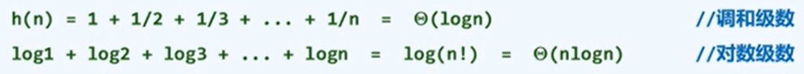

## 1、绪论

- 计算：借助某种工具，按照一定规则，以明确而机械的形式进行信息处理。

> 既是研究对象，也是研究目标。
>
> 研究计算规律和技巧，实现高效的计算，低资源消耗。

- 计算机：一种计算模型和信息处理工件。
- 算法：特定计算模型下，旨在解决特定问题的指令序列。
  - 输入，待处理的信息。
  - 输出：经处理的信息。
  - 正确性：可以解决的问题。
  - 确定性：任意算法都可以描述为一个由基本操作组成的序列。
  - 可行性：每一基本操作都可实现，并且可在常数时间内完成。
  - 有穷性：对任意输入，经过有穷步操作可以得到输出。
  - 程序未必是算法。
- 好的算法：效率，速度尽可能快，存储空间尽可能少。
- 计算模型的度量：算法分析
  - 正确性。
  - 性能（成本）：运行时间和所需存储空间。
  - 规模往往是决定计算成本的主要因素。
  - 空间复杂度一般指算法所需的额外的存储空间的大小。
- p评价算法的成本：
  - 令 T(P) = 用算法A求解问题P的实例所需的计算成本。
  - 则 T(n) 记为所有规模为n的实例P中，计算成本T(P)的最大值。
- 同一问题有多种算法：抽象出一个理想的平台或模型。


## 2、两个算法模型

- 图灵机：
  - 均匀划分单元格，每个单元格中一个字符，默认 ‘#’。
  - 字符的种类有限。
  - 读写头，总是对准某一个单元格，并可存储或改写。
  - 图灵机总是处于有限种状态的一种，每经过一个节拍，按照一定规则转向另一种状态。
  - 转换方式，根据输入转换状态的规则。
- RAM（Random Access Machine）：
  - 寄存器顺序编号，总数没有限制。
  - 每个基本操作仅需常数时间。

## 3、时间复杂度

- 以上两个模型是对一般计算工具的简化与重新。
- 算法的运行时间 转化为 算法需要执行的基本操作次数。

- 渐进分析：大 O 记号

  - 定义

    

  - 当问题规模足够大后，计算成本如何增长。

  - 常系数和低次项可忽略。

    

  - 可以认为是给出了时间复杂度的上界。

    

- 渐进分析的其他记号：

  - Ω 时间复杂度的的下界。
  - Θ 时间复杂度的确界。

- 大 O 记号的刻度：

  - 常数复杂度：`O(1)`；这类算法的效率最高。
    - 一般是顺序执行。
    - 循环、分支转向和递归有时也可几乎达到常数复杂度。
  - 对数复杂度：`O(log n)`；也很高效，复杂度无限接近常数，比所有多项式复杂度都低。
    - 常底数无所谓。
    - 常数次幂无所谓。
    - 对数多项式可进行简化。
  - 多项式复杂度：`O(n^c)`；
    - 线性复杂度`O(n)`；
  - 指数复杂度：`O(2^n)`；计算成本一般认为不可忍受，比所有多项式复杂度都高。
    - 许多问题的`O(2^n)`算法一般是显而易见的，但`O(n^c)`的算法较难找到。

## 4、算法分析

- 两个任务 = 正确性（不变性 × 单调性）+ 复杂度。

- 复杂度分析：

  - 迭代：级数求和。
  - 递归：递归跟踪 + 递归方程。

- 级数：

  - 算术级数（等差数列的前 n 项和）：与末项平方同阶。

  - 幂方级数（从1到n的 k 次方的前 n项和）：比幂次高出一阶。

  - 几何级数（等比数列的前 n 项和）：与末项同阶。

  - 收敛级数（存在极限）：常数复杂度。分数操作次数表征概率。

  - 未必收敛当时长度有限，具体分析。

    

- 以下程序的复杂度都是`O(n^2)`：

  ```C++
  //No.1
  for(int i=0;i<=n;i++)
  for(int j=1;j<=n;j++)     
  //No.2
  for(int i=0;i<=n;i++)
  for(int j=1;j<i;j++) 
  //No.3
  for(int i=0;i<=n;i++)
  for(int j=1;j<i;j+=200) 
  ```

- 以下程序的复杂度是`O(n)`：

  ```c++
  for(int i=0;i<=n;i<<=1)
  for(int j=1;j<i;j++)
  ```

  图解：

  

- 以下程序的复杂度是`O(log n * 2^log n)`：

  ```c++
  for(int i=0;i<=n;i++)
  for(int j=1;j<i;j+=j)
  ```

  - 可以看出，i 取3~4、5~8、9~16 时，第二层循环中的操作数是相同的。
  - 先确定每次操作数为 k 的通项公式：`k * 2^(k-1)`。
  - 操作数是几何级数，和与其末项 `log2 n` 同阶。
  - 代入 k 可得`O(log n * 2^log n)`。

- 起泡排序：

  - 问题：给定n个整数，将它们按（非降）序排列。
  - 观察：有序 / 无序序列中，任意 / 总有一对相邻元素顺序/逆序。
  - 扫描交换：依次比较每一对相邻元素，如有必要，交换之若整趟扫描都没有进行交换，则排序完成；否则，再做一趟扫描交换。
  - 不变性：经k轮扫描交换后，最大的k个元素必然就位。例如，经过第一轮扫描，最大的元素必然在序列的最后；经过第二轮扫描，第二大的元素必然在序列的倒数第二个。
  - 单调性：经k轮扫描交换后，问题规模缩减至n-k。同不变性，因为最大的元素已经在正确的位置。
  - 正确性：经至多n趟扫描后，算法必然终止，且能给出正确解答。
  - 复杂度是 `O(n^2)`。
  - 示意图：

  

- 封底估算：

  - 建立封底估算时间概念：一天 ~ 10^5 s , 一世纪 ~ 10^9 s 。

## 5、迭代与递归

- 递归：重复调用函数自身实现循环。不断深层调用函数，直到函数有返回时逐层返回。可以认为是树状结构。

- 迭代：利用变量的原值推出新值，函数内某段代码实现循环。可以认为是环状结构。

- 所有的迭代可以转换为递归，但递归不一定可以转换为迭代。

- 减而治之的思想：划分为两个子问题，其中一个是平凡问题（复杂度小于原问题），另一个是原问题规模缩减的问题。

- 递归跟踪：

- 递归方程：`T(n)=T(n-1)+T(0)`，为了求解规模为n的问题，分为求规模为n-1的问题，再加上平凡问题所需的时间T(0)。平凡问题也可成为递归基，复杂度为T(0)。

- 例1：数组求和：线性递归(复杂度与直接求和相同，还是`O(n)`)

  ```c++
  int sum(int A[], int n){
      return (n < 1) ? 0 : sum(A, n-1)+A[n-1];
  }
  ```

- 例2：数组倒置

  ```c++
  void reverse(int* A, int lo, int hi){
      if(lo < hi){
          swap(A[lo], A[hi]);
          reverse(A, lo+1, hi-1);
      }
  }
  ```

- 分而治之的思想：划分为多个（一般是两个）规模相当的问题。

- 例1：数组求和：二分递归(复杂度与直接求和相同，还是`O(n)`)

  ```c++
  int sum(int A[], int lo, int hi){
      if(lo == hi){
          return A[lo];
      }
      int mi = (lo + hi) >> 1;
      return sum(A, lo, mi) + sum(A, mi+1, hi);
  }
  ```

- 例2：Max2：从数组区间中找出最大的两个整数。

  ```c++
  void max2(int A[], int lo, int hi, int &x1, int &x2){
      if(A[x1 = lo] < A[x2 = lo + 1]) swap(x1, x2);
      for(int i = lo + 2; i < hi; i++)
          if(A[x2] < A[i])
              if(A[x1] < A[x2 = i])
                  swap(x1, x2);
  }
  ```

## 6、动态规划

- 基本思想：问题的最优解如果可以由子问题的最优解推导得到，则可以先求解子问题的最优解，在构造原问题的最优解；若子问题有较多的重复出现，则可以自底向上从最终子问题向原问题逐步求解。
- 使用条件：可分为多个相关子问题，子问题的解被重复使用。

- 斐波那契数列的计算：(复杂度为`O(2^n)`)

  ```c++
  int fib(int n){
      return (2 > n) ? n : fib(n-1) + fib(n-2);
  }
  ```

- 改进1：制表备查.。

- 改进2：颠倒计算方向：自顶而下递归，为自底而上迭代。(复杂度`O(n)`)

  ```c++
  f = 1; g = 0;		//fib(0), fib(-1)
  int fib(int n){
      while(0 < n--){
          g = g + f;
          f = g - f;
      }
      return g;
  }
  ```

- LCS，最长公共子序列。

- 子序列：由序列中若干字符，按相对次序构成。

- 最长公共子序列：两个序列公共子序列中的最长值（可能有多个，可能有歧义）。

  - 记为对序列`A[0,n]和B[0,p]`，最长公共子序列为`LCS(A,B)`。
  
  - 递归基：若 `n=-1`或`m=-1`，则取空序列`("")`。
  
  - 减而治之：如果`A[n]='X'=B[m]`，即两个输入序列的最后一位相同，则取做`LCS(A[0,n),B[0,m))+'X'`。也就是说去掉相同的最后一位，同时向前递归。
  
    
  
  - 分而治之：如果`A[n]≠B[m]`，则在`LCS(A[0,n],B[0,m)`与`LCS(A[0,n),B[0,m])`中取更长者。
  
    
  
  - 实际上，这样的递归算法的复杂度为`O(2^n)`，需要用动态规划。
  
    1. 将所有的子问题列成一张表。
    2. 颠倒计算方向，从`LCS(A[0],B[0])`出发，依此计算所有项。
  
    

