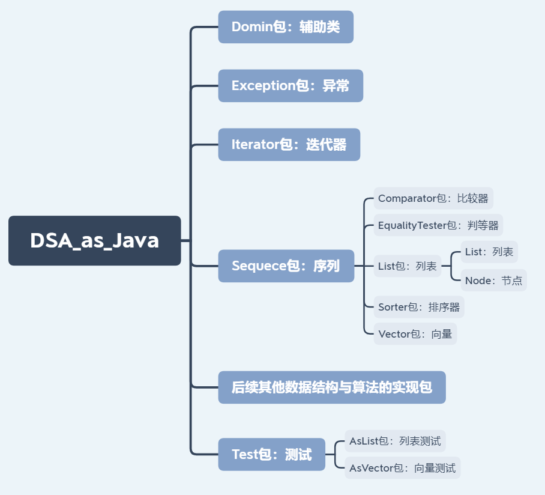
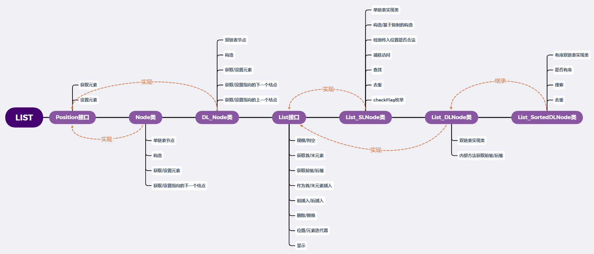

# 3+、列表的Java实现

## 1、项目结构

- 相比上一节的向量的实现，为了整个数据结构更加体系化，将所有实现集合在一个项目下，优化了体系结构。

  

- 核心类体系结构与功能：

  

- 此外，还有选择查询Sorter_Selectsort类和插入排序Sorter_Insertsort类，都实现了排序器接口。

## 2、单向链表

- Position 接口：

  - C++ 中的 Position 指的是指向列表节点的指针，但在 Java 中没有指针。

  - Position 接口给出了获取和设置元素的方法，实际上是对应了指针分别作为右值和左值的功能。

    ```java
    public interface Position<T> {
       public T getElem();
       public T setElem(T e);
    }
    ```

- Node 类：

  - 实现了单向链表的节点，即只有指向后一个元素的数据。

    ```java
    public class Node<T> implements Position<T> {
    
        private T element;      //存储的数据内容
        private Node<T> next;   //指向下一个节点
    
        public Node(){
            this(null, null);
        }
        public Node(T e, Node<T> n){
            this.element = e;
            this.next = n;
        }
    
        @Override
        public T getElem() {
            return this.element;
        }
    
        @Override
        public T setElem(T e) {
            T ori_element = this.element;
            this.element = e;
            return ori_element;
        }
    
        //单链表节点方法
        public void setNext(Node<T> newNext) {
            this.next = newNext;
        }
    
        public Node<T> getNext() {
            return next;
        }
    }
    ```

- List 接口：

  ```java
  public interface List<T> {
      //规模
      public int getSize();
      //判空
      public boolean isEmpty();
      //首元素
      public Position<T> first();
      //末元素
      public Position<T> last();
      //获取给定元素的前驱
      public Position<T> getPrev(Position<T> p)
              throws ExceptionPositionInvalid, ExceptionBoundaryViolation;
      //获取给定元素的后继
      public Position<T> getNext(Position<T> p)
              throws ExceptionPositionInvalid, ExceptionBoundaryViolation;
      //作为首元素插入
      public Position<T> insertFirst(T e);
      //作为末元素插入
      public Position<T> insertLast(T e);
      //在给定元素前插入
      public Position<T> insertBefore(Position<T> p, T e)
              throws  ExceptionPositionInvalid;
      //在给定元素后插入
      public Position<T> insertAfter(Position<T> p, T e)
              throws ExceptionPositionInvalid;
      //删除给定元素
      public T remove(Position<T> p)
              throws ExceptionPositionInvalid;
      //删除首元素
      public T removeFirst();
      //删除末元素
      public T removeLast();
      //替换给定元素
      public T replace(Position<T> p, T e)
              throws ExceptionPositionInvalid;
      //位置迭代器
      public Iterator positions();
      //元素迭代器
      public Iterator elements();
      //显示
      public void show();
  }
  ```

- List_SLNode 类：

  - 单链表的实现类。

  - 因为对于外部调用，应禁止对首尾哨兵进行操作或将首尾哨兵作为参数，创建辅助方法用于检测传入参数是否合法。

  - 但是辅助方法同时导致，单链表的`getPrev()`和`getNext()`方法不能返回头尾哨兵。

  - 所以不能直接调用`insertBefore()`和`insertAfter()`方法而要单独实现可以返回哨兵的内部方法（`getPrevIn()`和`getNextIn()`）。

  - 使用枚举，对不同的方法进行不同的合法性检测。

    ```java
    enum checkFlag {
        PREV, NEXT, BOTH
    }
    
    public class List_SLNode<T> implements List<T> {
    
        private int size;
        private Node<T> header;
        private Node<T> trailer;
    
        public List_SLNode() {
            this.size = 0;
            this.header = new Node<T>(null, null);
            this.trailer = new Node<T>(null, null);
            this.header.setNext(this.trailer);
        }
    
        //辅助方法，检测传入参数是否合法  flag参数 {"prev","next","both"}
        protected Node<T> checkPosition(Position<T> p, checkFlag flag) throws ExceptionPositionInvalid {
            if(null == p)
                throw new ExceptionPositionInvalid("错误3：传入的位置为空");
            if (checkFlag.PREV.equals(flag) || checkFlag.BOTH.equals(flag)) {
                if(header == p)
                    throw new ExceptionPositionInvalid("错误4：传入的位置为头哨兵节点");
            }
            if (checkFlag.NEXT.equals(flag) || checkFlag.BOTH.equals(flag)) {
                if(trailer == p)
                    throw new ExceptionPositionInvalid("错误5：传入的位置为尾哨兵节点");
            }
            return (Node<T>)p;
        }
    
    
        @Override
        public int getSize() {
            return size;
        }
    
        @Override
        public boolean isEmpty() {
            return (size == 0);
        }
    
        @Override
        public Node<T> first() throws ExceptionListEmpty {
            if (isEmpty())
                throw new ExceptionListEmpty("错误6：单链表为空");
            return header.getNext();
        }
    
        @Override
        public Node<T> last() throws ExceptionListEmpty {
            if (isEmpty())
                throw new ExceptionListEmpty("错误6：单链表为空");
            Node<T> temp = header;
            while (!temp.getNext().equals(trailer))
                temp = temp.getNext();
            return temp;
        }
    
        protected Node<T> prev(Position<T> p, checkFlag flag) throws ExceptionPositionInvalid {
            Node<T> theElem = checkPosition(p, flag);
            Node<T> prev = header;
            while (!prev.getNext().equals(theElem))
                prev = prev.getNext();
            return prev;
        }
        protected Node<T> next(Position<T> p, checkFlag flag) throws ExceptionPositionInvalid {
            Node<T> theElem = checkPosition(p, flag);
            return theElem.getNext();
        }
    
        @Override
        public Node<T> getPrev(Position<T> p) throws ExceptionPositionInvalid, ExceptionBoundaryViolation {
            Node<T> prev = prev(p, checkFlag.BOTH);
            if (prev == header)
                throw new ExceptionBoundaryViolation("错误7：企图越过单链表前端");
            return prev;
        }
    
        @Override
        public Node<T> getNext(Position<T> p) throws ExceptionPositionInvalid, ExceptionBoundaryViolation {
            Node<T> next = next(p, checkFlag.BOTH);
            if (next == trailer)
                throw new ExceptionBoundaryViolation("错误8：企图越过单链表后端");
            return next;
        }
    
        /*
        因为单链表的getPrev()和getNext()方法不能返回头尾哨兵，
        所以不能直接调用insertBefore()和insertAfter()方法而要单独实现.
        实现可以返回哨兵的内部方法
        */
        protected Node<T> getPrevIn(Position<T> p) throws ExceptionPositionInvalid {
            return prev(p, checkFlag.PREV);
        }
    
        protected Node<T> getNextIn(Position<T> p) throws ExceptionPositionInvalid {
            return next(p, checkFlag.NEXT);
        }
    
    
        @Override
        public Node<T> insertFirst(T e) {
            Node<T> newNode = new Node<T>(e, header.getNext());
            header.setNext(newNode);
            size++;
            return newNode;
        }
    
        @Override
        public Node<T> insertLast(T e) {
            Node<T> newNode = new Node<T>(e, trailer);
            Node<T> prev = getPrevIn(trailer);            //这样返回末节点的效率很低，另一种方法是单独存储末节点
            prev.setNext(newNode);
            size++;
            return newNode;
        }
    
        @Override
        public Node<T> insertBefore(Position<T> p, T e) throws ExceptionPositionInvalid {
            Node<T> theElem = checkPosition(p, checkFlag.BOTH);
            Node<T> newNode = new Node<T>(e, theElem);
            Node<T> prev = getPrev(theElem);
            prev.setNext(newNode);
            size++;
            return newNode;
        }
    
        @Override
        public Node<T> insertAfter(Position<T> p, T e) throws ExceptionPositionInvalid {
            Node<T> theElem = checkPosition(p, checkFlag.BOTH);
            Node<T> newNode = new Node<T>(e, theElem.getNext());
            theElem.setNext(newNode);
            size++;
            return newNode;
        }
    
        @Override
        public T remove(Position<T> p) throws ExceptionPositionInvalid {
            Node<T> theElem = checkPosition(p, checkFlag.BOTH);
            Node<T> prevNode = getPrevIn(theElem);
            prevNode.setNext(theElem.getNext());
            T elem = theElem.getElem();
            //将该位置（节点）从列表中摘出，以便系统回收其占用的空间
            theElem.setNext(null);
            size--;
            return elem;
        }
    
        @Override
        public T removeFirst() {
            return remove(header.getNext());
        }
    
        @Override
        public T removeLast() {
            return remove(getPrev(trailer));
        }
    
        @Override
        public T replace(Position<T> p, T e) throws ExceptionPositionInvalid {
            Node<T> theElem = checkPosition(p, checkFlag.BOTH);
            T elem = theElem.getElem();
            theElem.setElem(e);
            return elem;
        }
    
        @Override
        public Iterator<T> positions() {
            return new IteratorPosition<T>(this);
        }
    
        @Override
        public Iterator<T> elements() {
            return new IteratorElement<T>(this);
        }
    
        @Override
        public void show() {
            if (size == 0) System.out.println("单链表为空");
            else {
                Position<T> elem = first();
                System.out.print("[");
                while (getNextIn(elem) != trailer) {
                    System.out.print(elem.getElem() + ", ");
                    elem = getNext(elem);
                }
                System.out.println(elem.getElem() + "]");
            }
        }
    }
    ```

- Iterator 接口：

  - 迭代器接口，只有检查是否还有下一个元素和获取下一个元素两个功能。

    ```java
    public interface Iterator<T> {
        boolean hasNext();
        Object getNext();
    }
    ```

  - IteratorElement 类：

    - 元素迭代器，只能获取元素，不能修改元素。

      ```java
      public class IteratorElement<T> implements Iterator<T> {
          private List<T> list;
          private Position<T> nextPosition;
          public IteratorElement() {
              this.list = null;
          }
          public IteratorElement(List<T> L) {
              this.list = L;
              if (this.list.isEmpty())
                  this.nextPosition = null;
              else
                  this.nextPosition = this.list.first();
          }
      
          @Override
          public boolean hasNext() {
              return (this.nextPosition != null);
          }
      
          @Override
          public T getNext() throws ExceptionNoSuchElement {
              if (!hasNext()) throw new ExceptionNoSuchElement("错误9：迭代器中没有下一元素");
              Position<T> currentPosition = this.nextPosition;
              if (currentPosition == this.list.last())
                  this.nextPosition = null;
              else
                  this.nextPosition = list.getNext(currentPosition);
              return currentPosition.getElem();
          }
      }
      ```

  - IteratorPosition 类：

    - 位置迭代器，既能获取元素，也能修改元素。

      ```java
      public class IteratorPosition<T> implements Iterator<T> {
          private List<T> list;
          private Position<T> nextPosition;
          public IteratorPosition() {
              list = null;
          }
          public IteratorPosition(List<T> L) {
              this.list = L;
              if (list.isEmpty())
                  nextPosition = null;
              else
                  nextPosition = list.first();
          }
      
          @Override
          public boolean hasNext() {
              return (nextPosition != null);
          }
      
          @Override
          public Position<T> getNext() throws ExceptionNoSuchElement {
              if (!hasNext()) throw new ExceptionNoSuchElement("错误9：迭代器中没有下一元素");
              Position<T> currentPosition = nextPosition;
              if (currentPosition == list.last())
                  nextPosition = null;
              else
                  nextPosition = list.getNext(currentPosition);
              return currentPosition;
          }
      }
      ```

- SLList_Test 类：

  - 测试单链表的有关功能。

    ```java
    public class SLList_Test {
        public static void main(String[] args) {
    
            List<Integer> list = new List_SLNode<Integer>();
            Random random = new Random();
    
            if (list.isEmpty()) {
                System.out.println("单链表为空");
            }
            System.out.println("初始化单链表：");
            int num = 20;
            for (int i=0; i<num; i++) {
                list.insertLast(random.nextInt(100));
            }
            list.show();
    
            //元素迭代器只能遍历并取出元素
            System.out.println("元素迭代器遍历单链表");
            Iterator<Integer> elements = list.elements();
            while (elements.hasNext()) {
                System.out.print(elements.getNext() + " ");
            }
            System.out.println();
    
            //位置迭代器可以修改元素
            System.out.println("位置迭代器遍历并修改单链表内容为原来的三倍：");
            Iterator<Integer> positions1 = list.positions();
            while (positions1.hasNext()) {
                Position<Integer> position = (Position<Integer>) positions1.getNext();
                position.setElem(position.getElem() * 3);
            }
            list.show();
    
            System.out.println("在单链表首尾插入0");
            list.insertFirst(0);
            list.insertLast(0);
            list.show();
    
            System.out.println("在单链表首后尾前插入-5");
            list.insertAfter(list.first(), -5);
            list.insertBefore(list.last(), -5);
            list.show();
    
            System.out.println("位置迭代器遍历单链表，将大于200的元素置为200，小于0的元素删除：");
            Iterator<Integer> positions2 = list.positions();
            while (positions2.hasNext()) {
                Position<Integer> position = (Position<Integer>) positions2.getNext();
                if (position.getElem() > 200) {
                    list.replace(position, 200);
                }
                if (position.getElem() < 0) {
                    list.remove(position);
                }
            }
            System.out.println("还剩" + list.getSize() + "个元素");
            list.show();
        }
    }
    ```

  - 测试结果：

    ```html
    单链表为空
    初始化单链表：
    [25, 30, 3, 77, 67, 78, 17, 33, 63, 49, 34, 47, 44, 71, 57, 82, 79, 66, 45, 32]
    元素迭代器遍历单链表
    25 30 3 77 67 78 17 33 63 49 34 47 44 71 57 82 79 66 45 32 
    位置迭代器遍历并修改单链表内容为原来的三倍：
    [75, 90, 9, 231, 201, 234, 51, 99, 189, 147, 102, 141, 132, 213, 171, 246, 237, 198, 135, 96]
    在单链表首尾插入0
    [0, 75, 90, 9, 231, 201, 234, 51, 99, 189, 147, 102, 141, 132, 213, 171, 246, 237, 198, 135, 96, 0]
    在单链表首后尾前插入-5
    [0, -5, 75, 90, 9, 231, 201, 234, 51, 99, 189, 147, 102, 141, 132, 213, 171, 246, 237, 198, 135, 96, -5, 0]
    位置迭代器遍历单链表，将大于200的元素置为200，小于0的元素删除：
    还剩22个元素
    [0, 75, 90, 9, 200, 200, 200, 51, 99, 189, 147, 102, 141, 132, 200, 171, 200, 200, 198, 135, 96, 0]
    ```

## 3、双向链表

- DL_Node 类：

  - 双链表节点实现类，存有指向前驱和后继的位置信息。

    ```java
    public class DL_Node<T> implements Position<T> {
        private T element;      //存储的数据内容
        private DL_Node<T> prev;    //指向上一个节点
        private DL_Node<T> next;   //指向下一个节点
        public DL_Node(){
            this(null, null, null);
        }
        public DL_Node(T e, DL_Node<T> p, DL_Node<T> n){
            this.element = e;
            this.prev = p;
            this.next = n;
        }
        @Override
        public T getElem() {
            return element;
        }
        @Override
        public T setElem(T e) {
            T ori_element = element;
            element = e;
            return ori_element;
        }
        //双链表节点方法
        public void setNext(DL_Node<T> newNext) {
            next = newNext;
        }
        public void setPrev(DL_Node<T> newPrev) {
            prev = newPrev;
        }
        public DL_Node<T> getNext() {
            return next;
        }
        public DL_Node<T> getPrev() {
            return prev;
        }
    }
    ```

- List_DLNode 类：

  - 双向链表实现类。

  - 查找操作的接口定义是前n个真前驱（不包括）。

  - 去重操作中，删除前驱中的雷同项比较方便，否则处理指向比较复杂。

    ```java
    public class List_DLNode<T> implements List<T> {
    
        private int size;
        private DL_Node<T> header;
        private DL_Node<T> trailer;
    
        public List_DLNode() {
            this.size = 0;
            this.header = new DL_Node<T>(null, null, null);
            this.trailer = new DL_Node<T>(null, this.header, null);
            this.header.setNext(this.trailer);
        }
    
        public List_DLNode(DL_Node<T> h, int n) {
            this.size = 1;
            this.header = new DL_Node<T>(null, null, null);
            this.trailer = new DL_Node<T>(null, null, null);
            DL_Node<T> newNode = new DL_Node<T>(h.getElem(), this.header, this.trailer);
            this.header.setNext(newNode);
            this.trailer.setPrev(newNode);
            while (--n > 0) {
                newNode = insertAfter(newNode, h.getNext().getElem());
                h = h.getNext();
            }
        }
    
        //辅助方法，检测传入参数是否合法  flag参数 {"prev","next","both"}
        protected DL_Node<T> checkPosition(Position<T> p, checkFlag flag) throws ExceptionPositionInvalid {
            if(null == p)
                throw new ExceptionPositionInvalid("错误3：传入的位置为空");
            if (checkFlag.PREV.equals(flag) || checkFlag.BOTH.equals(flag)) {
                if(this.header == p)
                    throw new ExceptionPositionInvalid("错误4：传入的位置为头哨兵节点");
            }
            if (checkFlag.NEXT.equals(flag) || checkFlag.BOTH.equals(flag)) {
                if(this.trailer == p)
                    throw new ExceptionPositionInvalid("错误5：传入的位置为尾哨兵节点");
            }
            return (DL_Node<T>)p;
        }
    
    
        @Override
        public int getSize() {
            return size;
        }
    
        @Override
        public boolean isEmpty() {
            return (size == 0);
        }
    
        @Override
        public DL_Node<T> first() throws ExceptionListEmpty {
            if (isEmpty())
                throw new ExceptionListEmpty("错误10：双链表为空");
            return header.getNext();
        }
    
        @Override
        public DL_Node<T> last() throws ExceptionListEmpty {
            if (isEmpty())
                throw new ExceptionListEmpty("错误10：双链表为空");
            return trailer.getPrev();
        }
    
        protected DL_Node<T> prev(Position<T> p, checkFlag flag) throws ExceptionPositionInvalid {
            DL_Node<T> theElem = checkPosition(p, flag);
            return theElem.getPrev();
        }
        protected DL_Node<T> next(Position<T> p, checkFlag flag) throws ExceptionPositionInvalid {
            DL_Node<T> theElem = checkPosition(p, flag);
            return theElem.getNext();
        }
    
        @Override
        public DL_Node<T> getPrev(Position<T> p) throws ExceptionPositionInvalid, ExceptionBoundaryViolation {
            DL_Node<T> prev = prev(p, checkFlag.BOTH);
            if (prev == header)
                throw new ExceptionBoundaryViolation("错误11：企图越过单链表前端");
            return prev;
        }
    
        @Override
        public DL_Node<T> getNext(Position<T> p) throws ExceptionPositionInvalid, ExceptionBoundaryViolation {
            DL_Node<T> next = next(p, checkFlag.BOTH);
            if (next == this.trailer)
                throw new ExceptionBoundaryViolation("错误12：企图越过单链表后端");
            return next;
        }
    
        protected DL_Node<T> getPrevIn(Position<T> p) throws ExceptionPositionInvalid {
            return prev(p, checkFlag.PREV);
        }
    
        protected DL_Node<T> getNextIn(Position<T> p) throws ExceptionPositionInvalid {
            return next(p, checkFlag.NEXT);
        }
    
        @Override
        public DL_Node<T> insertFirst(T e) {
            DL_Node<T> newNode = new DL_Node<T>(e, header, header.getNext());
            header.getNext().setPrev(newNode);
            header.setNext(newNode);
            size++;
            return newNode;
        }
    
        @Override
        public DL_Node<T> insertLast(T e) {
            DL_Node<T> newNode = new DL_Node<T>(e, trailer.getPrev(), trailer);
            trailer.getPrev().setNext(newNode);
            trailer.setPrev(newNode);
            size++;
            return newNode;
        }
    
        @Override
        public DL_Node<T> insertBefore(Position<T> p, T e) throws ExceptionPositionInvalid {
            DL_Node<T> theElem = checkPosition(p, checkFlag.BOTH);
            DL_Node<T> newNode = new DL_Node<T>(e, theElem.getPrev(), theElem);
            theElem.getPrev().setNext(newNode);
            theElem.setPrev(newNode);
            size++;
            return newNode;
        }
    
        @Override
        public DL_Node<T> insertAfter(Position<T> p, T e) throws ExceptionPositionInvalid {
            DL_Node<T> theElem = checkPosition(p, checkFlag.BOTH);
            DL_Node<T> newNode = new DL_Node<T>(e, theElem, theElem.getNext());
            theElem.getNext().setPrev(newNode);
            theElem.setNext(newNode);
            size++;
            return newNode;
        }
    
        @Override
        public T remove(Position<T> p) throws ExceptionPositionInvalid {
            DL_Node<T> theElem = checkPosition(p, checkFlag.BOTH);
            DL_Node<T> prevNode = getPrevIn(theElem);
            theElem.getNext().setPrev(prevNode);
            prevNode.setNext(theElem.getNext());
            T elem = theElem.getElem();
            //将该位置（节点）从列表中摘出，以便系统回收其占用的空间
            theElem.setPrev(null);
            theElem.setNext(null);
            size--;
            return elem;
        }
    
        @Override
        public T removeFirst() {
            return remove(header.getNext());
        }
    
        @Override
        public T removeLast() {
            return remove(trailer.getPrev());
        }
    
        @Override
        public T replace(Position<T> p, T e) throws ExceptionPositionInvalid {
            DL_Node<T> theElem = checkPosition(p, checkFlag.BOTH);
            T elem = theElem.getElem();
            theElem.setElem(e);
            return elem;
        }
    
        @Override
        public Iterator<T> positions() {
            return new IteratorPosition<T>(this);
        }
    
        @Override
        public Iterator<T> elements() {
            return new IteratorElement<T>(this);
        }
    
        @Override
        public void show() {
            if (size == 0) System.out.println("双链表为空");
            else {
                Position<T> elem = first();
                System.out.print("[");
                while (getNextIn(elem) != trailer) {
                    System.out.print(elem.getElem() + ", ");
                    elem = getNext(elem);
                }
                System.out.println(elem.getElem() + "]");
            }
        }
    
        //循秩访问
        public DL_Node<T> getAtRank(int Rank) {
            if (Rank < 0 || Rank >= size)
                throw new ExceptionBoundaryViolation("错误13：传入的秩越界");
            DL_Node<T> node = first();
            while (Rank-- > 0) {
                node = node.getNext();
            }
            return node;
        }
    
        //查找
        public DL_Node<T> find(T e, int n, Position<T> p) throws ExceptionPositionInvalid,NullPointerException {
            if (e == null)
                throw new NullPointerException("错误14：传入的数值为空");
            DL_Node<T> node = checkPosition(p, checkFlag.BOTH).getPrev();      //注意，接口定义是前n个真前驱（不包括）
            while (n-- > 0) {
                if (e.equals(node.getElem())) {     //防止空指针异常
                    return node;
                }
                node = node.getPrev();
            }
            return null;
        }
    
        //去重
        public int uniquify()  throws ExceptionPositionInvalid, NullPointerException {
            if (size < 2) return 0;
            DL_Node<T> node = first();
            int prevNum = 0;
            int removeNum = 0;
            while (node != trailer) {
                DL_Node<T> temp = find(node.getElem(),prevNum, node);
                if ((temp != null)) {       //删除前驱中的雷同项比较方便，否则处理指向比较复杂
                    remove(temp);
                    removeNum++;
                } else {
                    prevNum++;
                }
                node = node.getNext();
            }
            return removeNum;
        }
    }
    ```

- DLList_Test 类：

  - 双向链表测试类。

    ```java
    public class DLList_Test {
        public static void main(String[] args) {
    
            List_DLNode<Integer> list = new List_DLNode<Integer>();
            Random random = new Random();
    
            if (list.isEmpty()) {
                System.out.println("双链表为空");
            }
            System.out.println("初始化双链表：");
            int num = 20;
            for (int i=0; i<num; i++) {
                list.insertLast(random.nextInt(100));
            }
            list.show();
    
            //元素迭代器只能遍历并取出元素
            System.out.println("元素迭代器遍历双链表");
            Iterator<Integer> elements = list.elements();
            while (elements.hasNext()) {
                System.out.print(elements.getNext() + " ");
            }
            System.out.println();
    
            //位置迭代器可以修改元素
            System.out.println("位置迭代器遍历并修改双链表内容为原来的三倍：");
            Iterator<Integer> positions1 = list.positions();
            while (positions1.hasNext()) {
                Position<Integer> position = (Position<Integer>) positions1.getNext();
                position.setElem(position.getElem() * 3);
            }
            list.show();
    
            System.out.println("在双链表首尾插入0");
            list.insertFirst(0);
            list.insertLast(0);
            list.show();
    
            System.out.println("在双链表首后尾前插入-5");
            list.insertAfter(list.first(), -5);
            list.insertBefore(list.last(), -5);
            list.show();
    
            System.out.println("位置迭代器遍历双链表，将大于200的元素置为200，小于0的元素删除：");
            Iterator<Integer> positions2 = list.positions();
            while (positions2.hasNext()) {
                Position<Integer> position = (Position<Integer>) positions2.getNext();
                if (position.getElem() > 200) {
                    list.replace(position, 200);
                }
                if (position.getElem() < 0) {
                    list.remove(position);
                }
            }
            System.out.println("还剩" + list.getSize() + "个元素");
            list.show();
    
            System.out.println("基于复制的构造：");
            System.out.println("完全复制：");
            List_DLNode<Integer> list2 = new List_DLNode<Integer>((DL_Node<Integer>)list.first(), list.getSize());
            list2.show();
            System.out.println("复制前10个元素：");
            List_DLNode<Integer> list3 = new List_DLNode<Integer>((DL_Node<Integer>)list.first(), 10);
            list3.show();
    
            System.out.println("获取秩为7的元素：");
            System.out.println(list.getAtRank(7).getElem());
            System.out.println("在其后插入-10");
            list.insertAfter(list.getAtRank(7), -10);
            list.show();
    
            System.out.println("在整个双链表中查找为-10的元素：");
            DL_Node<Integer> node = list.find(-10, list.getSize(), list.last());
            if (node != null)
                System.out.println("值为" + node.getElem() + "的元素的前驱和后继分别为" + node.getPrev().getElem() + "和" + node.getNext().getElem());
    
            System.out.println("去重");
            int removeNum = list.uniquify();
            System.out.println("共删除了" + removeNum + "个重复元素");
            list.show();
    
            System.out.println("选择排序：");
            Sorter_Selectsort<Integer> selectsort = new Sorter_Selectsort<Integer>();
            selectsort.sort(list);
            list.show();
        }
    }
    ```

  - 测试结果：

    ```html
    双链表为空
    初始化双链表：
    [84, 78, 82, 15, 70, 9, 55, 28, 9, 86, 40, 92, 27, 96, 91, 57, 77, 96, 15, 44]
    元素迭代器遍历双链表
    84 78 82 15 70 9 55 28 9 86 40 92 27 96 91 57 77 96 15 44 
    位置迭代器遍历并修改双链表内容为原来的三倍：
    [252, 234, 246, 45, 210, 27, 165, 84, 27, 258, 120, 276, 81, 288, 273, 171, 231, 288, 45, 132]
    在双链表首尾插入0
    [0, 252, 234, 246, 45, 210, 27, 165, 84, 27, 258, 120, 276, 81, 288, 273, 171, 231, 288, 45, 132, 0]
    在双链表首后尾前插入-5
    [0, -5, 252, 234, 246, 45, 210, 27, 165, 84, 27, 258, 120, 276, 81, 288, 273, 171, 231, 288, 45, 132, -5, 0]
    位置迭代器遍历双链表，将大于200的元素置为200，小于0的元素删除：
    还剩22个元素
    [0, 200, 200, 200, 45, 200, 27, 165, 84, 27, 200, 120, 200, 81, 200, 200, 171, 200, 200, 45, 132, 0]
    基于复制的构造：
    完全复制：
    [0, 200, 200, 200, 45, 200, 27, 165, 84, 27, 200, 120, 200, 81, 200, 200, 171, 200, 200, 45, 132, 0]
    复制前10个元素：
    [0, 200, 200, 200, 45, 200, 27, 165, 84, 27]
    获取秩为7的元素：
    165
    在其后插入-10
    [0, 200, 200, 200, 45, 200, 27, 165, -10, 84, 27, 200, 120, 200, 81, 200, 200, 171, 200, 200, 45, 132, 0]
    在整个双链表中查找为-10的元素：
    值为-10的元素的前驱和后继分别为165和84
    去重
    共删除了12个重复元素
    [165, -10, 84, 27, 120, 81, 171, 200, 45, 132, 0]
    选择排序：
    [-10, 0, 27, 45, 81, 84, 120, 132, 165, 171, 200]
    ```

## 4、有序列表

- List_SortedDLNode 类：

  - 有序列表实现类，继承自双链表。

    ```java
    public class List_SortedDLNode<T extends Comparable> extends List_DLNode<T> {
    
        public boolean isSorted() {
            DL_Node<T> head = super.first();
            while (!head.equals(super.last())) {
                if (head.getElem().compareTo(head.getNext().getElem()) == 1) {
                    return false;
                }
                head = head.getNext();
            }
            return true;
        }
    
        public DL_Node<T> search(T e, int n, DL_Node<T> p) throws ExceptionPositionInvalid,NullPointerException {
            if (e == null)
                throw new NullPointerException("错误14：传入的数值为空");
            DL_Node<T> node = checkPosition(p, checkFlag.BOTH).getPrev();      //注意，接口定义是前n个真前驱（不包括）
            DL_Node<T> res = new DL_Node<T>();
            while (n-- > 0) {
                if (e.compareTo(node.getElem()) < 0) {     //防止空指针异常
                    res = node;
                }
                node = node.getPrev();
            }
            return res.getPrev();
        }
    
        @Override
        public int uniquify() throws ExceptionListNotSorted, ExceptionPositionInvalid, NullPointerException {
            if (!isSorted())
                throw new ExceptionListNotSorted("错误15：列表不是有序的，不能直接调用有序列表的方法");
            if (getSize() < 2) return 0;
            int removeNum = 0;
            DL_Node<T> p = first();
            DL_Node<T> q = p.getNext();
            while (!super.last().equals(q)) {
                if (!p.getElem().equals(q.getElem())) {
                    p = q;
                } else {
                    remove(q);
                    removeNum++;
                }
                q = p.getNext();
            }
            return removeNum;
        }
    }
    ```

- Sorter_Selectsort 类：

  - 选择排序排序器，实现了排序器接口。

  - head是头哨兵，注意初始化要获取p的前驱，不然删除操作作用于p，会使得p的指向发生变化。同样的，在操作时要在对head的后继操作。

  - `insertBefore()`无法对尾哨兵操作，需要单独进行处理。

    ```java
    public class Sorter_Selectsort<T> implements Sorter<T> {
    
        private Comparator C;
    
        public Sorter_Selectsort()
        {  this(new ComparatorDefault()); }
    
        public Sorter_Selectsort(Comparator comp)
        {  C = comp; }
    
    
        @Override
        public void sort(Vector<T> vector) {
    
        }
    
        @Override
        public void sort(List<T> list) {
            selectionSort((List_DLNode<T>)list, (DL_Node<T>)list.first(), list.getSize());
        }
    
        private void selectionSort(List_DLNode<T> list, DL_Node<T> p, int n) {
            DL_Node<T> head = p.getPrev();          //head是头哨兵，注意这里要获取p的前驱，不然删除操作作用于p，会使得p发生变换
            DL_Node<T> tail = p;
            for (int i=0; i<n; i++)
                tail = tail.getNext();
            if (list.last().getNext().equals(tail)) {       //insertBefore无法对尾哨兵操作
                list.insertLast(list.remove(selectMax(head.getNext(), n--)));       //对head的后继操作
                tail = tail.getPrev();
            }
            while (1 < n) {
                list.insertBefore(tail, list.remove(selectMax(head.getNext(), n)));
                tail = tail.getPrev();
                n--;
            }
        }
    
        private DL_Node<T> selectMax(DL_Node<T> p, int n) {     //起始于p的n个元素（包括p）的最大值
            DL_Node<T> max = p;
            for (DL_Node<T> cur = p; 1<n; n--) {
                cur = cur.getNext();
                if (C.compare(cur.getElem(), max.getElem()) >= 0) {
                    max = cur;
                }
            }
            return max;
        }
    }
    ```

- Sorter_Insertsort 类：

  - 插入排序排序器，实现了排序器接口。

  - 由于传入的是无序列表，所以无法调用无序列表的子类方法`search()`，需要手动再实现一遍。

    ```java
    public class Sorter_Insertsort<T> implements Sorter<T> {
    
        private Comparator C;
    
        public Sorter_Insertsort()
        {  this(new ComparatorDefault()); }
    
        public Sorter_Insertsort(Comparator comp)
        {  C = comp; }
    
    
        @Override
        public void sort(Vector<T> vector) {
    
        }
    
        @Override
        public void sort(List<T> list) {
            insertionSort((List_DLNode<T>)list, (DL_Node<T>)list.first(), list.getSize());
        }
    
        private void insertionSort(List_DLNode<T> list, DL_Node<T> p, int n) throws ExceptionPositionInvalid, NullPointerException {
    
            for (int r=0; r<n; r++) {
                if (p == null || p.getElem() == null)
                    throw new NullPointerException("错误14：传入的数值为空");
                if (p.equals(list.first().getPrev()))
                    throw new ExceptionPositionInvalid("错误4：传入的位置为头哨兵节点");
                if (p.equals(list.last().getNext()))
                    throw new ExceptionPositionInvalid("错误5：传入的位置为尾哨兵节点");
                DL_Node<T> node = p;
                DL_Node<T> res = p;
                int k = r;
                T e = p.getElem();
                while (k-- >= 0) {
                    if (C.compare(e, node.getElem()) < 0) {
                        res = node;
                    }
                    node = node.getPrev();
                }
                res = res.getPrev();
                if (res.equals(list.first().getPrev())) {
                    list.insertFirst(e);
                } else {
                    list.insertAfter(res, e);
                }
                p = p.getNext();
                list.remove(p.getPrev());
            }
        }
    }
    ```

- SortedDLList_Test 类：

  - 有序列表测试类。

    ```java
    public class SortedDLList_Test {
        public static void main(String[] args) {
    
            List_SortedDLNode<Integer> list1 = new List_SortedDLNode<Integer>();
            Random random = new Random();
    
            System.out.println("初始化有序双链表：");
            int num = 20;
            for (int i=0; i<num; i++) {
                list1.insertLast(random.nextInt(100));
            }
            list1.show();
    
            System.out.println("在首节点后插元素50");
            list1.insertAfter(list1.first(), 50);
            list1.show();
    
            System.out.println("选择排序：");
            Sorter_Selectsort<Integer> selectsort = new Sorter_Selectsort<Integer>();
            selectsort.sort(list1);
            list1.show();
    
            System.out.println("去重");
            int removeNum = list1.uniquify();
            System.out.println("共删除了" + removeNum + "个重复元素");
            list1.show();
    
            System.out.println("查找元素50并删除：");       //对于最后一个元素要单独判断，因为接口定义的是判断真前驱（不包括），而且无法传入尾哨兵
            DL_Node<Integer> node = list1.search(50, list1.getSize()-1, list1.last());
            list1.remove(node);
            list1.show();
    
    
            List_SortedDLNode<Integer> list2 = new List_SortedDLNode<Integer>();
    
            System.out.println("初始化有序双链表：");
            for (int i=0; i<num; i++) {
                list2.insertLast(random.nextInt(100));
            }
            list2.show();
    
            System.out.println("插入排序：");
            Sorter_Insertsort<Integer> insertsort = new Sorter_Insertsort<Integer>();
            selectsort.sort(list2);
            list2.show();
    
        }
    }
    ```

  - 测试结果：

    ```html
    初始化有序双链表：
    [11, 63, 7, 28, 47, 50, 68, 17, 86, 52, 78, 19, 24, 4, 33, 41, 4, 95, 93, 45]
    在首节点后插元素50
    [11, 50, 63, 7, 28, 47, 50, 68, 17, 86, 52, 78, 19, 24, 4, 33, 41, 4, 95, 93, 45]
    选择排序：
    [4, 4, 7, 11, 17, 19, 24, 28, 33, 41, 45, 47, 50, 50, 52, 63, 68, 78, 86, 93, 95]
    去重
    共删除了2个重复元素
    [4, 7, 11, 17, 19, 24, 28, 33, 41, 45, 47, 50, 52, 63, 68, 78, 86, 93, 95]
    查找元素50并删除：
    [4, 7, 11, 17, 19, 24, 28, 33, 41, 45, 47, 52, 63, 68, 78, 86, 93, 95]
    初始化有序双链表：
    [3, 77, 41, 24, 21, 2, 33, 65, 17, 63, 61, 3, 17, 92, 9, 1, 98, 84, 33, 17]
    插入排序：
    [1, 2, 3, 3, 9, 17, 17, 17, 21, 24, 33, 33, 41, 61, 63, 65, 77, 84, 92, 98]
    ```

## 5、思考

- 序列 Sequence 接口继承了向量和列表接口，但是其传入向量或列表的方法仍然需要分别实现。

- 在列表操作中，指向的赋予顺序很重要。

- 涉及删除操作时，不要删除要复用的变量，不然会出现空指针异常（指向为空），可以删除复用变量的前驱或后继。

- 虽然不能让外部传入哨兵节点，但是列表的内部操作经常需要传入参数为哨兵节点。

- Java中的枚举：

  ```java
  //创建
  enum checkFlag {
      PREV, NEXT, BOTH
  }
  checkFlag flag;
  //判等，用 == 也可以
  boolean b = checkFlag.PREV.equals(flag);
  //更多见https://www.cnblogs.com/singlecodeworld/p/9887926.html
  ```

- Java中方法没有传入的默认参数，一般用重载实现这个需求。

- 列表部分的异常：

  1. List_SLNode：错误3：传入的位置为空。
  2. List_SLNode：错误4：传入的位置为头哨兵节点。
  3. List_SLNode：错误5：传入的位置为尾哨兵节点。
  4. List_SLNode：错误6：单链表为空。
  5. List_SLNode：错误7：企图越过单链表前端。
  6. List_SLNode：错误8：企图越过单链表后端。
  7. List_SLNode：错误9：迭代器中没有下一元素。
  8. List_DLNode：错误10：双链表为空。
  9. List_DLNode：错误11：企图越过单链表前端。
  10. List_DLNode：错误12：企图越过单链表后端。
  11. List_DLNode：错误13：传入的秩越界。
  12. List_DLNode：错误14：传入的数值为空。
  13.  List_SortedDLNode：错误15：列表不是有序的，不能直接调用有序列表的方法。


