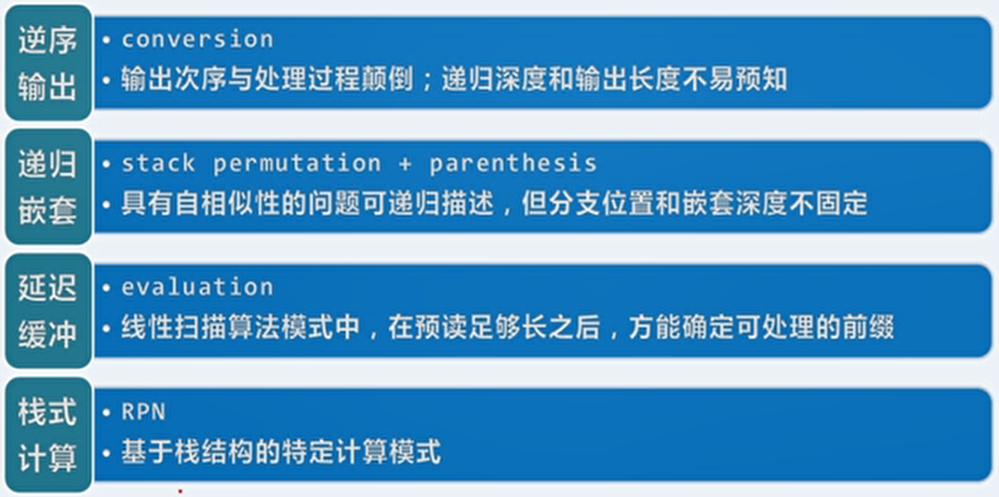
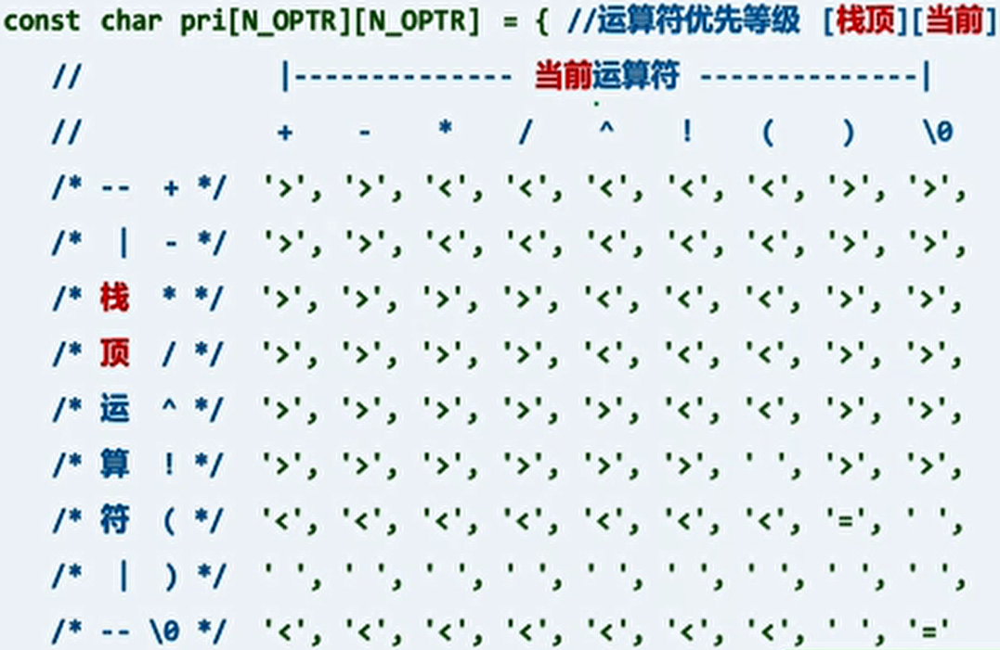

# 4、栈与队列

## 1、栈

- 栈（stack）是由一组元素组成的受限的线性序列。

  - 在一个时刻只有一个元素可以访问，而且这个元素是在栈的顶端（top），另一端成为盲端（bottom）。

  - 对元素的插入（push）和取出（pop）只能在栈的顶部进行。
  - 由于栈的特性，后入栈的先出栈。

- 栈属于序列的特例，可以直接基于向量或列表派生。实现：

  ```c++
  template <typemname T>
  class stack public Vector<T>{	//继承Vector，可直接使用Vector的方法
  public:
      void push(T const &e){	//入栈
          insert(size(), e);
      }
      T pop(){				//出栈
          return remove(size() - 1);
      }
      T top(){				//取栈顶元素
          return (*this)[size() - 1];
      }
  }
  ```

## 2、队列

- 队列（queue）是由一组元素组成的受限的线性序列。

  - 在一个时刻，只能在队尾插入（入队）：enqueue() 。
  - 同时，也只能在队头删除（出队）：dequeue() 。
  - 查询队头 rear() 和查询队尾 front() 。
  - 队列的特性是，先进先出，后进后出。

- 实现：可以基于向量或列表派生。

  ```c++
  template <typename T>
  class Queue: public List<T>{	//继承自列表
  public:
      void enqueue(T const &e){	//入队
          insertAsLast(e);
      }
      T dequeue(){			//出队
          return remove(first());
      }
      T &front(){				//队首
          return first()->data;
      }
  }
  ```

  

## 3、栈的应用

- 典型应用场合：逆序输出、递归嵌套、延迟缓冲和栈式计算。

  

- 进制转换 可作为逆序输出的实例：

  - 对所要转换的数字做短除法，将结果由底而上的拼接起来。

  - 实现：

    ```c++
    void convert(Stack<char> &s, _int64 n, int base){
        static char digit[] = {'0','1','2','3','4','5','6','7','8','9','A','B','C','D','E','F'};	//十六进制以内的符号
        while(n > 0){
            s.push(digit[n % base]);	//余数入栈
            n /= base;				//n更新为商
        }
    }
    main(){
        Stack<char> S;
        convert(S, n, base);
        while(!S.empty()){			//逆序输出
            printf("%c", S.pop());
        }
    }
    ```

- 括号匹配 可作为递归嵌套的实例：

  - 简化忽略除了括号外的其他字符。

  - 平凡：无括号的表达式是匹配的。

  - 减而治之：如果表达式 E 匹配，那么表达式 ( E ) 匹配。分而治之：如果表达式 E 和 F 匹配，那么 EF 匹配。但是减而治之和分而治之只提供了必要性，而问题的有效简化需要充分性。

  - 如果颠倒思路，如果表达式 L()R 匹配，那么表达式 LR 匹配。（注意推理方向和字符串长度与减而治之和分而治之的区别）

  - 顺序扫描表达式，用栈记录已经扫描的部分。如果遇到左括号 ( 则入栈，如果遇到右括号 ) 则将弹出一个栈顶的左括号（栈中只存储左括号）。如果字符串扫描完后栈不为空，或字符串未扫描完却向空栈请求弹出，则括号不匹配。

  - 实现：

    ```c++
    bool paren(const char exp[], int lo, int hi){
        Stack<char> S;
        for(int i=li; i<hi; i++){
            if(exp[i] == '('){
                S.push(exp[i]);
            } else if(!S.empty()){	//遇右括号先判断栈是否已空
                S.pop();
            } else {
                return false;
            }
        }
        return S.empty();	//字符串匹配完毕时栈是否为空
    }
    ```

  - 如果只有一种括号，借用栈的思想，我们可以用一个计数器 n （初始化为0，实际上记录的是栈的规模）。从左到右扫描，遇到左括号加一，遇到右括号减一，如果过程中为负或者最后不为0则不匹配。

  - 如果有多种括号，仍然可以用栈的思想（匹配相同类型的栈顶左括号），但是多个计数器无法完成实现。

- 栈混洗 ：对栈中的元素进行重新排列的一种方式。

  - 限制条件：将栈 A 中的元素混洗至栈 B 中。设置一个中转站栈 S 。只允许两种操作，将 A 的顶元素弹出并压入 S ，或将 S 的顶元素弹出并压入 B 。这样将 A 中的元素全部转入 B 中，B 成为 A的一个栈混洗。
  - 对于长度为 n 的栈的输入序列，可能得到的栈混洗种类数 SP(n) 为卡特兰数 `SP(n)=catalan(n)=(2n)!/(n+1)!/n!`。
    - 对于栈 A 中的初始顶元素 m，其可能是第 k 个压入栈 B 的元素，而且此时栈 S 为空。
    - 此时栈 B 中除 m 外有 k - 1 个元素，栈 A 中有 n - k 个元素。两者的栈混洗种类数相互独立，且当 k 为定值时可得到  `SP(k-1)*SP(n-k)` 种栈混洗。
    - 则对所有 k 的取值求和，得到递推式：`SP(n)=sigma k(1<=k<=n)(SP(k-1)*SP(n-k))`。
  - 如何甄别输入序列的任一序列是否为栈混洗：
    - 对于任意三个元素是否能按某相对次序出现在混洗中，与其他元素无关。
    - 对于栈 A 中任意位置的三个元素 < ... i, j ,k ... ] ，存在顺序 [ ... k, i, j ... > 的，一定不是栈混洗。时间复杂度 O(n^3)。
    - 可以证明这个条件是一个充要条件。
    - 事实上可以得到一个 O(n) 的算法。即模拟混洗过程。即每次将栈 B 中所要压入的下一个元素，必须将其置为 S 中的顶元素，否则无法混洗为目标序列。
    - 每次 S 出栈之前，检测 S 是否为空，或者所要弹出的元素在 S 中但不是顶元素。
  - 每一栈混洗都对应于栈 S 的 n 次 push 和 n 次 pop 操作。这与括号匹配的算法是一致的。也就是说，规模为 n 的栈每个栈混洗操作序列都对应于 n 个括号的一种匹配方式。规模为 n 的栈的栈混洗种类数 SP(n) 就等于 n 个括号的匹配方式数。
  
- 中缀表达式 可作为延迟缓冲的实例：

  - 是一个通用的算术或逻辑公式表示方法， 操作符是以中缀形式处于操作数的中间。

  - 使用运算数和运算符栈分别存储表达式中的运算数与运算符。

  - 使用一个数组存储不同运算符的优先级。

    

  - 实现：

    ```c++
    float evaluate(char* S){	//指针S指向所要进行运算的中缀表达式
        Stack<char> opnd;	//运算数栈
        Stack<char> optr;	//运算符栈
        optr.push('\0');	//运算符的头尾都有哨兵'\0'
        while(!optr.empty()){	//运算我栈为空时结束，只有到达尾哨兵'\0'后才会清空
            if(isdigit(*S)){		//如果指向的是数字，则压入运算数栈
                /*readNumber()是将运算数压入运算数栈，同时要处理多位数字的情况，此时需要先将前一位数字弹栈然后乘十后加上后一位数字再入栈*/
                readNumber(S, opnd);
            } else {				//如果指向的是运算符，则需要判断当前运算符与运算符栈栈顶元素的优先级
                //orderBetween()是利用制好的表比较运算符的优先级
                switch(orderBetween(optr.top(), *S)){
                    case '<':			//如果栈顶的运算符优先级低，则将新运算符入栈，指针后移
                        optr.push(*S);
                        S++;
                        break;
                    case '=':			/*如果优先级相等（在目前定义的运算符中只会出现在左右括号和左右哨兵的情况下），左右括号的功能已经完成，将左括号弹栈并将指针后移跨过右括号*/
                        optr.pop();
                        S++;
                        break;
                    case '>':			/*如果栈顶的运算符优先级高，则先将指针停在此时指向的运算符不动。注意：对于栈顶的运算符优先级高的情况，指针指向的位置不变。*/
                        char op = optr.pop();	//首先将运算符栈顶弹出
                        if('!' == op){			/*根据是一元还是二元运算符，从运算数栈中弹出一个或两个运算数，通过calca()的重载方法进行计算*/
                            opnd.push(calcu(op, opnd.pop()));
                        } else {
                            float pOpnd2 = opnd.pop(), Popnd1 = opnd.pop();
                            opnd.push(calcu(pOpnd1, op, pOpnd2)); 
                        }
                        break;       
                }
            }
        }
        return opnd.pop();		//最后运算数栈中的唯一一个元素就是结果
    }
    ```

- 逆波兰表达式（RPN）：

  - 在由运算符和操作数组成的表达式中，不使用括号也不需要使用约定的优先级关系，即可表示带优先级的运算关系。使用运算符的位置表征优先级。

  - 对于运算数，直接入栈。不分运算符和运算数，只需要一个栈。

  - 对于运算符，需要几个操作数，则从栈中取出几个操作数进行运算，并将结果入栈。

  - 手动从中缀表达式转换为逆波兰表达式：

    1. 用括号显式的表达所有运算符的优先级。
    2. 将运算符移到所对应的右括号之后。
    3. 抹去所有括号并整理。
    4. 运算符的相对位置可能会发生变化，但运算数的位置不会发生变化。

  - 从中缀表达式转换为逆波兰表达式的实现：可以通过之前中缀表达式的实现。

    ```c++
    float infix2postfix(char* S, char* &RPN){	//输入S转换为RPN
        Stack<char> opnd;	
        Stack<char> optr;	
        optr.push('\0');	
        while(!optr.empty()){	
            if(isdigit(*S)){		
                readNumber(S, opnd);
                append(RPN, opnd.top());	//运算数接入RPN
            } else {			
                switch(orderBetween(optr.top(), *S)){
                    case '<':			
                        optr.push(*S);
                        S++;
                        break;
                    case '=':		
                        optr.pop();
                        S++;
                        break;
                    case '>':			
                        char op = optr.pop();
                        append(RPN, op);	//运算符接入RPN
                        if('!' == op){			
                            opnd.push(calcu(op, opnd.pop()));
                        } else {
                            float pOpnd2 = opnd.pop(), Popnd1 = opnd.pop();
                            opnd.push(calcu(pOpnd1, op, pOpnd2)); 
                        }
                        break;       
                }
            }
        }
        return opnd.pop();		//最后运算数栈中的唯一一个元素就是结果
    }
    ```

    因为 RPN 的思想就是，把运算符放置在可以直接用之前的运算数进行运算时的位置。所以在原本中缀表达式的算法中，在满足运算符运算条件时，就是该运算符在 RPN 中的位置。

